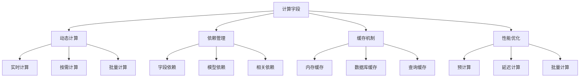

# 计算字段机制

## 🎯 学习目标
- 深入理解Odoo计算字段的工作原理
- 掌握计算字段的定义、依赖和优化
- 学会使用计算字段实现复杂业务逻辑

## 🧮 计算字段基础

### 计算字段概念
计算字段是Odoo中一种特殊的字段类型，其值不是直接存储在数据库中，而是通过计算方法动态计算得出。

### 计算字段特点


## 📊 基础计算字段

### 简单计算字段
```python
class BasicComputedFields(models.Model):
    _name = 'basic.computed.fields'
    
    # 基础字段
    amount1 = fields.Float('金额1')
    amount2 = fields.Float('金额2')
    quantity = fields.Integer('数量')
    
    # 简单计算字段
    @api.depends('amount1', 'amount2')
    def _compute_total(self):
        for record in self:
            record.total = record.amount1 + record.amount2
    
    total = fields.Float('总计', compute='_compute_total', store=True)
    
    # 条件计算字段
    @api.depends('total', 'quantity')
    def _compute_unit_price(self):
        for record in self:
            if record.quantity > 0:
                record.unit_price = record.total / record.quantity
            else:
                record.unit_price = 0
    
    unit_price = fields.Float('单价', compute='_compute_unit_price', store=True)
    
    # 字符串计算字段
    @api.depends('amount1', 'amount2')
    def _compute_display_name(self):
        for record in self:
            record.display_name = f"总计: {record.amount1 + record.amount2}"
    
    display_name = fields.Char('显示名称', compute='_compute_display_name', store=True)
```

### 布尔计算字段
```python
class BooleanComputedFields(models.Model):
    _name = 'boolean.computed.fields'
    
    # 基础字段
    name = fields.Char('名称')
    amount = fields.Float('金额')
    state = fields.Selection([
        ('draft', '草稿'),
        ('confirmed', '已确认'),
        ('done', '完成'),
    ], string='状态')
    
    # 布尔计算字段
    @api.depends('name', 'amount')
    def _compute_is_valid(self):
        for record in self:
            record.is_valid = bool(record.name and record.amount > 0)
    
    is_valid = fields.Boolean('是否有效', compute='_compute_is_valid', store=True)
    
    # 状态计算字段
    @api.depends('state')
    def _compute_is_active(self):
        for record in self:
            record.is_active = record.state in ['confirmed', 'done']
    
    is_active = fields.Boolean('是否活跃', compute='_compute_is_active', store=True)
    
    # 条件计算字段
    @api.depends('amount')
    def _compute_is_high_value(self):
        for record in self:
            record.is_high_value = record.amount > 10000
    
    is_high_value = fields.Boolean('是否高价值', compute='_compute_is_high_value', store=True)
```

## 🔗 关联计算字段

### 一对多关系计算
```python
class One2manyComputedFields(models.Model):
    _name = 'one2many.computed.fields'
    
    name = fields.Char('名称')
    line_ids = fields.One2many('one2many.computed.fields.line', 'parent_id', string='明细行')
    
    # 计算明细行数量
    @api.depends('line_ids')
    def _compute_line_count(self):
        for record in self:
            record.line_count = len(record.line_ids)
    
    line_count = fields.Integer('明细行数量', compute='_compute_line_count', store=True)
    
    # 计算明细行总金额
    @api.depends('line_ids.amount')
    def _compute_total_amount(self):
        for record in self:
            record.total_amount = sum(record.line_ids.mapped('amount'))
    
    total_amount = fields.Float('总金额', compute='_compute_total_amount', store=True)
    
    # 计算平均金额
    @api.depends('line_ids.amount', 'line_count')
    def _compute_average_amount(self):
        for record in self:
            if record.line_count > 0:
                record.average_amount = record.total_amount / record.line_count
            else:
                record.average_amount = 0
    
    average_amount = fields.Float('平均金额', compute='_compute_average_amount', store=True)
    
    # 计算最大金额
    @api.depends('line_ids.amount')
    def _compute_max_amount(self):
        for record in self:
            if record.line_ids:
                record.max_amount = max(record.line_ids.mapped('amount'))
            else:
                record.max_amount = 0
    
    max_amount = fields.Float('最大金额', compute='_compute_max_amount', store=True)

class One2manyComputedFieldsLine(models.Model):
    _name = 'one2many.computed.fields.line'
    
    name = fields.Char('名称')
    amount = fields.Float('金额')
    parent_id = fields.Many2one('one2many.computed.fields', string='父记录', required=True, ondelete='cascade')
```

### 多对多关系计算
```python
class Many2manyComputedFields(models.Model):
    _name = 'many2many.computed.fields'
    
    name = fields.Char('名称')
    tag_ids = fields.Many2many('many2many.computed.fields.tag', string='标签')
    
    # 计算标签数量
    @api.depends('tag_ids')
    def _compute_tag_count(self):
        for record in self:
            record.tag_count = len(record.tag_ids)
    
    tag_count = fields.Integer('标签数量', compute='_compute_tag_count', store=True)
    
    # 计算标签名称
    @api.depends('tag_ids.name')
    def _compute_tag_names(self):
        for record in self:
            record.tag_names = ', '.join(record.tag_ids.mapped('name'))
    
    tag_names = fields.Char('标签名称', compute='_compute_tag_names', store=True)
    
    # 计算是否有特定标签
    @api.depends('tag_ids')
    def _compute_has_priority_tag(self):
        for record in self:
            record.has_priority_tag = any(tag.priority for tag in record.tag_ids)
    
    has_priority_tag = fields.Boolean('是否有优先标签', compute='_compute_has_priority_tag', store=True)

class Many2manyComputedFieldsTag(models.Model):
    _name = 'many2many.computed.fields.tag'
    
    name = fields.Char('名称')
    priority = fields.Boolean('优先')
    model_ids = fields.Many2many('many2many.computed.fields', string='模型')
```

## 🔄 反向计算字段

### 反向计算方法
```python
class InverseComputedFields(models.Model):
    _name = 'inverse.computed.fields'
    
    name = fields.Char('名称')
    amount = fields.Float('金额')
    quantity = fields.Integer('数量')
    
    # 计算字段
    @api.depends('amount', 'quantity')
    def _compute_total(self):
        for record in self:
            record.total = record.amount * record.quantity
    
    # 反向计算方法
    def _inverse_total(self):
        for record in self:
            if record.quantity > 0:
                record.amount = record.total / record.quantity
    
    total = fields.Float('总计', compute='_compute_total', inverse='_inverse_total', store=True)
    
    # 计算字段
    @api.depends('name')
    def _compute_display_name(self):
        for record in self:
            record.display_name = f"记录: {record.name}"
    
    # 反向计算方法
    def _inverse_display_name(self):
        for record in self:
            if record.display_name.startswith('记录: '):
                record.name = record.display_name[4:]
    
    display_name = fields.Char('显示名称', compute='_compute_display_name', inverse='_inverse_display_name', store=True)
```

## 🔍 搜索计算字段

### 搜索方法实现
```python
class SearchComputedFields(models.Model):
    _name = 'search.computed.fields'
    
    name = fields.Char('名称')
    amount = fields.Float('金额')
    quantity = fields.Integer('数量')
    
    # 计算字段
    @api.depends('amount', 'quantity')
    def _compute_total(self):
        for record in self:
            record.total = record.amount * record.quantity
    
    # 搜索方法
    def _search_total(self, operator, value):
        if operator == '=':
            return [('amount', '>', 0), ('quantity', '>', 0)]
        elif operator == '>':
            return [('amount', '>', value / 10)]  # 假设quantity平均为10
        elif operator == '<':
            return [('amount', '<', value / 10)]
        else:
            return []
    
    total = fields.Float('总计', compute='_compute_total', search='_search_total', store=True)
    
    # 计算字段
    @api.depends('name')
    def _compute_search_name(self):
        for record in self:
            record.search_name = record.name.upper() if record.name else ''
    
    # 搜索方法
    def _search_search_name(self, operator, value):
        if operator == 'ilike':
            return [('name', 'ilike', value.upper())]
        elif operator == '=':
            return [('name', '=', value.upper())]
        else:
            return []
    
    search_name = fields.Char('搜索名称', compute='_compute_search_name', search='_search_search_name', store=True)
```

## ⚡ 性能优化

### 预计算优化
```python
class PrecomputedFields(models.Model):
    _name = 'precomputed.fields'
    
    name = fields.Char('名称')
    amount = fields.Float('金额')
    quantity = fields.Integer('数量')
    
    # 预计算字段
    @api.depends('amount', 'quantity')
    def _compute_total(self):
        for record in self:
            record.total = record.amount * record.quantity
    
    total = fields.Float('总计', compute='_compute_total', store=True, precompute=True)
    
    # 延迟计算字段
    @api.depends('total')
    def _compute_display_total(self):
        for record in self:
            record.display_total = f"总计: {record.total:.2f}"
    
    display_total = fields.Char('显示总计', compute='_compute_display_total', store=False)
    
    # 批量计算优化
    def batch_compute_totals(self):
        records = self.search([])
        for record in records:
            record._compute_total()
```

### 缓存优化
```python
class CachedComputedFields(models.Model):
    _name = 'cached.computed.fields'
    
    name = fields.Char('名称')
    amount = fields.Float('金额')
    
    # 使用缓存的计算字段
    @api.depends('amount')
    def _compute_cached_total(self):
        for record in self:
            # 使用缓存避免重复计算
            cache_key = f"total_{record.id}_{record.amount}"
            if cache_key in self.env.cache:
                record.cached_total = self.env.cache[cache_key]
            else:
                # 复杂计算逻辑
                result = record.amount * 1.1
                self.env.cache[cache_key] = result
                record.cached_total = result
    
    cached_total = fields.Float('缓存总计', compute='_compute_cached_total', store=True)
    
    # 清理缓存
    def clear_cache(self):
        self.env.cache.clear()
```

## 🎯 高级计算字段

### 递归计算字段
```python
class RecursiveComputedFields(models.Model):
    _name = 'recursive.computed.fields'
    
    name = fields.Char('名称')
    parent_id = fields.Many2one('recursive.computed.fields', string='父记录')
    child_ids = fields.One2many('recursive.computed.fields', 'parent_id', string='子记录')
    amount = fields.Float('金额')
    
    # 递归计算总金额
    @api.depends('amount', 'child_ids.total_amount')
    def _compute_total_amount(self):
        for record in self:
            record.total_amount = record.amount + sum(record.child_ids.mapped('total_amount'))
    
    total_amount = fields.Float('总金额', compute='_compute_total_amount', store=True)
    
    # 计算层级深度
    @api.depends('parent_id')
    def _compute_level(self):
        for record in self:
            if record.parent_id:
                record.level = record.parent_id.level + 1
            else:
                record.level = 0
    
    level = fields.Integer('层级', compute='_compute_level', store=True)
```

### 条件计算字段
```python
class ConditionalComputedFields(models.Model):
    _name = 'conditional.computed.fields'
    
    name = fields.Char('名称')
    type = fields.Selection([
        ('type1', '类型1'),
        ('type2', '类型2'),
        ('type3', '类型3'),
    ], string='类型')
    amount = fields.Float('金额')
    rate = fields.Float('费率')
    
    # 条件计算字段
    @api.depends('type', 'amount', 'rate')
    def _compute_conditional_total(self):
        for record in self:
            if record.type == 'type1':
                record.conditional_total = record.amount * 1.1
            elif record.type == 'type2':
                record.conditional_total = record.amount * record.rate
            elif record.type == 'type3':
                record.conditional_total = record.amount * 0.9
            else:
                record.conditional_total = record.amount
    
    conditional_total = fields.Float('条件总计', compute='_compute_conditional_total', store=True)
    
    # 动态计算字段
    @api.depends('type')
    def _compute_dynamic_field(self):
        for record in self:
            if record.type == 'type1':
                record.dynamic_field = '类型1专用字段'
            elif record.type == 'type2':
                record.dynamic_field = '类型2专用字段'
            else:
                record.dynamic_field = '默认字段'
    
    dynamic_field = fields.Char('动态字段', compute='_compute_dynamic_field', store=True)
```

## 🔧 计算字段最佳实践

### 性能优化建议
```python
class BestPracticesComputedFields(models.Model):
    _name = 'best.practices.computed.fields'
    
    name = fields.Char('名称')
    amount = fields.Float('金额')
    quantity = fields.Integer('数量')
    
    # 1. 使用store=True存储计算结果
    @api.depends('amount', 'quantity')
    def _compute_total(self):
        for record in self:
            record.total = record.amount * record.quantity
    
    total = fields.Float('总计', compute='_compute_total', store=True)
    
    # 2. 合理设置依赖关系
    @api.depends('total')
    def _compute_display_total(self):
        for record in self:
            record.display_total = f"总计: {record.total:.2f}"
    
    display_total = fields.Char('显示总计', compute='_compute_display_total', store=True)
    
    # 3. 避免在计算字段中进行复杂查询
    @api.depends('name')
    def _compute_simple_field(self):
        for record in self:
            # 简单计算，避免数据库查询
            record.simple_field = len(record.name) if record.name else 0
    
    simple_field = fields.Integer('简单字段', compute='_compute_simple_field', store=True)
    
    # 4. 使用批量操作优化性能
    def batch_compute_all(self):
        records = self.search([])
        for record in records:
            record._compute_total()
            record._compute_display_total()
            record._compute_simple_field()
```

### 错误处理
```python
class ErrorHandlingComputedFields(models.Model):
    _name = 'error.handling.computed.fields'
    
    amount = fields.Float('金额')
    quantity = fields.Integer('数量')
    
    # 错误处理的计算字段
    @api.depends('amount', 'quantity')
    def _compute_safe_total(self):
        for record in self:
            try:
                if record.quantity and record.quantity > 0:
                    record.safe_total = record.amount / record.quantity
                else:
                    record.safe_total = 0
            except (ZeroDivisionError, TypeError):
                record.safe_total = 0
    
    safe_total = fields.Float('安全总计', compute='_compute_safe_total', store=True)
    
    # 验证计算字段
    @api.constrains('safe_total')
    def _check_safe_total(self):
        for record in self:
            if record.safe_total < 0:
                raise ValidationError('安全总计不能为负数')
```

## 🔗 相关链接

### 下一步学习
- [[字段验证机制]] - 学习字段验证
- [[数据操作技巧]] - 掌握数据操作
- [[性能优化策略]] - 了解性能优化

### 实践建议
- 多练习计算字段定义
- 熟悉依赖关系管理
- 掌握性能优化技巧

## 📝 思考题

### 基础理解
1. 计算字段的工作原理是什么？
2. 如何设置计算字段的依赖关系？
3. 计算字段的性能优化方法有哪些？

### 深入思考
1. 如何设计复杂的计算字段？
2. 计算字段的错误处理如何实现？
3. 如何优化计算字段的查询性能？

---

**学习进度**: ✅ 已完成  
**下一步**: [[字段验证机制]]

