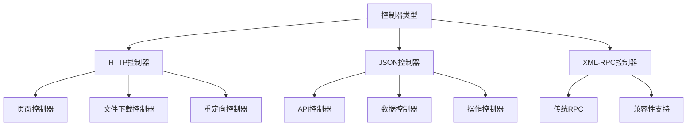

# 控制器开发

## 🎯 学习目标
- 掌握Odoo控制器开发的基本概念和方法
- 学会创建HTTP和JSON控制器
- 理解控制器的路由、认证和权限管理

## 🌐 控制器基础

### 控制器概念
控制器是Odoo中处理HTTP请求的组件，负责接收客户端请求并返回响应。

### 控制器类型


## 📁 控制器文件结构

### 控制器目录
```
controllers/
├── __init__.py              # 控制器初始化
├── main.py                  # 主控制器
├── api.py                   # API控制器
├── website.py               # 网站控制器
└── auth.py                  # 认证控制器
```

### 控制器初始化
```python
# controllers/__init__.py
from . import main
from . import api
from . import website
from . import auth
```

## 🔧 基础控制器

### 主控制器
```python
# controllers/main.py
from odoo import http
from odoo.http import request
import json

class MainController(http.Controller):
    
    # HTTP页面控制器
    @http.route('/my_module/page', type='http', auth='user', website=True)
    def my_page(self, **kwargs):
        """显示自定义页面"""
        return request.render('my_module.my_page_template', {
            'title': '我的页面',
            'data': 'Hello World',
            'user': request.env.user,
        })
    
    # 文件下载控制器
    @http.route('/my_module/download/<int:record_id>', type='http', auth='user')
    def download_file(self, record_id, **kwargs):
        """下载文件"""
        record = request.env['my.model'].browse(record_id)
        if not record.exists():
            return request.not_found()
        
        file_content = record.generate_file()
        return request.make_response(
            file_content,
            headers=[
                ('Content-Type', 'application/octet-stream'),
                ('Content-Disposition', f'attachment; filename="{record.name}.txt"')
            ]
        )
    
    # 重定向控制器
    @http.route('/my_module/redirect', type='http', auth='user')
    def redirect_page(self, **kwargs):
        """重定向到其他页面"""
        return request.redirect('/web')
    
    # 带参数的控制器
    @http.route('/my_module/page/<int:record_id>', type='http', auth='user', website=True)
    def page_with_param(self, record_id, **kwargs):
        """带参数的页面"""
        record = request.env['my.model'].browse(record_id)
        if not record.exists():
            return request.not_found()
        
        return request.render('my_module.record_page_template', {
            'record': record,
            'title': f'记录: {record.name}',
        })
```

### 控制器装饰器参数
| 参数 | 说明 | 示例 |
|------|------|------|
| type | 请求类型 | 'http', 'json' |
| auth | 认证方式 | 'user', 'public', 'none' |
| website | 是否网站页面 | True, False |
| methods | HTTP方法 | ['GET', 'POST'] |
| csrf | CSRF保护 | True, False |

## 🔌 JSON API控制器

### API控制器
```python
# controllers/api.py
from odoo import http
from odoo.http import request
import json
import logging

_logger = logging.getLogger(__name__)

class ApiController(http.Controller):
    
    # 获取数据API
    @http.route('/api/v1/my_module/data', type='json', auth='user', methods=['GET'])
    def get_data(self, **kwargs):
        """获取数据API"""
        try:
            # 获取参数
            limit = kwargs.get('limit', 100)
            offset = kwargs.get('offset', 0)
            domain = kwargs.get('domain', [])
            
            # 查询数据
            records = request.env['my.model'].search(domain, limit=limit, offset=offset)
            
            # 格式化数据
            data = []
            for record in records:
                data.append({
                    'id': record.id,
                    'name': record.name,
                    'code': record.code,
                    'amount': record.amount,
                    'state': record.state,
                    'create_date': record.create_date.isoformat() if record.create_date else None,
                })
            
            return {
                'status': 'success',
                'data': data,
                'total': len(data),
                'limit': limit,
                'offset': offset,
            }
        except Exception as e:
            _logger.error(f"API错误: {str(e)}")
            return {
                'status': 'error',
                'message': str(e)
            }
    
    # 创建数据API
    @http.route('/api/v1/my_module/data', type='json', auth='user', methods=['POST'])
    def create_data(self, **kwargs):
        """创建数据API"""
        try:
            # 获取数据
            data = kwargs.get('data', {})
            
            # 验证数据
            if not data.get('name'):
                return {
                    'status': 'error',
                    'message': '名称不能为空'
                }
            
            # 创建记录
            record = request.env['my.model'].create(data)
            
            return {
                'status': 'success',
                'id': record.id,
                'message': '创建成功'
            }
        except Exception as e:
            _logger.error(f"创建错误: {str(e)}")
            return {
                'status': 'error',
                'message': str(e)
            }
    
    # 更新数据API
    @http.route('/api/v1/my_module/data/<int:record_id>', type='json', auth='user', methods=['PUT'])
    def update_data(self, record_id, **kwargs):
        """更新数据API"""
        try:
            # 获取记录
            record = request.env['my.model'].browse(record_id)
            if not record.exists():
                return {
                    'status': 'error',
                    'message': '记录不存在'
                }
            
            # 获取数据
            data = kwargs.get('data', {})
            
            # 更新记录
            record.write(data)
            
            return {
                'status': 'success',
                'message': '更新成功'
            }
        except Exception as e:
            _logger.error(f"更新错误: {str(e)}")
            return {
                'status': 'error',
                'message': str(e)
            }
    
    # 删除数据API
    @http.route('/api/v1/my_module/data/<int:record_id>', type='json', auth='user', methods=['DELETE'])
    def delete_data(self, record_id, **kwargs):
        """删除数据API"""
        try:
            # 获取记录
            record = request.env['my.model'].browse(record_id)
            if not record.exists():
                return {
                    'status': 'error',
                    'message': '记录不存在'
                }
            
            # 删除记录
            record.unlink()
            
            return {
                'status': 'success',
                'message': '删除成功'
            }
        except Exception as e:
            _logger.error(f"删除错误: {str(e)}")
            return {
                'status': 'error',
                'message': str(e)
            }
```

## 🌐 网站控制器

### 网站页面控制器
```python
# controllers/website.py
from odoo import http
from odoo.http import request
from odoo.addons.website.controllers.main import Website

class WebsiteController(Website):
    
    # 继承网站首页
    @http.route('/', type='http', auth="public", website=True)
    def index(self, **kw):
        """自定义首页"""
        # 调用父类方法
        result = super().index(**kw)
        
        # 添加自定义数据
        if hasattr(result, 'qcontext'):
            result.qcontext.update({
                'custom_data': '自定义数据',
                'featured_products': request.env['product.product'].search([('website_published', '=', True)], limit=6)
            })
        
        return result
    
    # 自定义页面
    @http.route('/my_module/custom_page', type='http', auth='public', website=True)
    def custom_page(self, **kwargs):
        """自定义页面"""
        return request.render('my_module.custom_page_template', {
            'title': '自定义页面',
            'content': '这是自定义页面内容',
        })
    
    # 带搜索的页面
    @http.route('/my_module/search', type='http', auth='public', website=True)
    def search_page(self, **kwargs):
        """搜索页面"""
        search_term = kwargs.get('q', '')
        page = int(kwargs.get('page', 1))
        limit = 20
        offset = (page - 1) * limit
        
        # 搜索数据
        domain = []
        if search_term:
            domain.append(('name', 'ilike', search_term))
        
        records = request.env['my.model'].search(domain, limit=limit, offset=offset)
        total = request.env['my.model'].search_count(domain)
        
        return request.render('my_module.search_page_template', {
            'title': '搜索结果',
            'search_term': search_term,
            'records': records,
            'total': total,
            'page': page,
            'limit': limit,
            'pages': (total + limit - 1) // limit,
        })
    
    # 表单提交处理
    @http.route('/my_module/contact', type='http', auth='public', website=True, csrf=False)
    def contact_form(self, **kwargs):
        """联系表单"""
        if request.httprequest.method == 'POST':
            # 处理表单提交
            name = kwargs.get('name')
            email = kwargs.get('email')
            message = kwargs.get('message')
            
            if name and email and message:
                # 创建联系记录
                request.env['my.contact'].create({
                    'name': name,
                    'email': email,
                    'message': message,
                })
                
                return request.render('my_module.contact_success_template', {
                    'title': '提交成功',
                    'message': '感谢您的留言，我们会尽快回复。',
                })
            else:
                return request.render('my_module.contact_form_template', {
                    'title': '联系我们',
                    'error': '请填写所有必填字段',
                    'form_data': kwargs,
                })
        
        return request.render('my_module.contact_form_template', {
            'title': '联系我们',
        })
```

## 🔐 认证控制器

### 认证和权限
```python
# controllers/auth.py
from odoo import http
from odoo.http import request
from odoo.exceptions import AccessError
import json

class AuthController(http.Controller):
    
    # 公开API
    @http.route('/api/v1/public/data', type='json', auth='public', methods=['GET'])
    def public_data(self, **kwargs):
        """公开数据API"""
        # 只返回公开数据
        records = request.env['my.model'].search([('is_public', '=', True)])
        
        data = []
        for record in records:
            data.append({
                'id': record.id,
                'name': record.name,
                'description': record.description,
            })
        
        return {
            'status': 'success',
            'data': data
        }
    
    # 用户认证API
    @http.route('/api/v1/auth/login', type='json', auth='none', methods=['POST'])
    def login(self, **kwargs):
        """用户登录API"""
        try:
            # 获取登录信息
            login = kwargs.get('login')
            password = kwargs.get('password')
            
            if not login or not password:
                return {
                    'status': 'error',
                    'message': '用户名和密码不能为空'
                }
            
            # 验证用户
            uid = request.session.authenticate(request.session.db, login, password)
            if uid:
                return {
                    'status': 'success',
                    'uid': uid,
                    'message': '登录成功'
                }
            else:
                return {
                    'status': 'error',
                    'message': '用户名或密码错误'
                }
        except Exception as e:
            return {
                'status': 'error',
                'message': str(e)
            }
    
    # 权限检查API
    @http.route('/api/v1/auth/check', type='json', auth='user', methods=['GET'])
    def check_permission(self, **kwargs):
        """权限检查API"""
        try:
            model = kwargs.get('model')
            operation = kwargs.get('operation', 'read')
            
            if not model:
                return {
                    'status': 'error',
                    'message': '模型名称不能为空'
                }
            
            # 检查权限
            if operation == 'read':
                has_permission = request.env.user.has_group('base.group_user')
            elif operation == 'write':
                has_permission = request.env.user.has_group('base.group_user')
            elif operation == 'create':
                has_permission = request.env.user.has_group('base.group_user')
            elif operation == 'unlink':
                has_permission = request.env.user.has_group('base.group_system')
            else:
                has_permission = False
            
            return {
                'status': 'success',
                'has_permission': has_permission,
                'user': request.env.user.name,
                'groups': [g.name for g in request.env.user.groups_id]
            }
        except Exception as e:
            return {
                'status': 'error',
                'message': str(e)
            }
    
    # 管理员专用API
    @http.route('/api/v1/admin/data', type='json', auth='user', methods=['GET'])
    def admin_data(self, **kwargs):
        """管理员数据API"""
        # 检查管理员权限
        if not request.env.user.has_group('base.group_system'):
            raise AccessError('需要管理员权限')
        
        # 返回管理员数据
        records = request.env['my.model'].search([])
        
        data = []
        for record in records:
            data.append({
                'id': record.id,
                'name': record.name,
                'code': record.code,
                'amount': record.amount,
                'state': record.state,
                'create_uid': record.create_uid.name,
                'create_date': record.create_date.isoformat() if record.create_date else None,
            })
        
        return {
            'status': 'success',
            'data': data,
            'total': len(data)
        }
```

## 📊 数据控制器

### 数据处理控制器
```python
# controllers/data.py
from odoo import http
from odoo.http import request
import json
import csv
import io

class DataController(http.Controller):
    
    # 数据导出API
    @http.route('/api/v1/data/export', type='http', auth='user')
    def export_data(self, **kwargs):
        """导出数据"""
        try:
            # 获取参数
            format_type = kwargs.get('format', 'csv')
            domain = json.loads(kwargs.get('domain', '[]'))
            
            # 查询数据
            records = request.env['my.model'].search(domain)
            
            if format_type == 'csv':
                # 导出CSV
                output = io.StringIO()
                writer = csv.writer(output)
                
                # 写入标题
                writer.writerow(['ID', '名称', '编码', '金额', '状态'])
                
                # 写入数据
                for record in records:
                    writer.writerow([
                        record.id,
                        record.name,
                        record.code,
                        record.amount,
                        record.state,
                    ])
                
                # 返回文件
                output.seek(0)
                return request.make_response(
                    output.getvalue(),
                    headers=[
                        ('Content-Type', 'text/csv'),
                        ('Content-Disposition', 'attachment; filename="data.csv"')
                    ]
                )
            
            elif format_type == 'json':
                # 导出JSON
                data = []
                for record in records:
                    data.append({
                        'id': record.id,
                        'name': record.name,
                        'code': record.code,
                        'amount': record.amount,
                        'state': record.state,
                    })
                
                return request.make_response(
                    json.dumps(data, ensure_ascii=False, indent=2),
                    headers=[
                        ('Content-Type', 'application/json'),
                        ('Content-Disposition', 'attachment; filename="data.json"')
                    ]
                )
            
            else:
                return request.make_response('不支持的格式', status=400)
                
        except Exception as e:
            return request.make_response(f'导出错误: {str(e)}', status=500)
    
    # 数据导入API
    @http.route('/api/v1/data/import', type='json', auth='user', methods=['POST'])
    def import_data(self, **kwargs):
        """导入数据"""
        try:
            # 获取文件内容
            file_content = kwargs.get('file_content')
            format_type = kwargs.get('format', 'csv')
            
            if not file_content:
                return {
                    'status': 'error',
                    'message': '文件内容不能为空'
                }
            
            imported_count = 0
            error_count = 0
            errors = []
            
            if format_type == 'csv':
                # 解析CSV
                csv_reader = csv.reader(io.StringIO(file_content))
                headers = next(csv_reader)  # 跳过标题行
                
                for row_num, row in enumerate(csv_reader, start=2):
                    try:
                        if len(row) >= 4:  # 确保有足够的列
                            data = {
                                'name': row[1],
                                'code': row[2],
                                'amount': float(row[3]) if row[3] else 0,
                                'state': row[4] if len(row) > 4 else 'draft',
                            }
                            
                            # 创建记录
                            request.env['my.model'].create(data)
                            imported_count += 1
                        else:
                            errors.append(f'第{row_num}行: 数据不完整')
                            error_count += 1
                    except Exception as e:
                        errors.append(f'第{row_num}行: {str(e)}')
                        error_count += 1
            
            return {
                'status': 'success',
                'imported_count': imported_count,
                'error_count': error_count,
                'errors': errors[:10],  # 只返回前10个错误
            }
            
        except Exception as e:
            return {
                'status': 'error',
                'message': str(e)
            }
    
    # 批量操作API
    @http.route('/api/v1/data/batch', type='json', auth='user', methods=['POST'])
    def batch_operation(self, **kwargs):
        """批量操作"""
        try:
            # 获取参数
            operation = kwargs.get('operation')
            record_ids = kwargs.get('record_ids', [])
            data = kwargs.get('data', {})
            
            if not operation or not record_ids:
                return {
                    'status': 'error',
                    'message': '操作类型和记录ID不能为空'
                }
            
            # 获取记录
            records = request.env['my.model'].browse(record_ids)
            
            if operation == 'update':
                # 批量更新
                records.write(data)
                message = f'成功更新 {len(records)} 条记录'
            elif operation == 'delete':
                # 批量删除
                records.unlink()
                message = f'成功删除 {len(records)} 条记录'
            elif operation == 'archive':
                # 批量归档
                records.write({'active': False})
                message = f'成功归档 {len(records)} 条记录'
            elif operation == 'unarchive':
                # 批量取消归档
                records.write({'active': True})
                message = f'成功取消归档 {len(records)} 条记录'
            else:
                return {
                    'status': 'error',
                    'message': '不支持的操作类型'
                }
            
            return {
                'status': 'success',
                'message': message,
                'count': len(records)
            }
            
        except Exception as e:
            return {
                'status': 'error',
                'message': str(e)
            }
```

## 🔗 相关链接

### 下一步学习
- [[报表开发]] - 学习报表开发
- [[视图继承机制]] - 深入理解视图继承
- [[API设计规范]] - 掌握API设计

### 实践建议
- 多练习控制器开发
- 熟悉路由和认证
- 掌握错误处理

## 📝 思考题

### 基础理解
1. 控制器的基本概念是什么？
2. 如何设计RESTful API？
3. 认证和权限如何管理？

### 深入思考
1. 如何优化控制器性能？
2. 如何设计安全的API？
3. 如何处理大量数据请求？

---

**学习进度**: ✅ 已完成  
**下一步**: [[报表开发]]

