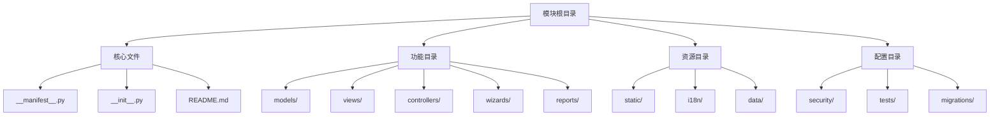

# 模块结构详解

## 🎯 学习目标
- 深入理解Odoo模块的完整结构
- 掌握模块文件的组织和管理
- 学会设计可维护的模块架构

## 📁 模块结构概览

### 标准模块结构


## 📋 核心文件详解

### 模块清单文件 (__manifest__.py)
```python
{
    # 基本信息
    'name': '模块名称',
    'version': '1.0.0',
    'category': '模块分类',
    'summary': '模块摘要',
    'description': '''
        模块详细描述
        支持多行文本
        可以使用HTML标签
    ''',
    
    # 作者信息
    'author': '作者姓名',
    'website': '作者网站',
    'license': 'LGPL-3',
    'maintainer': '维护者',
    
    # 依赖关系
    'depends': ['base', 'sale', 'purchase'],
    'external_dependencies': {
        'python': ['requests', 'pandas', 'numpy'],
        'bin': ['wkhtmltopdf', 'node']
    },
    
    # 数据文件
    'data': [
        'security/ir.model.access.csv',
        'security/groups.xml',
        'data/base_data.xml',
        'views/base_views.xml',
        'reports/report_views.xml',
    ],
    
    # 演示数据
    'demo': [
        'demo/demo_data.xml',
    ],
    
    # 安装配置
    'installable': True,
    'auto_install': False,
    'application': True,
    
    # 初始化钩子
    'post_init_hook': 'post_init_check',
    'uninstall_hook': 'uninstall_cleanup',
    'pre_init_hook': 'pre_init_setup',
    
    # 资源文件
    'images': ['static/description/banner.png'],
    'assets': {
        'web.assets_backend': [
            'my_module/static/src/css/my_module.css',
            'my_module/static/src/js/my_module.js',
        ],
        'web.assets_frontend': [
            'my_module/static/src/css/frontend.css',
        ],
    },
    
    # 序列号
    'sequence': 100,
    
    # 价格信息
    'price': 0.0,
    'currency': 'EUR',
}
```

### 模块初始化文件 (__init__.py)
```python
# 导入模型
from . import models

# 导入控制器
from . import controllers

# 导入向导
from . import wizards

# 导入报表
from . import reports

# 导入测试
from . import tests

# 导入钩子函数
from .hooks import post_init_hook, uninstall_hook, pre_init_hook
```

## 🗄️ 功能目录详解

### models/ 目录
```
models/
├── __init__.py              # 模型初始化
├── base_model.py            # 基础模型
├── sale_model.py            # 销售模型
├── purchase_model.py        # 采购模型
├── wizard_model.py          # 向导模型
└── report_model.py          # 报表模型
```

#### 模型初始化文件
```python
# models/__init__.py
from . import base_model
from . import sale_model
from . import purchase_model
from . import wizard_model
from . import report_model
```

#### 模型文件示例
```python
# models/base_model.py
from odoo import models, fields, api
from odoo.exceptions import ValidationError

class BaseModel(models.Model):
    _name = 'my.base.model'
    _description = '基础模型'
    _inherit = ['mail.thread', 'mail.activity.mixin']
    _order = 'name'
    _rec_name = 'name'
    
    # 字段定义
    name = fields.Char('名称', required=True, tracking=True)
    code = fields.Char('编码', size=10, index=True)
    active = fields.Boolean('激活', default=True)
    
    # 计算方法
    @api.depends('field1', 'field2')
    def _compute_total(self):
        for record in self:
            record.total = record.field1 + record.field2
    
    total = fields.Float('总计', compute='_compute_total', store=True)
    
    # 约束方法
    @api.constrains('field1')
    def _check_field1(self):
        for record in self:
            if record.field1 < 0:
                raise ValidationError('字段1不能为负数')
    
    # 业务方法
    def action_do_something(self):
        self.ensure_one()
        # 业务逻辑
        pass
    
    # 重写方法
    @api.model
    def create(self, vals):
        # 创建前处理
        result = super().create(vals)
        # 创建后处理
        return result
    
    def write(self, vals):
        # 写入前处理
        result = super().write(vals)
        # 写入后处理
        return result
```

### views/ 目录
```
views/
├── base_views.xml           # 基础视图
├── sale_views.xml           # 销售视图
├── purchase_views.xml       # 采购视图
├── wizard_views.xml         # 向导视图
├── report_views.xml         # 报表视图
└── menu_views.xml           # 菜单视图
```

#### 视图文件示例
```xml
<!-- views/base_views.xml -->
<?xml version="1.0" encoding="utf-8"?>
<odoo>
    <!-- 动作定义 -->
    <record id="action_base_model" model="ir.actions.act_window">
        <field name="name">基础模型</field>
        <field name="res_model">my.base.model</field>
        <field name="view_mode">tree,form,kanban,graph,pivot</field>
        <field name="context">{}</field>
        <field name="help" type="html">
            <p class="o_view_nocontent_smiling_face">
                创建您的第一个记录
            </p>
        </field>
    </record>
    
    <!-- 菜单定义 -->
    <menuitem id="menu_base_model_root" name="基础模块" sequence="10"/>
    <menuitem id="menu_base_model" name="基础模型" parent="menu_base_model_root" action="action_base_model" sequence="10"/>
    
    <!-- 列表视图 -->
    <record id="view_base_model_tree" model="ir.ui.view">
        <field name="name">my.base.model.tree</field>
        <field name="model">my.base.model</field>
        <field name="arch" type="xml">
            <tree string="基础模型" decoration-info="state=='draft'" decoration-success="state=='done'">
                <field name="name"/>
                <field name="code"/>
                <field name="state"/>
                <field name="total"/>
                <field name="create_date"/>
            </tree>
        </field>
    </record>
    
    <!-- 表单视图 -->
    <record id="view_base_model_form" model="ir.ui.view">
        <field name="name">my.base.model.form</field>
        <field name="model">my.base.model</field>
        <field name="arch" type="xml">
            <form string="基础模型">
                <header>
                    <button name="action_do_something" string="执行操作" type="object" class="btn-primary"/>
                    <field name="state" widget="statusbar" statusbar_visible="draft,confirmed,done"/>
                </header>
                <sheet>
                    <div class="oe_title">
                        <h1>
                            <field name="name" placeholder="输入名称..."/>
                        </h1>
                    </div>
                    <group>
                        <group>
                            <field name="code"/>
                            <field name="active"/>
                        </group>
                        <group>
                            <field name="state"/>
                            <field name="total"/>
                        </group>
                    </group>
                </sheet>
            </form>
        </field>
    </record>
    
    <!-- 搜索视图 -->
    <record id="view_base_model_search" model="ir.ui.view">
        <field name="name">my.base.model.search</field>
        <field name="model">my.base.model</field>
        <field name="arch" type="xml">
            <search string="基础模型">
                <field name="name"/>
                <field name="code"/>
                <filter string="草稿" name="draft" domain="[('state', '=', 'draft')]"/>
                <filter string="已确认" name="confirmed" domain="[('state', '=', 'confirmed')]"/>
                <filter string="完成" name="done" domain="[('state', '=', 'done')]"/>
                <group expand="0" string="分组">
                    <filter string="状态" name="group_state" context="{'group_by': 'state'}"/>
                </group>
            </search>
        </field>
    </record>
</odoo>
```

### controllers/ 目录
```
controllers/
├── __init__.py              # 控制器初始化
├── main.py                  # 主控制器
├── api.py                   # API控制器
└── website.py               # 网站控制器
```

#### 控制器文件示例
```python
# controllers/__init__.py
from . import main
from . import api
from . import website

# controllers/main.py
from odoo import http
from odoo.http import request

class MainController(http.Controller):
    
    @http.route('/my_module/page', type='http', auth='user', website=True)
    def my_page(self, **kwargs):
        return request.render('my_module.my_page_template', {
            'data': 'Hello World'
        })
    
    @http.route('/my_module/api', type='json', auth='user')
    def my_api(self, **kwargs):
        return {'status': 'success', 'data': 'API Response'}

# controllers/api.py
from odoo import http
from odoo.http import request
import json

class ApiController(http.Controller):
    
    @http.route('/api/v1/my_module/data', type='http', auth='user', methods=['GET'])
    def get_data(self, **kwargs):
        try:
            # 获取数据
            data = request.env['my.base.model'].search([])
            result = []
            for record in data:
                result.append({
                    'id': record.id,
                    'name': record.name,
                    'code': record.code,
                })
            return json.dumps({'status': 'success', 'data': result})
        except Exception as e:
            return json.dumps({'status': 'error', 'message': str(e)})
    
    @http.route('/api/v1/my_module/data', type='http', auth='user', methods=['POST'])
    def create_data(self, **kwargs):
        try:
            data = json.loads(request.httprequest.data)
            record = request.env['my.base.model'].create(data)
            return json.dumps({'status': 'success', 'id': record.id})
        except Exception as e:
            return json.dumps({'status': 'error', 'message': str(e)})
```

### wizards/ 目录
```
wizards/
├── __init__.py              # 向导初始化
├── base_wizard.py           # 基础向导
├── sale_wizard.py           # 销售向导
└── report_wizard.py         # 报表向导
```

#### 向导文件示例
```python
# wizards/__init__.py
from . import base_wizard
from . import sale_wizard
from . import report_wizard

# wizards/base_wizard.py
from odoo import models, fields, api
from odoo.exceptions import UserError

class BaseWizard(models.TransientModel):
    _name = 'base.wizard'
    _description = '基础向导'
    
    name = fields.Char('名称', required=True)
    description = fields.Text('描述')
    date = fields.Date('日期', default=fields.Date.today)
    
    @api.model
    def default_get(self, fields_list):
        res = super().default_get(fields_list)
        # 设置默认值
        res['name'] = '默认名称'
        return res
    
    def action_confirm(self):
        self.ensure_one()
        # 执行操作
        if not self.name:
            raise UserError('名称不能为空')
        
        # 创建记录
        record = self.env['my.base.model'].create({
            'name': self.name,
            'description': self.description,
        })
        
        return {
            'type': 'ir.actions.act_window',
            'name': '创建的记录',
            'res_model': 'my.base.model',
            'res_id': record.id,
            'view_mode': 'form',
            'target': 'current',
        }
    
    def action_cancel(self):
        return {'type': 'ir.actions.act_window_close'}
```

### reports/ 目录
```
reports/
├── __init__.py              # 报表初始化
├── base_report.py           # 基础报表
├── sale_report.py           # 销售报表
└── purchase_report.py       # 采购报表
```

#### 报表文件示例
```python
# reports/__init__.py
from . import base_report
from . import sale_report
from . import purchase_report

# reports/base_report.py
from odoo import models, fields, api

class BaseReport(models.AbstractModel):
    _name = 'report.my_module.base_report'
    _description = '基础报表'
    
    @api.model
    def _get_report_values(self, docids, data=None):
        docs = self.env['my.base.model'].browse(docids)
        return {
            'doc_ids': docids,
            'doc_model': 'my.base.model',
            'docs': docs,
            'data': data,
        }
```

## 🔐 配置目录详解

### security/ 目录
```
security/
├── ir.model.access.csv      # 模型访问权限
├── ir.rule.csv              # 记录规则
├── groups.xml               # 用户组定义
└── security.xml             # 安全配置
```

#### 权限配置文件
```csv
# security/ir.model.access.csv
id,name,model_id:id,group_id:id,perm_read,perm_write,perm_create,perm_unlink
access_base_model,access_base_model,model_my_base_model,base.group_user,1,1,1,1
access_base_model_manager,access_base_model_manager,model_my_base_model,base.group_system,1,1,1,1
```

```csv
# security/ir.rule.csv
id,name,model_id:id,domain_force,perm_read,perm_write,perm_create,perm_unlink,global
rule_base_model_user,rule_base_model_user,model_my_base_model,[('create_uid', '=', user.id)],1,1,1,1,0
rule_base_model_manager,rule_base_model_manager,model_my_base_model,[],1,1,1,1,1
```

```xml
<!-- security/groups.xml -->
<?xml version="1.0" encoding="utf-8"?>
<odoo>
    <record id="group_base_model_user" model="res.groups">
        <field name="name">基础模型用户</field>
        <field name="category_id" ref="base.module_category_tools"/>
        <field name="implied_ids" eval="[(4, ref('base.group_user'))]"/>
    </record>
    
    <record id="group_base_model_manager" model="res.groups">
        <field name="name">基础模型管理员</field>
        <field name="category_id" ref="base.module_category_tools"/>
        <field name="implied_ids" eval="[(4, ref('group_base_model_user'))]"/>
    </record>
</odoo>
```

### data/ 目录
```
data/
├── base_data.xml            # 基础数据
├── demo_data.xml            # 演示数据
├── ir_sequence.xml          # 序列号配置
├── ir_cron.xml              # 定时任务
└── ir_config_parameter.xml  # 系统参数
```

#### 数据文件示例
```xml
<!-- data/base_data.xml -->
<?xml version="1.0" encoding="utf-8"?>
<odoo>
    <!-- 创建基础数据 -->
    <record id="base_data_1" model="my.base.model">
        <field name="name">基础数据1</field>
        <field name="code">BD001</field>
        <field name="state">confirmed</field>
    </record>
    
    <!-- 创建序列号 -->
    <record id="seq_base_model" model="ir.sequence">
        <field name="name">基础模型序列号</field>
        <field name="code">my.base.model</field>
        <field name="prefix">BM</field>
        <field name="padding">4</field>
        <field name="number_next">1</field>
        <field name="number_increment">1</field>
    </record>
</odoo>
```

## 🎨 资源目录详解

### static/ 目录
```
static/
├── description/             # 模块描述
│   ├── icon.png
│   ├── banner.png
│   └── index.html
├── src/                     # 源代码
│   ├── css/
│   │   ├── my_module.css
│   │   └── frontend.css
│   ├── js/
│   │   ├── my_module.js
│   │   └── frontend.js
│   └── xml/
│       └── templates.xml
└── tests/                   # 测试数据
    └── test_data.xml
```

#### 静态资源文件示例
```css
/* static/src/css/my_module.css */
.o_my_module_custom {
    background-color: #f8f9fa;
    border: 1px solid #dee2e6;
    border-radius: 0.25rem;
    padding: 1rem;
}

.o_my_module_button {
    background-color: #007bff;
    color: white;
    border: none;
    padding: 0.5rem 1rem;
    border-radius: 0.25rem;
    cursor: pointer;
}

.o_my_module_button:hover {
    background-color: #0056b3;
}
```

```javascript
// static/src/js/my_module.js
odoo.define('my_module.custom', function (require) {
    'use strict';
    
    var FormView = require('web.FormView');
    var ListView = require('web.ListView');
    
    // 扩展表单视图
    FormView.include({
        render_buttons: function () {
            this._super.apply(this, arguments);
            if (this.model === 'my.base.model') {
                this.$buttons.append(
                    '<button class="btn btn-primary o_my_module_button">自定义按钮</button>'
                );
            }
        },
    });
    
    // 扩展列表视图
    ListView.include({
        render: function () {
            this._super.apply(this, arguments);
            if (this.model === 'my.base.model') {
                this.$el.addClass('o_my_module_custom');
            }
        },
    });
});
```

### i18n/ 目录
```
i18n/
├── my_module.pot            # 模板文件
├── zh_CN.po                 # 中文翻译
├── en_US.po                 # 英文翻译
└── fr_FR.po                 # 法文翻译
```

#### 翻译文件示例
```po
# i18n/zh_CN.po
msgid "My Base Model"
msgstr "我的基础模型"

msgid "Name"
msgstr "名称"

msgid "Code"
msgstr "编码"

msgid "State"
msgstr "状态"

msgid "Draft"
msgstr "草稿"

msgid "Confirmed"
msgstr "已确认"

msgid "Done"
msgstr "完成"
```

## 🧪 测试目录详解

### tests/ 目录
```
tests/
├── __init__.py              # 测试初始化
├── test_models.py           # 模型测试
├── test_controllers.py      # 控制器测试
└── test_wizards.py          # 向导测试
```

#### 测试文件示例
```python
# tests/__init__.py
from . import test_models
from . import test_controllers
from . import test_wizards

# tests/test_models.py
from odoo.tests.common import TransactionCase
from odoo.exceptions import ValidationError

class TestBaseModel(TransactionCase):
    
    def setUp(self):
        super().setUp()
        self.base_model = self.env['my.base.model']
    
    def test_create_record(self):
        # 测试创建记录
        record = self.base_model.create({
            'name': '测试记录',
            'code': 'TEST001',
        })
        self.assertEqual(record.name, '测试记录')
        self.assertEqual(record.code, 'TEST001')
    
    def test_compute_method(self):
        # 测试计算方法
        record = self.base_model.create({
            'name': '测试记录',
            'field1': 10,
            'field2': 20,
        })
        self.assertEqual(record.total, 30)
    
    def test_constraint(self):
        # 测试约束
        with self.assertRaises(ValidationError):
            self.base_model.create({
                'name': '测试记录',
                'field1': -10,
            })
```

## 🔄 迁移目录详解

### migrations/ 目录
```
migrations/
├── 1.0.1/
│   ├── pre-migration.py
│   └── post-migration.py
├── 1.0.2/
│   └── post-migration.py
└── 1.1.0/
    └── post-migration.py
```

#### 迁移文件示例
```python
# migrations/1.0.1/post-migration.py
def migrate(cr, version):
    # 数据库迁移逻辑
    cr.execute("""
        UPDATE my_base_model 
        SET state = 'confirmed' 
        WHERE state = 'draft' AND active = true
    """)
    
    # 更新序列号
    cr.execute("""
        UPDATE ir_sequence 
        SET number_next = 1 
        WHERE code = 'my.base.model'
    """)
```

## 🔗 相关链接

### 下一步学习
- [[视图开发基础]] - 深入学习视图开发
- [[控制器开发]] - 掌握控制器开发
- [[报表开发]] - 学习报表开发

### 实践建议
- 遵循模块结构规范
- 合理组织代码文件
- 使用版本控制管理

## 📝 思考题

### 基础理解
1. 模块的基本结构包含哪些部分？
2. 如何组织模块的代码文件？
3. 模块的依赖关系如何管理？

### 深入思考
1. 如何设计可扩展的模块架构？
2. 模块的版本管理如何实现？
3. 如何优化模块的加载性能？

---

**学习进度**: ✅ 已完成  
**下一步**: [[视图开发基础]]

