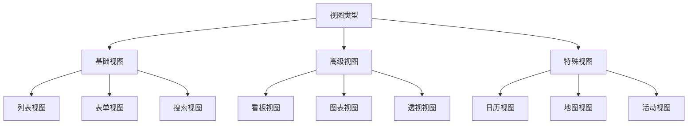

# 视图开发基础

## 🎯 学习目标
- 掌握Odoo视图开发的基本概念和方法
- 学会创建各种类型的视图
- 理解视图的继承和扩展机制

## 🎨 视图类型概览

### 视图类型层次


## 📋 列表视图 (Tree View)

### 基础列表视图
```xml
<!-- 基础列表视图 -->
<record id="view_model_tree" model="ir.ui.view">
    <field name="name">model.tree</field>
    <field name="model">my.model</field>
    <field name="arch" type="xml">
        <tree string="模型列表">
            <field name="name"/>
            <field name="code"/>
            <field name="amount"/>
            <field name="state"/>
            <field name="create_date"/>
        </tree>
    </field>
</record>
```

### 高级列表视图
```xml
<!-- 高级列表视图 -->
<record id="view_model_tree_advanced" model="ir.ui.view">
    <field name="name">model.tree.advanced</field>
    <field name="model">my.model</field>
    <field name="arch" type="xml">
        <tree string="高级列表" 
              decoration-info="state=='draft'" 
              decoration-success="state=='done'"
              decoration-warning="state=='confirmed'"
              decoration-danger="state=='cancelled'"
              create="true" 
              delete="true" 
              edit="true"
              multi_edit="true">
            
            <!-- 基础字段 -->
            <field name="name" string="名称" optional="show"/>
            <field name="code" string="编码" optional="hide"/>
            <field name="amount" string="金额" sum="总计"/>
            <field name="quantity" string="数量" sum="总计"/>
            
            <!-- 计算字段 -->
            <field name="total" string="总计" sum="总计"/>
            
            <!-- 关联字段 -->
            <field name="partner_id" string="客户" optional="show"/>
            <field name="user_id" string="负责人" optional="hide"/>
            
            <!-- 状态字段 -->
            <field name="state" string="状态" widget="badge"/>
            
            <!-- 日期字段 -->
            <field name="create_date" string="创建时间" optional="hide"/>
            <field name="write_date" string="修改时间" optional="hide"/>
            
            <!-- 按钮 -->
            <button name="action_confirm" string="确认" type="object" 
                    icon="fa-check" states="draft"/>
            <button name="action_done" string="完成" type="object" 
                    icon="fa-check-circle" states="confirmed"/>
            <button name="action_cancel" string="取消" type="object" 
                    icon="fa-times" states="draft,confirmed"/>
        </tree>
    </field>
</record>
```

### 列表视图属性
| 属性 | 说明 | 示例 |
|------|------|------|
| string | 视图标题 | "模型列表" |
| decoration-* | 行装饰 | decoration-info="state=='draft'" |
| create | 是否可创建 | create="true" |
| delete | 是否可删除 | delete="true" |
| edit | 是否可编辑 | edit="true" |
| multi_edit | 是否可批量编辑 | multi_edit="true" |
| default_order | 默认排序 | default_order="name desc" |

## 📝 表单视图 (Form View)

### 基础表单视图
```xml
<!-- 基础表单视图 -->
<record id="view_model_form" model="ir.ui.view">
    <field name="name">model.form</field>
    <field name="model">my.model</field>
    <field name="arch" type="xml">
        <form string="模型表单">
            <header>
                <button name="action_confirm" string="确认" type="object" 
                        class="btn-primary" states="draft"/>
                <button name="action_done" string="完成" type="object" 
                        class="btn-primary" states="confirmed"/>
                <button name="action_cancel" string="取消" type="object" 
                        states="draft,confirmed"/>
                <field name="state" widget="statusbar" statusbar_visible="draft,confirmed,done"/>
            </header>
            <sheet>
                <div class="oe_title">
                    <h1>
                        <field name="name" placeholder="输入名称..."/>
                    </h1>
                </div>
                <group>
                    <group>
                        <field name="code"/>
                        <field name="partner_id"/>
                        <field name="user_id"/>
                    </group>
                    <group>
                        <field name="state"/>
                        <field name="amount"/>
                        <field name="quantity"/>
                    </group>
                </group>
            </sheet>
        </form>
    </field>
</record>
```

### 高级表单视图
```xml
<!-- 高级表单视图 -->
<record id="view_model_form_advanced" model="ir.ui.view">
    <field name="name">model.form.advanced</field>
    <field name="model">my.model</field>
    <field name="arch" type="xml">
        <form string="高级表单">
            <header>
                <!-- 状态栏 -->
                <field name="state" widget="statusbar" statusbar_visible="draft,confirmed,done"/>
                
                <!-- 操作按钮 -->
                <button name="action_confirm" string="确认" type="object" 
                        class="btn-primary" states="draft"/>
                <button name="action_done" string="完成" type="object" 
                        class="btn-primary" states="confirmed"/>
                <button name="action_cancel" string="取消" type="object" 
                        states="draft,confirmed"/>
                
                <!-- 自定义按钮 -->
                <button name="action_custom" string="自定义操作" type="object" 
                        class="btn-secondary" icon="fa-cog"/>
            </header>
            
            <sheet>
                <!-- 标题区域 -->
                <div class="oe_title">
                    <h1>
                        <field name="name" placeholder="输入名称..." required="1"/>
                    </h1>
                    <h2>
                        <field name="code" placeholder="输入编码..."/>
                    </h2>
                </div>
                
                <!-- 分组布局 -->
                <group>
                    <group string="基本信息">
                        <field name="partner_id" options="{'no_create': True}"/>
                        <field name="user_id" options="{'no_create': True}"/>
                        <field name="date" widget="date"/>
                        <field name="datetime" widget="datetime"/>
                    </group>
                    <group string="金额信息">
                        <field name="amount" widget="monetary"/>
                        <field name="quantity" widget="float"/>
                        <field name="total" widget="monetary" readonly="1"/>
                        <field name="currency_id" invisible="1"/>
                    </group>
                </group>
                
                <!-- 分隔线 -->
                <separator string="详细信息"/>
                
                <!-- 字段组 -->
                <group>
                    <field name="description" widget="text" placeholder="输入描述..."/>
                </group>
                
                <!-- 标签页 -->
                <notebook>
                    <page string="明细行">
                        <field name="line_ids">
                            <tree editable="bottom">
                                <field name="name"/>
                                <field name="amount"/>
                                <field name="quantity"/>
                                <field name="subtotal" readonly="1"/>
                            </tree>
                        </field>
                    </page>
                    <page string="附件">
                        <field name="attachment_ids" widget="many2many_binary"/>
                    </page>
                    <page string="备注">
                        <field name="notes" widget="text"/>
                    </page>
                </notebook>
            </sheet>
            
            <!-- 侧边栏 -->
            <div class="oe_chatter">
                <field name="message_follower_ids" widget="mail_followers"/>
                <field name="activity_ids" widget="mail_activity"/>
                <field name="message_ids" widget="mail_thread"/>
            </div>
        </form>
    </field>
</record>
```

### 表单视图组件
| 组件 | 说明 | 示例 |
|------|------|------|
| header | 头部区域 | 状态栏、按钮 |
| sheet | 主内容区域 | 表单内容 |
| group | 分组布局 | 字段分组 |
| notebook | 标签页 | 多页面内容 |
| separator | 分隔线 | 内容分隔 |
| oe_chatter | 聊天区域 | 消息、活动 |

## 🔍 搜索视图 (Search View)

### 基础搜索视图
```xml
<!-- 基础搜索视图 -->
<record id="view_model_search" model="ir.ui.view">
    <field name="name">model.search</field>
    <field name="model">my.model</field>
    <field name="arch" type="xml">
        <search string="模型搜索">
            <field name="name"/>
            <field name="code"/>
            <field name="partner_id"/>
            <field name="amount"/>
            <field name="state"/>
            <field name="create_date"/>
        </search>
    </field>
</record>
```

### 高级搜索视图
```xml
<!-- 高级搜索视图 -->
<record id="view_model_search_advanced" model="ir.ui.view">
    <field name="name">model.search.advanced</field>
    <field name="model">my.model</field>
    <field name="arch" type="xml">
        <search string="高级搜索">
            <!-- 搜索字段 -->
            <field name="name" string="名称" filter_domain="[('name', 'ilike', self)]"/>
            <field name="code" string="编码" filter_domain="[('code', 'ilike', self)]"/>
            <field name="partner_id" string="客户" filter_domain="[('partner_id', 'ilike', self)]"/>
            <field name="amount" string="金额" filter_domain="[('amount', '>=', self)]"/>
            <field name="user_id" string="负责人" filter_domain="[('user_id', 'ilike', self)]"/>
            
            <!-- 预定义过滤器 -->
            <filter string="草稿" name="draft" domain="[('state', '=', 'draft')]"/>
            <filter string="已确认" name="confirmed" domain="[('state', '=', 'confirmed')]"/>
            <filter string="完成" name="done" domain="[('state', '=', 'done')]"/>
            <filter string="已取消" name="cancelled" domain="[('state', '=', 'cancelled')]"/>
            
            <!-- 日期过滤器 -->
            <filter string="今天" name="today" domain="[('create_date', '>=', datetime.datetime.combine(context_today(), datetime.time(0,0,0)))]"/>
            <filter string="本周" name="this_week" domain="[('create_date', '>=', (context_today() - datetime.timedelta(days=context_today().weekday())).strftime('%Y-%m-%d'))]"/>
            <filter string="本月" name="this_month" domain="[('create_date', '>=', context_today().strftime('%Y-%m-01'))]"/>
            
            <!-- 金额过滤器 -->
            <filter string="高金额" name="high_amount" domain="[('amount', '>', 10000)]"/>
            <filter string="低金额" name="low_amount" domain="[('amount', '<=', 1000)]"/>
            
            <!-- 组合过滤器 -->
            <filter string="我的草稿" name="my_draft" domain="[('state', '=', 'draft'), ('user_id', '=', uid)]"/>
            <filter string="高金额已确认" name="high_confirmed" domain="[('state', '=', 'confirmed'), ('amount', '>', 10000)]"/>
            
            <!-- 分组 -->
            <group expand="0" string="分组">
                <filter string="按状态" name="group_state" context="{'group_by': 'state'}"/>
                <filter string="按客户" name="group_partner" context="{'group_by': 'partner_id'}"/>
                <filter string="按负责人" name="group_user" context="{'group_by': 'user_id'}"/>
                <filter string="按创建日期" name="group_date" context="{'group_by': 'create_date:day'}"/>
            </group>
            
            <!-- 排序 -->
            <separator/>
            <filter string="按名称排序" name="sort_name" context="{'order_by': 'name'}"/>
            <filter string="按金额排序" name="sort_amount" context="{'order_by': 'amount desc'}"/>
            <filter string="按创建日期排序" name="sort_date" context="{'order_by': 'create_date desc'}"/>
        </search>
    </field>
</record>
```

## 📊 看板视图 (Kanban View)

### 基础看板视图
```xml
<!-- 基础看板视图 -->
<record id="view_model_kanban" model="ir.ui.view">
    <field name="name">model.kanban</field>
    <field name="model">my.model</field>
    <field name="arch" type="xml">
        <kanban string="模型看板">
            <field name="name"/>
            <field name="state"/>
            <field name="amount"/>
            <field name="partner_id"/>
            <templates>
                <t t-name="kanban-box">
                    <div class="oe_kanban_card oe_kanban_global_click">
                        <div class="oe_kanban_content">
                            <div class="o_kanban_record_top">
                                <div class="o_kanban_record_headings">
                                    <strong class="o_kanban_record_title">
                                        <field name="name"/>
                                    </strong>
                                </div>
                                <div class="o_kanban_record_body">
                                    <field name="amount"/>
                                    <field name="partner_id"/>
                                </div>
                            </div>
                        </div>
                    </div>
                </t>
            </templates>
        </kanban>
    </field>
</record>
```

### 高级看板视图
```xml
<!-- 高级看板视图 -->
<record id="view_model_kanban_advanced" model="ir.ui.view">
    <field name="name">model.kanban.advanced</field>
    <field name="model">my.model</field>
    <field name="arch" type="xml">
        <kanban string="高级看板" 
                class="o_kanban_small_column" 
                create="true" 
                edit="true" 
                delete="true"
                quick_create="true"
                default_group_by="state">
            
            <!-- 字段定义 -->
            <field name="name"/>
            <field name="state"/>
            <field name="amount"/>
            <field name="partner_id"/>
            <field name="user_id"/>
            <field name="create_date"/>
            <field name="color"/>
            <field name="priority"/>
            
            <!-- 模板定义 -->
            <templates>
                <t t-name="kanban-box">
                    <div class="oe_kanban_card oe_kanban_global_click" 
                         t-att-data-id="record.id.raw_value"
                         t-attf-class="oe_kanban_card oe_kanban_global_click #{record.color.raw_value ? 'oe_kanban_color_' + record.color.raw_value : ''}">
                        
                        <!-- 卡片头部 -->
                        <div class="o_kanban_record_top">
                            <div class="o_kanban_record_headings">
                                <strong class="o_kanban_record_title">
                                    <field name="name"/>
                                </strong>
                                <div class="o_kanban_record_subtitle">
                                    <field name="partner_id"/>
                                </div>
                            </div>
                            <div class="o_kanban_record_top_right">
                                <div class="o_kanban_record_priority">
                                    <field name="priority" widget="priority"/>
                                </div>
                            </div>
                        </div>
                        
                        <!-- 卡片内容 -->
                        <div class="o_kanban_record_body">
                            <div class="o_kanban_record_details">
                                <div class="o_kanban_record_detail">
                                    <strong>金额:</strong> <field name="amount" widget="monetary"/>
                                </div>
                                <div class="o_kanban_record_detail">
                                    <strong>负责人:</strong> <field name="user_id"/>
                                </div>
                                <div class="o_kanban_record_detail">
                                    <strong>创建日期:</strong> <field name="create_date" widget="date"/>
                                </div>
                            </div>
                        </div>
                        
                        <!-- 卡片底部 -->
                        <div class="o_kanban_record_bottom">
                            <div class="oe_kanban_bottom_left">
                                <div class="oe_kanban_avatar">
                                    
                                </div>
                            </div>
                            <div class="oe_kanban_bottom_right">
                                <div class="oe_kanban_tags">
                                    <span class="badge badge-info" t-if="record.state.value == 'draft'">草稿</span>
                                    <span class="badge badge-warning" t-if="record.state.value == 'confirmed'">已确认</span>
                                    <span class="badge badge-success" t-if="record.state.value == 'done'">完成</span>
                                </div>
                            </div>
                        </div>
                        
                        <!-- 操作按钮 -->
                        <div class="oe_kanban_manage_button_section">
                            <a class="oe_kanban_manage_toggle_button" href="#">
                                <i class="fa fa-ellipsis-v" role="img" aria-label="Manage" title="Manage"/>
                            </a>
                        </div>
                    </div>
                </t>
            </templates>
        </kanban>
    </field>
</record>
```

## 📈 图表视图 (Graph View)

### 基础图表视图
```xml
<!-- 基础图表视图 -->
<record id="view_model_graph" model="ir.ui.view">
    <field name="name">model.graph</field>
    <field name="model">my.model</field>
    <field name="arch" type="xml">
        <graph string="模型图表" type="bar">
            <field name="state" type="row"/>
            <field name="amount" type="measure"/>
        </graph>
    </field>
</record>
```

### 高级图表视图
```xml
<!-- 高级图表视图 -->
<record id="view_model_graph_advanced" model="ir.ui.view">
    <field name="name">model.graph.advanced</field>
    <field name="model">my.model</field>
    <field name="arch" type="xml">
        <graph string="高级图表" type="bar" stacked="True">
            <field name="partner_id" type="row"/>
            <field name="state" type="col"/>
            <field name="amount" type="measure"/>
            <field name="quantity" type="measure"/>
        </graph>
    </field>
</record>
```

### 图表类型
| 类型 | 说明 | 示例 |
|------|------|------|
| bar | 柱状图 | type="bar" |
| line | 折线图 | type="line" |
| pie | 饼图 | type="pie" |
| area | 面积图 | type="area" |

## 🔍 透视视图 (Pivot View)

### 基础透视视图
```xml
<!-- 基础透视视图 -->
<record id="view_model_pivot" model="ir.ui.view">
    <field name="name">model.pivot</field>
    <field name="model">my.model</field>
    <field name="arch" type="xml">
        <pivot string="模型透视">
            <field name="state" type="row"/>
            <field name="partner_id" type="col"/>
            <field name="amount" type="measure"/>
        </pivot>
    </field>
</record>
```

### 高级透视视图
```xml
<!-- 高级透视视图 -->
<record id="view_model_pivot_advanced" model="ir.ui.view">
    <field name="name">model.pivot.advanced</field>
    <field name="model">my.model</field>
    <field name="arch" type="xml">
        <pivot string="高级透视">
            <field name="state" type="row"/>
            <field name="partner_id" type="col"/>
            <field name="user_id" type="col"/>
            <field name="amount" type="measure"/>
            <field name="quantity" type="measure"/>
        </pivot>
    </field>
</record>
```

## 📅 日历视图 (Calendar View)

### 基础日历视图
```xml
<!-- 基础日历视图 -->
<record id="view_model_calendar" model="ir.ui.view">
    <field name="name">model.calendar</field>
    <field name="model">my.model</field>
    <field name="arch" type="xml">
        <calendar string="模型日历" date_start="create_date" color="state">
            <field name="name"/>
            <field name="amount"/>
            <field name="partner_id"/>
        </calendar>
    </field>
</record>
```

### 高级日历视图
```xml
<!-- 高级日历视图 -->
<record id="view_model_calendar_advanced" model="ir.ui.view">
    <field name="name">model.calendar.advanced</field>
    <field name="model">my.model</field>
    <field name="arch" type="xml">
        <calendar string="高级日历" 
                  date_start="create_date" 
                  date_stop="write_date" 
                  color="state"
                  all_day="false"
                  mode="month">
            <field name="name"/>
            <field name="amount"/>
            <field name="partner_id"/>
            <field name="user_id"/>
        </calendar>
    </field>
</record>
```

## 🔗 视图继承

### 视图继承基础
```xml
<!-- 继承基础视图 -->
<record id="view_model_form_inherit" model="ir.ui.view">
    <field name="name">model.form.inherit</field>
    <field name="model">my.model</field>
    <field name="inherit_id" ref="base_module.view_model_form"/>
    <field name="arch" type="xml">
        <!-- 在标题后添加字段 -->
        <xpath expr="//div[@class='oe_title']" position="after">
            <field name="custom_field"/>
        </xpath>
        
        <!-- 在分组中添加字段 -->
        <xpath expr="//group[@string='基本信息']" position="inside">
            <field name="extra_field"/>
        </xpath>
        
        <!-- 在标签页中添加新页面 -->
        <xpath expr="//notebook" position="inside">
            <page string="自定义页面">
                <field name="custom_data"/>
            </page>
        </xpath>
    </field>
</record>
```

### 视图继承方法
| 方法 | 说明 | 示例 |
|------|------|------|
| inside | 在元素内部添加 | position="inside" |
| after | 在元素后添加 | position="after" |
| before | 在元素前添加 | position="before" |
| replace | 替换元素 | position="replace" |
| attributes | 修改属性 | position="attributes" |

## 🔗 相关链接

### 下一步学习
- [[控制器开发]] - 学习控制器开发
- [[报表开发]] - 掌握报表开发
- [[视图继承机制]] - 深入理解视图继承

### 实践建议
- 多练习各种视图类型
- 熟悉视图属性配置
- 掌握视图继承技巧

## 📝 思考题

### 基础理解
1. 各种视图类型的特点是什么？
2. 如何设计用户友好的视图？
3. 视图继承的作用是什么？

### 深入思考
1. 如何优化视图性能？
2. 复杂视图如何设计？
3. 如何实现动态视图？

---

**学习进度**: ✅ 已完成  
**下一步**: [[控制器开发]]

