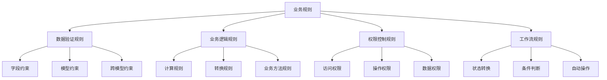

# 业务规则配置

## 🎯 学习目标
- 掌握Odoo业务规则配置的基本方法
- 学会设计和实现复杂的业务规则
- 理解业务规则的验证和执行机制

## 📋 业务规则基础

### 业务规则概念
业务规则是系统中定义的各种约束和验证逻辑，用于确保数据的完整性和业务逻辑的正确性。

### 业务规则类型


## 🔧 基础业务规则

### 字段约束规则
```python
class FieldConstraintRules(models.Model):
    _name = 'field.constraint.rules'
    _description = '字段约束规则'
    
    name = fields.Char('名称', required=True)
    amount = fields.Float('金额', digits=(16, 2))
    quantity = fields.Integer('数量')
    date = fields.Date('日期')
    email = fields.Char('邮箱')
    phone = fields.Char('电话')
    
    # 字段约束
    @api.constrains('amount')
    def _check_amount(self):
        """金额约束"""
        for record in self:
            if record.amount < 0:
                raise ValidationError('金额不能为负数')
            if record.amount > 1000000:
                raise ValidationError('金额不能超过1000000')
    
    @api.constrains('quantity')
    def _check_quantity(self):
        """数量约束"""
        for record in self:
            if record.quantity < 0:
                raise ValidationError('数量不能为负数')
            if record.quantity > 10000:
                raise ValidationError('数量不能超过10000')
    
    @api.constrains('email')
    def _check_email(self):
        """邮箱约束"""
        import re
        for record in self:
            if record.email:
                pattern = r'^[a-zA-Z0-9._%+-]+@[a-zA-Z0-9.-]+\.[a-zA-Z]{2,}$'
                if not re.match(pattern, record.email):
                    raise ValidationError('邮箱格式不正确')
    
    @api.constrains('phone')
    def _check_phone(self):
        """电话约束"""
        import re
        for record in self:
            if record.phone:
                pattern = r'^1[3-9]\d{9}$'
                if not re.match(pattern, record.phone):
                    raise ValidationError('手机号格式不正确')
    
    @api.constrains('date')
    def _check_date(self):
        """日期约束"""
        from datetime import date
        for record in self:
            if record.date:
                if record.date > date.today():
                    raise ValidationError('日期不能是未来日期')
                if record.date < date(2020, 1, 1):
                    raise ValidationError('日期不能早于2020年1月1日')
    
    # 数据库约束
    _sql_constraints = [
        ('name_uniq', 'UNIQUE(name)', '名称必须唯一'),
        ('amount_positive', 'CHECK(amount >= 0)', '金额必须大于等于0'),
        ('quantity_positive', 'CHECK(quantity >= 0)', '数量必须大于等于0'),
    ]
```

### 模型约束规则
```python
class ModelConstraintRules(models.Model):
    _name = 'model.constraint.rules'
    _description = '模型约束规则'
    
    name = fields.Char('名称', required=True)
    amount = fields.Float('金额', digits=(16, 2))
    state = fields.Selection([
        ('draft', '草稿'),
        ('confirmed', '已确认'),
        ('done', '完成'),
    ], string='状态', default='draft')
    line_ids = fields.One2many('model.constraint.rules.line', 'parent_id', string='明细行')
    
    # 模型约束
    @api.constrains('state', 'amount')
    def _check_state_amount(self):
        """状态和金额约束"""
        for record in self:
            if record.state == 'confirmed' and record.amount <= 0:
                raise ValidationError('已确认状态的记录金额必须大于0')
            if record.state == 'done' and record.amount < 1000:
                raise ValidationError('完成状态的记录金额必须大于等于1000')
    
    @api.constrains('line_ids')
    def _check_lines(self):
        """明细行约束"""
        for record in self:
            if not record.line_ids:
                raise ValidationError('必须至少有一条明细行')
            
            if len(record.line_ids) > 10:
                raise ValidationError('明细行数量不能超过10条')
            
            # 检查明细行金额
            total_amount = sum(record.line_ids.mapped('amount'))
            if total_amount != record.amount:
                raise ValidationError('明细行总金额必须等于主记录金额')
    
    @api.constrains('name', 'state')
    def _check_name_state(self):
        """名称和状态约束"""
        for record in self:
            if record.state == 'done' and not record.name:
                raise ValidationError('完成状态的记录必须有名称')
            
            if record.state == 'confirmed' and len(record.name) < 5:
                raise ValidationError('已确认状态的记录名称长度不能少于5个字符')

class ModelConstraintRulesLine(models.Model):
    _name = 'model.constraint.rules.line'
    _description = '模型约束规则明细行'
    
    parent_id = fields.Many2one('model.constraint.rules', string='父记录', required=True, ondelete='cascade')
    name = fields.Char('名称', required=True)
    amount = fields.Float('金额', digits=(16, 2))
    
    @api.constrains('amount')
    def _check_amount(self):
        """明细行金额约束"""
        for line in self:
            if line.amount < 0:
                raise ValidationError('明细行金额不能为负数')
            if line.amount > 100000:
                raise ValidationError('明细行金额不能超过100000')
```

## 🔄 动态业务规则

### 可配置业务规则
```python
class ConfigurableBusinessRules(models.Model):
    _name = 'configurable.business.rules'
    _description = '可配置业务规则'
    
    name = fields.Char('名称', required=True)
    amount = fields.Float('金额', digits=(16, 2))
    state = fields.Selection([
        ('draft', '草稿'),
        ('confirmed', '已确认'),
        ('done', '完成'),
    ], string='状态', default='draft')
    
    def _get_business_rules(self):
        """获取业务规则"""
        rules = self.env['business.rule.config'].search([
            ('model_id', '=', self.env.ref('base.model_configurable_business_rules').id),
            ('active', '=', True)
        ])
        return rules
    
    def _validate_business_rules(self):
        """验证业务规则"""
        rules = self._get_business_rules()
        
        for rule in rules:
            if self._evaluate_rule(rule):
                if rule.rule_type == 'error':
                    raise ValidationError(rule.message)
                elif rule.rule_type == 'warning':
                    # 记录警告
                    self.message_post(
                        body=f'警告: {rule.message}',
                        message_type='notification'
                    )
    
    def _evaluate_rule(self, rule):
        """评估规则"""
        try:
            # 使用安全的表达式评估
            context = {
                'self': self,
                'record': self,
                'env': self.env,
                'fields': fields,
                'datetime': datetime,
                'timedelta': timedelta,
            }
            
            # 执行规则表达式
            result = eval(rule.condition, {"__builtins__": {}}, context)
            return bool(result)
        except Exception as e:
            # 规则评估失败，记录错误但不阻止操作
            self.message_post(
                body=f'规则评估失败: {rule.name} - {str(e)}',
                message_type='notification'
            )
            return False
    
    @api.model
    def create(self, vals):
        """重写创建方法，添加规则验证"""
        record = super().create(vals)
        record._validate_business_rules()
        return record
    
    def write(self, vals):
        """重写写入方法，添加规则验证"""
        result = super().write(vals)
        self._validate_business_rules()
        return result

class BusinessRuleConfig(models.Model):
    _name = 'business.rule.config'
    _description = '业务规则配置'
    
    name = fields.Char('规则名称', required=True)
    active = fields.Boolean('激活', default=True)
    rule_type = fields.Selection([
        ('error', '错误'),
        ('warning', '警告'),
    ], string='规则类型', required=True)
    condition = fields.Text('条件表达式', required=True, help='使用Python表达式，可用变量: self, record, env')
    message = fields.Text('消息', required=True)
    model_id = fields.Many2one('ir.model', string='适用模型', required=True)
    priority = fields.Integer('优先级', default=100, help='数字越小优先级越高')
    
    def test_rule(self):
        """测试规则"""
        try:
            # 获取测试记录
            test_record = self.env[self.model_id.model].search([], limit=1)
            if not test_record:
                raise UserError('没有找到测试记录')
            
            # 评估规则
            context = {
                'self': test_record,
                'record': test_record,
                'env': self.env,
                'fields': fields,
                'datetime': datetime,
                'timedelta': timedelta,
            }
            
            result = eval(self.condition, {"__builtins__": {}}, context)
            
            return {
                'type': 'ir.actions.client',
                'tag': 'display_notification',
                'params': {
                    'title': '规则测试',
                    'message': f'规则评估结果: {bool(result)}',
                    'type': 'success' if result else 'info',
                }
            }
        except Exception as e:
            return {
                'type': 'ir.actions.client',
                'tag': 'display_notification',
                'params': {
                    'title': '规则测试',
                    'message': f'测试失败: {str(e)}',
                    'type': 'danger',
                }
            }
```

### 条件业务规则
```python
class ConditionalBusinessRules(models.Model):
    _name = 'conditional.business.rules'
    _description = '条件业务规则'
    
    name = fields.Char('名称', required=True)
    amount = fields.Float('金额', digits=(16, 2))
    priority = fields.Selection([
        ('low', '低'),
        ('medium', '中'),
        ('high', '高'),
    ], string='优先级', default='medium')
    state = fields.Selection([
        ('draft', '草稿'),
        ('confirmed', '已确认'),
        ('done', '完成'),
    ], string='状态', default='draft')
    
    def _get_conditional_rules(self):
        """获取条件规则"""
        rules = []
        
        # 规则1: 高优先级记录金额必须大于10000
        if self.priority == 'high':
            rules.append({
                'name': '高优先级金额规则',
                'condition': self.amount > 10000,
                'message': '高优先级记录的金额必须大于10000',
                'type': 'error'
            })
        
        # 规则2: 已确认状态记录金额必须大于1000
        if self.state == 'confirmed':
            rules.append({
                'name': '已确认状态金额规则',
                'condition': self.amount > 1000,
                'message': '已确认状态记录的金额必须大于1000',
                'type': 'error'
            })
        
        # 规则3: 完成状态记录金额必须大于5000
        if self.state == 'done':
            rules.append({
                'name': '完成状态金额规则',
                'condition': self.amount > 5000,
                'message': '完成状态记录的金额必须大于5000',
                'type': 'error'
            })
        
        # 规则4: 中优先级记录金额警告
        if self.priority == 'medium' and self.amount > 50000:
            rules.append({
                'name': '中优先级金额警告',
                'condition': True,
                'message': '中优先级记录的金额较大，请确认',
                'type': 'warning'
            })
        
        return rules
    
    def _validate_conditional_rules(self):
        """验证条件规则"""
        rules = self._get_conditional_rules()
        
        for rule in rules:
            if rule['condition']:
                if rule['type'] == 'error':
                    raise ValidationError(rule['message'])
                elif rule['type'] == 'warning':
                    self.message_post(
                        body=f'警告: {rule["message"]}',
                        message_type='notification'
                    )
    
    @api.model
    def create(self, vals):
        """重写创建方法，添加规则验证"""
        record = super().create(vals)
        record._validate_conditional_rules()
        return record
    
    def write(self, vals):
        """重写写入方法，添加规则验证"""
        result = super().write(vals)
        self._validate_conditional_rules()
        return result
```

## 🔐 权限业务规则

### 权限控制规则
```python
class PermissionBusinessRules(models.Model):
    _name = 'permission.business.rules'
    _description = '权限业务规则'
    _inherit = ['mail.thread', 'mail.activity.mixin']
    
    name = fields.Char('名称', required=True)
    amount = fields.Float('金额', digits=(16, 2))
    state = fields.Selection([
        ('draft', '草稿'),
        ('confirmed', '已确认'),
        ('approved', '已审批'),
        ('done', '完成'),
    ], string='状态', default='draft')
    
    # 权限字段
    create_uid = fields.Many2one('res.users', string='创建人', readonly=True)
    approve_uid = fields.Many2one('res.users', string='审批人')
    
    def _check_permission_rules(self):
        """检查权限规则"""
        current_user = self.env.user
        
        # 规则1: 只有创建人才能修改草稿状态的记录
        if self.state == 'draft' and self.create_uid != current_user:
            if not current_user.has_group('base.group_system'):
                raise AccessError('只有创建人才能修改草稿状态的记录')
        
        # 规则2: 只有审批人才能修改已审批状态的记录
        if self.state == 'approved' and self.approve_uid != current_user:
            if not current_user.has_group('base.group_system'):
                raise AccessError('只有审批人才能修改已审批状态的记录')
        
        # 规则3: 只有管理员才能删除记录
        if not current_user.has_group('base.group_system'):
            raise AccessError('只有管理员才能删除记录')
    
    def _check_amount_permission(self):
        """检查金额权限"""
        current_user = self.env.user
        
        # 规则1: 普通用户不能创建金额超过10000的记录
        if self.amount > 10000 and not current_user.has_group('base.group_user'):
            raise AccessError('普通用户不能创建金额超过10000的记录')
        
        # 规则2: 只有管理员才能创建金额超过100000的记录
        if self.amount > 100000 and not current_user.has_group('base.group_system'):
            raise AccessError('只有管理员才能创建金额超过100000的记录')
    
    def action_confirm(self):
        """确认操作"""
        self._check_permission_rules()
        self._check_amount_permission()
        
        for record in self:
            if record.state != 'draft':
                raise UserError('只有草稿状态的记录才能确认')
            
            record.write({'state': 'confirmed'})
            record.message_post(
                body='记录已确认',
                message_type='notification'
            )
    
    def action_approve(self):
        """审批操作"""
        self._check_permission_rules()
        
        for record in self:
            if record.state != 'confirmed':
                raise UserError('只有已确认状态的记录才能审批')
            
            # 检查审批权限
            if not self.env.user.has_group('base.group_user'):
                raise AccessError('需要用户权限才能审批')
            
            record.write({
                'state': 'approved',
                'approve_uid': self.env.user.id,
            })
            record.message_post(
                body='记录已审批',
                message_type='notification'
            )
    
    def action_done(self):
        """完成操作"""
        self._check_permission_rules()
        
        for record in self:
            if record.state != 'approved':
                raise UserError('只有已审批状态的记录才能完成')
            
            record.write({'state': 'done'})
            record.message_post(
                body='记录已完成',
                message_type='notification'
            )
    
    @api.model
    def create(self, vals):
        """重写创建方法，添加权限检查"""
        self._check_amount_permission()
        
        # 设置创建人
        vals['create_uid'] = self.env.user.id
        
        record = super().create(vals)
        return record
    
    def write(self, vals):
        """重写写入方法，添加权限检查"""
        self._check_permission_rules()
        result = super().write(vals)
        return result
    
    def unlink(self):
        """重写删除方法，添加权限检查"""
        self._check_permission_rules()
        return super().unlink()
```

## 🔄 工作流业务规则

### 工作流状态规则
```python
class WorkflowBusinessRules(models.Model):
    _name = 'workflow.business.rules'
    _description = '工作流业务规则'
    _inherit = ['mail.thread', 'mail.activity.mixin']
    
    name = fields.Char('名称', required=True)
    amount = fields.Float('金额', digits=(16, 2))
    state = fields.Selection([
        ('draft', '草稿'),
        ('submitted', '已提交'),
        ('reviewed', '已评审'),
        ('approved', '已审批'),
        ('rejected', '已拒绝'),
        ('done', '完成'),
    ], string='状态', default='draft', tracking=True)
    
    # 工作流字段
    submit_date = fields.Datetime('提交时间')
    review_date = fields.Datetime('评审时间')
    approve_date = fields.Datetime('审批时间')
    complete_date = fields.Datetime('完成时间')
    
    def _check_workflow_rules(self):
        """检查工作流规则"""
        # 规则1: 已提交状态的记录必须有提交时间
        if self.state == 'submitted' and not self.submit_date:
            raise ValidationError('已提交状态的记录必须有提交时间')
        
        # 规则2: 已评审状态的记录必须有评审时间
        if self.state == 'reviewed' and not self.review_date:
            raise ValidationError('已评审状态的记录必须有评审时间')
        
        # 规则3: 已审批状态的记录必须有审批时间
        if self.state == 'approved' and not self.approve_date:
            raise ValidationError('已审批状态的记录必须有审批时间')
        
        # 规则4: 完成状态的记录必须有完成时间
        if self.state == 'done' and not self.complete_date:
            raise ValidationError('完成状态的记录必须有完成时间')
    
    def _check_state_transition(self, new_state):
        """检查状态转换规则"""
        current_state = self.state
        
        # 定义允许的状态转换
        allowed_transitions = {
            'draft': ['submitted', 'rejected'],
            'submitted': ['reviewed', 'rejected'],
            'reviewed': ['approved', 'rejected'],
            'approved': ['done', 'rejected'],
            'rejected': ['draft'],
            'done': [],
        }
        
        if new_state not in allowed_transitions.get(current_state, []):
            raise ValidationError(f'不允许从状态 {current_state} 转换到状态 {new_state}')
    
    def action_submit(self):
        """提交操作"""
        self._check_workflow_rules()
        self._check_state_transition('submitted')
        
        for record in self:
            record.write({
                'state': 'submitted',
                'submit_date': fields.Datetime.now(),
            })
            record.message_post(
                body='记录已提交',
                message_type='notification'
            )
    
    def action_review(self):
        """评审操作"""
        self._check_workflow_rules()
        self._check_state_transition('reviewed')
        
        for record in self:
            record.write({
                'state': 'reviewed',
                'review_date': fields.Datetime.now(),
            })
            record.message_post(
                body='记录已评审',
                message_type='notification'
            )
    
    def action_approve(self):
        """审批操作"""
        self._check_workflow_rules()
        self._check_state_transition('approved')
        
        for record in self:
            record.write({
                'state': 'approved',
                'approve_date': fields.Datetime.now(),
            })
            record.message_post(
                body='记录已审批',
                message_type='notification'
            )
    
    def action_reject(self):
        """拒绝操作"""
        self._check_workflow_rules()
        self._check_state_transition('rejected')
        
        for record in self:
            record.write({'state': 'rejected'})
            record.message_post(
                body='记录已拒绝',
                message_type='notification'
            )
    
    def action_done(self):
        """完成操作"""
        self._check_workflow_rules()
        self._check_state_transition('done')
        
        for record in self:
            record.write({
                'state': 'done',
                'complete_date': fields.Datetime.now(),
            })
            record.message_post(
                body='记录已完成',
                message_type='notification'
            )
    
    def action_reset(self):
        """重置操作"""
        self._check_workflow_rules()
        self._check_state_transition('draft')
        
        for record in self:
            record.write({
                'state': 'draft',
                'submit_date': False,
                'review_date': False,
                'approve_date': False,
                'complete_date': False,
            })
            record.message_post(
                body='记录已重置为草稿',
                message_type='notification'
            )
    
    def write(self, vals):
        """重写写入方法，添加工作流规则检查"""
        if 'state' in vals:
            self._check_state_transition(vals['state'])
        
        result = super().write(vals)
        self._check_workflow_rules()
        return result
```

## 🔗 相关链接

### 下一步学习
- [[业务方法优化]] - 了解业务方法优化
- [[工作流监控]] - 掌握工作流监控
- [[业务规则测试]] - 学习业务规则测试

### 实践建议
- 多练习业务规则设计
- 熟悉不同规则类型
- 掌握规则配置技巧

## 📝 思考题

### 基础理解
1. 业务规则的基本类型有哪些？
2. 如何设计合理的业务规则？
3. 业务规则的验证机制是什么？

### 深入思考
1. 如何设计可配置的业务规则？
2. 复杂业务规则如何优化？
3. 如何实现业务规则的动态管理？

---

**学习进度**: ✅ 已完成  
**下一步**: [[业务方法优化]]

