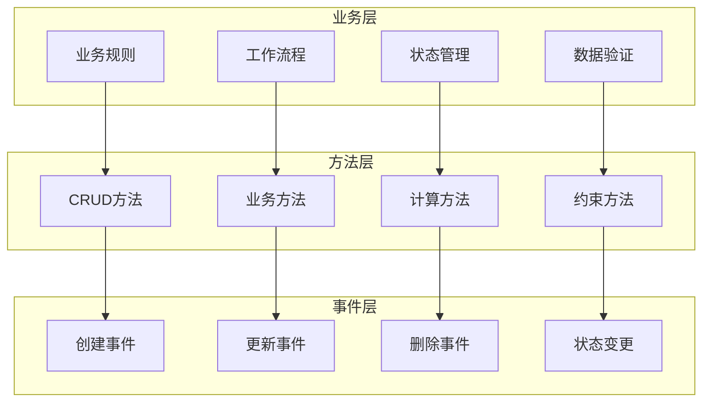

# 业务逻辑实现

## 业务逻辑概述

在Odoo 17中，业务逻辑实现是应用开发的核心。通过合理的方法设计、状态管理和工作流控制，实现复杂的业务需求。

### 业务逻辑架构


## 方法设计模式

### 基础方法模式
```python
from odoo import models, fields, api
from odoo.exceptions import ValidationError, UserError

class SaleOrder(models.Model):
    _inherit = 'sale.order'
    
    def action_confirm(self):
        """确认销售订单的业务逻辑"""
        # 1. 前置验证
        self._pre_confirm_validation()
        
        # 2. 核心业务逻辑
        result = super().action_confirm()
        
        # 3. 后置处理
        self._post_confirm_processing()
        
        return result
    
    def _pre_confirm_validation(self):
        """确认前验证"""
        for order in self:
            # 检查库存
            if not order._check_availability():
                raise UserError('Some products are not available')
            
            # 检查信用额度
            if not order._check_credit_limit():
                raise UserError('Credit limit exceeded')
            
            # 检查价格
            if not order._check_prices():
                raise UserError('Price validation failed')
    
    def _post_confirm_processing(self):
        """确认后处理"""
        for order in self:
            # 发送确认邮件
            order._send_confirmation_email()
            
            # 创建采购需求
            order._create_procurement_orders()
            
            # 更新客户信息
            order._update_customer_info()
```

### 状态机模式
```python
class ProjectTask(models.Model):
    _inherit = 'project.task'
    
    def _get_state_transitions(self):
        """获取状态转换规则"""
        return {
            'draft': ['in_progress', 'cancelled'],
            'in_progress': ['done', 'cancelled', 'blocked'],
            'blocked': ['in_progress', 'cancelled'],
            'done': [],
            'cancelled': [],
        }
    
    def _can_transition_to(self, target_state):
        """检查是否可以转换到目标状态"""
        transitions = self._get_state_transitions()
        return target_state in transitions.get(self.state, [])
    
    def action_start(self):
        """开始任务"""
        for task in self:
            if not task._can_transition_to('in_progress'):
                raise UserError('Cannot start task from current state')
            
            # 验证前置条件
            task._validate_start_conditions()
            
            # 更新状态
            task.write({
                'state': 'in_progress',
                'date_start': fields.Datetime.now()
            })
            
            # 后置处理
            task._on_start()
    
    def _validate_start_conditions(self):
        """验证开始条件"""
        if not self.user_ids:
            raise ValidationError('Task must be assigned to a user')
        
        if not self.project_id:
            raise ValidationError('Task must belong to a project')
    
    def _on_start(self):
        """开始后的处理"""
        # 发送通知
        self._notify_team_members('Task started')
        
        # 记录日志
        self._log_state_change('in_progress')
```

## 复杂业务逻辑

### 多步骤业务流程
```python
class PurchaseOrder(models.Model):
    _inherit = 'purchase.order'
    
    def action_approve(self):
        """多步骤审批流程"""
        for order in self:
            # 步骤1：基础验证
            order._validate_basic_requirements()
            
            # 步骤2：预算检查
            order._check_budget_availability()
            
            # 步骤3：供应商验证
            order._validate_supplier()
            
            # 步骤4：价格比较
            order._compare_prices()
            
            # 步骤5：风险评估
            order._assess_risk()
            
            # 步骤6：最终审批
            order._final_approval()
    
    def _validate_basic_requirements(self):
        """基础需求验证"""
        if not self.order_line:
            raise UserError('Purchase order must have at least one line')
        
        if not self.partner_id:
            raise UserError('Vendor is required')
        
        if not self.date_planned:
            raise UserError('Scheduled date is required')
    
    def _check_budget_availability(self):
        """预算可用性检查"""
        total_amount = sum(line.price_subtotal for line in self.order_line)
        
        # 检查部门预算
        if not self._check_department_budget(total_amount):
            raise UserError('Insufficient department budget')
        
        # 检查项目预算
        if not self._check_project_budget(total_amount):
            raise UserError('Insufficient project budget')
    
    def _validate_supplier(self):
        """供应商验证"""
        supplier = self.partner_id
        
        # 检查供应商状态
        if not supplier.active:
            raise UserError('Supplier is not active')
        
        # 检查供应商评级
        if supplier.rating < 3:
            raise UserError('Supplier rating is too low')
        
        # 检查供应商证书
        if not supplier._has_valid_certificates():
            raise UserError('Supplier certificates are expired')
    
    def _compare_prices(self):
        """价格比较"""
        for line in self.order_line:
            # 获取市场价格
            market_price = line.product_id._get_market_price()
            
            # 比较价格
            if line.price_unit > market_price * 1.1:  # 允许10%的差异
                raise UserError(f'Price for {line.product_id.name} is too high')
    
    def _assess_risk(self):
        """风险评估"""
        total_amount = sum(line.price_subtotal for line in self.order_line)
        
        # 高风险检查
        if total_amount > 100000:  # 超过10万需要特殊审批
            if not self._has_special_approval():
                raise UserError('Special approval required for high-value orders')
        
        # 供应商风险检查
        if self.partner_id._is_high_risk():
            if not self._has_risk_approval():
                raise UserError('Risk approval required for this supplier')
    
    def _final_approval(self):
        """最终审批"""
        # 更新状态
        self.write({'state': 'purchase'})
        
        # 发送通知
        self._send_approval_notifications()
        
        # 创建采购需求
        self._create_procurement_orders()
```

### 条件业务逻辑
```python
class StockMove(models.Model):
    _inherit = 'stock.move'
    
    def _action_confirm(self):
        """确认库存移动的条件逻辑"""
        for move in self:
            # 条件1：检查产品类型
            if move.product_id.type == 'product':
                move._confirm_product_move()
            elif move.product_id.type == 'service':
                move._confirm_service_move()
            else:
                move._confirm_other_move()
    
    def _confirm_product_move(self):
        """确认产品移动"""
        # 检查库存
        if not self._check_availability():
            # 创建补货需求
            self._create_replenishment()
        
        # 检查质量
        if self._requires_quality_check():
            self._schedule_quality_check()
        
        # 确认移动
        super(StockMove, self)._action_confirm()
    
    def _confirm_service_move(self):
        """确认服务移动"""
        # 服务不需要库存检查
        # 直接确认
        super(StockMove, self)._action_confirm()
    
    def _confirm_other_move(self):
        """确认其他类型移动"""
        # 根据具体类型处理
        if self.product_id.type == 'consu':
            self._confirm_consumable_move()
        else:
            super(StockMove, self)._action_confirm()
```

## 事件驱动逻辑

### 事件处理方法
```python
class AccountMove(models.Model):
    _inherit = 'account.move'
    
    @api.model
    def create(self, vals):
        """创建时的业务逻辑"""
        # 创建前处理
        vals = self._pre_create_processing(vals)
        
        # 创建记录
        move = super().create(vals)
        
        # 创建后处理
        move._post_create_processing()
        
        return move
    
    def write(self, vals):
        """更新时的业务逻辑"""
        # 记录变更前状态
        old_values = {}
        for field in vals:
            if field in self._fields:
                old_values[field] = getattr(self, field)
        
        # 更新记录
        result = super().write(vals)
        
        # 更新后处理
        self._post_write_processing(vals, old_values)
        
        return result
    
    def _pre_create_processing(self, vals):
        """创建前处理"""
        # 自动生成编号
        if not vals.get('name'):
            vals['name'] = self._get_next_sequence()
        
        # 设置默认值
        if not vals.get('date'):
            vals['date'] = fields.Date.today()
        
        # 验证数据
        self._validate_create_data(vals)
        
        return vals
    
    def _post_create_processing(self):
        """创建后处理"""
        # 发送创建通知
        self._send_creation_notification()
        
        # 更新相关记录
        self._update_related_records()
        
        # 记录审计日志
        self._log_creation()
    
    def _post_write_processing(self, vals, old_values):
        """更新后处理"""
        # 检查重要字段变更
        important_fields = ['state', 'amount_total', 'partner_id']
        changed_fields = [f for f in important_fields if f in vals]
        
        if changed_fields:
            # 发送变更通知
            self._send_change_notification(changed_fields, old_values)
            
            # 更新相关记录
            self._update_related_records_on_change(changed_fields)
            
            # 记录审计日志
            self._log_changes(changed_fields, old_values)
```

### 状态变更事件
```python
class SaleOrder(models.Model):
    _inherit = 'sale.order'
    
    def write(self, vals):
        """重写write方法处理状态变更"""
        # 记录状态变更
        state_changed = 'state' in vals
        
        if state_changed:
            old_state = self.state
            new_state = vals['state']
            
            # 状态变更前处理
            self._pre_state_change(old_state, new_state)
        
        # 执行更新
        result = super().write(vals)
        
        if state_changed:
            # 状态变更后处理
            self._post_state_change(old_state, new_state)
        
        return result
    
    def _pre_state_change(self, old_state, new_state):
        """状态变更前处理"""
        # 验证状态转换
        if not self._is_valid_transition(old_state, new_state):
            raise UserError(f'Invalid transition from {old_state} to {new_state}')
        
        # 执行前置条件检查
        self._check_pre_conditions(new_state)
    
    def _post_state_change(self, old_state, new_state):
        """状态变更后处理"""
        # 执行后置处理
        if new_state == 'sale':
            self._on_confirm()
        elif new_state == 'done':
            self._on_done()
        elif new_state == 'cancel':
            self._on_cancel()
        
        # 发送状态变更通知
        self._notify_state_change(old_state, new_state)
        
        # 记录状态变更日志
        self._log_state_change(old_state, new_state)
    
    def _on_confirm(self):
        """确认后的处理"""
        # 创建采购需求
        self._create_procurement_orders()
        
        # 发送确认邮件
        self._send_confirmation_email()
        
        # 更新客户信息
        self._update_customer_metrics()
    
    def _on_done(self):
        """完成后的处理"""
        # 生成发票
        self._create_invoice()
        
        # 更新库存
        self._update_inventory()
        
        # 发送完成通知
        self._send_completion_notification()
    
    def _on_cancel(self):
        """取消后的处理"""
        # 取消相关记录
        self._cancel_related_records()
        
        # 释放库存
        self._release_reserved_stock()
        
        # 发送取消通知
        self._send_cancellation_notification()
```

## 异步业务逻辑

### 异步任务处理
```python
import logging
from odoo import models, fields, api
from odoo.addons.queue_job.job import job

_logger = logging.getLogger(__name__)

class SaleOrder(models.Model):
    _inherit = 'sale.order'
    
    @job
    def _process_large_order_async(self):
        """异步处理大订单"""
        try:
            # 复杂的业务逻辑
            self._validate_large_order()
            self._create_procurement_orders()
            self._send_notifications()
            self._update_analytics()
            
            _logger.info(f'Large order {self.name} processed successfully')
            
        except Exception as e:
            _logger.error(f'Error processing large order {self.name}: {str(e)}')
            raise
    
    def action_confirm(self):
        """确认订单时检查是否需要异步处理"""
        for order in self:
            # 检查是否为大订单
            if order._is_large_order():
                # 异步处理
                order.with_delay()._process_large_order_async()
            else:
                # 同步处理
                super(SaleOrder, order).action_confirm()
    
    def _is_large_order(self):
        """检查是否为大订单"""
        return self.amount_total > 100000 or len(self.order_line) > 50
```

### 批量处理逻辑
```python
class AccountMove(models.Model):
    _inherit = 'account.move'
    
    def _process_batch_validation(self, move_ids):
        """批量验证处理"""
        moves = self.browse(move_ids)
        
        # 批量检查
        valid_moves = moves.filtered(lambda m: m._is_valid_for_processing())
        invalid_moves = moves - valid_moves
        
        if invalid_moves:
            # 记录无效记录
            invalid_moves._log_validation_errors()
        
        # 批量处理有效记录
        if valid_moves:
            valid_moves._batch_process()
        
        return {
            'valid_count': len(valid_moves),
            'invalid_count': len(invalid_moves)
        }
    
    def _batch_process(self):
        """批量处理"""
        # 批量更新状态
        self.write({'state': 'posted'})
        
        # 批量创建分录
        self._batch_create_move_lines()
        
        # 批量发送通知
        self._batch_send_notifications()
    
    def _batch_create_move_lines(self):
        """批量创建分录"""
        # 使用SQL批量插入提高性能
        move_line_vals = []
        for move in self:
            for line in move.line_ids:
                move_line_vals.append({
                    'move_id': move.id,
                    'account_id': line.account_id.id,
                    'debit': line.debit,
                    'credit': line.credit,
                    'name': line.name,
                })
        
        if move_line_vals:
            self.env['account.move.line'].create(move_line_vals)
```

## 错误处理和日志

### 错误处理模式
```python
class SaleOrder(models.Model):
    _inherit = 'sale.order'
    
    def action_confirm(self):
        """带错误处理的确认方法"""
        errors = []
        warnings = []
        
        for order in self:
            try:
                # 验证订单
                order._validate_order()
                
                # 检查库存
                if not order._check_availability():
                    warnings.append(f'Order {order.name}: Some products may not be available')
                
                # 确认订单
                super(SaleOrder, order).action_confirm()
                
            except ValidationError as e:
                errors.append(f'Order {order.name}: {str(e)}')
            except Exception as e:
                errors.append(f'Order {order.name}: Unexpected error - {str(e)}')
                # 记录详细错误
                _logger.exception(f'Error confirming order {order.name}')
        
        # 处理错误和警告
        if errors:
            raise UserError('\n'.join(errors))
        
        if warnings:
            # 显示警告但不阻止操作
            self._show_warnings(warnings)
    
    def _validate_order(self):
        """订单验证"""
        if not self.order_line:
            raise ValidationError('Order must have at least one line')
        
        if not self.partner_id:
            raise ValidationError('Customer is required')
        
        if self.amount_total <= 0:
            raise ValidationError('Order total must be positive')
```

### 日志记录
```python
import logging
from odoo import models, api

_logger = logging.getLogger(__name__)

class SaleOrder(models.Model):
    _inherit = 'sale.order'
    
    def action_confirm(self):
        """带日志记录的确认方法"""
        _logger.info(f'Starting confirmation for orders: {self.mapped("name")}')
        
        try:
            result = super().action_confirm()
            
            # 记录成功日志
            for order in self:
                _logger.info(f'Order {order.name} confirmed successfully')
            
            return result
            
        except Exception as e:
            # 记录错误日志
            _logger.error(f'Error confirming orders: {str(e)}')
            raise
    
    def _log_business_event(self, event_type, details):
        """记录业务事件"""
        _logger.info(f'Business event: {event_type} for order {self.name}')
        _logger.debug(f'Event details: {details}')
        
        # 可以保存到自定义日志表
        self.env['business.log'].create({
            'model': self._name,
            'res_id': self.id,
            'event_type': event_type,
            'details': details,
            'user_id': self.env.user.id,
            'timestamp': fields.Datetime.now()
        })
```

## 最佳实践

### 业务逻辑设计原则
1. **单一职责**：每个方法专注一个业务功能
2. **可测试性**：方法易于单元测试
3. **可维护性**：逻辑清晰、易于理解
4. **性能考虑**：避免不必要的数据库查询
5. **错误处理**：完善的异常处理机制

### 代码组织
```python
class SaleOrder(models.Model):
    _inherit = 'sale.order'
    
    # 1. 公共业务方法
    def action_confirm(self):
        pass
    
    # 2. 私有验证方法
    def _validate_order(self):
        pass
    
    # 3. 私有处理方法
    def _process_confirmation(self):
        pass
    
    # 4. 事件处理方法
    def _on_confirm(self):
        pass
    
    # 5. 工具方法
    def _get_next_sequence(self):
        pass
```

## 学习建议

### 理解重点
1. **方法设计**：理解业务方法的设计模式
2. **状态管理**：掌握状态机的实现
3. **事件处理**：学会事件驱动的业务逻辑
4. **错误处理**：掌握异常处理和日志记录

### 实践建议
- 从简单业务逻辑开始
- 理解方法间的调用关系
- 掌握状态管理的实现
- 学会异步处理复杂业务
- 关注错误处理和日志记录

## 相关链接
- [[自定义模型开发]] - 模型开发基础
- [[工作流设计]] - 工作流实现
- [[状态机管理]] - 状态管理
- [[自动化任务]] - 自动化处理
