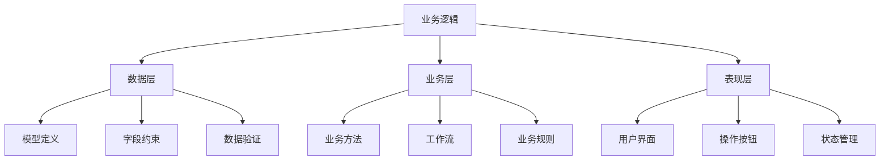

# 业务逻辑开发

## 🎯 学习目标
- 掌握Odoo业务逻辑开发的基本方法
- 学会设计和实现复杂的业务流程
- 理解业务规则和约束的实现

## 🏗️ 业务逻辑基础

### 业务逻辑层次


## 📋 业务模型设计

### 基础业务模型
```python
class BusinessModel(models.Model):
    _name = 'business.model'
    _description = '业务模型'
    _inherit = ['mail.thread', 'mail.activity.mixin']
    _order = 'name'
    
    # 基础字段
    name = fields.Char('名称', required=True, tracking=True)
    code = fields.Char('编码', size=10, index=True)
    active = fields.Boolean('激活', default=True)
    
    # 状态字段
    state = fields.Selection([
        ('draft', '草稿'),
        ('confirmed', '已确认'),
        ('approved', '已审批'),
        ('done', '完成'),
        ('cancelled', '已取消'),
    ], string='状态', default='draft', tracking=True)
    
    # 业务字段
    amount = fields.Float('金额', digits=(16, 2))
    quantity = fields.Integer('数量', default=1)
    date = fields.Date('日期', default=fields.Date.today)
    
    # 关联字段
    partner_id = fields.Many2one('res.partner', string='客户', required=True)
    user_id = fields.Many2one('res.users', string='负责人', default=lambda self: self.env.user)
    company_id = fields.Many2one('res.company', string='公司', default=lambda self: self.env.company)
    
    # 明细行
    line_ids = fields.One2many('business.model.line', 'parent_id', string='明细行')
    
    # 计算字段
    @api.depends('line_ids.amount')
    def _compute_total_amount(self):
        for record in self:
            record.total_amount = sum(record.line_ids.mapped('amount'))
    
    total_amount = fields.Float('总金额', compute='_compute_total_amount', store=True)
    
    # 约束
    @api.constrains('amount')
    def _check_amount(self):
        for record in self:
            if record.amount < 0:
                raise ValidationError('金额不能为负数')
    
    _sql_constraints = [
        ('name_uniq', 'UNIQUE(name)', '名称必须唯一'),
    ]
```

### 业务明细模型
```python
class BusinessModelLine(models.Model):
    _name = 'business.model.line'
    _description = '业务明细行'
    
    parent_id = fields.Many2one('business.model', string='父记录', required=True, ondelete='cascade')
    name = fields.Char('名称', required=True)
    amount = fields.Float('金额', digits=(16, 2))
    quantity = fields.Integer('数量', default=1)
    
    @api.depends('amount', 'quantity')
    def _compute_subtotal(self):
        for line in self:
            line.subtotal = line.amount * line.quantity
    
    subtotal = fields.Float('小计', compute='_compute_subtotal', store=True)
    
    @api.constrains('amount')
    def _check_amount(self):
        for line in self:
            if line.amount < 0:
                raise ValidationError('明细行金额不能为负数')
```

## 🔄 业务流程实现

### 状态流转
```python
class BusinessWorkflow(models.Model):
    _name = 'business.workflow'
    _inherit = 'business.model'
    
    def action_confirm(self):
        """确认操作"""
        for record in self:
            if record.state != 'draft':
                raise UserError('只有草稿状态的记录才能确认')
            
            # 业务验证
            if not record.line_ids:
                raise UserError('必须至少有一条明细行')
            
            if record.total_amount <= 0:
                raise UserError('总金额必须大于0')
            
            # 更新状态
            record.write({'state': 'confirmed'})
            
            # 发送通知
            record.message_post(
                body='记录已确认',
                message_type='notification'
            )
    
    def action_approve(self):
        """审批操作"""
        for record in self:
            if record.state != 'confirmed':
                raise UserError('只有已确认状态的记录才能审批')
            
            # 权限检查
            if not self.env.user.has_group('base.group_system'):
                raise AccessError('需要管理员权限才能审批')
            
            # 更新状态
            record.write({'state': 'approved'})
            
            # 发送通知
            record.message_post(
                body='记录已审批',
                message_type='notification'
            )
    
    def action_done(self):
        """完成操作"""
        for record in self:
            if record.state != 'approved':
                raise UserError('只有已审批状态的记录才能完成')
            
            # 执行完成逻辑
            record._process_completion()
            
            # 更新状态
            record.write({'state': 'done'})
            
            # 发送通知
            record.message_post(
                body='记录已完成',
                message_type='notification'
            )
    
    def action_cancel(self):
        """取消操作"""
        for record in self:
            if record.state in ['done']:
                raise UserError('已完成的记录不能取消')
            
            # 执行取消逻辑
            record._process_cancellation()
            
            # 更新状态
            record.write({'state': 'cancelled'})
            
            # 发送通知
            record.message_post(
                body='记录已取消',
                message_type='notification'
            )
    
    def action_reset(self):
        """重置操作"""
        for record in self:
            if record.state not in ['cancelled']:
                raise UserError('只有已取消状态的记录才能重置')
            
            # 更新状态
            record.write({'state': 'draft'})
            
            # 发送通知
            record.message_post(
                body='记录已重置为草稿',
                message_type='notification'
            )
    
    def _process_completion(self):
        """处理完成逻辑"""
        for record in self:
            # 创建相关记录
            self._create_related_records()
            
            # 更新关联数据
            self._update_related_data()
            
            # 发送邮件通知
            self._send_completion_email()
    
    def _process_cancellation(self):
        """处理取消逻辑"""
        for record in self:
            # 清理相关记录
            self._cleanup_related_records()
            
            # 恢复关联数据
            self._restore_related_data()
            
            # 发送邮件通知
            self._send_cancellation_email()
    
    def _create_related_records(self):
        """创建相关记录"""
        for record in self:
            # 创建日志记录
            self.env['business.log'].create({
                'model_id': record.id,
                'action': 'completion',
                'message': f'记录 {record.name} 已完成',
            })
    
    def _update_related_data(self):
        """更新关联数据"""
        for record in self:
            # 更新客户信息
            if record.partner_id:
                record.partner_id.write({
                    'last_business_date': record.date,
                    'total_business_amount': record.partner_id.total_business_amount + record.total_amount,
                })
    
    def _send_completion_email(self):
        """发送完成邮件"""
        for record in self:
            if record.partner_id.email:
                template = self.env.ref('business_module.email_template_completion')
                template.send_mail(record.id, force_send=True)
    
    def _cleanup_related_records(self):
        """清理相关记录"""
        for record in self:
            # 删除相关日志
            self.env['business.log'].search([
                ('model_id', '=', record.id)
            ]).unlink()
    
    def _restore_related_data(self):
        """恢复关联数据"""
        for record in self:
            # 恢复客户信息
            if record.partner_id:
                record.partner_id.write({
                    'total_business_amount': record.partner_id.total_business_amount - record.total_amount,
                })
    
    def _send_cancellation_email(self):
        """发送取消邮件"""
        for record in self:
            if record.partner_id.email:
                template = self.env.ref('business_module.email_template_cancellation')
                template.send_mail(record.id, force_send=True)
```

## 🎯 业务规则实现

### 业务规则验证
```python
class BusinessRules(models.Model):
    _name = 'business.rules'
    _inherit = 'business.model'
    
    @api.constrains('state', 'amount')
    def _check_business_rules(self):
        """业务规则验证"""
        for record in self:
            # 规则1: 已确认状态的记录金额必须大于1000
            if record.state == 'confirmed' and record.amount <= 1000:
                raise ValidationError('已确认状态的记录金额必须大于1000')
            
            # 规则2: 已审批状态的记录必须有明细行
            if record.state == 'approved' and not record.line_ids:
                raise ValidationError('已审批状态的记录必须有明细行')
            
            # 规则3: 完成状态的记录总金额必须等于明细行总金额
            if record.state == 'done' and record.total_amount != sum(record.line_ids.mapped('subtotal')):
                raise ValidationError('完成状态的记录总金额必须等于明细行总金额')
    
    @api.constrains('line_ids')
    def _check_line_rules(self):
        """明细行规则验证"""
        for record in self:
            # 规则1: 必须至少有一条明细行
            if not record.line_ids:
                raise ValidationError('必须至少有一条明细行')
            
            # 规则2: 明细行金额不能为负数
            for line in record.line_ids:
                if line.amount < 0:
                    raise ValidationError(f'明细行 {line.name} 的金额不能为负数')
            
            # 规则3: 明细行总金额不能超过主记录金额的150%
            if record.amount and sum(record.line_ids.mapped('amount')) > record.amount * 1.5:
                raise ValidationError('明细行总金额不能超过主记录金额的150%')
    
    @api.constrains('partner_id', 'date')
    def _check_partner_rules(self):
        """客户规则验证"""
        for record in self:
            if record.partner_id and record.date:
                # 规则1: 客户不能在同一天有多个相同类型的记录
                existing_records = self.search([
                    ('partner_id', '=', record.partner_id.id),
                    ('date', '=', record.date),
                    ('id', '!=', record.id),
                ])
                if existing_records:
                    raise ValidationError(f'客户 {record.partner_id.name} 在 {record.date} 已有其他记录')
                
                # 规则2: 客户当月记录总金额不能超过限额
                month_start = record.date.replace(day=1)
                month_end = (month_start + timedelta(days=32)).replace(day=1) - timedelta(days=1)
                
                month_records = self.search([
                    ('partner_id', '=', record.partner_id.id),
                    ('date', '>=', month_start),
                    ('date', '<=', month_end),
                    ('id', '!=', record.id),
                ])
                
                month_total = sum(month_records.mapped('total_amount'))
                if month_total + record.total_amount > 100000:  # 假设限额为100000
                    raise ValidationError(f'客户 {record.partner_id.name} 当月记录总金额不能超过100000')
```

### 动态业务规则
```python
class DynamicBusinessRules(models.Model):
    _name = 'dynamic.business.rules'
    _inherit = 'business.model'
    
    def _get_business_rules(self):
        """获取业务规则"""
        rules = self.env['business.rule.config'].search([('active', '=', True)])
        return rules
    
    def _validate_business_rules(self):
        """验证业务规则"""
        rules = self._get_business_rules()
        
        for rule in rules:
            if self._evaluate_rule(rule):
                if rule.rule_type == 'error':
                    raise ValidationError(rule.message)
                elif rule.rule_type == 'warning':
                    # 记录警告
                    self.message_post(
                        body=f'警告: {rule.message}',
                        message_type='notification'
                    )
    
    def _evaluate_rule(self, rule):
        """评估规则"""
        try:
            # 使用安全的表达式评估
            context = {
                'self': self,
                'record': self,
                'env': self.env,
                'fields': fields,
                'datetime': datetime,
                'timedelta': timedelta,
            }
            
            # 执行规则表达式
            result = eval(rule.condition, {"__builtins__": {}}, context)
            return bool(result)
        except Exception as e:
            # 规则评估失败，记录错误但不阻止操作
            self.message_post(
                body=f'规则评估失败: {rule.name} - {str(e)}',
                message_type='notification'
            )
            return False
    
    def action_confirm(self):
        """重写确认方法，添加规则验证"""
        # 验证业务规则
        self._validate_business_rules()
        
        # 调用父类方法
        return super().action_confirm()

class BusinessRuleConfig(models.Model):
    _name = 'business.rule.config'
    _description = '业务规则配置'
    
    name = fields.Char('规则名称', required=True)
    active = fields.Boolean('激活', default=True)
    rule_type = fields.Selection([
        ('error', '错误'),
        ('warning', '警告'),
    ], string='规则类型', required=True)
    condition = fields.Text('条件表达式', required=True, help='使用Python表达式，可用变量: self, record, env')
    message = fields.Text('消息', required=True)
    model_id = fields.Many2one('ir.model', string='适用模型', required=True)
    
    def test_rule(self):
        """测试规则"""
        try:
            # 获取测试记录
            test_record = self.env[self.model_id.model].search([], limit=1)
            if not test_record:
                raise UserError('没有找到测试记录')
            
            # 评估规则
            context = {
                'self': test_record,
                'record': test_record,
                'env': self.env,
                'fields': fields,
                'datetime': datetime,
                'timedelta': timedelta,
            }
            
            result = eval(self.condition, {"__builtins__": {}}, context)
            
            return {
                'type': 'ir.actions.client',
                'tag': 'display_notification',
                'params': {
                    'title': '规则测试',
                    'message': f'规则评估结果: {bool(result)}',
                    'type': 'success' if result else 'info',
                }
            }
        except Exception as e:
            return {
                'type': 'ir.actions.client',
                'tag': 'display_notification',
                'params': {
                    'title': '规则测试',
                    'message': f'测试失败: {str(e)}',
                    'type': 'danger',
                }
            }
```

## 🔧 业务方法实现

### 核心业务方法
```python
class BusinessMethods(models.Model):
    _name = 'business.methods'
    _inherit = 'business.model'
    
    def calculate_totals(self):
        """计算总计"""
        for record in self:
            # 计算明细行总计
            line_total = sum(record.line_ids.mapped('subtotal'))
            
            # 计算税费
            tax_amount = line_total * 0.1  # 假设税率为10%
            
            # 计算最终总计
            final_total = line_total + tax_amount
            
            # 更新记录
            record.write({
                'line_total': line_total,
                'tax_amount': tax_amount,
                'final_total': final_total,
            })
    
    def validate_data(self):
        """验证数据"""
        errors = []
        
        for record in self:
            # 验证必填字段
            if not record.name:
                errors.append(f'记录 {record.id}: 名称不能为空')
            
            if not record.partner_id:
                errors.append(f'记录 {record.id}: 客户不能为空')
            
            # 验证业务逻辑
            if record.amount <= 0:
                errors.append(f'记录 {record.id}: 金额必须大于0')
            
            if not record.line_ids:
                errors.append(f'记录 {record.id}: 必须至少有一条明细行')
            
            # 验证明细行
            for line in record.line_ids:
                if line.amount <= 0:
                    errors.append(f'记录 {record.id} 明细行 {line.name}: 金额必须大于0')
        
        if errors:
            raise UserError('\n'.join(errors))
        
        return True
    
    def process_batch(self, record_ids):
        """批量处理"""
        records = self.browse(record_ids)
        
        # 验证数据
        self.validate_data()
        
        # 批量计算
        for record in records:
            record.calculate_totals()
        
        # 批量更新状态
        records.write({'state': 'processed'})
        
        return {
            'type': 'ir.actions.client',
            'tag': 'display_notification',
            'params': {
                'title': '批量处理',
                'message': f'成功处理 {len(records)} 条记录',
                'type': 'success',
            }
        }
    
    def generate_report(self):
        """生成报表"""
        for record in self:
            # 准备报表数据
            report_data = {
                'record': record,
                'lines': record.line_ids,
                'partner': record.partner_id,
                'user': record.user_id,
                'company': record.company_id,
            }
            
            # 生成PDF报表
            report = self.env['ir.actions.report']._render('business_module.report_business_model', [record.id])
            
            # 保存报表
            attachment = self.env['ir.attachment'].create({
                'name': f'报表_{record.name}_{fields.Date.today()}.pdf',
                'type': 'binary',
                'datas': base64.b64encode(report[0]),
                'res_model': self._name,
                'res_id': record.id,
            })
            
            return {
                'type': 'ir.actions.act_url',
                'url': f'/web/content/{attachment.id}?download=true',
                'target': 'new',
            }
    
    def send_notification(self, message, notification_type='info'):
        """发送通知"""
        for record in self:
            record.message_post(
                body=message,
                message_type='notification',
                subtype_xmlid='mail.mt_note',
            )
            
            # 发送邮件通知
            if record.partner_id.email:
                template = self.env.ref('business_module.email_template_notification')
                template.with_context(
                    message=message,
                    notification_type=notification_type
                ).send_mail(record.id, force_send=True)
    
    def archive_old_records(self, days=30):
        """归档旧记录"""
        from datetime import datetime, timedelta
        
        cutoff_date = datetime.now() - timedelta(days=days)
        
        old_records = self.search([
            ('create_date', '<', cutoff_date),
            ('state', '=', 'done'),
            ('active', '=', True),
        ])
        
        if old_records:
            old_records.write({'active': False})
            
            return {
                'type': 'ir.actions.client',
                'tag': 'display_notification',
                'params': {
                    'title': '归档完成',
                    'message': f'成功归档 {len(old_records)} 条记录',
                    'type': 'success',
                }
            }
        else:
            return {
                'type': 'ir.actions.client',
                'tag': 'display_notification',
                'params': {
                    'title': '归档完成',
                    'message': '没有需要归档的记录',
                    'type': 'info',
                }
            }
```

## 🔗 相关链接

### 下一步学习
- [[工作流设计]] - 学习工作流设计
- [[业务规则配置]] - 掌握业务规则配置
- [[业务方法优化]] - 了解业务方法优化

### 实践建议
- 多练习业务逻辑设计
- 熟悉业务流程实现
- 掌握业务规则配置

## 📝 思考题

### 基础理解
1. 业务逻辑的基本组成部分是什么？
2. 如何设计合理的业务流程？
3. 业务规则的实现方法有哪些？

### 深入思考
1. 如何设计可扩展的业务架构？
2. 复杂业务逻辑如何优化？
3. 如何实现动态业务规则？

---

**学习进度**: ✅ 已完成  
**下一步**: [[工作流设计]]

