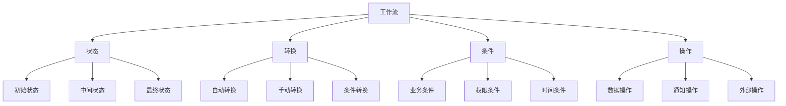

# 工作流设计

## 🎯 学习目标
- 掌握Odoo工作流设计的基本概念和方法
- 学会设计和实现复杂的工作流程
- 理解工作流的状态管理和权限控制

## 🔄 工作流基础

### 工作流概念
工作流是业务流程的自动化实现，通过定义状态、转换条件和操作来实现业务过程的自动化管理。

### 工作流组成


## 📋 基础工作流实现

### 简单工作流
```python
class SimpleWorkflow(models.Model):
    _name = 'simple.workflow'
    _description = '简单工作流'
    _inherit = ['mail.thread', 'mail.activity.mixin']
    
    name = fields.Char('名称', required=True)
    state = fields.Selection([
        ('draft', '草稿'),
        ('submitted', '已提交'),
        ('approved', '已审批'),
        ('rejected', '已拒绝'),
        ('done', '完成'),
    ], string='状态', default='draft', tracking=True)
    
    # 工作流方法
    def action_submit(self):
        """提交"""
        for record in self:
            if record.state != 'draft':
                raise UserError('只有草稿状态的记录才能提交')
            
            record.write({'state': 'submitted'})
            record.message_post(
                body='记录已提交',
                message_type='notification'
            )
    
    def action_approve(self):
        """审批通过"""
        for record in self:
            if record.state != 'submitted':
                raise UserError('只有已提交状态的记录才能审批')
            
            record.write({'state': 'approved'})
            record.message_post(
                body='记录已审批通过',
                message_type='notification'
            )
    
    def action_reject(self):
        """审批拒绝"""
        for record in self:
            if record.state != 'submitted':
                raise UserError('只有已提交状态的记录才能拒绝')
            
            record.write({'state': 'rejected'})
            record.message_post(
                body='记录已拒绝',
                message_type='notification'
            )
    
    def action_done(self):
        """完成"""
        for record in self:
            if record.state != 'approved':
                raise UserError('只有已审批状态的记录才能完成')
            
            record.write({'state': 'done'})
            record.message_post(
                body='记录已完成',
                message_type='notification'
            )
    
    def action_reset(self):
        """重置"""
        for record in self:
            if record.state not in ['rejected']:
                raise UserError('只有已拒绝状态的记录才能重置')
            
            record.write({'state': 'draft'})
            record.message_post(
                body='记录已重置为草稿',
                message_type='notification'
            )
```

### 带条件的工作流
```python
class ConditionalWorkflow(models.Model):
    _name = 'conditional.workflow'
    _description = '条件工作流'
    _inherit = ['mail.thread', 'mail.activity.mixin']
    
    name = fields.Char('名称', required=True)
    amount = fields.Float('金额', digits=(16, 2))
    priority = fields.Selection([
        ('low', '低'),
        ('medium', '中'),
        ('high', '高'),
    ], string='优先级', default='medium')
    
    state = fields.Selection([
        ('draft', '草稿'),
        ('submitted', '已提交'),
        ('manager_approved', '经理审批'),
        ('director_approved', '总监审批'),
        ('approved', '已审批'),
        ('rejected', '已拒绝'),
        ('done', '完成'),
    ], string='状态', default='draft', tracking=True)
    
    def action_submit(self):
        """提交"""
        for record in self:
            if record.state != 'draft':
                raise UserError('只有草稿状态的记录才能提交')
            
            # 根据金额和优先级决定审批流程
            if record.amount > 10000 or record.priority == 'high':
                # 需要总监审批
                record.write({'state': 'director_approved'})
                record.message_post(
                    body='记录已提交，等待总监审批',
                    message_type='notification'
                )
            elif record.amount > 1000 or record.priority == 'medium':
                # 需要经理审批
                record.write({'state': 'manager_approved'})
                record.message_post(
                    body='记录已提交，等待经理审批',
                    message_type='notification'
                )
            else:
                # 直接审批通过
                record.write({'state': 'approved'})
                record.message_post(
                    body='记录已自动审批通过',
                    message_type='notification'
                )
    
    def action_manager_approve(self):
        """经理审批"""
        for record in self:
            if record.state != 'manager_approved':
                raise UserError('只有经理审批状态的记录才能审批')
            
            # 检查权限
            if not self.env.user.has_group('base.group_user'):
                raise AccessError('需要用户权限才能审批')
            
            record.write({'state': 'approved'})
            record.message_post(
                body='经理已审批通过',
                message_type='notification'
            )
    
    def action_director_approve(self):
        """总监审批"""
        for record in self:
            if record.state != 'director_approved':
                raise UserError('只有总监审批状态的记录才能审批')
            
            # 检查权限
            if not self.env.user.has_group('base.group_system'):
                raise AccessError('需要管理员权限才能审批')
            
            record.write({'state': 'approved'})
            record.message_post(
                body='总监已审批通过',
                message_type='notification'
            )
    
    def action_reject(self):
        """拒绝"""
        for record in self:
            if record.state not in ['submitted', 'manager_approved', 'director_approved']:
                raise UserError('只有待审批状态的记录才能拒绝')
            
            record.write({'state': 'rejected'})
            record.message_post(
                body='记录已拒绝',
                message_type='notification'
            )
    
    def action_done(self):
        """完成"""
        for record in self:
            if record.state != 'approved':
                raise UserError('只有已审批状态的记录才能完成')
            
            record.write({'state': 'done'})
            record.message_post(
                body='记录已完成',
                message_type='notification'
            )
    
    def action_reset(self):
        """重置"""
        for record in self:
            if record.state not in ['rejected']:
                raise UserError('只有已拒绝状态的记录才能重置')
            
            record.write({'state': 'draft'})
            record.message_post(
                body='记录已重置为草稿',
                message_type='notification'
            )
```

## 🔧 高级工作流实现

### 并行工作流
```python
class ParallelWorkflow(models.Model):
    _name = 'parallel.workflow'
    _description = '并行工作流'
    _inherit = ['mail.thread', 'mail.activity.mixin']
    
    name = fields.Char('名称', required=True)
    state = fields.Selection([
        ('draft', '草稿'),
        ('submitted', '已提交'),
        ('tech_review', '技术评审'),
        ('business_review', '业务评审'),
        ('legal_review', '法务评审'),
        ('all_approved', '全部审批'),
        ('rejected', '已拒绝'),
        ('done', '完成'),
    ], string='状态', default='draft', tracking=True)
    
    # 评审状态
    tech_approved = fields.Boolean('技术评审通过', default=False)
    business_approved = fields.Boolean('业务评审通过', default=False)
    legal_approved = fields.Boolean('法务评审通过', default=False)
    
    def action_submit(self):
        """提交"""
        for record in self:
            if record.state != 'draft':
                raise UserError('只有草稿状态的记录才能提交')
            
            record.write({'state': 'submitted'})
            record.message_post(
                body='记录已提交，开始并行评审',
                message_type='notification'
            )
            
            # 创建并行评审任务
            record._create_review_tasks()
    
    def _create_review_tasks(self):
        """创建评审任务"""
        for record in self:
            # 创建技术评审任务
            self.env['mail.activity'].create({
                'activity_type_id': self.env.ref('mail.mail_activity_data_todo').id,
                'summary': '技术评审',
                'note': f'请对记录 {record.name} 进行技术评审',
                'user_id': self.env.ref('base.user_admin').id,
                'res_id': record.id,
                'res_model': record._name,
            })
            
            # 创建业务评审任务
            self.env['mail.activity'].create({
                'activity_type_id': self.env.ref('mail.mail_activity_data_todo').id,
                'summary': '业务评审',
                'note': f'请对记录 {record.name} 进行业务评审',
                'user_id': self.env.ref('base.user_admin').id,
                'res_id': record.id,
                'res_model': record._name,
            })
            
            # 创建法务评审任务
            self.env['mail.activity'].create({
                'activity_type_id': self.env.ref('mail.mail_activity_data_todo').id,
                'summary': '法务评审',
                'note': f'请对记录 {record.name} 进行法务评审',
                'user_id': self.env.ref('base.user_admin').id,
                'res_id': record.id,
                'res_model': record._name,
            })
    
    def action_tech_approve(self):
        """技术评审通过"""
        for record in self:
            if record.state != 'submitted':
                raise UserError('只有已提交状态的记录才能进行技术评审')
            
            record.write({'tech_approved': True})
            record.message_post(
                body='技术评审已通过',
                message_type='notification'
            )
            
            # 检查是否所有评审都通过
            record._check_all_reviews()
    
    def action_business_approve(self):
        """业务评审通过"""
        for record in self:
            if record.state != 'submitted':
                raise UserError('只有已提交状态的记录才能进行业务评审')
            
            record.write({'business_approved': True})
            record.message_post(
                body='业务评审已通过',
                message_type='notification'
            )
            
            # 检查是否所有评审都通过
            record._check_all_reviews()
    
    def action_legal_approve(self):
        """法务评审通过"""
        for record in self:
            if record.state != 'submitted':
                raise UserError('只有已提交状态的记录才能进行法务评审')
            
            record.write({'legal_approved': True})
            record.message_post(
                body='法务评审已通过',
                message_type='notification'
            )
            
            # 检查是否所有评审都通过
            record._check_all_reviews()
    
    def _check_all_reviews(self):
        """检查所有评审是否通过"""
        for record in self:
            if record.tech_approved and record.business_approved and record.legal_approved:
                record.write({'state': 'all_approved'})
                record.message_post(
                    body='所有评审已通过',
                    message_type='notification'
                )
    
    def action_reject(self):
        """拒绝"""
        for record in self:
            if record.state not in ['submitted']:
                raise UserError('只有已提交状态的记录才能拒绝')
            
            record.write({
                'state': 'rejected',
                'tech_approved': False,
                'business_approved': False,
                'legal_approved': False,
            })
            record.message_post(
                body='记录已拒绝',
                message_type='notification'
            )
    
    def action_done(self):
        """完成"""
        for record in self:
            if record.state != 'all_approved':
                raise UserError('只有全部审批状态的记录才能完成')
            
            record.write({'state': 'done'})
            record.message_post(
                body='记录已完成',
                message_type='notification'
            )
    
    def action_reset(self):
        """重置"""
        for record in self:
            if record.state not in ['rejected']:
                raise UserError('只有已拒绝状态的记录才能重置')
            
            record.write({
                'state': 'draft',
                'tech_approved': False,
                'business_approved': False,
                'legal_approved': False,
            })
            record.message_post(
                body='记录已重置为草稿',
                message_type='notification'
            )
```

### 循环工作流
```python
class LoopWorkflow(models.Model):
    _name = 'loop.workflow'
    _description = '循环工作流'
    _inherit = ['mail.thread', 'mail.activity.mixin']
    
    name = fields.Char('名称', required=True)
    state = fields.Selection([
        ('draft', '草稿'),
        ('submitted', '已提交'),
        ('review', '评审中'),
        ('revise', '修订中'),
        ('approved', '已审批'),
        ('rejected', '已拒绝'),
        ('done', '完成'),
    ], string='状态', default='draft', tracking=True)
    
    # 循环控制
    review_count = fields.Integer('评审次数', default=0)
    max_reviews = fields.Integer('最大评审次数', default=3)
    revision_notes = fields.Text('修订说明')
    
    def action_submit(self):
        """提交"""
        for record in self:
            if record.state != 'draft':
                raise UserError('只有草稿状态的记录才能提交')
            
            record.write({
                'state': 'submitted',
                'review_count': 0,
            })
            record.message_post(
                body='记录已提交，开始评审',
                message_type='notification'
            )
            
            # 开始评审
            record._start_review()
    
    def _start_review(self):
        """开始评审"""
        for record in self:
            if record.review_count >= record.max_reviews:
                # 超过最大评审次数，直接拒绝
                record.write({'state': 'rejected'})
                record.message_post(
                    body=f'超过最大评审次数({record.max_reviews})，记录已拒绝',
                    message_type='notification'
                )
                return
            
            record.write({
                'state': 'review',
                'review_count': record.review_count + 1,
            })
            record.message_post(
                body=f'开始第{record.review_count}次评审',
                message_type='notification'
            )
    
    def action_approve(self):
        """审批通过"""
        for record in self:
            if record.state != 'review':
                raise UserError('只有评审状态的记录才能审批')
            
            record.write({'state': 'approved'})
            record.message_post(
                body='记录已审批通过',
                message_type='notification'
            )
    
    def action_revise(self):
        """需要修订"""
        for record in self:
            if record.state != 'review':
                raise UserError('只有评审状态的记录才能修订')
            
            if not self.revision_notes:
                raise UserError('请填写修订说明')
            
            record.write({'state': 'revise'})
            record.message_post(
                body=f'记录需要修订: {self.revision_notes}',
                message_type='notification'
            )
    
    def action_resubmit(self):
        """重新提交"""
        for record in self:
            if record.state != 'revise':
                raise UserError('只有修订状态的记录才能重新提交')
            
            record.write({'state': 'submitted'})
            record.message_post(
                body='记录已重新提交',
                message_type='notification'
            )
            
            # 重新开始评审
            record._start_review()
    
    def action_reject(self):
        """拒绝"""
        for record in self:
            if record.state not in ['review', 'revise']:
                raise UserError('只有评审或修订状态的记录才能拒绝')
            
            record.write({'state': 'rejected'})
            record.message_post(
                body='记录已拒绝',
                message_type='notification'
            )
    
    def action_done(self):
        """完成"""
        for record in self:
            if record.state != 'approved':
                raise UserError('只有已审批状态的记录才能完成')
            
            record.write({'state': 'done'})
            record.message_post(
                body='记录已完成',
                message_type='notification'
            )
    
    def action_reset(self):
        """重置"""
        for record in self:
            if record.state not in ['rejected']:
                raise UserError('只有已拒绝状态的记录才能重置')
            
            record.write({
                'state': 'draft',
                'review_count': 0,
                'revision_notes': False,
            })
            record.message_post(
                body='记录已重置为草稿',
                message_type='notification'
            )
```

## ⏰ 定时工作流

### 定时任务工作流
```python
class ScheduledWorkflow(models.Model):
    _name = 'scheduled.workflow'
    _description = '定时工作流'
    _inherit = ['mail.thread', 'mail.activity.mixin']
    
    name = fields.Char('名称', required=True)
    state = fields.Selection([
        ('draft', '草稿'),
        ('scheduled', '已安排'),
        ('processing', '处理中'),
        ('completed', '已完成'),
        ('failed', '失败'),
    ], string='状态', default='draft', tracking=True)
    
    # 定时设置
    scheduled_date = fields.Datetime('计划执行时间')
    execution_date = fields.Datetime('实际执行时间')
    retry_count = fields.Integer('重试次数', default=0)
    max_retries = fields.Integer('最大重试次数', default=3)
    
    def action_schedule(self):
        """安排执行"""
        for record in self:
            if record.state != 'draft':
                raise UserError('只有草稿状态的记录才能安排')
            
            if not record.scheduled_date:
                raise UserError('请设置计划执行时间')
            
            record.write({'state': 'scheduled'})
            record.message_post(
                body=f'记录已安排，计划执行时间: {record.scheduled_date}',
                message_type='notification'
            )
            
            # 创建定时任务
            record._create_scheduled_task()
    
    def _create_scheduled_task(self):
        """创建定时任务"""
        for record in self:
            self.env['ir.cron'].create({
                'name': f'执行工作流: {record.name}',
                'model_id': self.env.ref('base.model_scheduled_workflow').id,
                'state': 'code',
                'code': f'model.browse({record.id})._execute_scheduled_task()',
                'interval_number': 1,
                'interval_type': 'minutes',
                'numbercall': 1,
                'active': True,
                'nextcall': record.scheduled_date,
            })
    
    def _execute_scheduled_task(self):
        """执行定时任务"""
        for record in self:
            try:
                record.write({
                    'state': 'processing',
                    'execution_date': fields.Datetime.now(),
                })
                
                # 执行具体业务逻辑
                record._process_business_logic()
                
                record.write({'state': 'completed'})
                record.message_post(
                    body='定时任务执行成功',
                    message_type='notification'
                )
                
            except Exception as e:
                record.write({'state': 'failed'})
                record.message_post(
                    body=f'定时任务执行失败: {str(e)}',
                    message_type='notification'
                )
                
                # 重试逻辑
                record._retry_task()
    
    def _process_business_logic(self):
        """处理业务逻辑"""
        for record in self:
            # 这里实现具体的业务逻辑
            # 例如：发送邮件、更新数据、调用外部API等
            pass
    
    def _retry_task(self):
        """重试任务"""
        for record in self:
            if record.retry_count < record.max_retries:
                record.write({'retry_count': record.retry_count + 1})
                
                # 重新安排执行
                retry_delay = record.retry_count * 5  # 每次重试延迟5分钟
                new_scheduled_date = fields.Datetime.now() + timedelta(minutes=retry_delay)
                
                record.write({'scheduled_date': new_scheduled_date})
                record._create_scheduled_task()
                
                record.message_post(
                    body=f'任务将重试，重试次数: {record.retry_count}/{record.max_retries}',
                    message_type='notification'
                )
            else:
                record.message_post(
                    body=f'任务重试次数已达上限({record.max_retries})，任务失败',
                    message_type='notification'
                )
    
    def action_cancel(self):
        """取消任务"""
        for record in self:
            if record.state not in ['scheduled', 'processing']:
                raise UserError('只有已安排或处理中的记录才能取消')
            
            record.write({'state': 'draft'})
            record.message_post(
                body='任务已取消',
                message_type='notification'
            )
    
    def action_reset(self):
        """重置"""
        for record in self:
            if record.state not in ['failed']:
                raise UserError('只有失败状态的记录才能重置')
            
            record.write({
                'state': 'draft',
                'retry_count': 0,
                'execution_date': False,
            })
            record.message_post(
                body='记录已重置为草稿',
                message_type='notification'
            )
```

## 🔗 相关链接

### 下一步学习
- [[业务规则配置]] - 学习业务规则配置
- [[业务方法优化]] - 了解业务方法优化
- [[工作流监控]] - 掌握工作流监控

### 实践建议
- 多练习工作流设计
- 熟悉不同工作流模式
- 掌握工作流优化技巧

## 📝 思考题

### 基础理解
1. 工作流的基本组成部分是什么？
2. 如何设计合理的工作流程？
3. 不同工作流模式的特点是什么？

### 深入思考
1. 如何设计可扩展的工作流架构？
2. 复杂工作流如何优化？
3. 如何实现工作流的监控和管理？

---

**学习进度**: ✅ 已完成  
**下一步**: [[业务规则配置]]
