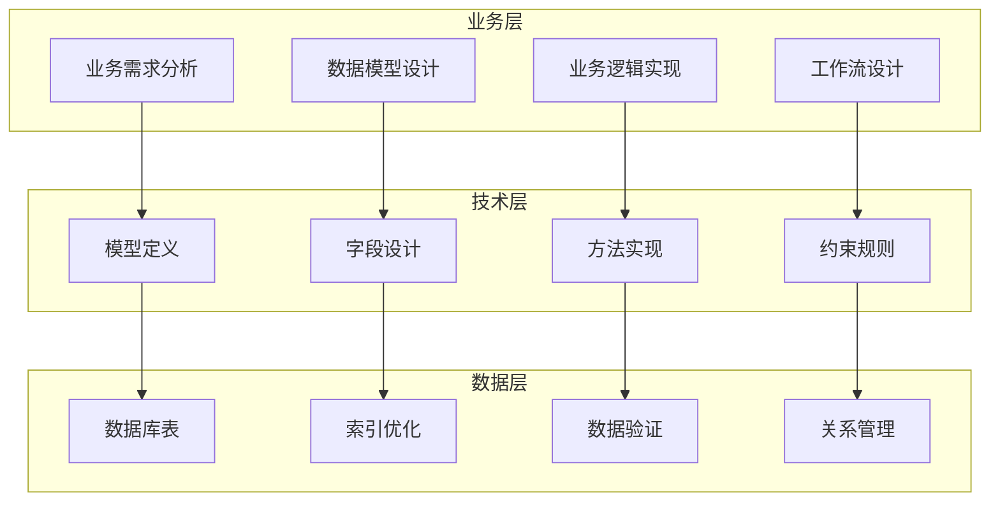

# 自定义模型开发

## 模型开发概述

在Odoo 17中，自定义模型开发是业务应用的核心。通过继承现有模型或创建全新模型，实现特定业务需求。

### 模型开发架构


## 模型创建基础

### 基础模型定义
```python
from odoo import models, fields, api
from odoo.exceptions import ValidationError, UserError

class CustomProject(models.Model):
    _name = 'custom.project'
    _description = 'Custom Project Management'
    _order = 'name'
    _rec_name = 'name'
    
    # 基础字段
    name = fields.Char('Project Name', required=True, index=True)
    description = fields.Text('Description')
    code = fields.Char('Project Code', size=10, required=True)
    
    # 状态管理
    state = fields.Selection([
        ('draft', 'Draft'),
        ('approved', 'Approved'),
        ('in_progress', 'In Progress'),
        ('completed', 'Completed'),
        ('cancelled', 'Cancelled')
    ], string='Status', default='draft', tracking=True)
    
    # 日期字段
    start_date = fields.Date('Start Date')
    end_date = fields.Date('End Date')
    deadline = fields.Date('Deadline')
    
    # 关系字段
    manager_id = fields.Many2one('res.users', 'Project Manager', required=True)
    team_member_ids = fields.Many2many('res.users', 'project_team_rel', 
                                      'project_id', 'user_id', 'Team Members')
    task_ids = fields.One2many('custom.task', 'project_id', 'Tasks')
    
    # 计算字段
    progress = fields.Float('Progress', compute='_compute_progress', store=True)
    task_count = fields.Integer('Task Count', compute='_compute_task_count')
    total_hours = fields.Float('Total Hours', compute='_compute_total_hours')
    
    # 公司字段
    company_id = fields.Many2one('res.company', 'Company', 
                                default=lambda self: self.env.company)
```

### 字段设计最佳实践
```python
class CustomProject(models.Model):
    _name = 'custom.project'
    
    # 文本字段
    name = fields.Char('Name', required=True, size=100, translate=True)
    description = fields.Html('Description', sanitize=True)
    notes = fields.Text('Notes')
    
    # 数值字段
    budget = fields.Monetary('Budget', currency_field='currency_id')
    currency_id = fields.Many2one('res.currency', 'Currency', 
                                 default=lambda self: self.env.company.currency_id)
    priority = fields.Selection([
        ('0', 'Low'),
        ('1', 'Normal'),
        ('2', 'High'),
        ('3', 'Very High')
    ], string='Priority', default='1')
    
    # 日期时间字段
    create_date = fields.Datetime('Created On', readonly=True)
    write_date = fields.Datetime('Last Updated', readonly=True)
    
    # 布尔字段
    active = fields.Boolean('Active', default=True)
    is_urgent = fields.Boolean('Is Urgent')
    
    # 二进制字段
    attachment_ids = fields.One2many('ir.attachment', 'res_id', 
                                   domain=[('res_model', '=', 'custom.project')])
```

## 业务方法实现

### CRUD操作重写
```python
class CustomProject(models.Model):
    _name = 'custom.project'
    
    @api.model
    def create(self, vals):
        """创建项目时的业务逻辑"""
        # 生成项目编码
        if not vals.get('code'):
            vals['code'] = self._generate_project_code()
        
        # 设置默认值
        if not vals.get('manager_id'):
            vals['manager_id'] = self.env.user.id
        
        # 创建记录
        project = super().create(vals)
        
        # 创建后处理
        project._post_create()
        
        return project
    
    def write(self, vals):
        """更新项目时的业务逻辑"""
        # 状态变更检查
        if 'state' in vals:
            self._check_state_change(vals['state'])
        
        # 更新记录
        result = super().write(vals)
        
        # 更新后处理
        if 'state' in vals:
            self._post_state_change()
        
        return result
    
    def unlink(self):
        """删除项目前的检查"""
        for project in self:
            if project.state in ['in_progress', 'completed']:
                raise UserError('Cannot delete project in %s state' % project.state)
            
            if project.task_ids:
                raise UserError('Cannot delete project with tasks')
        
        return super().unlink()
```

### 业务逻辑方法
```python
class CustomProject(models.Model):
    _name = 'custom.project'
    
    def action_approve(self):
        """批准项目"""
        for project in self:
            if project.state != 'draft':
                continue
            
            # 验证数据
            project._validate_approval()
            
            # 更新状态
            project.write({'state': 'approved'})
            
            # 发送通知
            project._send_approval_notification()
    
    def action_start(self):
        """开始项目"""
        for project in self:
            if project.state != 'approved':
                continue
            
            # 设置开始日期
            project.write({
                'state': 'in_progress',
                'start_date': fields.Date.today()
            })
            
            # 创建初始任务
            project._create_initial_tasks()
    
    def action_complete(self):
        """完成项目"""
        for project in self:
            if project.state != 'in_progress':
                continue
            
            # 检查所有任务是否完成
            if not project._all_tasks_completed():
                raise UserError('All tasks must be completed before finishing project')
            
            # 更新状态
            project.write({
                'state': 'completed',
                'end_date': fields.Date.today()
            })
            
            # 生成项目报告
            project._generate_project_report()
    
    def _validate_approval(self):
        """验证批准条件"""
        if not self.manager_id:
            raise ValidationError('Project manager is required')
        
        if not self.team_member_ids:
            raise ValidationError('At least one team member is required')
        
        if not self.start_date:
            raise ValidationError('Start date is required')
```

## 计算字段和依赖

### 计算字段实现
```python
class CustomProject(models.Model):
    _name = 'custom.project'
    
    @api.depends('task_ids.state', 'task_ids.progress')
    def _compute_progress(self):
        """计算项目进度"""
        for project in self:
            if not project.task_ids:
                project.progress = 0.0
                continue
            
            total_weight = sum(task.weight for task in project.task_ids)
            if total_weight == 0:
                project.progress = 0.0
                continue
            
            completed_weight = sum(
                task.weight for task in project.task_ids 
                if task.state == 'done'
            )
            project.progress = (completed_weight / total_weight) * 100
    
    @api.depends('task_ids')
    def _compute_task_count(self):
        """计算任务数量"""
        for project in self:
            project.task_count = len(project.task_ids)
    
    @api.depends('task_ids.planned_hours', 'task_ids.effective_hours')
    def _compute_total_hours(self):
        """计算总工时"""
        for project in self:
            project.total_hours = sum(
                task.effective_hours or task.planned_hours 
                for task in project.task_ids
            )
    
    # 反向计算方法
    @api.depends('progress')
    def _inverse_progress(self):
        """反向计算进度"""
        for project in self:
            # 根据进度更新任务状态
            if project.progress >= 100:
                project.task_ids.filtered(lambda t: t.state != 'done').write({
                    'state': 'done'
                })
```

## 约束和验证

### 数据验证
```python
class CustomProject(models.Model):
    _name = 'custom.project'
    
    @api.constrains('start_date', 'end_date', 'deadline')
    def _check_dates(self):
        """日期验证"""
        for project in self:
            if project.start_date and project.end_date:
                if project.start_date > project.end_date:
                    raise ValidationError('Start date cannot be after end date')
            
            if project.deadline and project.start_date:
                if project.deadline < project.start_date:
                    raise ValidationError('Deadline cannot be before start date')
    
    @api.constrains('budget')
    def _check_budget(self):
        """预算验证"""
        for project in self:
            if project.budget and project.budget < 0:
                raise ValidationError('Budget cannot be negative')
    
    @api.constrains('code')
    def _check_code(self):
        """项目编码验证"""
        for project in self:
            if project.code:
                # 检查编码格式
                if not project.code.isalnum():
                    raise ValidationError('Project code must be alphanumeric')
                
                # 检查唯一性
                existing = self.search([
                    ('code', '=', project.code),
                    ('id', '!=', project.id)
                ])
                if existing:
                    raise ValidationError('Project code must be unique')
    
    # SQL约束
    _sql_constraints = [
        ('code_uniq', 'unique(code)', 'Project code must be unique!'),
        ('budget_positive', 'check(budget >= 0)', 'Budget must be positive!'),
        ('name_required', 'check(name is not null and name != \'\')', 'Name is required!'),
    ]
```

## 模型继承和扩展

### 继承现有模型
```python
class ProjectInherit(models.Model):
    _inherit = 'project.project'
    
    # 添加新字段
    custom_field = fields.Char('Custom Field')
    priority_level = fields.Selection([
        ('low', 'Low'),
        ('medium', 'Medium'),
        ('high', 'High'),
        ('critical', 'Critical')
    ], string='Priority Level', default='medium')
    
    # 重写现有方法
    @api.model
    def create(self, vals):
        # 添加自定义逻辑
        if not vals.get('custom_field'):
            vals['custom_field'] = 'Default Value'
        
        return super().create(vals)
    
    # 添加新方法
    def action_custom_operation(self):
        """自定义操作"""
        for project in self:
            # 自定义业务逻辑
            project.write({'custom_field': 'Updated'})
    
    # 扩展现有方法
    def action_view_tasks(self):
        """扩展任务视图"""
        action = super().action_view_tasks()
        
        # 添加自定义上下文
        action['context'].update({
            'default_project_id': self.id,
            'custom_mode': True
        })
        
        return action
```

### 多表继承
```python
class ProjectExtension(models.Model):
    _name = 'project.extension'
    _inherits = {'project.project': 'project_id'}
    
    project_id = fields.Many2one('project.project', 'Project', required=True, ondelete='cascade')
    
    # 扩展字段
    extension_field = fields.Char('Extension Field')
    additional_info = fields.Text('Additional Information')
    
    # 重写方法
    def name_get(self):
        """自定义显示名称"""
        result = []
        for record in self:
            name = f"{record.project_id.name} - {record.extension_field}"
            result.append((record.id, name))
        return result
```

## 工作流和状态管理

### 状态机实现
```python
class CustomProject(models.Model):
    _name = 'custom.project'
    
    def _get_state_info(self):
        """获取状态信息"""
        return {
            'draft': {'label': 'Draft', 'color': 'secondary'},
            'approved': {'label': 'Approved', 'color': 'info'},
            'in_progress': {'label': 'In Progress', 'color': 'warning'},
            'completed': {'label': 'Completed', 'color': 'success'},
            'cancelled': {'label': 'Cancelled', 'color': 'danger'},
        }
    
    def _check_state_transition(self, from_state, to_state):
        """检查状态转换是否有效"""
        valid_transitions = {
            'draft': ['approved', 'cancelled'],
            'approved': ['in_progress', 'cancelled'],
            'in_progress': ['completed', 'cancelled'],
            'completed': [],
            'cancelled': [],
        }
        
        return to_state in valid_transitions.get(from_state, [])
    
    def _onchange_state(self):
        """状态变更时的处理"""
        for project in self:
            if project.state == 'in_progress' and not project.start_date:
                project.start_date = fields.Date.today()
            elif project.state == 'completed' and not project.end_date:
                project.end_date = fields.Date.today()
```

## 性能优化

### 查询优化
```python
class CustomProject(models.Model):
    _name = 'custom.project'
    
    def _get_projects_with_tasks(self):
        """优化查询：预加载相关数据"""
        return self.with_context(
            prefetch_fields=['task_ids', 'team_member_ids']
        ).search([
            ('state', 'in', ['in_progress', 'completed'])
        ])
    
    def _compute_progress_optimized(self):
        """优化计算字段"""
        # 使用SQL查询提高性能
        self.env.cr.execute("""
            SELECT project_id, 
                   SUM(CASE WHEN state = 'done' THEN weight ELSE 0 END) as completed,
                   SUM(weight) as total
            FROM custom_task 
            WHERE project_id IN %s
            GROUP BY project_id
        """, (tuple(self.ids),))
        
        progress_data = dict(self.env.cr.fetchall())
        
        for project in self:
            if project.id in progress_data:
                completed, total = progress_data[project.id]
                project.progress = (completed / total * 100) if total > 0 else 0
            else:
                project.progress = 0
```

## 最佳实践

### 模型设计原则
1. **单一职责**：每个模型专注一个业务领域
2. **命名规范**：使用清晰的命名约定
3. **字段设计**：合理选择字段类型和属性
4. **约束完整**：确保数据完整性
5. **性能考虑**：优化查询和计算

### 代码组织
```python
class CustomProject(models.Model):
    _name = 'custom.project'
    _description = 'Custom Project'
    
    # 1. 模型属性
    _order = 'name'
    _rec_name = 'name'
    
    # 2. 字段定义
    name = fields.Char('Name', required=True)
    
    # 3. 约束方法
    @api.constrains('name')
    def _check_name(self):
        pass
    
    # 4. 计算方法
    @api.depends('field1', 'field2')
    def _compute_field(self):
        pass
    
    # 5. 业务方法
    def action_method(self):
        pass
    
    # 6. 私有方法
    def _private_method(self):
        pass
```

## 学习建议

### 理解重点
1. **模型设计**：理解业务需求到数据模型的转换
2. **字段类型**：掌握各种字段类型的使用场景
3. **业务逻辑**：学会实现复杂的业务规则
4. **性能优化**：理解查询优化和计算优化

### 实践建议
- 从简单模型开始练习
- 理解字段类型的选择原则
- 掌握约束和验证的方法
- 学会使用继承扩展功能
- 关注性能优化技巧

## 相关链接
- [[模型(Model)详解]] - 基础模型概念
- [[业务逻辑实现]] - 业务方法实践
- [[工作流设计]] - 工作流实现
- [[状态机管理]] - 状态管理
