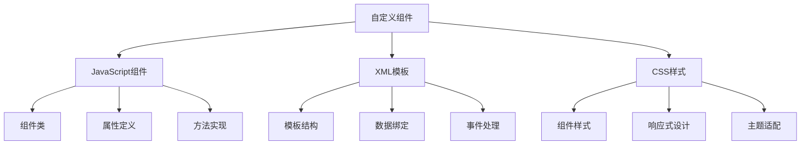

# 自定义视图组件

## 🎯 学习目标
- 掌握Odoo自定义视图组件的开发方法
- 学会创建可复用的视图组件
- 理解组件架构和设计模式

## 🧩 组件基础

### 组件概念
自定义视图组件是Odoo中可复用的UI元素，通过JavaScript和XML定义，可以在不同视图中使用。

### 组件架构


## 🔧 基础组件开发

### 简单组件
```javascript
// static/src/js/custom_component.js
odoo.define('my_module.custom_component', function (require) {
    'use strict';
    
    var AbstractField = require('web.AbstractField');
    var fieldRegistry = require('web.field_registry');
    
    var CustomComponent = AbstractField.extend({
        template: 'my_module.CustomComponent',
        
        // 组件属性
        supportedFieldTypes: ['char', 'text'],
        
        // 初始化
        init: function (parent, name, record, options) {
            this._super.apply(this, arguments);
            this.value = this.value || '';
        },
        
        // 渲染
        _render: function () {
            this.$el.html(this._renderTemplate());
        },
        
        // 获取值
        _getValue: function () {
            return this.$('input').val();
        },
        
        // 设置值
        _setValue: function (value) {
            this.value = value;
            this.$('input').val(value);
        },
        
        // 事件处理
        events: {
            'change input': '_onInputChange',
            'click button': '_onButtonClick',
        },
        
        _onInputChange: function (event) {
            var value = $(event.target).val();
            this._setValue(value);
            this.trigger('change', value);
        },
        
        _onButtonClick: function (event) {
            this.trigger('button_click', {
                value: this._getValue()
            });
        },
    });
    
    fieldRegistry.add('custom_component', CustomComponent);
    
    return CustomComponent;
});
```

### 组件模板
```xml
<!-- static/src/xml/custom_component.xml -->
<?xml version="1.0" encoding="UTF-8"?>
<templates>
    <t t-name="my_module.CustomComponent">
        <div class="custom-component">
            <div class="input-group">
                <input type="text" class="form-control" t-att-value="value" placeholder="请输入内容"/>
                <div class="input-group-append">
                    <button class="btn btn-primary" type="button">
                        <i class="fa fa-search"></i>
                    </button>
                </div>
            </div>
            <div class="component-info">
                <small class="text-muted">自定义组件</small>
            </div>
        </div>
    </t>
</templates>
```

### 组件样式
```css
/* static/src/css/custom_component.css */
.custom-component {
    margin: 10px 0;
}

.custom-component .input-group {
    margin-bottom: 5px;
}

.custom-component .component-info {
    text-align: center;
}

.custom-component .btn {
    border-radius: 0 4px 4px 0;
}

.custom-component input:focus {
    border-color: #007bff;
    box-shadow: 0 0 0 0.2rem rgba(0, 123, 255, 0.25);
}
```

## 🎨 高级组件开发

### 复杂组件
```javascript
// static/src/js/advanced_component.js
odoo.define('my_module.advanced_component', function (require) {
    'use strict';
    
    var AbstractField = require('web.AbstractField');
    var fieldRegistry = require('web.field_registry');
    var core = require('web.core');
    
    var _t = core._t;
    
    var AdvancedComponent = AbstractField.extend({
        template: 'my_module.AdvancedComponent',
        
        // 组件属性
        supportedFieldTypes: ['char', 'text', 'integer', 'float'],
        
        // 默认属性
        defaults: {
            placeholder: _t('请输入内容'),
            maxLength: 100,
            showCounter: true,
            showValidation: true,
        },
        
        // 初始化
        init: function (parent, name, record, options) {
            this._super.apply(this, arguments);
            this.value = this.value || '';
            this.options = _.extend({}, this.defaults, options);
        },
        
        // 渲染
        _render: function () {
            this.$el.html(this._renderTemplate());
            this._setupValidation();
            this._updateCounter();
        },
        
        // 设置验证
        _setupValidation: function () {
            if (this.options.showValidation) {
                this.$('input').on('blur', this._validateInput.bind(this));
            }
        },
        
        // 验证输入
        _validateInput: function () {
            var value = this._getValue();
            var isValid = this._isValid(value);
            
            this.$el.toggleClass('has-error', !isValid);
            this.$('.validation-message').toggle(!isValid);
        },
        
        // 检查有效性
        _isValid: function (value) {
            if (this.field.type === 'integer') {
                return /^\d+$/.test(value);
            } else if (this.field.type === 'float') {
                return /^\d+(\.\d+)?$/.test(value);
            }
            return true;
        },
        
        // 更新计数器
        _updateCounter: function () {
            if (this.options.showCounter) {
                var length = this._getValue().length;
                var maxLength = this.options.maxLength;
                this.$('.char-counter').text(length + '/' + maxLength);
                this.$('.char-counter').toggleClass('text-danger', length > maxLength);
            }
        },
        
        // 获取值
        _getValue: function () {
            return this.$('input').val() || '';
        },
        
        // 设置值
        _setValue: function (value) {
            this.value = value;
            this.$('input').val(value);
            this._updateCounter();
        },
        
        // 事件处理
        events: {
            'change input': '_onInputChange',
            'keyup input': '_onInputKeyup',
            'focus input': '_onInputFocus',
            'blur input': '_onInputBlur',
        },
        
        _onInputChange: function (event) {
            var value = $(event.target).val();
            this._setValue(value);
            this.trigger('change', value);
        },
        
        _onInputKeyup: function (event) {
            this._updateCounter();
        },
        
        _onInputFocus: function (event) {
            this.$el.addClass('focused');
        },
        
        _onInputBlur: function (event) {
            this.$el.removeClass('focused');
        },
    });
    
    fieldRegistry.add('advanced_component', AdvancedComponent);
    
    return AdvancedComponent;
});
```

### 高级组件模板
```xml
<!-- static/src/xml/advanced_component.xml -->
<?xml version="1.0" encoding="UTF-8"?>
<templates>
    <t t-name="my_module.AdvancedComponent">
        <div class="advanced-component">
            <div class="input-wrapper">
                <input type="text" 
                       class="form-control" 
                       t-att-value="value" 
                       t-att-placeholder="options.placeholder"
                       t-att-maxlength="options.maxLength"/>
                <div class="input-actions">
                    <button class="btn btn-sm btn-outline-secondary" type="button" title="清除">
                        <i class="fa fa-times"></i>
                    </button>
                </div>
            </div>
            <div class="component-footer">
                <div class="char-counter" t-if="options.showCounter">0/100</div>
                <div class="validation-message text-danger" style="display: none;">
                    输入格式不正确
                </div>
            </div>
        </div>
    </t>
</templates>
```

### 高级组件样式
```css
/* static/src/css/advanced_component.css */
.advanced-component {
    position: relative;
    margin: 10px 0;
}

.advanced-component .input-wrapper {
    position: relative;
    display: flex;
    align-items: center;
}

.advanced-component .input-wrapper input {
    flex: 1;
    padding-right: 40px;
}

.advanced-component .input-actions {
    position: absolute;
    right: 5px;
    top: 50%;
    transform: translateY(-50%);
}

.advanced-component .component-footer {
    display: flex;
    justify-content: space-between;
    align-items: center;
    margin-top: 5px;
    font-size: 12px;
}

.advanced-component .char-counter {
    color: #6c757d;
}

.advanced-component .char-counter.text-danger {
    color: #dc3545;
}

.advanced-component.has-error input {
    border-color: #dc3545;
    box-shadow: 0 0 0 0.2rem rgba(220, 53, 69, 0.25);
}

.advanced-component.focused input {
    border-color: #007bff;
    box-shadow: 0 0 0 0.2rem rgba(0, 123, 255, 0.25);
}
```

## 🔄 交互式组件

### 交互组件
```javascript
// static/src/js/interactive_component.js
odoo.define('my_module.interactive_component', function (require) {
    'use strict';
    
    var AbstractField = require('web.AbstractField');
    var fieldRegistry = require('web.field_registry');
    var Dialog = require('web.Dialog');
    
    var InteractiveComponent = AbstractField.extend({
        template: 'my_module.InteractiveComponent',
        
        // 组件属性
        supportedFieldTypes: ['char', 'text'],
        
        // 初始化
        init: function (parent, name, record, options) {
            this._super.apply(this, arguments);
            this.value = this.value || '';
            this.items = options.items || [];
        },
        
        // 渲染
        _render: function () {
            this.$el.html(this._renderTemplate());
            this._setupDropdown();
        },
        
        // 设置下拉菜单
        _setupDropdown: function () {
            var self = this;
            this.$('.dropdown-toggle').on('click', function (event) {
                event.preventDefault();
                self._toggleDropdown();
            });
            
            this.$('.dropdown-item').on('click', function (event) {
                event.preventDefault();
                var value = $(this).data('value');
                self._selectItem(value);
            });
        },
        
        // 切换下拉菜单
        _toggleDropdown: function () {
            this.$('.dropdown-menu').toggle();
        },
        
        // 选择项目
        _selectItem: function (value) {
            this._setValue(value);
            this.$('.dropdown-menu').hide();
            this.trigger('change', value);
        },
        
        // 获取值
        _getValue: function () {
            return this.$('input').val() || '';
        },
        
        // 设置值
        _setValue: function (value) {
            this.value = value;
            this.$('input').val(value);
        },
        
        // 事件处理
        events: {
            'change input': '_onInputChange',
            'click .btn-clear': '_onClearClick',
            'click .btn-advanced': '_onAdvancedClick',
        },
        
        _onInputChange: function (event) {
            var value = $(event.target).val();
            this._setValue(value);
            this.trigger('change', value);
        },
        
        _onClearClick: function (event) {
            event.preventDefault();
            this._setValue('');
            this.trigger('change', '');
        },
        
        _onAdvancedClick: function (event) {
            event.preventDefault();
            this._showAdvancedDialog();
        },
        
        // 显示高级对话框
        _showAdvancedDialog: function () {
            var self = this;
            var dialog = new Dialog(this, {
                title: '高级设置',
                size: 'medium',
                $content: $('<div>').html(
                    '<div class="form-group">' +
                    '<label>选项1</label>' +
                    '<input type="text" class="form-control" value="' + this.value + '">' +
                    '</div>' +
                    '<div class="form-group">' +
                    '<label>选项2</label>' +
                    '<select class="form-control">' +
                    '<option value="option1">选项1</option>' +
                    '<option value="option2">选项2</option>' +
                    '</select>' +
                    '</div>'
                ),
                buttons: [
                    {
                        text: '确定',
                        click: function () {
                            var value = dialog.$content.find('input').val();
                            self._setValue(value);
                            self.trigger('change', value);
                            dialog.close();
                        }
                    },
                    {
                        text: '取消',
                        click: function () {
                            dialog.close();
                        }
                    }
                ]
            });
            dialog.open();
        },
    });
    
    fieldRegistry.add('interactive_component', InteractiveComponent);
    
    return InteractiveComponent;
});
```

### 交互组件模板
```xml
<!-- static/src/xml/interactive_component.xml -->
<?xml version="1.0" encoding="UTF-8"?>
<templates>
    <t t-name="my_module.InteractiveComponent">
        <div class="interactive-component">
            <div class="input-group">
                <input type="text" 
                       class="form-control" 
                       t-att-value="value" 
                       placeholder="请输入内容"/>
                <div class="input-group-append">
                    <button class="btn btn-outline-secondary dropdown-toggle" type="button">
                        <i class="fa fa-chevron-down"></i>
                    </button>
                    <div class="dropdown-menu">
                        <t t-foreach="items" t-as="item" t-key="item.id">
                            <a class="dropdown-item" t-att-data-value="item.value">
                                <t t-esc="item.label"/>
                            </a>
                        </t>
                    </div>
                </div>
                <div class="input-group-append">
                    <button class="btn btn-outline-secondary btn-clear" type="button" title="清除">
                        <i class="fa fa-times"></i>
                    </button>
                </div>
                <div class="input-group-append">
                    <button class="btn btn-outline-primary btn-advanced" type="button" title="高级设置">
                        <i class="fa fa-cog"></i>
                    </button>
                </div>
            </div>
        </div>
    </t>
</templates>
```

## 📊 数据可视化组件

### 图表组件
```javascript
// static/src/js/chart_component.js
odoo.define('my_module.chart_component', function (require) {
    'use strict';
    
    var AbstractField = require('web.AbstractField');
    var fieldRegistry = require('web.field_registry');
    
    var ChartComponent = AbstractField.extend({
        template: 'my_module.ChartComponent',
        
        // 组件属性
        supportedFieldTypes: ['char', 'text'],
        
        // 初始化
        init: function (parent, name, record, options) {
            this._super.apply(this, arguments);
            this.chartData = options.chartData || [];
            this.chartType = options.chartType || 'bar';
        },
        
        // 渲染
        _render: function () {
            this.$el.html(this._renderTemplate());
            this._renderChart();
        },
        
        // 渲染图表
        _renderChart: function () {
            var self = this;
            var canvas = this.$('canvas')[0];
            var ctx = canvas.getContext('2d');
            
            // 简单的图表渲染逻辑
            this._drawBarChart(ctx, canvas.width, canvas.height);
        },
        
        // 绘制柱状图
        _drawBarChart: function (ctx, width, height) {
            var data = this.chartData;
            var maxValue = Math.max.apply(Math, data.map(function(item) { return item.value; }));
            var barWidth = width / data.length;
            var barHeight = height * 0.8;
            
            ctx.clearRect(0, 0, width, height);
            
            data.forEach(function(item, index) {
                var x = index * barWidth;
                var y = height - (item.value / maxValue) * barHeight;
                var barHeight = (item.value / maxValue) * barHeight;
                
                ctx.fillStyle = item.color || '#007bff';
                ctx.fillRect(x + 5, y, barWidth - 10, barHeight);
                
                ctx.fillStyle = '#000';
                ctx.font = '12px Arial';
                ctx.textAlign = 'center';
                ctx.fillText(item.label, x + barWidth / 2, height - 5);
            });
        },
        
        // 更新图表数据
        updateChartData: function (newData) {
            this.chartData = newData;
            this._renderChart();
        },
        
        // 事件处理
        events: {
            'click canvas': '_onCanvasClick',
        },
        
        _onCanvasClick: function (event) {
            var rect = this.$('canvas')[0].getBoundingClientRect();
            var x = event.clientX - rect.left;
            var y = event.clientY - rect.top;
            
            // 计算点击的柱状图
            var data = this.chartData;
            var width = this.$('canvas')[0].width;
            var barWidth = width / data.length;
            var index = Math.floor(x / barWidth);
            
            if (index >= 0 && index < data.length) {
                this.trigger('chart_click', {
                    index: index,
                    data: data[index]
                });
            }
        },
    });
    
    fieldRegistry.add('chart_component', ChartComponent);
    
    return ChartComponent;
});
```

### 图表组件模板
```xml
<!-- static/src/xml/chart_component.xml -->
<?xml version="1.0" encoding="UTF-8"?>
<templates>
    <t t-name="my_module.ChartComponent">
        <div class="chart-component">
            <div class="chart-header">
                <h5>数据图表</h5>
                <div class="chart-controls">
                    <button class="btn btn-sm btn-outline-secondary" type="button">
                        <i class="fa fa-refresh"></i>
                    </button>
                </div>
            </div>
            <div class="chart-body">
                <canvas width="400" height="200"></canvas>
            </div>
            <div class="chart-footer">
                <small class="text-muted">点击柱状图查看详情</small>
            </div>
        </div>
    </t>
</templates>
```

## 🔗 相关链接

### 下一步学习
- [[视图性能优化]] - 掌握视图性能优化
- [[视图调试技巧]] - 了解视图调试技巧
- [[组件测试]] - 学习组件测试

### 实践建议
- 多练习组件开发
- 熟悉JavaScript和CSS
- 掌握组件设计模式

## 📝 思考题

### 基础理解
1. 自定义组件的开发流程是什么？
2. 组件的生命周期是什么？
3. 如何实现组件间的通信？

### 深入思考
1. 如何设计可复用的组件架构？
2. 复杂组件如何优化？
3. 如何实现组件的主题适配？

---

**学习进度**: ✅ 已完成  
**下一步**: [[视图性能优化]]
