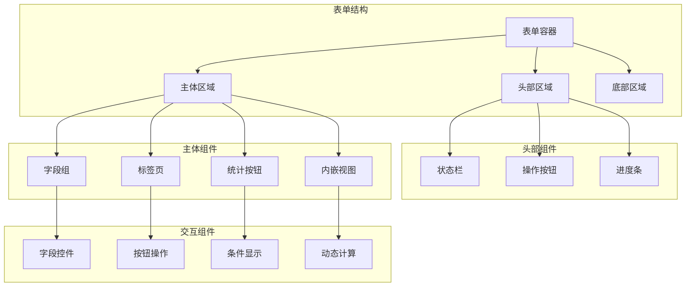

# 表单视图设计

## 表单视图概述

在Odoo 17中，表单视图是用户交互的核心界面。通过精心设计的表单视图，提供直观、高效的数据录入和编辑体验。

### 表单视图架构


## 基础表单结构

### 标准表单布局
```xml
<record id="view_sale_order_form" model="ir.ui.view">
    <field name="name">sale.order.form</field>
    <field name="model">sale.order</field>
    <field name="arch" type="xml">
        <form>
            <!-- 头部区域 -->
            <header>
                <button name="action_confirm" type="object" string="Confirm Sale" 
                        class="btn-primary" states="draft"/>
                <button name="action_cancel" type="object" string="Cancel" 
                        states="draft,sent"/>
                <field name="state" widget="statusbar" statusbar_visible="draft,sent,sale"/>
            </header>
            
            <!-- 主体区域 -->
            <sheet>
                <!-- 统计按钮区域 -->
                <div class="oe_button_box" name="button_box">
                    <button name="action_view_invoice" type="object" class="oe_stat_button">
                        <field name="invoice_count" widget="statinfo" string="Invoices"/>
                    </button>
                    <button name="action_view_delivery" type="object" class="oe_stat_button">
                        <field name="delivery_count" widget="statinfo" string="Deliveries"/>
                    </button>
                </div>
                
                <!-- 基本信息组 -->
                <group>
                    <group name="sale_info">
                        <field name="partner_id" options="{'no_create': True}"/>
                        <field name="partner_invoice_id" domain="[('parent_id', '=', partner_id)]"/>
                        <field name="partner_shipping_id" domain="[('parent_id', '=', partner_id)]"/>
                        <field name="pricelist_id" groups="product.group_product_pricelist"/>
                    </group>
                    <group name="sale_details">
                        <field name="date_order" required="1"/>
                        <field name="validity_date"/>
                        <field name="payment_term_id"/>
                        <field name="fiscal_position_id" groups="account.group_account_invoice"/>
                    </group>
                </group>
                
                <!-- 标签页区域 -->
                <notebook>
                    <page string="Order Lines" name="order_lines">
                        <field name="order_line">
                            <tree editable="bottom">
                                <field name="product_id" options="{'no_create': True}"/>
                                <field name="name"/>
                                <field name="product_uom_qty"/>
                                <field name="qty_delivered" readonly="1"/>
                                <field name="qty_invoiced" readonly="1"/>
                                <field name="price_unit"/>
                                <field name="discount"/>
                                <field name="price_subtotal"/>
                            </tree>
                        </field>
                    </page>
                    
                    <page string="Other Information" name="other_info">
                        <group>
                            <field name="note" placeholder="Terms and conditions..."/>
                            <field name="tag_ids" widget="many2many_tags"/>
                        </group>
                    </page>
                </notebook>
            </sheet>
        </form>
    </field>
</record>
```

### 响应式布局设计
```xml
<form>
    <sheet>
        <!-- 移动端优化布局 -->
        <div class="oe_title">
            <h1>
                <field name="name" placeholder="Order Reference" class="o_text_overflow"/>
            </h1>
        </div>
        
        <!-- 响应式字段组 -->
        <group class="o_label_nowrap">
            <group>
                <field name="partner_id" options="{'no_create': True}"/>
                <field name="date_order" required="1"/>
                <field name="validity_date"/>
            </group>
            <group>
                <field name="pricelist_id" groups="product.group_product_pricelist"/>
                <field name="payment_term_id"/>
                <field name="fiscal_position_id" groups="account.group_account_invoice"/>
            </group>
        </group>
        
        <!-- 移动端友好的标签页 -->
        <notebook>
            <page string="Order Lines" name="order_lines">
                <field name="order_line">
                    <tree editable="bottom" create="true" delete="true">
                        <field name="product_id" options="{'no_create': True}"/>
                        <field name="name"/>
                        <field name="product_uom_qty"/>
                        <field name="price_unit"/>
                        <field name="price_subtotal"/>
                    </tree>
                </field>
            </page>
        </notebook>
    </sheet>
</form>
```

## 高级表单组件

### 智能字段组
```xml
<form>
    <sheet>
        <!-- 条件字段组 -->
        <group name="customer_info" string="Customer Information">
            <field name="partner_id" options="{'no_create': True}"/>
            <field name="partner_invoice_id" 
                   domain="[('parent_id', '=', partner_id)]"
                   invisible="not partner_id"/>
            <field name="partner_shipping_id" 
                   domain="[('parent_id', '=', partner_id)]"
                   invisible="not partner_id"/>
        </group>
        
        <!-- 动态字段组 -->
        <group name="order_details" string="Order Details" 
               invisible="state in ['cancel', 'done']">
            <field name="date_order" required="1"/>
            <field name="validity_date"/>
            <field name="pricelist_id" groups="product.group_product_pricelist"/>
        </group>
        
        <!-- 只读字段组 -->
        <group name="computed_info" string="Computed Information" readonly="1">
            <field name="amount_untaxed"/>
            <field name="amount_tax"/>
            <field name="amount_total"/>
        </group>
    </sheet>
</form>
```

### 智能标签页
```xml
<notebook>
    <!-- 条件标签页 -->
    <page string="Order Lines" name="order_lines" 
          invisible="state in ['cancel', 'done']">
        <field name="order_line">
            <tree editable="bottom" create="true" delete="true">
                <field name="product_id" options="{'no_create': True}"/>
                <field name="name"/>
                <field name="product_uom_qty"/>
                <field name="price_unit"/>
                <field name="price_subtotal"/>
            </tree>
        </field>
    </page>
    
    <!-- 动态标签页 -->
    <page string="Invoices" name="invoices" 
          invisible="not invoice_ids">
        <field name="invoice_ids" readonly="1">
            <tree>
                <field name="name"/>
                <field name="date_invoice"/>
                <field name="amount_total"/>
                <field name="state"/>
            </tree>
        </field>
    </page>
    
    <!-- 分组标签页 -->
    <page string="Other Information" name="other_info">
        <group>
            <group string="Notes">
                <field name="note" placeholder="Terms and conditions..."/>
            </group>
            <group string="Tags">
                <field name="tag_ids" widget="many2many_tags"/>
            </group>
        </group>
    </page>
</notebook>
```

### 智能按钮设计
```xml
<form>
    <header>
        <!-- 状态相关按钮 -->
        <button name="action_confirm" type="object" string="Confirm Sale" 
                class="btn-primary" states="draft" 
                confirm="Are you sure you want to confirm this sale order?"/>
        <button name="action_cancel" type="object" string="Cancel" 
                states="draft,sent" 
                confirm="Are you sure you want to cancel this sale order?"/>
        
        <!-- 条件按钮 -->
        <button name="action_send_email" type="object" string="Send by Email" 
                states="draft,sent" 
                invisible="not partner_id"/>
        
        <!-- 工作流按钮 -->
        <field name="state" widget="statusbar" 
               statusbar_visible="draft,sent,sale,done"/>
    </header>
    
    <sheet>
        <!-- 统计按钮 -->
        <div class="oe_button_box" name="button_box">
            <button name="action_view_invoice" type="object" class="oe_stat_button">
                <field name="invoice_count" widget="statinfo" string="Invoices"/>
            </button>
            <button name="action_view_delivery" type="object" class="oe_stat_button">
                <field name="delivery_count" widget="statinfo" string="Deliveries"/>
            </button>
            <button name="action_view_picking" type="object" class="oe_stat_button">
                <field name="picking_count" widget="statinfo" string="Pickings"/>
            </button>
        </div>
        
        <!-- 内嵌操作按钮 -->
        <field name="order_line">
            <tree editable="bottom">
                <field name="product_id" options="{'no_create': True}"/>
                <field name="name"/>
                <field name="product_uom_qty"/>
                <field name="price_unit"/>
                <button name="action_update_price" type="object" string="Update Price" 
                        icon="fa-refresh" title="Update price from pricelist"/>
            </tree>
        </field>
    </sheet>
</form>
```

## 字段控件和交互

### 智能字段控件
```xml
<form>
    <sheet>
        <group>
            <group>
                <!-- 智能选择字段 -->
                <field name="partner_id" 
                       options="{'no_create': True, 'no_open': True}"
                       placeholder="Select a customer..."/>
                
                <!-- 条件字段 -->
                <field name="partner_invoice_id" 
                       domain="[('parent_id', '=', partner_id)]"
                       invisible="not partner_id"
                       options="{'no_create': True}"/>
                
                <!-- 计算字段 -->
                <field name="amount_total" readonly="1" 
                       widget="monetary" options="{'currency_field': 'currency_id'}"/>
                
                <!-- 日期时间字段 -->
                <field name="date_order" required="1" 
                       widget="date" options="{'datepicker': {'minDate': 'today'}}"/>
                
                <!-- 选择字段 -->
                <field name="state" widget="statusbar" 
                       statusbar_visible="draft,sent,sale,done"/>
                
                <!-- 多选字段 -->
                <field name="tag_ids" widget="many2many_tags" 
                       options="{'color_field': 'color'}"/>
                
                <!-- 富文本字段 -->
                <field name="note" widget="html" 
                       options="{'style-inline': 'height: 100px;'}"/>
            </group>
        </group>
    </sheet>
</form>
```

### 动态字段交互
```xml
<form>
    <sheet>
        <group>
            <group>
                <!-- 触发字段变更 -->
                <field name="partner_id" 
                       on_change="onchange_partner_id"/>
                <field name="product_id" 
                       on_change="onchange_product_id"/>
                
                <!-- 条件显示字段 -->
                <field name="discount" 
                       invisible="not product_id"
                       attrs="{'invisible': [('product_id', '=', False)]}"/>
                
                <!-- 动态计算字段 -->
                <field name="price_subtotal" 
                       compute="compute_price_subtotal"
                       store="True"
                       readonly="1"/>
                
                <!-- 智能默认值 -->
                <field name="date_order" 
                       default_focus="1"
                       default="context_today()"/>
            </group>
        </group>
    </sheet>
</form>
```

## 表单优化技巧

### 性能优化
```xml
<form>
    <sheet>
        <!-- 延迟加载 -->
        <field name="order_line" 
               widget="one2many" 
               options="{'no_create': True, 'no_open': True}"/>
        
        <!-- 批量编辑 -->
        <field name="order_line">
            <tree editable="top" multi_edit="1">
                <field name="product_id" options="{'no_create': True}"/>
                <field name="product_uom_qty"/>
                <field name="price_unit"/>
            </tree>
        </field>
        
        <!-- 条件加载 -->
        <field name="invoice_ids" 
               invisible="state not in ['sale', 'done']"
               readonly="1"/>
    </sheet>
</form>
```

### 用户体验优化
```xml
<form>
    <sheet>
        <!-- 智能提示 -->
        <field name="partner_id" 
               placeholder="Start typing customer name..."
               options="{'no_create': True}"/>
        
        <!-- 帮助文本 -->
        <field name="validity_date" 
               help="Date until when the quotation is valid"/>
        
        <!-- 字段验证 -->
        <field name="date_order" 
               required="1"
               attrs="{'required': [('state', '=', 'draft')]}"/>
        
        <!-- 智能默认值 -->
        <field name="pricelist_id" 
               default="env['product.pricelist'].search([('type', '=', 'sale')], limit=1).id"/>
        
        <!-- 字段分组 -->
        <group string="Customer Information">
            <field name="partner_id"/>
            <field name="partner_invoice_id"/>
            <field name="partner_shipping_id"/>
        </group>
    </sheet>
</form>
```

## 移动端适配

### 移动端优化
```xml
<form>
    <sheet>
        <!-- 移动端标题 -->
        <div class="oe_title">
            <h1>
                <field name="name" placeholder="Order Reference" class="o_text_overflow"/>
            </h1>
        </div>
        
        <!-- 移动端字段组 -->
        <group class="o_label_nowrap">
            <group>
                <field name="partner_id" options="{'no_create': True}"/>
                <field name="date_order" required="1"/>
            </group>
            <group>
                <field name="pricelist_id" groups="product.group_product_pricelist"/>
                <field name="payment_term_id"/>
            </group>
        </group>
        
        <!-- 移动端标签页 -->
        <notebook>
            <page string="Order Lines" name="order_lines">
                <field name="order_line">
                    <tree editable="bottom" create="true" delete="true">
                        <field name="product_id" options="{'no_create': True}"/>
                        <field name="name"/>
                        <field name="product_uom_qty"/>
                        <field name="price_unit"/>
                        <field name="price_subtotal"/>
                    </tree>
                </field>
            </page>
        </notebook>
    </sheet>
</form>
```

### 触摸优化
```xml
<form>
    <sheet>
        <!-- 大按钮 -->
        <div class="oe_button_box" name="button_box">
            <button name="action_confirm" type="object" 
                    class="oe_stat_button btn-lg"
                    states="draft">
                <field name="state" widget="statinfo" string="Confirm"/>
            </button>
        </div>
        
        <!-- 触摸友好字段 -->
        <field name="partner_id" 
               widget="many2one" 
               options="{'no_create': True}"
               class="form-control-lg"/>
        
        <!-- 大输入框 -->
        <field name="note" 
               widget="text" 
               class="form-control-lg"
               placeholder="Enter notes here..."/>
    </sheet>
</form>
```

## 表单继承和扩展

### 视图继承
```xml
<!-- 继承表单视图 -->
<record id="view_sale_order_form_inherit" model="ir.ui.view">
    <field name="name">sale.order.form.inherit</field>
    <field name="model">sale.order</field>
    <field name="inherit_id" ref="sale.view_order_form"/>
    <field name="arch" type="xml">
        <!-- 在partner_id后添加新字段 -->
        <field name="partner_id" position="after">
            <field name="custom_field"/>
        </field>
        
        <!-- 在标签页中添加新页面 -->
        <notebook position="inside">
            <page string="Custom Information" name="custom_info">
                <field name="custom_notes"/>
            </page>
        </notebook>
        
        <!-- 修改按钮属性 -->
        <button name="action_confirm" position="attributes">
            <attribute name="string">Custom Confirm</attribute>
        </button>
    </field>
</record>
```

### 动态继承
```xml
<!-- 条件继承 -->
<record id="view_sale_order_form_conditional" model="ir.ui.view">
    <field name="name">sale.order.form.conditional</field>
    <field name="model">sale.order</field>
    <field name="inherit_id" ref="sale.view_order_form"/>
    <field name="arch" type="xml">
        <!-- 只在特定条件下显示 -->
        <field name="partner_id" position="after">
            <field name="special_field" 
                   invisible="not context.get('show_special')"/>
        </field>
    </field>
</record>
```

## 最佳实践

### 表单设计原则
1. **用户友好**：界面简洁、操作直观
2. **响应式设计**：适配不同设备
3. **性能优化**：减少加载时间
4. **一致性**：保持界面风格统一
5. **可访问性**：支持键盘导航和屏幕阅读器

### 代码组织
```xml
<!-- 表单文件组织 -->
<odoo>
    <!-- 1. 基础表单视图 -->
    <record id="view_model_form" model="ir.ui.view">
        <!-- 表单视图定义 -->
    </record>
    
    <!-- 2. 继承表单视图 -->
    <record id="view_model_form_inherit" model="ir.ui.view">
        <!-- 继承视图定义 -->
    </record>
    
    <!-- 3. 动作定义 -->
    <record id="action_model" model="ir.actions.act_window">
        <!-- 动作定义 -->
    </record>
</odoo>
```

## 学习建议

### 理解重点
1. **表单结构**：理解表单的层次结构
2. **字段控件**：掌握各种字段控件的使用
3. **交互设计**：学会设计用户友好的交互
4. **响应式设计**：理解移动端适配

### 实践建议
- 从简单表单开始练习
- 理解字段控件的选择原则
- 掌握表单继承的技巧
- 关注用户体验和性能优化

## 相关链接
- [[视图(View)系统]] - 基础视图概念
- [[列表视图配置]] - 列表视图设计
- [[看板视图开发]] - 看板视图开发
- [[自定义视图组件]] - 自定义组件
