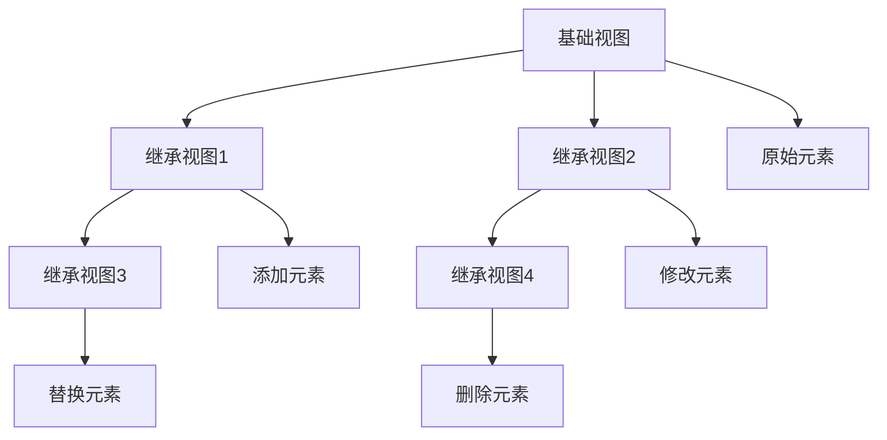

# 视图继承机制

## 🎯 学习目标
- 深入理解Odoo视图继承的工作原理
- 掌握视图继承的各种方法和技巧
- 学会设计和实现可扩展的视图架构

## 🔄 视图继承基础

### 继承概念
视图继承是Odoo中扩展现有视图功能的重要机制，允许在不修改原始视图的情况下添加、修改或删除视图元素。

### 继承层次


## 📋 继承方法详解

### 基础继承语法
```xml
<!-- 基础继承视图 -->
<record id="view_model_form_inherit" model="ir.ui.view">
    <field name="name">model.form.inherit</field>
    <field name="model">my.model</field>
    <field name="inherit_id" ref="base_module.view_model_form"/>
    <field name="arch" type="xml">
        <!-- 继承内容 -->
    </field>
</record>
```

### 位置继承方法
```xml
<!-- 位置继承示例 -->
<record id="view_model_form_inherit" model="ir.ui.view">
    <field name="name">model.form.inherit</field>
    <field name="model">my.model</field>
    <field name="inherit_id" ref="base_module.view_model_form"/>
    <field name="arch" type="xml">
        <!-- 1. 在元素内部添加 -->
        <xpath expr="//group[@string='基本信息']" position="inside">
            <field name="custom_field"/>
        </xpath>
        
        <!-- 2. 在元素后添加 -->
        <xpath expr="//div[@class='oe_title']" position="after">
            <field name="extra_field"/>
        </xpath>
        
        <!-- 3. 在元素前添加 -->
        <xpath expr="//notebook" position="before">
            <separator string="自定义分隔线"/>
        </xpath>
        
        <!-- 4. 替换元素 -->
        <xpath expr="//field[@name='old_field']" position="replace">
            <field name="new_field"/>
        </xpath>
        
        <!-- 5. 修改属性 -->
        <xpath expr="//field[@name='amount']" position="attributes">
            <attribute name="readonly">1</attribute>
            <attribute name="string">新标签</attribute>
        </xpath>
    </field>
</record>
```

## 🔧 高级继承技巧

### 条件继承
```xml
<!-- 条件继承示例 -->
<record id="view_model_form_conditional" model="ir.ui.view">
    <field name="name">model.form.conditional</field>
    <field name="model">my.model</field>
    <field name="inherit_id" ref="base_module.view_model_form"/>
    <field name="arch" type="xml">
        <!-- 根据条件显示不同内容 -->
        <xpath expr="//group[@string='基本信息']" position="inside">
            <field name="conditional_field" invisible="state != 'draft'"/>
            <field name="another_field" invisible="state == 'done'"/>
        </xpath>
        
        <!-- 根据用户组显示内容 -->
        <xpath expr="//header" position="inside">
            <button name="admin_action" string="管理员操作" type="object" 
                    class="btn-warning" groups="base.group_system"/>
        </xpath>
    </field>
</record>
```

### 多级继承
```xml
<!-- 多级继承示例 -->
<!-- 第一级继承 -->
<record id="view_model_form_level1" model="ir.ui.view">
    <field name="name">model.form.level1</field>
    <field name="model">my.model</field>
    <field name="inherit_id" ref="base_module.view_model_form"/>
    <field name="arch" type="xml">
        <xpath expr="//notebook" position="inside">
            <page string="第一级页面">
                <field name="level1_field"/>
            </page>
        </xpath>
    </field>
</record>

<!-- 第二级继承 -->
<record id="view_model_form_level2" model="ir.ui.view">
    <field name="name">model.form.level2</field>
    <field name="model">my.model</field>
    <field name="inherit_id" ref="my_module.view_model_form_level1"/>
    <field name="arch" type="xml">
        <xpath expr="//page[@string='第一级页面']" position="inside">
            <field name="level2_field"/>
        </xpath>
    </field>
</record>

<!-- 第三级继承 -->
<record id="view_model_form_level3" model="ir.ui.view">
    <field name="name">model.form.level3</field>
    <field name="model">my.model</field>
    <field name="inherit_id" ref="my_module.view_model_form_level2"/>
    <field name="arch" type="xml">
        <xpath expr="//page[@string='第一级页面']" position="inside">
            <field name="level3_field"/>
        </xpath>
    </field>
</record>
```

### 动态继承
```xml
<!-- 动态继承示例 -->
<record id="view_model_form_dynamic" model="ir.ui.view">
    <field name="name">model.form.dynamic</field>
    <field name="model">my.model</field>
    <field name="inherit_id" ref="base_module.view_model_form"/>
    <field name="arch" type="xml">
        <!-- 根据模型类型动态添加字段 -->
        <xpath expr="//group[@string='基本信息']" position="inside">
            <field name="dynamic_field" invisible="model_type != 'type1'"/>
            <field name="another_dynamic_field" invisible="model_type != 'type2'"/>
        </xpath>
        
        <!-- 根据状态动态显示按钮 -->
        <xpath expr="//header" position="inside">
            <button name="state_specific_action" string="状态特定操作" type="object" 
                    class="btn-primary" states="draft"/>
            <button name="another_state_action" string="另一状态操作" type="object" 
                    class="btn-success" states="confirmed"/>
        </xpath>
    </field>
</record>
```

## 🎨 视图组件继承

### 表单视图继承
```xml
<!-- 表单视图继承示例 -->
<record id="view_model_form_inherit" model="ir.ui.view">
    <field name="name">model.form.inherit</field>
    <field name="model">my.model</field>
    <field name="inherit_id" ref="base_module.view_model_form"/>
    <field name="arch" type="xml">
        <!-- 继承头部 -->
        <xpath expr="//header" position="inside">
            <button name="custom_action" string="自定义操作" type="object" 
                    class="btn-info" icon="fa-cog"/>
        </xpath>
        
        <!-- 继承标题区域 -->
        <xpath expr="//div[@class='oe_title']" position="after">
            <div class="oe_edit_only">
                <field name="custom_title_field"/>
            </div>
        </xpath>
        
        <!-- 继承分组 -->
        <xpath expr="//group[@string='基本信息']" position="inside">
            <field name="custom_info_field"/>
        </xpath>
        
        <!-- 继承标签页 -->
        <xpath expr="//notebook" position="inside">
            <page string="自定义页面">
                <group>
                    <field name="custom_page_field"/>
                </group>
            </page>
        </xpath>
        
        <!-- 继承侧边栏 -->
        <xpath expr="//div[@class='oe_chatter']" position="before">
            <div class="oe_edit_only">
                <field name="custom_sidebar_field"/>
            </div>
        </xpath>
    </field>
</record>
```

### 列表视图继承
```xml
<!-- 列表视图继承示例 -->
<record id="view_model_tree_inherit" model="ir.ui.view">
    <field name="name">model.tree.inherit</field>
    <field name="model">my.model</field>
    <field name="inherit_id" ref="base_module.view_model_tree"/>
    <field name="arch" type="xml">
        <!-- 继承字段 -->
        <xpath expr="//field[@name='name']" position="after">
            <field name="custom_field"/>
        </xpath>
        
        <!-- 继承按钮 -->
        <xpath expr="//button[@name='action_confirm']" position="after">
            <button name="custom_action" string="自定义操作" type="object" 
                    icon="fa-star" class="btn-warning"/>
        </xpath>
        
        <!-- 修改字段属性 -->
        <xpath expr="//field[@name='amount']" position="attributes">
            <attribute name="sum">总计</attribute>
            <attribute name="optional">show</attribute>
        </xpath>
        
        <!-- 添加装饰 -->
        <xpath expr="//tree" position="attributes">
            <attribute name="decoration-info">state=='draft'</attribute>
            <attribute name="decoration-success">state=='done'</attribute>
        </xpath>
    </field>
</record>
```

### 搜索视图继承
```xml
<!-- 搜索视图继承示例 -->
<record id="view_model_search_inherit" model="ir.ui.view">
    <field name="name">model.search.inherit</field>
    <field name="model">my.model</field>
    <field name="inherit_id" ref="base_module.view_model_search"/>
    <field name="arch" type="xml">
        <!-- 继承搜索字段 -->
        <xpath expr="//field[@name='name']" position="after">
            <field name="custom_search_field"/>
        </xpath>
        
        <!-- 继承过滤器 -->
        <xpath expr="//filter[@name='draft']" position="after">
            <filter string="自定义过滤" name="custom_filter" 
                    domain="[('custom_field', '=', 'value')]"/>
        </xpath>
        
        <!-- 继承分组 -->
        <xpath expr="//group" position="inside">
            <filter string="按自定义字段分组" name="group_custom" 
                    context="{'group_by': 'custom_field'}"/>
        </xpath>
        
        <!-- 继承排序 -->
        <xpath expr="//separator" position="after">
            <filter string="按自定义字段排序" name="sort_custom" 
                    context="{'order_by': 'custom_field desc'}"/>
        </xpath>
    </field>
</record>
```

## 🔄 看板视图继承

### 看板视图继承
```xml
<!-- 看板视图继承示例 -->
<record id="view_model_kanban_inherit" model="ir.ui.view">
    <field name="name">model.kanban.inherit</field>
    <field name="model">my.model</field>
    <field name="inherit_id" ref="base_module.view_model_kanban"/>
    <field name="arch" type="xml">
        <!-- 继承字段 -->
        <xpath expr="//field[@name='name']" position="after">
            <field name="custom_field"/>
        </xpath>
        
        <!-- 继承模板 -->
        <xpath expr="//t[@t-name='kanban-box']" position="inside">
            <!-- 在卡片头部添加内容 -->
            <div class="o_kanban_record_top">
                <div class="o_kanban_record_headings">
                    <div class="o_kanban_record_subtitle">
                        <field name="custom_field"/>
                    </div>
                </div>
            </div>
            
            <!-- 在卡片内容中添加内容 -->
            <div class="o_kanban_record_body">
                <div class="o_kanban_record_details">
                    <div class="o_kanban_record_detail">
                        <strong>自定义字段:</strong> <field name="custom_field"/>
                    </div>
                </div>
            </div>
        </xpath>
        
        <!-- 修改看板属性 -->
        <xpath expr="//kanban" position="attributes">
            <attribute name="default_group_by">custom_field</attribute>
            <attribute name="class">o_kanban_small_column</attribute>
        </xpath>
    </field>
</record>
```

## 📊 图表视图继承

### 图表视图继承
```xml
<!-- 图表视图继承示例 -->
<record id="view_model_graph_inherit" model="ir.ui.view">
    <field name="name">model.graph.inherit</field>
    <field name="model">my.model</field>
    <field name="inherit_id" ref="base_module.view_model_graph"/>
    <field name="arch" type="xml">
        <!-- 继承字段 -->
        <xpath expr="//field[@name='state']" position="after">
            <field name="custom_field"/>
        </xpath>
        
        <!-- 修改图表类型 -->
        <xpath expr="//graph" position="attributes">
            <attribute name="type">line</attribute>
            <attribute name="stacked">True</attribute>
        </xpath>
        
        <!-- 添加新的度量字段 -->
        <xpath expr="//field[@name='amount']" position="after">
            <field name="custom_amount" type="measure"/>
        </xpath>
    </field>
</record>
```

## 🔍 透视视图继承

### 透视视图继承
```xml
<!-- 透视视图继承示例 -->
<record id="view_model_pivot_inherit" model="ir.ui.view">
    <field name="name">model.pivot.inherit</field>
    <field name="model">my.model</field>
    <field name="inherit_id" ref="base_module.view_model_pivot"/>
    <field name="arch" type="xml">
        <!-- 继承字段 -->
        <xpath expr="//field[@name='state']" position="after">
            <field name="custom_field"/>
        </xpath>
        
        <!-- 添加新的行字段 -->
        <xpath expr="//field[@name='state']" position="after">
            <field name="custom_row_field" type="row"/>
        </xpath>
        
        <!-- 添加新的列字段 -->
        <xpath expr="//field[@name='partner_id']" position="after">
            <field name="custom_col_field" type="col"/>
        </xpath>
        
        <!-- 添加新的度量字段 -->
        <xpath expr="//field[@name='amount']" position="after">
            <field name="custom_measure_field" type="measure"/>
        </xpath>
    </field>
</record>
```

## 📅 日历视图继承

### 日历视图继承
```xml
<!-- 日历视图继承示例 -->
<record id="view_model_calendar_inherit" model="ir.ui.view">
    <field name="name">model.calendar.inherit</field>
    <field name="model">my.model</field>
    <field name="inherit_id" ref="base_module.view_model_calendar"/>
    <field name="arch" type="xml">
        <!-- 继承字段 -->
        <xpath expr="//field[@name='name']" position="after">
            <field name="custom_field"/>
        </xpath>
        
        <!-- 修改日历属性 -->
        <xpath expr="//calendar" position="attributes">
            <attribute name="date_start">custom_date_field</attribute>
            <attribute name="color">custom_color_field</attribute>
            <attribute name="mode">week</attribute>
        </xpath>
    </field>
</record>
```

## 🎯 继承最佳实践

### 继承设计原则
```xml
<!-- 继承设计原则示例 -->
<record id="view_model_form_best_practice" model="ir.ui.view">
    <field name="name">model.form.best.practice</field>
    <field name="model">my.model</field>
    <field name="inherit_id" ref="base_module.view_model_form"/>
    <field name="arch" type="xml">
        <!-- 1. 使用有意义的XPath表达式 -->
        <xpath expr="//group[@string='基本信息']" position="inside">
            <field name="custom_field"/>
        </xpath>
        
        <!-- 2. 避免使用过于复杂的XPath -->
        <xpath expr="//field[@name='amount']" position="attributes">
            <attribute name="readonly">1</attribute>
        </xpath>
        
        <!-- 3. 使用条件继承 -->
        <xpath expr="//header" position="inside">
            <button name="conditional_action" string="条件操作" type="object" 
                    class="btn-warning" invisible="state != 'draft'"/>
        </xpath>
        
        <!-- 4. 保持继承层次清晰 -->
        <xpath expr="//notebook" position="inside">
            <page string="扩展功能">
                <group>
                    <field name="extension_field"/>
                </group>
            </page>
        </xpath>
    </field>
</record>
```

### 继承性能优化
```xml
<!-- 继承性能优化示例 -->
<record id="view_model_form_optimized" model="ir.ui.view">
    <field name="name">model.form.optimized</field>
    <field name="model">my.model</field>
    <field name="inherit_id" ref="base_module.view_model_form"/>
    <field name="arch" type="xml">
        <!-- 1. 减少XPath查询次数 -->
        <xpath expr="//group[@string='基本信息']" position="inside">
            <field name="field1"/>
            <field name="field2"/>
            <field name="field3"/>
        </xpath>
        
        <!-- 2. 使用高效的XPath表达式 -->
        <xpath expr="//field[@name='amount']" position="attributes">
            <attribute name="readonly">1</attribute>
            <attribute name="string">新标签</attribute>
        </xpath>
        
        <!-- 3. 避免重复继承 -->
        <xpath expr="//notebook" position="inside">
            <page string="优化页面">
                <group>
                    <field name="optimized_field"/>
                </group>
            </page>
        </xpath>
    </field>
</record>
```

## 🔗 相关链接

### 下一步学习
- [[自定义视图组件]] - 学习自定义视图组件
- [[视图性能优化]] - 掌握视图性能优化
- [[视图调试技巧]] - 了解视图调试技巧

### 实践建议
- 多练习视图继承
- 熟悉XPath表达式
- 掌握继承设计原则

## 📝 思考题

### 基础理解
1. 视图继承的基本原理是什么？
2. 各种继承方法的特点是什么？
3. XPath表达式的作用是什么？

### 深入思考
1. 如何设计可扩展的视图继承架构？
2. 复杂继承如何优化？
3. 如何避免继承冲突？

---

**学习进度**: ✅ 已完成  
**下一步**: [[自定义视图组件]]

