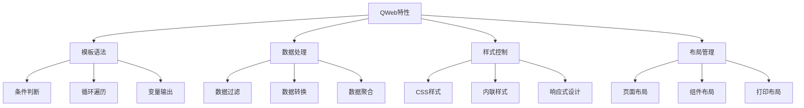

# QWeb报表定制

## 🎯 学习目标
- 掌握QWeb模板语法和特性
- 学会定制各种类型的报表模板
- 理解报表样式和布局设计

## 📊 QWeb基础

### QWeb概念
QWeb是Odoo的模板引擎，用于生成HTML、PDF等格式的报表。它基于XML语法，支持条件判断、循环、继承等高级特性。

### QWeb特性


## 📋 基础模板语法

### 变量输出
```xml
<!-- 基础变量输出 -->
<span t-field="record.name"/>
<span t-esc="record.amount"/>
<span t-raw="record.description"/>

<!-- 格式化输出 -->
<span t-field="record.date" t-options="{'widget': 'date'}"/>
<span t-field="record.amount" t-options="{'widget': 'monetary'}"/>
<span t-field="record.percentage" t-options="{'widget': 'percentage'}"/>
```

### 条件判断
```xml
<!-- 简单条件 -->
<div t-if="record.state == 'draft'">
    草稿状态
</div>

<!-- 复杂条件 -->
<div t-if="record.amount > 1000 and record.partner_id">
    高金额订单
</div>

<!-- 条件分支 -->
<div t-if="record.state == 'draft'">
    草稿
</div>
<div t-elif="record.state == 'confirmed'">
    已确认
</div>
<div t-else="">
    其他状态
</div>
```

### 循环遍历
```xml
<!-- 基础循环 -->
<t t-foreach="records" t-as="record">
    <div t-field="record.name"/>
</t>

<!-- 循环索引 -->
<t t-foreach="records" t-as="record">
    <div t-esc="record_index"/>
    <div t-field="record.name"/>
</t>

<!-- 循环条件 -->
<t t-foreach="records" t-as="record">
    <div t-if="record.amount > 0" t-field="record.name"/>
</t>
```

## 📊 高级模板语法

### 数据过滤
```xml
<!-- 过滤数据 -->
<t t-foreach="records.filtered(lambda r: r.state == 'done')" t-as="record">
    <div t-field="record.name"/>
</t>

<!-- 排序数据 -->
<t t-foreach="records.sorted(lambda r: r.amount, reverse=True)" t-as="record">
    <div t-field="record.name"/>
    <div t-field="record.amount"/>
</t>

<!-- 分组数据 -->
<t t-foreach="records.grouped('state')" t-as="group">
    <h3 t-esc="group[0]"/>
    <t t-foreach="group[1]" t-as="record">
        <div t-field="record.name"/>
    </t>
</t>
```

### 数据转换
```xml
<!-- 数据转换 -->
<div t-esc="record.amount * 1.1"/>
<div t-esc="len(record.line_ids)"/>
<div t-esc="sum(record.line_ids.mapped('amount'))"/>

<!-- 日期计算 -->
<div t-esc="record.date + datetime.timedelta(days=30)"/>
<div t-esc="(record.date - record.create_date).days"/>

<!-- 字符串操作 -->
<div t-esc="record.name.upper()"/>
<div t-esc="record.description[:100] + '...'"/>
```

### 模板继承
```xml
<!-- 基础模板 -->
<template id="base_template">
    <div class="container">
        <div class="header">
            <t t-call="web.external_layout"/>
        </div>
        <div class="content">
            <t t-raw="0"/>
        </div>
        <div class="footer">
            <t t-call="web.external_layout_footer"/>
        </div>
    </div>
</template>

<!-- 继承模板 -->
<template id="custom_template" inherit_id="base_template">
    <xpath expr="//div[@class='content']" position="replace">
        <div class="custom-content">
            <h1>自定义内容</h1>
            <t t-raw="0"/>
        </div>
    </xpath>
</template>
```

## 🎨 样式定制

### CSS样式
```xml
<!-- 内联样式 -->
<div style="color: red; font-size: 16px;">
    红色文字
</div>

<!-- CSS类 -->
<div class="text-center text-bold">
    居中加粗文字
</div>

<!-- 条件样式 -->
<div t-attf-class="record.state == 'done' ? 'text-success' : 'text-warning'">
    状态文字
</div>
```

### 响应式设计
```xml
<!-- 响应式表格 -->
<div class="table-responsive">
    <table class="table table-striped">
        <thead>
            <tr>
                <th class="d-none d-md-table-cell">ID</th>
                <th>名称</th>
                <th class="d-none d-lg-table-cell">金额</th>
                <th>状态</th>
            </tr>
        </thead>
        <tbody>
            <t t-foreach="records" t-as="record">
                <tr>
                    <td class="d-none d-md-table-cell" t-field="record.id"/>
                    <td t-field="record.name"/>
                    <td class="d-none d-lg-table-cell" t-field="record.amount"/>
                    <td t-field="record.state"/>
                </tr>
            </t>
        </tbody>
    </table>
</div>
```

### 打印样式
```xml
<!-- 打印样式 -->
<style>
    @media print {
        .no-print {
            display: none !important;
        }
        
        .page-break {
            page-break-before: always;
        }
        
        .table {
            border-collapse: collapse;
        }
        
        .table th,
        .table td {
            border: 1px solid #000;
            padding: 5px;
        }
    }
</style>

<!-- 使用打印样式 -->
<div class="no-print">
    屏幕显示内容
</div>

<div class="page-break">
    新页面内容
</div>
```

## 📄 报表布局设计

### 页面布局
```xml
<!-- 页面布局模板 -->
<template id="page_layout">
    <t t-call="web.html_container">
        <t t-foreach="docs" t-as="doc">
            <t t-call="web.external_layout">
                <div class="page">
                    <!-- 页面头部 -->
                    <div class="page-header">
                        <div class="row">
                            <div class="col-6">
                                <h1 t-field="doc.name"/>
                            </div>
                            <div class="col-6 text-right">
                                <div t-field="doc.date"/>
                            </div>
                        </div>
                    </div>
                    
                    <!-- 页面内容 -->
                    <div class="page-content">
                        <t t-raw="0"/>
                    </div>
                    
                    <!-- 页面底部 -->
                    <div class="page-footer">
                        <div class="row">
                            <div class="col-6">
                                <small>第 <span t-esc="doc_index + 1"/> 页</small>
                            </div>
                            <div class="col-6 text-right">
                                <small t-field="company.name"/>
                            </div>
                        </div>
                    </div>
                </div>
            </t>
        </t>
    </t>
</template>
```

### 表格布局
```xml
<!-- 表格布局 -->
<div class="table-container">
    <table class="table table-bordered">
        <thead>
            <tr>
                <th>序号</th>
                <th>名称</th>
                <th>金额</th>
                <th>状态</th>
                <th>备注</th>
            </tr>
        </thead>
        <tbody>
            <t t-foreach="records" t-as="record">
                <tr t-attf-class="record.state == 'done' ? 'table-success' : ''">
                    <td t-esc="record_index + 1"/>
                    <td t-field="record.name"/>
                    <td class="text-right" t-field="record.amount"/>
                    <td>
                        <span t-attf-class="record.state == 'done' ? 'badge badge-success' : 'badge badge-warning'"
                              t-field="record.state"/>
                    </td>
                    <td t-field="record.note"/>
                </tr>
            </t>
        </tbody>
        <tfoot>
            <tr>
                <td colspan="2"><strong>总计</strong></td>
                <td class="text-right"><strong t-esc="sum(records.mapped('amount'))"/></td>
                <td colspan="2"></td>
            </tr>
        </tfoot>
    </table>
</div>
```

### 卡片布局
```xml
<!-- 卡片布局 -->
<div class="row">
    <t t-foreach="records" t-as="record">
        <div class="col-md-4 mb-3">
            <div class="card">
                <div class="card-header">
                    <h5 t-field="record.name"/>
                </div>
                <div class="card-body">
                    <p class="card-text">
                        <strong>金额:</strong> <span t-field="record.amount"/>
                    </p>
                    <p class="card-text">
                        <strong>状态:</strong> <span t-field="record.state"/>
                    </p>
                    <p class="card-text">
                        <strong>日期:</strong> <span t-field="record.date"/>
                    </p>
                </div>
                <div class="card-footer">
                    <small class="text-muted" t-field="record.create_date"/>
                </div>
            </div>
        </div>
    </t>
</div>
```

## 🔧 高级功能

### 动态内容
```xml
<!-- 动态内容生成 -->
<div t-if="record.line_ids">
    <h3>明细行</h3>
    <table class="table">
        <thead>
            <tr>
                <th>项目</th>
                <th>数量</th>
                <th>单价</th>
                <th>金额</th>
            </tr>
        </thead>
        <tbody>
            <t t-foreach="record.line_ids" t-as="line">
                <tr>
                    <td t-field="line.name"/>
                    <td class="text-right" t-field="line.quantity"/>
                    <td class="text-right" t-field="line.price_unit"/>
                    <td class="text-right" t-field="line.subtotal"/>
                </tr>
            </t>
        </tbody>
    </table>
</div>
<div t-else="">
    <p class="text-muted">暂无明细行</p>
</div>
```

### 数据统计
```xml
<!-- 数据统计 -->
<div class="row">
    <div class="col-3">
        <div class="stat-card">
            <h4 t-esc="len(records)"/>
            <p>总记录数</p>
        </div>
    </div>
    <div class="col-3">
        <div class="stat-card">
            <h4 t-esc="sum(records.mapped('amount'))"/>
            <p>总金额</p>
        </div>
    </div>
    <div class="col-3">
        <div class="stat-card">
            <h4 t-esc="len(records.filtered(lambda r: r.state == 'done'))"/>
            <p>已完成</p>
        </div>
    </div>
    <div class="col-3">
        <div class="stat-card">
            <h4 t-esc="sum(records.filtered(lambda r: r.state == 'done').mapped('amount'))"/>
            <p>已完成金额</p>
        </div>
    </div>
</div>
```

### 条件渲染
```xml
<!-- 条件渲染 -->
<div t-if="user.has_group('base.group_system')">
    <h3>管理员视图</h3>
    <table class="table">
        <thead>
            <tr>
                <th>ID</th>
                <th>名称</th>
                <th>创建者</th>
                <th>创建时间</th>
            </tr>
        </thead>
        <tbody>
            <t t-foreach="records" t-as="record">
                <tr>
                    <td t-field="record.id"/>
                    <td t-field="record.name"/>
                    <td t-field="record.create_uid"/>
                    <td t-field="record.create_date"/>
                </tr>
            </t>
        </tbody>
    </table>
</div>
<div t-else="">
    <h3>普通用户视图</h3>
    <div class="row">
        <t t-foreach="records" t-as="record">
            <div class="col-md-6 mb-2">
                <div class="card">
                    <div class="card-body">
                        <h5 t-field="record.name"/>
                        <p t-field="record.description"/>
                    </div>
                </div>
            </div>
        </t>
    </div>
</div>
```

## 🎯 最佳实践

### 性能优化
```xml
<!-- 避免重复计算 -->
<t t-set="total_amount" t-value="sum(records.mapped('amount'))"/>
<div t-esc="total_amount"/>

<!-- 使用索引 -->
<t t-foreach="records" t-as="record">
    <div t-esc="record_index + 1"/>
    <div t-field="record.name"/>
</t>

<!-- 条件加载 -->
<div t-if="record.line_ids">
    <t t-foreach="record.line_ids" t-as="line">
        <div t-field="line.name"/>
    </t>
</div>
```

### 代码组织
```xml
<!-- 模块化模板 -->
<template id="header_template">
    <div class="header">
        <h1 t-field="doc.name"/>
        <p t-field="doc.description"/>
    </div>
</template>

<template id="content_template">
    <div class="content">
        <t t-call="header_template"/>
        <div class="main-content">
            <t t-raw="0"/>
        </div>
    </div>
</template>
```

### 错误处理
```xml
<!-- 安全访问 -->
<div t-esc="record.partner_id.name if record.partner_id else '无'"/>

<!-- 数据验证 -->
<div t-if="record.amount and record.amount > 0">
    <span t-field="record.amount"/>
</div>
<div t-else="">
    <span class="text-muted">金额无效</span>
</div>
```

## 🔗 相关链接

### 下一步学习
- [[报表数据处理]] - 学习报表数据处理
- [[报表样式定制]] - 了解报表样式定制
- [[报表性能优化]] - 掌握报表性能优化

### 实践建议
- 多练习QWeb语法
- 熟悉模板继承机制
- 掌握样式定制技巧

## 📝 思考题

### 基础理解
1. QWeb模板的基本语法有哪些？
2. 如何进行条件判断和循环？
3. 模板继承的作用是什么？

### 深入思考
1. 如何设计高效的报表模板？
2. 复杂报表如何优化性能？
3. 如何实现报表的响应式设计？

---

**学习进度**: ✅ 已完成  
**下一步**: [[报表数据处理]]

