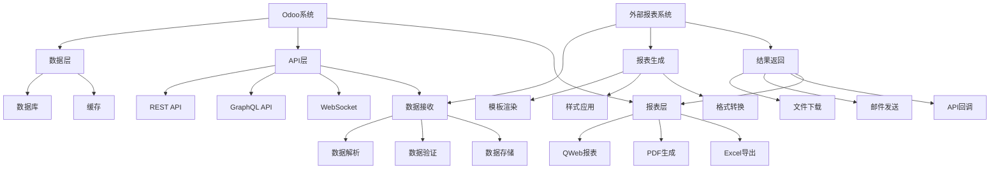

# 外部报表集成

## 🎯 学习目标
- 掌握外部报表系统的集成方法
- 学会使用第三方报表工具
- 理解报表数据同步和转换机制

## 📊 外部报表概述

### 集成方式
外部报表集成是将Odoo与第三方报表系统连接，实现数据共享和报表生成的功能。

### 集成架构


## 🔌 API集成

### REST API集成
```python
# models/external_report.py
from odoo import models, fields, api
import requests
import json
from odoo.exceptions import UserError

class ExternalReport(models.Model):
    _name = 'external.report'
    _description = '外部报表'
    
    name = fields.Char('报表名称', required=True)
    url = fields.Char('API地址', required=True)
    api_key = fields.Char('API密钥')
    method = fields.Selection([
        ('GET', 'GET'),
        ('POST', 'POST'),
        ('PUT', 'PUT'),
        ('DELETE', 'DELETE'),
    ], string='请求方法', default='POST')
    
    @api.model
    def generate_report(self, data):
        """生成外部报表"""
        try:
            # 准备请求头
            headers = {
                'Content-Type': 'application/json',
                'Authorization': f'Bearer {self.api_key}',
            }
            
            # 发送请求
            if self.method == 'GET':
                response = requests.get(self.url, headers=headers, params=data)
            else:
                response = requests.request(
                    self.method, self.url, headers=headers, json=data
                )
            
            # 检查响应状态
            response.raise_for_status()
            
            # 返回结果
            return response.json()
            
        except requests.exceptions.RequestException as e:
            raise UserError(f'外部报表生成失败: {str(e)}')
        except Exception as e:
            raise UserError(f'报表处理错误: {str(e)}')
```

### GraphQL集成
```python
# models/graphql_report.py
from odoo import models, fields, api
import requests
import json
from odoo.exceptions import UserError

class GraphQLReport(models.Model):
    _name = 'graphql.report'
    _description = 'GraphQL报表'
    
    name = fields.Char('报表名称', required=True)
    endpoint = fields.Char('GraphQL端点', required=True)
    query = fields.Text('查询语句', required=True)
    variables = fields.Text('变量定义')
    
    @api.model
    def execute_query(self, variables=None):
        """执行GraphQL查询"""
        try:
            # 准备请求数据
            data = {
                'query': self.query,
                'variables': variables or json.loads(self.variables or '{}'),
            }
            
            # 发送请求
            response = requests.post(
                self.endpoint,
                json=data,
                headers={'Content-Type': 'application/json'}
            )
            
            # 检查响应状态
            response.raise_for_status()
            
            # 解析结果
            result = response.json()
            
            # 检查错误
            if 'errors' in result:
                raise UserError(f'GraphQL查询错误: {result["errors"]}')
            
            return result.get('data', {})
            
        except requests.exceptions.RequestException as e:
            raise UserError(f'GraphQL请求失败: {str(e)}')
        except Exception as e:
            raise UserError(f'查询处理错误: {str(e)}')
```

## 📊 报表系统集成

### Power BI集成
```python
# models/powerbi_report.py
from odoo import models, fields, api
import requests
import json
from odoo.exceptions import UserError

class PowerBIReport(models.Model):
    _name = 'powerbi.report'
    _description = 'Power BI报表'
    
    name = fields.Char('报表名称', required=True)
    workspace_id = fields.Char('工作区ID', required=True)
    dataset_id = fields.Char('数据集ID', required=True)
    report_id = fields.Char('报表ID', required=True)
    client_id = fields.Char('客户端ID', required=True)
    client_secret = fields.Char('客户端密钥', required=True)
    tenant_id = fields.Char('租户ID', required=True)
    
    @api.model
    def get_access_token(self):
        """获取访问令牌"""
        try:
            url = f'https://login.microsoftonline.com/{self.tenant_id}/oauth2/v2.0/token'
            
            data = {
                'client_id': self.client_id,
                'client_secret': self.client_secret,
                'scope': 'https://analysis.windows.net/powerbi/api/.default',
                'grant_type': 'client_credentials',
            }
            
            response = requests.post(url, data=data)
            response.raise_for_status()
            
            result = response.json()
            return result.get('access_token')
            
        except Exception as e:
            raise UserError(f'获取访问令牌失败: {str(e)}')
    
    @api.model
    def refresh_dataset(self):
        """刷新数据集"""
        try:
            access_token = self.get_access_token()
            
            url = f'https://api.powerbi.com/v1.0/myorg/groups/{self.workspace_id}/datasets/{self.dataset_id}/refreshes'
            
            headers = {
                'Authorization': f'Bearer {access_token}',
                'Content-Type': 'application/json',
            }
            
            response = requests.post(url, headers=headers)
            response.raise_for_status()
            
            return response.json()
            
        except Exception as e:
            raise UserError(f'刷新数据集失败: {str(e)}')
    
    @api.model
    def get_report_embed_url(self):
        """获取报表嵌入URL"""
        try:
            access_token = self.get_access_token()
            
            url = f'https://api.powerbi.com/v1.0/myorg/groups/{self.workspace_id}/reports/{self.report_id}'
            
            headers = {
                'Authorization': f'Bearer {access_token}',
            }
            
            response = requests.get(url, headers=headers)
            response.raise_for_status()
            
            result = response.json()
            return result.get('embedUrl')
            
        except Exception as e:
            raise UserError(f'获取嵌入URL失败: {str(e)}')
```

### Tableau集成
```python
# models/tableau_report.py
from odoo import models, fields, api
import requests
import json
from odoo.exceptions import UserError

class TableauReport(models.Model):
    _name = 'tableau.report'
    _description = 'Tableau报表'
    
    name = fields.Char('报表名称', required=True)
    server_url = fields.Char('服务器地址', required=True)
    site_id = fields.Char('站点ID', required=True)
    username = fields.Char('用户名', required=True)
    password = fields.Char('密码', required=True)
    workbook_id = fields.Char('工作簿ID', required=True)
    view_id = fields.Char('视图ID', required=True)
    
    @api.model
    def get_authentication_token(self):
        """获取认证令牌"""
        try:
            url = f'{self.server_url}/api/3.9/auth/signin'
            
            data = {
                'credentials': {
                    'name': self.username,
                    'password': self.password,
                    'site': {
                        'contentUrl': self.site_id
                    }
                }
            }
            
            response = requests.post(url, json=data)
            response.raise_for_status()
            
            result = response.json()
            return result.get('credentials', {}).get('token')
            
        except Exception as e:
            raise UserError(f'获取认证令牌失败: {str(e)}')
    
    @api.model
    def get_view_data(self):
        """获取视图数据"""
        try:
            token = self.get_authentication_token()
            
            url = f'{self.server_url}/api/3.9/sites/{self.site_id}/workbooks/{self.workbook_id}/views/{self.view_id}/data'
            
            headers = {
                'X-Tableau-Auth': token,
            }
            
            response = requests.get(url, headers=headers)
            response.raise_for_status()
            
            return response.json()
            
        except Exception as e:
            raise UserError(f'获取视图数据失败: {str(e)}')
    
    @api.model
    def get_view_image(self):
        """获取视图图片"""
        try:
            token = self.get_authentication_token()
            
            url = f'{self.server_url}/api/3.9/sites/{self.site_id}/workbooks/{self.workbook_id}/views/{self.view_id}/image'
            
            headers = {
                'X-Tableau-Auth': token,
            }
            
            response = requests.get(url, headers=headers)
            response.raise_for_status()
            
            return response.content
            
        except Exception as e:
            raise UserError(f'获取视图图片失败: {str(e)}')
```

## 📈 数据同步

### 数据导出
```python
# models/data_export.py
from odoo import models, fields, api
import csv
import json
import xml.etree.ElementTree as ET
from odoo.exceptions import UserError

class DataExport(models.Model):
    _name = 'data.export'
    _description = '数据导出'
    
    name = fields.Char('导出名称', required=True)
    model_name = fields.Char('模型名称', required=True)
    domain = fields.Text('查询条件')
    fields_to_export = fields.Text('导出字段')
    export_format = fields.Selection([
        ('csv', 'CSV'),
        ('json', 'JSON'),
        ('xml', 'XML'),
        ('excel', 'Excel'),
    ], string='导出格式', default='csv')
    
    @api.model
    def export_data(self):
        """导出数据"""
        try:
            # 获取模型
            model = self.env[self.model_name]
            
            # 构建查询条件
            domain = eval(self.domain) if self.domain else []
            
            # 查询数据
            records = model.search(domain)
            
            # 获取字段列表
            fields_list = eval(self.fields_to_export) if self.fields_to_export else []
            
            if not fields_list:
                fields_list = list(records._fields.keys())[:10]  # 默认前10个字段
            
            # 根据格式导出
            if self.export_format == 'csv':
                return self._export_csv(records, fields_list)
            elif self.export_format == 'json':
                return self._export_json(records, fields_list)
            elif self.export_format == 'xml':
                return self._export_xml(records, fields_list)
            elif self.export_format == 'excel':
                return self._export_excel(records, fields_list)
                
        except Exception as e:
            raise UserError(f'数据导出失败: {str(e)}')
    
    def _export_csv(self, records, fields_list):
        """导出CSV格式"""
        import io
        
        output = io.StringIO()
        writer = csv.writer(output)
        
        # 写入标题行
        writer.writerow(fields_list)
        
        # 写入数据行
        for record in records:
            row = []
            for field in fields_list:
                value = getattr(record, field, '')
                if hasattr(value, 'name'):
                    value = value.name
                row.append(str(value))
            writer.writerow(row)
        
        return output.getvalue()
    
    def _export_json(self, records, fields_list):
        """导出JSON格式"""
        data = []
        for record in records:
            row = {}
            for field in fields_list:
                value = getattr(record, field, '')
                if hasattr(value, 'name'):
                    value = value.name
                row[field] = str(value)
            data.append(row)
        
        return json.dumps(data, ensure_ascii=False, indent=2)
    
    def _export_xml(self, records, fields_list):
        """导出XML格式"""
        root = ET.Element('data')
        
        for record in records:
            record_elem = ET.SubElement(root, 'record')
            for field in fields_list:
                value = getattr(record, field, '')
                if hasattr(value, 'name'):
                    value = value.name
                field_elem = ET.SubElement(record_elem, field)
                field_elem.text = str(value)
        
        return ET.tostring(root, encoding='unicode')
    
    def _export_excel(self, records, fields_list):
        """导出Excel格式"""
        try:
            import xlsxwriter
            
            output = io.BytesIO()
            workbook = xlsxwriter.Workbook(output)
            worksheet = workbook.add_worksheet()
            
            # 写入标题行
            for col, field in enumerate(fields_list):
                worksheet.write(0, col, field)
            
            # 写入数据行
            for row, record in enumerate(records, 1):
                for col, field in enumerate(fields_list):
                    value = getattr(record, field, '')
                    if hasattr(value, 'name'):
                        value = value.name
                    worksheet.write(row, col, str(value))
            
            workbook.close()
            return output.getvalue()
            
        except ImportError:
            raise UserError('请安装xlsxwriter库: pip install xlsxwriter')
```

### 数据导入
```python
# models/data_import.py
from odoo import models, fields, api
import csv
import json
import xml.etree.ElementTree as ET
from odoo.exceptions import UserError

class DataImport(models.Model):
    _name = 'data.import'
    _description = '数据导入'
    
    name = fields.Char('导入名称', required=True)
    model_name = fields.Char('模型名称', required=True)
    import_format = fields.Selection([
        ('csv', 'CSV'),
        ('json', 'JSON'),
        ('xml', 'XML'),
        ('excel', 'Excel'),
    ], string='导入格式', default='csv')
    data_file = fields.Binary('数据文件', required=True)
    field_mapping = fields.Text('字段映射')
    update_existing = fields.Boolean('更新已存在记录', default=False)
    
    @api.model
    def import_data(self):
        """导入数据"""
        try:
            # 获取模型
            model = self.env[self.model_name]
            
            # 解析数据文件
            if self.import_format == 'csv':
                data = self._parse_csv()
            elif self.import_format == 'json':
                data = self._parse_json()
            elif self.import_format == 'xml':
                data = self._parse_xml()
            elif self.import_format == 'excel':
                data = self._parse_excel()
            
            # 获取字段映射
            field_mapping = eval(self.field_mapping) if self.field_mapping else {}
            
            # 导入数据
            created_count = 0
            updated_count = 0
            
            for row in data:
                # 准备数据
                values = {}
                for source_field, target_field in field_mapping.items():
                    if source_field in row:
                        values[target_field] = row[source_field]
                
                # 检查是否已存在
                if self.update_existing:
                    existing = model.search([('name', '=', values.get('name'))])
                    if existing:
                        existing.write(values)
                        updated_count += 1
                        continue
                
                # 创建新记录
                model.create(values)
                created_count += 1
            
            return {
                'created': created_count,
                'updated': updated_count,
            }
            
        except Exception as e:
            raise UserError(f'数据导入失败: {str(e)}')
    
    def _parse_csv(self):
        """解析CSV文件"""
        import io
        
        data = []
        file_content = base64.b64decode(self.data_file).decode('utf-8')
        reader = csv.DictReader(io.StringIO(file_content))
        
        for row in reader:
            data.append(row)
        
        return data
    
    def _parse_json(self):
        """解析JSON文件"""
        file_content = base64.b64decode(self.data_file).decode('utf-8')
        return json.loads(file_content)
    
    def _parse_xml(self):
        """解析XML文件"""
        file_content = base64.b64decode(self.data_file).decode('utf-8')
        root = ET.fromstring(file_content)
        
        data = []
        for record in root.findall('record'):
            row = {}
            for field in record:
                row[field.tag] = field.text
            data.append(row)
        
        return data
    
    def _parse_excel(self):
        """解析Excel文件"""
        try:
            import pandas as pd
            
            file_content = base64.b64decode(self.data_file)
            df = pd.read_excel(io.BytesIO(file_content))
            
            return df.to_dict('records')
            
        except ImportError:
            raise UserError('请安装pandas库: pip install pandas')
```

## 🔄 实时同步

### WebSocket集成
```python
# models/websocket_sync.py
from odoo import models, fields, api
import websocket
import json
import threading
from odoo.exceptions import UserError

class WebSocketSync(models.Model):
    _name = 'websocket.sync'
    _description = 'WebSocket同步'
    
    name = fields.Char('同步名称', required=True)
    url = fields.Char('WebSocket地址', required=True)
    is_active = fields.Boolean('是否激活', default=False)
    sync_interval = fields.Integer('同步间隔(秒)', default=60)
    
    @api.model
    def start_sync(self):
        """启动同步"""
        if self.is_active:
            raise UserError('同步已启动')
        
        self.is_active = True
        
        # 启动同步线程
        thread = threading.Thread(target=self._sync_worker)
        thread.daemon = True
        thread.start()
    
    @api.model
    def stop_sync(self):
        """停止同步"""
        self.is_active = False
    
    def _sync_worker(self):
        """同步工作线程"""
        while self.is_active:
            try:
                # 建立WebSocket连接
                ws = websocket.WebSocket()
                ws.connect(self.url)
                
                # 发送认证信息
                auth_data = {
                    'type': 'auth',
                    'token': self._get_auth_token(),
                }
                ws.send(json.dumps(auth_data))
                
                # 监听消息
                while self.is_active:
                    message = ws.recv()
                    if message:
                        self._process_message(json.loads(message))
                
                ws.close()
                
            except Exception as e:
                # 记录错误并重试
                self._log_error(f'WebSocket同步错误: {str(e)}')
                time.sleep(self.sync_interval)
    
    def _process_message(self, message):
        """处理接收到的消息"""
        try:
            message_type = message.get('type')
            
            if message_type == 'data_update':
                self._handle_data_update(message.get('data'))
            elif message_type == 'report_request':
                self._handle_report_request(message.get('data'))
            elif message_type == 'status_update':
                self._handle_status_update(message.get('data'))
                
        except Exception as e:
            self._log_error(f'消息处理错误: {str(e)}')
    
    def _handle_data_update(self, data):
        """处理数据更新"""
        model_name = data.get('model')
        records = data.get('records', [])
        
        model = self.env[model_name]
        
        for record_data in records:
            # 查找或创建记录
            existing = model.search([('external_id', '=', record_data.get('id'))])
            
            if existing:
                existing.write(record_data)
            else:
                record_data['external_id'] = record_data.get('id')
                model.create(record_data)
    
    def _handle_report_request(self, data):
        """处理报表请求"""
        report_name = data.get('report_name')
        parameters = data.get('parameters', {})
        
        # 生成报表
        report = self.env['ir.actions.report'].search([
            ('report_name', '=', report_name)
        ])
        
        if report:
            # 生成报表文件
            report_data = report._render_qweb_pdf(
                data.get('doc_ids', []),
                data=parameters
            )
            
            # 发送报表
            self._send_report(report_data, data.get('callback_url'))
    
    def _send_report(self, report_data, callback_url):
        """发送报表"""
        try:
            import requests
            
            files = {
                'report': ('report.pdf', report_data, 'application/pdf')
            }
            
            response = requests.post(callback_url, files=files)
            response.raise_for_status()
            
        except Exception as e:
            self._log_error(f'发送报表失败: {str(e)}')
```

## 🔗 相关链接

### 下一步学习
- [[报表性能优化]] - 学习报表性能优化
- [[报表安全控制]] - 了解报表安全控制
- [[报表监控告警]] - 掌握报表监控告警

### 实践建议
- 多练习外部系统集成
- 熟悉API调用方法
- 掌握数据同步技术

## 📝 思考题

### 基础理解
1. 外部报表集成的方式有哪些？
2. API集成的基本流程是什么？
3. 数据同步的机制是什么？

### 深入思考
1. 如何设计高效的外部报表集成架构？
2. 复杂报表系统如何优化性能？
3. 如何实现报表的实时同步？

---

**学习进度**: ✅ 已完成  
**下一步**: [[报表性能优化]]

