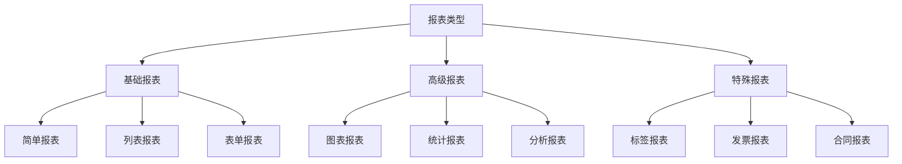

# 报表开发基础

## 🎯 学习目标
- 掌握Odoo报表开发的基本概念和方法
- 学会创建各种类型的报表
- 理解报表模板和数据处理机制

## 📊 报表基础

### 报表概念
报表是Odoo中用于数据展示和输出的重要功能，支持多种格式输出，如PDF、Excel、HTML等。

### 报表类型


## 📋 基础报表开发

### 简单报表
```python
# reports/simple_report.py
from odoo import models, fields, api

class SimpleReport(models.AbstractModel):
    _name = 'report.my_module.simple_report'
    _description = '简单报表'
    
    @api.model
    def _get_report_values(self, docids, data=None):
        """获取报表数据"""
        docs = self.env['my.model'].browse(docids)
        
        return {
            'doc_ids': docids,
            'doc_model': 'my.model',
            'docs': docs,
            'data': data,
            'company': self.env.company,
            'user': self.env.user,
        }
```

### 报表模板
```xml
<!-- reports/simple_report_template.xml -->
<?xml version="1.0" encoding="utf-8"?>
<odoo>
    <template id="simple_report_template">
        <t t-call="web.html_container">
            <t t-foreach="docs" t-as="doc">
                <t t-call="web.external_layout">
                    <div class="page">
                        <div class="oe_structure"/>
                        
                        <div class="row">
                            <div class="col-12">
                                <h2>简单报表</h2>
                            </div>
                        </div>
                        
                        <div class="row">
                            <div class="col-6">
                                <strong>名称:</strong> <span t-field="doc.name"/>
                            </div>
                            <div class="col-6">
                                <strong>编码:</strong> <span t-field="doc.code"/>
                            </div>
                        </div>
                        
                        <div class="row">
                            <div class="col-6">
                                <strong>金额:</strong> <span t-field="doc.amount"/>
                            </div>
                            <div class="col-6">
                                <strong>状态:</strong> <span t-field="doc.state"/>
                            </div>
                        </div>
                        
                        <div class="oe_structure"/>
                    </div>
                </t>
            </t>
        </t>
    </template>
</odoo>
```

### 报表动作
```xml
<!-- reports/report_actions.xml -->
<?xml version="1.0" encoding="utf-8"?>
<odoo>
    <record id="action_simple_report" model="ir.actions.report">
        <field name="name">简单报表</field>
        <field name="model">my.model</field>
        <field name="report_type">qweb-pdf</field>
        <field name="report_name">my_module.simple_report</field>
        <field name="report_file">my_module.simple_report</field>
        <field name="binding_model_id" ref="model_my_model"/>
        <field name="binding_type">report</field>
    </record>
</odoo>
```

## 📊 列表报表开发

### 列表报表
```python
# reports/list_report.py
from odoo import models, fields, api

class ListReport(models.AbstractModel):
    _name = 'report.my_module.list_report'
    _description = '列表报表'
    
    @api.model
    def _get_report_values(self, docids, data=None):
        """获取报表数据"""
        # 获取查询条件
        domain = data.get('domain', []) if data else []
        
        # 查询数据
        records = self.env['my.model'].search(domain)
        
        # 计算统计信息
        total_amount = sum(records.mapped('amount'))
        total_count = len(records)
        
        return {
            'doc_ids': docids,
            'doc_model': 'my.model',
            'docs': records,
            'data': data,
            'total_amount': total_amount,
            'total_count': total_count,
            'company': self.env.company,
            'user': self.env.user,
        }
```

### 列表报表模板
```xml
<!-- reports/list_report_template.xml -->
<?xml version="1.0" encoding="utf-8"?>
<odoo>
    <template id="list_report_template">
        <t t-call="web.html_container">
            <t t-call="web.external_layout">
                <div class="page">
                    <div class="oe_structure"/>
                    
                    <div class="row">
                        <div class="col-12">
                            <h2>列表报表</h2>
                        </div>
                    </div>
                    
                    <!-- 统计信息 -->
                    <div class="row">
                        <div class="col-6">
                            <strong>总记录数:</strong> <span t-esc="total_count"/>
                        </div>
                        <div class="col-6">
                            <strong>总金额:</strong> <span t-esc="total_amount"/>
                        </div>
                    </div>
                    
                    <hr/>
                    
                    <!-- 数据表格 -->
                    <div class="row">
                        <div class="col-12">
                            <table class="table table-bordered">
                                <thead>
                                    <tr>
                                        <th>名称</th>
                                        <th>编码</th>
                                        <th>金额</th>
                                        <th>状态</th>
                                        <th>创建日期</th>
                                    </tr>
                                </thead>
                                <tbody>
                                    <t t-foreach="docs" t-as="doc">
                                        <tr>
                                            <td><span t-field="doc.name"/></td>
                                            <td><span t-field="doc.code"/></td>
                                            <td><span t-field="doc.amount"/></td>
                                            <td><span t-field="doc.state"/></td>
                                            <td><span t-field="doc.create_date"/></td>
                                        </tr>
                                    </t>
                                </tbody>
                            </table>
                        </div>
                    </div>
                    
                    <div class="oe_structure"/>
                </div>
            </t>
        </t>
    </template>
</odoo>
```

## 📈 图表报表开发

### 图表报表
```python
# reports/chart_report.py
from odoo import models, fields, api

class ChartReport(models.AbstractModel):
    _name = 'report.my_module.chart_report'
    _description = '图表报表'
    
    @api.model
    def _get_report_values(self, docids, data=None):
        """获取报表数据"""
        # 获取查询条件
        domain = data.get('domain', []) if data else []
        
        # 查询数据
        records = self.env['my.model'].search(domain)
        
        # 按状态分组统计
        state_stats = {}
        for record in records:
            state = record.state
            if state not in state_stats:
                state_stats[state] = {'count': 0, 'amount': 0}
            state_stats[state]['count'] += 1
            state_stats[state]['amount'] += record.amount
        
        # 按日期分组统计
        date_stats = {}
        for record in records:
            date = record.create_date.date()
            if date not in date_stats:
                date_stats[date] = {'count': 0, 'amount': 0}
            date_stats[date]['count'] += 1
            date_stats[date]['amount'] += record.amount
        
        return {
            'doc_ids': docids,
            'doc_model': 'my.model',
            'docs': records,
            'data': data,
            'state_stats': state_stats,
            'date_stats': date_stats,
            'company': self.env.company,
            'user': self.env.user,
        }
```

### 图表报表模板
```xml
<!-- reports/chart_report_template.xml -->
<?xml version="1.0" encoding="utf-8"?>
<odoo>
    <template id="chart_report_template">
        <t t-call="web.html_container">
            <t t-call="web.external_layout">
                <div class="page">
                    <div class="oe_structure"/>
                    
                    <div class="row">
                        <div class="col-12">
                            <h2>图表报表</h2>
                        </div>
                    </div>
                    
                    <!-- 状态统计 -->
                    <div class="row">
                        <div class="col-12">
                            <h3>按状态统计</h3>
                            <table class="table table-bordered">
                                <thead>
                                    <tr>
                                        <th>状态</th>
                                        <th>数量</th>
                                        <th>金额</th>
                                    </tr>
                                </thead>
                                <tbody>
                                    <t t-foreach="state_stats" t-as="state_stat">
                                        <tr>
                                            <td><span t-esc="state_stat[0]"/></td>
                                            <td><span t-esc="state_stat[1]['count']"/></td>
                                            <td><span t-esc="state_stat[1]['amount']"/></td>
                                        </tr>
                                    </t>
                                </tbody>
                            </table>
                        </div>
                    </div>
                    
                    <!-- 日期统计 -->
                    <div class="row">
                        <div class="col-12">
                            <h3>按日期统计</h3>
                            <table class="table table-bordered">
                                <thead>
                                    <tr>
                                        <th>日期</th>
                                        <th>数量</th>
                                        <th>金额</th>
                                    </tr>
                                </thead>
                                <tbody>
                                    <t t-foreach="date_stats" t-as="date_stat">
                                        <tr>
                                            <td><span t-esc="date_stat[0]"/></td>
                                            <td><span t-esc="date_stat[1]['count']"/></td>
                                            <td><span t-esc="date_stat[1]['amount']"/></td>
                                        </tr>
                                    </t>
                                </tbody>
                            </table>
                        </div>
                    </div>
                    
                    <div class="oe_structure"/>
                </div>
            </t>
        </t>
    </template>
</odoo>
```

## 🏷️ 标签报表开发

### 标签报表
```python
# reports/label_report.py
from odoo import models, fields, api

class LabelReport(models.AbstractModel):
    _name = 'report.my_module.label_report'
    _description = '标签报表'
    
    @api.model
    def _get_report_values(self, docids, data=None):
        """获取报表数据"""
        docs = self.env['my.model'].browse(docids)
        
        return {
            'doc_ids': docids,
            'doc_model': 'my.model',
            'docs': docs,
            'data': data,
            'company': self.env.company,
            'user': self.env.user,
        }
```

### 标签报表模板
```xml
<!-- reports/label_report_template.xml -->
<?xml version="1.0" encoding="utf-8"?>
<odoo>
    <template id="label_report_template">
        <t t-call="web.html_container">
            <t t-foreach="docs" t-as="doc">
                <div class="page">
                    <div class="label-container">
                        <div class="label-header">
                            <h3>标签</h3>
                        </div>
                        <div class="label-content">
                            <div class="label-field">
                                <strong>名称:</strong> <span t-field="doc.name"/>
                            </div>
                            <div class="label-field">
                                <strong>编码:</strong> <span t-field="doc.code"/>
                            </div>
                            <div class="label-field">
                                <strong>金额:</strong> <span t-field="doc.amount"/>
                            </div>
                            <div class="label-field">
                                <strong>状态:</strong> <span t-field="doc.state"/>
                            </div>
                        </div>
                    </div>
                </div>
            </t>
        </t>
    </template>
    
    <style>
        .label-container {
            width: 200px;
            height: 150px;
            border: 1px solid #ccc;
            padding: 10px;
            margin: 10px;
            display: inline-block;
        }
        
        .label-header {
            text-align: center;
            border-bottom: 1px solid #ccc;
            margin-bottom: 10px;
        }
        
        .label-content {
            font-size: 12px;
        }
        
        .label-field {
            margin-bottom: 5px;
        }
    </style>
</odoo>
```

## 📄 发票报表开发

### 发票报表
```python
# reports/invoice_report.py
from odoo import models, fields, api

class InvoiceReport(models.AbstractModel):
    _name = 'report.my_module.invoice_report'
    _description = '发票报表'
    
    @api.model
    def _get_report_values(self, docids, data=None):
        """获取报表数据"""
        docs = self.env['my.model'].browse(docids)
        
        # 计算总计
        total_amount = sum(docs.mapped('amount'))
        total_tax = total_amount * 0.1  # 假设税率为10%
        total_with_tax = total_amount + total_tax
        
        return {
            'doc_ids': docids,
            'doc_model': 'my.model',
            'docs': docs,
            'data': data,
            'total_amount': total_amount,
            'total_tax': total_tax,
            'total_with_tax': total_with_tax,
            'company': self.env.company,
            'user': self.env.user,
        }
```

### 发票报表模板
```xml
<!-- reports/invoice_report_template.xml -->
<?xml version="1.0" encoding="utf-8"?>
<odoo>
    <template id="invoice_report_template">
        <t t-call="web.html_container">
            <t t-foreach="docs" t-as="doc">
                <t t-call="web.external_layout">
                    <div class="page">
                        <div class="oe_structure"/>
                        
                        <!-- 发票标题 -->
                        <div class="row">
                            <div class="col-12 text-center">
                                <h1>发票</h1>
                            </div>
                        </div>
                        
                        <!-- 发票信息 -->
                        <div class="row">
                            <div class="col-6">
                                <strong>发票号:</strong> <span t-field="doc.name"/>
                            </div>
                            <div class="col-6">
                                <strong>日期:</strong> <span t-field="doc.create_date"/>
                            </div>
                        </div>
                        
                        <div class="row">
                            <div class="col-6">
                                <strong>客户:</strong> <span t-field="doc.partner_id"/>
                            </div>
                            <div class="col-6">
                                <strong>状态:</strong> <span t-field="doc.state"/>
                            </div>
                        </div>
                        
                        <hr/>
                        
                        <!-- 明细行 -->
                        <div class="row">
                            <div class="col-12">
                                <table class="table table-bordered">
                                    <thead>
                                        <tr>
                                            <th>项目</th>
                                            <th>数量</th>
                                            <th>单价</th>
                                            <th>金额</th>
                                        </tr>
                                    </thead>
                                    <tbody>
                                        <t t-foreach="doc.line_ids" t-as="line">
                                            <tr>
                                                <td><span t-field="line.name"/></td>
                                                <td><span t-field="line.quantity"/></td>
                                                <td><span t-field="line.price_unit"/></td>
                                                <td><span t-field="line.subtotal"/></td>
                                            </tr>
                                        </t>
                                    </tbody>
                                </table>
                            </div>
                        </div>
                        
                        <!-- 总计 -->
                        <div class="row">
                            <div class="col-8"></div>
                            <div class="col-4">
                                <table class="table table-bordered">
                                    <tr>
                                        <td><strong>小计:</strong></td>
                                        <td><span t-esc="total_amount"/></td>
                                    </tr>
                                    <tr>
                                        <td><strong>税费:</strong></td>
                                        <td><span t-esc="total_tax"/></td>
                                    </tr>
                                    <tr>
                                        <td><strong>总计:</strong></td>
                                        <td><span t-esc="total_with_tax"/></td>
                                    </tr>
                                </table>
                            </div>
                        </div>
                        
                        <div class="oe_structure"/>
                    </div>
                </t>
            </t>
        </t>
    </template>
</odoo>
```

## 🔧 报表向导开发

### 报表向导
```python
# wizards/report_wizard.py
from odoo import models, fields, api
from odoo.exceptions import UserError

class ReportWizard(models.TransientModel):
    _name = 'report.wizard'
    _description = '报表向导'
    
    name = fields.Char('报表名称', required=True)
    date_from = fields.Date('开始日期', required=True)
    date_to = fields.Date('结束日期', required=True)
    partner_id = fields.Many2one('res.partner', string='客户')
    state = fields.Selection([
        ('draft', '草稿'),
        ('confirmed', '已确认'),
        ('done', '完成'),
    ], string='状态')
    
    @api.model
    def default_get(self, fields_list):
        res = super().default_get(fields_list)
        res['date_from'] = fields.Date.today()
        res['date_to'] = fields.Date.today()
        return res
    
    def action_generate_report(self):
        """生成报表"""
        # 验证日期
        if self.date_from > self.date_to:
            raise UserError('开始日期不能晚于结束日期')
        
        # 构建查询条件
        domain = [
            ('create_date', '>=', self.date_from),
            ('create_date', '<=', self.date_to),
        ]
        
        if self.partner_id:
            domain.append(('partner_id', '=', self.partner_id.id))
        
        if self.state:
            domain.append(('state', '=', self.state))
        
        # 查询数据
        records = self.env['my.model'].search(domain)
        
        if not records:
            raise UserError('没有找到符合条件的数据')
        
        # 生成报表
        return {
            'type': 'ir.actions.report',
            'report_name': 'my_module.list_report',
            'report_type': 'qweb-pdf',
            'data': {
                'domain': domain,
            },
            'context': self.env.context,
        }
```

### 报表向导视图
```xml
<!-- wizards/report_wizard_views.xml -->
<?xml version="1.0" encoding="utf-8"?>
<odoo>
    <record id="view_report_wizard_form" model="ir.ui.view">
        <field name="name">report.wizard.form</field>
        <field name="model">report.wizard</field>
        <field name="arch" type="xml">
            <form string="报表向导">
                <sheet>
                    <div class="oe_title">
                        <h1>
                            <field name="name" placeholder="输入报表名称..."/>
                        </h1>
                    </div>
                    
                    <group>
                        <group>
                            <field name="date_from"/>
                            <field name="date_to"/>
                        </group>
                        <group>
                            <field name="partner_id"/>
                            <field name="state"/>
                        </group>
                    </group>
                </sheet>
                
                <footer>
                    <button name="action_generate_report" string="生成报表" type="object" class="btn-primary"/>
                    <button string="取消" class="btn-secondary" special="cancel"/>
                </footer>
            </form>
        </field>
    </record>
    
    <record id="action_report_wizard" model="ir.actions.act_window">
        <field name="name">报表向导</field>
        <field name="res_model">report.wizard</field>
        <field name="view_mode">form</field>
        <field name="target">new</field>
    </record>
    
    <menuitem id="menu_report_wizard" name="报表向导" action="action_report_wizard" parent="menu_reports"/>
</odoo>
```

## 🔗 相关链接

### 下一步学习
- [[报表模板设计]] - 学习报表模板设计
- [[报表数据处理]] - 掌握报表数据处理
- [[报表样式定制]] - 了解报表样式定制

### 实践建议
- 多练习报表开发
- 熟悉QWeb模板语法
- 掌握报表数据处理

## 📝 思考题

### 基础理解
1. 报表开发的基本流程是什么？
2. QWeb模板的作用是什么？
3. 报表数据处理的方法有哪些？

### 深入思考
1. 如何设计高效的报表架构？
2. 复杂报表如何优化？
3. 如何实现报表的个性化定制？

---

**学习进度**: ✅ 已完成  
**下一步**: [[报表模板设计]]

