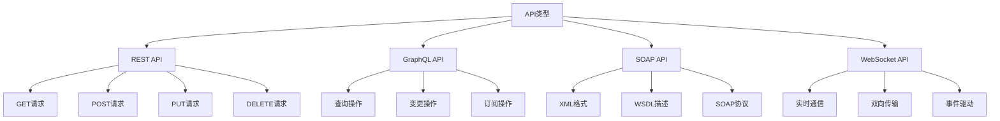

# API接口开发

## 🎯 学习目标
- 掌握Odoo API接口开发的基本方法
- 学会创建RESTful API和GraphQL接口
- 理解API安全性和性能优化

## 📊 API基础

### API概念
API（Application Programming Interface）是应用程序编程接口，用于不同系统之间的数据交互和功能调用。

### API类型


## 🔌 REST API开发

### 基础控制器
```python
# controllers/api_controller.py
from odoo import http
from odoo.http import request
import json
from odoo.exceptions import UserError, ValidationError

class ApiController(http.Controller):
    
    @http.route('/api/v1/health', type='http', auth='none', methods=['GET'], csrf=False)
    def health_check(self):
        """健康检查接口"""
        return request.make_response(
            json.dumps({'status': 'ok', 'message': 'API is running'}),
            headers=[('Content-Type', 'application/json')]
        )
    
    @http.route('/api/v1/partners', type='http', auth='user', methods=['GET'], csrf=False)
    def get_partners(self, **kwargs):
        """获取合作伙伴列表"""
        try:
            # 获取查询参数
            limit = int(kwargs.get('limit', 20))
            offset = int(kwargs.get('offset', 0))
            domain = kwargs.get('domain', '[]')
            
            # 查询数据
            partners = request.env['res.partner'].search(
                eval(domain), limit=limit, offset=offset
            )
            
            # 格式化数据
            data = []
            for partner in partners:
                data.append({
                    'id': partner.id,
                    'name': partner.name,
                    'email': partner.email,
                    'phone': partner.phone,
                    'is_company': partner.is_company,
                    'create_date': partner.create_date.isoformat(),
                })
            
            return request.make_response(
                json.dumps({
                    'status': 'success',
                    'data': data,
                    'total': len(data),
                }),
                headers=[('Content-Type', 'application/json')]
            )
            
        except Exception as e:
            return request.make_response(
                json.dumps({
                    'status': 'error',
                    'message': str(e),
                }),
                headers=[('Content-Type', 'application/json')],
                status=500
            )
    
    @http.route('/api/v1/partners/<int:partner_id>', type='http', auth='user', methods=['GET'], csrf=False)
    def get_partner(self, partner_id):
        """获取单个合作伙伴"""
        try:
            partner = request.env['res.partner'].browse(partner_id)
            
            if not partner.exists():
                return request.make_response(
                    json.dumps({
                        'status': 'error',
                        'message': 'Partner not found',
                    }),
                    headers=[('Content-Type', 'application/json')],
                    status=404
                )
            
            data = {
                'id': partner.id,
                'name': partner.name,
                'email': partner.email,
                'phone': partner.phone,
                'is_company': partner.is_company,
                'street': partner.street,
                'city': partner.city,
                'zip': partner.zip,
                'country_id': partner.country_id.id if partner.country_id else None,
                'state_id': partner.state_id.id if partner.state_id else None,
                'create_date': partner.create_date.isoformat(),
            }
            
            return request.make_response(
                json.dumps({
                    'status': 'success',
                    'data': data,
                }),
                headers=[('Content-Type', 'application/json')]
            )
            
        except Exception as e:
            return request.make_response(
                json.dumps({
                    'status': 'error',
                    'message': str(e),
                }),
                headers=[('Content-Type', 'application/json')],
                status=500
            )
    
    @http.route('/api/v1/partners', type='http', auth='user', methods=['POST'], csrf=False)
    def create_partner(self, **kwargs):
        """创建合作伙伴"""
        try:
            # 获取请求数据
            data = json.loads(request.httprequest.data.decode('utf-8'))
            
            # 验证必填字段
            required_fields = ['name']
            for field in required_fields:
                if field not in data:
                    return request.make_response(
                        json.dumps({
                            'status': 'error',
                            'message': f'Missing required field: {field}',
                        }),
                        headers=[('Content-Type', 'application/json')],
                        status=400
                    )
            
            # 创建记录
            partner = request.env['res.partner'].create(data)
            
            return request.make_response(
                json.dumps({
                    'status': 'success',
                    'data': {
                        'id': partner.id,
                        'name': partner.name,
                    },
                    'message': 'Partner created successfully',
                }),
                headers=[('Content-Type', 'application/json')],
                status=201
            )
            
        except ValidationError as e:
            return request.make_response(
                json.dumps({
                    'status': 'error',
                    'message': str(e),
                }),
                headers=[('Content-Type', 'application/json')],
                status=400
            )
        except Exception as e:
            return request.make_response(
                json.dumps({
                    'status': 'error',
                    'message': str(e),
                }),
                headers=[('Content-Type', 'application/json')],
                status=500
            )
    
    @http.route('/api/v1/partners/<int:partner_id>', type='http', auth='user', methods=['PUT'], csrf=False)
    def update_partner(self, partner_id, **kwargs):
        """更新合作伙伴"""
        try:
            partner = request.env['res.partner'].browse(partner_id)
            
            if not partner.exists():
                return request.make_response(
                    json.dumps({
                        'status': 'error',
                        'message': 'Partner not found',
                    }),
                    headers=[('Content-Type', 'application/json')],
                    status=404
                )
            
            # 获取请求数据
            data = json.loads(request.httprequest.data.decode('utf-8'))
            
            # 更新记录
            partner.write(data)
            
            return request.make_response(
                json.dumps({
                    'status': 'success',
                    'data': {
                        'id': partner.id,
                        'name': partner.name,
                    },
                    'message': 'Partner updated successfully',
                }),
                headers=[('Content-Type', 'application/json')]
            )
            
        except ValidationError as e:
            return request.make_response(
                json.dumps({
                    'status': 'error',
                    'message': str(e),
                }),
                headers=[('Content-Type', 'application/json')],
                status=400
            )
        except Exception as e:
            return request.make_response(
                json.dumps({
                    'status': 'error',
                    'message': str(e),
                }),
                headers=[('Content-Type', 'application/json')],
                status=500
            )
    
    @http.route('/api/v1/partners/<int:partner_id>', type='http', auth='user', methods=['DELETE'], csrf=False)
    def delete_partner(self, partner_id):
        """删除合作伙伴"""
        try:
            partner = request.env['res.partner'].browse(partner_id)
            
            if not partner.exists():
                return request.make_response(
                    json.dumps({
                        'status': 'error',
                        'message': 'Partner not found',
                    }),
                    headers=[('Content-Type', 'application/json')],
                    status=404
                )
            
            # 删除记录
            partner.unlink()
            
            return request.make_response(
                json.dumps({
                    'status': 'success',
                    'message': 'Partner deleted successfully',
                }),
                headers=[('Content-Type', 'application/json')]
            )
            
        except Exception as e:
            return request.make_response(
                json.dumps({
                    'status': 'error',
                    'message': str(e),
                }),
                headers=[('Content-Type', 'application/json')],
                status=500
            )
```

### 高级控制器
```python
# controllers/advanced_api_controller.py
from odoo import http
from odoo.http import request
import json
import base64
from odoo.exceptions import UserError, ValidationError

class AdvancedApiController(http.Controller):
    
    @http.route('/api/v1/orders', type='http', auth='user', methods=['GET'], csrf=False)
    def get_orders(self, **kwargs):
        """获取订单列表（支持复杂查询）"""
        try:
            # 获取查询参数
            limit = int(kwargs.get('limit', 20))
            offset = int(kwargs.get('offset', 0))
            domain = kwargs.get('domain', '[]')
            order_by = kwargs.get('order_by', 'create_date desc')
            fields = kwargs.get('fields', '').split(',') if kwargs.get('fields') else []
            
            # 查询数据
            orders = request.env['sale.order'].search(
                eval(domain), limit=limit, offset=offset, order=order_by
            )
            
            # 格式化数据
            data = []
            for order in orders:
                order_data = {
                    'id': order.id,
                    'name': order.name,
                    'partner_id': order.partner_id.id,
                    'partner_name': order.partner_id.name,
                    'amount_total': order.amount_total,
                    'state': order.state,
                    'date_order': order.date_order.isoformat(),
                    'create_date': order.create_date.isoformat(),
                }
                
                # 添加指定字段
                if fields:
                    for field in fields:
                        if field in order._fields:
                            order_data[field] = getattr(order, field)
                
                data.append(order_data)
            
            return request.make_response(
                json.dumps({
                    'status': 'success',
                    'data': data,
                    'total': len(data),
                    'pagination': {
                        'limit': limit,
                        'offset': offset,
                        'has_more': len(data) == limit,
                    },
                }),
                headers=[('Content-Type', 'application/json')]
            )
            
        except Exception as e:
            return request.make_response(
                json.dumps({
                    'status': 'error',
                    'message': str(e),
                }),
                headers=[('Content-Type', 'application/json')],
                status=500
            )
    
    @http.route('/api/v1/orders/<int:order_id>/lines', type='http', auth='user', methods=['GET'], csrf=False)
    def get_order_lines(self, order_id):
        """获取订单明细行"""
        try:
            order = request.env['sale.order'].browse(order_id)
            
            if not order.exists():
                return request.make_response(
                    json.dumps({
                        'status': 'error',
                        'message': 'Order not found',
                    }),
                    headers=[('Content-Type', 'application/json')],
                    status=404
                )
            
            # 格式化明细行数据
            lines_data = []
            for line in order.order_line:
                lines_data.append({
                    'id': line.id,
                    'product_id': line.product_id.id,
                    'product_name': line.product_id.name,
                    'product_uom_qty': line.product_uom_qty,
                    'price_unit': line.price_unit,
                    'price_subtotal': line.price_subtotal,
                    'price_total': line.price_total,
                })
            
            return request.make_response(
                json.dumps({
                    'status': 'success',
                    'data': lines_data,
                    'order_id': order_id,
                }),
                headers=[('Content-Type', 'application/json')]
            )
            
        except Exception as e:
            return request.make_response(
                json.dumps({
                    'status': 'error',
                    'message': str(e),
                }),
                headers=[('Content-Type', 'application/json')],
                status=500
            )
    
    @http.route('/api/v1/orders/<int:order_id>/confirm', type='http', auth='user', methods=['POST'], csrf=False)
    def confirm_order(self, order_id):
        """确认订单"""
        try:
            order = request.env['sale.order'].browse(order_id)
            
            if not order.exists():
                return request.make_response(
                    json.dumps({
                        'status': 'error',
                        'message': 'Order not found',
                    }),
                    headers=[('Content-Type', 'application/json')],
                    status=404
                )
            
            if order.state != 'draft':
                return request.make_response(
                    json.dumps({
                        'status': 'error',
                        'message': f'Order is in {order.state} state, cannot confirm',
                    }),
                    headers=[('Content-Type', 'application/json')],
                    status=400
                )
            
            # 确认订单
            order.action_confirm()
            
            return request.make_response(
                json.dumps({
                    'status': 'success',
                    'data': {
                        'id': order.id,
                        'name': order.name,
                        'state': order.state,
                    },
                    'message': 'Order confirmed successfully',
                }),
                headers=[('Content-Type', 'application/json')]
            )
            
        except Exception as e:
            return request.make_response(
                json.dumps({
                    'status': 'error',
                    'message': str(e),
                }),
                headers=[('Content-Type', 'application/json')],
                status=500
            )
    
    @http.route('/api/v1/upload', type='http', auth='user', methods=['POST'], csrf=False)
    def upload_file(self, **kwargs):
        """文件上传接口"""
        try:
            # 获取上传的文件
            file = request.httprequest.files.get('file')
            
            if not file:
                return request.make_response(
                    json.dumps({
                        'status': 'error',
                        'message': 'No file provided',
                    }),
                    headers=[('Content-Type', 'application/json')],
                    status=400
                )
            
            # 读取文件内容
            file_content = file.read()
            file_name = file.filename
            
            # 编码文件内容
            encoded_content = base64.b64encode(file_content).decode('utf-8')
            
            # 创建附件记录
            attachment = request.env['ir.attachment'].create({
                'name': file_name,
                'datas': encoded_content,
                'res_model': 'res.users',
                'res_id': request.env.user.id,
            })
            
            return request.make_response(
                json.dumps({
                    'status': 'success',
                    'data': {
                        'id': attachment.id,
                        'name': attachment.name,
                        'size': len(file_content),
                        'url': f'/web/content/{attachment.id}',
                    },
                    'message': 'File uploaded successfully',
                }),
                headers=[('Content-Type', 'application/json')]
            )
            
        except Exception as e:
            return request.make_response(
                json.dumps({
                    'status': 'error',
                    'message': str(e),
                }),
                headers=[('Content-Type', 'application/json')],
                status=500
            )
```

## 🔍 GraphQL API开发

### GraphQL控制器
```python
# controllers/graphql_controller.py
from odoo import http
from odoo.http import request
import json
from odoo.exceptions import UserError, ValidationError

class GraphQLController(http.Controller):
    
    @http.route('/graphql', type='http', auth='user', methods=['POST'], csrf=False)
    def graphql_endpoint(self, **kwargs):
        """GraphQL端点"""
        try:
            # 获取请求数据
            data = json.loads(request.httprequest.data.decode('utf-8'))
            query = data.get('query')
            variables = data.get('variables', {})
            
            if not query:
                return request.make_response(
                    json.dumps({
                        'errors': [{'message': 'No query provided'}]
                    }),
                    headers=[('Content-Type', 'application/json')],
                    status=400
                )
            
            # 执行GraphQL查询
            result = self._execute_query(query, variables)
            
            return request.make_response(
                json.dumps(result),
                headers=[('Content-Type', 'application/json')]
            )
            
        except Exception as e:
            return request.make_response(
                json.dumps({
                    'errors': [{'message': str(e)}]
                }),
                headers=[('Content-Type', 'application/json')],
                status=500
            )
    
    def _execute_query(self, query, variables):
        """执行GraphQL查询"""
        # 简单的GraphQL解析器
        if 'partners' in query:
            return self._resolve_partners(query, variables)
        elif 'orders' in query:
            return self._resolve_orders(query, variables)
        elif 'products' in query:
            return self._resolve_products(query, variables)
        else:
            return {'errors': [{'message': 'Unknown query'}]}
    
    def _resolve_partners(self, query, variables):
        """解析合作伙伴查询"""
        try:
            # 获取查询参数
            limit = variables.get('limit', 20)
            offset = variables.get('offset', 0)
            domain = variables.get('domain', [])
            
            # 查询数据
            partners = request.env['res.partner'].search(
                domain, limit=limit, offset=offset
            )
            
            # 格式化数据
            data = []
            for partner in partners:
                data.append({
                    'id': partner.id,
                    'name': partner.name,
                    'email': partner.email,
                    'phone': partner.phone,
                    'is_company': partner.is_company,
                    'create_date': partner.create_date.isoformat(),
                })
            
            return {
                'data': {
                    'partners': data
                }
            }
            
        except Exception as e:
            return {'errors': [{'message': str(e)}]}
    
    def _resolve_orders(self, query, variables):
        """解析订单查询"""
        try:
            # 获取查询参数
            limit = variables.get('limit', 20)
            offset = variables.get('offset', 0)
            domain = variables.get('domain', [])
            
            # 查询数据
            orders = request.env['sale.order'].search(
                domain, limit=limit, offset=offset
            )
            
            # 格式化数据
            data = []
            for order in orders:
                data.append({
                    'id': order.id,
                    'name': order.name,
                    'partner_id': order.partner_id.id,
                    'partner_name': order.partner_id.name,
                    'amount_total': order.amount_total,
                    'state': order.state,
                    'date_order': order.date_order.isoformat(),
                    'create_date': order.create_date.isoformat(),
                })
            
            return {
                'data': {
                    'orders': data
                }
            }
            
        except Exception as e:
            return {'errors': [{'message': str(e)}]}
    
    def _resolve_products(self, query, variables):
        """解析产品查询"""
        try:
            # 获取查询参数
            limit = variables.get('limit', 20)
            offset = variables.get('offset', 0)
            domain = variables.get('domain', [])
            
            # 查询数据
            products = request.env['product.product'].search(
                domain, limit=limit, offset=offset
            )
            
            # 格式化数据
            data = []
            for product in products:
                data.append({
                    'id': product.id,
                    'name': product.name,
                    'default_code': product.default_code,
                    'list_price': product.list_price,
                    'standard_price': product.standard_price,
                    'type': product.type,
                    'create_date': product.create_date.isoformat(),
                })
            
            return {
                'data': {
                    'products': data
                }
            }
            
        except Exception as e:
            return {'errors': [{'message': str(e)}]}
```

## 🔐 API安全

### 认证和授权
```python
# controllers/secure_api_controller.py
from odoo import http
from odoo.http import request
import json
import hashlib
import hmac
import time
from odoo.exceptions import UserError, ValidationError

class SecureApiController(http.Controller):
    
    @http.route('/api/v1/secure/partners', type='http', auth='none', methods=['GET'], csrf=False)
    def get_partners_secure(self, **kwargs):
        """安全的合作伙伴查询接口"""
        try:
            # 验证API密钥
            api_key = kwargs.get('api_key')
            if not self._validate_api_key(api_key):
                return request.make_response(
                    json.dumps({
                        'status': 'error',
                        'message': 'Invalid API key',
                    }),
                    headers=[('Content-Type', 'application/json')],
                    status=401
                )
            
            # 验证签名
            signature = kwargs.get('signature')
            timestamp = kwargs.get('timestamp')
            if not self._validate_signature(api_key, signature, timestamp):
                return request.make_response(
                    json.dumps({
                        'status': 'error',
                        'message': 'Invalid signature',
                    }),
                    headers=[('Content-Type', 'application/json')],
                    status=401
                )
            
            # 验证时间戳（防止重放攻击）
            if not self._validate_timestamp(timestamp):
                return request.make_response(
                    json.dumps({
                        'status': 'error',
                        'message': 'Request expired',
                    }),
                    headers=[('Content-Type', 'application/json')],
                    status=401
                )
            
            # 执行查询
            limit = int(kwargs.get('limit', 20))
            offset = int(kwargs.get('offset', 0))
            domain = kwargs.get('domain', '[]')
            
            partners = request.env['res.partner'].search(
                eval(domain), limit=limit, offset=offset
            )
            
            # 格式化数据
            data = []
            for partner in partners:
                data.append({
                    'id': partner.id,
                    'name': partner.name,
                    'email': partner.email,
                    'phone': partner.phone,
                    'is_company': partner.is_company,
                })
            
            return request.make_response(
                json.dumps({
                    'status': 'success',
                    'data': data,
                    'total': len(data),
                }),
                headers=[('Content-Type', 'application/json')]
            )
            
        except Exception as e:
            return request.make_response(
                json.dumps({
                    'status': 'error',
                    'message': str(e),
                }),
                headers=[('Content-Type', 'application/json')],
                status=500
            )
    
    def _validate_api_key(self, api_key):
        """验证API密钥"""
        if not api_key:
            return False
        
        # 查询API密钥记录
        api_key_record = request.env['api.key'].search([
            ('key', '=', api_key),
            ('is_active', '=', True)
        ])
        
        return bool(api_key_record)
    
    def _validate_signature(self, api_key, signature, timestamp):
        """验证签名"""
        if not all([api_key, signature, timestamp]):
            return False
        
        # 获取API密钥记录
        api_key_record = request.env['api.key'].search([
            ('key', '=', api_key),
            ('is_active', '=', True)
        ])
        
        if not api_key_record:
            return False
        
        # 计算签名
        message = f"{api_key}{timestamp}"
        expected_signature = hmac.new(
            api_key_record.secret.encode('utf-8'),
            message.encode('utf-8'),
            hashlib.sha256
        ).hexdigest()
        
        return hmac.compare_digest(signature, expected_signature)
    
    def _validate_timestamp(self, timestamp):
        """验证时间戳"""
        try:
            timestamp = int(timestamp)
            current_time = int(time.time())
            
            # 允许5分钟的时间差
            return abs(current_time - timestamp) <= 300
            
        except (ValueError, TypeError):
            return False
```

### API密钥管理
```python
# models/api_key.py
from odoo import models, fields, api
import secrets
import string
from odoo.exceptions import UserError

class ApiKey(models.Model):
    _name = 'api.key'
    _description = 'API密钥'
    
    name = fields.Char('密钥名称', required=True)
    key = fields.Char('API密钥', required=True, readonly=True)
    secret = fields.Char('密钥密码', required=True, readonly=True)
    user_id = fields.Many2one('res.users', string='用户', required=True)
    is_active = fields.Boolean('是否激活', default=True)
    expires_date = fields.Datetime('过期时间')
    last_used = fields.Datetime('最后使用时间')
    usage_count = fields.Integer('使用次数', default=0)
    
    @api.model
    def create(self, vals):
        """创建API密钥"""
        # 生成随机密钥
        if not vals.get('key'):
            vals['key'] = self._generate_key()
        
        if not vals.get('secret'):
            vals['secret'] = self._generate_secret()
        
        return super().create(vals)
    
    def _generate_key(self):
        """生成API密钥"""
        alphabet = string.ascii_letters + string.digits
        return ''.join(secrets.choice(alphabet) for _ in range(32))
    
    def _generate_secret(self):
        """生成密钥密码"""
        alphabet = string.ascii_letters + string.digits
        return ''.join(secrets.choice(alphabet) for _ in range(64))
    
    def update_usage(self):
        """更新使用统计"""
        self.write({
            'last_used': fields.Datetime.now(),
            'usage_count': self.usage_count + 1,
        })
    
    @api.model
    def cleanup_expired_keys(self):
        """清理过期密钥"""
        expired_keys = self.search([
            ('expires_date', '!=', False),
            ('expires_date', '<', fields.Datetime.now())
        ])
        
        if expired_keys:
            expired_keys.write({'is_active': False})
```

## ⚡ 性能优化

### 缓存机制
```python
# controllers/cached_api_controller.py
from odoo import http
from odoo.http import request
import json
import hashlib
from odoo.exceptions import UserError, ValidationError

class CachedApiController(http.Controller):
    
    @http.route('/api/v1/cached/partners', type='http', auth='user', methods=['GET'], csrf=False)
    def get_partners_cached(self, **kwargs):
        """带缓存的合作伙伴查询接口"""
        try:
            # 生成缓存键
            cache_key = self._generate_cache_key(kwargs)
            
            # 尝试从缓存获取数据
            cached_data = self._get_from_cache(cache_key)
            if cached_data:
                return request.make_response(
                    json.dumps(cached_data),
                    headers=[('Content-Type', 'application/json')]
                )
            
            # 查询数据
            limit = int(kwargs.get('limit', 20))
            offset = int(kwargs.get('offset', 0))
            domain = kwargs.get('domain', '[]')
            
            partners = request.env['res.partner'].search(
                eval(domain), limit=limit, offset=offset
            )
            
            # 格式化数据
            data = []
            for partner in partners:
                data.append({
                    'id': partner.id,
                    'name': partner.name,
                    'email': partner.email,
                    'phone': partner.phone,
                    'is_company': partner.is_company,
                })
            
            result = {
                'status': 'success',
                'data': data,
                'total': len(data),
                'cached': False,
            }
            
            # 存储到缓存
            self._store_to_cache(cache_key, result, ttl=300)  # 5分钟缓存
            
            return request.make_response(
                json.dumps(result),
                headers=[('Content-Type', 'application/json')]
            )
            
        except Exception as e:
            return request.make_response(
                json.dumps({
                    'status': 'error',
                    'message': str(e),
                }),
                headers=[('Content-Type', 'application/json')],
                status=500
            )
    
    def _generate_cache_key(self, params):
        """生成缓存键"""
        # 排序参数以确保一致性
        sorted_params = sorted(params.items())
        param_string = '&'.join([f"{k}={v}" for k, v in sorted_params])
        
        # 生成哈希值
        return hashlib.md5(param_string.encode('utf-8')).hexdigest()
    
    def _get_from_cache(self, cache_key):
        """从缓存获取数据"""
        try:
            # 使用Odoo的缓存机制
            cache = request.env.cache
            
            # 检查缓存中是否存在
            if cache_key in cache:
                cached_data = cache[cache_key]
                if cached_data and cached_data.get('expires') > time.time():
                    return cached_data.get('data')
            
            return None
            
        except Exception:
            return None
    
    def _store_to_cache(self, cache_key, data, ttl=300):
        """存储数据到缓存"""
        try:
            # 使用Odoo的缓存机制
            cache = request.env.cache
            
            cache_data = {
                'data': data,
                'expires': time.time() + ttl,
            }
            
            cache[cache_key] = cache_data
            
        except Exception:
            pass  # 缓存失败不影响主流程
```

## 🔗 相关链接

### 下一步学习
- [[第三方系统集成]] - 学习第三方系统集成
- [[Webhooks与消息队列]] - 了解Webhooks与消息队列
- [[API性能优化]] - 掌握API性能优化

### 实践建议
- 多练习API开发
- 熟悉RESTful设计原则
- 掌握API安全最佳实践

## 📝 思考题

### 基础理解
1. REST API的基本概念是什么？
2. GraphQL的优势有哪些？
3. API安全的重要性是什么？

### 深入思考
1. 如何设计高效的API架构？
2. 复杂API如何优化性能？
3. 如何实现API的版本控制？

---

**学习进度**: ✅ 已完成  
**下一步**: [[第三方系统集成]]

