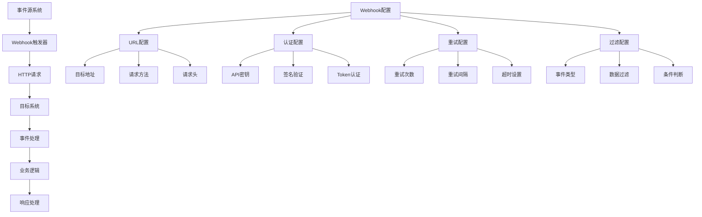

# Webhooks与消息队列

## 🎯 学习目标
- 掌握Webhooks的基本概念和实现方法
- 学会使用消息队列进行异步处理
- 理解事件驱动架构的设计原则

## 📊 Webhooks基础

### Webhooks概念
Webhooks是一种基于HTTP的回调机制，允许一个应用程序向另一个应用程序发送实时通知，实现系统间的异步通信。

### Webhooks架构


## 🔌 Webhooks实现

### Webhook配置模型
```python
# models/webhook_config.py
from odoo import models, fields, api
import requests
import json
import hashlib
import hmac
import time
from odoo.exceptions import UserError

class WebhookConfig(models.Model):
    _name = 'webhook.config'
    _description = 'Webhook配置'
    
    name = fields.Char('配置名称', required=True)
    url = fields.Char('目标URL', required=True)
    method = fields.Selection([
        ('POST', 'POST'),
        ('PUT', 'PUT'),
        ('PATCH', 'PATCH'),
    ], string='请求方法', default='POST')
    
    # 认证配置
    auth_type = fields.Selection([
        ('none', '无认证'),
        ('api_key', 'API密钥'),
        ('bearer_token', 'Bearer Token'),
        ('basic_auth', '基本认证'),
        ('signature', '签名验证'),
    ], string='认证类型', default='none')
    
    api_key = fields.Char('API密钥')
    api_key_header = fields.Char('API密钥头', default='X-API-Key')
    bearer_token = fields.Char('Bearer Token')
    username = fields.Char('用户名')
    password = fields.Char('密码')
    secret_key = fields.Char('密钥')
    
    # 请求配置
    headers = fields.Text('自定义请求头', default='{}')
    timeout = fields.Integer('超时时间(秒)', default=30)
    retry_count = fields.Integer('重试次数', default=3)
    retry_interval = fields.Integer('重试间隔(秒)', default=5)
    
    # 过滤配置
    event_types = fields.Text('事件类型', default='[]')
    conditions = fields.Text('触发条件', default='{}')
    
    # 状态配置
    is_active = fields.Boolean('是否激活', default=True)
    last_triggered = fields.Datetime('最后触发时间')
    success_count = fields.Integer('成功次数', default=0)
    error_count = fields.Integer('失败次数', default=0)
    
    @api.model
    def trigger_webhook(self, event_type, data):
        """触发Webhook"""
        try:
            # 查找匹配的配置
            configs = self.search([
                ('is_active', '=', True),
                ('event_types', 'ilike', event_type)
            ])
            
            for config in configs:
                # 检查触发条件
                if not config._check_conditions(data):
                    continue
                
                # 发送Webhook
                result = config._send_webhook(event_type, data)
                
                # 更新统计
                if result.get('success'):
                    config.success_count += 1
                else:
                    config.error_count += 1
                
                config.last_triggered = fields.Datetime.now()
            
        except Exception as e:
            self._log_error(f'触发Webhook失败: {str(e)}')
    
    def _send_webhook(self, event_type, data):
        """发送Webhook请求"""
        try:
            # 准备请求数据
            payload = {
                'event_type': event_type,
                'timestamp': fields.Datetime.now().isoformat(),
                'data': data,
            }
            
            # 添加签名
            if self.auth_type == 'signature' and self.secret_key:
                payload['signature'] = self._generate_signature(payload)
            
            # 准备请求头
            headers = {
                'Content-Type': 'application/json',
                'User-Agent': 'Odoo-Webhook/1.0',
            }
            
            # 添加认证头
            if self.auth_type == 'api_key' and self.api_key:
                headers[self.api_key_header] = self.api_key
            elif self.auth_type == 'bearer_token' and self.bearer_token:
                headers['Authorization'] = f'Bearer {self.bearer_token}'
            elif self.auth_type == 'basic_auth' and self.username and self.password:
                import base64
                credentials = base64.b64encode(f"{self.username}:{self.password}".encode()).decode()
                headers['Authorization'] = f'Basic {credentials}'
            
            # 添加自定义请求头
            try:
                custom_headers = json.loads(self.headers or '{}')
                headers.update(custom_headers)
            except:
                pass
            
            # 发送请求
            response = requests.request(
                self.method,
                self.url,
                json=payload,
                headers=headers,
                timeout=self.timeout
            )
            
            # 检查响应
            if response.status_code in [200, 201, 202]:
                return {
                    'success': True,
                    'status_code': response.status_code,
                    'response': response.text
                }
            else:
                return {
                    'success': False,
                    'status_code': response.status_code,
                    'error': response.text
                }
                
        except Exception as e:
            return {
                'success': False,
                'error': str(e)
            }
    
    def _check_conditions(self, data):
        """检查触发条件"""
        try:
            if not self.conditions:
                return True
            
            conditions = json.loads(self.conditions)
            
            for field, condition in conditions.items():
                if field not in data:
                    return False
                
                value = data[field]
                condition_type = condition.get('type')
                condition_value = condition.get('value')
                
                if condition_type == 'equals':
                    if value != condition_value:
                        return False
                elif condition_type == 'not_equals':
                    if value == condition_value:
                        return False
                elif condition_type == 'contains':
                    if condition_value not in str(value):
                        return False
                elif condition_type == 'greater_than':
                    if float(value) <= float(condition_value):
                        return False
                elif condition_type == 'less_than':
                    if float(value) >= float(condition_value):
                        return False
            
            return True
            
        except Exception:
            return True
    
    def _generate_signature(self, payload):
        """生成签名"""
        try:
            # 构建签名字符串
            payload_str = json.dumps(payload, sort_keys=True)
            sign_string = f"{payload_str}{self.secret_key}"
            
            # 生成HMAC-SHA256签名
            signature = hmac.new(
                self.secret_key.encode('utf-8'),
                sign_string.encode('utf-8'),
                hashlib.sha256
            ).hexdigest()
            
            return signature
            
        except Exception:
            return ''
    
    def _log_error(self, message):
        """记录错误日志"""
        self.env['ir.logging'].create({
            'name': 'Webhook',
            'type': 'server',
            'dbname': self.env.cr.dbname,
            'level': 'ERROR',
            'message': message,
            'path': 'webhook',
            'line': 0,
            'func': 'trigger_webhook',
        })
```

### Webhook事件处理
```python
# models/webhook_event.py
from odoo import models, fields, api
from odoo.exceptions import UserError

class WebhookEvent(models.Model):
    _name = 'webhook.event'
    _description = 'Webhook事件'
    
    name = fields.Char('事件名称', required=True)
    event_type = fields.Char('事件类型', required=True)
    model_name = fields.Char('模型名称', required=True)
    record_id = fields.Integer('记录ID')
    data = fields.Text('事件数据')
    status = fields.Selection([
        ('pending', '待处理'),
        ('processing', '处理中'),
        ('completed', '已完成'),
        ('failed', '失败'),
    ], string='状态', default='pending')
    
    created_date = fields.Datetime('创建时间', default=fields.Datetime.now)
    processed_date = fields.Datetime('处理时间')
    error_message = fields.Text('错误信息')
    
    @api.model
    def create_event(self, event_type, model_name, record_id, data):
        """创建Webhook事件"""
        try:
            event = self.create({
                'name': f"{event_type}_{model_name}_{record_id}",
                'event_type': event_type,
                'model_name': model_name,
                'record_id': record_id,
                'data': json.dumps(data),
                'status': 'pending',
            })
            
            # 触发Webhook
            self.env['webhook.config'].trigger_webhook(event_type, data)
            
            return event
            
        except Exception as e:
            self._log_error(f'创建Webhook事件失败: {str(e)}')
            return None
    
    @api.model
    def process_events(self):
        """处理待处理的事件"""
        try:
            # 查找待处理的事件
            events = self.search([
                ('status', '=', 'pending')
            ], limit=100)
            
            for event in events:
                try:
                    # 更新状态为处理中
                    event.status = 'processing'
                    
                    # 处理事件
                    result = event._process_event()
                    
                    if result.get('success'):
                        event.status = 'completed'
                        event.processed_date = fields.Datetime.now()
                    else:
                        event.status = 'failed'
                        event.error_message = result.get('error', '处理失败')
                    
                except Exception as e:
                    event.status = 'failed'
                    event.error_message = str(e)
                    event.processed_date = fields.Datetime.now()
            
        except Exception as e:
            self._log_error(f'处理Webhook事件失败: {str(e)}')
    
    def _process_event(self):
        """处理单个事件"""
        try:
            # 解析事件数据
            data = json.loads(self.data or '{}')
            
            # 根据事件类型处理
            if self.event_type == 'record_created':
                return self._handle_record_created(data)
            elif self.event_type == 'record_updated':
                return self._handle_record_updated(data)
            elif self.event_type == 'record_deleted':
                return self._handle_record_deleted(data)
            else:
                return {'success': False, 'error': f'未知事件类型: {self.event_type}'}
                
        except Exception as e:
            return {'success': False, 'error': str(e)}
    
    def _handle_record_created(self, data):
        """处理记录创建事件"""
        try:
            # 获取模型
            model = self.env[self.model_name]
            
            # 创建记录
            record = model.create(data)
            
            return {
                'success': True,
                'record_id': record.id,
                'message': '记录创建成功'
            }
            
        except Exception as e:
            return {'success': False, 'error': str(e)}
    
    def _handle_record_updated(self, data):
        """处理记录更新事件"""
        try:
            # 获取模型
            model = self.env[self.model_name]
            
            # 查找记录
            record = model.browse(self.record_id)
            
            if not record.exists():
                return {'success': False, 'error': '记录不存在'}
            
            # 更新记录
            record.write(data)
            
            return {
                'success': True,
                'message': '记录更新成功'
            }
            
        except Exception as e:
            return {'success': False, 'error': str(e)}
    
    def _handle_record_deleted(self, data):
        """处理记录删除事件"""
        try:
            # 获取模型
            model = self.env[self.model_name]
            
            # 查找记录
            record = model.browse(self.record_id)
            
            if not record.exists():
                return {'success': False, 'error': '记录不存在'}
            
            # 删除记录
            record.unlink()
            
            return {
                'success': True,
                'message': '记录删除成功'
            }
            
        except Exception as e:
            return {'success': False, 'error': str(e)}
    
    def _log_error(self, message):
        """记录错误日志"""
        self.env['ir.logging'].create({
            'name': 'Webhook Event',
            'type': 'server',
            'dbname': self.env.cr.dbname,
            'level': 'ERROR',
            'message': message,
            'path': 'webhook_event',
            'line': 0,
            'func': 'process_events',
        })
```

## 📨 消息队列

### 消息队列模型
```python
# models/message_queue.py
from odoo import models, fields, api
import json
import time
import threading
from odoo.exceptions import UserError

class MessageQueue(models.Model):
    _name = 'message.queue'
    _description = '消息队列'
    
    name = fields.Char('消息名称', required=True)
    queue_name = fields.Char('队列名称', required=True)
    message_type = fields.Char('消息类型', required=True)
    payload = fields.Text('消息内容', required=True)
    priority = fields.Selection([
        ('low', '低'),
        ('normal', '普通'),
        ('high', '高'),
        ('urgent', '紧急'),
    ], string='优先级', default='normal')
    
    status = fields.Selection([
        ('pending', '待处理'),
        ('processing', '处理中'),
        ('completed', '已完成'),
        ('failed', '失败'),
        ('retry', '重试'),
    ], string='状态', default='pending')
    
    retry_count = fields.Integer('重试次数', default=0)
    max_retries = fields.Integer('最大重试次数', default=3)
    
    created_date = fields.Datetime('创建时间', default=fields.Datetime.now)
    processed_date = fields.Datetime('处理时间')
    scheduled_date = fields.Datetime('计划处理时间')
    
    error_message = fields.Text('错误信息')
    result_data = fields.Text('处理结果')
    
    @api.model
    def enqueue_message(self, queue_name, message_type, payload, priority='normal', scheduled_date=None):
        """入队消息"""
        try:
            message = self.create({
                'name': f"{message_type}_{int(time.time())}",
                'queue_name': queue_name,
                'message_type': message_type,
                'payload': json.dumps(payload),
                'priority': priority,
                'scheduled_date': scheduled_date or fields.Datetime.now(),
                'status': 'pending',
            })
            
            return message
            
        except Exception as e:
            self._log_error(f'入队消息失败: {str(e)}')
            return None
    
    @api.model
    def dequeue_message(self, queue_name, limit=1):
        """出队消息"""
        try:
            # 查找待处理的消息
            messages = self.search([
                ('queue_name', '=', queue_name),
                ('status', '=', 'pending'),
                ('scheduled_date', '<=', fields.Datetime.now())
            ], order='priority desc, created_date asc', limit=limit)
            
            for message in messages:
                # 更新状态为处理中
                message.status = 'processing'
                message.processed_date = fields.Datetime.now()
            
            return messages
            
        except Exception as e:
            self._log_error(f'出队消息失败: {str(e)}')
            return self.env['message.queue']
    
    @api.model
    def process_message(self, message):
        """处理消息"""
        try:
            # 解析消息内容
            payload = json.loads(message.payload or '{}')
            
            # 根据消息类型处理
            if message.message_type == 'email_send':
                result = self._handle_email_send(payload)
            elif message.message_type == 'sms_send':
                result = self._handle_sms_send(payload)
            elif message.message_type == 'data_sync':
                result = self._handle_data_sync(payload)
            elif message.message_type == 'report_generate':
                result = self._handle_report_generate(payload)
            else:
                result = {'success': False, 'error': f'未知消息类型: {message.message_type}'}
            
            # 更新消息状态
            if result.get('success'):
                message.status = 'completed'
                message.result_data = json.dumps(result.get('data', {}))
            else:
                # 检查是否需要重试
                if message.retry_count < message.max_retries:
                    message.status = 'retry'
                    message.retry_count += 1
                    message.scheduled_date = fields.Datetime.now() + timedelta(minutes=5)
                else:
                    message.status = 'failed'
                    message.error_message = result.get('error', '处理失败')
            
        except Exception as e:
            message.status = 'failed'
            message.error_message = str(e)
            self._log_error(f'处理消息失败: {str(e)}')
    
    def _handle_email_send(self, payload):
        """处理邮件发送"""
        try:
            # 获取邮件参数
            to_email = payload.get('to_email')
            subject = payload.get('subject')
            body = payload.get('body')
            template_id = payload.get('template_id')
            
            if template_id:
                # 使用模板发送邮件
                template = self.env['mail.template'].browse(template_id)
                template.send_mail(payload.get('res_id'), force_send=True)
            else:
                # 直接发送邮件
                mail_values = {
                    'subject': subject,
                    'body_html': body,
                    'email_to': to_email,
                    'email_from': self.env.user.email,
                }
                
                mail = self.env['mail.mail'].create(mail_values)
                mail.send()
            
            return {
                'success': True,
                'message': '邮件发送成功'
            }
            
        except Exception as e:
            return {'success': False, 'error': str(e)}
    
    def _handle_sms_send(self, payload):
        """处理短信发送"""
        try:
            # 获取短信参数
            to_phone = payload.get('to_phone')
            message = payload.get('message')
            
            # 这里可以集成第三方短信服务
            # 例如：阿里云短信、腾讯云短信等
            
            return {
                'success': True,
                'message': '短信发送成功'
            }
            
        except Exception as e:
            return {'success': False, 'error': str(e)}
    
    def _handle_data_sync(self, payload):
        """处理数据同步"""
        try:
            # 获取同步参数
            source_model = payload.get('source_model')
            target_model = payload.get('target_model')
            sync_type = payload.get('sync_type', 'full')
            
            # 执行数据同步
            if sync_type == 'full':
                # 全量同步
                self._full_sync(source_model, target_model)
            elif sync_type == 'incremental':
                # 增量同步
                self._incremental_sync(source_model, target_model)
            
            return {
                'success': True,
                'message': '数据同步成功'
            }
            
        except Exception as e:
            return {'success': False, 'error': str(e)}
    
    def _handle_report_generate(self, payload):
        """处理报表生成"""
        try:
            # 获取报表参数
            report_name = payload.get('report_name')
            doc_ids = payload.get('doc_ids', [])
            data = payload.get('data', {})
            
            # 生成报表
            report = self.env['ir.actions.report'].search([
                ('report_name', '=', report_name)
            ])
            
            if report:
                report_data = report._render_qweb_pdf(doc_ids, data=data)
                
                # 保存报表文件
                attachment = self.env['ir.attachment'].create({
                    'name': f"{report_name}_{int(time.time())}.pdf",
                    'datas': base64.b64encode(report_data).decode(),
                    'res_model': 'message.queue',
                    'res_id': self.id,
                })
                
                return {
                    'success': True,
                    'message': '报表生成成功',
                    'data': {'attachment_id': attachment.id}
                }
            else:
                return {'success': False, 'error': '报表不存在'}
            
        except Exception as e:
            return {'success': False, 'error': str(e)}
    
    def _full_sync(self, source_model, target_model):
        """全量同步"""
        # 实现全量数据同步逻辑
        pass
    
    def _incremental_sync(self, source_model, target_model):
        """增量同步"""
        # 实现增量数据同步逻辑
        pass
    
    def _log_error(self, message):
        """记录错误日志"""
        self.env['ir.logging'].create({
            'name': 'Message Queue',
            'type': 'server',
            'dbname': self.env.cr.dbname,
            'level': 'ERROR',
            'message': message,
            'path': 'message_queue',
            'line': 0,
            'func': 'process_message',
        })
```

### 消息队列处理器
```python
# models/queue_processor.py
from odoo import models, fields, api
import threading
import time
from odoo.exceptions import UserError

class QueueProcessor(models.Model):
    _name = 'queue.processor'
    _description = '消息队列处理器'
    
    name = fields.Char('处理器名称', required=True)
    queue_name = fields.Char('队列名称', required=True)
    is_active = fields.Boolean('是否激活', default=True)
    worker_count = fields.Integer('工作线程数', default=1)
    batch_size = fields.Integer('批处理大小', default=10)
    sleep_interval = fields.Integer('休眠间隔(秒)', default=5)
    
    last_run = fields.Datetime('最后运行时间')
    processed_count = fields.Integer('已处理数量', default=0)
    error_count = fields.Integer('错误数量', default=0)
    
    @api.model
    def start_processor(self):
        """启动处理器"""
        if self.is_active:
            raise UserError('处理器已启动')
        
        self.is_active = True
        
        # 启动工作线程
        for i in range(self.worker_count):
            thread = threading.Thread(
                target=self._worker_thread,
                args=(i,),
                daemon=True
            )
            thread.start()
    
    @api.model
    def stop_processor(self):
        """停止处理器"""
        self.is_active = False
    
    def _worker_thread(self, worker_id):
        """工作线程"""
        while self.is_active:
            try:
                # 获取待处理的消息
                messages = self.env['message.queue'].dequeue_message(
                    self.queue_name,
                    limit=self.batch_size
                )
                
                if messages:
                    # 处理消息
                    for message in messages:
                        try:
                            self.env['message.queue'].process_message(message)
                            self.processed_count += 1
                        except Exception as e:
                            self.error_count += 1
                            self._log_error(f'处理消息失败: {str(e)}')
                    
                    # 更新最后运行时间
                    self.last_run = fields.Datetime.now()
                else:
                    # 没有消息时休眠
                    time.sleep(self.sleep_interval)
                
            except Exception as e:
                self._log_error(f'工作线程错误: {str(e)}')
                time.sleep(self.sleep_interval)
    
    def _log_error(self, message):
        """记录错误日志"""
        self.env['ir.logging'].create({
            'name': 'Queue Processor',
            'type': 'server',
            'dbname': self.env.cr.dbname,
            'level': 'ERROR',
            'message': message,
            'path': 'queue_processor',
            'line': 0,
            'func': 'worker_thread',
        })
```

## 🔄 事件驱动架构

### 事件总线
```python
# models/event_bus.py
from odoo import models, fields, api
import json
import threading
from collections import defaultdict
from odoo.exceptions import UserError

class EventBus(models.Model):
    _name = 'event.bus'
    _description = '事件总线'
    
    name = fields.Char('事件总线名称', required=True)
    is_active = fields.Boolean('是否激活', default=True)
    
    # 事件订阅者
    subscribers = fields.One2many('event.subscriber', 'bus_id', string='订阅者')
    
    @api.model
    def publish_event(self, event_type, data):
        """发布事件"""
        try:
            # 查找订阅者
            subscribers = self.env['event.subscriber'].search([
                ('bus_id', '=', self.id),
                ('event_type', '=', event_type),
                ('is_active', '=', True)
            ])
            
            # 通知订阅者
            for subscriber in subscribers:
                try:
                    subscriber.handle_event(event_type, data)
                except Exception as e:
                    self._log_error(f'通知订阅者失败: {str(e)}')
            
            return {
                'success': True,
                'subscriber_count': len(subscribers)
            }
            
        except Exception as e:
            self._log_error(f'发布事件失败: {str(e)}')
            return {'success': False, 'error': str(e)}
    
    def _log_error(self, message):
        """记录错误日志"""
        self.env['ir.logging'].create({
            'name': 'Event Bus',
            'type': 'server',
            'dbname': self.env.cr.dbname,
            'level': 'ERROR',
            'message': message,
            'path': 'event_bus',
            'line': 0,
            'func': 'publish_event',
        })

class EventSubscriber(models.Model):
    _name = 'event.subscriber'
    _description = '事件订阅者'
    
    name = fields.Char('订阅者名称', required=True)
    bus_id = fields.Many2one('event.bus', string='事件总线', required=True)
    event_type = fields.Char('事件类型', required=True)
    handler_type = fields.Selection([
        ('webhook', 'Webhook'),
        ('queue', '消息队列'),
        ('function', '函数调用'),
    ], string='处理类型', default='webhook')
    
    # Webhook配置
    webhook_url = fields.Char('Webhook URL')
    webhook_method = fields.Selection([
        ('POST', 'POST'),
        ('PUT', 'PUT'),
        ('PATCH', 'PATCH'),
    ], string='请求方法', default='POST')
    
    # 消息队列配置
    queue_name = fields.Char('队列名称')
    message_type = fields.Char('消息类型')
    
    # 函数配置
    function_name = fields.Char('函数名称')
    function_args = fields.Text('函数参数')
    
    # 过滤配置
    conditions = fields.Text('触发条件', default='{}')
    
    is_active = fields.Boolean('是否激活', default=True)
    last_triggered = fields.Datetime('最后触发时间')
    success_count = fields.Integer('成功次数', default=0)
    error_count = fields.Integer('失败次数', default=0)
    
    def handle_event(self, event_type, data):
        """处理事件"""
        try:
            # 检查触发条件
            if not self._check_conditions(data):
                return
            
            # 根据处理类型处理
            if self.handler_type == 'webhook':
                result = self._handle_webhook(event_type, data)
            elif self.handler_type == 'queue':
                result = self._handle_queue(event_type, data)
            elif self.handler_type == 'function':
                result = self._handle_function(event_type, data)
            else:
                result = {'success': False, 'error': '未知处理类型'}
            
            # 更新统计
            if result.get('success'):
                self.success_count += 1
            else:
                self.error_count += 1
            
            self.last_triggered = fields.Datetime.now()
            
        except Exception as e:
            self.error_count += 1
            self._log_error(f'处理事件失败: {str(e)}')
    
    def _check_conditions(self, data):
        """检查触发条件"""
        try:
            if not self.conditions:
                return True
            
            conditions = json.loads(self.conditions)
            
            for field, condition in conditions.items():
                if field not in data:
                    return False
                
                value = data[field]
                condition_type = condition.get('type')
                condition_value = condition.get('value')
                
                if condition_type == 'equals':
                    if value != condition_value:
                        return False
                elif condition_type == 'not_equals':
                    if value == condition_value:
                        return False
                elif condition_type == 'contains':
                    if condition_value not in str(value):
                        return False
                elif condition_type == 'greater_than':
                    if float(value) <= float(condition_value):
                        return False
                elif condition_type == 'less_than':
                    if float(value) >= float(condition_value):
                        return False
            
            return True
            
        except Exception:
            return True
    
    def _handle_webhook(self, event_type, data):
        """处理Webhook"""
        try:
            import requests
            
            payload = {
                'event_type': event_type,
                'timestamp': fields.Datetime.now().isoformat(),
                'data': data,
            }
            
            response = requests.request(
                self.webhook_method,
                self.webhook_url,
                json=payload,
                timeout=30
            )
            
            if response.status_code in [200, 201, 202]:
                return {'success': True}
            else:
                return {'success': False, 'error': f'HTTP {response.status_code}'}
                
        except Exception as e:
            return {'success': False, 'error': str(e)}
    
    def _handle_queue(self, event_type, data):
        """处理消息队列"""
        try:
            self.env['message.queue'].enqueue_message(
                self.queue_name,
                self.message_type,
                data
            )
            
            return {'success': True}
            
        except Exception as e:
            return {'success': False, 'error': str(e)}
    
    def _handle_function(self, event_type, data):
        """处理函数调用"""
        try:
            # 获取函数参数
            args = json.loads(self.function_args or '{}')
            
            # 调用函数
            if hasattr(self, self.function_name):
                func = getattr(self, self.function_name)
                result = func(event_type, data, **args)
                return {'success': True, 'result': result}
            else:
                return {'success': False, 'error': f'函数不存在: {self.function_name}'}
                
        except Exception as e:
            return {'success': False, 'error': str(e)}
    
    def _log_error(self, message):
        """记录错误日志"""
        self.env['ir.logging'].create({
            'name': 'Event Subscriber',
            'type': 'server',
            'dbname': self.env.cr.dbname,
            'level': 'ERROR',
            'message': message,
            'path': 'event_subscriber',
            'line': 0,
            'func': 'handle_event',
        })
```

## 🔗 相关链接

### 下一步学习
- [[数据同步机制]] - 学习数据同步机制
- [[集成测试策略]] - 了解集成测试策略
- [[监控告警系统]] - 掌握监控告警系统

### 实践建议
- 多练习Webhooks和消息队列
- 熟悉事件驱动架构设计
- 掌握异步处理技术

## 📝 思考题

### 基础理解
1. Webhooks的基本原理是什么？
2. 消息队列的作用是什么？
3. 事件驱动架构的优势有哪些？

### 深入思考
1. 如何设计高效的Webhooks系统？
2. 复杂消息队列如何优化性能？
3. 如何实现事件驱动架构的监控？

---

**学习进度**: ✅ 已完成  
**下一步**: [[数据同步机制]]
