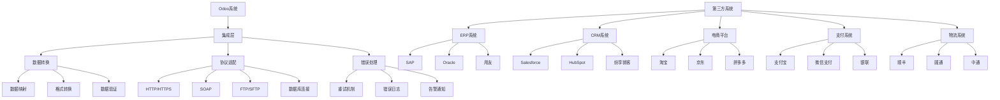

# 第三方系统集成

## 🎯 学习目标
- 掌握第三方系统集成的基本方法
- 学会使用各种集成技术和工具
- 理解数据同步和错误处理机制

## 📊 集成概述

### 集成方式
第三方系统集成是将Odoo与外部系统连接，实现数据共享和功能协同的过程。

### 集成架构


## 🔌 ERP系统集成

### SAP集成
```python
# models/sap_integration.py
from odoo import models, fields, api
import requests
import xml.etree.ElementTree as ET
from odoo.exceptions import UserError

class SapIntegration(models.Model):
    _name = 'sap.integration'
    _description = 'SAP集成'
    
    name = fields.Char('集成名称', required=True)
    sap_url = fields.Char('SAP地址', required=True)
    username = fields.Char('用户名', required=True)
    password = fields.Char('密码', required=True)
    client = fields.Char('客户端', required=True)
    system_id = fields.Char('系统ID', required=True)
    is_active = fields.Boolean('是否激活', default=True)
    
    @api.model
    def sync_customers(self):
        """同步客户数据"""
        try:
            # 构建SAP查询
            sap_query = """
            SELECT KUNNR, NAME1, NAME2, ORT01, PSTLZ, LAND1, REGIO, TELF1, SMTP_ADDR
            FROM KNA1
            WHERE KUNNR LIKE 'C%'
            """
            
            # 调用SAP接口
            response = self._call_sap_api(sap_query)
            
            if response.get('success'):
                customers_data = response.get('data', [])
                
                # 处理客户数据
                for customer_data in customers_data:
                    self._process_customer_data(customer_data)
                
                return {
                    'success': True,
                    'message': f'成功同步 {len(customers_data)} 个客户',
                    'count': len(customers_data)
                }
            else:
                raise UserError(f'SAP接口调用失败: {response.get("error")}')
                
        except Exception as e:
            raise UserError(f'客户同步失败: {str(e)}')
    
    @api.model
    def sync_products(self):
        """同步产品数据"""
        try:
            # 构建SAP查询
            sap_query = """
            SELECT MATNR, MAKTX, MEINS, MTART, MATKL, ERSDA, ERNAM
            FROM MARA
            WHERE MTART IN ('FERT', 'HALB', 'ROH')
            """
            
            # 调用SAP接口
            response = self._call_sap_api(sap_query)
            
            if response.get('success'):
                products_data = response.get('data', [])
                
                # 处理产品数据
                for product_data in products_data:
                    self._process_product_data(product_data)
                
                return {
                    'success': True,
                    'message': f'成功同步 {len(products_data)} 个产品',
                    'count': len(products_data)
                }
            else:
                raise UserError(f'SAP接口调用失败: {response.get("error")}')
                
        except Exception as e:
            raise UserError(f'产品同步失败: {str(e)}')
    
    @api.model
    def sync_orders(self):
        """同步订单数据"""
        try:
            # 构建SAP查询
            sap_query = """
            SELECT VBELN, ERDAT, ERZET, ERNAM, KUNNR, NETWR, WAERK
            FROM VBAK
            WHERE ERDAT >= '20240101'
            """
            
            # 调用SAP接口
            response = self._call_sap_api(sap_query)
            
            if response.get('success'):
                orders_data = response.get('data', [])
                
                # 处理订单数据
                for order_data in orders_data:
                    self._process_order_data(order_data)
                
                return {
                    'success': True,
                    'message': f'成功同步 {len(orders_data)} 个订单',
                    'count': len(orders_data)
                }
            else:
                raise UserError(f'SAP接口调用失败: {response.get("error")}')
                
        except Exception as e:
            raise UserError(f'订单同步失败: {str(e)}')
    
    def _call_sap_api(self, query):
        """调用SAP API"""
        try:
            # 构建SOAP请求
            soap_body = f"""
            <soap:Envelope xmlns:soap="http://schemas.xmlsoap.org/soap/envelope/">
                <soap:Header>
                    <Authentication>
                        <Username>{self.username}</Username>
                        <Password>{self.password}</Password>
                        <Client>{self.client}</Client>
                        <SystemID>{self.system_id}</SystemID>
                    </Authentication>
                </soap:Header>
                <soap:Body>
                    <ExecuteQuery>
                        <Query>{query}</Query>
                    </ExecuteQuery>
                </soap:Body>
            </soap:Envelope>
            """
            
            # 发送请求
            headers = {
                'Content-Type': 'text/xml; charset=utf-8',
                'SOAPAction': 'ExecuteQuery'
            }
            
            response = requests.post(
                self.sap_url,
                data=soap_body,
                headers=headers,
                timeout=30
            )
            
            # 解析响应
            if response.status_code == 200:
                root = ET.fromstring(response.text)
                
                # 提取数据
                data = []
                for row in root.findall('.//Row'):
                    row_data = {}
                    for field in row:
                        row_data[field.tag] = field.text
                    data.append(row_data)
                
                return {
                    'success': True,
                    'data': data
                }
            else:
                return {
                    'success': False,
                    'error': f'HTTP {response.status_code}: {response.text}'
                }
                
        except Exception as e:
            return {
                'success': False,
                'error': str(e)
            }
    
    def _process_customer_data(self, customer_data):
        """处理客户数据"""
        try:
            # 查找或创建客户
            partner = self.env['res.partner'].search([
                ('ref', '=', customer_data.get('KUNNR'))
            ])
            
            if not partner:
                partner = self.env['res.partner'].create({
                    'name': customer_data.get('NAME1', ''),
                    'ref': customer_data.get('KUNNR'),
                    'is_company': True,
                    'street': customer_data.get('ORT01', ''),
                    'zip': customer_data.get('PSTLZ', ''),
                    'phone': customer_data.get('TELF1', ''),
                    'email': customer_data.get('SMTP_ADDR', ''),
                })
            else:
                # 更新客户信息
                partner.write({
                    'name': customer_data.get('NAME1', ''),
                    'street': customer_data.get('ORT01', ''),
                    'zip': customer_data.get('PSTLZ', ''),
                    'phone': customer_data.get('TELF1', ''),
                    'email': customer_data.get('SMTP_ADDR', ''),
                })
            
            return partner
            
        except Exception as e:
            self._log_error(f'处理客户数据失败: {str(e)}')
            return None
    
    def _process_product_data(self, product_data):
        """处理产品数据"""
        try:
            # 查找或创建产品
            product = self.env['product.product'].search([
                ('default_code', '=', product_data.get('MATNR'))
            ])
            
            if not product:
                product = self.env['product.product'].create({
                    'name': product_data.get('MAKTX', ''),
                    'default_code': product_data.get('MATNR'),
                    'type': 'product',
                    'uom_id': self._get_uom_id(product_data.get('MEINS')),
                    'categ_id': self._get_category_id(product_data.get('MATKL')),
                })
            else:
                # 更新产品信息
                product.write({
                    'name': product_data.get('MAKTX', ''),
                    'uom_id': self._get_uom_id(product_data.get('MEINS')),
                    'categ_id': self._get_category_id(product_data.get('MATKL')),
                })
            
            return product
            
        except Exception as e:
            self._log_error(f'处理产品数据失败: {str(e)}')
            return None
    
    def _process_order_data(self, order_data):
        """处理订单数据"""
        try:
            # 查找或创建订单
            order = self.env['sale.order'].search([
                ('client_order_ref', '=', order_data.get('VBELN'))
            ])
            
            if not order:
                # 查找客户
                partner = self.env['res.partner'].search([
                    ('ref', '=', order_data.get('KUNNR'))
                ])
                
                if partner:
                    order = self.env['sale.order'].create({
                        'partner_id': partner.id,
                        'client_order_ref': order_data.get('VBELN'),
                        'date_order': self._parse_sap_date(order_data.get('ERDAT')),
                        'amount_total': float(order_data.get('NETWR', 0)),
                        'currency_id': self._get_currency_id(order_data.get('WAERK')),
                    })
            
            return order
            
        except Exception as e:
            self._log_error(f'处理订单数据失败: {str(e)}')
            return None
    
    def _get_uom_id(self, sap_uom):
        """获取单位ID"""
        uom_mapping = {
            'EA': 'product.product_uom_unit',
            'KG': 'product.product_uom_kgm',
            'M': 'product.product_uom_meter',
            'L': 'product.product_uom_litre',
        }
        
        uom_xmlid = uom_mapping.get(sap_uom, 'product.product_uom_unit')
        return self.env.ref(uom_xmlid).id
    
    def _get_category_id(self, sap_category):
        """获取产品类别ID"""
        # 根据SAP类别映射到Odoo类别
        category_mapping = {
            '001': 'product.product_category_all',
            '002': 'product.product_category_all',
            # 添加更多映射
        }
        
        category_xmlid = category_mapping.get(sap_category, 'product.product_category_all')
        return self.env.ref(category_xmlid).id
    
    def _get_currency_id(self, sap_currency):
        """获取货币ID"""
        currency_mapping = {
            'CNY': 'base.CNY',
            'USD': 'base.USD',
            'EUR': 'base.EUR',
        }
        
        currency_xmlid = currency_mapping.get(sap_currency, 'base.CNY')
        return self.env.ref(currency_xmlid).id
    
    def _parse_sap_date(self, sap_date):
        """解析SAP日期格式"""
        try:
            if sap_date and len(sap_date) == 8:
                year = int(sap_date[:4])
                month = int(sap_date[4:6])
                day = int(sap_date[6:8])
                return f"{year}-{month:02d}-{day:02d}"
            return False
        except:
            return False
    
    def _log_error(self, message):
        """记录错误日志"""
        self.env['ir.logging'].create({
            'name': 'SAP Integration',
            'type': 'server',
            'dbname': self.env.cr.dbname,
            'level': 'ERROR',
            'message': message,
            'path': 'sap_integration',
            'line': 0,
            'func': 'process_data',
        })
```

## 🛒 电商平台集成

### 淘宝集成
```python
# models/taobao_integration.py
from odoo import models, fields, api
import requests
import json
import hashlib
import hmac
import time
from odoo.exceptions import UserError

class TaobaoIntegration(models.Model):
    _name = 'taobao.integration'
    _description = '淘宝集成'
    
    name = fields.Char('集成名称', required=True)
    app_key = fields.Char('应用Key', required=True)
    app_secret = fields.Char('应用密钥', required=True)
    access_token = fields.Char('访问令牌')
    refresh_token = fields.Char('刷新令牌')
    is_active = fields.Boolean('是否激活', default=True)
    
    @api.model
    def sync_orders(self):
        """同步淘宝订单"""
        try:
            # 获取订单数据
            orders_data = self._get_taobao_orders()
            
            if orders_data:
                # 处理订单数据
                for order_data in orders_data:
                    self._process_taobao_order(order_data)
                
                return {
                    'success': True,
                    'message': f'成功同步 {len(orders_data)} 个订单',
                    'count': len(orders_data)
                }
            else:
                return {
                    'success': False,
                    'message': '没有获取到订单数据'
                }
                
        except Exception as e:
            raise UserError(f'淘宝订单同步失败: {str(e)}')
    
    @api.model
    def sync_products(self):
        """同步淘宝商品"""
        try:
            # 获取商品数据
            products_data = self._get_taobao_products()
            
            if products_data:
                # 处理商品数据
                for product_data in products_data:
                    self._process_taobao_product(product_data)
                
                return {
                    'success': True,
                    'message': f'成功同步 {len(products_data)} 个商品',
                    'count': len(products_data)
                }
            else:
                return {
                    'success': False,
                    'message': '没有获取到商品数据'
                }
                
        except Exception as e:
            raise UserError(f'淘宝商品同步失败: {str(e)}')
    
    def _get_taobao_orders(self):
        """获取淘宝订单"""
        try:
            # 构建请求参数
            params = {
                'method': 'taobao.trades.sold.get',
                'app_key': self.app_key,
                'timestamp': str(int(time.time() * 1000)),
                'format': 'json',
                'v': '2.0',
                'sign_method': 'md5',
                'fields': 'tid,status,payment,orders,receiver_name,receiver_mobile,receiver_address',
                'start_created': self._get_start_date(),
                'end_created': self._get_end_date(),
                'page_size': 100,
                'page_no': 1,
            }
            
            # 生成签名
            params['sign'] = self._generate_sign(params)
            
            # 发送请求
            response = requests.get(
                'https://eco.taobao.com/router/rest',
                params=params,
                timeout=30
            )
            
            if response.status_code == 200:
                result = response.json()
                
                if result.get('error_response'):
                    raise UserError(f'淘宝API错误: {result["error_response"]["msg"]}')
                
                return result.get('trades_sold_get_response', {}).get('trades', {}).get('trade', [])
            else:
                raise UserError(f'HTTP请求失败: {response.status_code}')
                
        except Exception as e:
            raise UserError(f'获取淘宝订单失败: {str(e)}')
    
    def _get_taobao_products(self):
        """获取淘宝商品"""
        try:
            # 构建请求参数
            params = {
                'method': 'taobao.items.onsale.get',
                'app_key': self.app_key,
                'timestamp': str(int(time.time() * 1000)),
                'format': 'json',
                'v': '2.0',
                'sign_method': 'md5',
                'fields': 'num_iid,title,price,num,list_time,modified_time',
                'page_size': 100,
                'page_no': 1,
            }
            
            # 生成签名
            params['sign'] = self._generate_sign(params)
            
            # 发送请求
            response = requests.get(
                'https://eco.taobao.com/router/rest',
                params=params,
                timeout=30
            )
            
            if response.status_code == 200:
                result = response.json()
                
                if result.get('error_response'):
                    raise UserError(f'淘宝API错误: {result["error_response"]["msg"]}')
                
                return result.get('items_onsale_get_response', {}).get('items', {}).get('item', [])
            else:
                raise UserError(f'HTTP请求失败: {response.status_code}')
                
        except Exception as e:
            raise UserError(f'获取淘宝商品失败: {str(e)}')
    
    def _generate_sign(self, params):
        """生成签名"""
        # 排序参数
        sorted_params = sorted(params.items())
        
        # 构建签名字符串
        sign_string = self.app_secret
        for key, value in sorted_params:
            if key != 'sign':
                sign_string += f"{key}{value}"
        sign_string += self.app_secret
        
        # 生成MD5签名
        return hashlib.md5(sign_string.encode('utf-8')).hexdigest().upper()
    
    def _process_taobao_order(self, order_data):
        """处理淘宝订单"""
        try:
            # 查找或创建客户
            partner = self._get_or_create_partner(
                order_data.get('receiver_name'),
                order_data.get('receiver_mobile'),
                order_data.get('receiver_address')
            )
            
            # 查找或创建订单
            order = self.env['sale.order'].search([
                ('client_order_ref', '=', order_data.get('tid'))
            ])
            
            if not order:
                order = self.env['sale.order'].create({
                    'partner_id': partner.id,
                    'client_order_ref': order_data.get('tid'),
                    'date_order': self._parse_taobao_date(order_data.get('created')),
                    'amount_total': float(order_data.get('payment', 0)),
                    'state': self._map_taobao_status(order_data.get('status')),
                })
                
                # 处理订单行
                orders = order_data.get('orders', {}).get('order', [])
                if not isinstance(orders, list):
                    orders = [orders]
                
                for order_line_data in orders:
                    self._process_taobao_order_line(order, order_line_data)
            
            return order
            
        except Exception as e:
            self._log_error(f'处理淘宝订单失败: {str(e)}')
            return None
    
    def _process_taobao_product(self, product_data):
        """处理淘宝商品"""
        try:
            # 查找或创建产品
            product = self.env['product.product'].search([
                ('default_code', '=', product_data.get('num_iid'))
            ])
            
            if not product:
                product = self.env['product.product'].create({
                    'name': product_data.get('title', ''),
                    'default_code': product_data.get('num_iid'),
                    'type': 'product',
                    'list_price': float(product_data.get('price', 0)),
                    'sale_ok': True,
                })
            else:
                # 更新产品信息
                product.write({
                    'name': product_data.get('title', ''),
                    'list_price': float(product_data.get('price', 0)),
                })
            
            return product
            
        except Exception as e:
            self._log_error(f'处理淘宝商品失败: {str(e)}')
            return None
    
    def _get_or_create_partner(self, name, mobile, address):
        """获取或创建客户"""
        try:
            # 查找客户
            partner = self.env['res.partner'].search([
                ('mobile', '=', mobile)
            ])
            
            if not partner:
                partner = self.env['res.partner'].create({
                    'name': name,
                    'mobile': mobile,
                    'street': address,
                    'is_company': False,
                })
            
            return partner
            
        except Exception as e:
            self._log_error(f'创建客户失败: {str(e)}')
            return None
    
    def _process_taobao_order_line(self, order, order_line_data):
        """处理淘宝订单行"""
        try:
            # 查找产品
            product = self.env['product.product'].search([
                ('default_code', '=', order_line_data.get('num_iid'))
            ])
            
            if product:
                self.env['sale.order.line'].create({
                    'order_id': order.id,
                    'product_id': product.id,
                    'product_uom_qty': float(order_line_data.get('num', 1)),
                    'price_unit': float(order_line_data.get('price', 0)),
                })
            
        except Exception as e:
            self._log_error(f'处理淘宝订单行失败: {str(e)}')
    
    def _map_taobao_status(self, taobao_status):
        """映射淘宝状态到Odoo状态"""
        status_mapping = {
            'WAIT_BUYER_PAY': 'draft',
            'WAIT_SELLER_SEND_GOODS': 'sale',
            'WAIT_BUYER_CONFIRM_GOODS': 'sale',
            'TRADE_FINISHED': 'done',
            'TRADE_CLOSED': 'cancel',
        }
        
        return status_mapping.get(taobao_status, 'draft')
    
    def _parse_taobao_date(self, date_string):
        """解析淘宝日期格式"""
        try:
            if date_string:
                # 淘宝日期格式: 2024-01-01 12:00:00
                return date_string.replace(' ', 'T')
            return False
        except:
            return False
    
    def _get_start_date(self):
        """获取开始日期"""
        # 获取最近7天的订单
        start_date = fields.Datetime.now() - timedelta(days=7)
        return start_date.strftime('%Y-%m-%d %H:%M:%S')
    
    def _get_end_date(self):
        """获取结束日期"""
        end_date = fields.Datetime.now()
        return end_date.strftime('%Y-%m-%d %H:%M:%S')
    
    def _log_error(self, message):
        """记录错误日志"""
        self.env['ir.logging'].create({
            'name': 'Taobao Integration',
            'type': 'server',
            'dbname': self.env.cr.dbname,
            'level': 'ERROR',
            'message': message,
            'path': 'taobao_integration',
            'line': 0,
            'func': 'process_data',
        })
```

## 💳 支付系统集成

### 支付宝集成
```python
# models/alipay_integration.py
from odoo import models, fields, api
import requests
import json
import hashlib
import hmac
import time
from odoo.exceptions import UserError

class AlipayIntegration(models.Model):
    _name = 'alipay.integration'
    _description = '支付宝集成'
    
    name = fields.Char('集成名称', required=True)
    app_id = fields.Char('应用ID', required=True)
    private_key = fields.Text('私钥', required=True)
    alipay_public_key = fields.Text('支付宝公钥', required=True)
    gateway_url = fields.Char('网关地址', default='https://openapi.alipay.com/gateway.do')
    is_active = fields.Boolean('是否激活', default=True)
    
    @api.model
    def create_payment(self, order_id, amount, subject):
        """创建支付订单"""
        try:
            # 构建支付参数
            params = {
                'app_id': self.app_id,
                'method': 'alipay.trade.page.pay',
                'charset': 'utf-8',
                'sign_type': 'RSA2',
                'timestamp': fields.Datetime.now().strftime('%Y-%m-%d %H:%M:%S'),
                'version': '1.0',
                'notify_url': self._get_notify_url(),
                'return_url': self._get_return_url(),
                'biz_content': json.dumps({
                    'out_trade_no': f"ORDER_{order_id}_{int(time.time())}",
                    'total_amount': str(amount),
                    'subject': subject,
                    'product_code': 'FAST_INSTANT_TRADE_PAY',
                })
            }
            
            # 生成签名
            params['sign'] = self._generate_sign(params)
            
            # 构建支付URL
            payment_url = self._build_payment_url(params)
            
            return {
                'success': True,
                'payment_url': payment_url,
                'out_trade_no': params['biz_content']['out_trade_no']
            }
            
        except Exception as e:
            raise UserError(f'创建支付订单失败: {str(e)}')
    
    @api.model
    def verify_payment(self, params):
        """验证支付结果"""
        try:
            # 验证签名
            if not self._verify_sign(params):
                return {
                    'success': False,
                    'message': '签名验证失败'
                }
            
            # 检查支付状态
            trade_status = params.get('trade_status')
            if trade_status == 'TRADE_SUCCESS':
                return {
                    'success': True,
                    'message': '支付成功',
                    'out_trade_no': params.get('out_trade_no'),
                    'trade_no': params.get('trade_no'),
                    'total_amount': params.get('total_amount')
                }
            else:
                return {
                    'success': False,
                    'message': f'支付状态: {trade_status}'
                }
                
        except Exception as e:
            return {
                'success': False,
                'message': f'验证支付结果失败: {str(e)}'
            }
    
    @api.model
    def query_payment(self, out_trade_no):
        """查询支付状态"""
        try:
            # 构建查询参数
            params = {
                'app_id': self.app_id,
                'method': 'alipay.trade.query',
                'charset': 'utf-8',
                'sign_type': 'RSA2',
                'timestamp': fields.Datetime.now().strftime('%Y-%m-%d %H:%M:%S'),
                'version': '1.0',
                'biz_content': json.dumps({
                    'out_trade_no': out_trade_no,
                })
            }
            
            # 生成签名
            params['sign'] = self._generate_sign(params)
            
            # 发送查询请求
            response = requests.post(
                self.gateway_url,
                data=params,
                timeout=30
            )
            
            if response.status_code == 200:
                result = response.json()
                
                if result.get('alipay_trade_query_response'):
                    query_response = result['alipay_trade_query_response']
                    
                    if query_response.get('code') == '10000':
                        return {
                            'success': True,
                            'trade_status': query_response.get('trade_status'),
                            'total_amount': query_response.get('total_amount'),
                            'trade_no': query_response.get('trade_no')
                        }
                    else:
                        return {
                            'success': False,
                            'message': query_response.get('sub_msg', '查询失败')
                        }
                else:
                    return {
                        'success': False,
                        'message': '查询响应格式错误'
                    }
            else:
                return {
                    'success': False,
                    'message': f'HTTP请求失败: {response.status_code}'
                }
                
        except Exception as e:
            return {
                'success': False,
                'message': f'查询支付状态失败: {str(e)}'
            }
    
    def _generate_sign(self, params):
        """生成签名"""
        try:
            # 排序参数
            sorted_params = sorted(params.items())
            
            # 构建签名字符串
            sign_string = '&'.join([f"{key}={value}" for key, value in sorted_params if key != 'sign'])
            
            # 使用私钥签名
            from cryptography.hazmat.primitives import hashes, serialization
            from cryptography.hazmat.primitives.asymmetric import padding
            
            private_key = serialization.load_pem_private_key(
                self.private_key.encode('utf-8'),
                password=None
            )
            
            signature = private_key.sign(
                sign_string.encode('utf-8'),
                padding.PKCS1v15(),
                hashes.SHA256()
            )
            
            # 返回Base64编码的签名
            import base64
            return base64.b64encode(signature).decode('utf-8')
            
        except Exception as e:
            raise UserError(f'生成签名失败: {str(e)}')
    
    def _verify_sign(self, params):
        """验证签名"""
        try:
            # 获取签名
            sign = params.pop('sign', '')
            sign_type = params.pop('sign_type', '')
            
            # 排序参数
            sorted_params = sorted(params.items())
            
            # 构建签名字符串
            sign_string = '&'.join([f"{key}={value}" for key, value in sorted_params])
            
            # 使用支付宝公钥验证签名
            from cryptography.hazmat.primitives import hashes, serialization
            from cryptography.hazmat.primitives.asymmetric import padding
            
            public_key = serialization.load_pem_public_key(
                self.alipay_public_key.encode('utf-8')
            )
            
            import base64
            signature = base64.b64decode(sign)
            
            public_key.verify(
                signature,
                sign_string.encode('utf-8'),
                padding.PKCS1v15(),
                hashes.SHA256()
            )
            
            return True
            
        except Exception as e:
            return False
    
    def _build_payment_url(self, params):
        """构建支付URL"""
        param_string = '&'.join([f"{key}={value}" for key, value in params.items()])
        return f"{self.gateway_url}?{param_string}"
    
    def _get_notify_url(self):
        """获取通知URL"""
        base_url = self.env['ir.config_parameter'].sudo().get_param('web.base.url')
        return f"{base_url}/alipay/notify"
    
    def _get_return_url(self):
        """获取返回URL"""
        base_url = self.env['ir.config_parameter'].sudo().get_param('web.base.url')
        return f"{base_url}/alipay/return"
```

## 🚚 物流系统集成

### 顺丰集成
```python
# models/sf_integration.py
from odoo import models, fields, api
import requests
import json
import hashlib
import time
from odoo.exceptions import UserError

class SfIntegration(models.Model):
    _name = 'sf.integration'
    _description = '顺丰集成'
    
    name = fields.Char('集成名称', required=True)
    customer_code = fields.Char('客户编码', required=True)
    check_word = fields.Char('校验码', required=True)
    api_url = fields.Char('API地址', default='https://sfapi.sf-express.com/std/service')
    is_active = fields.Boolean('是否激活', default=True)
    
    @api.model
    def create_order(self, order_data):
        """创建顺丰订单"""
        try:
            # 构建请求数据
            request_data = {
                'customerCode': self.customer_code,
                'orderId': order_data.get('order_id'),
                'jContact': order_data.get('sender_name'),
                'jTel': order_data.get('sender_phone'),
                'jAddress': order_data.get('sender_address'),
                'dContact': order_data.get('receiver_name'),
                'dTel': order_data.get('receiver_phone'),
                'dAddress': order_data.get('receiver_address'),
                'cargo': order_data.get('cargo_description'),
                'cargoCount': order_data.get('cargo_count', 1),
                'cargoWeight': order_data.get('cargo_weight', 1.0),
                'cargoValue': order_data.get('cargo_value', 0.0),
                'payMethod': order_data.get('pay_method', 1),  # 1:寄方付 2:收方付
                'expressType': order_data.get('express_type', 1),  # 1:标准快递
            }
            
            # 生成签名
            request_data['checkWord'] = self._generate_check_word(request_data)
            
            # 发送请求
            response = requests.post(
                self.api_url,
                json=request_data,
                headers={'Content-Type': 'application/json'},
                timeout=30
            )
            
            if response.status_code == 200:
                result = response.json()
                
                if result.get('success'):
                    return {
                        'success': True,
                        'sf_order_id': result.get('orderId'),
                        'waybill_no': result.get('waybillNo'),
                        'message': '订单创建成功'
                    }
                else:
                    return {
                        'success': False,
                        'message': result.get('errorMsg', '订单创建失败')
                    }
            else:
                return {
                    'success': False,
                    'message': f'HTTP请求失败: {response.status_code}'
                }
                
        except Exception as e:
            return {
                'success': False,
                'message': f'创建顺丰订单失败: {str(e)}'
            }
    
    @api.model
    def query_order(self, order_id):
        """查询订单状态"""
        try:
            # 构建请求数据
            request_data = {
                'customerCode': self.customer_code,
                'orderId': order_id,
            }
            
            # 生成签名
            request_data['checkWord'] = self._generate_check_word(request_data)
            
            # 发送请求
            response = requests.post(
                self.api_url,
                json=request_data,
                headers={'Content-Type': 'application/json'},
                timeout=30
            )
            
            if response.status_code == 200:
                result = response.json()
                
                if result.get('success'):
                    return {
                        'success': True,
                        'order_status': result.get('orderStatus'),
                        'waybill_no': result.get('waybillNo'),
                        'message': '查询成功'
                    }
                else:
                    return {
                        'success': False,
                        'message': result.get('errorMsg', '查询失败')
                    }
            else:
                return {
                    'success': False,
                    'message': f'HTTP请求失败: {response.status_code}'
                }
                
        except Exception as e:
            return {
                'success': False,
                'message': f'查询顺丰订单失败: {str(e)}'
            }
    
    def _generate_check_word(self, data):
        """生成校验码"""
        # 构建签名字符串
        sign_string = f"{self.customer_code}{data.get('orderId', '')}{self.check_word}"
        
        # 生成MD5签名
        return hashlib.md5(sign_string.encode('utf-8')).hexdigest().upper()
```

## 🔗 相关链接

### 下一步学习
- [[Webhooks与消息队列]] - 学习Webhooks与消息队列
- [[数据同步机制]] - 了解数据同步机制
- [[集成测试策略]] - 掌握集成测试策略

### 实践建议
- 多练习第三方系统集成
- 熟悉各种API调用方法
- 掌握数据转换和映射技术

## 📝 思考题

### 基础理解
1. 第三方系统集成的基本流程是什么？
2. 数据同步的机制有哪些？
3. 错误处理的重要性是什么？

### 深入思考
1. 如何设计高效的集成架构？
2. 复杂系统如何优化集成性能？
3. 如何实现集成的监控和告警？

---

**学习进度**: ✅ 已完成  
**下一步**: [[Webhooks与消息队列]]
