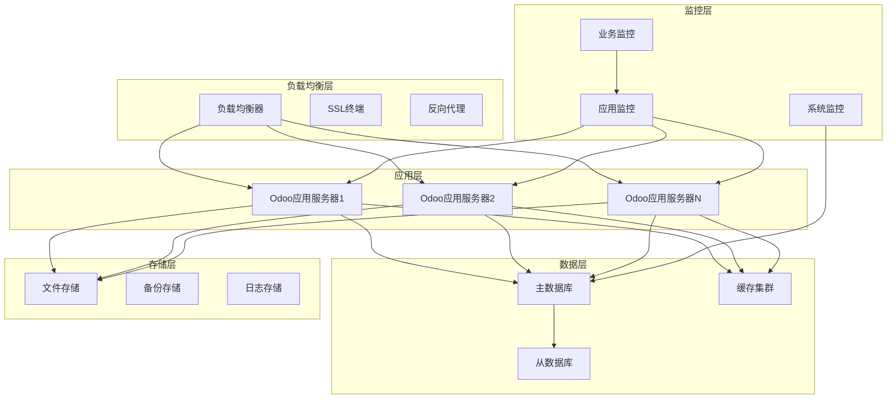
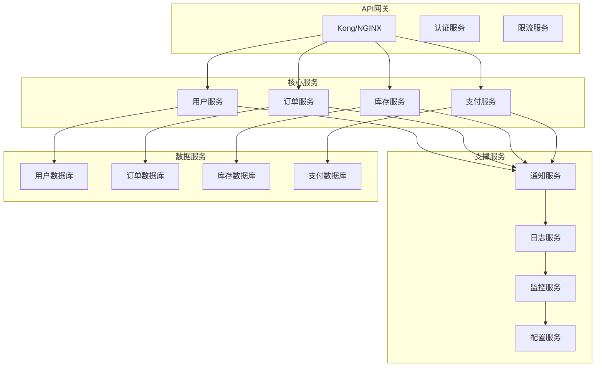

# 企业级架构设计

## 企业级架构概述

在Odoo 17中，企业级架构设计是构建大型、可扩展、高可用系统的关键。通过合理的架构设计，支持大规模用户、复杂业务场景和高性能要求。

### 企业级架构图


## 高可用架构设计

### 应用层高可用
```yaml
# Docker Compose 高可用配置
version: '3.8'

services:
  # 负载均衡器
  nginx:
    image: nginx:alpine
    ports:
      - "80:80"
      - "443:443"
    volumes:
      - ./nginx.conf:/etc/nginx/nginx.conf
      - ./ssl:/etc/nginx/ssl
    depends_on:
      - odoo1
      - odoo2
      - odoo3

  # Odoo应用服务器集群
  odoo1:
    image: odoo:17.0
    environment:
      - HOST=postgres
      - USER=odoo
      - PASSWORD=odoo
    volumes:
      - odoo-data1:/var/lib/odoo
      - ./config:/etc/odoo
    depends_on:
      - postgres
      - redis

  odoo2:
    image: odoo:17.0
    environment:
      - HOST=postgres
      - USER=odoo
      - PASSWORD=odoo
    volumes:
      - odoo-data2:/var/lib/odoo
      - ./config:/etc/odoo
    depends_on:
      - postgres
      - redis

  odoo3:
    image: odoo:17.0
    environment:
      - HOST=postgres
      - USER=odoo
      - PASSWORD=odoo
    volumes:
      - odoo-data3:/var/lib/odoo
      - ./config:/etc/odoo
    depends_on:
      - postgres
      - redis

  # 数据库集群
  postgres:
    image: postgres:15
    environment:
      - POSTGRES_DB=odoo
      - POSTGRES_USER=odoo
      - POSTGRES_PASSWORD=odoo
    volumes:
      - postgres-data:/var/lib/postgresql/data
    ports:
      - "5432:5432"

  # 缓存集群
  redis:
    image: redis:7-alpine
    command: redis-server --appendonly yes
    volumes:
      - redis-data:/data
    ports:
      - "6379:6379"
```

### 数据库高可用
```yaml
# PostgreSQL 主从复制配置
# 主数据库配置 (postgresql.conf)
wal_level = replica
max_wal_senders = 3
max_replication_slots = 3
hot_standby = on

# 从数据库配置 (postgresql.conf)
hot_standby = on

# 主从复制设置
# 在主数据库创建复制用户
CREATE USER replicator REPLICATION LOGIN CONNECTION LIMIT 3 ENCRYPTED PASSWORD 'replicator_password';

# 配置pg_hba.conf
host replication replicator 0.0.0.0/0 md5

# 从数据库初始化
pg_basebackup -h master_host -D /var/lib/postgresql/data -U replicator -v -P -W
```

### 负载均衡配置
```nginx
# nginx.conf 负载均衡配置
upstream odoo_backend {
    least_conn;
    server odoo1:8069 weight=1 max_fails=3 fail_timeout=30s;
    server odoo2:8069 weight=1 max_fails=3 fail_timeout=30s;
    server odoo3:8069 weight=1 max_fails=3 fail_timeout=30s;
}

upstream odoo_chat {
    least_conn;
    server odoo1:8072 weight=1 max_fails=3 fail_timeout=30s;
    server odoo2:8072 weight=1 max_fails=3 fail_timeout=30s;
    server odoo3:8072 weight=1 max_fails=3 fail_timeout=30s;
}

server {
    listen 80;
    server_name your-domain.com;
    return 301 https://$server_name$request_uri;
}

server {
    listen 443 ssl http2;
    server_name your-domain.com;

    ssl_certificate /etc/nginx/ssl/cert.pem;
    ssl_certificate_key /etc/nginx/ssl/key.pem;

    # Odoo主应用
    location / {
        proxy_pass http://odoo_backend;
        proxy_set_header Host $host;
        proxy_set_header X-Real-IP $remote_addr;
        proxy_set_header X-Forwarded-For $proxy_add_x_forwarded_for;
        proxy_set_header X-Forwarded-Proto $scheme;
        proxy_redirect off;
    }

    # WebSocket支持
    location /websocket {
        proxy_pass http://odoo_chat;
        proxy_set_header Upgrade $http_upgrade;
        proxy_set_header Connection "upgrade";
        proxy_set_header Host $host;
        proxy_set_header X-Real-IP $remote_addr;
        proxy_set_header X-Forwarded-For $proxy_add_x_forwarded_for;
        proxy_set_header X-Forwarded-Proto $scheme;
    }

    # 静态文件缓存
    location ~* \.(js|css|png|jpg|jpeg|gif|ico|svg)$ {
        proxy_pass http://odoo_backend;
        expires 1y;
        add_header Cache-Control "public, immutable";
    }
}
```

## 微服务集成架构

### 微服务架构设计


### 服务间通信
```python
# 服务间通信示例
import requests
import json
from odoo import models, fields, api

class SaleOrder(models.Model):
    _inherit = 'sale.order'
    
    def action_confirm(self):
        """确认订单时调用微服务"""
        result = super().action_confirm()
        
        # 调用库存服务
        self._call_inventory_service()
        
        # 调用支付服务
        self._call_payment_service()
        
        # 调用通知服务
        self._call_notification_service()
        
        return result
    
    def _call_inventory_service(self):
        """调用库存服务"""
        try:
            response = requests.post(
                'http://inventory-service:8080/api/reserve',
                json={
                    'order_id': self.id,
                    'lines': [
                        {
                            'product_id': line.product_id.id,
                            'quantity': line.product_uom_qty
                        }
                        for line in self.order_line
                    ]
                },
                headers={'Authorization': f'Bearer {self._get_service_token()}'},
                timeout=30
            )
            response.raise_for_status()
        except requests.RequestException as e:
            _logger.error(f'Inventory service call failed: {e}')
            raise
    
    def _call_payment_service(self):
        """调用支付服务"""
        try:
            response = requests.post(
                'http://payment-service:8080/api/process',
                json={
                    'order_id': self.id,
                    'amount': self.amount_total,
                    'currency': self.currency_id.name,
                    'customer_id': self.partner_id.id
                },
                headers={'Authorization': f'Bearer {self._get_service_token()}'},
                timeout=30
            )
            response.raise_for_status()
        except requests.RequestException as e:
            _logger.error(f'Payment service call failed: {e}')
            raise
    
    def _call_notification_service(self):
        """调用通知服务"""
        try:
            response = requests.post(
                'http://notification-service:8080/api/send',
                json={
                    'type': 'order_confirmation',
                    'recipient': self.partner_id.email,
                    'data': {
                        'order_number': self.name,
                        'amount': self.amount_total
                    }
                },
                headers={'Authorization': f'Bearer {self._get_service_token()}'},
                timeout=30
            )
            response.raise_for_status()
        except requests.RequestException as e:
            _logger.error(f'Notification service call failed: {e}')
            # 通知失败不影响主流程
```

### 事件驱动架构
```python
# 事件发布者
class SaleOrder(models.Model):
    _inherit = 'sale.order'
    
    def action_confirm(self):
        """发布订单确认事件"""
        result = super().action_confirm()
        
        # 发布事件
        self._publish_event('order.confirmed', {
            'order_id': self.id,
            'customer_id': self.partner_id.id,
            'amount': self.amount_total,
            'timestamp': fields.Datetime.now()
        })
        
        return result
    
    def _publish_event(self, event_type, data):
        """发布事件到消息队列"""
        import pika
        
        connection = pika.BlockingConnection(
            pika.ConnectionParameters('rabbitmq')
        )
        channel = connection.channel()
        
        channel.exchange_declare(
            exchange='odoo_events',
            exchange_type='topic'
        )
        
        message = json.dumps({
            'event_type': event_type,
            'data': data,
            'timestamp': fields.Datetime.now().isoformat()
        })
        
        channel.basic_publish(
            exchange='odoo_events',
            routing_key=event_type,
            body=message
        )
        
        connection.close()

# 事件消费者
class EventConsumer(models.Model):
    _name = 'event.consumer'
    
    def consume_order_events(self):
        """消费订单事件"""
        import pika
        
        connection = pika.BlockingConnection(
            pika.ConnectionParameters('rabbitmq')
        )
        channel = connection.channel()
        
        channel.exchange_declare(
            exchange='odoo_events',
            exchange_type='topic'
        )
        
        result = channel.queue_declare(queue='', exclusive=True)
        queue_name = result.method.queue
        
        channel.queue_bind(
            exchange='odoo_events',
            queue=queue_name,
            routing_key='order.*'
        )
        
        def callback(ch, method, properties, body):
            try:
                event = json.loads(body)
                self._handle_order_event(event)
                ch.basic_ack(delivery_tag=method.delivery_tag)
            except Exception as e:
                _logger.error(f'Event processing failed: {e}')
                ch.basic_nack(delivery_tag=method.delivery_tag, requeue=False)
        
        channel.basic_consume(
            queue=queue_name,
            on_message_callback=callback
        )
        
        channel.start_consuming()
    
    def _handle_order_event(self, event):
        """处理订单事件"""
        if event['event_type'] == 'order.confirmed':
            self._handle_order_confirmed(event['data'])
        elif event['event_type'] == 'order.cancelled':
            self._handle_order_cancelled(event['data'])
    
    def _handle_order_confirmed(self, data):
        """处理订单确认事件"""
        # 更新库存
        # 发送通知
        # 更新分析数据
        pass
```

## 云部署架构

### Kubernetes部署
```yaml
# k8s-deployment.yaml
apiVersion: apps/v1
kind: Deployment
metadata:
  name: odoo
  labels:
    app: odoo
spec:
  replicas: 3
  selector:
    matchLabels:
      app: odoo
  template:
    metadata:
      labels:
        app: odoo
    spec:
      containers:
      - name: odoo
        image: odoo:17.0
        ports:
        - containerPort: 8069
        env:
        - name: HOST
          value: "postgres-service"
        - name: USER
          value: "odoo"
        - name: PASSWORD
          valueFrom:
            secretKeyRef:
              name: postgres-secret
              key: password
        resources:
          requests:
            memory: "512Mi"
            cpu: "250m"
          limits:
            memory: "1Gi"
            cpu: "500m"
        livenessProbe:
          httpGet:
            path: /web/health
            port: 8069
          initialDelaySeconds: 30
          periodSeconds: 10
        readinessProbe:
          httpGet:
            path: /web/health
            port: 8069
          initialDelaySeconds: 5
          periodSeconds: 5

---
apiVersion: v1
kind: Service
metadata:
  name: odoo-service
spec:
  selector:
    app: odoo
  ports:
  - port: 8069
    targetPort: 8069
  type: ClusterIP

---
apiVersion: networking.k8s.io/v1
kind: Ingress
metadata:
  name: odoo-ingress
  annotations:
    nginx.ingress.kubernetes.io/ssl-redirect: "true"
    nginx.ingress.kubernetes.io/force-ssl-redirect: "true"
spec:
  tls:
  - hosts:
    - your-domain.com
    secretName: tls-secret
  rules:
  - host: your-domain.com
    http:
      paths:
      - path: /
        pathType: Prefix
        backend:
          service:
            name: odoo-service
            port:
              number: 8069
```

### 自动扩缩容
```yaml
# hpa.yaml
apiVersion: autoscaling/v2
kind: HorizontalPodAutoscaler
metadata:
  name: odoo-hpa
spec:
  scaleTargetRef:
    apiVersion: apps/v1
    kind: Deployment
    name: odoo
  minReplicas: 3
  maxReplicas: 10
  metrics:
  - type: Resource
    resource:
      name: cpu
      target:
        type: Utilization
        averageUtilization: 70
  - type: Resource
    resource:
      name: memory
      target:
        type: Utilization
        averageUtilization: 80
```

## 性能优化架构

### 缓存架构
```python
# 多级缓存实现
import redis
from functools import wraps

class CacheManager:
    def __init__(self):
        self.redis_client = redis.Redis(
            host='redis-cluster',
            port=6379,
            decode_responses=True
        )
    
    def cache_result(self, timeout=300):
        """缓存装饰器"""
        def decorator(func):
            @wraps(func)
            def wrapper(*args, **kwargs):
                # 生成缓存键
                cache_key = f"{func.__name__}:{hash(str(args) + str(kwargs))}"
                
                # 尝试从缓存获取
                cached_result = self.redis_client.get(cache_key)
                if cached_result:
                    return json.loads(cached_result)
                
                # 执行函数并缓存结果
                result = func(*args, **kwargs)
                self.redis_client.setex(
                    cache_key, 
                    timeout, 
                    json.dumps(result, default=str)
                )
                
                return result
            return wrapper
        return decorator

# 使用示例
cache_manager = CacheManager()

class SaleOrder(models.Model):
    _inherit = 'sale.order'
    
    @cache_manager.cache_result(timeout=600)
    def _compute_amount_total(self):
        """缓存计算结果"""
        return sum(line.price_subtotal for line in self.order_line)
    
    @cache_manager.cache_result(timeout=3600)
    def _get_customer_orders(self, customer_id):
        """缓存客户订单查询"""
        return self.search([
            ('partner_id', '=', customer_id),
            ('state', 'in', ['sale', 'done'])
        ])
```

### 数据库优化
```python
# 数据库连接池配置
class DatabaseManager:
    def __init__(self):
        self.pool = None
        self._init_pool()
    
    def _init_pool(self):
        """初始化连接池"""
        from psycopg2 import pool
        
        self.pool = pool.ThreadedConnectionPool(
            minconn=5,
            maxconn=20,
            host='postgres-cluster',
            port=5432,
            database='odoo',
            user='odoo',
            password='odoo_password'
        )
    
    def get_connection(self):
        """获取数据库连接"""
        return self.pool.getconn()
    
    def return_connection(self, conn):
        """归还数据库连接"""
        self.pool.putconn(conn)
    
    def execute_query(self, query, params=None):
        """执行查询"""
        conn = self.get_connection()
        try:
            with conn.cursor() as cursor:
                cursor.execute(query, params)
                return cursor.fetchall()
        finally:
            self.return_connection(conn)

# 查询优化
class OptimizedQuery:
    def __init__(self, db_manager):
        self.db_manager = db_manager
    
    def get_orders_with_customers(self, limit=1000):
        """优化的订单查询"""
        query = """
        SELECT 
            so.id,
            so.name,
            so.date_order,
            so.amount_total,
            rp.name as customer_name,
            rp.email as customer_email
        FROM sale_order so
        JOIN res_partner rp ON so.partner_id = rp.id
        WHERE so.state IN ('sale', 'done')
        ORDER BY so.date_order DESC
        LIMIT %s
        """
        return self.db_manager.execute_query(query, (limit,))
    
    def get_monthly_sales(self, year, month):
        """月度销售统计"""
        query = """
        SELECT 
            DATE_TRUNC('day', date_order) as day,
            COUNT(*) as order_count,
            SUM(amount_total) as total_amount
        FROM sale_order
        WHERE EXTRACT(YEAR FROM date_order) = %s
        AND EXTRACT(MONTH FROM date_order) = %s
        AND state IN ('sale', 'done')
        GROUP BY DATE_TRUNC('day', date_order)
        ORDER BY day
        """
        return self.db_manager.execute_query(query, (year, month))
```

## 监控和运维架构

### 应用监控
```python
# 应用性能监控
import time
import logging
from functools import wraps

_logger = logging.getLogger(__name__)

class PerformanceMonitor:
    def __init__(self):
        self.metrics = {}
    
    def monitor_method(self, method_name=None):
        """方法性能监控装饰器"""
        def decorator(func):
            @wraps(func)
            def wrapper(*args, **kwargs):
                start_time = time.time()
                method = method_name or func.__name__
                
                try:
                    result = func(*args, **kwargs)
                    execution_time = time.time() - start_time
                    
                    # 记录性能指标
                    self._record_metric(method, execution_time, 'success')
                    
                    return result
                except Exception as e:
                    execution_time = time.time() - start_time
                    self._record_metric(method, execution_time, 'error')
                    _logger.error(f'Method {method} failed: {e}')
                    raise
            
            return wrapper
        return decorator
    
    def _record_metric(self, method, execution_time, status):
        """记录性能指标"""
        if method not in self.metrics:
            self.metrics[method] = {
                'total_calls': 0,
                'total_time': 0,
                'success_calls': 0,
                'error_calls': 0
            }
        
        self.metrics[method]['total_calls'] += 1
        self.metrics[method]['total_time'] += execution_time
        
        if status == 'success':
            self.metrics[method]['success_calls'] += 1
        else:
            self.metrics[method]['error_calls'] += 1

# 使用示例
monitor = PerformanceMonitor()

class SaleOrder(models.Model):
    _inherit = 'sale.order'
    
    @monitor.monitor_method('sale_order_confirm')
    def action_confirm(self):
        """监控订单确认性能"""
        return super().action_confirm()
    
    @monitor.monitor_method('sale_order_cancel')
    def action_cancel(self):
        """监控订单取消性能"""
        return super().action_cancel()
```

### 系统监控
```yaml
# prometheus.yml
global:
  scrape_interval: 15s

scrape_configs:
  - job_name: 'odoo'
    static_configs:
      - targets: ['odoo1:8069', 'odoo2:8069', 'odoo3:8069']
    metrics_path: '/web/health'
    scrape_interval: 30s

  - job_name: 'postgres'
    static_configs:
      - targets: ['postgres:5432']
    scrape_interval: 30s

  - job_name: 'redis'
    static_configs:
      - targets: ['redis:6379']
    scrape_interval: 30s

  - job_name: 'nginx'
    static_configs:
      - targets: ['nginx:80']
    scrape_interval: 30s
```

## 安全架构设计

### 安全防护
```python
# 安全中间件
class SecurityMiddleware:
    def __init__(self):
        self.rate_limiter = RateLimiter()
        self.auth_manager = AuthManager()
    
    def check_rate_limit(self, ip_address, endpoint):
        """检查请求频率限制"""
        return self.rate_limiter.is_allowed(ip_address, endpoint)
    
    def validate_token(self, token):
        """验证访问令牌"""
        return self.auth_manager.validate_token(token)
    
    def log_security_event(self, event_type, details):
        """记录安全事件"""
        _logger.warning(f'Security event: {event_type} - {details}')

# 使用示例
security_middleware = SecurityMiddleware()

class SaleOrder(models.Model):
    _inherit = 'sale.order'
    
    def action_confirm(self):
        """带安全检查的订单确认"""
        # 检查用户权限
        if not self._check_user_permissions():
            raise AccessError('Insufficient permissions')
        
        # 检查业务规则
        if not self._check_business_rules():
            raise ValidationError('Business rules violation')
        
        # 记录操作日志
        self._log_operation('order_confirm')
        
        return super().action_confirm()
    
    def _check_user_permissions(self):
        """检查用户权限"""
        user = self.env.user
        return user.has_group('sales_team.group_sale_manager')
    
    def _check_business_rules(self):
        """检查业务规则"""
        # 检查订单金额限制
        if self.amount_total > 100000:
            return user.has_group('sales_team.group_sale_director')
        
        return True
    
    def _log_operation(self, operation):
        """记录操作日志"""
        self.env['audit.log'].create({
            'model': self._name,
            'res_id': self.id,
            'operation': operation,
            'user_id': self.env.user.id,
            'timestamp': fields.Datetime.now(),
            'ip_address': self.env.context.get('remote_addr')
        })
```

## 最佳实践

### 架构设计原则
1. **可扩展性**：支持水平扩展和垂直扩展
2. **高可用性**：消除单点故障
3. **性能优化**：优化响应时间和吞吐量
4. **安全性**：多层安全防护
5. **可维护性**：易于监控和运维

### 实施建议
- 从简单架构开始，逐步演进
- 重视监控和日志记录
- 定期进行性能测试和优化
- 建立完善的备份和恢复机制
- 制定详细的运维手册

## 学习建议

### 理解重点
1. **架构模式**：理解各种架构模式的特点
2. **技术选型**：掌握技术选型的原则
3. **性能优化**：学会性能优化的方法
4. **运维管理**：理解运维管理的重要性

### 实践建议
- 从单机部署开始学习
- 逐步引入高可用组件
- 实践微服务架构
- 关注云原生技术
- 建立监控体系

## 相关链接
- [[微服务集成方案]] - 微服务架构
- [[云部署策略]] - 云部署实践
- [[高可用架构]] - 高可用设计
- [[性能优化]] - 性能优化技巧
