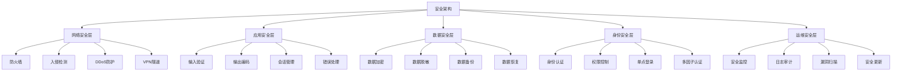

# 安全架构设计

## 🎯 学习目标
- 掌握安全架构设计的基本原则和方法
- 学会构建多层次的安全防护体系
- 理解身份认证、授权和审计机制

## 📊 安全架构概述

### 安全架构层次
安全架构是一个多层次、多维度的防护体系，涵盖从网络到应用、从数据到用户的全面安全保护。

### 安全架构模型


## 🔐 身份认证与授权

### 身份认证系统
```python
# models/authentication_system.py
from odoo import models, fields, api
import jwt
import hashlib
import hmac
import time
import secrets
from odoo.exceptions import UserError, ValidationError

class AuthenticationSystem(models.Model):
    _name = 'authentication.system'
    _description = '身份认证系统'
    
    name = fields.Char('认证系统名称', required=True)
    
    # JWT配置
    jwt_secret_key = fields.Char('JWT密钥', required=True)
    jwt_algorithm = fields.Selection([
        ('HS256', 'HS256'),
        ('HS384', 'HS384'),
        ('HS512', 'HS512'),
        ('RS256', 'RS256'),
        ('RS384', 'RS384'),
        ('RS512', 'RS512'),
    ], string='JWT算法', default='HS256')
    jwt_expiration = fields.Integer('JWT过期时间(秒)', default=3600)
    jwt_refresh_expiration = fields.Integer('刷新令牌过期时间(秒)', default=86400)
    
    # 密码策略
    password_min_length = fields.Integer('密码最小长度', default=8)
    password_require_uppercase = fields.Boolean('要求大写字母', default=True)
    password_require_lowercase = fields.Boolean('要求小写字母', default=True)
    password_require_numbers = fields.Boolean('要求数字', default=True)
    password_require_symbols = fields.Boolean('要求特殊字符', default=True)
    password_history_count = fields.Integer('密码历史记录数', default=5)
    password_expiration_days = fields.Integer('密码过期天数', default=90)
    
    # 账户锁定策略
    max_login_attempts = fields.Integer('最大登录尝试次数', default=5)
    lockout_duration = fields.Integer('锁定持续时间(分钟)', default=30)
    
    # 多因子认证
    mfa_enabled = fields.Boolean('启用多因子认证', default=False)
    mfa_methods = fields.Selection([
        ('sms', '短信验证'),
        ('email', '邮箱验证'),
        ('totp', '时间令牌'),
        ('push', '推送通知'),
    ], string='MFA方法', default='sms')
    
    is_active = fields.Boolean('是否激活', default=True)
    
    @api.model
    def authenticate_user(self, login, password, mfa_code=None):
        """用户认证"""
        try:
            # 查找用户
            user = self.env['res.users'].search([('login', '=', login)])
            
            if not user.exists():
                self._log_failed_attempt(login, '用户不存在')
                return {
                    'success': False,
                    'error': '用户名或密码错误'
                }
            
            # 检查账户状态
            if not user.active:
                self._log_failed_attempt(login, '账户已禁用')
                return {
                    'success': False,
                    'error': '账户已禁用'
                }
            
            # 检查账户锁定
            if self._is_account_locked(user):
                self._log_failed_attempt(login, '账户已锁定')
                return {
                    'success': False,
                    'error': '账户已锁定，请稍后再试'
                }
            
            # 验证密码
            if not self._verify_password(user, password):
                self._handle_failed_login(user)
                self._log_failed_attempt(login, '密码错误')
                return {
                    'success': False,
                    'error': '用户名或密码错误'
                }
            
            # 检查密码是否过期
            if self._is_password_expired(user):
                return {
                    'success': False,
                    'error': '密码已过期，请修改密码',
                    'require_password_change': True
                }
            
            # 多因子认证
            if self.mfa_enabled:
                if not mfa_code:
                    # 发送MFA代码
                    mfa_token = self._send_mfa_code(user)
                    return {
                        'success': False,
                        'error': '需要多因子认证',
                        'mfa_required': True,
                        'mfa_token': mfa_token
                    }
                
                # 验证MFA代码
                if not self._verify_mfa_code(user, mfa_code):
                    self._log_failed_attempt(login, 'MFA验证失败')
                    return {
                        'success': False,
                        'error': '验证码错误'
                    }
            
            # 生成访问令牌
            access_token = self._generate_access_token(user)
            refresh_token = self._generate_refresh_token(user)
            
            # 记录成功登录
            self._log_successful_login(user)
            
            return {
                'success': True,
                'access_token': access_token,
                'refresh_token': refresh_token,
                'user': {
                    'id': user.id,
                    'name': user.name,
                    'login': user.login,
                    'email': user.email,
                }
            }
            
        except Exception as e:
            self._log_error(f'认证失败: {str(e)}')
            return {
                'success': False,
                'error': '认证失败'
            }
    
    @api.model
    def refresh_token(self, refresh_token):
        """刷新访问令牌"""
        try:
            # 验证刷新令牌
            payload = self._verify_token(refresh_token, 'refresh')
            
            if not payload:
                return {
                    'success': False,
                    'error': '无效的刷新令牌'
                }
            
            # 获取用户
            user = self.env['res.users'].browse(payload.get('user_id'))
            
            if not user.exists() or not user.active:
                return {
                    'success': False,
                    'error': '用户不存在或已禁用'
                }
            
            # 生成新的访问令牌
            access_token = self._generate_access_token(user)
            
            return {
                'success': True,
                'access_token': access_token
            }
            
        except Exception as e:
            return {
                'success': False,
                'error': '刷新令牌失败'
            }
    
    @api.model
    def change_password(self, user_id, old_password, new_password):
        """修改密码"""
        try:
            user = self.env['res.users'].browse(user_id)
            
            if not user.exists():
                return {
                    'success': False,
                    'error': '用户不存在'
                }
            
            # 验证旧密码
            if not self._verify_password(user, old_password):
                return {
                    'success': False,
                    'error': '旧密码错误'
                }
            
            # 验证新密码
            if not self._validate_password(new_password):
                return {
                    'success': False,
                    'error': '新密码不符合要求'
                }
            
            # 检查密码历史
            if self._is_password_in_history(user, new_password):
                return {
                    'success': False,
                    'error': '新密码不能与最近使用的密码相同'
                }
            
            # 更新密码
            user.password = self._hash_password(new_password)
            user.password_write_date = fields.Datetime.now()
            
            # 记录密码历史
            self._record_password_history(user, new_password)
            
            # 使所有现有令牌失效
            self._invalidate_user_tokens(user)
            
            return {
                'success': True,
                'message': '密码修改成功'
            }
            
        except Exception as e:
            return {
                'success': False,
                'error': '密码修改失败'
            }
    
    def _verify_password(self, user, password):
        """验证密码"""
        try:
            # 使用Odoo的密码验证机制
            return user._crypt_context().verify(password, user.password)
        except:
            return False
    
    def _hash_password(self, password):
        """哈希密码"""
        return self.env['res.users']._crypt_context().hash(password)
    
    def _validate_password(self, password):
        """验证密码强度"""
        if len(password) < self.password_min_length:
            return False
        
        if self.password_require_uppercase and not any(c.isupper() for c in password):
            return False
        
        if self.password_require_lowercase and not any(c.islower() for c in password):
            return False
        
        if self.password_require_numbers and not any(c.isdigit() for c in password):
            return False
        
        if self.password_require_symbols and not any(c in '!@#$%^&*()_+-=[]{}|;:,.<>?' for c in password):
            return False
        
        return True
    
    def _is_password_expired(self, user):
        """检查密码是否过期"""
        if not user.password_write_date:
            return True
        
        days_since_change = (fields.Datetime.now() - user.password_write_date).days
        return days_since_change > self.password_expiration_days
    
    def _is_password_in_history(self, user, password):
        """检查密码是否在历史记录中"""
        password_history = self.env['password.history'].search([
            ('user_id', '=', user.id)
        ], order='create_date desc', limit=self.password_history_count)
        
        for history in password_history:
            if self._verify_password(user, password):
                return True
        
        return False
    
    def _record_password_history(self, user, password):
        """记录密码历史"""
        self.env['password.history'].create({
            'user_id': user.id,
            'password_hash': self._hash_password(password),
        })
    
    def _generate_access_token(self, user):
        """生成访问令牌"""
        payload = {
            'user_id': user.id,
            'login': user.login,
            'type': 'access',
            'exp': int(time.time()) + self.jwt_expiration,
            'iat': int(time.time()),
        }
        
        return jwt.encode(payload, self.jwt_secret_key, algorithm=self.jwt_algorithm)
    
    def _generate_refresh_token(self, user):
        """生成刷新令牌"""
        payload = {
            'user_id': user.id,
            'login': user.login,
            'type': 'refresh',
            'exp': int(time.time()) + self.jwt_refresh_expiration,
            'iat': int(time.time()),
        }
        
        return jwt.encode(payload, self.jwt_secret_key, algorithm=self.jwt_algorithm)
    
    def _verify_token(self, token, token_type):
        """验证令牌"""
        try:
            payload = jwt.decode(token, self.jwt_secret_key, algorithms=[self.jwt_algorithm])
            
            if payload.get('type') != token_type:
                return None
            
            return payload
            
        except jwt.ExpiredSignatureError:
            return None
        except jwt.InvalidTokenError:
            return None
    
    def _send_mfa_code(self, user):
        """发送MFA代码"""
        try:
            # 生成MFA代码
            mfa_code = str(secrets.randbelow(900000) + 100000)  # 6位数字
            
            # 生成MFA令牌
            mfa_token = secrets.token_urlsafe(32)
            
            # 存储MFA信息
            mfa_record = self.env['mfa.verification'].create({
                'user_id': user.id,
                'mfa_code': mfa_code,
                'mfa_token': mfa_token,
                'expires_at': fields.Datetime.now() + timedelta(minutes=5),
            })
            
            # 发送MFA代码
            if self.mfa_methods == 'sms':
                self._send_sms_code(user, mfa_code)
            elif self.mfa_methods == 'email':
                self._send_email_code(user, mfa_code)
            
            return mfa_token
            
        except Exception as e:
            self._log_error(f'发送MFA代码失败: {str(e)}')
            return None
    
    def _verify_mfa_code(self, user, mfa_code):
        """验证MFA代码"""
        try:
            mfa_record = self.env['mfa.verification'].search([
                ('user_id', '=', user.id),
                ('mfa_code', '=', mfa_code),
                ('expires_at', '>', fields.Datetime.now()),
                ('is_used', '=', False)
            ], limit=1)
            
            if mfa_record:
                mfa_record.is_used = True
                return True
            
            return False
            
        except Exception as e:
            self._log_error(f'验证MFA代码失败: {str(e)}')
            return False
    
    def _is_account_locked(self, user):
        """检查账户是否锁定"""
        failed_attempts = self.env['login.attempt'].search([
            ('user_id', '=', user.id),
            ('success', '=', False),
            ('attempt_time', '>=', fields.Datetime.now() - timedelta(minutes=self.lockout_duration))
        ])
        
        return len(failed_attempts) >= self.max_login_attempts
    
    def _handle_failed_login(self, user):
        """处理登录失败"""
        # 记录失败尝试
        self.env['login.attempt'].create({
            'user_id': user.id,
            'success': False,
            'attempt_time': fields.Datetime.now(),
        })
    
    def _log_successful_login(self, user):
        """记录成功登录"""
        self.env['login.attempt'].create({
            'user_id': user.id,
            'success': True,
            'attempt_time': fields.Datetime.now(),
        })
    
    def _log_failed_attempt(self, login, reason):
        """记录失败尝试"""
        self.env['ir.logging'].create({
            'name': 'Authentication',
            'type': 'server',
            'dbname': self.env.cr.dbname,
            'level': 'WARNING',
            'message': f'登录失败: {login} - {reason}',
            'path': 'authentication',
            'line': 0,
            'func': 'authenticate_user',
        })
    
    def _invalidate_user_tokens(self, user):
        """使用户令牌失效"""
        # 这里可以实现令牌黑名单机制
        pass
    
    def _send_sms_code(self, user, code):
        """发送短信验证码"""
        # 这里可以集成第三方短信服务
        pass
    
    def _send_email_code(self, user, code):
        """发送邮箱验证码"""
        try:
            mail_values = {
                'subject': '验证码',
                'body_html': f'<p>您的验证码是: <strong>{code}</strong></p><p>验证码5分钟内有效。</p>',
                'email_to': user.email,
                'email_from': self.env.user.email,
            }
            
            mail = self.env['mail.mail'].create(mail_values)
            mail.send()
            
        except Exception as e:
            self._log_error(f'发送邮箱验证码失败: {str(e)}')
    
    def _log_error(self, message):
        """记录错误日志"""
        self.env['ir.logging'].create({
            'name': 'Authentication System',
            'type': 'server',
            'dbname': self.env.cr.dbname,
            'level': 'ERROR',
            'message': message,
            'path': 'authentication_system',
            'line': 0,
            'func': 'authentication',
        })

class PasswordHistory(models.Model):
    _name = 'password.history'
    _description = '密码历史'
    
    user_id = fields.Many2one('res.users', string='用户', required=True)
    password_hash = fields.Char('密码哈希', required=True)
    create_date = fields.Datetime('创建时间', default=fields.Datetime.now)

class MfaVerification(models.Model):
    _name = 'mfa.verification'
    _description = 'MFA验证'
    
    user_id = fields.Many2one('res.users', string='用户', required=True)
    mfa_code = fields.Char('MFA代码', required=True)
    mfa_token = fields.Char('MFA令牌', required=True)
    expires_at = fields.Datetime('过期时间', required=True)
    is_used = fields.Boolean('是否已使用', default=False)
    create_date = fields.Datetime('创建时间', default=fields.Datetime.now)

class LoginAttempt(models.Model):
    _name = 'login.attempt'
    _description = '登录尝试'
    
    user_id = fields.Many2one('res.users', string='用户', required=True)
    success = fields.Boolean('是否成功', default=False)
    attempt_time = fields.Datetime('尝试时间', default=fields.Datetime.now)
    ip_address = fields.Char('IP地址')
    user_agent = fields.Char('用户代理')
```

### 权限控制系统
```python
# models/authorization_system.py
from odoo import models, fields, api
from odoo.exceptions import UserError, AccessError

class AuthorizationSystem(models.Model):
    _name = 'authorization.system'
    _description = '权限控制系统'
    
    name = fields.Char('权限系统名称', required=True)
    
    # RBAC配置
    rbac_enabled = fields.Boolean('启用RBAC', default=True)
    default_role = fields.Many2one('user.role', string='默认角色')
    
    # 权限缓存
    cache_enabled = fields.Boolean('启用权限缓存', default=True)
    cache_ttl = fields.Integer('缓存TTL(秒)', default=300)
    
    # 审计配置
    audit_enabled = fields.Boolean('启用权限审计', default=True)
    audit_sensitive_operations = fields.Boolean('审计敏感操作', default=True)
    
    is_active = fields.Boolean('是否激活', default=True)
    
    @api.model
    def check_permission(self, user_id, resource, action, context=None):
        """检查权限"""
        try:
            user = self.env['res.users'].browse(user_id)
            
            if not user.exists():
                return {
                    'success': False,
                    'error': '用户不存在'
                }
            
            # 检查是否为超级用户
            if user.has_group('base.group_system'):
                return {
                    'success': True,
                    'permission': 'granted'
                }
            
            # 检查权限
            permission = self._evaluate_permission(user, resource, action, context)
            
            # 记录审计日志
            if self.audit_enabled:
                self._log_permission_check(user, resource, action, permission)
            
            return {
                'success': True,
                'permission': permission
            }
            
        except Exception as e:
            return {
                'success': False,
                'error': str(e)
            }
    
    def _evaluate_permission(self, user, resource, action, context):
        """评估权限"""
        try:
            # 获取用户角色
            user_roles = self._get_user_roles(user)
            
            # 检查角色权限
            for role in user_roles:
                if self._check_role_permission(role, resource, action):
                    return 'granted'
            
            # 检查直接权限
            if self._check_direct_permission(user, resource, action):
                return 'granted'
            
            # 检查继承权限
            if self._check_inherited_permission(user, resource, action):
                return 'granted'
            
            return 'denied'
            
        except Exception as e:
            self._log_error(f'权限评估失败: {str(e)}')
            return 'denied'
    
    def _get_user_roles(self, user):
        """获取用户角色"""
        return self.env['user.role'].search([
            ('users', 'in', user.id),
            ('is_active', '=', True)
        ])
    
    def _check_role_permission(self, role, resource, action):
        """检查角色权限"""
        try:
            # 查找角色权限
            permission = self.env['role.permission'].search([
                ('role_id', '=', role.id),
                ('resource', '=', resource),
                ('action', '=', action),
                ('is_active', '=', True)
            ], limit=1)
            
            return permission.exists() and permission.permission_type == 'allow'
            
        except Exception as e:
            self._log_error(f'检查角色权限失败: {str(e)}')
            return False
    
    def _check_direct_permission(self, user, resource, action):
        """检查直接权限"""
        try:
            # 查找用户直接权限
            permission = self.env['user.permission'].search([
                ('user_id', '=', user.id),
                ('resource', '=', resource),
                ('action', '=', action),
                ('is_active', '=', True)
            ], limit=1)
            
            return permission.exists() and permission.permission_type == 'allow'
            
        except Exception as e:
            self._log_error(f'检查直接权限失败: {str(e)}')
            return False
    
    def _check_inherited_permission(self, user, resource, action):
        """检查继承权限"""
        try:
            # 检查用户组权限
            for group in user.groups_id:
                if self._check_group_permission(group, resource, action):
                    return True
            
            return False
            
        except Exception as e:
            self._log_error(f'检查继承权限失败: {str(e)}')
            return False
    
    def _check_group_permission(self, group, resource, action):
        """检查组权限"""
        try:
            # 查找组权限
            permission = self.env['group.permission'].search([
                ('group_id', '=', group.id),
                ('resource', '=', resource),
                ('action', '=', action),
                ('is_active', '=', True)
            ], limit=1)
            
            return permission.exists() and permission.permission_type == 'allow'
            
        except Exception as e:
            self._log_error(f'检查组权限失败: {str(e)}')
            return False
    
    def _log_permission_check(self, user, resource, action, permission):
        """记录权限检查日志"""
        try:
            self.env['permission.audit'].create({
                'user_id': user.id,
                'resource': resource,
                'action': action,
                'permission': permission,
                'check_time': fields.Datetime.now(),
                'ip_address': self._get_client_ip(),
                'user_agent': self._get_user_agent(),
            })
            
        except Exception as e:
            self._log_error(f'记录权限检查日志失败: {str(e)}')
    
    def _get_client_ip(self):
        """获取客户端IP"""
        # 这里可以从请求上下文中获取IP
        return '127.0.0.1'
    
    def _get_user_agent(self):
        """获取用户代理"""
        # 这里可以从请求上下文中获取User-Agent
        return 'Unknown'
    
    def _log_error(self, message):
        """记录错误日志"""
        self.env['ir.logging'].create({
            'name': 'Authorization System',
            'type': 'server',
            'dbname': self.env.cr.dbname,
            'level': 'ERROR',
            'message': message,
            'path': 'authorization_system',
            'line': 0,
            'func': 'authorization',
        })

class UserRole(models.Model):
    _name = 'user.role'
    _description = '用户角色'
    
    name = fields.Char('角色名称', required=True)
    description = fields.Text('角色描述')
    users = fields.Many2many('res.users', string='用户')
    permissions = fields.One2many('role.permission', 'role_id', string='权限')
    
    is_active = fields.Boolean('是否激活', default=True)
    create_date = fields.Datetime('创建时间', default=fields.Datetime.now)

class RolePermission(models.Model):
    _name = 'role.permission'
    _description = '角色权限'
    
    role_id = fields.Many2one('user.role', string='角色', required=True)
    resource = fields.Char('资源', required=True)
    action = fields.Char('操作', required=True)
    permission_type = fields.Selection([
        ('allow', '允许'),
        ('deny', '拒绝'),
    ], string='权限类型', default='allow')
    
    is_active = fields.Boolean('是否激活', default=True)
    create_date = fields.Datetime('创建时间', default=fields.Datetime.now)

class UserPermission(models.Model):
    _name = 'user.permission'
    _description = '用户权限'
    
    user_id = fields.Many2one('res.users', string='用户', required=True)
    resource = fields.Char('资源', required=True)
    action = fields.Char('操作', required=True)
    permission_type = fields.Selection([
        ('allow', '允许'),
        ('deny', '拒绝'),
    ], string='权限类型', default='allow')
    
    is_active = fields.Boolean('是否激活', default=True)
    create_date = fields.Datetime('创建时间', default=fields.Datetime.now)

class GroupPermission(models.Model):
    _name = 'group.permission'
    _description = '组权限'
    
    group_id = fields.Many2one('res.groups', string='组', required=True)
    resource = fields.Char('资源', required=True)
    action = fields.Char('操作', required=True)
    permission_type = fields.Selection([
        ('allow', '允许'),
        ('deny', '拒绝'),
    ], string='权限类型', default='allow')
    
    is_active = fields.Boolean('是否激活', default=True)
    create_date = fields.Datetime('创建时间', default=fields.Datetime.now)

class PermissionAudit(models.Model):
    _name = 'permission.audit'
    _description = '权限审计'
    
    user_id = fields.Many2one('res.users', string='用户', required=True)
    resource = fields.Char('资源', required=True)
    action = fields.Char('操作', required=True)
    permission = fields.Selection([
        ('granted', '已授权'),
        ('denied', '已拒绝'),
    ], string='权限结果', required=True)
    
    check_time = fields.Datetime('检查时间', required=True)
    ip_address = fields.Char('IP地址')
    user_agent = fields.Char('用户代理')
```

## 🔒 数据安全

### 数据加密系统
```python
# models/data_encryption.py
from odoo import models, fields, api
from cryptography.fernet import Fernet
from cryptography.hazmat.primitives import hashes
from cryptography.hazmat.primitives.kdf.pbkdf2 import PBKDF2HMAC
import base64
import os
from odoo.exceptions import UserError

class DataEncryptionSystem(models.Model):
    _name = 'data.encryption.system'
    _description = '数据加密系统'
    
    name = fields.Char('加密系统名称', required=True)
    
    # 加密配置
    encryption_algorithm = fields.Selection([
        ('AES-256-GCM', 'AES-256-GCM'),
        ('AES-256-CBC', 'AES-256-CBC'),
        ('ChaCha20-Poly1305', 'ChaCha20-Poly1305'),
    ], string='加密算法', default='AES-256-GCM')
    
    key_derivation = fields.Selection([
        ('PBKDF2', 'PBKDF2'),
        ('Argon2', 'Argon2'),
        ('Scrypt', 'Scrypt'),
    ], string='密钥派生', default='PBKDF2')
    
    key_rotation_days = fields.Integer('密钥轮换天数', default=90)
    
    # 加密字段
    encrypted_fields = fields.One2many('encrypted.field', 'encryption_system_id', string='加密字段')
    
    is_active = fields.Boolean('是否激活', default=True)
    
    @api.model
    def encrypt_data(self, data, field_name=None):
        """加密数据"""
        try:
            # 获取加密密钥
            encryption_key = self._get_encryption_key(field_name)
            
            # 创建加密器
            fernet = Fernet(encryption_key)
            
            # 加密数据
            encrypted_data = fernet.encrypt(data.encode('utf-8'))
            
            # 返回Base64编码的加密数据
            return base64.b64encode(encrypted_data).decode('utf-8')
            
        except Exception as e:
            self._log_error(f'数据加密失败: {str(e)}')
            raise UserError(f'数据加密失败: {str(e)}')
    
    @api.model
    def decrypt_data(self, encrypted_data, field_name=None):
        """解密数据"""
        try:
            # 获取解密密钥
            decryption_key = self._get_decryption_key(field_name)
            
            # 创建解密器
            fernet = Fernet(decryption_key)
            
            # 解码Base64
            encrypted_bytes = base64.b64decode(encrypted_data.encode('utf-8'))
            
            # 解密数据
            decrypted_data = fernet.decrypt(encrypted_bytes)
            
            return decrypted_data.decode('utf-8')
            
        except Exception as e:
            self._log_error(f'数据解密失败: {str(e)}')
            raise UserError(f'数据解密失败: {str(e)}')
    
    def _get_encryption_key(self, field_name=None):
        """获取加密密钥"""
        try:
            # 查找字段特定的密钥
            if field_name:
                field_config = self.encrypted_fields.filtered(lambda f: f.field_name == field_name)
                if field_config:
                    return field_config.encryption_key
            
            # 使用默认密钥
            default_key = self.env['ir.config_parameter'].sudo().get_param('data.encryption.default_key')
            
            if not default_key:
                # 生成新密钥
                default_key = Fernet.generate_key().decode('utf-8')
                self.env['ir.config_parameter'].sudo().set_param('data.encryption.default_key', default_key)
            
            return default_key.encode('utf-8')
            
        except Exception as e:
            self._log_error(f'获取加密密钥失败: {str(e)}')
            raise UserError(f'获取加密密钥失败: {str(e)}')
    
    def _get_decryption_key(self, field_name=None):
        """获取解密密钥"""
        # 解密密钥与加密密钥相同
        return self._get_encryption_key(field_name)
    
    def _log_error(self, message):
        """记录错误日志"""
        self.env['ir.logging'].create({
            'name': 'Data Encryption System',
            'type': 'server',
            'dbname': self.env.cr.dbname,
            'level': 'ERROR',
            'message': message,
            'path': 'data_encryption',
            'line': 0,
            'func': 'encryption',
        })

class EncryptedField(models.Model):
    _name = 'encrypted.field'
    _description = '加密字段'
    
    name = fields.Char('字段名称', required=True)
    encryption_system_id = fields.Many2one('data.encryption.system', string='加密系统', required=True)
    model_name = fields.Char('模型名称', required=True)
    field_name = fields.Char('字段名称', required=True)
    encryption_key = fields.Char('加密密钥', required=True)
    
    is_active = fields.Boolean('是否激活', default=True)
    create_date = fields.Datetime('创建时间', default=fields.Datetime.now)
```

## 🔗 相关链接

### 下一步学习
- [[性能监控系统]] - 学习性能监控系统
- [[容器化部署]] - 了解容器化部署
- [[安全审计系统]] - 掌握安全审计系统

### 实践建议
- 多练习安全架构设计
- 熟悉身份认证和授权机制
- 掌握数据加密和脱敏技术

## 📝 思考题

### 基础理解
1. 安全架构的基本原理是什么？
2. 身份认证和授权的区别是什么？
3. 数据加密的重要性是什么？

### 深入思考
1. 如何设计高效的安全架构？
2. 复杂系统如何优化安全性？
3. 如何实现安全架构的监控和审计？

---

**学习进度**: ✅ 已完成  
**下一步**: [[性能监控系统]]
