# 微服务与Odoo

## 🎯 学习目标
- 掌握微服务架构的基本概念和设计原则
- 学会将Odoo拆分为微服务架构
- 理解服务间通信和治理机制

## 📊 微服务架构概述

### 微服务概念
微服务架构是一种将单一应用程序开发为一组小型服务的方法，每个服务运行在自己的进程中，通过轻量级机制（通常是HTTP API）进行通信。

### 微服务架构层次

```mermaid
graph TD
    A[微服务架构] --> B[API网关]
    A --> C[服务注册中心]
    A --> D[配置中心]
    A --> E[监控中心]
    
    B --> B1[路由转发]
    B --> B2[负载均衡]
    B --> B3[认证授权]
    B --> B4[限流熔断]
    
    C --> C1[服务发现]
    C --> C2[健康检查]
    C --> C3[服务治理]
    C --> C4[负载均衡]
    
    D --> D1[配置管理]
    D --> D2[动态配置]
    D --> D3[配置版本]
    D --> D4[配置推送]
    
    E --> E1[性能监控]
    E --> E2[日志聚合]
    E --> E3[链路追踪]
    E --> E4[告警通知]
    
    F[业务服务] --> G[用户服务]
    F --> H[订单服务]
    F --> I[库存服务]
    F --> J[支付服务]
    F --> K[通知服务]
    
    G --> G1[用户管理]
    G --> G2[权限控制]
    G --> G3[用户画像]
    
    H --> H1[订单创建]
    H --> H2[订单查询]
    H --> H3[订单状态]
    
    I --> I1[库存查询]
    I --> I2[库存扣减]
    I --> I3[库存预警]
    
    J --> J1[支付处理]
    J --> J2[支付查询]
    J --> J3[退款处理]
    
    K --> K1[邮件通知]
    K --> K2[短信通知]
    K --> K3[推送通知]
```


## 🔧 Odoo微服务拆分

### 服务拆分策略
```python
# models/microservice_architecture.py
from odoo import models, fields, api
import requests
import json
from odoo.exceptions import UserError

class MicroserviceArchitecture(models.Model):
    _name = 'microservice.architecture'
    _description = '微服务架构'
    
    name = fields.Char('架构名称', required=True)
    description = fields.Text('架构描述')
    
    # 服务定义
    services = fields.One2many('microservice.service', 'architecture_id', string='微服务')
    
    # 架构配置
    api_gateway_url = fields.Char('API网关地址')
    service_registry_url = fields.Char('服务注册中心地址')
    config_center_url = fields.Char('配置中心地址')
    monitoring_url = fields.Char('监控中心地址')
    
    is_active = fields.Boolean('是否激活', default=True)
    
    @api.model
    def deploy_architecture(self):
        """部署微服务架构"""
        try:
            # 部署API网关
            self._deploy_api_gateway()
            
            # 部署服务注册中心
            self._deploy_service_registry()
            
            # 部署配置中心
            self._deploy_config_center()
            
            # 部署监控中心
            self._deploy_monitoring_center()
            
            # 部署业务服务
            for service in self.services:
                self._deploy_service(service)
            
            return {
                'success': True,
                'message': '微服务架构部署成功'
            }
            
        except Exception as e:
            raise UserError(f'部署微服务架构失败: {str(e)}')
    
    def _deploy_api_gateway(self):
        """部署API网关"""
        try:
            # 这里可以部署实际的API网关
            # 例如：Kong, Zuul, Spring Cloud Gateway等
            pass
            
        except Exception as e:
            raise UserError(f'部署API网关失败: {str(e)}')
    
    def _deploy_service_registry(self):
        """部署服务注册中心"""
        try:
            # 这里可以部署实际的服务注册中心
            # 例如：Eureka, Consul, etcd等
            pass
            
        except Exception as e:
            raise UserError(f'部署服务注册中心失败: {str(e)}')
    
    def _deploy_config_center(self):
        """部署配置中心"""
        try:
            # 这里可以部署实际的配置中心
            # 例如：Apollo, Nacos, Spring Cloud Config等
            pass
            
        except Exception as e:
            raise UserError(f'部署配置中心失败: {str(e)}')
    
    def _deploy_monitoring_center(self):
        """部署监控中心"""
        try:
            # 这里可以部署实际的监控中心
            # 例如：Prometheus, Grafana, ELK Stack等
            pass
            
        except Exception as e:
            raise UserError(f'部署监控中心失败: {str(e)}')
    
    def _deploy_service(self, service):
        """部署单个服务"""
        try:
            # 这里可以部署实际的服务
            # 例如：Docker容器, Kubernetes Pod等
            pass
            
        except Exception as e:
            raise UserError(f'部署服务失败: {str(e)}')

class MicroserviceService(models.Model):
    _name = 'microservice.service'
    _description = '微服务'
    
    name = fields.Char('服务名称', required=True)
    architecture_id = fields.Many2one('microservice.architecture', string='微服务架构', required=True)
    service_type = fields.Selection([
        ('user', '用户服务'),
        ('order', '订单服务'),
        ('inventory', '库存服务'),
        ('payment', '支付服务'),
        ('notification', '通知服务'),
        ('report', '报表服务'),
        ('workflow', '工作流服务'),
    ], string='服务类型', required=True)
    
    # 服务配置
    service_url = fields.Char('服务地址')
    service_port = fields.Integer('服务端口', default=8080)
    health_check_url = fields.Char('健康检查地址', default='/health')
    
    # 部署配置
    docker_image = fields.Char('Docker镜像')
    replicas = fields.Integer('副本数量', default=1)
    cpu_limit = fields.Char('CPU限制', default='500m')
    memory_limit = fields.Char('内存限制', default='512Mi')
    
    # 服务依赖
    dependencies = fields.Many2many('microservice.service', 'service_dependency_rel', 'service_id', 'dependency_id', string='服务依赖')
    
    # 状态信息
    is_active = fields.Boolean('是否激活', default=True)
    is_healthy = fields.Boolean('是否健康', default=True)
    last_health_check = fields.Datetime('最后健康检查时间')
    
    @api.model
    def health_check(self):
        """健康检查"""
        try:
            if not self.service_url:
                self.is_healthy = False
                return
            
            # 发送健康检查请求
            response = requests.get(
                f"{self.service_url}{self.health_check_url}",
                timeout=10
            )
            
            # 检查响应状态
            if response.status_code == 200:
                self.is_healthy = True
            else:
                self.is_healthy = False
            
            self.last_health_check = fields.Datetime.now()
            
        except Exception as e:
            self.is_healthy = False
            self._log_error(f'健康检查失败: {str(e)}')
    
    def _log_error(self, message):
        """记录错误日志"""
        self.env['ir.logging'].create({
            'name': 'Microservice',
            'type': 'server',
            'dbname': self.env.cr.dbname,
            'level': 'ERROR',
            'message': message,
            'path': 'microservice',
            'line': 0,
            'func': 'health_check',
        })
```

### 用户服务实现
```python
# services/user_service.py
from odoo import models, fields, api
from odoo.exceptions import UserError, ValidationError

class UserService(models.Model):
    _name = 'user.service'
    _description = '用户服务'
    
    @api.model
    def create_user(self, user_data):
        """创建用户"""
        try:
            # 验证用户数据
            self._validate_user_data(user_data)
            
            # 创建用户
            user = self.env['res.users'].create({
                'name': user_data.get('name'),
                'login': user_data.get('login'),
                'email': user_data.get('email'),
                'password': user_data.get('password'),
                'active': True,
            })
            
            # 分配用户组
            if user_data.get('groups'):
                user.groups_id = [(6, 0, user_data['groups'])]
            
            return {
                'success': True,
                'user_id': user.id,
                'message': '用户创建成功'
            }
            
        except Exception as e:
            return {
                'success': False,
                'error': str(e)
            }
    
    @api.model
    def get_user(self, user_id):
        """获取用户信息"""
        try:
            user = self.env['res.users'].browse(user_id)
            
            if not user.exists():
                return {
                    'success': False,
                    'error': '用户不存在'
                }
            
            return {
                'success': True,
                'user': {
                    'id': user.id,
                    'name': user.name,
                    'login': user.login,
                    'email': user.email,
                    'active': user.active,
                    'groups': user.groups_id.mapped('name'),
                }
            }
            
        except Exception as e:
            return {
                'success': False,
                'error': str(e)
            }
    
    @api.model
    def update_user(self, user_id, user_data):
        """更新用户信息"""
        try:
            user = self.env['res.users'].browse(user_id)
            
            if not user.exists():
                return {
                    'success': False,
                    'error': '用户不存在'
                }
            
            # 更新用户信息
            update_data = {}
            if 'name' in user_data:
                update_data['name'] = user_data['name']
            if 'email' in user_data:
                update_data['email'] = user_data['email']
            if 'active' in user_data:
                update_data['active'] = user_data['active']
            
            if update_data:
                user.write(update_data)
            
            # 更新用户组
            if 'groups' in user_data:
                user.groups_id = [(6, 0, user_data['groups'])]
            
            return {
                'success': True,
                'message': '用户更新成功'
            }
            
        except Exception as e:
            return {
                'success': False,
                'error': str(e)
            }
    
    @api.model
    def delete_user(self, user_id):
        """删除用户"""
        try:
            user = self.env['res.users'].browse(user_id)
            
            if not user.exists():
                return {
                    'success': False,
                    'error': '用户不存在'
                }
            
            # 删除用户
            user.unlink()
            
            return {
                'success': True,
                'message': '用户删除成功'
            }
            
        except Exception as e:
            return {
                'success': False,
                'error': str(e)
            }
    
    @api.model
    def authenticate_user(self, login, password):
        """用户认证"""
        try:
            # 验证用户凭据
            user = self.env['res.users'].search([('login', '=', login)])
            
            if not user.exists():
                return {
                    'success': False,
                    'error': '用户不存在'
                }
            
            if not user.active:
                return {
                    'success': False,
                    'error': '用户已禁用'
                }
            
            # 验证密码
            if not user._crypt_context().verify(password, user.password):
                return {
                    'success': False,
                    'error': '密码错误'
                }
            
            # 生成访问令牌
            token = self._generate_access_token(user)
            
            return {
                'success': True,
                'token': token,
                'user': {
                    'id': user.id,
                    'name': user.name,
                    'login': user.login,
                    'email': user.email,
                }
            }
            
        except Exception as e:
            return {
                'success': False,
                'error': str(e)
            }
    
    def _validate_user_data(self, user_data):
        """验证用户数据"""
        required_fields = ['name', 'login', 'email']
        
        for field in required_fields:
            if not user_data.get(field):
                raise ValidationError(f'缺少必填字段: {field}')
        
        # 验证邮箱格式
        if not self._is_valid_email(user_data.get('email')):
            raise ValidationError('邮箱格式不正确')
        
        # 验证登录名唯一性
        existing_user = self.env['res.users'].search([('login', '=', user_data.get('login'))])
        if existing_user:
            raise ValidationError('登录名已存在')
    
    def _is_valid_email(self, email):
        """验证邮箱格式"""
        import re
        pattern = r'^[a-zA-Z0-9._%+-]+@[a-zA-Z0-9.-]+\.[a-zA-Z]{2,}$'
        return re.match(pattern, email) is not None
    
    def _generate_access_token(self, user):
        """生成访问令牌"""
        import jwt
        import time
        
        payload = {
            'user_id': user.id,
            'login': user.login,
            'exp': int(time.time()) + 3600,  # 1小时过期
        }
        
        secret_key = self.env['ir.config_parameter'].sudo().get_param('jwt.secret_key', 'default_secret')
        token = jwt.encode(payload, secret_key, algorithm='HS256')
        
        return token
```

### 订单服务实现
```python
# services/order_service.py
from odoo import models, fields, api
from odoo.exceptions import UserError, ValidationError

class OrderService(models.Model):
    _name = 'order.service'
    _description = '订单服务'
    
    @api.model
    def create_order(self, order_data):
        """创建订单"""
        try:
            # 验证订单数据
            self._validate_order_data(order_data)
            
            # 创建订单
            order = self.env['sale.order'].create({
                'partner_id': order_data.get('partner_id'),
                'date_order': fields.Datetime.now(),
                'state': 'draft',
            })
            
            # 创建订单行
            for line_data in order_data.get('order_lines', []):
                self._create_order_line(order, line_data)
            
            # 计算订单总额
            order._compute_amount_all()
            
            return {
                'success': True,
                'order_id': order.id,
                'order_name': order.name,
                'amount_total': order.amount_total,
                'message': '订单创建成功'
            }
            
        except Exception as e:
            return {
                'success': False,
                'error': str(e)
            }
    
    @api.model
    def get_order(self, order_id):
        """获取订单信息"""
        try:
            order = self.env['sale.order'].browse(order_id)
            
            if not order.exists():
                return {
                    'success': False,
                    'error': '订单不存在'
                }
            
            # 获取订单行信息
            order_lines = []
            for line in order.order_line:
                order_lines.append({
                    'id': line.id,
                    'product_id': line.product_id.id,
                    'product_name': line.product_id.name,
                    'product_uom_qty': line.product_uom_qty,
                    'price_unit': line.price_unit,
                    'price_subtotal': line.price_subtotal,
                })
            
            return {
                'success': True,
                'order': {
                    'id': order.id,
                    'name': order.name,
                    'partner_id': order.partner_id.id,
                    'partner_name': order.partner_id.name,
                    'date_order': order.date_order.isoformat(),
                    'state': order.state,
                    'amount_total': order.amount_total,
                    'order_lines': order_lines,
                }
            }
            
        except Exception as e:
            return {
                'success': False,
                'error': str(e)
            }
    
    @api.model
    def update_order_status(self, order_id, status):
        """更新订单状态"""
        try:
            order = self.env['sale.order'].browse(order_id)
            
            if not order.exists():
                return {
                    'success': False,
                    'error': '订单不存在'
                }
            
            # 更新订单状态
            if status == 'confirmed':
                order.action_confirm()
            elif status == 'done':
                order.action_done()
            elif status == 'cancel':
                order.action_cancel()
            else:
                return {
                    'success': False,
                    'error': f'无效的状态: {status}'
                }
            
            return {
                'success': True,
                'message': '订单状态更新成功'
            }
            
        except Exception as e:
            return {
                'success': False,
                'error': str(e)
            }
    
    @api.model
    def cancel_order(self, order_id, reason=None):
        """取消订单"""
        try:
            order = self.env['sale.order'].browse(order_id)
            
            if not order.exists():
                return {
                    'success': False,
                    'error': '订单不存在'
                }
            
            # 检查订单状态
            if order.state in ['done', 'cancel']:
                return {
                    'success': False,
                    'error': '订单状态不允许取消'
                }
            
            # 取消订单
            order.action_cancel()
            
            # 记录取消原因
            if reason:
                order.message_post(body=f'订单取消原因: {reason}')
            
            return {
                'success': True,
                'message': '订单取消成功'
            }
            
        except Exception as e:
            return {
                'success': False,
                'error': str(e)
            }
    
    def _validate_order_data(self, order_data):
        """验证订单数据"""
        if not order_data.get('partner_id'):
            raise ValidationError('缺少客户信息')
        
        if not order_data.get('order_lines'):
            raise ValidationError('订单行不能为空')
        
        # 验证客户是否存在
        partner = self.env['res.partner'].browse(order_data.get('partner_id'))
        if not partner.exists():
            raise ValidationError('客户不存在')
    
    def _create_order_line(self, order, line_data):
        """创建订单行"""
        try:
            # 验证产品
            product = self.env['product.product'].browse(line_data.get('product_id'))
            if not product.exists():
                raise ValidationError(f'产品不存在: {line_data.get("product_id")}')
            
            # 创建订单行
            order_line = self.env['sale.order.line'].create({
                'order_id': order.id,
                'product_id': product.id,
                'product_uom_qty': line_data.get('quantity', 1),
                'price_unit': line_data.get('price_unit', product.list_price),
            })
            
            return order_line
            
        except Exception as e:
            raise ValidationError(f'创建订单行失败: {str(e)}')
```

## 🔄 服务间通信

### 服务通信机制
```python
# models/service_communication.py
from odoo import models, fields, api
import requests
import json
from odoo.exceptions import UserError

class ServiceCommunication(models.Model):
    _name = 'service.communication'
    _description = '服务通信'
    
    name = fields.Char('通信名称', required=True)
    source_service = fields.Many2one('microservice.service', string='源服务', required=True)
    target_service = fields.Many2one('microservice.service', string='目标服务', required=True)
    
    # 通信配置
    communication_type = fields.Selection([
        ('http', 'HTTP'),
        ('grpc', 'gRPC'),
        ('message_queue', '消息队列'),
        ('event_bus', '事件总线'),
    ], string='通信类型', default='http')
    
    # HTTP配置
    http_method = fields.Selection([
        ('GET', 'GET'),
        ('POST', 'POST'),
        ('PUT', 'PUT'),
        ('DELETE', 'DELETE'),
    ], string='HTTP方法', default='POST')
    
    http_endpoint = fields.Char('HTTP端点')
    http_timeout = fields.Integer('HTTP超时(秒)', default=30)
    http_retries = fields.Integer('HTTP重试次数', default=3)
    
    # 消息队列配置
    queue_name = fields.Char('队列名称')
    message_type = fields.Char('消息类型')
    
    # 事件总线配置
    event_type = fields.Char('事件类型')
    event_topic = fields.Char('事件主题')
    
    # 认证配置
    auth_type = fields.Selection([
        ('none', '无认证'),
        ('api_key', 'API密钥'),
        ('bearer_token', 'Bearer Token'),
        ('jwt', 'JWT Token'),
    ], string='认证类型', default='none')
    
    api_key = fields.Char('API密钥')
    bearer_token = fields.Char('Bearer Token')
    jwt_secret = fields.Char('JWT密钥')
    
    is_active = fields.Boolean('是否激活', default=True)
    
    @api.model
    def send_request(self, data):
        """发送请求"""
        try:
            if self.communication_type == 'http':
                return self._send_http_request(data)
            elif self.communication_type == 'grpc':
                return self._send_grpc_request(data)
            elif self.communication_type == 'message_queue':
                return self._send_message_queue(data)
            elif self.communication_type == 'event_bus':
                return self._send_event_bus(data)
            else:
                return {
                    'success': False,
                    'error': f'不支持的通信类型: {self.communication_type}'
                }
                
        except Exception as e:
            return {
                'success': False,
                'error': str(e)
            }
    
    def _send_http_request(self, data):
        """发送HTTP请求"""
        try:
            # 准备请求头
            headers = {
                'Content-Type': 'application/json',
            }
            
            # 添加认证头
            if self.auth_type == 'api_key' and self.api_key:
                headers['X-API-Key'] = self.api_key
            elif self.auth_type == 'bearer_token' and self.bearer_token:
                headers['Authorization'] = f'Bearer {self.bearer_token}'
            elif self.auth_type == 'jwt' and self.jwt_secret:
                token = self._generate_jwt_token()
                headers['Authorization'] = f'Bearer {token}'
            
            # 构建请求URL
            url = f"{self.target_service.service_url}{self.http_endpoint}"
            
            # 发送请求
            response = requests.request(
                self.http_method,
                url,
                json=data,
                headers=headers,
                timeout=self.http_timeout
            )
            
            # 检查响应状态
            if response.status_code in [200, 201, 202]:
                return {
                    'success': True,
                    'data': response.json() if response.content else {},
                    'status_code': response.status_code
                }
            else:
                return {
                    'success': False,
                    'error': f'HTTP {response.status_code}: {response.text}',
                    'status_code': response.status_code
                }
                
        except Exception as e:
            return {
                'success': False,
                'error': str(e)
            }
    
    def _send_grpc_request(self, data):
        """发送gRPC请求"""
        try:
            # 这里可以实现gRPC客户端
            # 例如：使用grpcio库
            pass
            
        except Exception as e:
            return {
                'success': False,
                'error': str(e)
            }
    
    def _send_message_queue(self, data):
        """发送消息队列"""
        try:
            # 入队消息
            message = self.env['message.queue'].enqueue_message(
                self.queue_name,
                self.message_type,
                data
            )
            
            return {
                'success': True,
                'message_id': message.id if message else None
            }
            
        except Exception as e:
            return {
                'success': False,
                'error': str(e)
            }
    
    def _send_event_bus(self, data):
        """发送事件总线"""
        try:
            # 发布事件
            result = self.env['event.bus'].publish_event(
                self.event_type,
                data
            )
            
            return {
                'success': True,
                'subscriber_count': result.get('subscriber_count', 0)
            }
            
        except Exception as e:
            return {
                'success': False,
                'error': str(e)
            }
    
    def _generate_jwt_token(self):
        """生成JWT令牌"""
        import jwt
        import time
        
        payload = {
            'service_id': self.source_service.id,
            'target_service_id': self.target_service.id,
            'exp': int(time.time()) + 3600,  # 1小时过期
        }
        
        token = jwt.encode(payload, self.jwt_secret, algorithm='HS256')
        return token
```

## 🔍 服务治理

### 服务治理机制
```python
# models/service_governance.py
from odoo import models, fields, api
import time
import threading
from odoo.exceptions import UserError

class ServiceGovernance(models.Model):
    _name = 'service.governance'
    _description = '服务治理'
    
    name = fields.Char('治理名称', required=True)
    service_id = fields.Many2one('microservice.service', string='服务', required=True)
    
    # 熔断器配置
    circuit_breaker_enabled = fields.Boolean('启用熔断器', default=True)
    failure_threshold = fields.Integer('失败阈值', default=5)
    recovery_timeout = fields.Integer('恢复超时(秒)', default=60)
    half_open_max_calls = fields.Integer('半开状态最大调用数', default=3)
    
    # 限流配置
    rate_limit_enabled = fields.Boolean('启用限流', default=True)
    rate_limit_requests = fields.Integer('限流请求数', default=100)
    rate_limit_window = fields.Integer('限流时间窗口(秒)', default=60)
    
    # 重试配置
    retry_enabled = fields.Boolean('启用重试', default=True)
    retry_attempts = fields.Integer('重试次数', default=3)
    retry_delay = fields.Integer('重试延迟(秒)', default=1)
    retry_backoff = fields.Float('重试退避系数', default=2.0)
    
    # 超时配置
    timeout_enabled = fields.Boolean('启用超时', default=True)
    timeout_duration = fields.Integer('超时时间(秒)', default=30)
    
    # 状态信息
    circuit_state = fields.Selection([
        ('closed', '关闭'),
        ('open', '打开'),
        ('half_open', '半开'),
    ], string='熔断器状态', default='closed')
    
    failure_count = fields.Integer('失败次数', default=0)
    success_count = fields.Integer('成功次数', default=0)
    last_failure_time = fields.Datetime('最后失败时间')
    last_success_time = fields.Datetime('最后成功时间')
    
    is_active = fields.Boolean('是否激活', default=True)
    
    @api.model
    def execute_with_governance(self, func, *args, **kwargs):
        """执行带治理的函数"""
        try:
            # 检查熔断器状态
            if not self._check_circuit_breaker():
                return {
                    'success': False,
                    'error': '熔断器已打开'
                }
            
            # 检查限流
            if not self._check_rate_limit():
                return {
                    'success': False,
                    'error': '请求被限流'
                }
            
            # 执行函数
            start_time = time.time()
            
            try:
                result = func(*args, **kwargs)
                
                # 记录成功
                self._record_success()
                
                return {
                    'success': True,
                    'data': result,
                    'execution_time': time.time() - start_time
                }
                
            except Exception as e:
                # 记录失败
                self._record_failure()
                
                # 重试逻辑
                if self.retry_enabled and self._should_retry():
                    return self._execute_with_retry(func, *args, **kwargs)
                
                return {
                    'success': False,
                    'error': str(e),
                    'execution_time': time.time() - start_time
                }
                
        except Exception as e:
            return {
                'success': False,
                'error': str(e)
            }
    
    def _check_circuit_breaker(self):
        """检查熔断器状态"""
        if not self.circuit_breaker_enabled:
            return True
        
        if self.circuit_state == 'closed':
            return True
        elif self.circuit_state == 'open':
            # 检查是否可以进入半开状态
            if self.last_failure_time:
                time_since_failure = (fields.Datetime.now() - self.last_failure_time).total_seconds()
                if time_since_failure >= self.recovery_timeout:
                    self.circuit_state = 'half_open'
                    return True
            return False
        elif self.circuit_state == 'half_open':
            return True
        
        return False
    
    def _check_rate_limit(self):
        """检查限流"""
        if not self.rate_limit_enabled:
            return True
        
        # 这里可以实现基于令牌桶或滑动窗口的限流算法
        # 简化实现：检查最近时间窗口内的请求数
        current_time = fields.Datetime.now()
        window_start = current_time - timedelta(seconds=self.rate_limit_window)
        
        # 查询最近时间窗口内的请求数
        recent_requests = self.env['service.request'].search([
            ('service_id', '=', self.service_id.id),
            ('request_time', '>=', window_start),
            ('request_time', '<=', current_time)
        ])
        
        return len(recent_requests) < self.rate_limit_requests
    
    def _should_retry(self):
        """判断是否应该重试"""
        return self.failure_count < self.retry_attempts
    
    def _execute_with_retry(self, func, *args, **kwargs):
        """执行重试"""
        for attempt in range(self.retry_attempts):
            try:
                # 计算重试延迟
                delay = self.retry_delay * (self.retry_backoff ** attempt)
                time.sleep(delay)
                
                # 执行函数
                result = func(*args, **kwargs)
                
                # 记录成功
                self._record_success()
                
                return {
                    'success': True,
                    'data': result,
                    'retry_attempts': attempt + 1
                }
                
            except Exception as e:
                if attempt == self.retry_attempts - 1:
                    # 最后一次重试失败
                    self._record_failure()
                    return {
                        'success': False,
                        'error': str(e),
                        'retry_attempts': attempt + 1
                    }
        
        return {
            'success': False,
            'error': '重试失败'
        }
    
    def _record_success(self):
        """记录成功"""
        self.success_count += 1
        self.last_success_time = fields.Datetime.now()
        
        # 重置失败计数
        if self.circuit_state == 'half_open':
            self.failure_count = 0
            self.circuit_state = 'closed'
    
    def _record_failure(self):
        """记录失败"""
        self.failure_count += 1
        self.last_failure_time = fields.Datetime.now()
        
        # 检查是否需要打开熔断器
        if self.circuit_breaker_enabled and self.failure_count >= self.failure_threshold:
            self.circuit_state = 'open'

class ServiceRequest(models.Model):
    _name = 'service.request'
    _description = '服务请求'
    
    service_id = fields.Many2one('microservice.service', string='服务', required=True)
    request_time = fields.Datetime('请求时间', default=fields.Datetime.now)
    response_time = fields.Datetime('响应时间')
    execution_time = fields.Float('执行时间(秒)')
    status = fields.Selection([
        ('success', '成功'),
        ('failure', '失败'),
        ('timeout', '超时'),
    ], string='状态')
    error_message = fields.Text('错误信息')
    
    is_active = fields.Boolean('是否激活', default=True)
```

## 🔗 相关链接

### 下一步学习
- [[安全架构设计]] - 学习安全架构设计
- [[性能监控系统]] - 了解性能监控系统
- [[容器化部署]] - 掌握容器化部署

### 实践建议
- 多练习微服务架构设计
- 熟悉服务间通信机制
- 掌握服务治理技术

## 📝 思考题

### 基础理解
1. 微服务架构的基本原理是什么？
2. 服务间通信的方式有哪些？
3. 服务治理的作用是什么？

### 深入思考
1. 如何设计高效的微服务架构？
2. 复杂系统如何优化微服务性能？
3. 如何实现微服务的监控和治理？

---

**学习进度**: ✅ 已完成  
**下一步**: [[安全架构设计]]
