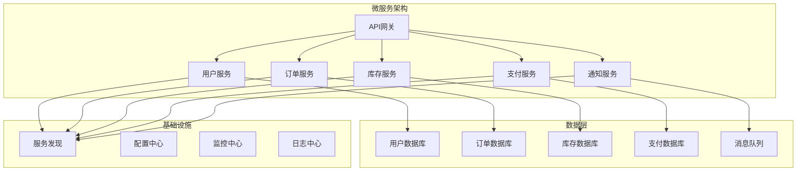

# 微服务架构

## Odoo 17 微服务架构设计

微服务架构是现代企业应用的发展趋势，本文档详细介绍如何在Odoo 17中设计和实现微服务架构。

### 微服务架构概述

#### 架构图


#### 微服务设计原则
```python
# 微服务设计原则
class MicroservicePrinciples:
    """
    微服务设计原则：
    1. 单一职责原则 - 每个服务只负责一个业务功能
    2. 数据隔离 - 每个服务拥有独立的数据存储
    3. 服务自治 - 服务可以独立开发、部署和扩展
    4. 去中心化 - 没有中央数据库或中央服务
    5. 容错设计 - 服务故障不应影响整个系统
    6. 可观测性 - 服务状态和性能可监控
    """
    
    def __init__(self):
        self.principles = [
            "Single Responsibility",
            "Data Isolation", 
            "Service Autonomy",
            "Decentralization",
            "Fault Tolerance",
            "Observability"
        ]
```

### 服务拆分策略

#### 业务域拆分
```python
# 业务域拆分示例
class BusinessDomainSplit:
    """
    基于业务域的服务拆分
    """
    
    def __init__(self):
        self.domains = {
            'user_management': {
                'services': ['user-service', 'auth-service', 'profile-service'],
                'responsibilities': ['用户管理', '身份认证', '用户档案'],
                'data': ['用户数据', '权限数据', '档案数据']
            },
            'order_management': {
                'services': ['order-service', 'cart-service', 'checkout-service'],
                'responsibilities': ['订单管理', '购物车', '结账流程'],
                'data': ['订单数据', '购物车数据', '结账数据']
            },
            'inventory_management': {
                'services': ['product-service', 'stock-service', 'warehouse-service'],
                'responsibilities': ['产品管理', '库存管理', '仓库管理'],
                'data': ['产品数据', '库存数据', '仓库数据']
            },
            'payment_management': {
                'services': ['payment-service', 'billing-service', 'refund-service'],
                'responsibilities': ['支付处理', '账单管理', '退款处理'],
                'data': ['支付数据', '账单数据', '退款数据']
            }
        }
```

#### 数据拆分策略
```python
# 数据拆分策略
class DataSplitStrategy:
    """
    数据拆分策略
    """
    
    def __init__(self):
        self.strategies = {
            'database_per_service': {
                'description': '每个服务独立数据库',
                'advantages': ['数据隔离', '独立扩展', '技术选型灵活'],
                'disadvantages': ['数据一致性复杂', '跨服务查询困难']
            },
            'schema_per_service': {
                'description': '每个服务独立模式',
                'advantages': ['共享基础设施', '简化运维'],
                'disadvantages': ['数据隔离较弱', '扩展性受限']
            },
            'table_per_service': {
                'description': '每个服务独立表',
                'advantages': ['实现简单', '成本较低'],
                'disadvantages': ['数据隔离最弱', '扩展性最差']
            }
        }
```

### 服务间通信

#### 同步通信 - REST API
```python
# REST API 服务间通信
import requests
import json
from typing import Dict, Any

class RESTClient:
    """REST API 客户端"""
    
    def __init__(self, base_url: str, timeout: int = 30):
        self.base_url = base_url
        self.timeout = timeout
        self.session = requests.Session()
    
    def get(self, endpoint: str, params: Dict = None) -> Dict[str, Any]:
        """GET 请求"""
        url = f"{self.base_url}{endpoint}"
        try:
            response = self.session.get(url, params=params, timeout=self.timeout)
            response.raise_for_status()
            return response.json()
        except requests.RequestException as e:
            raise Exception(f"GET request failed: {str(e)}")
    
    def post(self, endpoint: str, data: Dict = None) -> Dict[str, Any]:
        """POST 请求"""
        url = f"{self.base_url}{endpoint}"
        try:
            response = self.session.post(
                url, 
                json=data, 
                headers={'Content-Type': 'application/json'},
                timeout=self.timeout
            )
            response.raise_for_status()
            return response.json()
        except requests.RequestException as e:
            raise Exception(f"POST request failed: {str(e)}")

# 服务间调用示例
class OrderService:
    """订单服务"""
    
    def __init__(self):
        self.user_client = RESTClient("http://user-service:8080")
        self.inventory_client = RESTClient("http://inventory-service:8080")
        self.payment_client = RESTClient("http://payment-service:8080")
    
    def create_order(self, user_id: int, items: list) -> Dict[str, Any]:
        """创建订单"""
        # 验证用户
        user = self.user_client.get(f"/users/{user_id}")
        if not user:
            raise Exception("User not found")
        
        # 检查库存
        for item in items:
            stock = self.inventory_client.get(f"/products/{item['product_id']}/stock")
            if stock['quantity'] < item['quantity']:
                raise Exception(f"Insufficient stock for product {item['product_id']}")
        
        # 创建订单
        order_data = {
            'user_id': user_id,
            'items': items,
            'status': 'pending'
        }
        
        # 处理支付
        payment_result = self.payment_client.post("/payments", {
            'user_id': user_id,
            'amount': self._calculate_total(items),
            'order_id': order_data['id']
        })
        
        if payment_result['status'] == 'success':
            order_data['status'] = 'confirmed'
            # 扣减库存
            for item in items:
                self.inventory_client.post(f"/products/{item['product_id']}/stock", {
                    'action': 'decrease',
                    'quantity': item['quantity']
                })
        
        return order_data
```

#### 异步通信 - 消息队列
```python
# 消息队列异步通信
import pika
import json
from typing import Callable, Dict, Any

class MessageQueue:
    """消息队列客户端"""
    
    def __init__(self, host: str = 'localhost', port: int = 5672):
        self.connection = pika.BlockingConnection(
            pika.ConnectionParameters(host=host, port=port)
        )
        self.channel = self.connection.channel()
    
    def publish(self, exchange: str, routing_key: str, message: Dict[str, Any]):
        """发布消息"""
        self.channel.basic_publish(
            exchange=exchange,
            routing_key=routing_key,
            body=json.dumps(message),
            properties=pika.BasicProperties(
                delivery_mode=2,  # 消息持久化
            )
        )
    
    def subscribe(self, queue: str, callback: Callable):
        """订阅消息"""
        self.channel.queue_declare(queue=queue, durable=True)
        self.channel.basic_consume(
            queue=queue,
            on_message_callback=callback,
            auto_ack=True
        )
        self.channel.start_consuming()

# 事件驱动架构示例
class EventDrivenArchitecture:
    """事件驱动架构"""
    
    def __init__(self):
        self.mq = MessageQueue()
        self.event_handlers = {}
    
    def publish_event(self, event_type: str, data: Dict[str, Any]):
        """发布事件"""
        event = {
            'type': event_type,
            'data': data,
            'timestamp': datetime.now().isoformat()
        }
        self.mq.publish('events', event_type, event)
    
    def subscribe_event(self, event_type: str, handler: Callable):
        """订阅事件"""
        queue_name = f"{event_type}_queue"
        self.event_handlers[event_type] = handler
        
        def callback(ch, method, properties, body):
            event = json.loads(body)
            handler(event)
        
        self.mq.subscribe(queue_name, callback)

# 事件处理器示例
class OrderEventHandler:
    """订单事件处理器"""
    
    def __init__(self):
        self.eda = EventDrivenArchitecture()
        self._register_handlers()
    
    def _register_handlers(self):
        """注册事件处理器"""
        self.eda.subscribe_event('order.created', self.handle_order_created)
        self.eda.subscribe_event('order.cancelled', self.handle_order_cancelled)
        self.eda.subscribe_event('payment.completed', self.handle_payment_completed)
    
    def handle_order_created(self, event: Dict[str, Any]):
        """处理订单创建事件"""
        order_data = event['data']
        
        # 发送确认邮件
        self.eda.publish_event('email.send', {
            'to': order_data['user_email'],
            'template': 'order_confirmation',
            'data': order_data
        })
        
        # 更新库存
        self.eda.publish_event('inventory.reserve', {
            'order_id': order_data['id'],
            'items': order_data['items']
        })
    
    def handle_order_cancelled(self, event: Dict[str, Any]):
        """处理订单取消事件"""
        order_data = event['data']
        
        # 释放库存
        self.eda.publish_event('inventory.release', {
            'order_id': order_data['id'],
            'items': order_data['items']
        })
    
    def handle_payment_completed(self, event: Dict[str, Any]):
        """处理支付完成事件"""
        payment_data = event['data']
        
        # 确认订单
        self.eda.publish_event('order.confirm', {
            'order_id': payment_data['order_id']
        })
```

### 服务发现与配置

#### 服务发现
```python
# 服务发现实现
import consul
from typing import List, Dict, Any

class ServiceDiscovery:
    """服务发现"""
    
    def __init__(self, host: str = 'localhost', port: int = 8500):
        self.consul = consul.Consul(host=host, port=port)
    
    def register_service(self, service_name: str, service_id: str, 
                        address: str, port: int, health_check: str = None):
        """注册服务"""
        self.consul.agent.service.register(
            name=service_name,
            service_id=service_id,
            address=address,
            port=port,
            check=consul.Check.http(health_check) if health_check else None
        )
    
    def discover_service(self, service_name: str) -> List[Dict[str, Any]]:
        """发现服务"""
        services = self.consul.health.service(service_name, passing=True)
        return [
            {
                'id': service['Service']['ID'],
                'address': service['Service']['Address'],
                'port': service['Service']['Port']
            }
            for service in services[1]
        ]
    
    def get_service_url(self, service_name: str) -> str:
        """获取服务URL"""
        services = self.discover_service(service_name)
        if not services:
            raise Exception(f"Service {service_name} not found")
        
        # 简单的负载均衡 - 轮询
        service = services[0]  # 实际应该实现负载均衡算法
        return f"http://{service['address']}:{service['port']}"

# 服务注册示例
class ServiceRegistry:
    """服务注册"""
    
    def __init__(self):
        self.sd = ServiceDiscovery()
    
    def register_user_service(self):
        """注册用户服务"""
        self.sd.register_service(
            service_name='user-service',
            service_id='user-service-1',
            address='user-service',
            port=8080,
            health_check='http://user-service:8080/health'
        )
    
    def register_order_service(self):
        """注册订单服务"""
        self.sd.register_service(
            service_name='order-service',
            service_id='order-service-1',
            address='order-service',
            port=8080,
            health_check='http://order-service:8080/health'
        )
```

#### 配置中心
```python
# 配置中心实现
import etcd3
from typing import Dict, Any

class ConfigCenter:
    """配置中心"""
    
    def __init__(self, host: str = 'localhost', port: int = 2379):
        self.etcd = etcd3.client(host=host, port=port)
    
    def set_config(self, key: str, value: str):
        """设置配置"""
        self.etcd.put(key, value)
    
    def get_config(self, key: str) -> str:
        """获取配置"""
        value, _ = self.etcd.get(key)
        return value.decode('utf-8') if value else None
    
    def watch_config(self, key: str, callback: Callable):
        """监听配置变化"""
        def watch_callback(event):
            callback(event.key.decode('utf-8'), event.value.decode('utf-8'))
        
        self.etcd.add_watch_callback(key, watch_callback)

# 配置管理示例
class ConfigManager:
    """配置管理器"""
    
    def __init__(self):
        self.config_center = ConfigCenter()
        self.configs = {}
        self._load_configs()
    
    def _load_configs(self):
        """加载配置"""
        config_keys = [
            'database.url',
            'redis.url',
            'message_queue.url',
            'log.level'
        ]
        
        for key in config_keys:
            value = self.config_center.get_config(key)
            if value:
                self.configs[key] = value
    
    def get_database_url(self) -> str:
        """获取数据库URL"""
        return self.configs.get('database.url', 'postgresql://localhost:5432/odoo')
    
    def get_redis_url(self) -> str:
        """获取Redis URL"""
        return self.configs.get('redis.url', 'redis://localhost:6379')
    
    def get_log_level(self) -> str:
        """获取日志级别"""
        return self.configs.get('log.level', 'INFO')
```

### 容错与熔断

#### 熔断器模式
```python
# 熔断器实现
import time
from enum import Enum
from typing import Callable, Any

class CircuitState(Enum):
    CLOSED = "closed"      # 正常状态
    OPEN = "open"          # 熔断状态
    HALF_OPEN = "half_open"  # 半开状态

class CircuitBreaker:
    """熔断器"""
    
    def __init__(self, failure_threshold: int = 5, 
                 recovery_timeout: int = 60, 
                 expected_exception: type = Exception):
        self.failure_threshold = failure_threshold
        self.recovery_timeout = recovery_timeout
        self.expected_exception = expected_exception
        
        self.failure_count = 0
        self.last_failure_time = None
        self.state = CircuitState.CLOSED
    
    def call(self, func: Callable, *args, **kwargs) -> Any:
        """调用函数"""
        if self.state == CircuitState.OPEN:
            if self._should_attempt_reset():
                self.state = CircuitState.HALF_OPEN
            else:
                raise Exception("Circuit breaker is OPEN")
        
        try:
            result = func(*args, **kwargs)
            self._on_success()
            return result
        except self.expected_exception as e:
            self._on_failure()
            raise e
    
    def _should_attempt_reset(self) -> bool:
        """是否应该尝试重置"""
        return (time.time() - self.last_failure_time) >= self.recovery_timeout
    
    def _on_success(self):
        """成功回调"""
        self.failure_count = 0
        self.state = CircuitState.CLOSED
    
    def _on_failure(self):
        """失败回调"""
        self.failure_count += 1
        self.last_failure_time = time.time()
        
        if self.failure_count >= self.failure_threshold:
            self.state = CircuitState.OPEN

# 熔断器使用示例
class ResilientService:
    """具有容错能力的服务"""
    
    def __init__(self):
        self.circuit_breaker = CircuitBreaker(
            failure_threshold=3,
            recovery_timeout=30
        )
    
    def call_external_service(self, data: Dict[str, Any]) -> Dict[str, Any]:
        """调用外部服务"""
        def _call():
            # 模拟外部服务调用
            response = requests.post("http://external-service/api", json=data)
            response.raise_for_status()
            return response.json()
        
        try:
            return self.circuit_breaker.call(_call)
        except Exception as e:
            # 降级处理
            return self._fallback_response(data)
    
    def _fallback_response(self, data: Dict[str, Any]) -> Dict[str, Any]:
        """降级响应"""
        return {
            'status': 'fallback',
            'message': 'Service temporarily unavailable',
            'data': data
        }
```

#### 重试机制
```python
# 重试机制实现
import time
import random
from typing import Callable, Any

class RetryPolicy:
    """重试策略"""
    
    def __init__(self, max_attempts: int = 3, 
                 base_delay: float = 1.0, 
                 max_delay: float = 60.0,
                 exponential_base: float = 2.0,
                 jitter: bool = True):
        self.max_attempts = max_attempts
        self.base_delay = base_delay
        self.max_delay = max_delay
        self.exponential_base = exponential_base
        self.jitter = jitter
    
    def execute(self, func: Callable, *args, **kwargs) -> Any:
        """执行函数"""
        last_exception = None
        
        for attempt in range(self.max_attempts):
            try:
                return func(*args, **kwargs)
            except Exception as e:
                last_exception = e
                
                if attempt == self.max_attempts - 1:
                    break
                
                delay = self._calculate_delay(attempt)
                time.sleep(delay)
        
        raise last_exception
    
    def _calculate_delay(self, attempt: int) -> float:
        """计算延迟时间"""
        delay = self.base_delay * (self.exponential_base ** attempt)
        delay = min(delay, self.max_delay)
        
        if self.jitter:
            delay *= (0.5 + random.random() * 0.5)
        
        return delay

# 重试机制使用示例
class RetryableService:
    """支持重试的服务"""
    
    def __init__(self):
        self.retry_policy = RetryPolicy(
            max_attempts=3,
            base_delay=1.0,
            max_delay=10.0
        )
    
    def call_unreliable_service(self, data: Dict[str, Any]) -> Dict[str, Any]:
        """调用不可靠的服务"""
        def _call():
            response = requests.post("http://unreliable-service/api", json=data)
            response.raise_for_status()
            return response.json()
        
        return self.retry_policy.execute(_call)
```

### 监控与日志

#### 分布式追踪
```python
# 分布式追踪实现
import uuid
import time
from typing import Dict, Any, Optional

class TraceContext:
    """追踪上下文"""
    
    def __init__(self, trace_id: str = None, span_id: str = None, 
                 parent_span_id: str = None):
        self.trace_id = trace_id or str(uuid.uuid4())
        self.span_id = span_id or str(uuid.uuid4())
        self.parent_span_id = parent_span_id
        self.start_time = time.time()
        self.tags = {}
    
    def add_tag(self, key: str, value: str):
        """添加标签"""
        self.tags[key] = value
    
    def finish(self):
        """完成追踪"""
        self.duration = time.time() - self.start_time

class Tracer:
    """追踪器"""
    
    def __init__(self):
        self.spans = []
    
    def start_span(self, operation_name: str, 
                   parent_context: Optional[TraceContext] = None) -> TraceContext:
        """开始新的跨度"""
        context = TraceContext(
            trace_id=parent_context.trace_id if parent_context else None,
            parent_span_id=parent_context.span_id if parent_context else None
        )
        context.add_tag('operation.name', operation_name)
        return context
    
    def finish_span(self, context: TraceContext):
        """完成跨度"""
        context.finish()
        self.spans.append(context)
    
    def get_trace(self, trace_id: str) -> list:
        """获取追踪信息"""
        return [span for span in self.spans if span.trace_id == trace_id]

# 追踪使用示例
class TracedService:
    """支持追踪的服务"""
    
    def __init__(self):
        self.tracer = Tracer()
    
    def process_order(self, order_data: Dict[str, Any], 
                     parent_context: Optional[TraceContext] = None) -> Dict[str, Any]:
        """处理订单"""
        span = self.tracer.start_span('process_order', parent_context)
        span.add_tag('order.id', order_data.get('id'))
        
        try:
            # 验证订单
            self._validate_order(order_data, span)
            
            # 处理支付
            self._process_payment(order_data, span)
            
            # 更新库存
            self._update_inventory(order_data, span)
            
            result = {'status': 'success', 'order_id': order_data['id']}
            span.add_tag('result.status', 'success')
            return result
            
        except Exception as e:
            span.add_tag('error', str(e))
            span.add_tag('result.status', 'error')
            raise
        finally:
            self.tracer.finish_span(span)
    
    def _validate_order(self, order_data: Dict[str, Any], span: TraceContext):
        """验证订单"""
        child_span = self.tracer.start_span('validate_order', span)
        try:
            # 验证逻辑
            pass
        finally:
            self.tracer.finish_span(child_span)
    
    def _process_payment(self, order_data: Dict[str, Any], span: TraceContext):
        """处理支付"""
        child_span = self.tracer.start_span('process_payment', span)
        try:
            # 支付逻辑
            pass
        finally:
            self.tracer.finish_span(child_span)
    
    def _update_inventory(self, order_data: Dict[str, Any], span: TraceContext):
        """更新库存"""
        child_span = self.tracer.start_span('update_inventory', span)
        try:
            # 库存更新逻辑
            pass
        finally:
            self.tracer.finish_span(child_span)
```

### 部署与运维

#### Docker 容器化
```dockerfile
# 用户服务 Dockerfile
FROM python:3.10-slim

WORKDIR /app

# 安装依赖
COPY requirements.txt .
RUN pip install -r requirements.txt

# 复制代码
COPY . .

# 暴露端口
EXPOSE 8080

# 健康检查
HEALTHCHECK --interval=30s --timeout=3s --start-period=5s --retries=3 \
    CMD curl -f http://localhost:8080/health || exit 1

# 启动命令
CMD ["python", "app.py"]
```

#### Kubernetes 部署
```yaml
# 用户服务 Kubernetes 部署
apiVersion: apps/v1
kind: Deployment
metadata:
  name: user-service
spec:
  replicas: 3
  selector:
    matchLabels:
      app: user-service
  template:
    metadata:
      labels:
        app: user-service
    spec:
      containers:
      - name: user-service
        image: user-service:latest
        ports:
        - containerPort: 8080
        env:
        - name: DATABASE_URL
          valueFrom:
            configMapKeyRef:
              name: app-config
              key: database.url
        - name: REDIS_URL
          valueFrom:
            configMapKeyRef:
              name: app-config
              key: redis.url
        livenessProbe:
          httpGet:
            path: /health
            port: 8080
          initialDelaySeconds: 30
          periodSeconds: 10
        readinessProbe:
          httpGet:
            path: /ready
            port: 8080
          initialDelaySeconds: 5
          periodSeconds: 5
        resources:
          requests:
            memory: "256Mi"
            cpu: "250m"
          limits:
            memory: "512Mi"
            cpu: "500m"
---
apiVersion: v1
kind: Service
metadata:
  name: user-service
spec:
  selector:
    app: user-service
  ports:
  - port: 8080
    targetPort: 8080
  type: ClusterIP
```

## 相关链接
- [[容器化]] - 容器化部署
- [[负载均衡]] - 负载均衡配置
- [[高可用]] - 高可用架构
- [[云部署]] - 云部署策略
