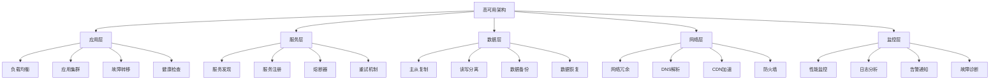

# 高可用架构

## 🎯 学习目标
- 掌握高可用架构的设计原则和实现方法
- 学会构建容错和故障恢复机制
- 理解负载均衡和集群部署策略

## 📊 高可用架构概述

### 高可用概念
高可用性（High Availability, HA）是指系统能够持续稳定运行，在出现故障时能够快速恢复，确保业务连续性。

### 高可用架构层次


## 🔄 负载均衡

### 负载均衡器配置
```python
# models/load_balancer.py
from odoo import models, fields, api
import requests
import time
import random
from odoo.exceptions import UserError

class LoadBalancer(models.Model):
    _name = 'load.balancer'
    _description = '负载均衡器'
    
    name = fields.Char('负载均衡器名称', required=True)
    algorithm = fields.Selection([
        ('round_robin', '轮询'),
        ('weighted_round_robin', '加权轮询'),
        ('least_connections', '最少连接'),
        ('ip_hash', 'IP哈希'),
        ('random', '随机'),
    ], string='负载均衡算法', default='round_robin')
    
    # 后端服务器
    backend_servers = fields.One2many('backend.server', 'balancer_id', string='后端服务器')
    
    # 健康检查配置
    health_check_url = fields.Char('健康检查URL', default='/health')
    health_check_interval = fields.Integer('健康检查间隔(秒)', default=30)
    health_check_timeout = fields.Integer('健康检查超时(秒)', default=5)
    health_check_retries = fields.Integer('健康检查重试次数', default=3)
    
    # 故障转移配置
    failover_enabled = fields.Boolean('启用故障转移', default=True)
    failover_threshold = fields.Integer('故障转移阈值', default=3)
    failover_timeout = fields.Integer('故障转移超时(秒)', default=60)
    
    is_active = fields.Boolean('是否激活', default=True)
    last_health_check = fields.Datetime('最后健康检查时间')
    
    @api.model
    def get_backend_server(self, client_ip=None):
        """获取后端服务器"""
        try:
            # 获取健康的后端服务器
            healthy_servers = self.backend_servers.filtered('is_healthy')
            
            if not healthy_servers:
                raise UserError('没有可用的后端服务器')
            
            # 根据算法选择服务器
            if self.algorithm == 'round_robin':
                return self._round_robin_selection(healthy_servers)
            elif self.algorithm == 'weighted_round_robin':
                return self._weighted_round_robin_selection(healthy_servers)
            elif self.algorithm == 'least_connections':
                return self._least_connections_selection(healthy_servers)
            elif self.algorithm == 'ip_hash':
                return self._ip_hash_selection(healthy_servers, client_ip)
            elif self.algorithm == 'random':
                return self._random_selection(healthy_servers)
            else:
                return healthy_servers[0]
                
        except Exception as e:
            raise UserError(f'获取后端服务器失败: {str(e)}')
    
    def _round_robin_selection(self, servers):
        """轮询选择"""
        # 获取当前轮询索引
        current_index = getattr(self, '_current_index', 0)
        
        # 选择服务器
        selected_server = servers[current_index % len(servers)]
        
        # 更新索引
        self._current_index = (current_index + 1) % len(servers)
        
        return selected_server
    
    def _weighted_round_robin_selection(self, servers):
        """加权轮询选择"""
        # 计算总权重
        total_weight = sum(server.weight for server in servers)
        
        # 获取当前权重
        current_weight = getattr(self, '_current_weight', 0)
        
        # 选择服务器
        for server in servers:
            current_weight += server.weight
            if current_weight >= total_weight:
                self._current_weight = current_weight % total_weight
                return server
        
        return servers[0]
    
    def _least_connections_selection(self, servers):
        """最少连接选择"""
        return min(servers, key=lambda s: s.current_connections)
    
    def _ip_hash_selection(self, servers, client_ip):
        """IP哈希选择"""
        if not client_ip:
            return servers[0]
        
        # 计算IP哈希值
        hash_value = hash(client_ip) % len(servers)
        return servers[hash_value]
    
    def _random_selection(self, servers):
        """随机选择"""
        return random.choice(servers)
    
    @api.model
    def health_check_all(self):
        """健康检查所有服务器"""
        try:
            for server in self.backend_servers:
                server.health_check()
            
            self.last_health_check = fields.Datetime.now()
            
        except Exception as e:
            self._log_error(f'健康检查失败: {str(e)}')
    
    def _log_error(self, message):
        """记录错误日志"""
        self.env['ir.logging'].create({
            'name': 'Load Balancer',
            'type': 'server',
            'dbname': self.env.cr.dbname,
            'level': 'ERROR',
            'message': message,
            'path': 'load_balancer',
            'line': 0,
            'func': 'health_check',
        })

class BackendServer(models.Model):
    _name = 'backend.server'
    _description = '后端服务器'
    
    name = fields.Char('服务器名称', required=True)
    balancer_id = fields.Many2one('load.balancer', string='负载均衡器', required=True)
    url = fields.Char('服务器地址', required=True)
    weight = fields.Integer('权重', default=1)
    max_connections = fields.Integer('最大连接数', default=100)
    current_connections = fields.Integer('当前连接数', default=0)
    
    is_healthy = fields.Boolean('是否健康', default=True)
    health_check_failures = fields.Integer('健康检查失败次数', default=0)
    last_health_check = fields.Datetime('最后健康检查时间')
    last_response_time = fields.Float('最后响应时间(秒)')
    
    is_active = fields.Boolean('是否激活', default=True)
    
    def health_check(self):
        """健康检查"""
        try:
            start_time = time.time()
            
            # 发送健康检查请求
            response = requests.get(
                f"{self.url}{self.balancer_id.health_check_url}",
                timeout=self.balancer_id.health_check_timeout
            )
            
            end_time = time.time()
            response_time = end_time - start_time
            
            # 检查响应状态
            if response.status_code == 200:
                self.is_healthy = True
                self.health_check_failures = 0
                self.last_response_time = response_time
            else:
                self.health_check_failures += 1
                if self.health_check_failures >= self.balancer_id.health_check_retries:
                    self.is_healthy = False
            
            self.last_health_check = fields.Datetime.now()
            
        except Exception as e:
            self.health_check_failures += 1
            if self.health_check_failures >= self.balancer_id.health_check_retries:
                self.is_healthy = False
            
            self._log_error(f'健康检查失败: {str(e)}')
    
    def _log_error(self, message):
        """记录错误日志"""
        self.env['ir.logging'].create({
            'name': 'Backend Server',
            'type': 'server',
            'dbname': self.env.cr.dbname,
            'level': 'ERROR',
            'message': message,
            'path': 'backend_server',
            'line': 0,
            'func': 'health_check',
        })
```

### Nginx负载均衡配置
```nginx
# nginx.conf
upstream odoo_backend {
    # 负载均衡算法
    least_conn;
    
    # 后端服务器
    server 192.168.1.10:8069 weight=3 max_fails=3 fail_timeout=30s;
    server 192.168.1.11:8069 weight=2 max_fails=3 fail_timeout=30s;
    server 192.168.1.12:8069 weight=1 max_fails=3 fail_timeout=30s;
    
    # 健康检查
    health_check;
}

server {
    listen 80;
    server_name odoo.example.com;
    
    # 负载均衡配置
    location / {
        proxy_pass http://odoo_backend;
        proxy_set_header Host $host;
        proxy_set_header X-Real-IP $remote_addr;
        proxy_set_header X-Forwarded-For $proxy_add_x_forwarded_for;
        proxy_set_header X-Forwarded-Proto $scheme;
        
        # 超时配置
        proxy_connect_timeout 30s;
        proxy_send_timeout 30s;
        proxy_read_timeout 30s;
        
        # 缓冲配置
        proxy_buffering on;
        proxy_buffer_size 4k;
        proxy_buffers 8 4k;
        
        # 重试配置
        proxy_next_upstream error timeout invalid_header http_500 http_502 http_503 http_504;
        proxy_next_upstream_tries 3;
        proxy_next_upstream_timeout 10s;
    }
    
    # 健康检查端点
    location /health {
        access_log off;
        return 200 "healthy\n";
        add_header Content-Type text/plain;
    }
    
    # 静态文件缓存
    location ~* \.(css|js|png|jpg|jpeg|gif|ico|svg)$ {
        expires 1y;
        add_header Cache-Control "public, immutable";
        proxy_pass http://odoo_backend;
    }
}
```

## 🔄 故障转移

### 故障转移机制
```python
# models/failover.py
from odoo import models, fields, api
import time
import threading
from odoo.exceptions import UserError

class FailoverManager(models.Model):
    _name = 'failover.manager'
    _description = '故障转移管理器'
    
    name = fields.Char('故障转移名称', required=True)
    primary_server = fields.Many2one('server.node', string='主服务器', required=True)
    backup_servers = fields.One2many('server.node', 'failover_id', string='备份服务器')
    
    # 故障检测配置
    check_interval = fields.Integer('检查间隔(秒)', default=30)
    check_timeout = fields.Integer('检查超时(秒)', default=10)
    failure_threshold = fields.Integer('故障阈值', default=3)
    
    # 故障转移配置
    failover_enabled = fields.Boolean('启用故障转移', default=True)
    failover_timeout = fields.Integer('故障转移超时(秒)', default=60)
    auto_failback = fields.Boolean('自动故障恢复', default=True)
    
    # 状态信息
    current_primary = fields.Many2one('server.node', string='当前主服务器')
    failover_count = fields.Integer('故障转移次数', default=0)
    last_failover = fields.Datetime('最后故障转移时间')
    is_monitoring = fields.Boolean('是否监控中', default=False)
    
    @api.model
    def start_monitoring(self):
        """开始监控"""
        if self.is_monitoring:
            raise UserError('监控已启动')
        
        self.is_monitoring = True
        self.current_primary = self.primary_server
        
        # 启动监控线程
        thread = threading.Thread(target=self._monitoring_thread, daemon=True)
        thread.start()
    
    @api.model
    def stop_monitoring(self):
        """停止监控"""
        self.is_monitoring = False
    
    def _monitoring_thread(self):
        """监控线程"""
        while self.is_monitoring:
            try:
                # 检查主服务器状态
                if not self.current_primary.is_healthy:
                    self._trigger_failover()
                
                # 检查故障恢复
                if self.auto_failback and self.current_primary != self.primary_server:
                    if self.primary_server.is_healthy:
                        self._trigger_failback()
                
                time.sleep(self.check_interval)
                
            except Exception as e:
                self._log_error(f'监控线程错误: {str(e)}')
                time.sleep(self.check_interval)
    
    def _trigger_failover(self):
        """触发故障转移"""
        try:
            # 查找可用的备份服务器
            available_backups = self.backend_servers.filtered('is_healthy')
            
            if not available_backups:
                self._log_error('没有可用的备份服务器')
                return
            
            # 选择备份服务器
            backup_server = available_backups[0]
            
            # 执行故障转移
            self._execute_failover(backup_server)
            
            # 更新状态
            self.current_primary = backup_server
            self.failover_count += 1
            self.last_failover = fields.Datetime.now()
            
            # 发送通知
            self._send_failover_notification(backup_server)
            
        except Exception as e:
            self._log_error(f'故障转移失败: {str(e)}')
    
    def _trigger_failback(self):
        """触发故障恢复"""
        try:
            # 执行故障恢复
            self._execute_failover(self.primary_server)
            
            # 更新状态
            self.current_primary = self.primary_server
            
            # 发送通知
            self._send_failback_notification()
            
        except Exception as e:
            self._log_error(f'故障恢复失败: {str(e)}')
    
    def _execute_failover(self, target_server):
        """执行故障转移"""
        try:
            # 停止当前主服务器服务
            if self.current_primary:
                self.current_primary.stop_service()
            
            # 启动目标服务器服务
            target_server.start_service()
            
            # 等待服务启动
            time.sleep(10)
            
            # 验证服务状态
            if not target_server.is_healthy:
                raise UserError('目标服务器启动失败')
            
        except Exception as e:
            raise UserError(f'执行故障转移失败: {str(e)}')
    
    def _send_failover_notification(self, backup_server):
        """发送故障转移通知"""
        try:
            # 发送邮件通知
            mail_values = {
                'subject': f'故障转移通知 - {self.name}',
                'body_html': f'''
                <p>系统发生故障转移：</p>
                <ul>
                    <li>故障转移时间: {fields.Datetime.now()}</li>
                    <li>原主服务器: {self.primary_server.name}</li>
                    <li>新主服务器: {backup_server.name}</li>
                    <li>故障转移次数: {self.failover_count}</li>
                </ul>
                ''',
                'email_to': self._get_admin_emails(),
                'email_from': self.env.user.email,
            }
            
            mail = self.env['mail.mail'].create(mail_values)
            mail.send()
            
        except Exception as e:
            self._log_error(f'发送故障转移通知失败: {str(e)}')
    
    def _send_failback_notification(self):
        """发送故障恢复通知"""
        try:
            # 发送邮件通知
            mail_values = {
                'subject': f'故障恢复通知 - {self.name}',
                'body_html': f'''
                <p>系统已恢复正常：</p>
                <ul>
                    <li>恢复时间: {fields.Datetime.now()}</li>
                    <li>当前主服务器: {self.primary_server.name}</li>
                </ul>
                ''',
                'email_to': self._get_admin_emails(),
                'email_from': self.env.user.email,
            }
            
            mail = self.env['mail.mail'].create(mail_values)
            mail.send()
            
        except Exception as e:
            self._log_error(f'发送故障恢复通知失败: {str(e)}')
    
    def _get_admin_emails(self):
        """获取管理员邮箱"""
        admin_users = self.env['res.users'].search([
            ('groups_id', 'in', self.env.ref('base.group_system').id)
        ])
        return ','.join(admin_users.mapped('email'))
    
    def _log_error(self, message):
        """记录错误日志"""
        self.env['ir.logging'].create({
            'name': 'Failover Manager',
            'type': 'server',
            'dbname': self.env.cr.dbname,
            'level': 'ERROR',
            'message': message,
            'path': 'failover',
            'line': 0,
            'func': 'monitoring',
        })

class ServerNode(models.Model):
    _name = 'server.node'
    _description = '服务器节点'
    
    name = fields.Char('服务器名称', required=True)
    failover_id = fields.Many2one('failover.manager', string='故障转移管理器')
    ip_address = fields.Char('IP地址', required=True)
    port = fields.Integer('端口', default=8069)
    username = fields.Char('用户名')
    password = fields.Char('密码')
    
    is_healthy = fields.Boolean('是否健康', default=True)
    health_check_failures = fields.Integer('健康检查失败次数', default=0)
    last_health_check = fields.Datetime('最后健康检查时间')
    last_response_time = fields.Float('最后响应时间(秒)')
    
    is_active = fields.Boolean('是否激活', default=True)
    
    def health_check(self):
        """健康检查"""
        try:
            import requests
            
            start_time = time.time()
            
            # 发送健康检查请求
            response = requests.get(
                f"http://{self.ip_address}:{self.port}/web/health",
                timeout=10
            )
            
            end_time = time.time()
            response_time = end_time - start_time
            
            # 检查响应状态
            if response.status_code == 200:
                self.is_healthy = True
                self.health_check_failures = 0
                self.last_response_time = response_time
            else:
                self.health_check_failures += 1
                if self.health_check_failures >= 3:
                    self.is_healthy = False
            
            self.last_health_check = fields.Datetime.now()
            
        except Exception as e:
            self.health_check_failures += 1
            if self.health_check_failures >= 3:
                self.is_healthy = False
            
            self._log_error(f'健康检查失败: {str(e)}')
    
    def start_service(self):
        """启动服务"""
        try:
            # 这里可以调用实际的启动命令
            # 例如：systemctl start odoo
            pass
            
        except Exception as e:
            self._log_error(f'启动服务失败: {str(e)}')
    
    def stop_service(self):
        """停止服务"""
        try:
            # 这里可以调用实际的停止命令
            # 例如：systemctl stop odoo
            pass
            
        except Exception as e:
            self._log_error(f'停止服务失败: {str(e)}')
    
    def _log_error(self, message):
        """记录错误日志"""
        self.env['ir.logging'].create({
            'name': 'Server Node',
            'type': 'server',
            'dbname': self.env.cr.dbname,
            'level': 'ERROR',
            'message': message,
            'path': 'server_node',
            'line': 0,
            'func': 'health_check',
        })
```

## 📊 数据层高可用

### 数据库主从复制
```python
# models/database_replication.py
from odoo import models, fields, api
import psycopg2
from odoo.exceptions import UserError

class DatabaseReplication(models.Model):
    _name = 'database.replication'
    _description = '数据库复制'
    
    name = fields.Char('复制名称', required=True)
    master_database = fields.Many2one('database.connection', string='主数据库', required=True)
    slave_databases = fields.One2many('database.connection', 'replication_id', string='从数据库')
    
    # 复制配置
    replication_method = fields.Selection([
        ('streaming', '流复制'),
        ('log_shipping', '日志传送'),
        ('trigger_based', '基于触发器'),
    ], string='复制方法', default='streaming')
    
    # 同步配置
    sync_interval = fields.Integer('同步间隔(秒)', default=60)
    sync_timeout = fields.Integer('同步超时(秒)', default=300)
    max_lag = fields.Integer('最大延迟(秒)', default=30)
    
    # 故障转移配置
    failover_enabled = fields.Boolean('启用故障转移', default=True)
    auto_promote = fields.Boolean('自动提升', default=True)
    
    # 状态信息
    is_active = fields.Boolean('是否激活', default=True)
    last_sync = fields.Datetime('最后同步时间')
    sync_status = fields.Selection([
        ('syncing', '同步中'),
        ('synced', '已同步'),
        ('error', '错误'),
        ('stopped', '已停止'),
    ], string='同步状态', default='stopped')
    
    @api.model
    def start_replication(self):
        """启动复制"""
        try:
            # 配置主数据库
            self._configure_master()
            
            # 配置从数据库
            for slave in self.slave_databases:
                self._configure_slave(slave)
            
            # 启动复制
            self._start_replication_process()
            
            self.is_active = True
            self.sync_status = 'syncing'
            
        except Exception as e:
            raise UserError(f'启动复制失败: {str(e)}')
    
    @api.model
    def stop_replication(self):
        """停止复制"""
        try:
            # 停止复制进程
            self._stop_replication_process()
            
            self.is_active = False
            self.sync_status = 'stopped'
            
        except Exception as e:
            raise UserError(f'停止复制失败: {str(e)}')
    
    def _configure_master(self):
        """配置主数据库"""
        try:
            # 连接主数据库
            conn = psycopg2.connect(
                host=self.master_database.host,
                port=self.master_database.port,
                database=self.master_database.database,
                user=self.master_database.username,
                password=self.master_database.password
            )
            
            cursor = conn.cursor()
            
            # 启用WAL归档
            cursor.execute("ALTER SYSTEM SET wal_level = 'replica';")
            cursor.execute("ALTER SYSTEM SET max_wal_senders = 10;")
            cursor.execute("ALTER SYSTEM SET wal_keep_segments = 64;")
            cursor.execute("ALTER SYSTEM SET archive_mode = 'on';")
            cursor.execute("ALTER SYSTEM SET archive_command = 'test ! -f /var/lib/postgresql/archive/%f && cp %p /var/lib/postgresql/archive/%f';")
            
            # 创建复制用户
            cursor.execute("CREATE USER replication_user WITH REPLICATION ENCRYPTED PASSWORD 'replication_password';")
            
            # 重新加载配置
            cursor.execute("SELECT pg_reload_conf();")
            
            conn.commit()
            cursor.close()
            conn.close()
            
        except Exception as e:
            raise UserError(f'配置主数据库失败: {str(e)}')
    
    def _configure_slave(self, slave):
        """配置从数据库"""
        try:
            # 连接从数据库
            conn = psycopg2.connect(
                host=slave.host,
                port=slave.port,
                database=slave.database,
                user=slave.username,
                password=slave.password
            )
            
            cursor = conn.cursor()
            
            # 创建恢复配置
            recovery_conf = f"""
            standby_mode = 'on'
            primary_conninfo = 'host={self.master_database.host} port={self.master_database.port} user=replication_user password=replication_password'
            trigger_file = '/tmp/postgresql.trigger'
            """
            
            # 写入恢复配置
            with open('/var/lib/postgresql/recovery.conf', 'w') as f:
                f.write(recovery_conf)
            
            conn.commit()
            cursor.close()
            conn.close()
            
        except Exception as e:
            raise UserError(f'配置从数据库失败: {str(e)}')
    
    def _start_replication_process(self):
        """启动复制进程"""
        try:
            # 这里可以启动实际的复制进程
            # 例如：pg_basebackup, pg_receivewal等
            pass
            
        except Exception as e:
            raise UserError(f'启动复制进程失败: {str(e)}')
    
    def _stop_replication_process(self):
        """停止复制进程"""
        try:
            # 这里可以停止实际的复制进程
            pass
            
        except Exception as e:
            raise UserError(f'停止复制进程失败: {str(e)}')
    
    @api.model
    def check_replication_status(self):
        """检查复制状态"""
        try:
            for slave in self.slave_databases:
                # 检查复制延迟
                lag = self._get_replication_lag(slave)
                
                if lag > self.max_lag:
                    self._log_warning(f'从数据库 {slave.name} 复制延迟过大: {lag}秒')
                
                # 检查复制状态
                status = self._get_replication_status(slave)
                slave.replication_status = status
            
            self.last_sync = fields.Datetime.now()
            
        except Exception as e:
            self._log_error(f'检查复制状态失败: {str(e)}')
    
    def _get_replication_lag(self, slave):
        """获取复制延迟"""
        try:
            # 连接从数据库
            conn = psycopg2.connect(
                host=slave.host,
                port=slave.port,
                database=slave.database,
                user=slave.username,
                password=slave.password
            )
            
            cursor = conn.cursor()
            
            # 查询复制延迟
            cursor.execute("""
                SELECT EXTRACT(EPOCH FROM (now() - pg_last_xact_replay_timestamp())) as lag;
            """)
            
            result = cursor.fetchone()
            lag = result[0] if result else 0
            
            cursor.close()
            conn.close()
            
            return lag
            
        except Exception as e:
            self._log_error(f'获取复制延迟失败: {str(e)}')
            return 0
    
    def _get_replication_status(self, slave):
        """获取复制状态"""
        try:
            # 连接从数据库
            conn = psycopg2.connect(
                host=slave.host,
                port=slave.port,
                database=slave.database,
                user=slave.username,
                password=slave.password
            )
            
            cursor = conn.cursor()
            
            # 查询复制状态
            cursor.execute("""
                SELECT pg_is_in_recovery();
            """)
            
            result = cursor.fetchone()
            is_recovering = result[0] if result else False
            
            cursor.close()
            conn.close()
            
            return 'recovering' if is_recovering else 'active'
            
        except Exception as e:
            self._log_error(f'获取复制状态失败: {str(e)}')
            return 'error'
    
    def _log_error(self, message):
        """记录错误日志"""
        self.env['ir.logging'].create({
            'name': 'Database Replication',
            'type': 'server',
            'dbname': self.env.cr.dbname,
            'level': 'ERROR',
            'message': message,
            'path': 'database_replication',
            'line': 0,
            'func': 'replication',
        })
    
    def _log_warning(self, message):
        """记录警告日志"""
        self.env['ir.logging'].create({
            'name': 'Database Replication',
            'type': 'server',
            'dbname': self.env.cr.dbname,
            'level': 'WARNING',
            'message': message,
            'path': 'database_replication',
            'line': 0,
            'func': 'replication',
        })

class DatabaseConnection(models.Model):
    _name = 'database.connection'
    _description = '数据库连接'
    
    name = fields.Char('连接名称', required=True)
    replication_id = fields.Many2one('database.replication', string='数据库复制')
    host = fields.Char('主机地址', required=True)
    port = fields.Integer('端口', default=5432)
    database = fields.Char('数据库名', required=True)
    username = fields.Char('用户名', required=True)
    password = fields.Char('密码', required=True)
    
    replication_status = fields.Selection([
        ('active', '活跃'),
        ('recovering', '恢复中'),
        ('error', '错误'),
        ('stopped', '已停止'),
    ], string='复制状态', default='stopped')
    
    is_active = fields.Boolean('是否激活', default=True)
```

## 🔗 相关链接

### 下一步学习
- [[微服务与Odoo]] - 学习微服务与Odoo
- [[安全架构设计]] - 了解安全架构设计
- [[性能监控系统]] - 掌握性能监控系统

### 实践建议
- 多练习高可用架构设计
- 熟悉负载均衡和故障转移
- 掌握数据库复制技术

## 📝 思考题

### 基础理解
1. 高可用架构的基本原理是什么？
2. 负载均衡的作用是什么？
3. 故障转移的机制是什么？

### 深入思考
1. 如何设计高效的高可用架构？
2. 复杂系统如何优化高可用性？
3. 如何实现高可用架构的监控？

---

**学习进度**: ✅ 已完成  
**下一步**: [[微服务与Odoo]]
