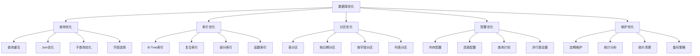

# 数据库优化

## 🎯 学习目标
- 掌握数据库性能优化的基本原理和方法
- 学会设计和优化数据库查询
- 理解索引、分区和定期维护的重要性

## 📊 数据库性能基础

### 性能指标
数据库性能优化的核心目标是提高查询响应时间、减少资源消耗和确保系统稳定性。

### 性能优化层次


## 🔍 查询优化基础

### 慢查询分析
```python
# 慢查询分析方法
import time
import logging
from contextlib import contextmanager

class DatabaseOptimizer:
    """数据库优化器"""
    
    def __init__(self, cr):
        self.cr = cr
        self.logger = logging.getLogger(__name__)
    
    @contextmanager
    def query_timer(self, query_name=""):
        """查询计时器上下文管理器"""
        start_time = time.time()
        try:
            yield
        finally:
            duration = time.time() - start_time
            if duration > 1.0:  # 超过1秒的查询
                self.logger.warning(f"慢查询 {query_name}: {duration:.2f}秒")
    
    def analyze_query(self, sql):
        """分析查询性能"""
        with self.query_timer("查询分析"):
            # 获取查询计划
            self.cr.execute(f"EXPLAIN ANALYZE {sql}")
            return self.cr.fetchall()
```

### ORM查询优化模式
```python
# models/sale_order_optimized.py
from odoo import models, fields, api

class SaleOrderOptimized(models.Model):
    _inherit = 'sale.order'
    
    @api.model
    def optimized_search(self, domain, limit=None, offset=0):
        """优化的搜索方法"""
        try:
            # 对于复杂查询，使用原始SQL
            if len(domain) > 4:
                sql = self._build_optimized_sql(domain, limit, offset)
                self.env.cr.execute(sql)
                return self.browse([row[0] for row in self.env.cr.fetchall()])
            
            # 简单查询使用ORM
            return self.search(domain, limit=limit, offset=offset)
            
        except Exception:
            # 备选方案：降级到标准ORM
            return self.search(domain, limit=limit, offset=offset)
    
    def _build_optimized_sql(self, domain, limit, offset):
        """构建优化的SQL查询"""
        # 简化的SQL构建示例
        sql = """
            SELECT DISTINCT so.id 
            FROM sale_order so
            LEFT JOIN res_partner rp ON so.partner_id = rp.id
        """
        
        # 添加WHERE条件
        where_conditions = self._domain_to_where(domain)
        if where_conditions:
            sql += f" WHERE {where_conditions}"
        
        # 添加排序
        sql += " ORDER BY so.id DESC"
        
        # 添加分页
        if limit:
            sql += f" LIMIT {limit} OFFSET {offset}"
        
        return sql
    
    def _domain_to_where(self, domain):
        """将domain转换为WHERE子句"""
        conditions = []
        for condition in domain:
            if isinstance(condition, tuple) and len(condition) == 3:
                field, operator, value = condition
                condition_sql = self._condition_to_sql(field, operator, value)
                if condition_sql:
                    conditions.append(condition_sql)
        
        return ' AND '.join(conditions) if conditions else None
    
    def _condition_to_sql(self, field, operator, value):
        """将单个条件转换为SQL"""
        field_mapping = {
            'partner_id': 'so.partner_id',
            'state': 'so.state',
            'date_order': 'so.date_order',
            'amount_total': 'so.amount_total',
        }
        
        sql_field = field_mapping.get(field, f"so.{field}")
        
        if operator == '=':
            return f"{sql_field} = {self._format_value(value)}"
        elif operator == '!=':
            return f"{sql_field} != {self._format_value(value)}"
        elif operator == '>':
            return f"{sql_field} > {self._format_value(value)}"
        elif operator == '<':
            return f"{sql_field} < {self._format_value(value)}"
        elif operator == 'in':
            values = ', '.join([str(self._format_value(v)) for v in value])
            return f"{sql_field} IN ({values})"
        elif operator == 'ilike':
            return f"{sql_field} ILIKE '%{value}%'"
        
        return None
    
    def _format_value(self, value):
        """格式化值"""
        if isinstance(value, str):
            return f"'{value}'"
        elif isinstance(value, (list, tuple)):
            return tuple(value)
        else:
            return str(value)
```

### 批量操作优化
```python
# models/batch_operations.py
from odoo import models, fields, api

class BatchOperations(models.Model):
    _name = 'batch.operations'
    _description = '批量操作优化'
    
    @api.model
    def batch_create_orders(self, order_data_list, batch_size=100):
        """批量创建订单"""
        created_orders = []
        
        for i in range(0, len(order_data_list), batch_size):
            batch = order_data_list[i:i + batch_size]
            
            # 准备批量数据
            prepared_data = [self._prepare_order_data(data) for data in batch]
            
            # 创建订单
            batch_orders = self.env['sale.order'].create(prepared_data)
            created_orders.extend(batch_orders)
            
            # 每1000条记录清理一次缓存
            if len(created_orders) % 1000 == 0:
                self.env.cache.invalidate()
                self.env.cr.commit()
        
        return created_orders
    
    def _prepare_order_data(self, data):
        """准备订单数据"""
        return {
            'partner_id': data.get('partner_id'),
            'date_order': data.get('date_order', fields.Datetime.now()),
            'note': data.get('note', ''),
            'state': 'draft',
        }
    
    @api.model
    def batch_update_prices(self, price_updates):
        """批量更新价格"""
        # 使用SQL进行批量更新以提高性能
        if not price_updates:
            return
        
        # 构建批量更新SQL
        update_clauses = []
        product_ids = []
        
        for update in price_updates:
            update_clauses.append(f"WHEN id = {update['product_id']} THEN {update['new_price']}")
            product_ids.append(str(update['product_id']))
        
        sql = f"""
            UPDATE product_product 
            SET list_price = CASE 
                {' '.join(update_clauses)}
                ELSE list_price 
            END
            WHERE id IN ({', '.join(product_ids)})
        """
        
        self.env.cr.execute(sql)
        self.env.cr.commit()
    
    @api.model
    def efficient_read_group(self, domain, fields, groupby, having_clause=None):
        """高效的分组读取"""
        try:
            # 构建优化的GROUP BY查询
            sql = self._build_groupby_sql(domain, fields, groupby, having_clause)
            self.env.cr.execute(sql)
            
            # 获取结果并转换为标准格式
            raw_results = self.env.cr.fetchall()
            columns = [desc[0] for desc in self.env.cr.description]
            
            results = []
            for row in raw_results:
                result_dict = dict(zip(columns, row))
                results.append(result_dict)
            
            return results
            
        except Exception as e:
            # 备选方案：使用Odoo的read_group
            return self.env['sale.order'].read_group(
                domain,
                fields=fields,
                groupby=groupby
            )
    
    def _build_groupby_sql(self, domain, fields, groupby, having_clause=None):
        """构建GROUP BY查询SQL"""
        # 构建SELECT字段
        select_fields = []
        
        # 添加分组字段
        for gb_field in groupby:
            select_fields.append(f"so.{gb_field} as {gb_field}")
        
        # 添加聚合字段
        for field in fields:
            if field.get('aggregate') == 'count':
                select_fields.append(f"COUNT(*) as {field['name']}_count")
            elif field.get('aggregate') == 'sum':
                select_fields.append(f"SUM(so.{field['name']}) as {field['name']}_sum")
            elif field.get('aggregate') == 'avg':
                select_fields.append(f"AVG(so.{field['name']}) as {field['name']}_avg")
        
        sql = f"""
            SELECT {', '.join(select_fields)}
            FROM sale_order so
        """
        
        # 添加WHERE条件
        where_conditions = self._domain_to_where(domain)
        if where_conditions:
            sql += f" WHERE {where_conditions}"
        
        # 添加GROUP BY
        groupby_fields = [f"so.{gb_field}" for gb_field in groupby]
        sql += f" GROUP BY {', '.join(groupby_fields)}"
        
        # 添加HAVING条件
        if having_clause:
            sql += f" HAVING {having_clause}"
        
        return sql
```

## 📇 索引优化策略

### 索引设计原则
```python
# models/index_strategy.py
from odoo import models, fields, api

class IndexStrategy(models.Model):
    _name = 'index.strategy'
    _description = '索引策略'
    
    name = fields.Char('策略名称', required=True)
    table_name = fields.Char('表名', required=True)
    index_type = fields.Selection([
        ('single', '单列索引'),
        ('composite', '复合索引'),
        ('partial', '部分索引'),
        ('functional', '函数索引'),
    ], string='索引类型', required=True)
    
    columns = fields.Char('索引列', required=True)
    conditions = fields.Text('部分索引条件')
    usage_frequency = fields.Selection([
        ('high', '高频使用'),
        ('medium', '中频使用'),
        ('low', '低频使用'),
    ], string='使用频率', default='medium')
    
    @api.model
    def create_optimized_index(self):
        """创建优化索引"""
        try:
            sql = self._build_index_sql()
            
            # 执行创建索引
            self.env.cr.execute(sql)
            self.env.cr.commit()
            
            return {
                'success': True,
                'message': '索引创建成功',
                'sql': sql
            }
            
        except Exception as e:
            return {
                'success': False,
                'error': str(e)
            }
    
    def _build_index_sql(self):
        """构建索引创建SQL"""
        index_name = f"idx_{self.table_name}_{self.columns.replace(',', '_')}"
        
        if self.index_type == 'partial' and self.conditions:
            return f"CREATE INDEX {index_name} ON {self.table_name} ({self.columns}) WHERE {self.conditions}"
        elif self.index_type == 'functional':
            return f"CREATE INDEX {index_name} ON {self.table_name} ({self.columns})"
        else:
            return f"CREATE INDEX {index_name} ON {self.table_name} ({self.columns})"
```

### 索引维护和监控
```python
# models/index_maintenance.py
from odoo import models, fields, api

class IndexMaintenance(models.Model):
    _name = 'index.maintenance'
    _description = '索引维护'
    
    @api.model
    def analyze_index_bloat(self):
        """分析索引膨胀"""
        sql = """
            SELECT 
                schemaname,
                tablename,
                indexname,
                pg_size_pretty(pg_relation_size(indexname::regclass)) as size,
                idx_scan,
                idx_tup_read,
                idx_tup_fetch
            FROM pg_stat_user_indexes 
            ORDER BY pg_relation_size(indexname::regclass) DESC
            LIMIT 20
        """
        
        self.env.cr.execute(sql)
        return self.env.cr.fetchall()
    
    @api.model
    def rebuild_index(self, index_name):
        """重建索引"""
        try:
            sql = f"REINDEX INDEX {index_name}"
            self.env.cr.execute(sql)
            self.env.cr.commit()
            
            return {
                'success': True,
                'message': f'索引 {index_name} 重建成功'
            }
            
        except Exception as e:
            return {
                'success': False,
                'error': str(e)
            }
    
    @api.model
    def update_table_statistics(self):
        """更新表统计信息"""
        tables = ['res_partner', 'sale_order', 'sale_order_line', 'product_product']
        
        try:
            for table in tables:
                sql = f"ANALYZE {table}"
                self.env.cr.execute(sql)
            
            self.env.cr.commit()
            
            return {
                'success': True,
                'message': '表统计信息更新成功'
            }
            
        except Exception as e:
            return {
                'success': False,
                'error': str(e)
            }
```

## 📊 表分区优化

### 分区策略
```python
# models/table_partitioning.py
from odoo import models, fields, api

class TablePartitioning(models.Model):
    _name = 'table.partitioning'
    _description = '表分区'
    
    name = fields.Char('分区名称', required=True)
    table_name = fields.Char('主表名', required=True)
    partition_type = fields.Selection([
        ('range', '范围分区'),
        ('list', '列表分区'),
        ('hash', '哈希分区'),
    ], string='分区类型', required=True)
    
    partition_column = fields.Char('分区列', required=True)
    partition_definition = fields.Text('分区定义')
    
    @api.model
    def create_partitioned_table(self):
        """创建分区表"""
        if self.partition_type == 'range':
            return self._create_range_partition()
        elif self.partition_type == 'list':
            return self._create_list_partition()
        elif self.partition_type == 'hash':
            return self._create_hash_partition()
    
    def _create_range_partition(self):
        """创建范围分区"""
        sql = f"""
            CREATE TABLE {self.table_name}_partitioned (
                LIKE {self.table_name} INCLUDING ALL
            ) PARTITION BY RANGE ({self.partition_column});
        """
        
        # 创建分区
        partitions = self._parse_partition_definitions()
        for partition in partitions:
            partition_sql = f"""
                CREATE TABLE {self.table_name}_{partition['name']} 
                PARTITION OF {self.table_name}_partitioned
                FOR VALUES FROM ('{partition['from']}') TO ('{partition['to']}');
            """
            self.env.cr.execute(sql + partition_sql)
        
        self.env.cr.commit()
    
    def _create_list_partition(self):
        """创建列表分区"""
        partitions = self._parse_partition_definitions()
        
        sql = f"""
            CREATE TABLE {self.table_name}_partitioned (
                LIKE {self.table_name} INCLUDING ALL
            ) PARTITION BY LIST ({self.partition_column});
        """
        
        for partition in partitions:
            values = "', '".join(partition['values'])
            partition_sql = f"""
                CREATE TABLE {self.table_name}_{partition['name']} 
                PARTITION OF {self.table_name}_partitioned
                FOR VALUES IN ('{values}');
            """
            self.env.cr.execute(sql + partition_sql)
        
        self.env.cr.commit()
    
    def _parse_partition_definitions(self):
        """解析分区定义"""
        # 这是一个示例实现
        return [
            {
                'name': 'q1',
                'from': '2024-01-01',
                'to': '2024-04-01'
            },
            {
                'name': 'q2',
                'from': '2024-04-01',
                'to': '2024-07-01'
            }
        ]
```

## 🔧 数据库配置优化

### PostgreSQL优化配置
```python
# models/db_configuration.py
from odoo import models, fields, api

class DatabaseConfiguration(models.Model):
    _name = 'database.configuration'
    _description = '数据库配置'
    
    name = fields.Char('配置名称', required=True)
    
    # 内存配置
    shared_buffers = fields.Integer('共享缓冲区(MB)', default=256)
    work_mem = fields.Integer('工作内存(MB)', default=4)
    maintenance_work_mem = fields.Integer('维护工作内存(MB)', default=64)
    effective_cache_size = fields.Integer('有效缓存大小(MB)', default=1024)
    
    # 连接配置
    max_connections = fields.Integer('最大连接数', default=100)
    max_prepared_transactions = fields.Integer('最大预准备事务', default=0)
    
    # 查询优化配置
    random_page_cost = fields.Float('随机页面成本', default=4.0)
    effective_io_concurrency = fields.Integer('有效IO并发数', default=1)
    
    @api.model
    def apply_configuration(self):
        """应用数据库配置"""
        config_sql = [
            f"ALTER SYSTEM SET shared_buffers = '{self.shared_buffers}MB'",
            f"ALTER SYSTEM SET work_mem = '{self.work_mem}MB'",
            f"ALTER SYSTEM SET maintenance_work_mem = '{self.maintenance_work_mem}MB'",
            f"ALTER SYSTEM SET effective_cache_size = '{self.effective_cache_size}MB'",
            f"ALTER SYSTEM SET random_page_cost = {self.random_page_cost}",
            f"ALTER SYSTEM SET effective_io_concurrency = {self.effective_io_concurrency}",
        ]
        
        try:
            for sql in config_sql:
                self.env.cr.execute(sql)
            
            # 重新加载配置
            self.env.cr.execute("SELECT pg_reload_conf()")
            self.env.cr.commit()
            
            return {
                'success': True,
                'message': '数据库配置应用成功'
            }
            
        except Exception as e:
            return {
                'success': False,
                'error': str(e)
            }
```

## 📈 性能监控

### 性能指标收集
```python
# models/performance_monitoring.py
from odoo import models, fields, api
import psutil
import time

class PerformanceMonitoring(models.Model):
    _name = 'performance.monitoring'
    _description = '性能监控'
    
    @api.model
    def collect_database_stats(self):
        """收集数据库统计信息"""
        stats = {}
        
        try:
            # 数据库大小
            size_query = "SELECT pg_database_size(current_database())"
            self.env.cr.execute(size_query)
            stats['database_size'] = self.env.cr.fetchone()[0]
            
            # 连接数
            conn_query = """
                SELECT count(*) FROM pg_stat_activity 
                WHERE state = 'active'
            """
            self.env.cr.execute(conn_query)
            stats['active_connections'] = self.env.cr.fetchone()[0]
            
            # 缓存命中率
            cache_query = """
                SELECT 
                    round((sum(blks_hit) / sum(blks_hit + blks_read)) * 100, 2) 
                FROM pg_stat_database 
                WHERE datname = current_database()
            """
            self.env.cr.execute(cache_query)
            cache_hit_rate = self.env.cr.fetchone()[0]
            stats['cache_hit_rate'] = cache_hit_rate if cache_hit_rate else 0
            
            # 慢查询
            slow_query_query = """
                SELECT COUNT(*) FROM pg_stat_statements 
                WHERE mean_exec_time > 1000
            """
            try:
                self.env.cr.execute(slow_query_query)
                stats['slow_queries'] = self.env.cr.fetchone()[0]
            except:
                stats['slow_queries'] = 0
            
            return {
                'success': True,
                'timestamp': fields.Datetime.now(),
                'stats': stats
            }
            
        except Exception as e:
            return {
                'success': False,
                'error': str(e)
            }
    
    @api.model
    def collect_system_stats(self):
        """收集系统统计信息"""
        stats = {
            'cpu_percent': psutil.cpu_percent(),
            'memory_percent': psutil.virtual_memory().percent,
            'disk_usage': psutil.disk_usage('/').percent,
            'load_average': psutil.getloadavg()[0] if hasattr(psutil, 'getloadavg') else 0,
        }
        
        return {
            'success': True,
            'timestamp': fields.Datetime.now(),
            'stats': stats
        }
```

## 🔗 相关链接

### 下一步学习
- [[代码性能调优]] - 学习代码性能调优
- [[缓存机制与优化]] - 了解缓存机制与优化
- [[数据库运维]] - 掌握数据库运维

### 实践建议
- 多练习数据库查询优化
- 熟悉索引设计和维护
- 掌握性能监控技术

## 📝 思考题

### 基础理解
1. 数据库优化的主要方面有哪些？
2. 索引的作用和设计原则是什么？
3. 分区表的优势是什么？

### 深入思考
1. 如何设计高效的索引策略？
2. 复杂查询如何优化性能？
3. 如何实现数据库的自动化维护？

---

**学习进度**: ✅ 已完成  
**下一步**: [[代码性能调优]]