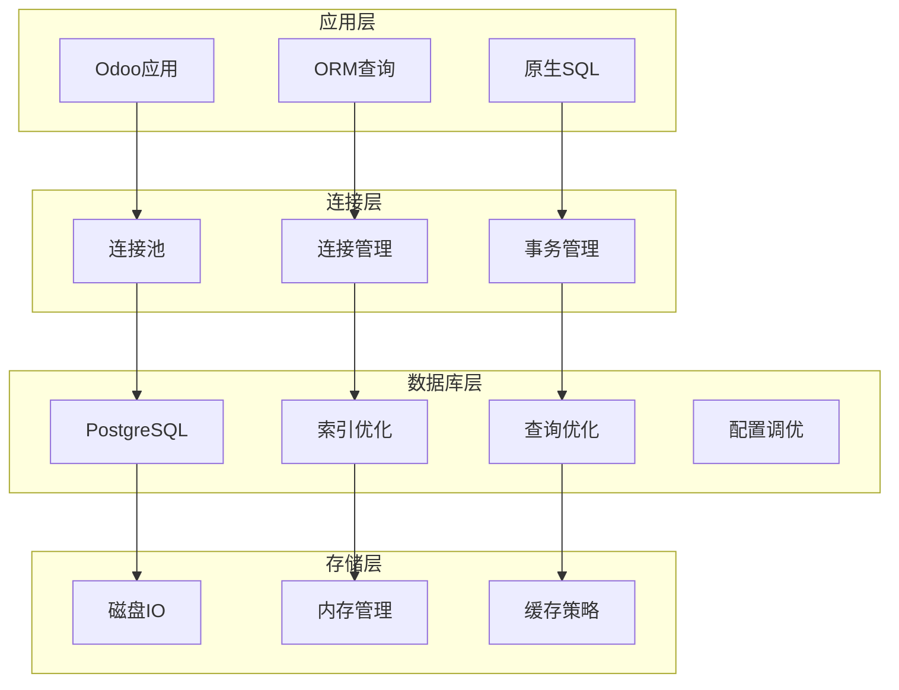

# 数据库优化

## 数据库优化概述

在Odoo 17中，数据库优化是提升系统性能的关键。通过合理的索引设计、查询优化、连接池管理等方法，显著提升数据库性能。

### 数据库优化架构


## 索引优化策略

### 基础索引设计
```sql
-- 常用字段索引
CREATE INDEX idx_sale_order_partner_id ON sale_order (partner_id);
CREATE INDEX idx_sale_order_date_order ON sale_order (date_order);
CREATE INDEX idx_sale_order_state ON sale_order (state);
CREATE INDEX idx_sale_order_company_id ON sale_order (company_id);

-- 复合索引
CREATE INDEX idx_sale_order_partner_state ON sale_order (partner_id, state);
CREATE INDEX idx_sale_order_date_state ON sale_order (date_order, state);
CREATE INDEX idx_sale_order_company_state ON sale_order (company_id, state);

-- 部分索引
CREATE INDEX idx_sale_order_active ON sale_order (id) WHERE active = true;
CREATE INDEX idx_sale_order_confirmed ON sale_order (date_order) WHERE state = 'sale';

-- 表达式索引
CREATE INDEX idx_sale_order_year ON sale_order (EXTRACT(YEAR FROM date_order));
CREATE INDEX idx_sale_order_lower_name ON sale_order (LOWER(name));
```

### 高级索引优化
```sql
-- 覆盖索引
CREATE INDEX idx_sale_order_covering ON sale_order (partner_id, state) 
INCLUDE (date_order, amount_total);

-- 多列索引优化
CREATE INDEX idx_sale_order_optimized ON sale_order (company_id, state, date_order DESC);

-- 函数索引
CREATE INDEX idx_sale_order_trigram ON sale_order USING gin (name gin_trgm_ops);

-- 条件索引
CREATE INDEX idx_sale_order_high_value ON sale_order (partner_id) 
WHERE amount_total > 10000;
```

### 索引监控和维护
```sql
-- 查看索引使用情况
SELECT 
    schemaname,
    tablename,
    indexname,
    idx_tup_read,
    idx_tup_fetch
FROM pg_stat_user_indexes
ORDER BY idx_tup_read DESC;

-- 查看未使用的索引
SELECT 
    schemaname,
    tablename,
    indexname,
    idx_tup_read,
    idx_tup_fetch
FROM pg_stat_user_indexes
WHERE idx_tup_read = 0 AND idx_tup_fetch = 0;

-- 索引大小统计
SELECT 
    schemaname,
    tablename,
    indexname,
    pg_size_pretty(pg_relation_size(indexrelid)) as index_size
FROM pg_stat_user_indexes
ORDER BY pg_relation_size(indexrelid) DESC;
```

## 查询优化技巧

### ORM查询优化
```python
# 避免N+1查询问题
class SaleOrder(models.Model):
    _inherit = 'sale.order'
    
    def get_orders_with_customers(self):
        """优化的订单查询"""
        # 错误方式：N+1查询
        orders = self.search([])
        for order in orders:
            print(order.partner_id.name)  # 每次访问都会查询数据库
        
        # 正确方式：预加载
        orders = self.search([]).with_context(
            prefetch_fields=['partner_id']
        )
        for order in orders:
            print(order.partner_id.name)  # 不会额外查询数据库
    
    def get_orders_optimized(self):
        """进一步优化查询"""
        # 使用read()方法批量获取数据
        orders = self.search([])
        order_data = orders.read(['name', 'date_order', 'amount_total', 'partner_id'])
        
        # 批量获取客户信息
        partner_ids = [order['partner_id'][0] for order in order_data if order['partner_id']]
        partners = self.env['res.partner'].browse(partner_ids).read(['name'])
        partner_dict = {p['id']: p['name'] for p in partners}
        
        # 组合数据
        for order in order_data:
            order['partner_name'] = partner_dict.get(order['partner_id'][0], '')
        
        return order_data
```

### 原生SQL优化
```python
class SaleOrder(models.Model):
    _inherit = 'sale.order'
    
    def get_sales_report_optimized(self, start_date, end_date):
        """优化的销售报表查询"""
        query = """
        SELECT 
            so.id,
            so.name,
            so.date_order,
            so.amount_total,
            rp.name as customer_name,
            rp.email as customer_email,
            rc.name as company_name
        FROM sale_order so
        JOIN res_partner rp ON so.partner_id = rp.id
        JOIN res_company rc ON so.company_id = rc.id
        WHERE so.date_order BETWEEN %s AND %s
        AND so.state IN ('sale', 'done')
        ORDER BY so.date_order DESC
        """
        
        self.env.cr.execute(query, (start_date, end_date))
        return self.env.cr.dictfetchall()
    
    def get_monthly_sales_stats(self, year):
        """月度销售统计优化"""
        query = """
        SELECT 
            EXTRACT(MONTH FROM date_order) as month,
            COUNT(*) as order_count,
            SUM(amount_total) as total_amount,
            AVG(amount_total) as avg_amount
        FROM sale_order
        WHERE EXTRACT(YEAR FROM date_order) = %s
        AND state IN ('sale', 'done')
        GROUP BY EXTRACT(MONTH FROM date_order)
        ORDER BY month
        """
        
        self.env.cr.execute(query, (year,))
        return self.env.cr.dictfetchall()
    
    def get_top_customers(self, limit=10):
        """顶级客户查询优化"""
        query = """
        SELECT 
            rp.id,
            rp.name,
            COUNT(so.id) as order_count,
            SUM(so.amount_total) as total_amount
        FROM res_partner rp
        JOIN sale_order so ON rp.id = so.partner_id
        WHERE so.state IN ('sale', 'done')
        GROUP BY rp.id, rp.name
        ORDER BY total_amount DESC
        LIMIT %s
        """
        
        self.env.cr.execute(query, (limit,))
        return self.env.cr.dictfetchall()
```

### 查询计划分析
```sql
-- 分析查询计划
EXPLAIN (ANALYZE, BUFFERS) 
SELECT * FROM sale_order 
WHERE partner_id = 123 AND state = 'sale';

-- 详细查询计划
EXPLAIN (ANALYZE, BUFFERS, VERBOSE, FORMAT JSON)
SELECT 
    so.name,
    rp.name as customer_name,
    so.amount_total
FROM sale_order so
JOIN res_partner rp ON so.partner_id = rp.id
WHERE so.date_order >= '2024-01-01'
AND so.state IN ('sale', 'done');

-- 查看查询统计
SELECT 
    query,
    calls,
    total_time,
    mean_time,
    rows
FROM pg_stat_statements
ORDER BY total_time DESC
LIMIT 10;
```

## 连接池优化

### 连接池配置
```python
# odoo.conf 数据库配置
[options]
db_host = localhost
db_port = 5432
db_user = odoo
db_password = odoo
db_name = odoo
db_maxconn = 64
db_template = template0

# 连接池参数
db_maxconn = 64          # 最大连接数
db_maxconn_gevent = 32   # gevent模式最大连接数
db_maxconn_thread = 16   # 线程模式最大连接数
```

### 连接池管理
```python
import psycopg2
from psycopg2 import pool
import threading
import time

class DatabaseConnectionPool:
    def __init__(self, min_conn=5, max_conn=20, **kwargs):
        self.pool = None
        self.min_conn = min_conn
        self.max_conn = max_conn
        self.kwargs = kwargs
        self._init_pool()
    
    def _init_pool(self):
        """初始化连接池"""
        try:
            self.pool = psycopg2.pool.ThreadedConnectionPool(
                self.min_conn,
                self.max_conn,
                **self.kwargs
            )
        except Exception as e:
            print(f"Error creating connection pool: {e}")
            raise
    
    def get_connection(self):
        """获取数据库连接"""
        try:
            return self.pool.getconn()
        except Exception as e:
            print(f"Error getting connection: {e}")
            raise
    
    def return_connection(self, conn):
        """归还数据库连接"""
        try:
            self.pool.putconn(conn)
        except Exception as e:
            print(f"Error returning connection: {e}")
    
    def close_all_connections(self):
        """关闭所有连接"""
        if self.pool:
            self.pool.closeall()

# 使用示例
db_pool = DatabaseConnectionPool(
    min_conn=5,
    max_conn=20,
    host='localhost',
    port=5432,
    database='odoo',
    user='odoo',
    password='odoo'
)

def execute_query(query, params=None):
    """执行查询"""
    conn = db_pool.get_connection()
    try:
        with conn.cursor() as cursor:
            cursor.execute(query, params)
            return cursor.fetchall()
    finally:
        db_pool.return_connection(conn)
```

### 连接监控
```python
class ConnectionMonitor:
    def __init__(self, pool):
        self.pool = pool
        self.stats = {
            'total_connections': 0,
            'active_connections': 0,
            'idle_connections': 0,
            'failed_connections': 0
        }
    
    def get_pool_status(self):
        """获取连接池状态"""
        return {
            'min_connections': self.pool.minconn,
            'max_connections': self.pool.maxconn,
            'current_connections': len(self.pool._pool),
            'available_connections': self.pool.maxconn - len(self.pool._used)
        }
    
    def monitor_connections(self):
        """监控连接使用情况"""
        while True:
            status = self.get_pool_status()
            print(f"Pool Status: {status}")
            time.sleep(60)  # 每分钟检查一次
```

## 数据库配置优化

### PostgreSQL配置优化
```conf
# postgresql.conf 优化配置

# 内存设置
shared_buffers = 256MB                    # 共享缓冲区
effective_cache_size = 1GB               # 有效缓存大小
work_mem = 4MB                           # 工作内存
maintenance_work_mem = 64MB              # 维护工作内存

# 连接设置
max_connections = 100                    # 最大连接数
superuser_reserved_connections = 3       # 超级用户保留连接

# 检查点设置
checkpoint_completion_target = 0.9       # 检查点完成目标
wal_buffers = 16MB                       # WAL缓冲区
checkpoint_timeout = 15min               # 检查点超时

# 查询优化
random_page_cost = 1.1                   # 随机页面成本
effective_io_concurrency = 200           # 有效IO并发

# 日志设置
log_min_duration_statement = 1000        # 记录慢查询
log_checkpoints = on                     # 记录检查点
log_connections = on                     # 记录连接
log_disconnections = on                  # 记录断开连接
log_lock_waits = on                      # 记录锁等待

# 统计设置
track_activities = on                    # 跟踪活动
track_counts = on                        # 跟踪计数
track_io_timing = on                     # 跟踪IO时间
track_functions = all                    # 跟踪函数
```

### 数据库维护
```sql
-- 更新表统计信息
ANALYZE sale_order;
ANALYZE res_partner;
ANALYZE;

-- 重建索引
REINDEX INDEX idx_sale_order_partner_id;
REINDEX TABLE sale_order;

-- 清理数据库
VACUUM ANALYZE sale_order;
VACUUM FULL sale_order;  -- 谨慎使用，会锁表

-- 查看表大小
SELECT 
    schemaname,
    tablename,
    pg_size_pretty(pg_total_relation_size(schemaname||'.'||tablename)) as size
FROM pg_tables
WHERE schemaname = 'public'
ORDER BY pg_total_relation_size(schemaname||'.'||tablename) DESC;
```

## 缓存策略优化

### 查询结果缓存
```python
import redis
import json
import hashlib
from functools import wraps

class QueryCache:
    def __init__(self, redis_client, default_timeout=300):
        self.redis = redis_client
        self.default_timeout = default_timeout
    
    def cache_query(self, timeout=None):
        """查询缓存装饰器"""
        def decorator(func):
            @wraps(func)
            def wrapper(*args, **kwargs):
                # 生成缓存键
                cache_key = self._generate_cache_key(func.__name__, args, kwargs)
                
                # 尝试从缓存获取
                cached_result = self.redis.get(cache_key)
                if cached_result:
                    return json.loads(cached_result)
                
                # 执行查询并缓存结果
                result = func(*args, **kwargs)
                self.redis.setex(
                    cache_key,
                    timeout or self.default_timeout,
                    json.dumps(result, default=str)
                )
                
                return result
            return wrapper
        return decorator
    
    def _generate_cache_key(self, func_name, args, kwargs):
        """生成缓存键"""
        key_data = f"{func_name}:{str(args)}:{str(kwargs)}"
        return hashlib.md5(key_data.encode()).hexdigest()

# 使用示例
redis_client = redis.Redis(host='localhost', port=6379, db=0)
query_cache = QueryCache(redis_client)

class SaleOrder(models.Model):
    _inherit = 'sale.order'
    
    @query_cache.cache_query(timeout=600)
    def get_monthly_sales(self, year, month):
        """缓存月度销售数据"""
        return self.search([
            ('date_order', '>=', f'{year}-{month:02d}-01'),
            ('date_order', '<', f'{year}-{month+1:02d}-01'),
            ('state', 'in', ['sale', 'done'])
        ])
    
    @query_cache.cache_query(timeout=3600)
    def get_customer_orders(self, customer_id):
        """缓存客户订单"""
        return self.search([
            ('partner_id', '=', customer_id),
            ('state', 'in', ['sale', 'done'])
        ])
```

### 计算字段缓存
```python
class SaleOrder(models.Model):
    _inherit = 'sale.order'
    
    @api.depends('order_line.price_subtotal')
    def _compute_amount_total(self):
        """优化的计算字段"""
        for order in self:
            # 使用缓存键
            cache_key = f"order_total_{order.id}"
            cached_total = self.env.cache.get(order, 'amount_total')
            
            if cached_total is not None:
                order.amount_total = cached_total
                continue
            
            # 计算总金额
            total = sum(line.price_subtotal for line in order.order_line)
            order.amount_total = total
            
            # 缓存结果
            self.env.cache.set(order, 'amount_total', total)
```

## 性能监控和分析

### 查询性能监控
```python
import time
import logging
from functools import wraps

_logger = logging.getLogger(__name__)

class QueryPerformanceMonitor:
    def __init__(self):
        self.slow_queries = []
        self.query_stats = {}
    
    def monitor_query(self, threshold=1.0):
        """查询性能监控装饰器"""
        def decorator(func):
            @wraps(func)
            def wrapper(*args, **kwargs):
                start_time = time.time()
                
                try:
                    result = func(*args, **kwargs)
                    execution_time = time.time() - start_time
                    
                    # 记录查询统计
                    self._record_query_stats(func.__name__, execution_time, 'success')
                    
                    # 记录慢查询
                    if execution_time > threshold:
                        self._record_slow_query(func.__name__, execution_time, args, kwargs)
                    
                    return result
                except Exception as e:
                    execution_time = time.time() - start_time
                    self._record_query_stats(func.__name__, execution_time, 'error')
                    _logger.error(f'Query {func.__name__} failed: {e}')
                    raise
            
            return wrapper
        return decorator
    
    def _record_query_stats(self, query_name, execution_time, status):
        """记录查询统计"""
        if query_name not in self.query_stats:
            self.query_stats[query_name] = {
                'total_calls': 0,
                'total_time': 0,
                'success_calls': 0,
                'error_calls': 0,
                'avg_time': 0,
                'max_time': 0
            }
        
        stats = self.query_stats[query_name]
        stats['total_calls'] += 1
        stats['total_time'] += execution_time
        stats['avg_time'] = stats['total_time'] / stats['total_calls']
        stats['max_time'] = max(stats['max_time'], execution_time)
        
        if status == 'success':
            stats['success_calls'] += 1
        else:
            stats['error_calls'] += 1
    
    def _record_slow_query(self, query_name, execution_time, args, kwargs):
        """记录慢查询"""
        slow_query = {
            'query_name': query_name,
            'execution_time': execution_time,
            'args': str(args),
            'kwargs': str(kwargs),
            'timestamp': time.time()
        }
        self.slow_queries.append(slow_query)
        _logger.warning(f'Slow query detected: {query_name} took {execution_time:.2f}s')
    
    def get_performance_report(self):
        """获取性能报告"""
        return {
            'query_stats': self.query_stats,
            'slow_queries': self.slow_queries[-10:],  # 最近10个慢查询
            'total_queries': sum(stats['total_calls'] for stats in self.query_stats.values())
        }

# 使用示例
performance_monitor = QueryPerformanceMonitor()

class SaleOrder(models.Model):
    _inherit = 'sale.order'
    
    @performance_monitor.monitor_query(threshold=0.5)
    def get_orders_by_customer(self, customer_id):
        """监控客户订单查询性能"""
        return self.search([
            ('partner_id', '=', customer_id),
            ('state', 'in', ['sale', 'done'])
        ])
    
    @performance_monitor.monitor_query(threshold=1.0)
    def get_sales_report(self, start_date, end_date):
        """监控销售报表查询性能"""
        return self.search([
            ('date_order', '>=', start_date),
            ('date_order', '<=', end_date),
            ('state', 'in', ['sale', 'done'])
        ])
```

### 数据库性能分析
```python
class DatabasePerformanceAnalyzer:
    def __init__(self, env):
        self.env = env
    
    def analyze_table_performance(self, table_name):
        """分析表性能"""
        query = """
        SELECT 
            schemaname,
            tablename,
            seq_scan,
            seq_tup_read,
            idx_scan,
            idx_tup_fetch,
            n_tup_ins,
            n_tup_upd,
            n_tup_del
        FROM pg_stat_user_tables
        WHERE tablename = %s
        """
        
        self.env.cr.execute(query, (table_name,))
        return self.env.cr.dictfetchone()
    
    def analyze_index_usage(self, table_name):
        """分析索引使用情况"""
        query = """
        SELECT 
            indexname,
            idx_scan,
            idx_tup_read,
            idx_tup_fetch
        FROM pg_stat_user_indexes
        WHERE tablename = %s
        ORDER BY idx_scan DESC
        """
        
        self.env.cr.execute(query, (table_name,))
        return self.env.cr.dictfetchall()
    
    def get_slow_queries(self, limit=10):
        """获取慢查询"""
        query = """
        SELECT 
            query,
            calls,
            total_time,
            mean_time,
            rows
        FROM pg_stat_statements
        ORDER BY mean_time DESC
        LIMIT %s
        """
        
        self.env.cr.execute(query, (limit,))
        return self.env.cr.dictfetchall()
    
    def get_database_size(self):
        """获取数据库大小"""
        query = """
        SELECT 
            pg_database.datname,
            pg_size_pretty(pg_database_size(pg_database.datname)) AS size
        FROM pg_database
        WHERE datname = current_database()
        """
        
        self.env.cr.execute(query)
        return self.env.cr.dictfetchone()
    
    def generate_performance_report(self):
        """生成性能报告"""
        report = {
            'database_size': self.get_database_size(),
            'slow_queries': self.get_slow_queries(),
            'table_performance': {},
            'index_usage': {}
        }
        
        # 分析主要表性能
        main_tables = ['sale_order', 'res_partner', 'product_product', 'account_move']
        for table in main_tables:
            report['table_performance'][table] = self.analyze_table_performance(table)
            report['index_usage'][table] = self.analyze_index_usage(table)
        
        return report
```

## 最佳实践

### 数据库优化原则
1. **索引优化**：合理设计索引，避免过度索引
2. **查询优化**：使用高效的查询语句
3. **连接管理**：合理配置连接池
4. **缓存策略**：实施多级缓存
5. **监控分析**：持续监控性能指标

### 实施建议
- 定期分析慢查询日志
- 监控数据库连接使用情况
- 实施查询结果缓存
- 优化数据库配置参数
- 建立性能监控体系

## 学习建议

### 理解重点
1. **索引设计**：理解索引的工作原理和设计原则
2. **查询优化**：掌握SQL查询优化技巧
3. **连接管理**：理解连接池的作用和配置
4. **性能监控**：学会监控和分析数据库性能

### 实践建议
- 从简单查询开始优化
- 理解查询执行计划
- 实践索引设计和优化
- 建立性能监控体系
- 关注数据库配置调优

## 相关链接
- [[查询性能调优]] - 查询优化技巧
- [[缓存策略设计]] - 缓存优化
- [[系统监控告警]] - 性能监控
- [[瓶颈分析与解决]] - 性能分析
