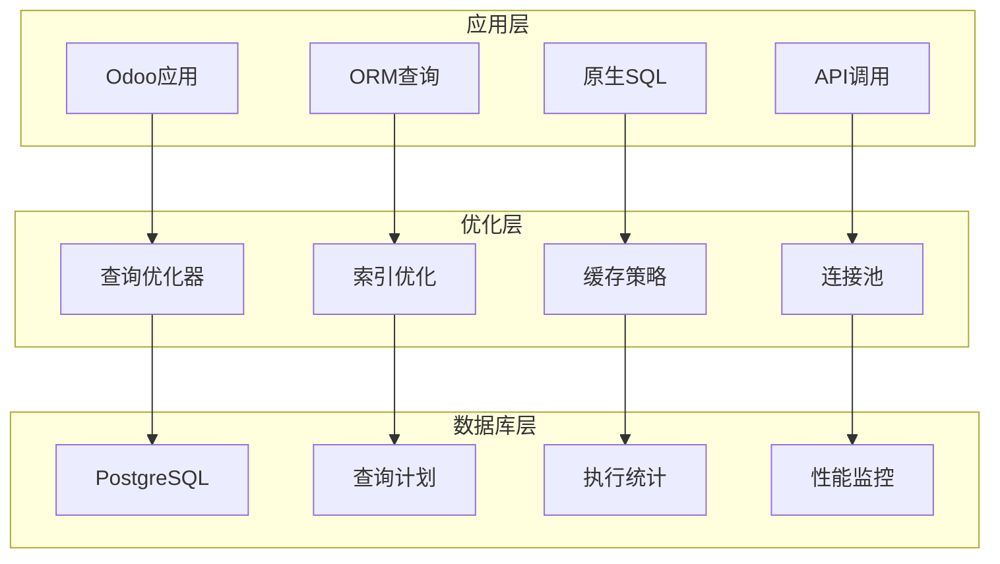

# 查询性能调优

## 查询性能调优概述

在Odoo 17中，查询性能调优是提升系统响应速度的关键。通过优化ORM查询、原生SQL、索引使用等方法，显著提升数据库查询效率。

### 查询性能调优架构


## ORM查询优化

### 基础查询优化
```python
class SaleOrder(models.Model):
    _inherit = 'sale.order'
    
    def get_orders_optimized(self):
        """优化的订单查询"""
        # 错误方式：全表扫描
        orders = self.search([])
        for order in orders:
            if order.state == 'sale':
                print(order.name)
        
        # 正确方式：使用域过滤
        orders = self.search([('state', '=', 'sale')])
        for order in orders:
            print(order.name)
        
        # 进一步优化：限制字段
        orders = self.search([('state', '=', 'sale')], limit=100)
        order_names = orders.mapped('name')
        return order_names
    
    def get_orders_with_partner(self):
        """优化的关联查询"""
        # 错误方式：N+1查询
        orders = self.search([('state', '=', 'sale')])
        for order in orders:
            print(f"Order: {order.name}, Customer: {order.partner_id.name}")
        
        # 正确方式：预加载关联数据
        orders = self.search([('state', '=', 'sale')])
        orders = orders.with_context(prefetch_fields=['partner_id'])
        for order in orders:
            print(f"Order: {order.name}, Customer: {order.partner_id.name}")
        
        # 最佳方式：批量读取
        orders = self.search([('state', '=', 'sale')])
        order_data = orders.read(['name', 'partner_id'])
        partner_ids = [order['partner_id'][0] for order in order_data if order['partner_id']]
        partners = self.env['res.partner'].browse(partner_ids).read(['name'])
        partner_dict = {p['id']: p['name'] for p in partners}
        
        for order in order_data:
            partner_name = partner_dict.get(order['partner_id'][0], '')
            print(f"Order: {order['name']}, Customer: {partner_name}")
```

### 高级查询优化
```python
class SaleOrder(models.Model):
    _inherit = 'sale.order'
    
    def get_complex_orders(self):
        """复杂查询优化"""
        # 使用read_group进行聚合查询
        domain = [
            ('state', 'in', ['sale', 'done']),
            ('date_order', '>=', '2024-01-01')
        ]
        
        # 按客户分组统计
        customer_stats = self.read_group(
            domain,
            ['amount_total:sum', 'id:count'],
            ['partner_id']
        )
        
        # 按月份分组统计
        monthly_stats = self.read_group(
            domain,
            ['amount_total:sum', 'id:count'],
            ['date_order:month']
        )
        
        # 按状态分组统计
        state_stats = self.read_group(
            domain,
            ['amount_total:sum', 'id:count'],
            ['state']
        )
        
        return {
            'customer_stats': customer_stats,
            'monthly_stats': monthly_stats,
            'state_stats': state_stats
        }
    
    def get_orders_with_filters(self):
        """使用过滤器的查询优化"""
        # 使用search_read减少数据传输
        orders = self.search_read(
            [('state', '=', 'sale')],
            ['name', 'date_order', 'amount_total', 'partner_id'],
            limit=100,
            order='date_order DESC'
        )
        
        # 使用browse进行批量操作
        order_ids = [order['id'] for order in orders]
        order_records = self.browse(order_ids)
        
        # 批量更新
        order_records.write({'priority': '1'})
        
        return orders
    
    def get_orders_with_computed_fields(self):
        """计算字段查询优化"""
        # 避免在循环中访问计算字段
        orders = self.search([('state', '=', 'sale')])
        
        # 错误方式：每次访问都计算
        for order in orders:
            if order.amount_total > 1000:
                print(order.name)
        
        # 正确方式：批量计算
        orders = orders.with_context(compute_amount_total=True)
        high_value_orders = orders.filtered(lambda o: o.amount_total > 1000)
        
        return high_value_orders.mapped('name')
```

### 查询缓存优化
```python
import redis
import json
import hashlib
from functools import wraps

class QueryCache:
    def __init__(self, redis_client, default_timeout=300):
        self.redis = redis_client
        self.default_timeout = default_timeout
    
    def cache_search(self, timeout=None):
        """搜索查询缓存装饰器"""
        def decorator(func):
            @wraps(func)
            def wrapper(self, domain, *args, **kwargs):
                # 生成缓存键
                cache_key = self._generate_cache_key(
                    func.__name__, 
                    domain, 
                    args, 
                    kwargs
                )
                
                # 尝试从缓存获取
                cached_result = self.redis.get(cache_key)
                if cached_result:
                    result_data = json.loads(cached_result)
                    return self.browse(result_data['ids'])
                
                # 执行查询并缓存结果
                result = func(self, domain, *args, **kwargs)
                cache_data = {
                    'ids': result.ids,
                    'count': len(result)
                }
                
                self.redis.setex(
                    cache_key,
                    timeout or self.default_timeout,
                    json.dumps(cache_data)
                )
                
                return result
            return wrapper
        return decorator
    
    def _generate_cache_key(self, func_name, domain, args, kwargs):
        """生成缓存键"""
        key_data = f"{func_name}:{str(domain)}:{str(args)}:{str(kwargs)}"
        return hashlib.md5(key_data.encode()).hexdigest()

# 使用示例
redis_client = redis.Redis(host='localhost', port=6379, db=0)
query_cache = QueryCache(redis_client)

class SaleOrder(models.Model):
    _inherit = 'sale.order'
    
    @query_cache.cache_search(timeout=600)
    def search_sale_orders(self, domain):
        """缓存销售订单查询"""
        return self.search(domain)
    
    @query_cache.cache_search(timeout=3600)
    def search_customer_orders(self, customer_id):
        """缓存客户订单查询"""
        return self.search([
            ('partner_id', '=', customer_id),
            ('state', 'in', ['sale', 'done'])
        ])
```

## 原生SQL优化

### 基础SQL优化
```python
class SaleOrder(models.Model):
    _inherit = 'sale.order'
    
    def get_sales_report_sql(self, start_date, end_date):
        """优化的销售报表SQL查询"""
        query = """
        SELECT 
            so.id,
            so.name,
            so.date_order,
            so.amount_total,
            rp.name as customer_name,
            rp.email as customer_email,
            rc.name as company_name,
            COUNT(sol.id) as line_count
        FROM sale_order so
        INNER JOIN res_partner rp ON so.partner_id = rp.id
        INNER JOIN res_company rc ON so.company_id = rc.id
        LEFT JOIN sale_order_line sol ON so.id = sol.order_id
        WHERE so.date_order BETWEEN %s AND %s
        AND so.state IN ('sale', 'done')
        GROUP BY so.id, so.name, so.date_order, so.amount_total, 
                 rp.name, rp.email, rc.name
        ORDER BY so.date_order DESC
        """
        
        self.env.cr.execute(query, (start_date, end_date))
        return self.env.cr.dictfetchall()
    
    def get_monthly_sales_sql(self, year):
        """月度销售统计SQL优化"""
        query = """
        SELECT 
            EXTRACT(MONTH FROM so.date_order) as month,
            COUNT(DISTINCT so.id) as order_count,
            SUM(so.amount_total) as total_amount,
            AVG(so.amount_total) as avg_amount,
            COUNT(DISTINCT so.partner_id) as customer_count
        FROM sale_order so
        WHERE EXTRACT(YEAR FROM so.date_order) = %s
        AND so.state IN ('sale', 'done')
        GROUP BY EXTRACT(MONTH FROM so.date_order)
        ORDER BY month
        """
        
        self.env.cr.execute(query, (year,))
        return self.env.cr.dictfetchall()
    
    def get_top_customers_sql(self, limit=10):
        """顶级客户SQL优化"""
        query = """
        SELECT 
            rp.id,
            rp.name,
            rp.email,
            COUNT(so.id) as order_count,
            SUM(so.amount_total) as total_amount,
            AVG(so.amount_total) as avg_amount,
            MAX(so.date_order) as last_order_date
        FROM res_partner rp
        INNER JOIN sale_order so ON rp.id = so.partner_id
        WHERE so.state IN ('sale', 'done')
        GROUP BY rp.id, rp.name, rp.email
        ORDER BY total_amount DESC
        LIMIT %s
        """
        
        self.env.cr.execute(query, (limit,))
        return self.env.cr.dictfetchall()
```

### 高级SQL优化
```python
class SaleOrder(models.Model):
    _inherit = 'sale.order'
    
    def get_sales_analysis_sql(self, start_date, end_date):
        """销售分析SQL优化"""
        query = """
        WITH sales_data AS (
            SELECT 
                so.id,
                so.name,
                so.date_order,
                so.amount_total,
                rp.name as customer_name,
                rc.name as company_name,
                EXTRACT(MONTH FROM so.date_order) as month,
                EXTRACT(QUARTER FROM so.date_order) as quarter
            FROM sale_order so
            INNER JOIN res_partner rp ON so.partner_id = rp.id
            INNER JOIN res_company rc ON so.company_id = rc.id
            WHERE so.date_order BETWEEN %s AND %s
            AND so.state IN ('sale', 'done')
        ),
        monthly_stats AS (
            SELECT 
                month,
                COUNT(*) as order_count,
                SUM(amount_total) as total_amount,
                AVG(amount_total) as avg_amount
            FROM sales_data
            GROUP BY month
        ),
        customer_stats AS (
            SELECT 
                customer_name,
                COUNT(*) as order_count,
                SUM(amount_total) as total_amount
            FROM sales_data
            GROUP BY customer_name
        )
        SELECT 
            'monthly' as type,
            month as period,
            order_count,
            total_amount,
            avg_amount
        FROM monthly_stats
        UNION ALL
        SELECT 
            'customer' as type,
            customer_name as period,
            order_count,
            total_amount,
            NULL as avg_amount
        FROM customer_stats
        ORDER BY type, total_amount DESC
        """
        
        self.env.cr.execute(query, (start_date, end_date))
        return self.env.cr.dictfetchall()
    
    def get_sales_trend_sql(self, months=12):
        """销售趋势SQL优化"""
        query = """
        SELECT 
            DATE_TRUNC('month', so.date_order) as month,
            COUNT(*) as order_count,
            SUM(so.amount_total) as total_amount,
            AVG(so.amount_total) as avg_amount,
            COUNT(DISTINCT so.partner_id) as customer_count
        FROM sale_order so
        WHERE so.date_order >= DATE_TRUNC('month', CURRENT_DATE - INTERVAL '%s months')
        AND so.state IN ('sale', 'done')
        GROUP BY DATE_TRUNC('month', so.date_order)
        ORDER BY month
        """
        
        self.env.cr.execute(query, (months,))
        return self.env.cr.dictfetchall()
    
    def get_product_sales_sql(self, product_id):
        """产品销售SQL优化"""
        query = """
        SELECT 
            sol.product_id,
            pt.name as product_name,
            COUNT(sol.id) as line_count,
            SUM(sol.product_uom_qty) as total_qty,
            SUM(sol.price_subtotal) as total_amount,
            AVG(sol.price_unit) as avg_price,
            MAX(so.date_order) as last_sale_date
        FROM sale_order_line sol
        INNER JOIN sale_order so ON sol.order_id = so.id
        INNER JOIN product_product pp ON sol.product_id = pp.id
        INNER JOIN product_template pt ON pp.product_tmpl_id = pt.id
        WHERE sol.product_id = %s
        AND so.state IN ('sale', 'done')
        GROUP BY sol.product_id, pt.name
        """
        
        self.env.cr.execute(query, (product_id,))
        return self.env.cr.dictfetchone()
```

## 索引使用优化

### 索引策略
```sql
-- 创建复合索引
CREATE INDEX idx_sale_order_partner_state_date 
ON sale_order (partner_id, state, date_order DESC);

-- 创建部分索引
CREATE INDEX idx_sale_order_active_sale 
ON sale_order (partner_id, date_order) 
WHERE state = 'sale' AND active = true;

-- 创建表达式索引
CREATE INDEX idx_sale_order_year_month 
ON sale_order (EXTRACT(YEAR FROM date_order), EXTRACT(MONTH FROM date_order));

-- 创建覆盖索引
CREATE INDEX idx_sale_order_covering 
ON sale_order (partner_id, state) 
INCLUDE (date_order, amount_total);
```

### 索引使用监控
```sql
-- 查看索引使用情况
SELECT 
    schemaname,
    tablename,
    indexname,
    idx_scan,
    idx_tup_read,
    idx_tup_fetch
FROM pg_stat_user_indexes
WHERE tablename = 'sale_order'
ORDER BY idx_scan DESC;

-- 查看未使用的索引
SELECT 
    schemaname,
    tablename,
    indexname,
    idx_scan,
    idx_tup_read,
    idx_tup_fetch
FROM pg_stat_user_indexes
WHERE tablename = 'sale_order'
AND idx_scan = 0 AND idx_tup_read = 0;

-- 查看索引大小
SELECT 
    schemaname,
    tablename,
    indexname,
    pg_size_pretty(pg_relation_size(indexrelid)) as index_size
FROM pg_stat_user_indexes
WHERE tablename = 'sale_order'
ORDER BY pg_relation_size(indexrelid) DESC;
```

## 查询计划分析

### 执行计划分析
```sql
-- 基础执行计划
EXPLAIN (ANALYZE, BUFFERS) 
SELECT * FROM sale_order 
WHERE partner_id = 123 AND state = 'sale';

-- 详细执行计划
EXPLAIN (ANALYZE, BUFFERS, VERBOSE, FORMAT JSON)
SELECT 
    so.name,
    rp.name as customer_name,
    so.amount_total
FROM sale_order so
JOIN res_partner rp ON so.partner_id = rp.id
WHERE so.date_order >= '2024-01-01'
AND so.state IN ('sale', 'done');

-- 查看查询统计
SELECT 
    query,
    calls,
    total_time,
    mean_time,
    rows,
    100.0 * shared_blks_hit / nullif(shared_blks_hit + shared_blks_read, 0) AS hit_percent
FROM pg_stat_statements
ORDER BY mean_time DESC
LIMIT 10;
```

### 查询优化建议
```python
class QueryOptimizer:
    def __init__(self, env):
        self.env = env
    
    def analyze_query_plan(self, query, params=None):
        """分析查询计划"""
        explain_query = f"EXPLAIN (ANALYZE, BUFFERS, FORMAT JSON) {query}"
        
        if params:
            self.env.cr.execute(explain_query, params)
        else:
            self.env.cr.execute(explain_query)
        
        plan = self.env.cr.fetchone()[0]
        return plan
    
    def get_optimization_suggestions(self, plan):
        """获取优化建议"""
        suggestions = []
        
        # 分析执行计划
        if 'Seq Scan' in str(plan):
            suggestions.append("考虑添加索引以避免全表扫描")
        
        if 'Nested Loop' in str(plan):
            suggestions.append("考虑优化JOIN条件或添加索引")
        
        if 'Hash Join' in str(plan):
            suggestions.append("考虑调整JOIN顺序或添加索引")
        
        return suggestions
    
    def optimize_query(self, query, params=None):
        """优化查询"""
        # 分析当前查询计划
        plan = self.analyze_query_plan(query, params)
        
        # 获取优化建议
        suggestions = self.get_optimization_suggestions(plan)
        
        return {
            'original_plan': plan,
            'suggestions': suggestions,
            'execution_time': plan[0]['Execution Time'] if plan else 0
        }
```

## 性能监控

### 查询性能监控
```python
import time
import logging
from functools import wraps

_logger = logging.getLogger(__name__)

class QueryPerformanceMonitor:
    def __init__(self):
        self.query_stats = {}
        self.slow_queries = []
    
    def monitor_query(self, threshold=1.0):
        """查询性能监控装饰器"""
        def decorator(func):
            @wraps(func)
            def wrapper(*args, **kwargs):
                start_time = time.time()
                
                try:
                    result = func(*args, **kwargs)
                    execution_time = time.time() - start_time
                    
                    # 记录查询统计
                    self._record_stats(func.__name__, execution_time, 'success')
                    
                    # 记录慢查询
                    if execution_time > threshold:
                        self._record_slow_query(func.__name__, execution_time, args, kwargs)
                    
                    return result
                except Exception as e:
                    execution_time = time.time() - start_time
                    self._record_stats(func.__name__, execution_time, 'error')
                    _logger.error(f'Query {func.__name__} failed: {e}')
                    raise
            
            return wrapper
        return decorator
    
    def _record_stats(self, query_name, execution_time, status):
        """记录查询统计"""
        if query_name not in self.query_stats:
            self.query_stats[query_name] = {
                'total_calls': 0,
                'total_time': 0,
                'success_calls': 0,
                'error_calls': 0,
                'avg_time': 0,
                'max_time': 0
            }
        
        stats = self.query_stats[query_name]
        stats['total_calls'] += 1
        stats['total_time'] += execution_time
        stats['avg_time'] = stats['total_time'] / stats['total_calls']
        stats['max_time'] = max(stats['max_time'], execution_time)
        
        if status == 'success':
            stats['success_calls'] += 1
        else:
            stats['error_calls'] += 1
    
    def _record_slow_query(self, query_name, execution_time, args, kwargs):
        """记录慢查询"""
        slow_query = {
            'query_name': query_name,
            'execution_time': execution_time,
            'args': str(args),
            'kwargs': str(kwargs),
            'timestamp': time.time()
        }
        self.slow_queries.append(slow_query)
        _logger.warning(f'Slow query: {query_name} took {execution_time:.2f}s')
    
    def get_performance_report(self):
        """获取性能报告"""
        return {
            'query_stats': self.query_stats,
            'slow_queries': self.slow_queries[-10:],
            'total_queries': sum(stats['total_calls'] for stats in self.query_stats.values())
        }

# 使用示例
performance_monitor = QueryPerformanceMonitor()

class SaleOrder(models.Model):
    _inherit = 'sale.order'
    
    @performance_monitor.monitor_query(threshold=0.5)
    def search_orders_optimized(self, domain):
        """监控优化的订单查询"""
        return self.search(domain)
    
    @performance_monitor.monitor_query(threshold=1.0)
    def get_sales_report_optimized(self, start_date, end_date):
        """监控优化的销售报表查询"""
        return self.get_sales_report_sql(start_date, end_date)
```

## 最佳实践

### 查询优化原则
1. **使用索引**：合理设计和使用索引
2. **避免N+1查询**：使用预加载和批量操作
3. **限制结果集**：使用limit和适当的过滤条件
4. **优化JOIN**：选择合适的JOIN类型和顺序
5. **使用缓存**：对频繁查询的结果进行缓存

### 实施建议
- 定期分析慢查询日志
- 监控查询执行计划
- 优化索引设计
- 实施查询结果缓存
- 建立性能监控体系

## 学习建议

### 理解重点
1. **ORM优化**：理解ORM查询的工作原理
2. **SQL优化**：掌握SQL查询优化技巧
3. **索引设计**：学会设计和使用索引
4. **性能监控**：建立查询性能监控体系

### 实践建议
- 从简单查询开始优化
- 理解查询执行计划
- 实践索引设计和优化
- 建立性能监控体系
- 关注查询缓存策略

## 相关链接
- [[数据库优化]] - 数据库整体优化
- [[缓存策略设计]] - 缓存优化
- [[系统监控告警]] - 性能监控
- [[瓶颈分析与解决]] - 性能分析
