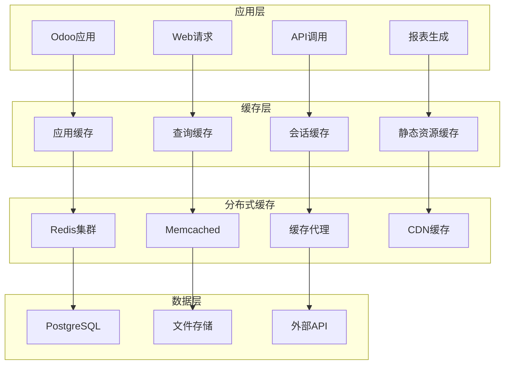

# 缓存策略设计

## 缓存策略概述

在Odoo 17中，缓存策略是提升系统性能的关键。通过多级缓存、智能缓存失效、分布式缓存等方法，显著提升系统响应速度和用户体验。

### 缓存策略架构


## 多级缓存设计

### 应用级缓存
```python
import redis
import json
import hashlib
import time
from functools import wraps
from odoo import models, api

class ApplicationCache:
    def __init__(self, redis_client, default_timeout=300):
        self.redis = redis_client
        self.default_timeout = default_timeout
        self.local_cache = {}  # 本地缓存
        self.cache_stats = {
            'hits': 0,
            'misses': 0,
            'sets': 0
        }
    
    def get(self, key):
        """获取缓存值"""
        # 先检查本地缓存
        if key in self.local_cache:
            cache_data = self.local_cache[key]
            if time.time() < cache_data['expires']:
                self.cache_stats['hits'] += 1
                return cache_data['value']
            else:
                del self.local_cache[key]
        
        # 检查Redis缓存
        cached_value = self.redis.get(key)
        if cached_value:
            value = json.loads(cached_value)
            # 更新本地缓存
            self.local_cache[key] = {
                'value': value,
                'expires': time.time() + 60  # 本地缓存1分钟
            }
            self.cache_stats['hits'] += 1
            return value
        
        self.cache_stats['misses'] += 1
        return None
    
    def set(self, key, value, timeout=None):
        """设置缓存值"""
        timeout = timeout or self.default_timeout
        
        # 设置Redis缓存
        self.redis.setex(key, timeout, json.dumps(value, default=str))
        
        # 设置本地缓存
        self.local_cache[key] = {
            'value': value,
            'expires': time.time() + 60
        }
        
        self.cache_stats['sets'] += 1
    
    def delete(self, key):
        """删除缓存"""
        self.redis.delete(key)
        if key in self.local_cache:
            del self.local_cache[key]
    
    def clear_pattern(self, pattern):
        """清除匹配模式的缓存"""
        keys = self.redis.keys(pattern)
        if keys:
            self.redis.delete(*keys)
        
        # 清除本地缓存中的匹配项
        keys_to_delete = [k for k in self.local_cache.keys() if pattern.replace('*', '') in k]
        for key in keys_to_delete:
            del self.local_cache[key]
    
    def get_stats(self):
        """获取缓存统计"""
        total_requests = self.cache_stats['hits'] + self.cache_stats['misses']
        hit_rate = (self.cache_stats['hits'] / total_requests * 100) if total_requests > 0 else 0
        
        return {
            'hits': self.cache_stats['hits'],
            'misses': self.cache_stats['misses'],
            'sets': self.cache_stats['sets'],
            'hit_rate': hit_rate,
            'local_cache_size': len(self.local_cache)
        }

# 全局缓存实例
redis_client = redis.Redis(host='localhost', port=6379, db=0)
app_cache = ApplicationCache(redis_client)
```

### 查询缓存装饰器
```python
def cache_query(timeout=300, key_prefix='query'):
    """查询缓存装饰器"""
    def decorator(func):
        @wraps(func)
        def wrapper(self, *args, **kwargs):
            # 生成缓存键
            cache_key = f"{key_prefix}:{func.__name__}:{hash(str(args) + str(kwargs))}"
            
            # 尝试从缓存获取
            cached_result = app_cache.get(cache_key)
            if cached_result is not None:
                return cached_result
            
            # 执行查询并缓存结果
            result = func(self, *args, **kwargs)
            app_cache.set(cache_key, result, timeout)
            
            return result
        return wrapper
    return decorator

def cache_method(timeout=300, key_generator=None):
    """方法缓存装饰器"""
    def decorator(func):
        @wraps(func)
        def wrapper(self, *args, **kwargs):
            if key_generator:
                cache_key = key_generator(self, *args, **kwargs)
            else:
                cache_key = f"method:{func.__name__}:{self.id}:{hash(str(args) + str(kwargs))}"
            
            cached_result = app_cache.get(cache_key)
            if cached_result is not None:
                return cached_result
            
            result = func(self, *args, **kwargs)
            app_cache.set(cache_key, result, timeout)
            
            return result
        return wrapper
    return decorator
```

### 模型缓存实现
```python
class SaleOrder(models.Model):
    _inherit = 'sale.order'
    
    @cache_query(timeout=600, key_prefix='sale_orders')
    def get_orders_by_customer(self, customer_id):
        """缓存客户订单查询"""
        return self.search([
            ('partner_id', '=', customer_id),
            ('state', 'in', ['sale', 'done'])
        ])
    
    @cache_query(timeout=3600, key_prefix='sales_stats')
    def get_monthly_sales_stats(self, year, month):
        """缓存月度销售统计"""
        domain = [
            ('date_order', '>=', f'{year}-{month:02d}-01'),
            ('date_order', '<', f'{year}-{month+1:02d}-01'),
            ('state', 'in', ['sale', 'done'])
        ]
        
        return self.read_group(
            domain,
            ['amount_total:sum', 'id:count'],
            []
        )
    
    @cache_method(timeout=1800, key_generator=lambda self, *args, **kwargs: f"order_total:{self.id}")
    def get_order_total(self):
        """缓存订单总额计算"""
        return sum(line.price_subtotal for line in self.order_line)
    
    @api.model
    def create(self, vals):
        """创建时清除相关缓存"""
        result = super().create(vals)
        
        # 清除相关缓存
        app_cache.clear_pattern('sale_orders:*')
        app_cache.clear_pattern('sales_stats:*')
        
        return result
    
    def write(self, vals):
        """更新时清除相关缓存"""
        result = super().write(vals)
        
        # 清除相关缓存
        for record in self:
            app_cache.delete(f"order_total:{record.id}")
        
        app_cache.clear_pattern('sale_orders:*')
        app_cache.clear_pattern('sales_stats:*')
        
        return result
    
    def unlink(self):
        """删除时清除相关缓存"""
        for record in self:
            app_cache.delete(f"order_total:{record.id}")
        
        app_cache.clear_pattern('sale_orders:*')
        app_cache.clear_pattern('sales_stats:*')
        
        return super().unlink()
```

## 智能缓存失效

### 缓存失效策略
```python
class CacheInvalidationManager:
    def __init__(self, cache_instance):
        self.cache = cache_instance
        self.invalidation_rules = {}
        self.dependency_graph = {}
    
    def register_invalidation_rule(self, model_name, field_name, cache_patterns):
        """注册缓存失效规则"""
        key = f"{model_name}.{field_name}"
        self.invalidation_rules[key] = cache_patterns
    
    def add_dependency(self, cache_key, dependencies):
        """添加缓存依赖"""
        if cache_key not in self.dependency_graph:
            self.dependency_graph[cache_key] = set()
        
        self.dependency_graph[cache_key].update(dependencies)
    
    def invalidate_by_model(self, model_name, record_ids=None):
        """根据模型失效缓存"""
        patterns = [
            f"{model_name}:*",
            f"query:{model_name}:*",
            f"method:{model_name}:*"
        ]
        
        for pattern in patterns:
            self.cache.clear_pattern(pattern)
        
        # 失效依赖缓存
        self._invalidate_dependencies(model_name)
    
    def invalidate_by_field(self, model_name, field_name, record_ids=None):
        """根据字段失效缓存"""
        key = f"{model_name}.{field_name}"
        if key in self.invalidation_rules:
            patterns = self.invalidation_rules[key]
            for pattern in patterns:
                self.cache.clear_pattern(pattern)
    
    def _invalidate_dependencies(self, model_name):
        """失效依赖缓存"""
        for cache_key, dependencies in self.dependency_graph.items():
            if model_name in dependencies:
                self.cache.delete(cache_key)

# 使用示例
invalidation_manager = CacheInvalidationManager(app_cache)

# 注册失效规则
invalidation_manager.register_invalidation_rule(
    'sale.order', 
    'state', 
    ['sale_orders:*', 'sales_stats:*']
)

invalidation_manager.register_invalidation_rule(
    'sale.order', 
    'amount_total', 
    ['order_total:*', 'sales_stats:*']
)
```

### 自动缓存失效
```python
class CachedModel(models.AbstractModel):
    _name = 'cached.model'
    _description = 'Cached Model'
    
    @api.model
    def create(self, vals):
        """创建时自动失效缓存"""
        result = super().create(vals)
        self._invalidate_related_caches()
        return result
    
    def write(self, vals):
        """更新时自动失效缓存"""
        result = super().write(vals)
        self._invalidate_related_caches()
        return result
    
    def unlink(self):
        """删除时自动失效缓存"""
        self._invalidate_related_caches()
        return super().unlink()
    
    def _invalidate_related_caches(self):
        """失效相关缓存"""
        model_name = self._name
        
        # 失效模型相关缓存
        invalidation_manager.invalidate_by_model(model_name)
        
        # 失效字段相关缓存
        for field_name in self._fields:
            invalidation_manager.invalidate_by_field(model_name, field_name)

class SaleOrder(models.Model):
    _inherit = ['sale.order', 'cached.model']
    
    # 继承缓存功能
    pass
```

## 分布式缓存

### Redis集群配置
```python
import redis
from redis.sentinel import Sentinel
import json
import time
from functools import wraps

class RedisClusterCache:
    def __init__(self, sentinel_hosts, master_name='mymaster', password=None):
        self.sentinel = Sentinel(sentinel_hosts, password=password)
        self.master = self.sentinel.master_for(master_name, password=password)
        self.slave = self.sentinel.slave_for(master_name, password=password)
        self.cache_stats = {'hits': 0, 'misses': 0, 'sets': 0}
    
    def get(self, key):
        """从从节点读取"""
        try:
            value = self.slave.get(key)
            if value:
                self.cache_stats['hits'] += 1
                return json.loads(value)
            else:
                self.cache_stats['misses'] += 1
                return None
        except Exception as e:
            # 从节点失败，尝试主节点
            try:
                value = self.master.get(key)
                if value:
                    self.cache_stats['hits'] += 1
                    return json.loads(value)
                else:
                    self.cache_stats['misses'] += 1
                    return None
            except Exception:
                self.cache_stats['misses'] += 1
                return None
    
    def set(self, key, value, timeout=300):
        """写入主节点"""
        try:
            self.master.setex(key, timeout, json.dumps(value, default=str))
            self.cache_stats['sets'] += 1
            return True
        except Exception as e:
            return False
    
    def delete(self, key):
        """删除缓存"""
        try:
            self.master.delete(key)
            return True
        except Exception:
            return False
    
    def clear_pattern(self, pattern):
        """清除匹配模式的缓存"""
        try:
            keys = self.master.keys(pattern)
            if keys:
                self.master.delete(*keys)
            return True
        except Exception:
            return False
    
    def get_stats(self):
        """获取缓存统计"""
        total_requests = self.cache_stats['hits'] + self.cache_stats['misses']
        hit_rate = (self.cache_stats['hits'] / total_requests * 100) if total_requests > 0 else 0
        
        return {
            'hits': self.cache_stats['hits'],
            'misses': self.cache_stats['misses'],
            'sets': self.cache_stats['sets'],
            'hit_rate': hit_rate
        }

# 配置Redis集群
sentinel_hosts = [
    ('127.0.0.1', 26379),
    ('127.0.0.1', 26380),
    ('127.0.0.1', 26381)
]

cluster_cache = RedisClusterCache(sentinel_hosts, master_name='mymaster')
```

### 缓存一致性保证
```python
class ConsistentCache:
    def __init__(self, redis_cluster, local_cache_size=1000):
        self.redis = redis_cluster
        self.local_cache = {}
        self.local_cache_size = local_cache_size
        self.version_map = {}  # 版本控制
    
    def get(self, key):
        """获取缓存值，保证一致性"""
        # 检查本地缓存
        if key in self.local_cache:
            local_data = self.local_cache[key]
            local_version = local_data.get('version', 0)
            
            # 检查Redis中的版本
            redis_version = self.redis.get(f"{key}:version")
            if redis_version and int(redis_version) == local_version:
                return local_data['value']
            else:
                # 版本不一致，删除本地缓存
                del self.local_cache[key]
        
        # 从Redis获取
        value = self.redis.get(key)
        if value is not None:
            # 获取版本号
            version = self.redis.get(f"{key}:version") or 0
            
            # 更新本地缓存
            self._update_local_cache(key, value, int(version))
            
            return value
        
        return None
    
    def set(self, key, value, timeout=300):
        """设置缓存值，保证一致性"""
        # 生成新版本号
        version = int(time.time() * 1000)
        
        # 设置Redis缓存
        self.redis.set(key, value, timeout)
        self.redis.set(f"{key}:version", version, timeout)
        
        # 更新本地缓存
        self._update_local_cache(key, value, version)
    
    def _update_local_cache(self, key, value, version):
        """更新本地缓存"""
        # 检查本地缓存大小
        if len(self.local_cache) >= self.local_cache_size:
            # 删除最旧的缓存项
            oldest_key = min(self.local_cache.keys(), 
                           key=lambda k: self.local_cache[k].get('timestamp', 0))
            del self.local_cache[oldest_key]
        
        # 添加新缓存项
        self.local_cache[key] = {
            'value': value,
            'version': version,
            'timestamp': time.time()
        }
    
    def delete(self, key):
        """删除缓存"""
        self.redis.delete(key)
        self.redis.delete(f"{key}:version")
        
        if key in self.local_cache:
            del self.local_cache[key]
```

## 缓存监控和优化

### 缓存性能监控
```python
import time
import logging
from collections import defaultdict

_logger = logging.getLogger(__name__)

class CacheMonitor:
    def __init__(self, cache_instance):
        self.cache = cache_instance
        self.metrics = defaultdict(list)
        self.performance_stats = {
            'total_requests': 0,
            'cache_hits': 0,
            'cache_misses': 0,
            'avg_response_time': 0,
            'slow_requests': 0
        }
    
    def monitor_cache_operation(self, operation_name):
        """监控缓存操作装饰器"""
        def decorator(func):
            def wrapper(*args, **kwargs):
                start_time = time.time()
                
                try:
                    result = func(*args, **kwargs)
                    execution_time = time.time() - start_time
                    
                    # 记录性能指标
                    self._record_metrics(operation_name, execution_time, 'success')
                    
                    return result
                except Exception as e:
                    execution_time = time.time() - start_time
                    self._record_metrics(operation_name, execution_time, 'error')
                    _logger.error(f'Cache operation {operation_name} failed: {e}')
                    raise
            
            return wrapper
        return decorator
    
    def _record_metrics(self, operation_name, execution_time, status):
        """记录性能指标"""
        self.metrics[operation_name].append({
            'execution_time': execution_time,
            'status': status,
            'timestamp': time.time()
        })
        
        # 更新统计信息
        self.performance_stats['total_requests'] += 1
        
        if status == 'success':
            self.performance_stats['cache_hits'] += 1
        else:
            self.performance_stats['cache_misses'] += 1
        
        # 计算平均响应时间
        total_time = sum(m['execution_time'] for m in self.metrics[operation_name])
        self.performance_stats['avg_response_time'] = total_time / len(self.metrics[operation_name])
        
        # 记录慢请求
        if execution_time > 1.0:  # 超过1秒的请求
            self.performance_stats['slow_requests'] += 1
            _logger.warning(f'Slow cache operation: {operation_name} took {execution_time:.2f}s')
    
    def get_performance_report(self):
        """获取性能报告"""
        cache_stats = self.cache.get_stats()
        
        return {
            'cache_stats': cache_stats,
            'performance_stats': self.performance_stats,
            'operation_metrics': dict(self.metrics),
            'recommendations': self._get_optimization_recommendations()
        }
    
    def _get_optimization_recommendations(self):
        """获取优化建议"""
        recommendations = []
        
        cache_stats = self.cache.get_stats()
        
        # 缓存命中率建议
        if cache_stats['hit_rate'] < 70:
            recommendations.append("缓存命中率较低，考虑增加缓存时间或优化缓存键")
        
        # 响应时间建议
        if self.performance_stats['avg_response_time'] > 0.5:
            recommendations.append("平均响应时间较高，考虑优化缓存策略")
        
        # 慢请求建议
        if self.performance_stats['slow_requests'] > 0:
            recommendations.append("存在慢请求，考虑优化缓存操作")
        
        return recommendations

# 使用示例
cache_monitor = CacheMonitor(app_cache)

class SaleOrder(models.Model):
    _inherit = 'sale.order'
    
    @cache_monitor.monitor_cache_operation('get_orders_by_customer')
    def get_orders_by_customer_cached(self, customer_id):
        """监控缓存操作的客户订单查询"""
        return self.get_orders_by_customer(customer_id)
```

### 缓存优化建议
```python
class CacheOptimizer:
    def __init__(self, cache_instance, monitor_instance):
        self.cache = cache_instance
        self.monitor = monitor_instance
    
    def optimize_cache_strategy(self):
        """优化缓存策略"""
        report = self.monitor.get_performance_report()
        recommendations = []
        
        # 分析缓存命中率
        hit_rate = report['cache_stats']['hit_rate']
        if hit_rate < 60:
            recommendations.append({
                'type': 'hit_rate',
                'message': '缓存命中率过低，建议增加缓存时间',
                'action': 'increase_timeout'
            })
        
        # 分析响应时间
        avg_response_time = report['performance_stats']['avg_response_time']
        if avg_response_time > 0.5:
            recommendations.append({
                'type': 'response_time',
                'message': '响应时间过长，建议优化缓存键设计',
                'action': 'optimize_keys'
            })
        
        # 分析慢请求
        slow_requests = report['performance_stats']['slow_requests']
        if slow_requests > 0:
            recommendations.append({
                'type': 'slow_requests',
                'message': '存在慢请求，建议检查缓存操作',
                'action': 'review_operations'
            })
        
        return recommendations
    
    def auto_optimize(self):
        """自动优化缓存"""
        recommendations = self.optimize_cache_strategy()
        
        for rec in recommendations:
            if rec['action'] == 'increase_timeout':
                # 增加缓存时间
                self._increase_cache_timeout()
            elif rec['action'] == 'optimize_keys':
                # 优化缓存键
                self._optimize_cache_keys()
            elif rec['action'] == 'review_operations':
                # 检查缓存操作
                self._review_cache_operations()
    
    def _increase_cache_timeout(self):
        """增加缓存时间"""
        # 实现逻辑
        pass
    
    def _optimize_cache_keys(self):
        """优化缓存键"""
        # 实现逻辑
        pass
    
    def _review_cache_operations(self):
        """检查缓存操作"""
        # 实现逻辑
        pass
```

## 最佳实践

### 缓存设计原则
1. **分层缓存**：实现多级缓存策略
2. **智能失效**：基于数据变更自动失效
3. **一致性保证**：确保缓存数据一致性
4. **性能监控**：持续监控缓存性能
5. **故障容错**：缓存故障时系统仍可运行

### 实施建议
- 从关键业务数据开始实施缓存
- 建立缓存监控和告警机制
- 定期分析缓存性能指标
- 优化缓存键设计和失效策略
- 建立缓存故障恢复机制

## 学习建议

### 理解重点
1. **缓存策略**：理解多级缓存的设计原理
2. **失效机制**：掌握智能缓存失效策略
3. **一致性**：理解缓存一致性的保证方法
4. **性能监控**：建立缓存性能监控体系

### 实践建议
- 从简单缓存开始实施
- 理解缓存失效的影响
- 实践分布式缓存配置
- 建立性能监控体系
- 关注缓存优化策略

## 相关链接
- [[数据库优化]] - 数据库缓存优化
- [[查询性能调优]] - 查询缓存优化
- [[系统监控告警]] - 缓存监控
- [[瓶颈分析与解决]] - 缓存性能分析
