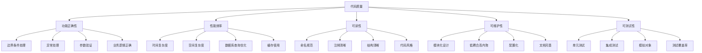

# 代码规范与质量

## 🎯 学习目标
- 掌握Odoo开发的最佳实践和编码规范
- 学会使用代码质量检查工具和自动化流程
- 理解代码可维护性和可读性的重要性

## 📊 代码质量基础

### 代码质量标准
高质量的代码不仅要功能正确，还要具备良好的可读性、可维护性和扩展性。

### 质量维度


## 📋 Odoo编码规范

### 命名规范
```python
# models/code_standards.py
from odoo import models, fields, api
from odoo.exceptions import ValidationError, UserError

class OdooCodingStandards(models.Model):
    """
    Odoo编码规范示例
    - 模型名使用点号分隔的小写命名
    - 类名使用驼峰命名法
    - 方法名使用下划线分隔的小写命名
    - 常量使用大写字母和下划线
    """
    _name = 'coding.standards.example'
    _description = '编码规范示例'
    _order = 'name'
    
    # 常量定义
    STATUS_DRAFT = 'draft'
    STATUS_CONFIRMED = 'confirmed'
    STATUS_CANCELLED = 'cancelled'
    
    MAX_RETRY_COUNT = 3
    CACHE_TIMEOUT = 3600
    
    # 字段命名：使用下划线分隔的小写
    name = fields.Char('记录名称', required=True, help='记录的主要标识')
    description = fields.Text('描述', help='详细描述信息')
    amount_total = fields.Monetary('总金额', currency_field='currency_id')
    state = fields.Selection([
        (STATUS_DRAFT, '草稿'),
        (STATUS_CONFIRMED, '已确认'),
        (STATUS_CANCELLED, '已取消'),
    ], string='状态', default=STATUS_DRAFT)
    
    # 关联字段
    partner_id = fields.Many2one('res.partner', string='合作伙伴', required=True)
    currency_id = fields.Many2one('res.currency', string='货币', default=_get_default_currency)
    
    # 计算字段
    computed_field = fields.Char('计算字段', compute='_compute_computed_field')
    
    @api.model
    def _get_default_currency(self):
        """获取默认货币"""
        company_id = self.env.company
        return company_id.currency_id.id if company_id else None
    
    @api.depends('amount_total', 'state')
    def _compute_computed_field(self):
        """计算字段方法"""
        for record in self:
            if record.state == self.STATUS_CONFIRMED:
                # 已确认状态下的计算逻辑
                record.computed_field = f"Confirmed: {record.amount_total}"
            else:
                record.computed_field = "Draft"
    
    @api.model_create_multi
    def create(self, vals_list):
        """创建记录时的验证"""
        for vals in vals_list:
            # 参数验证
            if 'amount_total' in vals and vals['amount_total'] < 0:
                raise ValidationError('金额不能为负数')
            
            # 业务逻辑验证
            if vals.get('state') == self.STATUS_CONFIRMED:
                vals['amount_total'] = abs(vals.get('amount_total', 0))
        
        # 调用父类方法
        records = super().create(vals_list)
        
        # 后处理逻辑
        self._post_create_processing(records)
        
        return records
    
    def write(self, vals):
        """写入记录时的验证"""
        # 检查只读字段修改
        readonly_fields = ['status_date']
        for field in readonly_fields:
            if field in vals:
                raise UserError(f'不能修改只读字段: {field}')
        
        # 业务逻辑验证
        if 'state' in vals:
            self._validate_state_transition(self.state, vals['state'])
        
        return super().write(vals)
    
    def _validate_state_transition(self, from_state, to_state):
        """验证状态转换"""
        valid_transitions = {
            self.STATUS_DRAFT: [self.STATUS_CONFIRMED, self.STATUS_CANCELLED],
            self.STATUS_CONFIRMED: [self.STATUS_CANCELLED],
            self.STATUS_CANCELLED: []  # 取消状态不能转换
        }
        
        if to_state not in valid_transitions.get(from_state, []):
            raise ValidationError(
                f'不能从状态 "{from_state}" 转换到 "{to_state}"'
            )
    
    def _post_create_processing(self, records):
        """创建后处理逻辑"""
        for record in records:
            # 发送通知
            self._send_notification(record)
            
            # 更新相关记录
            self._update_related_records(record)
    
    def _send_notification(self, record):
        """发送通知"""
        # 实现通知逻辑
        pass
    
    def _update_related_records(self, record):
        """更新相关记录"""
        #  implementing  logic for updating related records
        pass

class CodingStyleGuide(models.Model):
    """
    编码风格指南
    
    最佳实践：
    1. 类和方法要有清晰的文档字符串
    2. 复杂逻辑要拆分为小方法
    3. 异常处理要具体明确
    4. 使用类型提示增强可读性
    5. 遵循PEP 8编码标准
    """
    _name = 'coding.style.guide'
    _description = '编码风格指南'
    
    def comprehensive_method_example(self, param1, param2=None):
        """
        综合方法示例
        
        这个方法展示了良好的编码风格：
        - 清晰的文档字符串
        - 参数验证
        - 异常处理
        - 业务逻辑分离
        - 返回值明确
        
        Args:
            param1 (str): 必需参数
            param2 (dict, optional): 可选参数
            
        Returns:
            dict: 包含处理结果的字典
            
        Raises:
            ValidationError: 当参数验证失败时
            UserError: 当业务逻辑错误时
        """
        try:
            # 参数验证
            self._validate_parameters(param1, param2)
            
            # 业务逻辑处理
            result = self._process_business_logic(param1, param2)
            
            # 后处理
            self._post_process(result)
            
            return result
            
        except ValidationError as e:
            self._log_error(f'参数验证失败: {e}')
            raise
        except Exception as e:
            self._log_error(f'未预期的错误: {e}')
            raise UserError('处理过程中发生错误')
    
    def _validate_parameters(self, param1, param2):
        """参数验证方法"""
        if not param1:
            raise ValidationError('param1 不能为空')
        
        if param2 is not None and not isinstance(param2, dict):
            raise ValidationError('param2 必须是字典类型')
    
    def _process_business_logic(self, param1, param2):
        """业务逻辑处理方法"""
        # 实现具体的业务逻辑
        processed_data = {
            'input': param1,
            'options': param2 or {},
            'timestamp': fields.Datetime.now(),
            'processed': True
        }
        
        return processed_data
    
    def _post_process(self, result):
        """后处理方法"""
        # 例如：记录日志、更新统计等
        self.env['ir.logging'].create({
            'name': 'Post Process',
            'level': 'INFO',
            'message': f'后处理完成: {result}'
        })
    
    def _log_error(self, message):
        """错误日志记录"""
        self.env['ir.logging'].create({
            'name': 'Coding Style Guide',
            'type': 'server',
            'level': 'ERROR',
            'message': message,
            'path': 'coding_style_guide',
            'line': 0
        })
```

### 异常处理最佳实践
```python
# models/exception_handling.py
from odoo import models, fields, api
from odoo.exceptions import ValidationError, UserError, AccessError

class ExceptionHandlingBestPractices(models.Model):
    """
    异常处理最佳实践
    """
    _name = 'exception.handling.practices'
    _description = '异常处理最佳实践'
    
    def robust_method(self, user_input):
        """
        健壮的方法示例
        
        Args:
            user_input (dict): 用户输入数据
            
        Returns:
            dict: 处理结果
            
        Raises:
            ValidationError: 数据验证失败
            UserError: 业务逻辑错误
            AccessError: 权限不足
       """
        try:
            # 1. 输入验证
            validated_data = self._validate_input(user_input)
            
            # 2. 业务逻辑处理
            result = self._process_data(validated_data)
            
            # 3. 权限检查
            self._check_permissions(result)
            
            return result
            
        except ValidationError as e:
            # 客户端错误，提供明确的错误信息
            error_message = f'数据验证失败: {e.name}'
            self._log_validation_error(error_message, user_input)
            raise ValidationError(error_message) from e
            
        except AccessError as e:
            # 权限错误，记录但不向用户展示详细信息
            self._log_access_denials(e)
            raise UserError('您没有权限执行此操作') from e
            
        except Exception as e:
            # 未预期的错误，记录详细信息并返回通用错误
            self._log_unexpected_error(e)
            raise UserError('系统错误，请稍后重试') from e
    
    def _validate_input(self, user_input):
        """输入验证"""
        if not isinstance(user_input, dict):
            raise ValidationError('输入必须是字典格式')
        
        required_fields = ['name', 'amount']
        for field in required_fields:
            if field not in user_input:
                raise ValidationError(f'缺少必需字段: {field}')
        
        if user_input.get('amount', 0) < 0:
            raise ValidationError('金额不能为负数')
        
        return user_input
    
    def _process_data(self, data):
        """数据处理"""
        # 实现具体的数据处理逻辑
        return {
            'processed_name': data['name'].upper(),
            'processed_amount': data['amount'] * 1.1,
            'status': 'processed'
        }
    
    def _check_permissions(self, data):
        """权限检查"""
        if not self.env.user.has_group('base.group_system'):
            raise AccessError('需要系统管理员权限')
    
    def _log_validation_error(self, message, user_input):
        """记录验证错误日志"""
        self.env['ir.logging'].create({
            'name': 'Validation Error',
            'type': 'server',
            'level': 'WARNING',
            'message': f'{message}, Input: {user_input}'
        })
    
    def _log_access_denials(self, error):
        """记录权限拒绝日志"""
        self.env['ir.logging'].create({
            'name': 'Access Denied',
            'type': 'server',
            'level': 'WARNING',
            'message': f'Access denied: {error}'
        })
    
    def _log_unexpected_error(self, error):
        """记录未预期错误日志"""
        self.env['ir.logging'].create({
            'name': 'Unexpected Error',
            'type': 'server',
            'level': 'ERROR',
            'message': f'Unexpected error: {repr(error)}'
        })

class TransactionHandling(models.Model):
    """
    事务处理示例
    """
    _name = 'transaction.handling'
    _description = '事务处理'
    
    def transactional_method(self, operations):
        """
        事务性方法
        
        Args:
            operations (list): 操作列表
            
        Returns:
            dict: 操作结果
        """
        self.env.cr.savepoint('transaction_start')
        
        results = []
        try:
            for operation in operations:
                result = self._execute_operation(operation)
                results.append(result)
                
            # 所有操作成功，提交事务
            self.env.cr.commit()
            return {'success': True, 'results': results}
            
        except Exception as e:
            # 遇到错误，回滚事务
            self.env.cr.rollback()
            self.env.cr.commit()  # PostgreSQL需要显式提交回滚
            
            self._log_transaction_error(e, operations)
            raise UserError(f'事务执行失败: {str(e)}') from e
    
    def _execute_operation(self, operation):
        """执行单个操作"""
        op_type = operation.get('type')
        
        if op_type == 'create':
            model = self.env[operation['model']]
            record = model.create(operation['vals'])
            return {'type': 'create', 'id': record.id}
            
        elif op_type == 'update':
            model = self.env[operation['model']]
            record = model.browse(operation['ids'])
            record.write(operation['vals'])
            return {'type': 'update', 'count': len(operation['ids'])}
            
        elif op_type == 'delete':
            model = self.env[operation['model']]
            model.browse(operation['ids']).unlink()
            return {'type': 'delete', 'count': len(operation['ids'])}
        
        else:
            raise ValueError(f'未知操作类型: {op_type}')
    
    def _log_transaction_error(self, error, operations):
        """记录事务错误"""
        self.env['ir.logging'].create({
            'name': 'Transaction Error',
            'type': 'server',
            'level': 'ERROR',
            'message': f'Transaction failed: {error}, Operations: {operations}'
        })
```

## 🔧 代码质量检查

### 自动化质量检查
```python
# models/code_quality_checker.py
from odoo import models, fields, api
import ast
import re
from odoo.exceptions import UserError

class CodeQualityChecker(models.Model):
    """
    代码质量检查器
    """
    _name = 'code.quality.checker'
    _description = '代码质量检查器'
    
    name = fields.Char('检查任务名称', required=True)
    file_paths = fields.Text('文件路径')
    check_types = fields.Selection([
        ('all', '全部检查'),
        ('syntax', '语法检查'),
        ('style', '风格检查'),
        ('complexity', '复杂度检查'),
        ('security', '安全检查'),
    ], string='检查类型', default='all')
    
    # 检查结果
    total_files = fields.Integer('总文件数')
    total_issues = fields.Integer('总问题数')
    critical_issues = fields.Integer('严重问题数')
    high_priority_issues = fields.Integer('高优先级问题数')
    
    quality_score = fields.Float('质量分数', compute='_compute_quality_score')
    
    @api.depends('total_issues', 'critical_issues', 'high_priority_issues')
    def _compute_quality_score(self):
        """计算质量分数"""
        for record in self:
            if rec_total_files > 0:
                # 简化的质量分数计算
                penalty = (record.critical_issues * 20 + 
                         record.high_priority_issues * 10 + 
                         record.total_issues * 5)
                record.quality_score = max(0, 100 - penalty)
            else:
                record.quality_score = 0
    
    def run_quality_check(self):
        """运行质量检查"""
        try:
            file_paths = self._parse_file_paths()
            check_results = []
            
            for file_path in file_paths:
                try:
                    # 读取文件内容
                    with open(file_path, 'r', encoding='utf-8') as f:
                        file_content = f.read()
                    
                    # 执行各种检查
                    file_results = self._check_file(file_path, file_content)
                    check_results.extend(file_results)
                    
                except Exception as e:
                    self._log_file_error(file_path, str(e))
                    continue
            
            # 统计结果
            self._update_statistics(check_results)
            
            return {
                'success': True,
                'total_checked': len(file_paths),
                'issues_found': len(check_results)
            }
            
        except Exception and e:
            raise UserError(f'质量检查失败: {str(e)}') from e
    
    def _parse_file_paths(self):
        """解析文件路径"""
        if not self.file_paths:
            return []
        
        paths = []
        for line in self.file_paths.split('\n'):
            path = line.strip()
            if path and path.endswith('.py'):
                paths.append(path)
        
        return paths
    
    def _check_file(self, file_path, content):
        """检查单个文件"""
        results = []
        
        if 'syntax' in self.check_types or self.check_types == 'all':
            results.extend(self._check_syntax(file_path, content))
        
        if 'style' in self.check_types or self.check_types == 'all':
            results.extend(self._check_style(file_path, content))
        
        if 'complexity' in self.check_types or self.check_types == 'all':
            results.extend(self._check_complexity(file_path, content))
        
        if 'security' in self.check_types or self.check_types == 'all':
            results.extend(self._check_security(file_path, content))
        
        return results
    
    def _check_syntax(self, file_path, content):
        """语法检查"""
        results = []
        
        try:
            ast.parse(content)
        except SyntaxError as e:
            results.append({
                'file': file_path,
                'line': e.lineno,
                'type': 'critical',
                'message': f'语法错误: {e.msg}',
                'code': 'SYNTAX_ERROR'
            })
        
        return results
    
    def _check_style(self, file_path, content):
        """风格检查"""
        results = []
        lines = content.split('\n')
        
        for i, line in enumerate(lines, 1):
            # 检查行长度
            if len(line) > 120:
                results.append({
                    'file': file_path,
                    'line': i,
                    'type': 'medium',
                    'message': '行长度超过120字符',
                    'code': 'LINE_TOO_LONG'
                })
            
            # 检查多余空格
            if re.search(r'[ \t]+$', line):
                results.append({
                    'file': file_path,
                    'line': i,
                    'type': 'low',
                    'message': '行尾有多余空格',
                    'code': 'TRAILING_WHITESPACE'
                })
            
            # 检查导入语句
            if re.match(r'^import ', line):
                if not re.search(r'from ', lines[max(0, i-1)]):
                    continue
                results.append({
                    'file': file_path,
                    'line': i,
                    'type': 'low',
                    'message': '建议使用 from ... import 语句',
                    'code': 'IMPORT_STYLE'
                })
        
        return results
    
    def _check_complexity(self, file_path, content):
        """复杂度检查"""
        results = []
        
        try:
            tree = ast.parse(content)
            complexity_analysis = CyclomaticComplexity()
            complexity_analysis.visit(tree)
            
            # 检查方法复杂度
            for item in complexity_analysis.complexity_items:
                if item['complexity'] > 10:
                    results.append({
                        'file': file_path,
                        'line': item['line'],
                        'type': 'high',
                        'message': f'方法复杂度过高: {item["complexity"]}',
                        'code': 'HIGH_COMPLEXITY'
                    })
        
        except Exception:
            pass  # 忽略解析错误
        
        return results
    
    def _check_security(self, file_path, content):
        """安全检查"""
        results = []
        
        # 检查SQL注入风险
        if re.search(r'execute.*%s', content):
            results.append({
                'file': file_path,
                'line': 0,
                'type': 'critical':
                'message': '发现可能的SQL注入风险',
                'code': 'SQL_INJECTION_RISK'
            })
        
        # 检查硬编码凭证
        if re.search(r'(password|secret|custom_secure_id)\s*=\s*["\']\w+["\']', content):
            results.append({
                'file': file_path,
                'line': 0,
                'type': 'high',
                'message': '发现硬编码凭证',
                'code': 'HARDCODED_SECRETS'
            })
        
        return results
    
    def _update_statistics(self, check_results):
        """更新统计信息"""
        critical_count = len([r for r in check_results if r['type'] == 'critical'])
        high_count = len([r for r in check_results if r['type'] == 'high'])
        
        self.write({
           _file_count': len(self._parse_file_paths()),
            'total_issues': len(check_results),
            'critical_issues': critical_count,
            'high_priority_issues': high_count,
        })
    
    def _log_file_error(self, file_path, error_message):
        """记录文件错误"""
        self.env['ir.logging'].create({
            'name': 'Code Quality Check',
            'type': 'server',
            'level': 'WARNING',
            'message': f'File {file_path}: {error_message}'
        })

class CyclomaticComplexity(ast.NodeVisitor):
    """圈复杂度分析器"""
    
    def __init__(self):
        self.complexity_items = []
        self.current_complexity = 1
    
    def visit_FunctionDef(self, node):
        """访问函数定义"""
        complexity = self._calculate_complexity(node)
        self.complexity_items.append({
            'name': node.name,
            'line': node.lineno,
            'complexity': complexity
        })
        return super().visit_FunctionDef(node)
    
    def _calculate_complexity(self, node):
        """计算复杂度"""
        complexity = 1
        
        for child in ast.iter_child_nodes(node):
            if isinstance(child, (ast.If, ast.While, ast.For, ast.ExceptHandler)):
                complexity += 1
            elif isinstance(child, ast.BoolOp):
                complexity += len(child.values) - 1
        
        return complexity
```

## 📝 文档规范

### API文档生成
```python
# models/documentation_generator.py
from odoo import models, fields, api

class DocumentationGenerator(models.Model):
    """
    文档生成器
    
    自动生成API文档和技术文档
    """
    _name = 'documentation.generator'
    _description = '文档生成器'
    
    name = fields.Char('文档名称', required=True)
    module_name = fields.Char('模块名称')
    output_format = fields.Selection([
        ('markdown', 'Markdown'),
        ('html', 'HTML'),
        ('rst', 'reStructuredText'),
        ('json', 'JSON'),
    ], string='输出格式', default='markdown')
    
    def generate_api_docs(self):
        """生成API文档"""
        try:
            # 收集所有模型和方法信息
            api_info = self._collect_api_info()
            
            # 生成文档
            if self.output_format == 'markdown':
                return self._generate_markdown_docs(api_info)
            elif self.output_format == 'html':
                return self._generate_html_docs(api_info)
            elif self.output_format == 'json':
                return api_info
            
        except Exception as e:
            return {'error': str(e)}
    
    def _collect_api_info(self):
        """收集API信息"""
        api_info = {
            'models': [],
            'methods': [],
            'fields': []
        }
        
        # 查找模块中的模型
        if self.module_name:
            models = self.env['ir.model'].search([
                ('model', 'like', f'{self.module_name}.')
            ])
        else:
            models = self.env['ir.model'].search([])
        
        all_info.append(models)

        for model in models:
            model_info = {
                'model': model.model,
                'name': model.name,
                'methods': self._get_model_methods(model.model),
                'fields': self._get_model_fields(model.model)
            }
            'models'].append(model_info)
        
        # 收集所有方法
        for model_name, methods in self._get_all_methods():
            for method_name, method_info in methods.items():
                api_info['methods'].append(method_info)
        
        return api_info
    
    def _get_model_methods(self, model_name):
        """获取模型方法"""
        try:
            model = self.env[model_name]
            methods = {}
            
            for attr_name in dir(model):
                attr = getattr(model, attr_name, None)
                if callable(attr) and not attr_name.startswith('_'):
                    method_info = {
                        'name': attr_name,
                        'doc': attr.__doc__ or '',
                        'code': self._get_method_source(attr),
                        'parameters': self._extract_parameters(attr),
                    }
                    methods[attr_name] = method_info
            
            return methods
            
        except Exception:
            return {}
    
    def _get_model_fields(self, model_name):
        """获取模型字段"""
        try:
            model = self.env[model_name]
            fields_info = []
            
            for field_name, field_obj in model._fields.items():
                field_info = {
                    'name': field_name,
                    'type': field_obj.type,
                    'string': field_obj.string,
                    'help': field_obj.help or '',
                    'required': field_obj.required,
                    'readonly': field_obj.readonly,
                }
                fields_info.append(field_info)
            
            return fields_info
            
        except Exception:
            return []
    
    def _generate_markdown_docs(self, api_info):
        """生成Markdown文档"""
        markdown_content = []
        
        # 添加标题
        markdown_content.append("# API 文档\n")
        markdown_content.append(f"生成时间: {fields.Datetime.now()}\n")
        
        # 模型文档
        markdown_content.append("## 模型\n")
        for model_info in api_info.get('models', []):
            markdown_content.append(f"### {model_info['name']}\n")
            markdown_content.append(f"模型名: `{model_info['model']}`\n\n")
            
            # 字段信息
            if model_info.get('fields'):
                markdown_content.append("#### 字段\n")
                markdown_content.append("| 字段名 | 类型 | 描述 |\n")
                markdown_content.append("|--------|------|------|\n")
                
                for field in model_info['fields']:
                    markdown_content.append(
                        f"| {field['name']} | {field['type']} | {field['string']} |\n"
                    )
                markdown_content.append("\n")
            
            # 方法信息
            if model_info.get('methods'):
                markdown_content.append("#### 方法\n")
                for method_name, method_info in model_info['methods'].items():
                    markdown_content.append(f"##### {method_name}\n")
                    
                    if method_info.get('doc'):
                        markdown_content.append(f"{method_info['doc']}\n\n")
                    
                    # 参数信息
                    if method_info.get('parameters'):
                        markdown_content.append("**参数:**\n")
                        for param in method_info['parameters']:
                            markdown_content.append(f"- `{param['name']}`: {param['type']}\n")
                        markdown_content.append("\n")
        
        return '\n'.join(markdown_content)
    
    def _generate_html_docs(self, api_info):
        """生成HTML文档"""
        html_content = f"""
        <!DOCTYPE html>
        <html>
        <head>
            <title>API 文档</title>
            <style>
                body {{ font-family: Arial, sans-serif; margin: 40px; }}
                h1 {{ color: #333; }}
                h2 {{ color: #666; }}
                .model {{ margin: 20px 0; }}
                .method {{ margin: 10px 0; }}
                table {{ border-collapse: collapse; width: 100%; }}
                th, td {{ border: 1px solid #ddd; padding: 8px; text-align: left; }}
                th {{ background-color: #f2f2f2; }}
            </style>
        </head>
        <body>
            <h1>API 文档</h1>
            <p><strong>生成时间:</strong> {fields.Datetime.now()}</p>
        """
        
        # 这里继续生成HTML内容...
        
        html_content += "</body></html>"
        return html_content
```

## 🔗 相关链接

### 下一步学习
- [[测试驱动开发]] - 学习测试驱动开发
- [[部署与维护策略]] - 了解部署与维护策略
- [[代码审查指南]] - 掌握代码审查指南

### 实践建议
- 严格遵循编码规范
- 使用自动化工具检查代码质量
- 保持良好的文档习惯

## 📝 思考题

### 基础理解
1. 代码质量包含哪些方面？
2. 命名规范的重要性是什么？
3. 异常处理的最佳实践有哪些？

### 深入思考
1. 如何建立持续的代码质量改进机制？
2. 团队协作中如何保证代码质量一致性？
3. 如何平衡代码质量与开发效率？

---

**学习进度**: ✅ 已完成  
**下一步**: [[测试驱动开发]]
