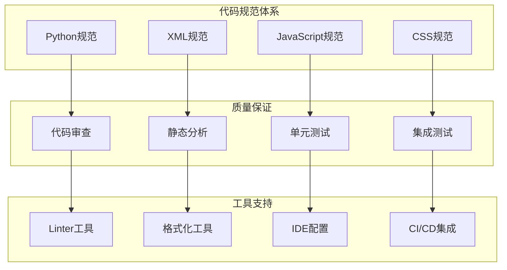

# 代码规范标准

## 代码规范概述

在Odoo 17开发中，遵循统一的代码规范是保证代码质量、提高开发效率和维护性的关键。本规范涵盖Python、XML、JavaScript、CSS等主要技术栈。

### 代码规范架构


## Python代码规范

### 基础规范
```python
# 文件编码和导入规范
# -*- coding: utf-8 -*-
"""
模块文档字符串
描述模块的功能、用途和主要类/函数
"""

# 标准库导入
import os
import sys
from datetime import datetime, timedelta

# 第三方库导入
import requests
from lxml import etree

# Odoo相关导入
from odoo import models, fields, api
from odoo.exceptions import ValidationError, UserError

# 本地导入
from . import utils
from .models import base_model


class SaleOrder(models.Model):
    """
    销售订单模型
    
    继承自sale.order，添加自定义功能
    """
    _name = 'sale.order'
    _inherit = 'sale.order'
    _description = 'Custom Sale Order'
    
    # 字段定义
    custom_field = fields.Char(
        string='Custom Field',
        help='自定义字段说明',
        required=False,
        default='',
        index=True
    )
    
    # 计算字段
    computed_field = fields.Float(
        string='Computed Field',
        compute='_compute_custom_field',
        store=True,
        help='计算字段说明'
    )
    
    @api.depends('order_line.price_subtotal')
    def _compute_custom_field(self):
        """计算自定义字段值"""
        for record in self:
            record.computed_field = sum(
                line.price_subtotal for line in record.order_line
            )
    
    @api.model
    def create(self, vals):
        """创建记录时的处理"""
        # 数据验证
        if not vals.get('name'):
            vals['name'] = self._generate_name()
        
        # 调用父类方法
        result = super().create(vals)
        
        # 后处理
        result._post_create_processing()
        
        return result
    
    def write(self, vals):
        """更新记录时的处理"""
        # 前置验证
        self._pre_write_validation(vals)
        
        # 调用父类方法
        result = super().write(vals)
        
        # 后置处理
        self._post_write_processing(vals)
        
        return result
    
    def _generate_name(self):
        """生成名称"""
        return f"SO{datetime.now().strftime('%Y%m%d%H%M%S')}"
    
    def _post_create_processing(self):
        """创建后处理"""
        # 发送通知
        self._send_notification('created')
    
    def _pre_write_validation(self, vals):
        """写入前验证"""
        if 'amount_total' in vals and vals['amount_total'] < 0:
            raise ValidationError('订单金额不能为负数')
    
    def _post_write_processing(self, vals):
        """写入后处理"""
        if 'state' in vals:
            self._send_notification('state_changed')
    
    def _send_notification(self, event_type):
        """发送通知"""
        # 实现通知逻辑
        pass
```

### 命名规范
```python
# 类名：使用PascalCase
class CustomSaleOrder(models.Model):
    pass

class ProductTemplate(models.Model):
    pass

# 方法名：使用snake_case
def compute_order_total(self):
    pass

def validate_customer_data(self):
    pass

def _private_method(self):
    """私有方法以下划线开头"""
    pass

# 变量名：使用snake_case
order_total = 0
customer_name = ""
is_valid = True

# 常量：使用UPPER_SNAKE_CASE
MAX_ORDER_AMOUNT = 100000
DEFAULT_CURRENCY = 'USD'
STATUS_DRAFT = 'draft'

# 字段名：使用snake_case
partner_id = fields.Many2one('res.partner', 'Customer')
order_line_ids = fields.One2many('sale.order.line', 'order_id', 'Order Lines')
amount_total = fields.Float('Total Amount', compute='_compute_amount_total')
```

### 方法规范
```python
class SaleOrder(models.Model):
    _inherit = 'sale.order'
    
    def action_confirm(self):
        """
        确认订单
        
        执行订单确认流程，包括：
        1. 验证订单数据
        2. 更新订单状态
        3. 创建相关记录
        4. 发送通知
        
        Returns:
            bool: 确认是否成功
            
        Raises:
            ValidationError: 当订单数据无效时
            UserError: 当业务规则不满足时
        """
        # 1. 前置验证
        self._validate_order_data()
        
        # 2. 调用父类方法
        result = super().action_confirm()
        
        # 3. 后置处理
        self._post_confirm_processing()
        
        return result
    
    def _validate_order_data(self):
        """验证订单数据"""
        for order in self:
            if not order.order_line:
                raise ValidationError('订单必须包含至少一行产品')
            
            if order.amount_total <= 0:
                raise ValidationError('订单金额必须大于0')
    
    def _post_confirm_processing(self):
        """确认后处理"""
        for order in self:
            # 创建库存移动
            order._create_stock_moves()
            
            # 发送确认邮件
            order._send_confirmation_email()
    
    @api.model
    def _get_default_warehouse(self):
        """获取默认仓库"""
        warehouse = self.env['stock.warehouse'].search([
            ('company_id', '=', self.env.company.id)
        ], limit=1)
        
        if not warehouse:
            raise UserError('未找到默认仓库')
        
        return warehouse
    
    def _compute_amount_total(self):
        """计算订单总额"""
        for order in self:
            order.amount_total = sum(
                line.price_subtotal for line in order.order_line
            )
```

## XML代码规范

### 视图定义规范
```xml
<?xml version="1.0" encoding="utf-8"?>
<odoo>
    <!-- 表单视图 -->
    <record id="view_sale_order_form" model="ir.ui.view">
        <field name="name">sale.order.form</field>
        <field name="model">sale.order</field>
        <field name="arch" type="xml">
            <form>
                <!-- 头部按钮 -->
                <header>
                    <button name="action_confirm" 
                            type="object" 
                            string="Confirm Sale" 
                            class="btn-primary" 
                            states="draft"/>
                    <button name="action_cancel" 
                            type="object" 
                            string="Cancel" 
                            class="btn-secondary" 
                            states="draft"/>
                    <field name="state" widget="statusbar" 
                           statusbar_visible="draft,sent,sale"/>
                </header>
                
                <!-- 主要内容 -->
                <sheet>
                    <!-- 智能按钮 -->
                    <div class="oe_button_box" name="button_box">
                        <button name="action_view_invoice" 
                                type="object" 
                                class="oe_stat_button">
                            <field name="invoice_count" widget="statinfo" 
                                   string="Invoices"/>
                        </button>
                    </div>
                    
                    <!-- 基本信息 -->
                    <group>
                        <group name="sale_info">
                            <field name="partner_id" 
                                   options="{'no_create': True}"/>
                            <field name="date_order" 
                                   required="1"/>
                            <field name="validity_date"/>
                        </group>
                        <group name="delivery_info">
                            <field name="warehouse_id"/>
                            <field name="picking_policy"/>
                            <field name="commitment_date"/>
                        </group>
                    </group>
                    
                    <!-- 订单行 -->
                    <notebook>
                        <page string="Order Lines" name="order_lines">
                            <field name="order_line">
                                <tree editable="bottom">
                                    <field name="product_id" 
                                           options="{'no_create': True}"/>
                                    <field name="name"/>
                                    <field name="product_uom_qty"/>
                                    <field name="price_unit"/>
                                    <field name="price_subtotal"/>
                                </tree>
                            </field>
                        </page>
                        
                        <page string="Other Information" name="other_info">
                            <group>
                                <field name="note" 
                                       placeholder="Internal notes..."/>
                            </group>
                        </page>
                    </notebook>
                </sheet>
            </form>
        </field>
    </record>
    
    <!-- 列表视图 -->
    <record id="view_sale_order_tree" model="ir.ui.view">
        <field name="name">sale.order.tree</field>
        <field name="model">sale.order</field>
        <field name="arch" type="xml">
            <tree decoration-info="state == 'draft'" 
                  decoration-success="state == 'sale'"
                  decoration-muted="state == 'cancel'">
                <field name="name"/>
                <field name="partner_id"/>
                <field name="date_order"/>
                <field name="amount_total" 
                       sum="Total Amount"/>
                <field name="state" 
                       widget="badge"/>
            </tree>
        </field>
    </record>
    
    <!-- 搜索视图 -->
    <record id="view_sale_order_filter" model="ir.ui.view">
        <field name="name">sale.order.search</field>
        <field name="model">sale.order</field>
        <field name="arch" type="xml">
            <search>
                <field name="name"/>
                <field name="partner_id"/>
                <field name="date_order"/>
                
                <filter string="Draft" 
                        name="draft" 
                        domain="[('state', '=', 'draft')]"/>
                <filter string="Confirmed" 
                        name="sale" 
                        domain="[('state', '=', 'sale')]"/>
                
                <separator/>
                <filter string="My Sales" 
                        name="my_sales" 
                        domain="[('user_id', '=', uid)]"/>
                
                <group expand="0" string="Group By">
                    <filter string="Customer" 
                            name="group_partner" 
                            context="{'group_by': 'partner_id'}"/>
                    <filter string="Salesperson" 
                            name="group_salesperson" 
                            context="{'group_by': 'user_id'}"/>
                    <filter string="Order Date" 
                            name="group_date" 
                            context="{'group_by': 'date_order:month'}"/>
                </group>
            </search>
        </field>
    </record>
</odoo>
```

### 数据文件规范
```xml
<?xml version="1.0" encoding="utf-8"?>
<odoo>
    <!-- 菜单定义 -->
    <menuitem id="menu_sale_custom" 
              name="Custom Sales" 
              parent="sale.sale_menu_root" 
              sequence="10"/>
    
    <menuitem id="menu_sale_custom_orders" 
              name="Custom Orders" 
              parent="menu_sale_custom" 
              action="action_sale_order_custom" 
              sequence="10"/>
    
    <!-- 动作定义 -->
    <record id="action_sale_order_custom" model="ir.actions.act_window">
        <field name="name">Custom Sale Orders</field>
        <field name="res_model">sale.order</field>
        <field name="view_mode">tree,form</field>
        <field name="domain">[('custom_field', '!=', False)]</field>
        <field name="context">{'search_default_draft': 1}</field>
        <field name="help" type="html">
            <p class="o_view_nocontent_smiling_face">
                Create a new sale order
            </p>
        </field>
    </record>
    
    <!-- 安全规则 -->
    <record id="rule_sale_order_custom" model="ir.rule">
        <field name="name">Sale Order: Custom Rule</field>
        <field name="model_id" ref="sale.model_sale_order"/>
        <field name="domain_force">[('company_id', 'in', company_ids)]</field>
        <field name="groups" eval="[(4, ref('sales_team.group_sale_manager'))]"/>
    </record>
    
    <!-- 访问权限 -->
    <record id="access_sale_order_custom" model="ir.model.access">
        <field name="name">sale.order.custom</field>
        <field name="model_id" ref="sale.model_sale_order"/>
        <field name="group_id" ref="sales_team.group_sale_manager"/>
        <field name="perm_read" eval="1"/>
        <field name="perm_write" eval="1"/>
        <field name="perm_create" eval="1"/>
        <field name="perm_unlink" eval="1"/>
    </record>
</odoo>
```

## JavaScript代码规范

### OWL组件规范
```javascript
/** @odoo-module **/

import { Component, useState, onMounted, onWillUnmount } from "@odoo/owl";
import { registry } from "@web/core/registry";
import { useService } from "@web/core/utils/hooks";

export class CustomSaleOrderWidget extends Component {
    setup() {
        this.orm = useService("orm");
        this.notification = useService("notification");
        
        this.state = useState({
            loading: false,
            data: null,
            error: null
        });
        
        onMounted(() => {
            this.loadData();
        });
        
        onWillUnmount(() => {
            this.cleanup();
        });
    }
    
    async loadData() {
        try {
            this.state.loading = true;
            this.state.error = null;
            
            const data = await this.orm.call(
                "sale.order",
                "get_custom_data",
                [this.props.recordId],
                {}
            );
            
            this.state.data = data;
        } catch (error) {
            this.state.error = error;
            this.notification.add(
                "Error loading data",
                { type: "danger" }
            );
        } finally {
            this.state.loading = false;
        }
    }
    
    async onButtonClick() {
        try {
            await this.orm.call(
                "sale.order",
                "custom_action",
                [this.props.recordId],
                {}
            );
            
            this.notification.add(
                "Action completed successfully",
                { type: "success" }
            );
            
            this.loadData();
        } catch (error) {
            this.notification.add(
                "Action failed",
                { type: "danger" }
            );
        }
    }
    
    cleanup() {
        // 清理资源
        if (this.timer) {
            clearTimeout(this.timer);
        }
    }
    
    get displayData() {
        if (!this.state.data) {
            return null;
        }
        
        return {
            total: this.state.data.total || 0,
            count: this.state.data.count || 0,
            status: this.state.data.status || 'unknown'
        };
    }
}

CustomSaleOrderWidget.template = "custom_sale_order_widget";
CustomSaleOrderWidget.props = {
    recordId: Number,
    readonly: { type: Boolean, optional: true }
};

// 注册组件
registry.category("view_widgets").add("custom_sale_order", CustomSaleOrderWidget);
```

### 工具函数规范
```javascript
/** @odoo-module **/

/**
 * 格式化金额
 * @param {number} amount - 金额
 * @param {string} currency - 货币代码
 * @param {number} decimals - 小数位数
 * @returns {string} 格式化后的金额
 */
export function formatAmount(amount, currency = 'USD', decimals = 2) {
    if (typeof amount !== 'number' || isNaN(amount)) {
        return '0.00';
    }
    
    return new Intl.NumberFormat('en-US', {
        style: 'currency',
        currency: currency,
        minimumFractionDigits: decimals,
        maximumFractionDigits: decimals
    }).format(amount);
}

/**
 * 验证邮箱格式
 * @param {string} email - 邮箱地址
 * @returns {boolean} 是否有效
 */
export function isValidEmail(email) {
    if (!email || typeof email !== 'string') {
        return false;
    }
    
    const emailRegex = /^[^\s@]+@[^\s@]+\.[^\s@]+$/;
    return emailRegex.test(email);
}

/**
 * 防抖函数
 * @param {Function} func - 要防抖的函数
 * @param {number} delay - 延迟时间（毫秒）
 * @returns {Function} 防抖后的函数
 */
export function debounce(func, delay = 300) {
    let timeoutId;
    
    return function (...args) {
        clearTimeout(timeoutId);
        timeoutId = setTimeout(() => func.apply(this, args), delay);
    };
}

/**
 * 节流函数
 * @param {Function} func - 要节流的函数
 * @param {number} limit - 时间限制（毫秒）
 * @returns {Function} 节流后的函数
 */
export function throttle(func, limit = 300) {
    let inThrottle;
    
    return function (...args) {
        if (!inThrottle) {
            func.apply(this, args);
            inThrottle = true;
            setTimeout(() => inThrottle = false, limit);
        }
    };
}
```

## CSS代码规范

### 样式定义规范
```scss
// 变量定义
$primary-color: #007bff;
$secondary-color: #6c757d;
$success-color: #28a745;
$danger-color: #dc3545;
$warning-color: #ffc107;
$info-color: #17a2b8;

$font-size-base: 14px;
$font-size-sm: 12px;
$font-size-lg: 16px;

$border-radius: 4px;
$border-radius-lg: 8px;

// 混合器
@mixin button-variant($color, $background, $border) {
    color: $color;
    background-color: $background;
    border-color: $border;
    
    &:hover {
        background-color: darken($background, 10%);
        border-color: darken($border, 10%);
    }
    
    &:focus {
        box-shadow: 0 0 0 0.2rem rgba($background, 0.5);
    }
}

@mixin card-style {
    background: white;
    border: 1px solid #dee2e6;
    border-radius: $border-radius;
    box-shadow: 0 0.125rem 0.25rem rgba(0, 0, 0, 0.075);
    padding: 1rem;
    margin-bottom: 1rem;
}

// 自定义组件样式
.o_custom_sale_order_widget {
    @include card-style;
    
    .o_widget_header {
        display: flex;
        justify-content: space-between;
        align-items: center;
        margin-bottom: 1rem;
        padding-bottom: 0.5rem;
        border-bottom: 1px solid #dee2e6;
        
        .o_widget_title {
            font-size: $font-size-lg;
            font-weight: 600;
            color: $primary-color;
            margin: 0;
        }
        
        .o_widget_actions {
            display: flex;
            gap: 0.5rem;
        }
    }
    
    .o_widget_content {
        .o_data_row {
            display: flex;
            justify-content: space-between;
            align-items: center;
            padding: 0.5rem 0;
            border-bottom: 1px solid #f8f9fa;
            
            &:last-child {
                border-bottom: none;
            }
            
            .o_label {
                font-weight: 500;
                color: $secondary-color;
            }
            
            .o_value {
                font-weight: 600;
                color: $primary-color;
            }
        }
        
        .o_total_row {
            margin-top: 1rem;
            padding-top: 1rem;
            border-top: 2px solid $primary-color;
            
            .o_label {
                font-size: $font-size-lg;
                font-weight: 700;
            }
            
            .o_value {
                font-size: $font-size-lg;
                font-weight: 700;
                color: $success-color;
            }
        }
    }
    
    .o_widget_loading {
        text-align: center;
        padding: 2rem;
        color: $secondary-color;
        
        .o_spinner {
            display: inline-block;
            width: 2rem;
            height: 2rem;
            border: 0.25rem solid #f3f3f3;
            border-top: 0.25rem solid $primary-color;
            border-radius: 50%;
            animation: spin 1s linear infinite;
        }
    }
    
    .o_widget_error {
        text-align: center;
        padding: 2rem;
        color: $danger-color;
        
        .o_error_icon {
            font-size: 3rem;
            margin-bottom: 1rem;
        }
        
        .o_error_message {
            font-size: $font-size-sm;
        }
    }
}

// 按钮样式
.o_custom_button {
    @include button-variant(white, $primary-color, $primary-color);
    
    &.o_button_secondary {
        @include button-variant($secondary-color, white, $secondary-color);
    }
    
    &.o_button_success {
        @include button-variant(white, $success-color, $success-color);
    }
    
    &.o_button_danger {
        @include button-variant(white, $danger-color, $danger-color);
    }
    
    &.o_button_sm {
        padding: 0.25rem 0.5rem;
        font-size: $font-size-sm;
    }
    
    &.o_button_lg {
        padding: 0.5rem 1rem;
        font-size: $font-size-lg;
    }
}

// 动画
@keyframes spin {
    0% { transform: rotate(0deg); }
    100% { transform: rotate(360deg); }
}

@keyframes fadeIn {
    from { opacity: 0; }
    to { opacity: 1; }
}

@keyframes slideIn {
    from { transform: translateX(-100%); }
    to { transform: translateX(0); }
}

// 响应式设计
@media (max-width: 768px) {
    .o_custom_sale_order_widget {
        .o_widget_header {
            flex-direction: column;
            align-items: flex-start;
            gap: 1rem;
        }
        
        .o_widget_content {
            .o_data_row {
                flex-direction: column;
                align-items: flex-start;
                gap: 0.25rem;
            }
        }
    }
}
```

## 最佳实践

### 代码组织
1. **模块化设计**：按功能划分模块
2. **单一职责**：每个类/函数只负责一个功能
3. **依赖注入**：使用依赖注入降低耦合
4. **接口隔离**：定义清晰的接口

### 性能优化
1. **懒加载**：按需加载资源
2. **缓存策略**：合理使用缓存
3. **数据库优化**：优化查询和索引
4. **前端优化**：减少DOM操作和重绘

### 安全考虑
1. **输入验证**：验证所有用户输入
2. **权限控制**：实施严格的权限管理
3. **SQL注入防护**：使用参数化查询
4. **XSS防护**：转义用户输入

## 学习建议

### 理解重点
1. **规范重要性**：理解代码规范的价值
2. **工具使用**：掌握代码检查工具
3. **团队协作**：建立统一的开发标准
4. **持续改进**：定期更新和优化规范

### 实践建议
- 从基础规范开始实施
- 使用自动化工具检查代码
- 建立代码审查机制
- 定期培训团队成员
- 持续优化和改进规范

## 相关链接
- [[代码审查机制]] - 代码质量保证
- [[测试策略设计]] - 测试规范
- [[团队协作规范]] - 团队开发规范
- [[文档管理规范]] - 文档编写规范
