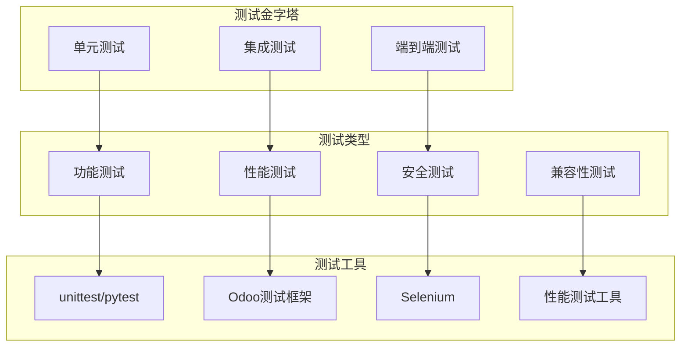

# 测试策略设计

## 测试策略概述

在Odoo 17开发中，建立完善的测试策略是保证代码质量、系统稳定性和用户体验的关键。本策略涵盖单元测试、集成测试、端到端测试等多个层面。

### 测试策略架构


## 单元测试设计

### 基础单元测试
```python
# -*- coding: utf-8 -*-
"""
单元测试示例
"""

from odoo.tests.common import TransactionCase
from odoo.exceptions import ValidationError, UserError
from datetime import datetime, timedelta


class TestSaleOrder(TransactionCase):
    """销售订单单元测试"""
    
    def setUp(self):
        """测试前准备"""
        super().setUp()
        
        # 创建测试数据
        self.partner = self.env['res.partner'].create({
            'name': 'Test Customer',
            'email': 'test@example.com',
            'phone': '+1234567890'
        })
        
        self.product = self.env['product.product'].create({
            'name': 'Test Product',
            'type': 'product',
            'list_price': 100.0,
            'standard_price': 80.0
        })
        
        self.sale_order = self.env['sale.order'].create({
            'partner_id': self.partner.id,
            'date_order': datetime.now(),
            'order_line': [(0, 0, {
                'product_id': self.product.id,
                'product_uom_qty': 2,
                'price_unit': 100.0
            })]
        })
    
    def test_sale_order_creation(self):
        """测试销售订单创建"""
        # 验证订单创建
        self.assertTrue(self.sale_order.id)
        self.assertEqual(self.sale_order.partner_id, self.partner)
        self.assertEqual(self.sale_order.state, 'draft')
        
        # 验证订单行
        self.assertEqual(len(self.sale_order.order_line), 1)
        order_line = self.sale_order.order_line[0]
        self.assertEqual(order_line.product_id, self.product)
        self.assertEqual(order_line.product_uom_qty, 2)
        self.assertEqual(order_line.price_unit, 100.0)
    
    def test_amount_total_calculation(self):
        """测试订单总额计算"""
        # 计算总额
        expected_total = 2 * 100.0  # 数量 * 单价
        self.assertEqual(self.sale_order.amount_total, expected_total)
        
        # 修改订单行
        self.sale_order.order_line[0].write({
            'product_uom_qty': 3,
            'price_unit': 150.0
        })
        
        # 重新计算
        expected_total = 3 * 150.0
        self.assertEqual(self.sale_order.amount_total, expected_total)
    
    def test_order_confirmation(self):
        """测试订单确认"""
        # 确认订单
        self.sale_order.action_confirm()
        
        # 验证状态变更
        self.assertEqual(self.sale_order.state, 'sale')
        
        # 验证库存移动创建
        stock_moves = self.env['stock.move'].search([
            ('origin', '=', self.sale_order.name)
        ])
        self.assertTrue(stock_moves)
    
    def test_validation_errors(self):
        """测试验证错误"""
        # 测试空订单行
        empty_order = self.env['sale.order'].create({
            'partner_id': self.partner.id,
            'date_order': datetime.now(),
            'order_line': []
        })
        
        with self.assertRaises(ValidationError):
            empty_order.action_confirm()
        
        # 测试负数量
        self.sale_order.order_line[0].write({
            'product_uom_qty': -1
        })
        
        with self.assertRaises(ValidationError):
            self.sale_order.action_confirm()
    
    def test_custom_business_logic(self):
        """测试自定义业务逻辑"""
        # 测试自定义方法
        result = self.sale_order._compute_custom_field()
        self.assertIsNotNone(result)
        
        # 测试条件逻辑
        self.sale_order.write({'amount_total': 1000})
        self.assertTrue(self.sale_order._is_high_value_order())
        
        self.sale_order.write({'amount_total': 100})
        self.assertFalse(self.sale_order._is_high_value_order())


class TestSaleOrderLine(TransactionCase):
    """销售订单行单元测试"""
    
    def setUp(self):
        """测试前准备"""
        super().setUp()
        
        self.partner = self.env['res.partner'].create({
            'name': 'Test Customer'
        })
        
        self.product = self.env['product.product'].create({
            'name': 'Test Product',
            'list_price': 100.0
        })
        
        self.sale_order = self.env['sale.order'].create({
            'partner_id': self.partner.id,
            'date_order': datetime.now()
        })
        
        self.order_line = self.env['sale.order.line'].create({
            'order_id': self.sale_order.id,
            'product_id': self.product.id,
            'product_uom_qty': 2,
            'price_unit': 100.0
        })
    
    def test_line_creation(self):
        """测试订单行创建"""
        self.assertTrue(self.order_line.id)
        self.assertEqual(self.order_line.order_id, self.sale_order)
        self.assertEqual(self.order_line.product_id, self.product)
    
    def test_price_calculation(self):
        """测试价格计算"""
        # 测试小计计算
        expected_subtotal = 2 * 100.0
        self.assertEqual(self.order_line.price_subtotal, expected_subtotal)
        
        # 测试折扣计算
        self.order_line.write({
            'discount': 10  # 10% 折扣
        })
        
        expected_subtotal = 2 * 100.0 * 0.9
        self.assertEqual(self.order_line.price_subtotal, expected_subtotal)
    
    def test_product_change(self):
        """测试产品变更"""
        new_product = self.env['product.product'].create({
            'name': 'New Product',
            'list_price': 200.0
        })
        
        self.order_line.write({
            'product_id': new_product.id
        })
        
        # 验证产品变更
        self.assertEqual(self.order_line.product_id, new_product)
        self.assertEqual(self.order_line.price_unit, 200.0)
```

### 高级单元测试
```python
class TestSaleOrderAdvanced(TransactionCase):
    """高级销售订单测试"""
    
    def setUp(self):
        """测试前准备"""
        super().setUp()
        
        # 创建复杂测试数据
        self.company = self.env['res.company'].create({
            'name': 'Test Company',
            'currency_id': self.env.ref('base.USD').id
        })
        
        self.warehouse = self.env['stock.warehouse'].create({
            'name': 'Test Warehouse',
            'code': 'TW',
            'company_id': self.company.id
        })
        
        self.partner = self.env['res.partner'].create({
            'name': 'Test Customer',
            'company_id': self.company.id
        })
        
        self.product = self.env['product.product'].create({
            'name': 'Test Product',
            'type': 'product',
            'list_price': 100.0,
            'standard_price': 80.0
        })
    
    def test_multi_company_order(self):
        """测试多公司订单"""
        # 创建订单
        order = self.env['sale.order'].create({
            'partner_id': self.partner.id,
            'company_id': self.company.id,
            'warehouse_id': self.warehouse.id,
            'date_order': datetime.now(),
            'order_line': [(0, 0, {
                'product_id': self.product.id,
                'product_uom_qty': 1,
                'price_unit': 100.0
            })]
        })
        
        # 验证公司设置
        self.assertEqual(order.company_id, self.company)
        self.assertEqual(order.warehouse_id, self.warehouse)
    
    def test_currency_conversion(self):
        """测试货币转换"""
        # 创建不同货币的订单
        eur_currency = self.env.ref('base.EUR')
        
        order = self.env['sale.order'].create({
            'partner_id': self.partner.id,
            'currency_id': eur_currency.id,
            'date_order': datetime.now(),
            'order_line': [(0, 0, {
                'product_id': self.product.id,
                'product_uom_qty': 1,
                'price_unit': 100.0
            })]
        })
        
        # 验证货币设置
        self.assertEqual(order.currency_id, eur_currency)
    
    def test_bulk_operations(self):
        """测试批量操作"""
        # 创建多个订单
        orders = self.env['sale.order']
        for i in range(5):
            order = self.env['sale.order'].create({
                'partner_id': self.partner.id,
                'date_order': datetime.now(),
                'order_line': [(0, 0, {
                    'product_id': self.product.id,
                    'product_uom_qty': 1,
                    'price_unit': 100.0
                })]
            })
            orders += order
        
        # 批量确认
        orders.action_confirm()
        
        # 验证所有订单都已确认
        for order in orders:
            self.assertEqual(order.state, 'sale')
    
    def test_performance(self):
        """测试性能"""
        import time
        
        # 创建大量订单行
        start_time = time.time()
        
        order = self.env['sale.order'].create({
            'partner_id': self.partner.id,
            'date_order': datetime.now()
        })
        
        # 批量创建订单行
        line_vals = []
        for i in range(100):
            line_vals.append((0, 0, {
                'product_id': self.product.id,
                'product_uom_qty': 1,
                'price_unit': 100.0
            }))
        
        order.write({'order_line': line_vals})
        
        end_time = time.time()
        execution_time = end_time - start_time
        
        # 验证性能（应该在合理时间内完成）
        self.assertLess(execution_time, 5.0)  # 5秒内完成
        self.assertEqual(len(order.order_line), 100)
```

## 集成测试设计

### 业务流程测试
```python
class TestSaleOrderWorkflow(TransactionCase):
    """销售订单工作流集成测试"""
    
    def setUp(self):
        """测试前准备"""
        super().setUp()
        
        # 创建完整业务流程数据
        self.partner = self.env['res.partner'].create({
            'name': 'Test Customer',
            'email': 'test@example.com',
            'phone': '+1234567890',
            'property_account_position_id': False
        })
        
        self.product = self.env['product.product'].create({
            'name': 'Test Product',
            'type': 'product',
            'list_price': 100.0,
            'standard_price': 80.0,
            'taxes_id': [(6, 0, [self.env.ref('sale.tax_group_1').id])]
        })
        
        self.warehouse = self.env['stock.warehouse'].search([], limit=1)
        self.stock_location = self.warehouse.lot_stock_id
        
        # 设置库存
        self.env['stock.quant'].create({
            'product_id': self.product.id,
            'location_id': self.stock_location.id,
            'quantity': 100.0
        })
    
    def test_complete_sale_workflow(self):
        """测试完整销售工作流"""
        # 1. 创建销售订单
        order = self.env['sale.order'].create({
            'partner_id': self.partner.id,
            'warehouse_id': self.warehouse.id,
            'date_order': datetime.now(),
            'order_line': [(0, 0, {
                'product_id': self.product.id,
                'product_uom_qty': 5,
                'price_unit': 100.0
            })]
        })
        
        # 验证订单创建
        self.assertEqual(order.state, 'draft')
        self.assertEqual(order.amount_total, 500.0)
        
        # 2. 确认订单
        order.action_confirm()
        
        # 验证订单确认
        self.assertEqual(order.state, 'sale')
        
        # 验证库存移动创建
        stock_moves = self.env['stock.move'].search([
            ('origin', '=', order.name)
        ])
        self.assertTrue(stock_moves)
        self.assertEqual(stock_moves.product_uom_qty, 5)
        
        # 3. 创建发货单
        picking = self.env['stock.picking'].search([
            ('origin', '=', order.name)
        ])
        self.assertTrue(picking)
        
        # 4. 确认发货
        picking.action_confirm()
        picking.action_assign()
        picking.button_validate()
        
        # 验证发货完成
        self.assertEqual(picking.state, 'done')
        
        # 5. 创建发票
        invoice = order._create_invoices()
        self.assertTrue(invoice)
        
        # 6. 确认发票
        invoice.action_post()
        
        # 验证发票确认
        self.assertEqual(invoice.state, 'posted')
    
    def test_inventory_integration(self):
        """测试库存集成"""
        # 创建订单
        order = self.env['sale.order'].create({
            'partner_id': self.partner.id,
            'date_order': datetime.now(),
            'order_line': [(0, 0, {
                'product_id': self.product.id,
                'product_uom_qty': 10,
                'price_unit': 100.0
            })]
        })
        
        # 确认订单
        order.action_confirm()
        
        # 验证库存预留
        stock_moves = self.env['stock.move'].search([
            ('origin', '=', order.name)
        ])
        
        for move in stock_moves:
            self.assertEqual(move.state, 'assigned')
            self.assertEqual(move.product_uom_qty, 10)
    
    def test_accounting_integration(self):
        """测试会计集成"""
        # 创建订单
        order = self.env['sale.order'].create({
            'partner_id': self.partner.id,
            'date_order': datetime.now(),
            'order_line': [(0, 0, {
                'product_id': self.product.id,
                'product_uom_qty': 1,
                'price_unit': 100.0
            })]
        })
        
        # 确认订单
        order.action_confirm()
        
        # 创建发票
        invoice = order._create_invoices()
        invoice.action_post()
        
        # 验证会计科目
        account_lines = invoice.line_ids
        self.assertTrue(account_lines)
        
        # 验证借方和贷方平衡
        debit_total = sum(line.debit for line in account_lines)
        credit_total = sum(line.credit for line in account_lines)
        self.assertEqual(debit_total, credit_total)
```

### API集成测试
```python
class TestSaleOrderAPI(TransactionCase):
    """销售订单API集成测试"""
    
    def setUp(self):
        """测试前准备"""
        super().setUp()
        
        self.partner = self.env['res.partner'].create({
            'name': 'API Test Customer'
        })
        
        self.product = self.env['product.product'].create({
            'name': 'API Test Product',
            'list_price': 100.0
        })
    
    def test_xmlrpc_api(self):
        """测试XML-RPC API"""
        # 模拟XML-RPC调用
        order_data = {
            'partner_id': self.partner.id,
            'date_order': datetime.now().strftime('%Y-%m-%d'),
            'order_line': [(0, 0, {
                'product_id': self.product.id,
                'product_uom_qty': 1,
                'price_unit': 100.0
            })]
        }
        
        # 创建订单
        order_id = self.env['sale.order'].create(order_data).id
        
        # 验证订单创建
        order = self.env['sale.order'].browse(order_id)
        self.assertTrue(order.id)
        self.assertEqual(order.partner_id, self.partner)
    
    def test_rest_api(self):
        """测试REST API"""
        # 模拟REST API调用
        order_data = {
            'partner_id': self.partner.id,
            'date_order': datetime.now().isoformat(),
            'order_line': [{
                'product_id': self.product.id,
                'product_uom_qty': 1,
                'price_unit': 100.0
            }]
        }
        
        # 创建订单
        order = self.env['sale.order'].create(order_data)
        
        # 验证订单创建
        self.assertTrue(order.id)
        self.assertEqual(order.amount_total, 100.0)
    
    def test_webhook_integration(self):
        """测试Webhook集成"""
        # 创建订单
        order = self.env['sale.order'].create({
            'partner_id': self.partner.id,
            'date_order': datetime.now(),
            'order_line': [(0, 0, {
                'product_id': self.product.id,
                'product_uom_qty': 1,
                'price_unit': 100.0
            })]
        })
        
        # 模拟Webhook调用
        webhook_data = {
            'order_id': order.id,
            'event': 'order_created',
            'timestamp': datetime.now().isoformat()
        }
        
        # 处理Webhook
        result = order._process_webhook(webhook_data)
        self.assertTrue(result)
```

## 端到端测试设计

### 用户界面测试
```python
from odoo.tests.common import HttpCase


class TestSaleOrderUI(HttpCase):
    """销售订单用户界面测试"""
    
    def test_sale_order_form(self):
        """测试销售订单表单"""
        # 访问销售订单页面
        self.start_tour('/web', 'sale_order_form_tour', login='admin')
        
        # 验证页面加载
        self.assertTrue(True)  # 如果tour完成，说明页面正常
    
    def test_sale_order_list(self):
        """测试销售订单列表"""
        # 访问销售订单列表
        self.start_tour('/web#action=sale.action_orders', 'sale_order_list_tour', login='admin')
        
        # 验证列表功能
        self.assertTrue(True)
    
    def test_sale_order_workflow(self):
        """测试销售订单工作流"""
        # 完整工作流测试
        self.start_tour('/web', 'sale_order_workflow_tour', login='admin')
        
        # 验证工作流完成
        self.assertTrue(True)


class TestSaleOrderMobile(HttpCase):
    """销售订单移动端测试"""
    
    def test_mobile_sale_order(self):
        """测试移动端销售订单"""
        # 模拟移动设备
        self.browser.set_window_size(375, 667)  # iPhone尺寸
        
        # 访问移动端页面
        self.start_tour('/web', 'mobile_sale_order_tour', login='admin')
        
        # 验证移动端功能
        self.assertTrue(True)
```

### 性能测试
```python
import time
from odoo.tests.common import TransactionCase


class TestSaleOrderPerformance(TransactionCase):
    """销售订单性能测试"""
    
    def setUp(self):
        """测试前准备"""
        super().setUp()
        
        # 创建大量测试数据
        self.partners = self.env['res.partner']
        self.products = self.env['product.product']
        
        # 创建100个客户
        for i in range(100):
            partner = self.env['res.partner'].create({
                'name': f'Performance Test Customer {i}',
                'email': f'customer{i}@example.com'
            })
            self.partners += partner
        
        # 创建50个产品
        for i in range(50):
            product = self.env['product.product'].create({
                'name': f'Performance Test Product {i}',
                'list_price': 100.0 + i
            })
            self.products += product
    
    def test_bulk_order_creation(self):
        """测试批量订单创建性能"""
        start_time = time.time()
        
        # 创建100个订单
        orders = self.env['sale.order']
        for i in range(100):
            order = self.env['sale.order'].create({
                'partner_id': self.partners[i].id,
                'date_order': datetime.now(),
                'order_line': [(0, 0, {
                    'product_id': self.products[i % 50].id,
                    'product_uom_qty': 1,
                    'price_unit': 100.0
                })]
            })
            orders += order
        
        end_time = time.time()
        execution_time = end_time - start_time
        
        # 验证性能（100个订单应该在10秒内完成）
        self.assertLess(execution_time, 10.0)
        self.assertEqual(len(orders), 100)
    
    def test_complex_query_performance(self):
        """测试复杂查询性能"""
        # 创建测试数据
        orders = self.env['sale.order']
        for i in range(1000):
            order = self.env['sale.order'].create({
                'partner_id': self.partners[i % 100].id,
                'date_order': datetime.now() - timedelta(days=i % 365),
                'order_line': [(0, 0, {
                    'product_id': self.products[i % 50].id,
                    'product_uom_qty': 1,
                    'price_unit': 100.0
                })]
            })
            orders += order
        
        # 测试复杂查询
        start_time = time.time()
        
        # 查询过去一年的订单统计
        result = self.env['sale.order'].read_group(
            [('date_order', '>=', datetime.now() - timedelta(days=365))],
            ['amount_total:sum', 'id:count'],
            ['partner_id']
        )
        
        end_time = time.time()
        execution_time = end_time - start_time
        
        # 验证性能（复杂查询应该在5秒内完成）
        self.assertLess(execution_time, 5.0)
        self.assertTrue(result)
    
    def test_memory_usage(self):
        """测试内存使用"""
        import psutil
        import os
        
        process = psutil.Process(os.getpid())
        initial_memory = process.memory_info().rss / 1024 / 1024  # MB
        
        # 创建大量数据
        orders = self.env['sale.order']
        for i in range(1000):
            order = self.env['sale.order'].create({
                'partner_id': self.partners[i % 100].id,
                'date_order': datetime.now(),
                'order_line': [(0, 0, {
                    'product_id': self.products[i % 50].id,
                    'product_uom_qty': 1,
                    'price_unit': 100.0
                })]
            })
            orders += order
        
        current_memory = process.memory_info().rss / 1024 / 1024  # MB
        memory_increase = current_memory - initial_memory
        
        # 验证内存使用（增加应该小于100MB）
        self.assertLess(memory_increase, 100)
```

## 测试工具和配置

### 测试配置文件
```python
# test_config.py
"""
测试配置文件
"""

import os
import logging

# 测试数据库配置
TEST_DB_CONFIG = {
    'host': os.getenv('TEST_DB_HOST', 'localhost'),
    'port': int(os.getenv('TEST_DB_PORT', 5432)),
    'user': os.getenv('TEST_DB_USER', 'odoo'),
    'password': os.getenv('TEST_DB_PASSWORD', 'odoo'),
    'database': os.getenv('TEST_DB_NAME', 'odoo_test')
}

# 测试日志配置
TEST_LOG_CONFIG = {
    'level': logging.DEBUG,
    'format': '%(asctime)s - %(name)s - %(levelname)s - %(message)s',
    'handlers': [
        logging.StreamHandler(),
        logging.FileHandler('test.log')
    ]
}

# 性能测试配置
PERFORMANCE_CONFIG = {
    'timeout': 30,  # 秒
    'memory_limit': 500,  # MB
    'cpu_limit': 80  # 百分比
}

# 测试数据配置
TEST_DATA_CONFIG = {
    'partners_count': 100,
    'products_count': 50,
    'orders_count': 1000
}
```

### 测试工具类
```python
class TestHelper:
    """测试辅助工具类"""
    
    @staticmethod
    def create_test_partner(env, name='Test Partner'):
        """创建测试客户"""
        return env['res.partner'].create({
            'name': name,
            'email': f'{name.lower().replace(" ", ".")}@example.com',
            'phone': '+1234567890'
        })
    
    @staticmethod
    def create_test_product(env, name='Test Product', price=100.0):
        """创建测试产品"""
        return env['product.product'].create({
            'name': name,
            'type': 'product',
            'list_price': price,
            'standard_price': price * 0.8
        })
    
    @staticmethod
    def create_test_order(env, partner, products):
        """创建测试订单"""
        order_lines = []
        for product in products:
            order_lines.append((0, 0, {
                'product_id': product.id,
                'product_uom_qty': 1,
                'price_unit': product.list_price
            }))
        
        return env['sale.order'].create({
            'partner_id': partner.id,
            'date_order': datetime.now(),
            'order_line': order_lines
        })
    
    @staticmethod
    def measure_execution_time(func):
        """测量执行时间装饰器"""
        def wrapper(*args, **kwargs):
            start_time = time.time()
            result = func(*args, **kwargs)
            end_time = time.time()
            execution_time = end_time - start_time
            print(f"{func.__name__} 执行时间: {execution_time:.2f}秒")
            return result
        return wrapper
```

## 最佳实践

### 测试设计原则
1. **测试独立性**：每个测试应该独立运行
2. **数据隔离**：测试数据不应该相互影响
3. **可重复性**：测试结果应该一致
4. **快速执行**：测试应该快速完成

### 测试覆盖策略
1. **功能覆盖**：覆盖所有业务功能
2. **边界测试**：测试边界条件
3. **异常测试**：测试异常情况
4. **性能测试**：测试性能要求

### 持续集成
1. **自动化测试**：集成到CI/CD流程
2. **测试报告**：生成详细的测试报告
3. **失败通知**：测试失败时及时通知
4. **质量门禁**：设置质量门槛

## 学习建议

### 理解重点
1. **测试策略**：理解测试金字塔和测试类型
2. **测试工具**：掌握Odoo测试框架和工具
3. **测试设计**：学会设计有效的测试用例
4. **持续集成**：建立自动化测试流程

### 实践建议
- 从单元测试开始
- 逐步增加集成测试
- 建立端到端测试
- 集成到CI/CD流程
- 定期维护和更新测试

## 相关链接
- [[代码规范标准]] - 代码质量标准
- [[代码审查机制]] - 代码质量保证
- [[团队协作规范]] - 团队开发规范
- [[文档管理规范]] - 测试文档管理
