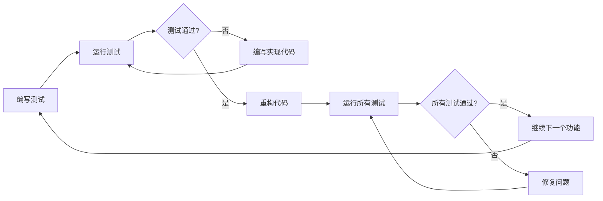

# 测试驱动开发

## 🎯 学习目标
- 掌握测试驱动开发(TDD)的基本原理和方法
- 学会编写高质量的单元测试和集成测试
- 理解测试策略和测试金字塔的应用

## 📊 TDD基础

### 测试驱动开发流程
TDD遵循"红-绿-重构"循环：编写失败测试→编写最少代码使测试通过→重构优化代码。

### TDD循环图


## 🧪 单元测试

### Odoo测试框架
```python
# tests/test_sale_order.py
from odoo.tests.common import TransactionCase
from odoo.exceptions import ValidationError, UserError
from odoo import fields

class TestSaleOrder(TransactionCase):
    """销售订单测试类"""
    
    def setUp(self):
        """测试前置条件"""
        super().setUp()
        
        # 创建测试数据
        self.partner = self.env['res.partner'].create({
            'name': '测试客户',
            'email': 'test@example.com',
        })
        
        self.product = self.env['product.product'].create({
            'name': '测试产品',
            'list_price': 100.0,
            'type': 'product',
        })
        
        self.sale_order = self.env['sale.order'].create({
            'partner_id': self.partner.id,
            'date_order': fields.Date.today(),
        })
    
    def tearDown(self):
        """测试后清理"""
        super().tearDown()
        # 清理测试数据
    
    def test_create_sale_order(self):
        """测试创建销售订单"""
        # Arrange (准备)
        partner_id = self.partner.id
        expected_state = 'draft'
        
        # Act (执行)
        order = self.env['sale.order'].create({
            'partner_id': partner_id,
            'date_order': fields.Date.today(),
        })
        
        # Assert (断言)
        self.assertEqual(order.partner_id.id, partner_id)
        self.assertEqual(order.state, expected_state)
        self.assertTrue(order.active)
    
    def test_add_order_line(self):
        """测试添加订单行"""
        # 测试数据准备
        product_qty = 5.0
        product_price = 100.0
        
        # 执行操作
        self.env['sale.order.line'].create({
            'order_id': self.sale_order.id,
            'product_id': self.product.id,
            'product_uom_qty': product_qty,
            'price_unit': product_price,
        })
        
        # 验证结果
        self.assertEqual(len(self.sale_order.order_line), 1)
        
        line = self.sale_order.order_line[0]
        self.assertEqual(line.product_uom_qty, product_qty)
        self.assertEqual(line.price_unit, product_price)
        self.assertEqual(line.product_uom_qty * line.price_unit, line.price_subtotal)
    
    def test_confirm_order(self):
        """测试确认订单"""
        # 前置条件：添加订单行
        self.env['sale.order.line'].create({
            'order_id': self.sale_order.id,
            'product_id': self.product.id,
            'product_uom_qty': 2.0,
        })
        
        # 执行确认操作
        self.sale_order.action_confirm()
        
        # 验证状态变化
        self.assertEqual(self.sale_order.state, 'sale')
        self.assertTrue(self.sale_order.confirmation_date)
    
    def test_cancel_order(self):
        """测试取消订单"""
        # 执行取消操作
        self.sale_order.action_cancel()
        
        # 验证状态
        self.assertEqual(self.sale_order.state, 'cancel')
    
    def test_order_amount_calculation(self):
        """测试订单金额计算"""
        # 添加多个订单行
        line1 = self.env['sale.order.line'].create({
            'order_id': self.sale_order.id,
            'product_id': self.product.id,
            'product_uom_qty': 2.0,
            'price_unit_wait': 50.0,
        })
        
        line2 = self.env['sale.order.line'].create({
            'order_id': self.sale_order.id,
            'product_id': self.product.id,
            'product_uom_qty': 3.0,
            'price_unit': 75.0,
        })
        
        # 触发计算
        self.sale_order._compute_amount_all()
        
        # 验证计算结果
        expected_amount = (2.0 * 50.0) + (3.0 * 75.0)  # 325.0
        self.assertEqual(self.sale_order.amount_total, expected_amount)
    
    def test_order_validation_errors(self):
        """测试订单验证错误"""
        # 测试空客户验证
        with self.assertRaises(ValidationError):
            self.env['sale.order'].create({
                'partner_id': False,
                'date_order': fields.Date.today(),
            })
        
        # 测试负数量验证
        with self.assertRaises(ValidationError):
            self.env['sale.order.line'].create({
                'order_id': self.sale_order.id,
                'product_id': self.product.id,
                'product_uom_qty': -1.0,
            })
    
    def test_order_business_rules(self):
        """测试业务规则"""
        # 测试信用卡客户必须提供信用额度
        credit_customer = self.env['res.partner'].create({
            'name': '信用卡客户',
        })
        
        # 添加设置信用限度类型的组
        if not self.env['res.groups'].search([('name', '=', 'Credit Limit Required')]):
            self.env['res.groups'].create({
                'name': 'Credit Limit Required',
                'category_id': self.env.ref('base.module_category_human_resources').id,
            })
        
        # 如果没有信用额度，应该有相应提示
        order = self.env['sale.order'].create({
            'partner_id': credit_customer.id,
            'date_order': fields.Date.today(),
        })
        
        # 验证业务逻辑（这里需要根据实际业务规则调整）
        self.assertTrue(order)

class TestSaleOrderIntegration(TransactionCase):
    """销售订单集成测试"""
    
    def setUp(self):
        super().setUp()
        self.sale_order_model = self.env['sale.order']
        self.sale_order_line_model = self.env['sale.order.line']
    
    def test_full_order_workflow(self):
        """测试完整订单工作流"""
        # 创建客户和产品
        partner = self.env['res.partner'].create({
            'name': '集成测试客户',
            'customer_rank': 1,
        })
        
        product = self.env['product.product'].create({
            'name': '集成测试产品',
            'list_price': 200.0,
            'type': 'product',
        })
        
        # 创建订单
        order = self.sale_order_model.create({
            'partner_id': partner.id,
            'date_order': fields.Date.today(),
        })
        
        # 添加订单行
        self.sale_order_line_model.create({
            'order_id': order.id,
            'product_id': product.id,
            'product_uom_qty': 2.0,
        })
        
        # 确认订单
        order.action_confirm()
        
        # 创建拣货单
        picking = order.picking_ids[0] if order.picking_ids else None
        self.assertTrue(picking)
        
        # 确认拣货
        picking.action_confirm()
        
        # 验证拣货状态
        self.assertEqual(picking.state, 'assigned')
    
    def test_inventory_update(self):
        """测试库存更新"""
        # 创建产品
        product = self.env['product.product'].create({
            'name': '库存测试产品',
            'type': 'product',
            'categ_id': self.env.ref('product.product_category_all').id,
        })
        
        # 创建库存位置
        stock_location = self.env.ref('stock.stock_location_stock')
        
        # 设置初始库存
        self.env['stock.quant'].create({
            'product_id': product.id,
            'location_id': stock_location.id,
            'quantity': 100.0,
        })
        
        # 验证库存
        available_qty = product.with_context(
            location=stock_location.id
        ).qty_available
        
        self.assertEqual(available_qty, 100.0)
```

### 模拟和存根测试
```python
# tests/test_order_service.py
from unittest.mock import Mock, patch, MagicMock
from odoo.tests.common import TransactionCase

class TestOrderService(TransactionCase):
    """订单服务测试类"""
    
    def setUp(self):

        super().setUp()
        self.order_service = self.env['order.service']
    
    @patch('odoo.addons.sale.models.sale_order.SaleOrder.send_confirmation_email')
    def test_send_confirmation_email(self, mock_email):
        """测试发送确认邮件（使用模拟）"""
        # 设置模拟返回值
        mock_email.return_value = True
        
        # 创建订单
        order = self.env['sale.order'].create
        
        order = self.env['sale.order'].create({
            'partner_id': self.env['res.partner'].create({'name': 'Test Partner'}).id,
            'date_order': fields.Date.today(),
        })
        
        # 调用方法
        result = order.send_confirmation_email()
        
        # 验证模拟被调用
        mock_email.assert_called_once_with()
        self.assertTrue(result)
    
    @patch('odoo.addons.account.models.account_move.AccountMove.validate')
    def test_invoice_generation(self, mock_validate):
        """测试发票生成（使用模拟）"""
        # 设置模拟
        mock_invoice = Mock()
        mock_invoice.id = 123
        mock_validate.return_value = mock_invoice
        
        # 创建订单
        order = self.env['sale.order'].create({
            'partner_id': self.env['res.partner'].create({'name': 'Test Partner'}).id,
            'date_order': fields.Date.today(),
        })
        
        # 创建订单行
        self.env['sale.order.line'].create({
            'order_id': order.id,
            'product_id': self.env['product.product'].create({
                'name': 'Test Product',
                'list_price': 100.0,
                'type': 'product',
            }).id,
            'product_uom_qty': 1.0,
        })
        
        # 确认订单
        order.action_confirm()
        
        # 尝试创建发票
        invoice = order._create_invoices()
        
        # 验证结果
        self.assertTrue(invoice)
        mock_validate.assert_called_once()
    
    def test_external_api_integration(self):
        """测试外部API集成"""
        with patch('requests.post') as mock_post:
            # 设置模拟响应
            mock_response = Mock()
            mock_response.json.return_value = {'status': 'success', 'id': 456}
            mock_response.status_code = 200
            mock_post.return_value = mock_response
            
            # 调用API
            result = self.order_service.call_external_api({'test': 'data'})
            
            # 验证调用
            mock_post.assert_called_once()
            self.assertEqual(result, {'status': 'success', 'id': 456})
    
    def test_database_transaction_rollback(self):
        """测试数据库事务回滚"""
        # 开始事务
        self.env.cr.savepoint('test_transaction')
        
        try:
            # 执行可能失败的操作
            self.env['invalid.model'].create({'invalid_field': 'value'})
        except Exception:
            # 回滚事务
            self.env.cr.rollback()
            self.env.cr.commit()  # PG数据库需要显式提交
        
        # 验证数据没有被提交
        invoice_count = self.env['account.move'].search_count([])
        # 这里应该验证没有增加记录
```

## 🔄 构建测试

### 集成测试
```python
# tests/test_integration.py
from odoo.tests.common import TransactionCase
from odoo.tests.common import tagged

@tagged('post_install', '-at_install')
class TestSaleAccountingIntegration(TransactionCase):
    """销售财务集成测试"""
    
    def setUp(self):
        super().setUp()
        # 设置多公司环境中可能出现的财务流程
    
    def test_sale_to_accounting_workflow(self):
        """测试销售到财务的完整工作流"""
        # 创建客户
        customer = self.env['res.partner'].create({
            'name': '财务集成测试客户',
            'property_account_receivable_id': 
                self.env['account.account'].search([('code', '=', '120000')], limit=1).id,
        })
        
        # 创建产品配置
        product = self.env['product.product'].create({
            'name': '财务集成测试产品',
            'type': 'product',
            'property_account_income_id':
                self.env['account.account'].search([('code', '=', '400000')], limit=1).id,
            'property_account_expense_id':
                self.env['account.account'].search([('code', '=', '600000')], limit=1).id,
        })
        
        # 创建销售订单
        order = self.env['sale.order'].create({
            'partner_id': customer.id,
            'date_order': fields.Date.today(),
        })
        
        # 添加订单行
        self.env['sale.order.line'].create({
            'order_id': order.id,
            'product_id': product.id,
            'product_uom_qty': 2.0,
            'price_unit': 150.0,
        })
        
        # 确认订单
        order.action_confirm()
        
        # 创建发票
        invoice = order._create_invoices()
        
        # 验证发票
        self.assertEqual(invoice.state, 'draft')
        self.assertEqual(len(invoice.invoice_line_ids), 1)
        self.assertEqual(invoice.amount_total, 300.0)
        
        # 确认发票
        invoice.action_post()
        
        # 验证发票已过账
        self.assertEqual(invoice.state, 'posted')

@tagged('post_install', '-at_install')
class TestMultiModuleIntegration(TransactionCase):
        
    def test_sale_stock_accounting_integration(self):
        """测试销售、库存、财务三大模块集成"""
        # 这个测试验证三个模块之间的数据一致性
        # 前置条件设置...
        
        customer = self.env['res.partner'].create({'name': '集成测试客户'})
        
        product = self.env['product.product'].create({
            'name': '集成测试产品',
            'type': 'product',
        })
        
        order = self.env['sale.order'].create({
            'partner_id': customer.id,
            'date_order': fields.Date.today(),
        })
        
        self.env['sale.order.line'].create({
            'order_id': order.id,
            'product_id': product.id,
            'product_uom_qty': 5.0,
            'price_unit': 200.0,
        })
        
        order.action_confirm()
        picking = order.picking_ids[0]
        
        # 验证拣货状态
        self.assertEqual(picking.state, 'assigned')
        
        # 执行拣货
        picking.action_confirm()
        
        # 验证库存变化
        quant = self.env['stock.quant'].search([
            ('product_id', '=', product.id),
            ('location_id', '=', picking.location_id.id)
        ])
        # 具体验证逻辑...

@tagged('external_system', '-at_install')
class TestExternalSystemIntegration(TransactionCase):
    """外部系统集成测试"""
    
    def test_third_party_api_integration(self):
        """测试第三方API集成"""
        # 使用真实的API端点测试（需要测试环境）
        pass
```

### 性能测试
```python
# tests/test_performance.py
import time
from odoo.tests.common import TransactionCase

class TestOrderPerformance(TransactionCase):
    """订单性能测试"""
    
    def test_bulk_order_creation_performance(self):
        """测试批量订单创建性能"""
        start_time = time.time()
        
        # 创建大量订单
        orders = []
        for i in range(100):
            order = self.env['sale.order'].create({
                'partner_id': self.env['res.partner'].create({'name': f'客户_{i}'}).id,
                'date_order': fields.Date.today(),
            })
            orders.append(order)
        
        end_time = time.time()
        creation_time = end_time - start_time
        
        # 断言性能指标
        self.assertLess(creation_time, 30.0)  # 应在30秒内完成
        self.assertEqual(len(orders), 100)
    
    def test_large_dataset_query_performance(self):
        """测试大数据集查询性能"""
        # 准备大量测试数据
        customers = []
        for i in range(1000):
            customer = self.env['res.partner'].create({
                'name': f'性能测试客户_{i}',
                'customer_rank': 1 if i % 2 == 0 else 0,
            })
            customers.append(customer.id)
        
        # 测试查询性能
        start_time = time.time()
        
        result = self.env['res.partner'].search([
            ('customer_rank', '>', 0),
            ('name', 'like', '性能测试')
        ])
        
        end_time = time.time()
        query_time = end_time - start_time
        
        # 验证性能
        self.assertLess(query_time, 5.0)
        self.assertGreater(len(result), 0)

@tagged('load_test', '-standard', '-at_install')
class TestLoadTesting(TransactionCase):
    """负载测试"""
    
    def test_concurrent_order_creation(self):
        """测试并发订单创建"""
        # 这个测试需要在多线程/多进程环境中运行
        import threading
        
        results = []
        
        def create_orders_batch(start_idx, end_idx):
            for i in range(start_idx, end_idx):
                order = self.env['sale.order'].create({
                    'partner_id': self.env['res.partner'].create({
                        'name': f'并发测试客户_{i}'
                    }).id,
                    'date_order': fields.Date.today(),
                })
                results.append(order.id)
        
        # 创建多个线程同时创建订单
        threads = []
        batch_size = 50
        
        for i in range(0, 200, batch_size):
            thread = threading.Thread(target=create_orders_batch, args=(i, i + batch_size))
            threads.append(thread)
            thread.start()
        
        for thread in threads:
            thread.join()
        
        # 验证结果
        self.assertEqual(len(results), 200)
        self.assertEqual(len(set(results)), len(results))  # 无重复ID
```

### UI测试
```python
# tests/test_ui.py
from odoo.tests.common import HttpCase

class TestUIWorkflow(HttpCase):
    """UI工作流测试"""
    
    def test_sale_order_ui_workflow(self):
        """测试销售订单UI工作流"""
        # 这个测试需要在浏览器中运行
        
        # 登录系统
        self.phantom_js("/web/",
                        "odoo.__DEBUG__.services['web_tour.tour'].run('sale_order_tour')",
                        "odoo.__DEBUG__.services['web_tour.tour'].tours.sale_order_tour",
                        login="admin")
        
        # 验证页面元素和用户交互
        # 这里需要实际的UI测试框架支持
        pass

@tagged('selenium', '-at_install')
class TestSeleniumUI(HttpCase):
    """基于Selenium的UI测试"""
    
    def test_complete_order_ui_workflow(self):
        """完整的订单UI工作流测试"""
        # 需要selenium环境，实际运行会比较复杂
        
        # 打开浏览器
        # self.driver.get(f"{self.env['ir.config_parameter'].get_param('web.base.url')}/web/")
        
        # 模拟用户操作
        # ... 填写表单、点击按钮等
        
        # 验证页面状态
        # ... 检查元素、数据等
        
        pass
```

## 🛠️ 测试工具和配置

### 测试配置
```python
# tests/__init__.py
# 测试模块初始化文件

# tests/test_common.py
from odoo.tests.common import TransactionCase
from odoo.tests.common import SavepointCase

class BaseTestCase(SavepointCase):
    """基础测试用例类"""
    
    @classmethod
    def setUpClass(cls):
        super().setUpClass()
        
        # 设置通用的测试数据
        cls.test_company = cls.env['res.company'].create({
            'name': '测试公司',
        })
        
        cls.test_currency = cls.env.ref('base.USD')
        cls.test_uom = cls.env.ref('product.product_uom_unit')

class DataTestCase(TransactionCase):
    """数据处理测试用例类"""
    
    @classmethod
    def setUpClass(cls):
        super().setUpClass()
        
        # 创建测试数据集
        cls.create_test_data()
    
    @classmethod
    def create_test_data(cls):
        """创建测试数据"""
        # 创建测试客户
        cls.customers = cls.env['res.partner'].create([
            {'name': f'测试客户_{i}', 'customer_rank': 1}
            for i in range(10)
        ])
        
        # 创建测试产品
        cls.products = cls.env['product.product'].create([
            {
                'name': f'测试产品_{i}',
                'list_price': 100.0 + i * 10,
                'type': 'product',
            }
            for i in range(10)
        ])
```

### 测试数据工厂
```python
# tests/factories.py
class OrderFactory:
    """订单工厂类"""
    
    @staticmethod
    def create_order_tests(env, partner=None, **kwargs):
        """创建测试订单"""
        if not partner:
            partner = env['res.partner'].create({
                'name': '工厂测试客户',
            })
        
        order_data = {
            'partner_id': partner.id,
            'date_order': fields.Date.today(),
            **kwargs
        }
        
        return env['sale.order'].create(order_data)
    
    @staticmethod
    def create_order_with_lines(env, line_count=3, **kwargs):
        """创建带订单行的测试订单"""
        order = OrderFactory.create_order_tests(env, **kwargs)
        
        # 创建产品并添加订单行
        for i in range(line_count):
            product = env['product.product'].create({
                'name': f'工厂产品_{i}',
                'list_price': 100.0 + i * 50,
                'type': 'product',
            })
            
            env['sale.order.line'].create({
                'order_id': order.id,
                'product_id': product.id,
                'product_uom_qty': 1.0 + i,
            })
        
        return order

class PartnerFactory:
    """合作伙伴工厂类"""
    
    @staticmethod
    def create_customer(env, **kwargs):
        """创建测试客户"""
        data = {
            'name': f"客户_{kwargs.get('id', 1)}",
            'customer_rank': 1,
            **kwargs
        }
        return env['res.partner'].create(data)
    
    @staticmethod
    def create_supplier(env, **kwargs):
        """创建测试供应商"""
        data = {
            'name': f"供应商_{kwargs.get('id', 1)}",
            'supplier_rank': 1,
            **kwargs
        }
        return env['res.partner'].create(data)

# 在测试中使用工厂
class TestWithFactory(BaseTestCase):
    """使用工厂的测试类"""
    
    def test_order_with_factory(self):
        """使用工厂创建测试数据"""
        # 创建订单
        order = OrderFactory.create_order_with_lines(self.env, line_count=2)
        
        # 验证订单
        self.assertEqual(len(order.order_line), 2)
        self.assertEqual(order.state, 'draft')
```

## 🔗 相关链接

### 下一步学习
- [[部署与维护策略]] - 学习部署与维护策略
- [[代码规范与质量]] - 了解代码规范与质量
- [[持续集成]] - 掌握持续集成

### 实践建议
- 坚持TDD开发流程
- 编写全面覆盖的测试用例
- 维护良好的测试数据

## 📝 思考题

### 基础理解
1. TDD的核心原则是什么？
2. 单元测试和集成测试的区别是什么？
3. 模拟对象的作用是什么？

### 深入思考
1. 如何设计高效的测试策略？
2. 复杂业务的测试如何设计？
3. 如何平衡测试覆盖率与开发效率？

---

**学习进度**: ✅ 已完成  
**下一步**: [[部署与维护策略]]
