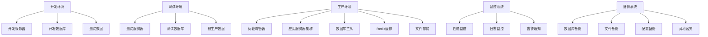

# 部署与维护策略

## 🎯 学习目标
- 掌握Odoo系统的部署策略和最佳实践
- 学会制定系统维护计划和监控策略
- 理解备份恢复、更新升级的关键要素

## 📊 部署架构

### 部署环境
Odoo系统的部署需要考虑开发、测试、生产三种环境的安全性和稳定性。

### 部署架构图


## 🚀 部署策略

### Docker容器化部署
```yaml
# docker-compose.yml
version: '3.8'

services:
  odoo:
    image: odoo:16.0
    container_name: odoo-app
    depends_on:
      - postgres
      - redis
    ports:
      - "8069:8069"
    volumes:
      - ./config:/etc/odoo
      - ./addons:/mnt/extra-addons
      - ./data/filestore:/var/lib/odoo/filestore
    environment:
      - HOST=postgres
      - USER=odoo
      - PASSWORD=odoo
    env_file:
      - .env
    restart: unless-stopped
    networks:
      - odoo-network

  postgres:
    image: postgres:13
    container_name: odoo-db
    environment:
      - POSTGRES_DB=odoo
      - POSTGRES_USER=odoo
      - POSTGRES_PASSWORD=odoo
    volumes:
      - postgres-data:/var/lib/postgresql/data
      - ./backup:/backup
    restart: unless-stopped
    networks:
      - odoo-network

  redis:
    image: redis:6-alpine
    container_name: odoo-cache
    volumes:
      - redis-data:/data
    restart: unless-stopped
    networks:
      - odoo-network

  nginx:
    image: nginx:alpine
    container_name: odoo-web
    ports:
      - "80:80"
      - "443:443"
    volumes:
      - ./nginx.conf:/etc/nginx/nginx.conf
      - ./ssl:/etc/ssl
    depends_on:
      - odoo
    restart: unless-stopped
    networks:
      - odoo-network

volumes:
  postgres-data:
  redis-data:

networks:
  odoo-network:
    driver: bridge
```

### Kubernetes部署
```yaml
# k8s/odoo-deployment.yaml
apiVersion: apps/v1
kind: Deployment
metadata:
  name: odoo
  labels:
    app: odoo
spec:
  replicas: 3
  selector:
    matchLabels:
      app: odoo
  template:
    metadata:
      labels:
        app: odoo
    spec:
      containers:
      - name: odoo
        image: odoo:16.0
        ports:
        - containerPort: 8069
        volumeMounts:
        - name: config
          mountPath: /etc/odoo
        - name: addons
          mountPath: /mnt/extra-addons
        - name: filestore
          mountPath: /var/lib/odoo/filestore
        environment:
        - name: HOST
          value: "postgres-service"
        - name: USER
          value: "odoo"
        - name: PASSWORD
          valueFrom:
            secretKeyRef:
              name: postgres-secret
              key: password
        resources:
          requests:
            memory: "512Mi"
            cpu: "250m"
          limits:
            memory: "2Gi"
            cpu: "1000m"
        livenessProbe:
          httpGet:
            path: /web/health
            port: 8069
          initialDelaySeconds: 30
          periodSeconds: 10
        readinessProbe:
          httpGet:
            path: /web/health
            port: 8069
          initialDelaySeconds: 15
          periodSeconds: 5
      volumes:
      - name: config
        configMap:
          name: odoo-config
      - name: addons
        persistentVolumeClaim:
          claimName: odoo-addons-pvc
      - name: filestore
        persistentVolumeClaim:
          claimName: odoo-filestore-pvc

---
apiVersion: v1
kind: Service
metadata:
  name: odoo-service
spec:
  selector:
    app: odoo
  ports:
  - port: 8069
    targetPort: 8069
  type: ClusterIP

---
apiVersion: networking.k8s.io/v1
kind: Ingress
metadata:
  name: odoo-ingress
  annotations:
    kubernetes.io/ingress.class: nginx
    cert-manager.io/cluster-issuer: letsencrypt-prod
spec:
  tls:
  - hosts:
    - odoo.example.com
    secretName: odoo-tls
  rules:
  - host: odoo.example.com
    http:
      paths:
      - path: /
        pathType: Prefix
        backend:
          service:
            name: odoo-service
            port:
              number: 8069
```

### 自动化部署脚本
```python
# deployment/deploy_manager.py
import os
import subprocess
import docker
import yaml
from pathlib import Path

class DeploymentManager:
    """部署管理器"""
    
    def __init__(self, environment='production'):
        self.environment = environment
        self.config = self._load_config()
        self.docker_client = docker.from_env()
    
    def _load_config(self):
        """加载配置文件"""
        config_path = Path(f"config/{self.environment}.yaml")
        with open(config_path, 'r') as f:
            return yaml.safe_load(f)
    
    def deploy_application(self):
        """部署应用"""
        try:
            print(f"开始部署到 {self.environment} 环境...")
            
            # 1. 检查前置条件
            self._check_prerequisites()
            
            # 2. 构建镜像
            self._build_images()
            
            # 3. 停止旧服务
            self._stop_old_services()
            
            # 4. 部署新服务
            self._deploy_new_services()
            
            # 5. 健康检查
            self._health_check()
            
            # 6. 通知服务器
            self._send_deployment_notification()
            
            print("部署成功完成!")
            
        except Exception as e:
            print(f"部署失败: {e}")
            self._rollback_deployment()
            raise
    
    def _check_prerequisites(self):
        """检查前置条件"""
        # 检查Docker是否运行
        try:
            self.docker_client.ping()
        except Exception:
            raise Exception("Docker daemon 未运行")
        
        # 检查配置目录
        required_dirs = ['config', 'ssl', 'backup']
        for dir_name in required_dirs:
            if not Path(dir_name).exists():
                os.makedirs(dir_name)
        
        # 检查环境变量
        required_vars = ['DATABASE_URL', 'REDIS_URL']
        for var in required_vars:
            if not os.getenv(var):
                raise Exception(f"缺少环境变量: {var}")
    
    def _build_images(self):
        """构建镜像"""
        dockerfile_path = Path("Dockerfile")
        if dockerfile_path.exists():
            print("构建自定义Odoo镜像...")
            image, logs = self.docker_client.images.build(
                path=".",
                tag=f"odoo-custom:{self.environment}"
            )
            print("镜像构建完成")
    
    def _stop_old_services(self):
        """停止旧服务"""
        try:
            print("停止旧版本服务...")
            subprocess.run([
                "docker-compose", "-f", "docker-compose.yml",
                "down", "--remove-orphans"
            ], check=True)
            print("旧服务已停止")
        except subprocess.CalledProcessError as e:
            print(f"停止服务失败: {e}")
    
    def _deploy_new_services(self):
        """部署新服务"""
        print("启动新版本服务...")
        
        proc = subprocess.run([
            "docker-compose", "-f", "docker-compose.yml",
            "--env-file", f".env.{self.environment}",
            "up", "-d"
        ], capture_output=True, text=True)
        
        if proc.returncode != 0:
            raise Exception(f"服务启动失败: {proc.stderr}")
        
        print("新服务已启动")
    
    def _health_check(self):
        """健康检查"""
        import time
        import requests
        
        health_url = "http://localhost:8069/web/health"
        max_retries = 30
        retry_interval = 10
        
        for i in range(max_retries):
            try:
                response = requests.get(health_url, timeout=10)
                if response.status_code == 200:
                    print("健康检查通过")
                    return
            
            except Exception as e:
                print(f"健康检查失败 (尝试 {i+1}/{max_retries}): {e}")
            
            if i < max_retries - 1:
                time.sleep(retry_interval)
        
        raise Exception("健康检查超时")
    
    def _send_deployment_notification(self):
        """发送部署通知"""
        # 发送邮件或Slack通知
        print("发送部署成功通知...")
        # 实现通知逻辑
    
    def _rollback_deployment(self):
        """回滚部署"""
        print("开始回滚...")
        # 实现回滚逻辑
        print("回滚完成")

# 使用示例
if __name__ == "__main__":
    deployer = DeploymentManager('production')
    deployer.deploy_application()
```

## 📋 配置管理

### 环境配置
```python
# config/config_manager.py
import os
import json
from pathlib import Path
from dataclasses import dataclass
from typing import Optional, Dict, Any

@dataclass
class DatabaseConfig:
    """数据库配置"""
    host: str = "localhost"
    port: int = 5432
    database: str = "odoo"
    user: str = "odoo"
    password: str = "odoo"
    maxconn: int = 64
    template: str = "template0"

@dataclass
class RedisConfig:
    """Redis配置"""
    host: str = "localhost"
    port: int = 6379
    db: int = 0
    password: Optional[str] = None
    socket_timeout: int = 5

@dataclass
class OdooConfig:
    """Odoo总配置"""
    environment: str = "production"
    addons_path: str = "/mnt/extra-addons,/usr/lib/python3/dist-packages/odoo/addons"
    xmlrpc_port: int = 8069
    xmlrpc_interface: str = "0.0.0.0"
    proxy_mode: bool = True
    admin_passwd: str = "admin"
    
    database: DatabaseConfig = DatabaseConfig()
    redis: RedisConfig = RedisConfig()
    
    # 日志配置
    log_level: str = "info"
    log_handler: str = "odoo.log"
    log_db: bool = False
    log_age: int = 7
    
    # Workers配置
    workers: int = 4
    max_cron_threads: int = 2
    limit_memory_hard: int = 2684354560
    limit_memory_soft: int = 2147483648
    limit_request: int = 8192

class ConfigManager:
    """配置管理器"""
    
    def __init__(self):
        self.config_dir = Path("config")
        self.configs = {}
    
    def load_config(self, environment: str = None) -> OdooConfig:
        """加载配置"""
        env = environment or os.getenv('ENVIRONMENT', 'development')
        
        if env in self.configs:
            return self.configs[env]
        
        config_file = self.config_dir / f"{env}.json"
        
        if config_file.exists():
            config_data = self._load_from_file(config_file)
        else:
            config_data = self._get_default_config(env)
        
        config = self._create_config_object(config_data)
        self.configs[env] = config
        
        return config
    
    def _load_from_file(self, config_file: Path) -> Dict[str, Any]:
        """从文件加载配置"""
        with open(config_file, 'r') as f:
            return json.load(f)
    
    def _get_default_config(self, environment: str) -> Dict[str, Any]:
        """获取默认配置"""
        base_config = {
            "environment": environment,
            "db_host": os.getenv('DB_HOST', 'localhost'),
            "db_port": int(os.getenv('DB_PORT', '5432')),
            "db_name": os.getenv('DB_NAME', f'odoo_{environment}'),
            "db_user": os.getenv('DB_USER', 'odoo'),
            "db_password": os.getenv('DB_PASSWORD', ''),
            "admin_passwd": os.getenv('ADMIN_PASSWORD', 'admin'),
            "xmlrpc_port": int(os.getenv('ODOO_PORT', '8069')),
            "workers": int(os.getenv('ODOO_WORKERS', '4')),
            "workers_max_cron_threads": int(os.getenv('ODOO_CRON_THREADS', '2')),
            "log_level": os.getenv('LOG_LEVEL', 'info'),
        }
        
        if environment == 'production':
            base_config.update({
                "workers": 8,
                "limit_memory_hard": 4294967296,  # 4GB
                "proxy_mode": True,
                "log_level": "warn",
            })
        elif environment == 'development':
            base_config.update({
                "workers": 2,
                "limit_memory_hard": 2147483648,  # 2GB
                "log_level": "debug",
            })
        
        return base_config
    
    def _create_config_object(self, config_data: Dict[str, Any]) -> OdooConfig:
        """创建配置对象"""
        database = DatabaseConfig(
            host=config_data.get('db_host'),
            port=config_data.get('db_port'),
            database=config_data.get('db_name'),
            user=config_data.get('db_user'),
            password=config_data.get('db_password'),
        )
        
        redis = RedisConfig(
            host=os.getenv('REDIS_HOST', 'localhost'),
            port=int(os.getenv('REDIS_PORT', '6379')),
            password=os.getenv('REDIS_PASSWORD'),
        )
        
        return OdooConfig(
            environment=config_data.get('environment'),
            xmlrpc_port=config_data.get('xmlrpc_port'),
            admin_passwd=config_data.get('admin_passwd'),
            workers=config_data.get('workers'),
            max_cron_threads=config_data.get('workers_max_cron_threads'),
            log_level=config_data.get('log_level'),
            database=database,
            redis=redis,
        )
    
    def generate_config_file(self, environment: str) -> Path:
        """生成配置文件"""
        config = self.load_config(environment)
        
        config_content = self._generate_odoo_conf(config)
        
        config_file = Path("config") / f"odoo_{environment}.conf"
        with open(config_file, 'w') as f:
            f.write(config_content)
        
        return config_file
    
    def _generate_odoo_conf(self, config: OdooConfig) -> str:
        """生成Odoo配置文件内容"""
        content = f"""# Odoo配置文件 - {config.environment} 环境

[options]

# 基本配置
addons_path = {config.addons_path}
admin_passwd = {config.admin_passwd}

# 服务配置
xmlrpc_port = {config.xmlrpc_port}
xmlrpc_interface = {config.xmlrpc_interface}
proxy_mode = {str(config.proxy_mode).lower()}

# 数据库配置
db_host = {config.database.host}
db_port = {config.database.port}
db_name = {config.database.database}
db_user = {config.database.user}
db_password = {config.database.password}
db_maxconn = {config.database.maxconn}
db_template = {config.database.template}

# Worker配置
workers = {config.workers}
max_cron_threads = {config.max_cron_threads}
limit_memory_hard = {config.limit_memory_hard}
limit_memory_soft = {config.limit_memory_soft}
limit_request = {config.limit_request}

# 日志配置
log_level = {config.log_level}
log_handler = {config.log_handler}
log_db = {str(config.log_db).lower()}
log_age = {config.log_age}

# Redis配置
redis_host = {config.redis.host}
redis_port = {config.redis.port}
redis_db = {config.redis.db}
redis_password = {config.redis.password or ''}

# 环境特定配置
"""
        
        if config.environment == 'production':
            content += """
# 生产环境特定配置
data_dir = /var/lib/odoo
logfile = /var/log/odoo/odoo-server.log
proxy_mode = True
workers = 8

# 性能优化
limit_memory_hard = 4294967296
limit_memory_soft = 3428972544
"""
        
        return content

# 使用示例
config_manager = ConfigManager()
prod_config = config_manager.load_config('production')
config_file = config_manager.generate_config_file('production')
print(f"配置文件已生成: {config_file}")
```

## 🔄 维护策略

### 自动化维护脚本
```python
# maintenance/maintenance_manager.py
import os
import subprocess
import shutil
import psycopg2
from datetime import datetime, timedelta
from pathlib import Path
import logging

class MaintenanceManager:
    """维护管理器"""
    
    def __init__(self, config):
        self.config = config
        self.logger = self._setup_logging()
    
    def _setup_logging(self):
        """设置日志"""
        logging.basicConfig(
            level=logging.INFO,
            format='%(asctime)s - %(levelname)s - %(message)s',
            handlers=[
                logging.FileHandler('maintenance.log'),
                logging.StreamHandler():])
        return logging.getLogger(__name__)
    
    def run_daily_maintenance(self):
        """运行日常维护"""
        self.logger.info("开始执行日常维护任务...")
        
        try:
            # 1. 数据库维护
            self._maintain_database()
            
            # 2. 日志清理
            self._cleanup_logs()
            
            # 3. 缓存清理
            self._cleanup_cache()
            
            # 4. 备份清理
            self._cleanup_backups()
            
            # 5. 监控检查
            self._check_monitoring()
            
            self.logger.info("日常维护任务完成")
            
        except Exception as e:
            self.logger.error(f"维护任务失败: {e}")
            raise
    
    def _maintain_database(self):
        """数据库维护"""
        self.logger.info("开始数据库维护...")
        
        connection_params = {
            'host': self.config.database.host,
            'port': self.config.database.port,
            'database': self.config.database.database,
            'user': self.config.database.user,
            'password': self.config.database.password,
        }
        
        try:
            with psycopg2.connect(**connection_params) as conn:
                conn.autocommit = True
                cursor = conn.cursor()
                
                # 更新统计信息
                self.logger.info("更新数据库统计信息...")
                cursor.execute("ANALYZE;")
                
                # 重建索引
                self.logger.info("重建索引...")
                for table in ['ir_attachment', 'mail_message', 'ir_logging']:
                    try:
                        cursor.execute(f"REINDEX TABLE {table};")
                        self.logger.info(f"重建索引: {table}")
                    except psycopg2.Error as e:
                        self.logger.warning(f"重建索引失败 {table}: {e}")
                
                # 清理老数据
                self.logger.info("清理老数据...")
                cleanup_queries = [
                    "DELETE FROM ir_logging WHERE create_date < NOW() - INTERVAL '30 days';",
                    "DELETE FROM mail_message WHERE create_date < NOW() - INTERVAL '90 days' AND subtype = 'mt_note';",
                ]
                
                for query in cleanup_queries:
                    try:
                        cursor.execute(query)
                        affected_rows = cursor.rowcount
                        self.logger.info(f"清理完成，影响 {affected_rows} 行")
                    except psycopg2.Error as e:
                        self.logger.warning(f"清理失败: {e}")
                
        except psycopg2.Error as e:
            self.logger.error(f"数据库维护失败: {e}")
            raise
    
    def _cleanup_logs(self):
        """清理日志"""
        self.logger.info("开始清理日志...")
        
        log_dirs = [
            "/var/log/odoo",
            "/opt/odoo/logs",
            "logs"
        ]
        
        for log_dir in log_dirs:
            if os.path.exists(log_dir):
                self._cleanup_log_directory(log_dir)
    
    def _cleanup_log_directory(self, log_dir):
        """清理日志目录"""
        cutoff_date = datetime.now() - timedelta(days=30)
        
        for log_file in Path(log_dir).glob("*.log*"):
            try:
                file_time = datetime.fromtimestamp(log_file.stat().st_mtime)
                if file_time < cutoff_date:
                    log_file.unlink()
                    self.logger.info(f"删除旧日志文件: {log_file}")
            except Exception as e:
                self.logger.warning(f"删除日志文件失败 {log_file}: {e}")
    
    def _cleanup_cache(self):
        """清理缓存"""
        self.logger.info("开始清理缓存...")
        
        try:
            import redis
            redis_client = redis.Redis(
                host=self.config.redis.host,
                port=self.config.redis.port,
                db=self.config.redis.db,
                password=self.config.redis.password
            )
            
            # 清理过期键
            redis_client.flushdb()
            self.logger.info("Redis缓存已清理")
            
        except Exception as e:
            self.logger.warning(f"清理缓存失败: {e}")
    
    def _cleanup_backups(self):
        """清理备份"""
        self.logger.info("开始清理旧备份...")
        
        backup_dir = Path(self.config.get('backup_dir', 'backups'))
        if not backup_dir.exists():
            return
        
        cutoff_date = datetime.now() - timedelta(days=30)
        
        for backup_file in backup_dir.glob("*"):
            try:
                if backup_file.stat().st_mtime < cutoff_date.timestamp():
                    backup_file.unlink()
                    self.logger.info(f"删除旧备份: {backup_file}")
                    
            except Exception as e:
                self.logger.warning(f"删除备份失败 {backup_file}: {e}")
    
    def _check_monitoring(self):
        """检查监控"""
        self.logger.info("检查监控状态...")
        
        # 检查服务状态
        services = ['odoo', 'postgresql', 'redis', 'nginx']
        
        for service in services:
            try:
                result = subprocess.run(
                    ['systemctl', 'is-active', service],
                    capture_output=True,
                    text=True,
                    check=True
                )
                if result.stdout.strip() != 'active':
                    self.logger.warning(f"服务 {service} 状态异常")
                else:
                    self.logger.info(f"服务 {service} 运行正常")
                    
            except subprocess.CalledProcessError:
                self.logger.error(f"无法检查服务 {service} 状态")

class BackupManager:
    """备份管理器"""
    
    def __init__(self, config):
        self.config = config
        self.backup_dir = Path(config.get('backup_dir', 'backups'))
        self.backup_dir.mkdir(exist_ok=True)
    
    def backup_database(self):
        """备份数据库"""
        timestamp = datetime.now().strftime('%Y%m%d_%H%M%S')
        backup_file = self.backup_dir / f"oddb_{timestamp}.dump"
        
        db_config = self.config.database
        
        cmd = [
            'pg_dump',
            '-h', db_config.host,
            '-p', str(db_config.port),
            '-U', db_config.user,
            '-Fc',  # custom format
            '-v',   # verbose
            '-f', str(backup_file),
            db_config.database
        ]
        
        env = os.environ.copy()
        env['PGPASSWORD'] = db_config.password
        
        try:
            subprocess.run(cmd, env=env, check=True)
            self._compress_backup(backup_file)
            return backup_file
        except subprocess.CalledProcessError as e:
            raise Exception(f"数据库备份失败: {e}")
    
    def _compress_backup(self, backup_file):
        """压缩备份文件"""
        compressed_file = Path(f"{backup_file}.gz")
        
        with open(backup_file, 'rb') as f_in:
            import gzip
            with gzip.open(compressed_file, 'wb') as f_out:
                shutil.copyfileobj(f_in, f_out)
        
        backup_file.unlink()  # 删除原文件
    
    def restore_database(self, backup_file):
        """恢复数据库"""
        db_config = self.config.database
        
        cmd = [
            'pg_restore',
            '-h', db_config.host,
            '-p', str(db_config.port),
            '-U', db_config.user,
            '-d', db_config.database,
            '--clean',  # 清理现有对象
            '--if-exists',  # 如果存在才删除
            '-v',
            str(backup_file)
        ]
        
        env = os.environ.copy()
        env['PGPASSWORD'] = db_config.password
        
        try:
            subprocess.run(cmd, env=env, check=True)
        except subprocess.CalledProcessError as e:
            raise Exception(f"数据库恢复失败: {e}")
```

## 📈 监控告警

### 监控配置
```python
# monitoring/monitor.py
import time
import psutil
import requests
import logging
from typing import List, Dict, Any
from dataclasses import dataclass

@dataclass
class AlertRule:
    """告警规则"""
    name: str
    metric: str
    threshold: float
    operator: str  # 'gt', 'lt', 'eq'
    severity: str  # 'critical', 'warning', 'info'
    duration: int  # seconds
    cooldown: int  # seconds

class SystemMonitor:
    """系统监控器"""
    
    def __init__(self):
        self.logger = logging.getLogger(__name__)
        self.rules = self._load_alert_rules()
        self.last_alerts = {}
    
    def monitor_system(self) -> Dict[str, Any]:
        """监控系统状态"""
        metrics = {
            'timestamp': time.time(),
            'cpu': self._get_cpu_metrics(),
            'memory': self._get_memory_metrics(),
            'disk': self._get_disk_metrics(),
            'network': self._get_network_metrics(),
            'services': self._get_service_metrics(),
        }
        
        # 检查告警
        alerts = self._check_alerts(metrics)
        
        return {
            'metrics': metrics,
            'alerts': alerts
        }
    
    def _get_cpu_metrics(self):
        """获取CPU指标"""
        return {
            'usage_percent': psutil.cpu_percent(interval=1),
            'load_average': psutil.getloadavg(),
            'count': psutil.cpu_count(),
        }
    
    def _get_memory_metrics(self):
        """获取内存指标"""
        memory = psutil.virtual_memory()
        return {
            'total': memory.total,
            'available': memory.available,
            'percent': memory.percent,
            'used': memory.used,
        }
    
    def _get_disk_metrics(self):
        """获取磁盘指标"""
        disks = []
        for partition in psutil.disk_partitions():
            usage = psutil.disk_usage(partition.mountpoint)
            disks.append({
                'device': partition.device,
                'mountpoint': partition.mountpoint,
                'total': usage.total,
                'used': usage.used,
                'free': usage.free,
                'percent': (usage.used / usage.total) * 100,
            })
        return disks
    
    def _get_network_metrics(self):
        """获取网络指标"""
        stats = psutil.net_io_counters()
        return {
            'bytes_sent': stats.bytes_sent,
            'bytes_recv': stats.bytes_recv,
            'packets_sent': stats.packets_sent,
            'packets_recv': stats.packets_recv,
        }
    
