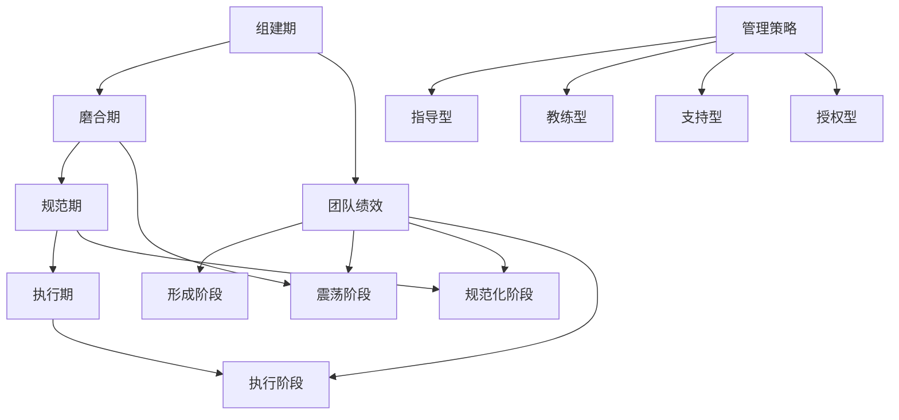

# 团队管理

## 🎯 学习目标
- 掌握高效团队建设和管理的方法
- 学会激励团队绩效和促进协作
- 理解角色分工、沟通机制和冲突解决

## 📊 团队建设

### 团队发展阶段
团队建设包括组建期、磨合期、规范期和执行期四个阶段。

### 团队生命周期图


## 🏗️ 团队构建

### 角色定义和职责
```python
# project_management/team_manager.py
from dataclasses import dataclass
from typing import List, Dict, Any, Optional
from enum import Enum
from datetime import datetime

class RoleType(Enum):
    """角色类型"""
    PROJECT_MANAGER = "project_manager"
    TECHNICAL_LEAD = "technical_lead"
    DEVELOPER = "developer"
    TESTER = "tester"
    BUSINESS_ANALYST = "business_analyst"
    UI_DESIGNER = "ui_designer"
    DEVOPS = "devops"
    QA_MANAGER = "qa_manager"

class SkillLevel(Enum):
    """技能等级"""
    JUNIOR = "junior"
    MIDDLE = "middle"
    SENIOR = "senior"
    EXPERT = "expert"

class TeamStatus(Enum):
    """团队状态"""
    FORMING = "forming"
    STORMING = "storming"
    NORMING = "norming"
    PERFORMING = "performing"
    ADJOURNING = "adjourning"

@dataclass
class TeamMember:
    """团队成员"""
    id: str
    name: str
    role: RoleType
    skills: List[str]
    skill_levels: Dict[str, SkillLevel]
    experience_years: int
    availability: float  # 0.0-1.0
    communication_preference: str  # email, slack, meeting
    timezone: str
    
@dataclass
class TeamRole:
    """团队角色定义"""
    role_type: RoleType
    title: str
    description: str
    responsibilities: List[str]
    required_skills: List[str]
    skill_level_requirement: SkillLevel
    collaboration_points: List[RoleType]

class TeamConstructionManager:
    """团队构建管理器"""
    
    def __init__(self):
        self.roles: Dict[RoleType, TeamRole] = {}
        self.team_members: List[TeamMember] = []
        self.team_status: TeamStatus = TeamStatus.FORMING
        
        # 初始化角色定义
        self._initialize_roles()
    
    def _initialize_roles(self):
        """初始化角色定义"""
        
        # 项目经理
        self.roles[RoleType.PROJECT_MANAGER] = TeamRole(
            role_type=RoleType.PROJECT_MANAGER,
            title="项目经理",
            description="负责项目的整体规划、进度控制和团队协调",
            responsibilities=[
                "制定项目计划和里程碑",
                "管理项目风险和资源",
                "协调各方沟通",
                "监督项目进度",
                "提供项目报告",
                "确保项目按时交付"
            ],
            required_skills=[
                "项目计划",
                "风险管理",
                "沟通协调",
                "团队建设",
                "质量管理"
            ],
            skill_level_requirement=SkillLevel.SENIOR,
            collaboration_points=[RoleType.TECHNICAL_LEAD, RoleType.BUSINESS_ANALYST]
        )
        
        # 技术主管
        self.roles[RoleType.TECHNICAL_LEAD] = TeamRole(
            role_type=RoleType.TECHNICAL_LEAD,
            title="技术主管",
            description="负责技术架构设计、开发指导和代码质量",
            responsibilities=[
                "设计技术架构方案",
                "指导和评审开发工作",
                "建立开发规范和最佳实践",
                "解决复杂技术难题",
                "保证代码质量",
                "技术团队培养"
            ],
            required_skills=[
                "Odoo开发",
                "Python开发",
                "架构设计",
                "代码审查",
                "性能优化"
            ],
            skill_level_requirement=SkillLevel.EXPERT,
            collaboration_points=[RoleType.PROJECT_MANAGER, RoleType.DEVELOPER]
        )
        
        # 开发工程师
        self.roles[RoleType.DEVELOPER] = TeamRole(
            role_type=RoleType.DEVELOPER,
            title="开发工程师",
            description="负责功能开发和模块实现",
            responsibilities=[
                "按需求和设计实现功能",
                "编写和修改代码",
                "进行单元测试",
                "配合测试人员调试问题",
                "编写开发文档",
                "代码维护和改进"
            ],
            required_skills=[
                "Python开发",
                "Odoo框架",
                "PostgreSQL",
                "Web技术",
                "Git版本控制"
            ],
            skill_level_requirement=SkillLevel.MIDDLE,
            collaboration_points=[RoleType.TECHNICAL_LEAD, RoleType.TESTER]
        )
        
        # 测试工程师
        self.roles[RoleType.TESTER] = TeamRole(
            role_type=RoleType.TESTER,
            title="测试工程师",
            description="负责测试用例设计、执行和缺陷跟踪",
            responsibilities=[
                "编写测试用例",
                "执行功能测试",
                "性能测试",
                "缺陷跟踪和验证",
                "测试环境搭建",
                "测试报告编写"
            ],
            required_skills=[
                "测试用例设计",
                "自动化测试",
                "缺陷管理",
                "性能测试",
                "测试工具使用"
            ],
            skill_level_requirement=SkillLevel.MIDDLE,
            collaboration_points=[RoleType.DEVELOPER, RoleType.QA_MANAGER]
        )
        
        # 业务分析师
        self.roles[RoleType.BUSINESS_ANALYST] = TeamRole(
            role_type=RoleType.BUSINESS_ANALYST,
            title="业务分析师",
            description="负责需求分析、业务流程分析和用户故事编写",
            responsibilities=[
                "收集和分析业务需求",
                "编写用户故事",
                "流程梳理和优化",
                "需求变更管理",
                "用户培训",
                "业务验收"
            ],
            required_skills=[
                "需求分析",
                "业务流程设计",
                "沟通技巧",
                "业务建模",
                "文档编写"
            ],
            skill_level_requirement=SkillLevel.SENIOR,
            collaboration_points=[RoleType.PROJECT_MANAGER, RoleType.UI_DESIGNER]
        )
        
        # UI设计师
        self.roles[RoleType.UI_DESIGNER] = TeamRole(
            role_type=RoleType.UI_DESIGNER,
            title="UI设计师",
            description="负责用户界面设计和用户体验优化",
            responsibilities=[
                "界面设计和原型制作",
                "用户体验设计",
                "交互设计",
                "视觉规范制定",
                "前端开发指导",
                "设计评审"
            ],
            required_skills=[
                "界面设计",
                "产品原型",
                "交互设计",
                "前端技术",
                "设计工具"
            ],
            skill_level_requirement=SkillLevel.SENIOR,
            collaboration_points=[RoleType.BUSINESS_ANALYST, RoleType.DEVELOPER]
        )
        
        # DevOps工程师
        self.roles[RoleType.DEVOPS] = TeamRole(
            role_type=RoleType.DEVOPS,
            title="DevOps工程师",
            description="负责部署和运维自动化、基础设施管理",
            responsibilities=[
                "CI/CD管道构建",
                "部署自动化",
                "环境管理",
                "监控告警",
                "基础设施管理",
                "性能优化"
            ],
            required_skills=[
                "CI/CD",
                "Docker",
                "Linux系统",
                "脚本编程",
                "监控系统"
            ],
            skill_level_requirement=SkillLevel.SENIOR,
            collaboration_points=[RoleType.TECHNICAL_LEAD, RoleType.DEVELOPER]
        )
    
    def create_team_member(self, name: str, role: RoleType,
                           skills: List[str], skill_levels: Dict[str, SkillLevel],
                           experience_years: int, availability: float,
                           communication_preference: str = "email",
                           timezone: str = "UTC+8") -> TeamMember:
        """创建团队成员"""
        
        member = TeamMember(
            id=f"MEMBER-{len(self.team_members) + 1:03d}",
            name=name,
            role=role,
            skills=skills,
            skill_levels=skill_levels,
            experience_years=experience_years,
            availability=availability,
            communication_preference=communication_preference,
            timezone=timezone
        )
        
        self.team_members.append(member)
        
        if self.team_status == TeamStatus.FORMING and len(self.team_members) > 1:
            self.team_status = TeamStatus.STORMING
        
        return member
    
    def analyze_team_gaps(self) -> Dict[str, Any]:
        """分析团队缺口"""
        gap_analysis = {
            'missing_roles': [],
            'skills_gaps': [],
            'coverage_summary': {},
            'recommendations': []
        }
        
        # 找出缺失的角色
        required_role_types = list(RoleType)
        existing_role_types = set(member.role for member in self.team_members)
        
        for role_type in required_role_types:
            if role_type not in existing_role_types:
                gap_analysis['missing_roles'].append({
                    'role': role_type,
                    'title': self.roles[role_type].title,
                    'description': self.roles[role_type].description
                })
        
        # 技能缺口分析
        for role_type, role_def in self.roles.items():
            existing_members = [m for m in self.team_members if m.role == role_type]
            
            if not existing_members:
                continue
                
            member = existing_members[0]  # 简单假设每个角色只有一个成员
            
            skill_gaps = []
            for required_skill in role_def.required_skills:
                if required_skill not in member.skills:
                    skill_gaps.append(required_skill)
            
            if skill_gaps:
                gap_analysis['skills_gaps'].append({
                    'role': role_type,
                    'member': member.name,
                    'missing_skills': skill_gaps
                })
        
        # 生成建议
        gap_analysis['recommendations'] = self._generate_fill_gap_recommendations(gap_analysis)
        
        return gap_analysis
    
    def _generate_fill_gap_recommendations(self, gap_analysis: Dict[str, Any]) -> List[str]:
        """生成填补缺口的建议"""
        recommendations = []
        
        # 基于缺失角色的建议
        for missing_role in gap_analysis['missing_roles']:
            recommendations.append(
                f"考虑招募或培训{missing_role['title']}以提高团队能力"
            )
        
        # 基于技能缺口的建议
        for skill_gap in gap_analysis['skills_gaps']:
            member_name = skill_gap['member']
            missing_skills = ', '.join(skill_gap['missing_skills'])
            recommendations.append(
                f"为{member_name}提供{missing_skills}相关培训"
            )
        
        return recommendations
```

### 绩效管理
```python
# project_management/performance_manager.py
from dataclasses import dataclass
from typing import Dict, List, Any, Optional
from datetime import datetime, timedelta

class PerformanceRating(Enum):
    """绩效评级"""
    EXCEEDS = "exceeds"
    MEETS = "meets"
    PARTIALLY_MEETS = "partially_meets"
    DOES_NOT_MEET = "does_not_meet"

class PerformanceType(Enum):
    """绩效类型"""
    TECHNICAL_SKILLS = "technical_skills"
    COMMUNICATION = "communication"
    COLLABORATION = "collaboration"
    QUALITY = "quality"
    DELIVERY = "delivery"
    LEADERSHIP = "leadership"

@dataclass
class PerformanceMetrics:
    """绩效指标"""
    code_commits: int
    bug_responsibility: int
    test_coverage_improvement: float
    documentation_updates: int
    project_milestones_met: int
    teamwork_score: float
    leadership_score: float
    learning_initiatives: int

@dataclass
class PerformanceReview:
    """绩效评估"""
    id: str
    member_id: str
    period_start: datetime
    period_end: datetime
    reviewer: str  # 评估人
    metrics: PerformanceMetrics
    ratings: Dict[PerformanceType, PerformanceRating]
    feedback: str
    development_goals: List[str]
    next_period_focus: List[str]
    created_date: datetime
    is_submitted: bool = False

class PerformanceManager:
    """绩效管理者"""
    
    def __init__(self):
        self.reviews: List[PerformanceReview] = []
        self.goals_tracking: Dict[str, List[str]] = {}
        self.team_performance_history: List[Dict[str, Any]] = []
    
    def plan_performance_review(self, member_id: str, period_days: int = 90) -> PerformanceReview:
        """规划绩效评估"""
        period_end = datetime.now()
        period_start = period_end - timedelta(days=period_days)
        
        # 获取成员的绩效数据
        metrics = self._gather_member_metrics(member_id, period_start, period_end)
        
        # 初始评估
        initial_ratings = self._initial_performance_assessment(member_id)
        
        review = PerformanceReview(
            id=f"PR-{len(self.reviews) + 1:03d}",
            member_id=member_id,
            period_start=period_start,
            period_end=period_end,
            reviewer="",  # 需要指定
            metrics=metrics,
            ratings=initial_ratings,
            feedback="",
            development_goals=[],
            next_period_focus=[],
            created_date=datetime.now()
        )
        
        self.reviews.append(review)
        
        return review
    
    def _gather_member_metrics(self, member_id: str, period_start: datetime, period_end: datetime) -> PerformanceMetrics:
        """收集成员绩效数据"""
        # 模拟数据收集
        metrics = PerformanceMetrics(
            code_commits=self._count_code_commits_for_member(member_id),
            bug_responsibility=self._count_bug_reports_for_member(member_id),
            test_coverage_improvement=self._compare_test_coverage(member_id),
            documentation_updates=self._count_documentation_updates(member_id),
            project_milestones_met=self._count_milestones_met_by_member(member_id),
            teamwork_score=self._calculate_teamwork_score(member_id),
            leadership_score=self._calculate_leadership_score(member_id),
            learning_initiatives=self._count_learning_activities(member_id)
        )
        
        return metrics
    
    def conduct_performance_review(self, review_id: str, reviewer: str,
                                 ratings: Dict[PerformanceType, PerformanceRating],
                                 feedback: str = "", 
                                 development_goals: List[str] = None,
                                 next_period_focus: List[str] = None) -> Optional[PerformanceReview]:
        """进行绩效评估"""
        
        review = self._get_review_by_id(review_id)
        if not review:
            return None
        
        review.reviewer = reviewer
        review.ratings = ratings
        review.feedback = feedback
        review.development_goals = development_goals or []
        review.next_period_focus = next_period_focus or []
        review.is_submitted = True
        
        # 记录评估历史
        self.team_performance_history.append({
            'member_id': member_id,
            'review_id': review_id,
            'date': datetime.now(),
            'ratings': ratings,
            'metrics': {**review.metrics, 'period_start': review.period_start, 'period_end': review.period_end}
        })
        
        return review
    
    def generate_performance_summary(self, member_id: str, period_days: int = 365) -> Dict[str, Any]:
        """生成绩效摘要"""
        
        end_date = datetime.now()
        start_date = end_date - timedelta(days=period_days)
        
        # 获取用户在该期间内的所有评估
        relevant_reviews = [
            review for review in self.reviews
            if review.member_id == member_id and
               start_date <= review.period_end <= end_date
        ]
        
        if not relevant_reviews:
            return {'error': 'No reviews found for member'}
        
        # 统计分析
        summary = {
            'member_id': member_id,
            'evaluation_period': f"{start_date.strftime('%Y-%m-%d')} 到 {end_date.strftime('%Y-%m-%d')}",
            'total_reviews': len(relevant_reviews),
            'rating_trends': self._compute_rating_trends(relevant_reviews),
            'metrics_history': [review.metrics for review in relevant_reviews],
            'development_progress': self._analyze_development_progress(relevant_reviews),
            'overall_performance': self._calculate_overall_performance(relevant_reviews),
            'improvement_suggestions': self._generate_improvement_suggestions(relevant_reviews)
        }
        
        return summary
    
    def _compute_rating_trends(self, reviews: List[PerformanceReview]) -> Dict[str, List[Any]]:
        """计算评级趋势"""
        trends = {rating_type.value: [] for rating_type in PerformanceType}
        
        for review in reviews:
            for rating_type, rating in review.ratings.items():
                trends[rating_type.value].append({
                    'review_date': review.period_end,
                    'rating': rating.value
                })
        
        return trends
    
    def _analyze_development_progress(self, reviews: List[PerformanceReview]) -> Dict[str, Any]:
        """分析发展进度"""
        progress = {
            'goals_tracking': [],
            'skill_improvement': {},
            'leadership_growth': 0.0,
            'learning_summary': ''
        }
        
        # 目标追踪
        goals_tracking = []
        for review in reviews:
            goals_tracking.extend(review.development_goals)
        progress['goals_tracking'] = goals_tracking
        
        # 技能提升
        ratings_history = {}
        for review in reviews:
            for rating_type, rating_value in review.ratings.items():
                ratings_history[rating_type.value].append(rating_value)
        
        skill_improvement = {}
        for skill, rating_history in ratings_history.items():
            improvement_score = self._calculate_improvement_score(rating_history)
            skill_improvement[skill] = improvement_score
        
        progress['skill_improvement'] = skill_improvement
        
        # 领导力发展
        leadership_ratings = [review.ratings.get(PerformanceType.LEADERSHIP) for review in reviews if PerformanceType.LEADERSHIP in review.ratings]
        if leadership_ratings:
            leadership_avg_scores = [self._rating_to_numeric(r) for r in leadership_ratings]
            progress['leadership_growth'] = sum(leadership_avg_scores) / len(leadership_avg_scores)
        
        # 学习摘要
        learning_summary = []
        for review in reviews:
            if review.next_period_focus:
                learning_summary.extend(review.next_period_focus)
        progress['learning_summary'] = ', '.join(set(learning_summary))  # 去重
        
        return progress
    
    def _calculate_overall_performance(self, reviews: List[PerformanceReview]) -> Dict[str, Any]:
        """计算整体绩效"""
        overall = {
            'average_rating': 0.0,
            'performance_trend': 'stable',
            'top_performing_areas': [],
            'areas_needing_attention': [],
            'strengths': [],
            'weaknesses': []
        }
        
        # 计算平均评级
        all_ratings = []
        for review in reviews:
            numeric_ratings = [self._rating_to_numeric(rating) for rating in review.ratings.values()]
            all_ratings.extend(numeric_ratings)
        
        if all_ratings:
            overall['average_rating'] = sum(all_ratings) / len(all_ratings)
        
        # 分析趋势
        recent_reviews = reviews[-2:] if len(reviews) >= 2 else reviews
        if len(recent_reviews) == 2:
            recent_avg = sum(map(self._rating_to_numeric, latest_ratings.values())) / len(latest_ratings)
            older_avg = sum(map(self._rating_to_numeric, older_ratings.values())) / len(older_ratings)
            
            if recent_avg > older_avg + 0.2:
                overall['performance_trend'] = 'improving'
            elif recent_avg < older_avg - 0.2:
                overall['performance_trend'] = 'declining'
        
        latest_review = reviews[-1] if reviews else None
        if latest_review:
            latest_ratings = latest_review.ratings
            
            # 识别优秀和需改进的领域
            for rating_type, rating_value in latest_ratings.items():
                if rating_value in [PerformanceRating.EXCEEDS]:
                    overall['top_performing_areas'].append(rating_type.value)
                elif rating_value in [PerformanceRating.DOES_NOT_MEET]:
                    overall['areas_needing_attention'].append(rating_type.value)
        
        return overall
    
    def _generate_improvement_suggestions(self, reviews: List[PerformanceReview]) -> List[str]:
        """生成改进建议"""
        suggestions = []
        
        latest_review = reviews[-1] if reviews else None
        if not latest_review:
            return suggestions
        
        ratings = latest_review.ratings
        
        # 基于评级生成建议
        for rating_type, rating_value in ratings.items():
            if rating_value == PerformanceRating.DOES_NOT_MEET:
                suggestion_map = {
                    PerformanceType.TECHNICAL_SKILLS: "建议增加技术培训和实践机会",
                    PerformanceType.COMMUNICATION: "建议参加沟通技巧训练",
                    PerformanceType.COLLABORATION: "建议加强团队协作训练",
                    PerformanceType.QUALITY: "建议关注代码质量，增加代码审查",
                    PerformanceType.DELIVERY: "建议关注时间管理技巧",
                    PerformanceType.LEADERSHIP: "建议培养领导力素质"
                }
                if rating_type in suggestion_map:
                    suggestions.append(suggestion_map.get(rating_type, "建议针对性提升"))
        
        return suggestions

    def _get_review_by_id(self, review_id: str) -> Optional[PerformanceReview]:
        """根据ID获取评估"""
        return next((r for r in self.reviews if r.id == review_id), None)

    def _rating_to_numeric(self, rating: PerformanceRating) -> float:
        """评级转换为数值"""
        rating_map = {
            PerformanceRating.EXCEEDS: 4.0,
            PerformanceRating.MEETS: 3.0,
            PerformanceRating.PARTIALLY_MEETS: 2.0,
            PerformanceRating.DOES_NOT_MEET: 1.0
        }
        return rating_map.get(rating, 2.5)
```

## 🔗 相关链接

### 下一步学习
- [[敏捷开发流程]] - 了解敏捷开发流程
- [[需求分析与设计]] - 学习需求分析与设计
- [[版本控制与协作]] - 掌握版本控制与协作

### 实践建议
- 注重团队文化建设
- 建立绩效管理体系
- 促进团队沟通

## 📝 思考题

### 基础理解
1. 团队建设的关键要素是什么？
2. 绩效管理的目的和意义是什么？
3. 角色分工的重要性在哪里？

### 深入思考
1. 如何建立高效的远程团队？
2. 团队冲突如何科学解决？
3. 如何激励团队持续提升绩效？

---

**学习进度**: ✅ 已完成  
**下一步**: [[项目案例]]
