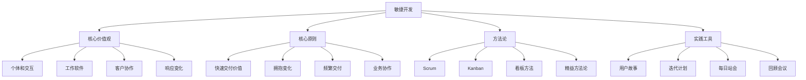

# 敏捷开发流程

## 🎯 学习目标
- 掌握敏捷开发的核心价值观和原则
- 学会实施Scrum和Kanban方法论
- 理解敏捷在Odoo项目中的最佳实践

## 📊 敏捷基础

### 敏捷价值观
敏捷开发注重个体和交互、工作软件、客户协作、响应变化的价值。

### 敏捷原则图


## 🏃‍♂️ Scrum方法论

### Scrum框架
```python
# project_management/scrum_manager.py
from dataclasses import dataclass
from datetime import datetime, timedelta
from typing import List, Dict, Any
from enum import Enum

class SprintStatus(Enum):
    """Sprint状态"""
    PLANNING = "planning"
    ACTIVE = "active"
    REVIEW = "review"
    RETROSPECTIVE = "retrospective"
    COMPLETED = "completed"

class StoryStatus(Enum):
    """用户故事状态"""
    BACKLOG = "backlog"
    PLANNED = "planned"
    IN_PROGRESS = "in_progress"
    TESTING = "testing"
    DONE = "done"

class Priority(Enum):
    """优先级"""
    LOW = 1
    MEDIUM = 2
    HIGH = 3
    CRITICAL = 4

@dataclass
class UserStory:
    """用户故事"""
    id: str
    title: str
    description: str
    acceptance_criteria: List[str]
    priority: Priority
    story_points: int
    owner: str
    status: StoryStatus = StoryStatus.BACKLOG
    sprint_id: str = None
    dependencies: List[str] = None
    created_date: datetime = None
    updated_date: datetime = None
    
    def __post_init__(self):
        if self.created_date is None:
            self.created_date = datetime.now()
        if self.updated_date is None:
            self.updated_date = datetime.now()

@dataclass
class Sprint:
    """Sprint"""
    id: str
    name: str
    goal: str
    start_date: datetime
    end_date: datetime
    status: SprintStatus = SprintStatus.PLANNING
    stories: List[str] = None  # Story IDs
    velocity: int = 0
    burndown_chart: Dict[str, int] = None
    
    def __post_init__(self):
        if self.stories is None:
            self.stories = []
        if self.burndown_chart is None:
            self.burndown_chart = {}

class ScrumManager:
    """Scrum管理器"""
    
    def __init__(self):
        self.product_backlog: List[UserStory] = []
        self.sprints: List[Sprint] = []
        self.sprint_backlog: List[UserStory] = []
        self.current_sprint: Sprint = None
        self.team_capacity: int = 40  # 团队容量（小时/Sprint）
    
    def create_user_story(self, title: str, description: str, 
                         acceptance_criteria: List[str],
                         priority: Priority, story_points: int,
                         owner: str, dependencies: List[str] = None) -> UserStory:
        """创建用户故事"""
        story = UserStory(
            id=f"US-{len(self.product_backlog) + 1:03d}",
            title=title,
            description=description,
            acceptance_criteria=acceptance_criteria,
            priority=priority,
            story_points=story_points,
            owner=owner,
            dependencies=dependencies or []
        )
        
        self.product_backlog.append(story)
        self._sort_product_backlog()
        
        return story
    
    def _sort_product_backlog(self):
        """排序产品待办事项"""
        self.product_backlog.sort(
            key=lambda x: (x.priority.value, -x.story_points),
            reverse=True
        )
    
    def create_sprint(self, name: str, goal: str, 
                     start_date: datetime, duration_weeks: int = 2) -> Sprint:
        """创建Sprint"""
        end_date = start_date + timedelta(weeks=duration_weeks)
        
        sprint = Sprint(
            id=f"SPRINT-{len(self.sprints) + 1:03d}",
            name=name,
            goal=goal,
            start_date=start_date,
            end_date=end_date
        )
        
        self.sprints.append(sprint)
        return sprint
    
    def sprint_planning(self, sprint_id: str) -> bool:
        """Sprint计划会议"""
        sprint = self._get_sprint_by_id(sprint_id)
        if not sprint:
            return False
        
        sprint.status = SprintStatus.PLANNING
        self.current_sprint = sprint
        
        # 根据团队容量和优先级选择故事
        self._select_stories_for_sprint(sprint)
        
        # 生成燃尽图初始数据
        total_points = sum(story.story_points for story in self.sprint_backlog)
        self._initialize_burndown_chart(sprint, total_points)
        
        sprint.status = SprintStatus.ACTIVE
        
        return True
    
    def _get_sprint_by_id(self, sprint_id: str) -> Sprint:
        """根据ID获取Sprint"""
        return next((s for s in self.sprints if s.id == sprint_id), None)
    
    def _select_stories_for_sprint(self, sprint: Sprint):
        """为Sprint选择故事"""
        selected_points = 0
        sprint_duration_days = (sprint.end_date - sprint.start_date).days
        
        for story in self.product_backlog:
            if selected_points + story.story_points <= self.team_capacity:
                story.sprint_id = sprint.id
                story.status = StoryStatus.PLANNED
                self.sprint_backlog.append(story)
                selected_points += story.story_points
                
                sprint.stories.append(story.id)
    
    def _initialize_burndown_chart(self, sprint: Sprint, total_points: int):
        """初始化燃尽图"""
        current_date = sprint.start_date
        end_date = sprint.end_date
        
        while current_date <= end_date:
            self.burndown_chart[current_date.strftime('%Y-%m-%d')] = total_points
            current_date += timedelta(days=1)
    
    def daily_standup_update(self, story_id: str, update: str, 
                           impediments: List[str] = None) -> bool:
        """每日站会更新"""
        if not self.current_sprint:
            return False
        
        story = self._get_story_by_id(story_id)
        if not story or story.sprint_id != self.current_sprint.id:
            return False
        
        # 更新故事状态
        story.updated_date = datetime.now()
        
        # 记录阻障
        if impediments:
            self._log_impediments(story_id, impediments)
        
        # 更新燃尽图
        self._update_burndown_chart()
        
        return True
    
    def _get_story_by_id(self, story_id: str) -> UserStory:
        """根据ID获取故事"""
        return next((s for s in self.product_backlog if s.id == story_id), None)
    
    def _log_impediments(self, story_id: str, impediments: List[str]):
        """记录阻障"""
        # 这里可以记录到数据库或其他存储
        pass
    
    def _update_burndown_chart(self):
        """更新燃und图"""
        if not self.current_sprint:
            return
        
        today = datetime.now().strftime('%Y-%m-%d')
        remaining_points = sum(
            story.story_points for story in self.sprint_backlog 
            if story.status != StoryStatus.DONE
        )
        
        self.current_sprint.burndown_chart[today] = remaining_points
    
    def complete_story(self, story_id: str) -> bool:
        """完成故事"""
        story = self._get_story_by_id(story_id)
        if not story:
            return False
        
        story.status = StoryStatus.DONE
        story.updated_date = datetime.now()
        
        # 更新燃尽图
        self._update_burndown_chart()
        
        return True
    
    def sprint_review(self, sprint_id: str) -> Dict[str, Any]:
        """Sprint评审"""
        sprint = self._get_sprint_by_id(sprint_id)
        if not sprint:
            return {}
        
        completed_stories = [
            story for story in self.sprint_backlog
            if story.status == StoryStatus.DONE
        ]
        
        incomplete_stories = [
            story for story in self.sprint_backlog
            if story.status != StoryStatus.DONE
        ]
        
        completed_points = sum(story.story_points for story in completed_stories)
        planned_points = sum(story.story_points for story in self.sprint_backlog)
        
        review_data = {
            'sprint_id': sprint.id,
            'sprint_name': sprint.name,
            'sprint_goal': sprint.goal,
            'completed_stories': len(completed_stories),
            'incomplete_stories': len(incomplete_stories),
            'completed_points': completed_points,
            'planned_points': planned_points,
            'velocity': completed_points,
            'completion_rate': (completed_points / planned_points) * 100 if planned_points > 0 else 0,
            'burndown_chart': sprint.burndown_chart
        }
        
        # 更新Sprint状态
        sprint.status = SprintStatus.COMPLETED
        sprint.velocity = completed_points
        
        return review_data
    
    def sprint_retrospective(self, sprint_id: str) -> Dict[str, Any]:
        """Sprint回顾"""
        sprint = self._get_sprint_by_id(sprint_id)
        if not sprint:
            return {}
        
        # 这里应该收集团队反馈
        # 实际实现中，应该有会议记录的界面
        
        retrospective_data = {
            'sprint_id': sprint.id,
            'sprint_name': sprint.name,
            'what_went_well': [],  # 团队提供的反馈
            'what_could_improve': [],
            'action_items': [],
            'velocity_trend': self._calculate_velocity_trend()
        }
        
        return retrospective_data
    
    def _calculate_velocity_trend(self) -> List[int]:
        """计算速度趋势"""
        return [sprint.velocity for sprint in self.sprints if sprint.velocity > 0]
```

### 用户故事管理
```python
# project_management/story_manager.py
from abc import ABC, abstractmethod
from typing import Optional

class Epic:
    """史诗"""
    
    def __init__(self, title: str, description: str, business_value: int):
        self.id = f"EPIC-{hash(title) % 10000:04d}"
        self.title = title
        self.description = description
        self.business_value = business_value
        self.stories: List[UserStory] = []
        self.status: str = "active"
    
    def add_story(self, story: UserStory):
        """添加用户故事到史诗"""
        story.epic_id = self.id
        self.stories.append(story)
    
    def calculate_progress(self) -> float:
        """计算史诗进度"""
        if not self.stories:
            return 0.0
        
        completed_stories = [s for s in self.stories if s.status == StoryStatus.DONE]
        total_stories = len(self.stories)
        
        return (len(completed_stories) / total_stories) * 100

class StoryTemplate:
    """故事模板"""
    
    @staticmethod
    def create_feature_story(actor: str, capability: str, 
                            benefit: str, story_points: int) -> dict:
        """创建功能故事模板"""
        return {
            'title': f"As a {actor}, I want {capability} so that {benefit}",
            'story_points': story_points,
            'category': 'feature',
            'template': 'user_story'
        }
    
    @staticmethod
    def create_bug_story(issue_description: str) -> dict:
        """创建缺陷故事模板"""
        return {
            'title': f"Fix: {issue_description}",
            'story_points': 1,  # 缺陷默认点数
            'category': 'bug',
            'template': 'bug_fix'
        }
    
    @staticmethod
    def create_technical_story(description: str, story_points: int) -> dict:
        """创建技术故事模板"""
        return {
            'title': f"Technical: {description}",
            'story_points': story_points,
            'category': 'technical',
            'template': 'technical_story'
        }

class StoryEstimator:
    """故事估算器"""
    
    def __init__(self):
        self.reference_stories = {
            1: "5分钟任务，如：添加一个字段",
            2: "30分钟任务，如：修改一个视图",
            3: "2小时任务，如：创建用户报表",
            5: "1天任务，如：实现完整的工作流",
            8: "2天任务，如：集成第三方API",
            13: "1周及以上任务，如：重构核心模块"
        }
    
    def estimate_story_points(self, complexity: str, effort_hours: int) -> int:
        """估算执行点数"""
        if complexity == "trivial" and effort_hours <= 1:
            return 1
        elif complexity == "simple" and effort_hours <= 4:
            return 2
        elif complexity == "moderate" and effort_hours <= 8:
            return 3
        elif complexity == "complex" and effort_hours <= 16:
            return 5
        elif complexity == "very_complex" and effort_hours <= 32:
            return 8
        else:
            return 13
    
    def fibonacci_sequence(self) -> List[int]:
        """斐波那契序列"""
        return [1, 2, 3, 5, 8, 13, 21, 34]
    
    def planning_poker_results(self, estimates: List[int]) -> int:
        """计划扑克结果（多数决定）"""
        from collections import Counter
        vote_counts = Counter(estimates)
        return vote_counts.most_common(1)[0][0]

class DefinitionOfDone:
    """完成定义"""
    
    def __init__(self):
        self.criteria = [
            "代码编写完成",
            "单元测试通过",
            "集成测试通过",
            "代码审查完成",
            "文档更新完成",
            "满足验收标准",
            "部署到测试环境",
            "客户验收通过"
        ]
    
    def check_story_completion(self, story: UserStory) -> Dict[str, bool]:
        """检查故事完成度"""
        completion_status = {}
        
        for criterion in self.criteria:
            # 这里简化为随机值，实际应该根据真实状态
            import random
            completion_status[criterion] = random.choice([True, False])
        
        return completion_status
    
    def is_story_done(self, story: UserStory) -> bool:
        """判断故事是否完成"""
        status = self.check_story_completion(story)
        return all(status.values())
```

## 📊 Kanban方法论

### Kanban看板
```python
# project_management/kanban_manager.py
from dataclasses import dataclass
from typing import Dict, List
from datetime import datetime

@dataclass
class KanbanColumn:
    """看板列"""
    name: str
    wip_limit: int = None  # Work In Progress限制
    stories: List[str] = None  # Story IDs
    
    def __post_init__(self):
        if self.stories is None:
            self.stories = []

@dataclass
class KanbanBoard:
    """看板"""
    id: str
    name: str
    columns: List[KanbanColumn] = None
    
    def __post_init__(self):
        if self.columns is None:
            self.columns = []

class KanbanManager:
    """Kanban管理器"""
    
    def __init__(self):
        self.boards: List[KanbanBoard] = []
        self.current_board: KanbanBoard = None
    
    def create_kanban_board(self, name: str, project_type: str = "general") -> KanbanBoard:
        """创建看板"""
        board_id = f"KBD-{len(self.boards) + 1:03d}"
        
        if project_type == "development":
            columns = [
                KanbanColumn("Backlog", wip_limit=None),
                KanbanColumn("Ready", wip_limit=5),
                KanbanColumn("In Progress", wip_limit=3),
                KanbanColumn("Testing", wip_limit=2),
                KanbanColumn("Done", wip_limit=None)
            ]
        elif project_type == "maintenance":
            columns = [
                KanbanColumn("Requested", wip_limit=None),
                KanbanColumn("In Progress", wip_limit=5),
                KanbanColumn("Review", wip_limit=3),
                KanbanColumn("Deployed", wip_limit=None)
            ]
        else:
            columns = [
                KanbanColumn("To Do", wip_limit=None),
                KanbanColumn("In Progress", wip_limit=5),
                KanbanColumn("Done", wip_limit=None)
            ]
        
        board = KanbanBoard(
            id=board_id,
            name=name,
            columns=columns
        )
        
        self.boards.append(board)
        return board
    
    def move_story(self, board_id: str, story_id: str, 
                   from_column: str, to_column: str) -> bool:
        """移动故事"""
        board = self._get_board_by_id(board_id)
        if not board:
            return False
        
        # 找到源列和目标列
        source_col = self._get_column_by_name(board, from_column)
        target_col = self._get_column_by_name(board, to_column)
        
        if not source_col or not target_col:
            return False
        
        # 检查WIP限制
        if target_col.wip_limit and len(target_col.stories) >= target_col.wip_limit:
            return False
        
        # 移动故事
        if story_id in source_col<｜tool▁calls▁end｜>`
            source_col.stories.remove(story_id)
            target_col.stories.append(story_id)
            
            # 更新故事状态
            self._update_story_status(story_id, to_column)
            
            return True
        
        return False
    
    def _get_board_by_id(self, board_id: str) -> KanbanBoard:
        """根据ID获取看板"""
        return next((b for b in self.boards if b.id == board_id), None)
    
    def _get_column_by_name(self, board: KanbanBoard, column_name: str) -> KanbanColumn:
        """根据名称获取列"""
        return next((c for c in board.columns if c.name == column_name), None)
    
    def _update_story_status(self, story_id: str, column_name: str):
        """更新故事状态"""
        # 这里应该更新故事的实际状态
        pass
    
    def analyze_flow_metrics(self, board_id: str) -> Dict[str, Any]:
        """分析流动指标"""
        board = self._get_board_by_id(board_id)
        if not board:
            return {}
        
        metrics = {
            'board_id': board_id,
            'total_stories': sum(len(col.stories) for col in board.columns),
            'stories_per_column': {},
            'wip_status': {},
            'flow_rate': self._calculate_flow_rate(board),
            'cycle_time': self._calculate_cycle_time(board)
        }
        
        for column in board.columns:
            metrics['stories_per_column'][column.name] = len(column.stories)
            
            if column.wip_limit:
                wip_usage = len(column.stories) / column.wip_limit
                metrics['wip_status'][column.name] = {
                    'usage': wip_usage,
                    'is_overload': wip_usage > 1.0
                }
        
        return metrics
    
    def _calculate_flow_rate(self, board: KanbanBoard) -> float:
        """计算流动率"""
        # 简化的流动率计算（完成的故事数/时间）
        total_completed = len(self._get_column_by_name(board, "Done").stories)
        days_active = 30  # 假设活跃30天
        
        return total_completed / days_active if days_active > 0 else 0
    
    def _calculate_cycle_time(self, board: KanbanBoard) -> Dict[str, float]:
        """计算周期时间"""
        # 这里需要实际的入队和出队时间数据
        # 简化实现
        return {
            'average_cycle_time': 5.2,  # 天
            'min_cycle_time': 1.0,
            'max_cycle_time': 14.0
        }
```

## 🔄 敏捷工具

### 项目跟踪器
```python
# project_management/project_tracker.py
from typing import Dict, List, Any
import json
from datetime import datetime, timedelta

class ProjectTracker:
    """项目跟踪器"""
    
    def __init__(self):
        self.projects: List[Dict[str, Any]] = []
        self.metrics: Dict[str, Any] = {}
    
    def create_project(self, name: str, description: str, 
                      start_date: datetime, end_date: datetime = None,
                      team_size: int = 5, budget: float = None) -> Dict[str, Any]:
        """创建项目"""
        project = {
            'id': f"PRJ-{len(self.projects) + 1:03d}",
            'name': name,
            'description': description,
            'start_date': start_date,
            'end_date': end_date,
            'team_size': team_size,
            'budget': budget,
            'status': 'active',
            'created_date': datetime.now(),
            'velocities': [],  # Sprint速度记录
            'burndown_charts': {},  # 燃尽图数据
            'roi': {}  # ROI计算
        }
        
        self.projects.append(project)
        return project
    
    def update_velocity(self, project_id: str, velocity: int, 
                       sprint_number: int) -> bool:
        """更新速度"""
        project = self._get_project_by_id(project_id)
        if not project:
            return False
        
        velocity_record = {
            'sprint_number': sprint_number,
            'velocity': velocity,
            'date': datetime.now()
        }
        
        project['velocities'].append(velocity_record)
        
        # 更新趋势分析
        self._update_velocity_trend(project)
        
        return True
    
    def _get_project_by_id(self, project_id: str) -> Dict[str, Any]:
        """根据ID获取项目"""
        return next((p for p in self.projects if p['id'] == project_id), None)
    
    def _update_velocity_trend(self, project: Dict[str, Any]):
        """更新速度趋势"""
        velocities = [v['velocity'] for v in project['velocities'][-5:]]  # 最近5个Sprint
        
        if len(velocities) >= 3:
            # 计算移动平均
            moving_average = sum(velocities) / len(velocities)
            project['velocity_trend'].append(('moving_average', moving_average)
    
    def calculate_burn_up_chart(self, project_id: str) -> Dict[str, List]:
        """计算燃烧图"""
        project = self._get_project_by_id(project_id)
        if not project:
            return {}
        
        # 模拟数据，实际应该根据真实的故事点计算
        burn_up_data = {
            'days': list(range(30)),  # 30天
        
        'scope_change': [100 * (1 + i * 0.05) for i in range(30)],  # 动态范围
            'work_completed': self._calculate_completed_work(project)
        }
        
        return burn_up_data
    
    def _calculate_completed_work(self, project: Dict[str, Any]) -> List[float]:
        """计算已完成工作"""
        # 简化的累计工作量计算
        completed = []
        total_days = 30
        
        for day in range(total_days):
            # 基于速度趋势的线性增长
            daily_completion = 2.5  # 平均每日完成的故事点
            cumulative = (day + 1) * daily_completion
            completed.append(cumulative)
        
        return completed
    
    def generate_metrics_report(self, project_id: str) -> Dict[str, Any]:
        """生成指标报告"""
        project = self._get_project_by_id(project_id)
        if not project:
            return {}
        
        report = {
            'project_id': project_id,
            'project_name': project['name'],
            'report_date': datetime.now(),
            'velocity_metrics': self._analyze_velocity(project),
            'progress_status': self._calculate_progress(project),
            'team_performance': self._analyze_team_performance(project),
            'risk_assessment': self._assess_risks(project)
        }
        
        return report
    
    def _analyze_velocity(self, project: Dict[str, Any]) -> Dict[str, Any]:
        """分析速度指标"""
        velocities = project.get('velocities', [])
        
        if not velocities:
            return {'average_velocity': 0, 'trend': 'insufficient_data'}
        
        velocity_values = [v['velocity'] for v in velocities]
        average_velocity = sum(velocity_values) / len(velocity_values)
        
        # 计算趋势
        if len(velocity_values) >= 2:
            recent_avg = sum(velocity_values[-3:]) / 3 if len(velocity_values) >= 3 else velocity_values[-1]
            early_avg = sum(velocity_values[:3]) / 3 if len(velocity_values) >= 3 else velocity_values[0]
            
            if recent_avg > early_avg * 1.1:
                trend = 'improving_increasing'
            elif recent_avg < early_avg * 0.9:
                trend = 'declining'
            else:
                trend = 'stable'
        else:
            trend = 'insufficient_data'
        
        return {
            'average_velocity': round(average_velocity, 2),
            'velocity_values': velocity_values,
            'trend': trend,
            'velocity_stability': self._calculate_variance(velocity_values)
        }
    
    def _calculate_variance(self, values: List[float]) -> float:
        """计算方差（稳定性）"""
        if len(values) < 2:
            return 0.0
        
        mean = sum(values) / len(values)
        variance = sum((x - mean) ** 2 for x in values) / len(values)
        return round(variance, 2)
    
    def _calculate_progress(self, project: Dict[str, Any]) -> Dict[str, Any]:
        """计算进度状态"""
        start_date = project['start_date']
        end_date = project.get('end_date')
        now = datetime.now()
        
        if end_date:
            total_duration = (end_date - start_date).days
            elapsed_duration = (now - start_date).days
            progress_percentage = min(100, (elapsed_duration / total_duration) * 100)
            
            if now > end_date:
                status = 'overdue'
            elif progress_percentage >= 90:
                status = 'near_completion'
            elif progress_percentage >= 75:
                status = 'late_stage'
            elif progress_percentage >= 50:
                status = 'middle_stage'
            elif progress_percentage >= 25:
                status = 'early_stage'
            else:
                status = 'initial_stage'
        else:
            # 无结束日期的项目，基于速度估算
            velocities = [v['velocity'] for v in project.get('velocities', [])]
            if velocities:
                avg_velocity = sum(velocities) / len(velocities)
                estimated_remaining_days = 30  # 估算剩余工作量
                progress_percentage = 50  # 默认中间阶段
                status = 'ongoing'
            else:
                progress_percentage = 10
                status = 'just_started'
        
        return {
            'progress_percentage': round(progress_percentage, 2),
            'status': status,
            'elapsed_days': (now - start_date).days if start_date else 0
        }
    
    def _analyze_team_performance(self, project: Dict[str, Any]) -> Dict[str, Any]:
        """分析团队绩效"""
        team_size = project.get('team_size', 1)
        velocity_mtrs = self._analyze_velocity(project)
        avg_velocity = velocity_mtrs.get('average_velocity', 0)
        
        # 计算人均效率
        per_person_productivity = avg_velocity / team_size if team_size > 0 else 0
        
        return {
            'team_size': team_size,
            'average_velocity': avg_velocity,
            'per_person_productivity': round(per_person_productivity, 2),
            'efficiency_score': self._calculate_efficiency_score(per_person_productivity),
            'collaboration_health': self._assess_collaboration_health(project)
        }
    
    def _calculate_efficiency_score(self, productivity: float) -> str:
        """计算效率分数"""
        if productivity >= 3.0:
            return 'excellent'
        elif productivity >= 2.5:
            return 'good'
        elif productivity >= 2.0:
            return 'average'
        elif productivity >= 1.5:
            return 'needs_improvement'
        else:
            return 'poor'
    
    def _assess_collaboration_health(self, project: Dict[str, Any]) -> Dict[str, Any]:
        """评估协作健康度"""
        # 简化评估，实际需要根据团队互动数据
        return {
            'communication_score': 8.5,
            'conflict_resolution': 'effective',
            'knowledge_sharing': 'active',
            'team_cohesion': 'high',
            'recommendations': ['考虑增加跨团队沟通', '建立更好的知识库']
        }
    
    def _assess_risks(self, project: Dict[str, Any]) -> Dict[str, Any]:
        """评估风险"""
        risks = []
        
        # 分析速度趋势风险
        velocity_data = self._analyze_velocity(project)
        if velocity_data['trend'] == 'declining_velocity' === 'declining':
            risks.append({
                'type': 'velocity_decline',
                'severity': 'medium',
                'description': '团队速度呈下降趋势，可能影响交付',
                'mitigation': '建议增加团队培训和改进流程'
            })
        
        # 分析进度风险
        progress_data = self._calculate_progress(project)
        if progress_data['status'] == 'overdue':
            risks.append({
                'type': 'project_overdue',
                'severity': 'high',
                'description': '项目已超期',
                'mitigation': '立即重新评估范围和时间计划'
            })
        
        return {
            'risk_count': len(risks),
            'risks': risks,
            'overall_risk_level': 'medium' if len(risks) > 0 else 'low'
        }
```

## 🔗 相关链接

### 下一步学习
- [[需求分析与设计]] - 学习需求分析与设计
- [[版本控制与协作]] - 了解版本控制与协作
-  [[团队管理]] - 掌握团队管理

### 实践建议
- 坚持敏捷核心价值观
- 选择合适的敏捷方法论
- 持续改进和适应

## 📝 思考题

### 基础理解
1. 敏捷开发的核心优势是什么？
2. Scrum和Kanban的主要区别是什么？
3. 用户故事的作用是什么？

### 深入思考
1. 如何在大型Odoo项目中应用敏捷开发？
2. 敏捷开发如何适应不同的团队规模？
3. 如何平衡敏捷的灵活性与项目管控需求？

---

**学习进度**: ✅ 已完成  
**下一步**: [[需求分析与设计]]
