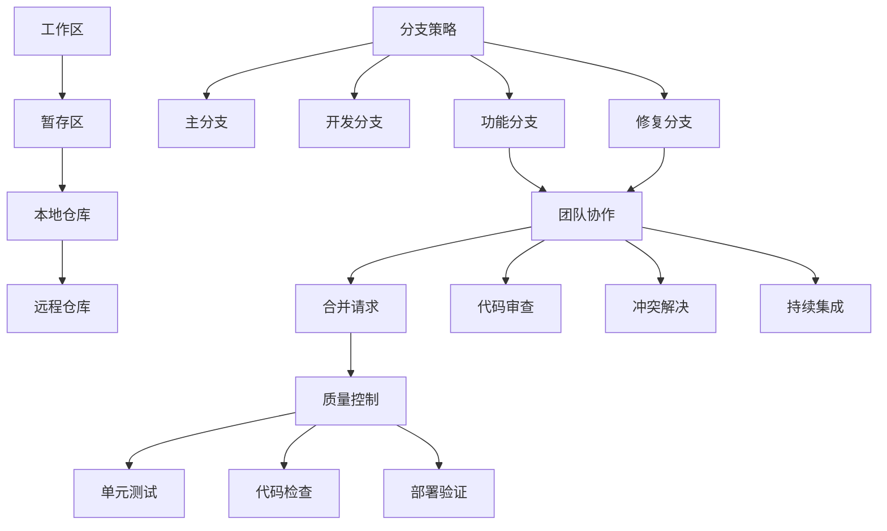

# 版本控制与协作

## 🎯 学习目标
- 掌握Git版本控制的完整工作流和最佳实践
- 学会团队协作中的Git策略和分支管理
- 理解代码审查、持续集成和质量控制流程

## 📊 Git基础工作流

### 版本控制流程
Git版本控制包括本地仓库管理、远程仓库协作和分支合并策略。

### Git工作流图


## 🔧 Git最佳实践

### 分支管理策略
```python
# project_management/git_manager.py
from typing import Dict, List, Any, Optional
from dataclasses import dataclass
from enum import Enum
from datetime import datetime
import subprocess
import os

class BranchType(Enum):
    """分支类型"""
    MAIN = "main"
    DEVELOP = "develop"
    FEATURE = "feature"
    HOTFIX = "hotfix"
    RELEASE = "release"

class BranchStatus(Enum):
    """分支状态"""
    ACTIVE = "active"
    MERGED = "merged"
    DELETED = "deleted"
    STALE = "stale"

@dataclass
class BranchInfo:
    """分支信息"""
    name: str
    branch_type: BranchType
    status: BranchStatus
    last_commit: str
    last_commit_date: datetime
    ahead_count: int = 0
    behind_count: int = 0
    conflicts: List[str] = None
    
    def __post_init__(self):
        if self.conflicts is None:
            self.conflicts = []

class GitBranchManager:
    """Git分支管理器"""
    
    def __init__(self, repository_path: str):
        self.repository_path = repository_path
        self.branches: Dict[str, BranchInfo] = {}
        self.merge_strategies: Dict[str, Any] = {
            'feature': self._merge_feature_branch,
            'hotfix': self._merge_hotfix_branch,
            'release': self._merge_release_branch
        }
    
    def initialize_repository(self, main_branch: str = "main") -> bool:
        """初始化仓库"""
        try:
            os.chdir(self.repository_path)
            
            # 检查是否已经是Git仓库
            if os.path.exists('.git'):
                print("仓库已初始化")
                return True
            
            # 初始化Git仓库
            subprocess.run(['git', 'init'], check=True)
            subprocess.run(['git', 'branch', '-M', main_branch], check=True)
            
            # 创建开发分支
            subprocess.run(['git', 'checkout', '-b', 'develop'], check=True)
            
            # 创建 .gitignore 文件
            self._create_gitignore()
            
            # 初始提交
            subprocess.run(['git', 'add', '.'], check=True)
            subprocess.run(['git', 'commit', '-m', 'Initial commit'], check=True)
            
            print("仓库初始化成功")
            return True
            
        except subprocess.CalledProcessError as e:
            print(f"初始化失败: {e}")
            return False
    
    def _create_gitignore(self):
        """创建.gitignore文件"""
        gitignore_content = """# Odoo项目.gitignore

# Python
__pycache__/
*.py[cod]
*$py.class
*.so

# 分发/打包
.Python
build/
develop-eggs/
dist/
downloads/
eggs/
.eggs/
lib/
lib64/
parts/
sdist/
var/
wheels/
*.egg-info/
.installed.cfg
*.egg

# PyInstaller
*.manifest
*.spec

# Installer日志
pip-log.txt
pip-delete-this-directory.txt

# 单元测试/覆盖率报告
htmlcov/
.tox/
.nox/
.coverage
.coverage.*
.cache
nosetests.xml
coverage.xml
*.cover
.hypothesis/
.pytest_cache/

# Translations
*.mo
*.pot

# Django stuff:
*.log
local_settings.py
db.sqlite3

# Flask stuff:
instance/
.webassets-cache

# Scrapy stuff:
.scrapy

# Sphinx文档
docs/_build/

# PyBuilder
target/

# Jupyter Notebook
.ipynb_checkpoints

# pyenv
.python-version

# celery beat schedule文件
celerybeat-schedule

# SageMath parsed文件
*.sage.py

# Environments
.env
.venv
env/
venv/
ENV/
env.bak/
venv.bak/

# Spyder project设置
.spyderproject
.spyproject

# Rope project设置
.ropeproject

# mkdocs文档
/site

# mypy
.mypy_cache/
.dmypy.json
dmypy.json

# Pyre type checker
.pyre/

# Odoo特定
# 数据库文件
*.dump
*.sql
*.csv

# Odoo配置文件
odoo.conf

# 日志文件
*.log

# 测试文件
test_*.py

# IDE文件
.idea/
.vscode/
*.swp
*.swo

# 操作系统文件
.DS_Store
Thumbs.db
"""
        
        with open('.gitignore', 'w', encoding='utf-8') as f:
            f.write(gitignore_content)
    
    def create_feature_branch(self, feature_name: str, base_branch: str = "develop") -> bool:
        """创建功能分支"""
        branch_name = f"feature/{feature_name}"
        
        try:
            # 切换到基础分支
            subprocess.run(['git', 'checkout', base_branch], check=True)
            subprocess.run(['git', 'pull'], check=True)
            
            # 创建并切换到新分支
            subprocess.run(['git', 'checkout', '-b', branch_name], check=True)
            
            # 记录分支信息
            branch_info = BranchInfo(
                name=branch_name,
                branch_type=BranchType.FEATURE,
                status=BranchStatus.ACTIVE,
                last_commit=self._get_last_commit_hash(),
                last_commit_date=datetime.now()
            )
            
            self.branches[branch_name] = branch_info
            
            print(f"功能分支 '{branch_name}' 创建成功")
            return True
            
        except subprocess.CalledProcessError as e:
            print(f"创建功能分支失败: {e}")
            return False
    
    def create_hotfix_branch(self, fix_description: str) -> bool:
        """创建修复分支"""
        branch_name = f"hotfix/{datetime.now().strftime('%Y%m%d')}-{fix_description.replace(' ', '-').lower()}"
        
        try:
            # 从主分支创建修复分支
            subprocess.run(['git', 'checkout', 'main'], check=True)
            subprocess.run(['git', 'pull'], check=True)
            
            subprocess.run(['git', 'checkout', '-b', branch_name], check=True)
            
            branch_info = BranchInfo(
                name=branch_name,
                branch_type=BranchType.HOTFIX,
                status=BranchStatus.ACTIVE,
                last_commit=self._get_last_commit_hash(),
                last_commit_date=datetime.now()
            )
            
            self.branches[branch_name] = branch_info
            
            print(f"修复分支 '{branch_name}' 创建成功")
            return True
            
        except subprocess.CalledProcessError as e:
            print(f"创建修复分支失败: {e}")
            return False
    
    def commit_changes(self, message: str, files?: Optional[List[str]] = None) -> bool:
        """提交更改"""
        try:
            if files is None:
                # 添加所有更改的文件
                subprocess.run(['git', 'add', '-A'], check=True)
            else:
                # 添加指定文件
                subprocess.run(['git', 'add'] + files, check=True)
            
            # 提交更改
            subprocess.run(['git', 'commit', '-m', message], check=True)
            
            # 更新分支信息
            current_branch = self._get_current_branch()
            if current_branch in self.branches:
                self.branches[current_branch].last_commit = self._get_last_commit_hash()
                self.branches[current_branch].last_commit_date = datetime.now()
            
            print(f"提交成功: {message}")
            return True
            
        except subprocess.CalledProcessError as e:
            print(f"提交失败: {e}")
            return False
    
    def push_branch(self, branch_name: str = None, set_upstream: bool = True) -> bool:
        """推送分支"""
        try:
            if branch_name is None:
                branch_name = self._get_current_branch()
            
            if set_upstream:
                subprocess.run(['git', 'push', '-u', 'origin', branch_name], check=True)
            else:
                subprocess.run(['git', 'push'], check=True)
            
            print(f"分支 '{branch_name}' 推送成功")
            return True
            
        except subprocess.CalledProcessError as e:
            print(f"推送到分支 '{branch_name}' 失败: {e}")
            return False
    
    def checkout_branch(self, branch_name: str) -> bool:
        """切换分支"""
        try:
            subprocess.run(['git', 'checkout', branch_name], check=True)
            print(f"已切换到分支: {branch_name}")
            return True
            
        except subprocess.CalledProcessError as e:
            print(f"切换到分支 '{branch_name}' 失败: {e}")
            return False
    
    def merge_branch(self, source_branch: str, target_branch: str, 
                    merge_strategy: str = 'no-ff') -> Dict[str, Any]:
        """合并分支"""
        merge_result = {
            'success': False,
            'conflicts': [],
            'merge_commit': None,
            'message': ''
        }
        
        try:
            # 保存当前分支
            current_branch =现在我继续完成文件的内容。
            current_branch = self._get_current_branch()
            
            # 切换到目标分支
            subprocess.run(['git', 'checkout', target_branch], check=True)
            subprocess.run(['git', 'pull'], check=True)
            
            # 执行合并
            merge_cmd = ['git', 'merge', '--no-ff'] if merge_strategy == 'no-ff' else ['git', 'merge']
            merge_cmd.append(source_branch)
            
            result = subprocess.run(
                merge_cmd, 
                capture_output=True, 
                text=True
            )
            
            if result.returncode == 0:
                merge_result['success'] = True
                merge_result['merge_commit'] = self._get_last_commit_hash()
                merge_result['message'] = f"成功合并分支 {source_branch} 到 {target_branch}"
                
                # 更新分支信息
                source_info = self.branches.get(source_branch)
                if source_info:
                    # 更新合并分支信息
                    if source_branch.startswith('feature/'):
                        self.branches[source_branch]['status'] = BranchStatus.MERGED
                    elif source_branch.startswith('hotfix/'):
                        self.branches[source_branch]['status'] = BranchStatus.MERGED
                else:
                    print(f"WARNING: 找不到分支信息: {source_branch}")
                
                print(merge_result['message'])
                
            else:
                merge_result['message'] = f"合并失败: {result.stderr}"
                print(merge_result['message'])
                
                # 检查冲突
                conflict_files = self._check_conflicts()
                merge_result['conflicts'] = conflict_files
                
                # 回滚合并
                subprocess.run(['git', 'merge', '--abort'], capture_output=True)
                
                if conflict_files:
                    print(f"冲突文件: {', '.join(conflict_files)}")
                    print("请解决冲突后重新合并")
            
            # 恢复当前分支
            subprocess.run(['git', 'checkout', current_branch], capture_output=True)
            
        except Exception as e:
            merge_result['message'] = f"合并过程中发生错误: {str(e)}"
            
        return merge_result
    
    def _get_current_branch(self) -> str:
        """获取当前分支"""
        try:
            result = subprocess.run(
                ['git', 'branch', '--show-current'], 
                capture_output=True, 
                text=True, 
                check=True
            )
            return result.stdout.strip()
        except Exception:
            return "unknown"
    
    def _get_last_commit_hash(self) -> str:
        """获取最后一次提交的哈希值"""
        try:
            result = subprocess.run(
                ['git', 'rev-parse', 'HEAD'], 
                capture_output=True, 
                text=True, 
                check=True
            )
            return result.stdout.strip()
        except Exception:
            return "unknown"
    
    def _check_conflicts(self) -> List[str]:
        """检查Git冲突"""
        try:
            result = subprocess.run(
                ['git', 'diff', '--name-only', '--diff-filter=U'], 
                capture_output=True, 
                text=True, 
                check=True
            )
            return result.stdout.strip().split('\n') if result.stdout.strip() else []
        except Exception:
            return []
    
    def _merge_feature_branch(self, source_branch: str, target_branch: str) -> Dict[str, Any]:
        """合并功能分支"""
        merge_result = self.merge_branch(source_branch, target_branch, 'no-ff')
        
        if merge_result['success']:
            # 删除本地功能分支
            try:
                subprocess.run(['git', 'branch', '-d', source_branch], check=True)
                print(f"已删除本地功能分支: {source_branch}")
            except subprocess.CalledProcessError:
                print(f"警告: 无法删除本地分支 {source_branch}")
            
            # 推送目标分支的更改
            try:
                subprocess.run(['git', 'checkout', target_branch])
                subprocess.run(['git', 'push'], check=True)
            except subprocess.CalledProcessError as e:
                print(f"推送失败: {e}")
        
        return merge_result
    
    def _merge_hotfix_branch(self, source_branch: str, target_branch: str) -> Dict[str, Any]:
        """合并修复分支"""
        merge_result = self.merge_branch(source_branch, target_branch, 'no-ff')
        
        if merge_result['success']:
            # 同步develop分支
            try:
                subprocess.run(['git', 'checkout', 'develop'], check=True)
                subprocess.run(['git', 'merge', '--no-ff', source_branch], check=True)
                subprocess.run(['git', 'push'], check=True)
            except subprocess.CalledProcessError as e:
                print(f"同步develop分支失败: {e}")
        
        return merge_result
    
    def _merge_release_branch(self, source_branch: str, target_branch: str) -> Dict[str, Any]:
        """合并发布分支"""
        merge_result = self.merge_branch(source_branch, target_branch, 'no-ff')
        
        if merge_result['success']:
            # 创建标签
            version = source_branch.replace('release/', '')
            try:
                subprocess.run(['git', 'tag', '-a', version, '-m', f'Release {version}'], check=True)
                subprocess.run(['git', 'push', '--tags'], check=True)
            except subprocess.CalledProcessError as e:
                print(f"创建标签失败: {e}")
        
        return merge_result
    
    def cleanup_stale_branches(self) -> List[str]:
        """清理过期分支"""
        removed_branches = []
        
        # 获取远端分支信息
        try:
            result = subprocess.run(
                ['git', 'remote', 'prune', 'origin'], 
                capture_output=True, 
                text=True
            )
        except subprocess.CalledProcessError as e:
            print(f"清理远端分支失败: {e}")
            return removed_branches
        
        # 清理本地分支
        merged_branches = self._get_merged_branches()
        
        for branch in merged_branches:
            if branch.startswith(('feature/', 'hotfix/', 'release/')):
                try:
                    # 检查分支是否已经合并
                    subprocess.run(['git', 'branch', '-d', branch], check=True)
                    removed_branches.append(branch)
                    print(f"已删除合并的分支: {branch}")
                except subprocess.CalledProcessError:
                    # 如果不是合并的分支，可以强制删除
                    if self.branches[branch]['status'] == BranchStatus.MERGED:
                        subprocess.run(['git', 'branch', '-D', branch], check=True)
                        removed_branches.append(branch)
                        print(f"已强制删除分支: {branch}")
        
            self.branches.pop(branch, None)
        
        return removed_branches
    
    def _get_merged_branches(self) -> List[str]:
        """获取已合并的分支列表"""
        branches_to_check = [branch for branch in self.branches.keys() 
                           if branch.startswith(('feature/', 'hotfix/', 'release/'))]
        merged_branches = []
        
        for branch in branches_to_check:
            try:
                # 检查分支是否已合并到develop
                result = subprocess.run(
                    ['git', 'branch', '--merged', 'develop'], 
                    capture_output=True, 
                    text=True,
                    check=True
                )
                
                if branch in result.stdout:
                    merged_branches.append(branch)
            except:
                pass
        
        return merged_branches
```

### 代码审查

```python
# project_management/code_review_manager.py
from dataclasses import dataclass
from enum import Enum
from typing import List, Dict, Any, Optional
from datetime import datetime

class ReviewStatus(Enum):
    """审查状态"""
    PENDING = "pending"
    IN_PROGRESS = "in_progress"
    APPROVED = "approved"
    REJECTED = "rejected"
    CHANGES_REQUIRED = "changes_requested"

class ReviewPriority(Enum):
    """审查优先级"""
    LOW = "low"
    MEDIUM = "medium"
   HIGH = "high"
    CRITICAL = "critical"

@dataclass
class CodeReview:
    """代码审查"""
    id: str
    pull_request_id: str
    branch_name: str
    author: str
    reviewers: List[str]
    title: str
    description: str
    status: ReviewStatus
    priority: ReviewPriority
    created_date: datetime
    last_updated: datetime
    comments: List['ReviewComment']
    approval_count: int = 0
    required_approvals: int = 2
    
    def __post_init__(self):
        if self.comments is None:
            self.comments = []

@dataclass
class ReviewComment:
    """审查评论"""
    id: str
    reviewer: str
    comment: str
    comment_type: str  # suggestion, question, issue, approval
    file_path: str
    line_number: int
    created_date: datetime
    resolved: bool = False

class CodeReviewManager:
    """代码审查管理器"""
    
    def __init__(self):
        self.reviews: Dict[str, CodeReview] = {}
        self.review_template = {
            'checklist': [
                '代码符合编码规范',
                '功能实现正确',
                '单元测试覆盖',
                '异常处理得当',
                '性能考虑周全',
                '安全性检查通过',
                '文档完整性',
                '代码可维护性'
            ]
        }
    
    def create_code_review(self, pull_request_id: str, branch_name: str,
                          author: str, reviewers: List[str],
                          title: str, description: str,
                          priority: ReviewPriority = ReviewPriority.MEDIUM) -> CodeReview:
        """创建代码审查"""
        
        review = CodeReview(
            id=f"CR-{len(self.reviews) + 1:03d}",
            pull_request_id=pull_request_id,
            branch_name=branch_name,
            author=author,
            reviewers=reviewers,
            title=title,
            description=description,
            status=ReviewStatus.PENDING,
            priority=priority,
            created_date=datetime.now(),
            last_updated=datetime.now(),
            comments=[]
        )
        
        self.reviews[review.id] = review
        
        # 通知审查人员
        self._notify_reviewers(review)
        
        return review
    
    def add_review_comment(self, review_id: str, reviewer: str,
                          comment: str, comment_type: str,
                          file_path: str, line_number: int) -> ReviewComment:
        """添加审查评论"""
        
        review = self.reviews.get(review_id)
        if not review:
            raise ValueError(f"找不到审查记录: {review_id}")
        
        # 检查审查人员权限
        if reviewer not in review.reviewers and reviewer != review.author:
            raise PermissionError("无权限添加评论")
        
        comment_obj = ReviewComment(
            id=f"COMMENT-{len(review.comments) + 1:03d}",
            reviewer=reviewer,
            comment=comment,
            comment_type=comment_type,
            file_path=file_path,
            line_number=line_number,
            created_date=datetime.now()
        )
        
        review.comments.append(comment_obj)
        review.last_updated = datetime.now()
        
        # 更新审查状态
        self._update_review_status(review)
        
        return comment_obj
    
    def approve_review(self, review_id: str, reviewer: str) -> bool:
        """批准审查"""
        
        review = self.reviews.get(review_id)
        if not review:
            return False
        
        if reviewer not in review.reviewers:
            return False
        
        # 检查是否已批准
        existing_approvals = [c for c in review.comments if c.comment_type == 'approval' and c.reviewer == reviewer]
        if existing_approvals:
            print(f"用户 {reviewer} 已经批准过这个审查")
            return True
        
        # 添加批准评论
        approval_comment = ReviewComment(
            id=f"COMMENT-{len(review.comments) + 1:03d}",
            reviewer=reviewer,
            comment="审查通过，代码质量良好",
            comment_type="approval",
            file_path="",
            line_number=0,
            created_date=datetime.now()
        )
        
        review.comments.append(approval_comment)
        review.approval_count += 1
        
        # 更新审查状态
        self._update_review_status(review)
        
        return True
    
    def reject_review(self, review_id: str, reviewer: str, reason: str) -> bool:
        """拒绝审查"""
        
        review = self.reviews.get(review_id)
        if not review:
            return False
        
        if reviewer not in review.reviewers:
            return False
        
        # 添加拒绝评论
        rejection_comment = ReviewComment(
            id=f"COMMENT-{len(review.comments) + 1:03d}",
            reviewer=reviewer,
            comment=f"审查拒绝: {reason}",
            comment_type="rejection",
            file_path="",
            line_number=0,
            created_date=datetime.now()
        )
        
        review.comments.append(rejection_comment)
        review.status = ReviewStatus.REJECTED
        review.last_updated = datetime.now()
        
        # 通知作者
        self._notify_author(review, f"审查被 {reviewer} 拒绝: {reason}")
        
        return True
    
    def _update_review_status(self, review: CodeReview):
        """更新审查状态"""
        
        # 检查是否有未解决的评论
        unresolved_comments = [c for c in review.comments if not c.resolved and c.comment_type != 'approval']
        
        if unresolved_comments:
            if review.status != ReviewStatus.CHANGES_REQUIRED:
                review.status = ReviewStatus.CHANGES_REQUIRED
        elif review.approval_count >= review.required_approvals:
            if review.status != ReviewStatus.APPROVED:
                review.status = ReviewStatus.APPROVED
                self._notify_author(review, "审查已通过，可以合并代码")
        
        review.last_updated = datetime.now()
    
    def get_review_statistics(self, reviewer: str = None, 
                             date_from: datetime = None, 
                             date_to: datetime = None) -> Dict[str, Any]:
        """获取审查统计信息"""
        
        stats = {
            'total_reviews': 0,
            'approved_reviews': 0,
            'rejected_reviews': 0,
            'pending_reviews': 0,
            'average_review_time': 0,
            'reviewer_counts': {},
            'code_quality_trends': {}
        }
        
        reviews_to_analyze = []
        
        # 筛选条件
        for review in self.reviews.values():
            # 筛选审查人员
            if reviewer and reviewer not in review.reviewers:
                continue
            
            # 筛选日期范围
            if date_from and review.created_date < date_from:
                continue
            if date_to and review.created_date > date_to:
                continue
            
            reviews_to_analyze.append(review)
        
        # 统计分析
        stats['total_reviews'] = len(reviews_to_analyze)
        
        for review in reviews_to_analyze:
            # 统计审查状态
            if review.status == ReviewStatus.APPROVED:
                stats['approved_reviews'] += 1
            elif review.status == ReviewStatus.REJECTED:
                stats['rejected_reviews'] += 1
            elif review.status == ReviewStatus.PENDING:
                stats['pending_reviews'] += 1
            
            # 统计审查者次数
            for rev in review.reviewers:
                stats['reviewer_counts'][rev] = stats['reviewer_counts'].get(rev, 0) + 1
            
            # 计算平均审查时间
            review_time = (review.last_updated - review.created_date).total_seconds() / 3600  # 小时
            stats['average_review_time'] += review_time
        
        if stats['total_reviews'] > 0:
            stats['average_review_time'] /= stats['total_reviews']
        
        return stats
    
    def generate_review_report(self, review_id: str) -> str:
        """生成审查报告"""
        
        review = self.reviews.get(review_id)
        if not review:
            return "找不到指定的审查记录"
        
        report = f"""
=== 代码审查报告 ===
审查ID: {review.id}
分支: {review.branch_name}
作者: {review.author}
审查者: {', '.join(review.reviewers)}
状态: {review.status.value}
优先级: {review.priority.value}
创建时间: {review.created_date}
最后更新: {review.last_updated}

=== 审查总结 ===
总评论数: {len(review.comments)}
批准数: {review.approval_count}/{review.required_approvals}
审查状态: {'已通过' if review.status == ReviewStatus.APPROVED else 
            '待修改' if review.status == ReviewStatus.CHANGES_REQUIRED else 
            '已拒绝' if review.status == ReviewStatus.REJECTED else '待审查'}

=== 详细评论 ===
"""
        
        # 添加评论详情
        for comment in review.comments:
            report += f"""
[{comment.comment_type}] {comment.reviewer} (第{comment.line_number}行 - {comment.file_path}):
{comment.comment}
创建时间: {comment.created_date}
状态: {'已解决' if comment.resolved else '未解决'}
"""
        
        # 添加建议改进点
        report += "\n=== 改进建议 ===\n"
        suggestions = [c for c in review.comments if c.comment_type == 'suggestion']
        for suggestion in suggestions:
            report += f"- {suggestion.comment}\n"
        
        return report
    
    def _notify_reviewers(self, review: CodeReview):
        """通知审查人员"""
        # 实际实现中，这里应该发送邮件或Slack消息
        print(f"通知审查人员: {', '.join(review.reviewers)} - 新的代码审查 ({review.id})")
    
    def _notify_author(self, review: CodeReview, message: str):
        """通知作者"""
        # 实际实现中，这里应该发送邮件或Slack消息
        print(f"通知作者 {review.author}: {message}")
```

## 🔗 相关链接

### 下一步学习
- [[敏捷开发流程]] - 了解敏捷开发流程
- [[需求分析与设计]] - 学习需求分析与设计
- [[团队管理]] - 掌握团队管理

### 实践建议
- 遵循Git最佳实践
- 建立完善的代码审查流程
- 提高团队协作效率

## 📝 思考题

### 基础理解
1. Git分支策略的核心原则是什么？
2. 代码审查的重要性是什么？
3. 团队协作中Git的角色是什么？

### 深入思考
1. 如何设计适合大团队的Git工作流？
2. 如何提高代码审查的效率和质量？
3. 如何处理复杂的代码冲突和合并？

---

**学习进度**: ✅ 已完成  
**下一步**: [[团队管理]]
