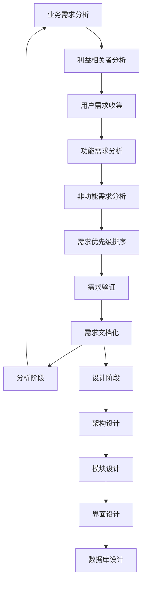

# 需求分析与设计

## 🎯 学习目标
- 掌握需求分析的完整流程和方法
- 学会设计高质量的Odoo模块架构
- 理解功能设计、技术方案和用户体验设计

## 📊 需求分析

### 需求层次结构
需求分析可以分为业务需求、用户需求、系统需求和功能需求四个层次。

### 需求分析流程图


## 🏗️ 需求收集

### 利益相关者分析
```python
# project_management/stakeholder_analyzer.py
from dataclasses import dataclass
from typing import List, Dict, Any
from enum import Enum

class StakeholderType(Enum):
    """利益相关者类型"""
    PRIMARY = "primary"       # 主要用户
    SECONDARY = "secondary"   # 次要用户
    TERTIARY = "tertiary"     # 受影响的用户
    APPROVER = "approver"     # 审批者

class InfluenceLevel(Enum):
    """影响力级别"""
    HIGH = "high"
    MEDIUM = "medium"
    LOW = "low"

class InterestLevel(Enum):
    """关注度级别"""
    HIGH = "high"
    MEDIUM = "medium"
    LOW = "low"

@dataclass
class Stakeholder:
    """利益相关者"""
    id: str
    name: str
    role: str
    organization: str
    contact_info: Dict[str, str]
    stakeholder_type: StakeholderType
    influence_level: InfluenceLevel
    interest_level: InterestLevel
    requirements: List[str]
    pain_points: List[str]
    success_criteria: List[str]
    
class StakeholderAnalyzer:
    """利益相关者分析器"""
    
    def __init__(self):
        self.stakeholders: List[Stakeholder] = []
        self.mapping_matrix: Dict[str, Any] = {}
    
    def register_stakeholder(self, name: str, role: str, organization: str,
                           contact_info: Dict[str, str], 
                           stakeholder_type: StakeholderType,
                           influence_level: InfluenceLevel,
                           interest_level: InterestLevel) -> Stakeholder:
        """注册利益相关者"""
        
        stakeholder = Stakeholder(
            id=f"SH-{len(self.stakeholders) + 1:03d}",
            name=name,
            role=role,
            organization=organization,
            contact_info=contact_info,
            stakeholder_type=stakeholder_type,
            influence_level=influence_level,
            interest_level=interest_level,
            requirements=[],
            pain_points=[],
            success_criteria=[]
        )
        
        self.stakeholders.append(stakeholder)
        self._update_power_influence_matrix()
        
        return stakeholder
    
    def _update_power_influence_matrix(self):
        """更新权力-影响矩阵"""
        high_power_high_interest = []
        high_power_low_interest = []
        low_power_high_interest = []
        low_power_low_interest = []
        
        for stakeholder in self.stakeholders:
            if (stakeholder.influence_level == InfluenceLevel.HIGH and 
                stakeholder.interest_level == InterestLevel.HIGH):
                high_power_high_interest.append(stakeholder)
            elif (stakeholder.influence_level == InfluenceLevel.HIGH and 
                  stakeholder.interest_level == InterestLevel.LOW):
                high_power_low_interest.append(stakeholder)
            elif (stakeholder.influence_level == InfluenceLevel.LOW and 
                  stakeholder.interest_level == InterestLevel.HIGH):
                low_power_high_interest.append(stakeholder)
            else:
                low_power_low_interest.append(stakeholder)
        
        self.mapping_matrix = {
            'high_power_high_interest': high_power_high_interest,
            'high_power_low_interest': high_power_low_interest,
            'low_power_high_interest': low_power_high_interest,
            'low_power_low_interest': low_power_low_interest
        }
    
    def collect_requirements(self, stakeholder_id: str) -> Dict[str, Any]:
        """收集利益相关者需求"""
        stakeholder = self._get_stakeholder_by_id(stakeholder_id)
        if not stakeholder:
            return {}
        
        # 这里可以集成实际的访谈问卷或在线收集工具
        requirements_template = {
            'functional_requirements': self._gather_functional_requirements(stakeholder),
            'non_functional_requirements': self._gather_non_functional_requirements(stakeholder),
            'business_rules': self._gather_business_rules(stakeholder),
            'integration_points': self._gather_integration_requirements(stakeholder)
        }
        
        return requirements_template
    
    def _get_stakeholder_by_id(self, stakeholder_id: str) -> Stakeholder:
        """根据ID获取利益相关者"""
        return next((s for s in self.stakeholders if s.id == stakeholder_id), None)
    
    def _gather_functional_requirements(self, stakeholder: Stakeholder) -> List[str]:
        """收集功能需求"""
        # 基于利益相关者类型，提供针对性问题
        if stakeholder.stakeholder_type == StakeholderType.PRIMARY:
            return [
                "您日常工作流程中最重要的功能是什么？",
                "现有系统哪些地方让您感到不便？",
                "您期望新系统必须具备哪些核心功能？",
                "您是如何处理异常情况和特殊需求的？"
            ]
        elif stakeholder.stakeholder_type == StakeholderType.APPROVER:
            return [
                "审批流程中您需要什么信息和工具？",
                "您如何监控业务绩效和合规性？",
                "哪些决策需要系统支持？",
                "报告和分析需求是什么？"
            ]
        else:
            return [
                "您如何使用外部系统？",
                "数据共享和同步需求是什么？",
                "安全和权限要求是什么？"
            ]
        
    def _gather_non_functional_requirements(self, stakeholder: Stakeholder) -> List[str]:
        """收集非功能需求"""
        return [
            "系统性能要求是什么？（响应时间、并发用户数）",
            "数据安全和隐私要求是什么？",
            "系统可用性要求是什么？",
            "可维护性和扩展性需求是什么？"
        ]
    
    def _gather_business_rules(self, stakeholder: Stakeholder) -> List[str]:
        """收集业务规则"""
        return [
            "业务规则和约束是什么？",
            "工作流和审批流程如何？",
            "数据验证和质量要求是什么？",
            "例外处理和容错机制是什么？"
        ]
    
    def _gather_integration_requirements(self, stakeholder: Stakeholder) -> List[str]:
        """收集集成需求"""
        return [
            "需要集成哪些外部系统？",
            "API和数据交换需求是什么？",
            "实时或批处理要求是什么？"
        ]
```

### 原型设计
```python
# project_management/prototype_designer.py
from abc import ABC, abstractmethod
from typing import Dict, List, Any
import json

class UIElementType(Enum):
    """UI元素类型"""
    BUTTON = "button"
    FIELD = "field"
    TABLE = "table"
    FORM = "form"
    CHART = "chart"
    MENU = "menu"

class UIElement:
    """UI元素"""
    
    def __init__(self, element_type: UIElementType, properties: Dict[str, Any]):
        self.type = element_type
        self.properties = properties
        self.children: List['UIElement'] = []
        self.interactions: List[Dict[str, Any]] = []
    
    def add_child(self, child: 'UIElement'):
        """添加子元素"""
        self.children.append(child)
    
    def add_interaction(self, trigger: str, action: str, target: str = None):
        """添加交互"""
        interaction = {
            'trigger': trigger,  # click, hover, focus, etc.
            'action': action,    # navigate, validate, update, etc.
            'target': target    # target element or page
        }
        self.interactions.append(interaction)

class PagePrototype:
    """页面原型"""
    
    def __init__(self, page_name: str, page_url: str):
        self.name = page_name
        self.url = page_url
        self.elements: List[UIElement] = []
        self.layout: Dict[str, Any] = {}
        self.user_tests: List[Dict[str, Any]] = []
    
    def add_element(self, element: UIElement):
        """添加UI元素"""
        self.elements.append(element)
    
    def set_layout(self, layout_config: Dict[str, Any]):
        """设置布局"""
        self.layout = layout_config
    
    def add_user_test(self, test_data: Dict[str, Any"):
        """添加用户测试数据"""
        self.user_tests.append(test_data)
    
    def generate_code_preview(self) -> str:
        """生成代码预览"""
        code = f"<!-- {self.name} Page -->\n"
        code += f"<url path='{self.url}' type='http'>\n"
        
        for element in self.elements:
            code += f"  <!-- {element.type.value} element -->\n"
            code += self._element_to_code(element, indent="    ")
        
        code += "</url>"
        return code
    
    def _element_to_code(self, element: UIElement, indent: str) -> str:
        """转换元素为代码"""
        if element.type == UIElementType.FIELD:
            field_code = f"{indent}<field name='{element.properties.get('name', '')}'"
            if 'widget' in element.properties:
                field_code += f" widget='{element.properties['widget']}'"
            field_code += "/>\n"
            return field_code
        elif element.type == UIElementType.BUTTON:
            button_text = element.properties.get('text', '')
            return f"{indent}<button string='{button_text}'/>\n"
        elif element.type == UIElementType.TABLE:
            return f"{indent}<tree>\n{indent}  <!-- Tree view content -->\n{indent}</tree>\n"
        # 更多元素类型的实现...
        return str(element.properties)

class ModuleDesigner:
    """模块设计师"""
    
    def __init__(self):
        self.module_specs: Dict[str, Any] = {}
        self.page_prototypes: List[PagePrototype] = []
        self.data_model_designs: List[Dict[str, Any]] = []
    
    def create_module_specification(self, module_name: str, description: str,
                                   business_objective: str) -> Dict[str, Any]:
        """创建模块规格说明"""
        
        spec = {
            'module_name': module_name,
            'description': description,
            'business_objective': business_objective,
            'target_users': [],
            'functional_requirements': [],
            'non_functional_requirements': [],
            'user_stories': [],
            'technical_requirements': {
                'dependencies': [],
                'integrations': [],
                'security_requirements': [],
                'performance_requirements': {}
            },
            'user_interface': {
                'main_menu': {},
                'pages': [],
                'workflows': []
            },
            'acceptance_criteria': [],
        }
        
        self.module_specs[module_name] = spec
        return spec
    
    def design_data_model(self, module_name: str, entities: List[Dict[str, Any]]) -> Dict[str, Any]:
        """设计数据模型"""
        
        model_design = {
            'module_name': module_name,
            'entities': [],
            'relationships': [],
            'business_rules': [],
            'data_constraints': []
        }
        
        for entity in entities:
            entity_model = self._design_entity(entity)
            model_design['entities'].append(entity_model)
        
        self.data_model_designs.append(model_design)
        return model_design
    
    def _design_entity(self, entity_data: Dict[str, Any]) -> Dict[str, Any]:
        """设计实体模型"""
        entity = {
            'name': entity_data['name'],
            'description': entity_data['description'],
            'fields': [],
            'relationships': [],
            'access_rights': {},
            'business_logic': []
        }
        
        # 设计字段
        for field_data in entity_data.get('fields', []):
            field_spec = {
                'name': field_data['name'],
                'type': field_data['type'],
                'required': field_data.get('required', False),
                'defaults': field_data.get('defaults'),
                'validation': field_data.get('validation'),
                'widget': field_data.get('widget'),
                'help_text': field_data.get('help_text')
            }
            entity['fields'].append(field_spec)
        
        return entity
    
    def generate_module_manifest(self, module_name: str) -> str:
        """生成模块清单文件"""
        spec = self.module_specs.get(module_name)
        if not spec:
            return ""
        
        manifest = f"""{
    'name': '{module_name}',
    'version': '1.0.0',
    'author': 'Odoo Team',
    'category': 'Custom',
    'summary': '{spec['description']}',
    'description': '''
        {spec['business_objective']}
        
        功能特性:
        {chr(10).join([f"- {req}" for req in spec['functional_requirements']])}
        
        技术要求:
        {chr(10).join([f"- {req}" for req in spec['technical_requirements']['dependencies']])}
    ''',
    'depends': [],
    'data': [],
    'demo': [],
    'installable': True,
    'auto_install': False,
}"""
        
        return manifest
    
    def generate_model_files(self, module_name: str) -> Dict[str, str]:
        """生成模型文件"""
        model_design = self.data_model_designs[module_name] if module_name in self.data_model_designs.__dict__ else None
        if not model_design:
            return {}
        
        files = {}
        
        # 生成__manifest__.py
        files['__manifest__.py'] = self.generate_module_manifest(module_name)
    
        # 生成models/__init__.py  
        files['models/__init__.py'] = "from . import models"
        
        # 生成主要模型文件
        for entity in model_design['entities']:
            model_name = entity['name'].replace(' ', '_').lower()
            files[f'models/{model_name}.py'] = self._generate_model_code(entity)
        
        return files
    
    def _generate_model_code(self, entity: Dict[str, Any]) -> str:
        """生成模型代码"""
        code = f"""from odoo import models, fields, api, _
from odoo.exceptions import ValidationError

class {entity['name'].replace(' ', '')}(models.Model):
    _name = '{entity['name'].lower().replace(' ', '_')}'
    _description = "{entity['description']}"
    _order = 'id desc'
    
"""
        # 生成字段
        for field in entity['fields']:
            field_line = f"    {field['name']} = fields.{field['type'].title()}"
            
            if field['required']:
                field_line += "(required=True"
            else:
                field_line += "("
            
            if 'defaults' in field and field['defaults']:
                field_line += f", default={field['defaults']}"
            
            if 'help_text' in field and field['help_text']:
                field_line += f", string='{field['help_text']}'"
            
            field_line += ")"
            
            if field.get('validation'):
                field_line += f"  # {field['validation']}"
            
            code += field_line + "\n"
        
        # 添加方法
        code += "\n"
        code += "    @api.constrains('" + "', '".join([f['name'] for f in entity['fields'] if f.get('required')]) + "')\n"
        code += "    def _check_required_fields(self):\n"
        code += "        for record in self:\n"
        code += "            pass  # Add validation logic here\n\n"
        
        return code

class UsabilityAnalyzer:
    """可用性分析器"""
    
    def __init__(self):
        self.heuristics_violations: Dict[str, List[str]] = {}
        self.user_journey_map: Dict[str, List[str]] = {}
        self.accessibility_issues: List[str] = []
    
    def analyze_usability(self, prototype: PagePrototype) -> Dict[str, Any]:
        """分析可用性"""
        analysis_result = {
            'heuristics_analysis': self._analyze_usability_heuristics(prototype),
            'accessibility_analysis': self._analyze_accessibility(prototype),
            'user_flow_analysis': self._analyze_user_flow(prototype),
            'performance_impact': self._analyze_performance_impact(prototype),
            'recommendations': []
        }
        
        # 生成改进建议
        analysis_result['recommendations'] = self._generate_recommendations(analysis_result)
        
        return analysis_result
    
    def _analyze_usability_heuristics(self, prototype: PagePrototype) -> Dict[str, List[str]]:
        """分析可用性启发式"""
        heuristics_violations = {
            'visibility_of_system_status': [],
            'user_and_world': [],
            'user_control': [],
            'consistency': [],
            'error_prevention': [],
            'recognition_not_recall': [],
            'flexibility': [],
            'minimalist_design': [],
            'error_recovery': [],
            'help_documentation': []
        }
        
        # 检查状态可见性
        if not any(elem.type == UIElementType.FIELD and 'status' in elem.properties for elem in prototype.elements):
            heuristics_violations['visibility_of_system_status'].append(
                "页面缺少状态指示器"
            )
        
        # 检查一致性
        element_types = set(elem.type for elem in prototype.elements)
        if len(element_types) > len(set(elem.properties.get('color', 'default') for elem in prototype.elements)):
            heuristics_violations['consistency'].append(
                "UI元素样式不一致"
            )
        
        return heuristics_violations
    
    def _analyze_accessibility(self, prototype: PagePrototype) -> Dict[str, List[str]]:
        """分析可访问性"""
        issues = {
            'wcag_violations': [],
            'navigation_issues': [],
            'form_issues': []
        }
        
        # 检查表单可访问性
        form_elements = [e for e in prototype.elements if e.type == UIElementType.FIELD]
        for elem in form_elements:
            if 'label' not in elem.properties:
                issues['form_issues'].append(f"字段 {elem.properties.get('name', '')} 缺少标签")
        
        return issues
    
    def _analyze_user_flow(self, prototype: PagePrototype) -> Dict[str, Any]:
        """分析用户流程"""
        flow_analysis = {
            'task_completion_time': 0,  # 估算分钟
            'steps_re quired': len(prototype.elements),
            'interaction_points': len([e for e in prototype.elements if e.interactions]),
            'cognitive_load': 'medium'  # low/medium/high
        }
        
        return flow_analysis
    
    def _analyze_performance_impact(self, prototype: PagePrototype) -> Dict[str, Any]:
        """分析性能影响"""
        return {
            'loading_time_estimate': 2.5,  # 秒
            'resource_requirements': 'medium',
            'scalability_concerns': []
        }
    
    def _generate_recommendations(self, analysis: Dict[str, Any]) -> List[str]:
        """生成改进建议"""
        recommendations = []
        
        # 基于启发式违规生成建议
        heuristics = analysis['heuristics_analysis']
        for heuristic, violations in heuristics.items():
            if violations:
                recommendations.append(f"改进{heuristic}: {'; '.join(violations)}")
        
        # 基于可访问性问题生成建议
        a11y = analysis['accessibility_analysis']
        for category, issues in a11y.items():
            if issues:
                recommendations.append(f"修复{category}: {'; '.join(issues[:3])}")
        
        return recommendations
```

## 🔍 需求验证

### 功能测试
```python
# project_management/requirement_validator.py
from typing import Dict, List, Any, Set
import re

class RequirementValidator:
    """需求验证器"""
    
    def __init__(self):
        self.validated_requirements: Set[str] = set()
        self.validation_rules: Dict[str, callable] = {
            'functional': self._validate_functional_requirement,
            'non_functional': self._validate_non_functional_requirement,
            'business_rule': self._validate_business_rule,
            'constraint': self._validate_constraint_requirement
        }
    
    def validate_requirements(self, requirements: Dict[str, List[str]]) -> Dict[str, Any]:
        """验证需求"""
        validation_result = {
            'total_requirements': 0,
            'validated_count': 0,
            'invalid_requirements': [],
            'missing_details': [],
            'quality_score': 0.0
        }
        
        for req_type, req_list in requirements.items():
            validation_result['total_requirements'] += len(req_list)
            
            validator = self.validation_rules.get(req_type)
            if validator:
                for requirement in req_list:
                    is_valid, feedback = validator(requirement)
                    if is_valid:
                        validation_result['validated_count'] += 1
                        self.validated_requirements.add(requirement)
                    else:
                        validation_result['invalid_requirements'].append({
                            'requirement': requirement,
                            'issues': feedback
                        })
        
        validation_result['quality_score'] = self._calculate_quality_score(validation_result)
        
        return validation_result
    
    def _validate_functional_requirement(self, requirement: str) -> tuple[bool, List[str]]:
        """验证功能需求"""
        issues = []
        
        # 检查是否包含用户角色
        if not any(word in requirement.lower() for word in ['user', 'admin', 'manager', 'employee']):
            issues.append("缺少明确用户角色")
        
        # 检查是否包含可验证的条件
        action_words = ['create', 'view', 'edit', 'delete', 'report', 'validate']
        if not any(word in requirement.lower() for word in action_words):
            issues.append("缺少明确的操作行为")
        
        # 检查结构完整性
        if len(requirement.split()) < 5:
            issues.append("需求描述过于简单")
        
        if not requirement.endswith('.'):
            issues.append("需求描述应以句号结尾")
        
        return len(issues) == 0, issues
    
    def _validate_non_functional_requirement(self, requirement: str) -> tuple[bool, List[str]]:
        """验证非功能需求"""
        issues = []
        
        # 检查是否包含量化指标
        quantifiers = re.findall(r'\d+(?:\.\d+)?', requirement)
        if not quantifiers:
            issues.append("缺少量化性能指标")
        
        # 检查是否包含测量单位
        units = ['second', 'minute', 'hour', 'day', 'mb', 'gb', 'user', '%', 'times']
        if not any(unit in requirement.lower() for unit in units):
            issues.append("缺少测量单位")
        
        # 检查是否明确定义范围
        if 'when' not in requirement.lower() and 'where' not in requirement.lower():
            issues.append("缺少适用范围或条件")
        
        return len(issues) == 0, issues
    
    def _validate_business_rule(self, rule: str) -> tuple[bool, List[str]]:")
        """验证业务规则"""
        issues = []
        
        # 检查是否包含业务条件
        condition_words = ['if', 'when', 'unless', 'where']
        if not any(word in rule.lower() for word in condition_words):
            issues.append("缺少业务条件")
        
        # 检查是否包含具体动作
        action_words = ['must', 'should', 'will', 'cannot']
        if not any(word in rule.lower() for word in action_words):
            issues.append("缺少具体执行动作")
        
        return len(issues) == 0, issues
    
    def _validate_constraint_requirement(self, constraint: str) -> tuple[bool, List[str]]:
        """验证约束需求"""
        issues = []
        
        # 检查约束类型
        constraint_types = ['security', 'performance', 'compliance', 'integration']
        if not any(ct in constraint.lower() for ct in constraint_types):
            issues.append("约束类型不明确")
        
        return len(issues) == 0, issues
    
    def _calculate_quality_score(self, validation_result: Dict[str, Any]) -> float:
        """计算质量得分"""
        if validation_result['total_requirements'] == 0:
            return 0.0
        
        validated_ratio = validation_result['validated_count'] / validation_result['total_requirements']
        consistency_score = 1.0 - (len(validation_result['invalid_requirements']) / validation_result['total_requirements'])
        
        return round((validated_ratio + consistency_score) / 2 * 100, 2)

class ReferralChannels:
    """需求追溯追踪器"""
    
    def __init__(self):
        self.traceability_matrix: Dict[str, Dict[str, Any]] = {}
        self.traceability_links: Dict[str, Set[str]] = {}
    
    def create_traceability_matrix(self, business_requirements: List[str],
                                 functional_requirements: List[str]) -> Dict[str, Any]:
        """创建追溯矩阵"""
        
        for br_i, business_req in enumerate(business_requirements):
            br_key = f"BR-{br_i + 1}"
            links = []
            
            for fr_i, functional_req in enumerate(functional_requirements):
                fr_key = f"FR-{fr_i + 1}"
                
                # 简化的关联检测（实际应该使用更复杂的语义分析）
                business_words = set(business_req.lower().split())
                functional_words = set(functional_req.lower().split())
                
                # 计算词汇重叠度
                overlap = len(business_words.intersection(functional_words)) / len(business_words.union(functional_words))
                
                if overlap > 0.3:  # 30%重叠阈值
                    links.append({
                        'requirement_id': fr_key,
                        'coverage_score': round(overlap, 2),
                        'relationship': self._classify_relationship(business_req, functional_req)
                    })
            
            self.traceability_matrix[br_key] = {
                'business_requirement': business_req,
                'functional_requirements': links,
                'coverage_percentage': self._calculate_coverage(links)
            }
        
        return {
            'traceability_matrix': self.traceability_matrix,
            'coverage_summary': self._generate_coverage_summary(),
            'traceability_gaps': self._identify_traceability_gaps()
        }
    
    def _classify_relationship(self, business_req: str, functional_req: str) -> str:
        """分类需求关系"""
        # 简化的关系分类
        if 'data' in functional_req.lower() and 'storage' in business_req.lower():
            return 'implements'
        elif 'interface' in functional_req.lower() and 'interaction' in business_req.lower():
            return 'supports'
        elif 'validation' in functional_req.lower() and 'quality' in business_req.lower():
            return 'ensures'
        else:
            return 'satisfies'
    
    def _calculate_coverage(self, links: List[Dict[str, Any]]) -> float:
        """计算覆盖率"""
        if not links:
            return 0.0
        
        return sum(link['coverage_score'] for link in links) * 100
    
    def _generate_coverage_summary(self) -> Dict[str, Any]:
        """生成覆盖率摘要"""
        total_business_requirements = len(self.traceability_matrix)
        covered_requirements = len([br for br in self.traceability_matrix.values() if br['coverage_percentage'] > 0])
        
        return {
            'total_business_requirements': total_business_requirements,
            'covered_requirements': covered_requirements,
            'coverage_percentage': (covered_requirements / total_business_requirements) * 100 if total_business_requirements > 0 else 0
        }
    
    def _identify_traceability_gaps(self) -> List[Dict[str, Any]]:
        """识别追溯缺口"""
        gaps = []
        
        for br_id, br_data in self.traceability_matrix.items():
            if br_data['coverage_percentage'] == 0:
                gaps.append({
                    'business_requirement_id': br_id,
                    'description': br_data['business_requirement'],
                    'gap_type': 'uncovered',
                    'priority': 'high'
                })
            elif br_data['coverage_percentage'] < 70:
                gaps.append({
                    'business_requirement_id': br_id,
                    'description': br_data['business_requirement'],
                    'gap_type': 'partially_covered',
                    'priority': 'medium'
                })
        
        return gaps
```

## 🔗 相关链接

### 下一步学习
- [[敏捷开发流程]] - 了解敏捷开发流程
- [[版本控制与协作]] - 学习版本控制与协作
- [[团队管理]] - 掌握团队管理

### 实践建议
- 深入了解业务需求
- 注重用户体验设计
- 保持需求的完整性

## 📝 思考题

### 基础理解
1. 需求分析的层次结构是什么？
2. 利益相关者分析的作用是什么？
3. 原型设计的重要性在哪里？

### 深入思考
1. 如何平衡业务需求与技术可行性？
2. 需求变更如何管理和控制？
3. 如何确保需求的完整性和一致性？

---

**学习进度**: ✅ 已完成  
**下一步**: [[版本控制与协作]]
