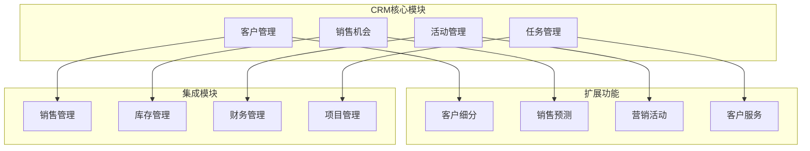

# CRM系统开发案例

## 项目概述

本案例展示如何在Odoo 17中开发一个完整的CRM系统，包括客户管理、销售机会跟踪、活动管理、报表分析等功能。

### 项目架构


## 需求分析

### 业务需求
1. **客户管理**：完整的客户信息管理
2. **销售机会**：销售流程跟踪和管理
3. **活动管理**：客户互动记录
4. **报表分析**：销售数据分析和预测
5. **团队协作**：销售团队协作功能

### 技术需求
1. **模块化设计**：可扩展的模块架构
2. **数据安全**：权限控制和数据保护
3. **性能优化**：大数据量处理能力
4. **移动支持**：移动端访问支持
5. **集成能力**：与其他系统集成

## 系统设计

### 数据模型设计
```python
# -*- coding: utf-8 -*-

from odoo import models, fields, api
from odoo.exceptions import ValidationError, UserError
from datetime import datetime, timedelta


class CrmCustomer(models.Model):
    """CRM客户模型"""
    _name = 'crm.customer'
    _description = 'CRM Customer'
    _inherit = ['mail.thread', 'mail.activity.mixin']
    _order = 'create_date desc'
    
    # 基本信息
    name = fields.Char('Customer Name', required=True, tracking=True)
    code = fields.Char('Customer Code', required=True, index=True)
    customer_type = fields.Selection([
        ('individual', 'Individual'),
        ('company', 'Company'),
        ('government', 'Government')
    ], string='Customer Type', default='individual', required=True)
    
    # 联系信息
    email = fields.Char('Email', tracking=True)
    phone = fields.Char('Phone', tracking=True)
    mobile = fields.Char('Mobile')
    website = fields.Char('Website')
    
    # 地址信息
    street = fields.Char('Street')
    street2 = fields.Char('Street2')
    city = fields.Char('City')
    state_id = fields.Many2one('res.country.state', 'State')
    zip = fields.Char('ZIP')
    country_id = fields.Many2one('res.country', 'Country')
    
    # 业务信息
    industry_id = fields.Many2one('crm.industry', 'Industry')
    company_size = fields.Selection([
        ('startup', 'Startup (1-10)'),
        ('small', 'Small (11-50)'),
        ('medium', 'Medium (51-200)'),
        ('large', 'Large (201-1000)'),
        ('enterprise', 'Enterprise (1000+)')
    ], string='Company Size')
    
    # 销售信息
    user_id = fields.Many2one('res.users', 'Salesperson', default=lambda self: self.env.user)
    team_id = fields.Many2one('crm.team', 'Sales Team')
    customer_segment = fields.Selection([
        ('vip', 'VIP'),
        ('gold', 'Gold'),
        ('silver', 'Silver'),
        ('bronze', 'Bronze')
    ], string='Customer Segment')
    
    # 财务信息
    credit_limit = fields.Float('Credit Limit', digits=(16, 2))
    payment_terms = fields.Selection([
        ('immediate', 'Immediate'),
        ('15_days', '15 Days'),
        ('30_days', '30 Days'),
        ('60_days', '60 Days')
    ], string='Payment Terms', default='30_days')
    
    # 状态信息
    state = fields.Selection([
        ('prospect', 'Prospect'),
        ('qualified', 'Qualified'),
        ('customer', 'Customer'),
        ('inactive', 'Inactive')
    ], string='Status', default='prospect', tracking=True)
    
    # 计算字段
    opportunity_count = fields.Integer('Opportunities', compute='_compute_opportunity_count')
    total_revenue = fields.Float('Total Revenue', compute='_compute_total_revenue')
    last_activity_date = fields.Datetime('Last Activity', compute='_compute_last_activity')
    
    # 约束
    _sql_constraints = [
        ('code_uniq', 'unique(code)', 'Customer code must be unique!'),
        ('email_uniq', 'unique(email)', 'Email must be unique!'),
    ]
    
    @api.depends('opportunity_ids')
    def _compute_opportunity_count(self):
        """计算销售机会数量"""
        for customer in self:
            customer.opportunity_count = len(customer.opportunity_ids)
    
    @api.depends('opportunity_ids.expected_revenue')
    def _compute_total_revenue(self):
        """计算总营收"""
        for customer in self:
            customer.total_revenue = sum(
                opp.expected_revenue for opp in customer.opportunity_ids
                if opp.state in ['won', 'done']
            )
    
    @api.depends('activity_ids.date_deadline')
    def _compute_last_activity(self):
        """计算最后活动日期"""
        for customer in self:
            activities = customer.activity_ids.filtered(
                lambda a: a.state == 'done'
            ).sorted('date_deadline', reverse=True)
            customer.last_activity_date = activities[0].date_deadline if activities else False
    
    @api.model
    def create(self, vals):
        """创建客户时生成客户代码"""
        if not vals.get('code'):
            vals['code'] = self._generate_customer_code()
        return super().create(vals)
    
    def _generate_customer_code(self):
        """生成客户代码"""
        sequence = self.env['ir.sequence'].next_by_code('crm.customer.code')
        return f"CUST{sequence}"
    
    def action_qualify_customer(self):
        """客户资格确认"""
        for customer in self:
            if customer.state == 'prospect':
                customer.write({'state': 'qualified'})
    
    def action_convert_to_customer(self):
        """转换为正式客户"""
        for customer in self:
            if customer.state == 'qualified':
                customer.write({'state': 'customer'})
    
    def action_view_opportunities(self):
        """查看销售机会"""
        action = self.env.ref('crm_custom.action_crm_opportunity').read()[0]
        action['domain'] = [('customer_id', '=', self.id)]
        action['context'] = {'default_customer_id': self.id}
        return action


class CrmOpportunity(models.Model):
    """CRM销售机会模型"""
    _name = 'crm.opportunity'
    _description = 'CRM Opportunity'
    _inherit = ['mail.thread', 'mail.activity.mixin']
    _order = 'create_date desc'
    
    # 基本信息
    name = fields.Char('Opportunity Name', required=True, tracking=True)
    customer_id = fields.Many2one('crm.customer', 'Customer', required=True, tracking=True)
    user_id = fields.Many2one('res.users', 'Salesperson', default=lambda self: self.env.user)
    team_id = fields.Many2one('crm.team', 'Sales Team')
    
    # 销售信息
    expected_revenue = fields.Float('Expected Revenue', digits=(16, 2), tracking=True)
    probability = fields.Float('Probability (%)', default=10.0, tracking=True)
    expected_closing_date = fields.Date('Expected Closing Date', tracking=True)
    
    # 产品信息
    product_ids = fields.Many2many('product.product', string='Products')
    quantity = fields.Float('Quantity', default=1.0)
    unit_price = fields.Float('Unit Price', digits=(16, 2))
    
    # 状态信息
    state = fields.Selection([
        ('new', 'New'),
        ('qualified', 'Qualified'),
        ('proposal', 'Proposal'),
        ('negotiation', 'Negotiation'),
        ('won', 'Won'),
        ('lost', 'Lost')
    ], string='Status', default='new', tracking=True)
    
    # 竞争信息
    competitor_ids = fields.Many2many('crm.competitor', string='Competitors')
    competitive_advantage = fields.Text('Competitive Advantage')
    
    # 计算字段
    weighted_revenue = fields.Float('Weighted Revenue', compute='_compute_weighted_revenue')
    days_to_close = fields.Integer('Days to Close', compute='_compute_days_to_close')
    
    @api.depends('expected_revenue', 'probability')
    def _compute_weighted_revenue(self):
        """计算加权营收"""
        for opportunity in self:
            opportunity.weighted_revenue = opportunity.expected_revenue * (opportunity.probability / 100.0)
    
    @api.depends('expected_closing_date')
    def _compute_days_to_close(self):
        """计算距离成交天数"""
        for opportunity in self:
            if opportunity.expected_closing_date:
                delta = opportunity.expected_closing_date - fields.Date.today()
                opportunity.days_to_close = delta.days
            else:
                opportunity.days_to_close = 0
    
    def action_qualify(self):
        """资格确认"""
        for opportunity in self:
            if opportunity.state == 'new':
                opportunity.write({'state': 'qualified'})
    
    def action_create_proposal(self):
        """创建提案"""
        for opportunity in self:
            if opportunity.state == 'qualified':
                opportunity.write({'state': 'proposal'})
    
    def action_win(self):
        """成交"""
        for opportunity in self:
            if opportunity.state in ['proposal', 'negotiation']:
                opportunity.write({'state': 'won'})
    
    def action_lose(self):
        """失败"""
        for opportunity in self:
            if opportunity.state != 'won':
                opportunity.write({'state': 'lost'})


class CrmActivity(models.Model):
    """CRM活动模型"""
    _name = 'crm.activity'
    _description = 'CRM Activity'
    _inherit = ['mail.thread', 'mail.activity.mixin']
    _order = 'date_planned desc'
    
    # 基本信息
    name = fields.Char('Activity Name', required=True)
    customer_id = fields.Many2one('crm.customer', 'Customer', required=True)
    opportunity_id = fields.Many2one('crm.opportunity', 'Opportunity')
    user_id = fields.Many2one('res.users', 'Assigned To', default=lambda self: self.env.user)
    
    # 活动信息
    activity_type = fields.Selection([
        ('call', 'Phone Call'),
        ('email', 'Email'),
        ('meeting', 'Meeting'),
        ('demo', 'Demo'),
        ('proposal', 'Proposal'),
        ('follow_up', 'Follow Up')
    ], string='Activity Type', required=True)
    
    date_planned = fields.Datetime('Planned Date', required=True)
    duration = fields.Float('Duration (hours)', default=1.0)
    description = fields.Text('Description')
    
    # 结果信息
    state = fields.Selection([
        ('planned', 'Planned'),
        ('done', 'Done'),
        ('cancelled', 'Cancelled')
    ], string='Status', default='planned', tracking=True)
    
    result = fields.Selection([
        ('positive', 'Positive'),
        ('neutral', 'Neutral'),
        ('negative', 'Negative')
    ], string='Result')
    
    notes = fields.Text('Notes')
    
    def action_mark_done(self):
        """标记完成"""
        for activity in self:
            if activity.state == 'planned':
                activity.write({'state': 'done'})
    
    def action_cancel(self):
        """取消活动"""
        for activity in self:
            if activity.state == 'planned':
                activity.write({'state': 'cancelled'})
```

### 视图设计
```xml
<?xml version="1.0" encoding="utf-8"?>
<odoo>
    <!-- 客户表单视图 -->
    <record id="view_crm_customer_form" model="ir.ui.view">
        <field name="name">crm.customer.form</field>
        <field name="model">crm.customer</field>
        <field name="arch" type="xml">
            <form>
                <header>
                    <button name="action_qualify_customer" 
                            type="object" 
                            string="Qualify" 
                            class="btn-primary" 
                            states="prospect"/>
                    <button name="action_convert_to_customer" 
                            type="object" 
                            string="Convert to Customer" 
                            class="btn-primary" 
                            states="qualified"/>
                    <field name="state" widget="statusbar" 
                           statusbar_visible="prospect,qualified,customer"/>
                </header>
                
                <sheet>
                    <div class="oe_button_box" name="button_box">
                        <button name="action_view_opportunities" 
                                type="object" 
                                class="oe_stat_button">
                            <field name="opportunity_count" widget="statinfo" 
                                   string="Opportunities"/>
                        </button>
                    </div>
                    
                    <group>
                        <group name="basic_info">
                            <field name="name"/>
                            <field name="code"/>
                            <field name="customer_type"/>
                            <field name="state"/>
                        </group>
                        <group name="contact_info">
                            <field name="email"/>
                            <field name="phone"/>
                            <field name="mobile"/>
                            <field name="website"/>
                        </group>
                    </group>
                    
                    <group>
                        <group name="business_info">
                            <field name="industry_id"/>
                            <field name="company_size"/>
                            <field name="customer_segment"/>
                        </group>
                        <group name="sales_info">
                            <field name="user_id"/>
                            <field name="team_id"/>
                        </group>
                    </group>
                    
                    <notebook>
                        <page string="Address" name="address">
                            <group>
                                <field name="street"/>
                                <field name="street2"/>
                                <field name="city"/>
                                <field name="state_id"/>
                                <field name="zip"/>
                                <field name="country_id"/>
                            </group>
                        </page>
                        
                        <page string="Financial" name="financial">
                            <group>
                                <field name="credit_limit"/>
                                <field name="payment_terms"/>
                            </group>
                        </page>
                        
                        <page string="Activities" name="activities">
                            <field name="activity_ids">
                                <tree>
                                    <field name="name"/>
                                    <field name="activity_type"/>
                                    <field name="date_planned"/>
                                    <field name="user_id"/>
                                    <field name="state"/>
                                </tree>
                            </field>
                        </page>
                    </notebook>
                </sheet>
            </form>
        </field>
    </record>
    
    <!-- 客户列表视图 -->
    <record id="view_crm_customer_tree" model="ir.ui.view">
        <field name="name">crm.customer.tree</field>
        <field name="model">crm.customer</field>
        <field name="arch" type="xml">
            <tree decoration-info="state == 'prospect'" 
                  decoration-success="state == 'customer'"
                  decoration-muted="state == 'inactive'">
                <field name="code"/>
                <field name="name"/>
                <field name="customer_type"/>
                <field name="email"/>
                <field name="phone"/>
                <field name="user_id"/>
                <field name="state" widget="badge"/>
                <field name="total_revenue" sum="Total Revenue"/>
            </tree>
        </field>
    </record>
    
    <!-- 销售机会表单视图 -->
    <record id="view_crm_opportunity_form" model="ir.ui.view">
        <field name="name">crm.opportunity.form</field>
        <field name="model">crm.opportunity</field>
        <field name="arch" type="xml">
            <form>
                <header>
                    <button name="action_qualify" 
                            type="object" 
                            string="Qualify" 
                            class="btn-primary" 
                            states="new"/>
                    <button name="action_create_proposal" 
                            type="object" 
                            string="Create Proposal" 
                            class="btn-primary" 
                            states="qualified"/>
                    <button name="action_win" 
                            type="object" 
                            string="Win" 
                            class="btn-success" 
                            states="proposal,negotiation"/>
                    <button name="action_lose" 
                            type="object" 
                            string="Lose" 
                            class="btn-danger" 
                            states="new,qualified,proposal,negotiation"/>
                    <field name="state" widget="statusbar" 
                           statusbar_visible="new,qualified,proposal,negotiation,won"/>
                </header>
                
                <sheet>
                    <group>
                        <group name="basic_info">
                            <field name="name"/>
                            <field name="customer_id"/>
                            <field name="user_id"/>
                            <field name="team_id"/>
                        </group>
                        <group name="sales_info">
                            <field name="expected_revenue"/>
                            <field name="probability"/>
                            <field name="expected_closing_date"/>
                            <field name="weighted_revenue"/>
                        </group>
                    </group>
                    
                    <notebook>
                        <page string="Products" name="products">
                            <field name="product_ids" widget="many2many_tags"/>
                            <field name="quantity"/>
                            <field name="unit_price"/>
                        </page>
                        
                        <page string="Competition" name="competition">
                            <field name="competitor_ids" widget="many2many_tags"/>
                            <field name="competitive_advantage"/>
                        </page>
                    </notebook>
                </sheet>
            </form>
        </field>
    </record>
</odoo>
```

## 功能实现

### 客户细分功能
```python
class CrmCustomerSegment(models.Model):
    """客户细分模型"""
    _name = 'crm.customer.segment'
    _description = 'Customer Segment'
    
    name = fields.Char('Segment Name', required=True)
    criteria = fields.Text('Criteria')
    color = fields.Integer('Color')
    
    @api.model
    def auto_segment_customers(self):
        """自动客户细分"""
        customers = self.env['crm.customer'].search([])
        
        for customer in customers:
            segment = self._determine_segment(customer)
            if segment:
                customer.write({'customer_segment': segment})
    
    def _determine_segment(self, customer):
        """确定客户细分"""
        if customer.total_revenue > 100000:
            return 'vip'
        elif customer.total_revenue > 50000:
            return 'gold'
        elif customer.total_revenue > 10000:
            return 'silver'
        else:
            return 'bronze'
```

### 销售预测功能
```python
class CrmSalesForecast(models.Model):
    """销售预测模型"""
    _name = 'crm.sales.forecast'
    _description = 'Sales Forecast'
    
    name = fields.Char('Forecast Name', required=True)
    period_start = fields.Date('Period Start', required=True)
    period_end = fields.Date('Period End', required=True)
    user_id = fields.Many2one('res.users', 'Salesperson')
    team_id = fields.Many2one('crm.team', 'Sales Team')
    
    # 预测数据
    forecasted_revenue = fields.Float('Forecasted Revenue', digits=(16, 2))
    actual_revenue = fields.Float('Actual Revenue', digits=(16, 2))
    accuracy = fields.Float('Accuracy (%)', compute='_compute_accuracy')
    
    @api.depends('forecasted_revenue', 'actual_revenue')
    def _compute_accuracy(self):
        """计算预测准确性"""
        for forecast in self:
            if forecast.forecasted_revenue > 0:
                accuracy = (1 - abs(forecast.forecasted_revenue - forecast.actual_revenue) / forecast.forecasted_revenue) * 100
                forecast.accuracy = max(0, min(100, accuracy))
            else:
                forecast.accuracy = 0
    
    @api.model
    def generate_forecast(self, period_start, period_end, user_id=None, team_id=None):
        """生成销售预测"""
        domain = [
            ('expected_closing_date', '>=', period_start),
            ('expected_closing_date', '<=', period_end),
            ('state', 'in', ['qualified', 'proposal', 'negotiation'])
        ]
        
        if user_id:
            domain.append(('user_id', '=', user_id))
        if team_id:
            domain.append(('team_id', '=', team_id))
        
        opportunities = self.env['crm.opportunity'].search(domain)
        forecasted_revenue = sum(opp.weighted_revenue for opp in opportunities)
        
        return {
            'forecasted_revenue': forecasted_revenue,
            'opportunity_count': len(opportunities),
            'weighted_opportunities': opportunities
        }
```

### 营销活动功能
```python
class CrmMarketingCampaign(models.Model):
    """营销活动模型"""
    _name = 'crm.marketing.campaign'
    _description = 'Marketing Campaign'
    _inherit = ['mail.thread', 'mail.activity.mixin']
    
    name = fields.Char('Campaign Name', required=True)
    campaign_type = fields.Selection([
        ('email', 'Email Campaign'),
        ('social', 'Social Media'),
        ('event', 'Event'),
        ('webinar', 'Webinar'),
        ('content', 'Content Marketing')
    ], string='Campaign Type', required=True)
    
    start_date = fields.Date('Start Date', required=True)
    end_date = fields.Date('End Date', required=True)
    budget = fields.Float('Budget', digits=(16, 2))
    
    # 目标客户
    target_segment = fields.Selection([
        ('vip', 'VIP'),
        ('gold', 'Gold'),
        ('silver', 'Silver'),
        ('bronze', 'Bronze'),
        ('all', 'All')
    ], string='Target Segment', default='all')
    
    # 结果统计
    target_customers = fields.Integer('Target Customers', compute='_compute_target_customers')
    reached_customers = fields.Integer('Reached Customers')
    converted_customers = fields.Integer('Converted Customers')
    conversion_rate = fields.Float('Conversion Rate (%)', compute='_compute_conversion_rate')
    
    @api.depends('target_segment')
    def _compute_target_customers(self):
        """计算目标客户数量"""
        for campaign in self:
            if campaign.target_segment == 'all':
                customers = self.env['crm.customer'].search([])
            else:
                customers = self.env['crm.customer'].search([
                    ('customer_segment', '=', campaign.target_segment)
                ])
            campaign.target_customers = len(customers)
    
    @api.depends('reached_customers', 'converted_customers')
    def _compute_conversion_rate(self):
        """计算转化率"""
        for campaign in self:
            if campaign.reached_customers > 0:
                campaign.conversion_rate = (campaign.converted_customers / campaign.reached_customers) * 100
            else:
                campaign.conversion_rate = 0
```

## 报表和仪表板

### 销售仪表板
```xml
<!-- 销售仪表板视图 -->
<record id="view_crm_dashboard" model="ir.ui.view">
    <field name="name">crm.dashboard</field>
    <field name="model">crm.customer</field>
    <field name="arch" type="xml">
        <dashboard>
            <view type="graph" ref="view_crm_revenue_chart"/>
            <view type="pivot" ref="view_crm_opportunity_pivot"/>
            <group>
                <aggregate name="total_revenue" field="total_revenue" string="Total Revenue"/>
                <aggregate name="opportunity_count" field="opportunity_count" string="Total Opportunities"/>
            </group>
        </dashboard>
    </field>
</record>

<!-- 营收图表 -->
<record id="view_crm_revenue_chart" model="ir.ui.view">
    <field name="name">crm.revenue.chart</field>
    <field name="model">crm.opportunity</field>
    <field name="arch" type="xml">
        <graph type="bar">
            <field name="expected_closing_date" type="row"/>
            <field name="expected_revenue" type="measure"/>
        </graph>
    </field>
</record>

<!-- 销售机会透视表 -->
<record id="view_crm_opportunity_pivot" model="ir.ui.view">
    <field name="name">crm.opportunity.pivot</field>
    <field name="model">crm.opportunity</field>
    <field name="arch" type="xml">
        <pivot>
            <field name="user_id" type="row"/>
            <field name="state" type="col"/>
            <field name="expected_revenue" type="measure"/>
        </pivot>
    </field>
</record>
```

### 自定义报表
```python
class CrmCustomReport(models.AbstractModel):
    """CRM自定义报表"""
    _name = 'report.crm_custom.customer_report'
    _description = 'Customer Report'
    
    def _get_report_values(self, docids, data=None):
        """获取报表数据"""
        customers = self.env['crm.customer'].browse(docids)
        
        return {
            'doc_ids': docids,
            'doc_model': 'crm.customer',
            'docs': customers,
            'data': data,
            'get_opportunity_summary': self._get_opportunity_summary,
            'get_activity_summary': self._get_activity_summary,
        }
    
    def _get_opportunity_summary(self, customer):
        """获取销售机会摘要"""
        opportunities = customer.opportunity_ids
        return {
            'total': len(opportunities),
            'won': len(opportunities.filtered(lambda o: o.state == 'won')),
            'lost': len(opportunities.filtered(lambda o: o.state == 'lost')),
            'active': len(opportunities.filtered(lambda o: o.state in ['new', 'qualified', 'proposal', 'negotiation'])),
            'total_revenue': sum(opp.expected_revenue for opp in opportunities if opp.state == 'won')
        }
    
    def _get_activity_summary(self, customer):
        """获取活动摘要"""
        activities = customer.activity_ids
        return {
            'total': len(activities),
            'planned': len(activities.filtered(lambda a: a.state == 'planned')),
            'done': len(activities.filtered(lambda a: a.state == 'done')),
            'cancelled': len(activities.filtered(lambda a: a.state == 'cancelled')),
        }
```

## 移动端支持

### 移动端视图
```xml
<!-- 移动端客户列表 -->
<record id="view_crm_customer_mobile" model="ir.ui.view">
    <field name="name">crm.customer.mobile</field>
    <field name="model">crm.customer</field>
    <field name="arch" type="xml">
        <kanban>
            <field name="name"/>
            <field name="customer_segment"/>
            <field name="state"/>
            <field name="total_revenue"/>
            <templates>
                <t t-name="kanban-box">
                    <div class="oe_kanban_card">
                        <div class="oe_kanban_content">
                            <div class="o_kanban_record_top">
                                <div class="o_kanban_record_headings">
                                    <strong class="o_kanban_record_title">
                                        <field name="name"/>
                                    </strong>
                                </div>
                                <div class="o_kanban_record_body">
                                    <field name="customer_segment" widget="badge"/>
                                    <field name="state" widget="badge"/>
                                </div>
                            </div>
                        </div>
                    </div>
                </t>
            </templates>
        </kanban>
    </field>
</record>
```

## 集成和扩展

### 与销售模块集成
```python
class SaleOrder(models.Model):
    _inherit = 'sale.order'
    
    crm_customer_id = fields.Many2one('crm.customer', 'CRM Customer')
    opportunity_id = fields.Many2one('crm.opportunity', 'Opportunity')
    
    def action_confirm(self):
        """确认订单时更新CRM数据"""
        result = super().action_confirm()
        
        for order in self:
            if order.opportunity_id:
                order.opportunity_id.action_win()
            
            if order.crm_customer_id:
                order.crm_customer_id.action_convert_to_customer()
        
        return result
```

### 与库存模块集成
```python
class StockPicking(models.Model):
    _inherit = 'stock.picking'
    
    crm_customer_id = fields.Many2one('crm.customer', 'CRM Customer')
    
    def button_validate(self):
        """确认发货时更新CRM活动"""
        result = super().button_validate()
        
        for picking in self:
            if picking.crm_customer_id:
                self.env['crm.activity'].create({
                    'name': f'Delivery completed for {picking.name}',
                    'customer_id': picking.crm_customer_id.id,
                    'activity_type': 'follow_up',
                    'date_planned': fields.Datetime.now(),
                    'state': 'done',
                    'result': 'positive',
                    'notes': f'Delivery {picking.name} completed successfully'
                })
        
        return result
```

## 性能优化

### 数据库优化
```python
class CrmCustomer(models.Model):
    _inherit = 'crm.customer'
    
    # 添加索引
    _sql_constraints = [
        ('code_uniq', 'unique(code)', 'Customer code must be unique!'),
        ('email_uniq', 'unique(email)', 'Email must be unique!'),
    ]
    
    @api.model
    def _get_customers_with_opportunities(self):
        """获取有销售机会的客户（优化查询）"""
        return self.search([
            ('opportunity_ids', '!=', False)
        ]).with_context(prefetch_fields=['opportunity_ids'])
    
    @api.model
    def _get_high_value_customers(self, limit=100):
        """获取高价值客户（优化查询）"""
        return self.search([
            ('total_revenue', '>', 50000)
        ], limit=limit, order='total_revenue desc')
```

### 缓存优化
```python
import redis
from functools import wraps

class CrmCache:
    def __init__(self):
        self.redis_client = redis.Redis(host='localhost', port=6379, db=0)
    
    def cache_customer_data(self, timeout=300):
        """缓存客户数据装饰器"""
        def decorator(func):
            @wraps(func)
            def wrapper(self, customer_id):
                cache_key = f"customer_data:{customer_id}"
                cached_data = self.redis_client.get(cache_key)
                
                if cached_data:
                    return json.loads(cached_data)
                
                result = func(self, customer_id)
                self.redis_client.setex(cache_key, timeout, json.dumps(result, default=str))
                return result
            return wrapper
        return decorator

# 使用示例
crm_cache = CrmCache()

class CrmCustomer(models.Model):
    _inherit = 'crm.customer'
    
    @crm_cache.cache_customer_data(timeout=600)
    def get_customer_summary(self, customer_id):
        """获取客户摘要（带缓存）"""
        customer = self.browse(customer_id)
        return {
            'name': customer.name,
            'total_revenue': customer.total_revenue,
            'opportunity_count': customer.opportunity_count,
            'last_activity': customer.last_activity_date
        }
```

## 部署和维护

### 模块配置
```python
# __manifest__.py
{
    'name': 'CRM Custom',
    'version': '17.0.1.0.0',
    'category': 'CRM',
    'summary': 'Custom CRM System',
    'description': '''
        Custom CRM System with advanced features:
        - Customer Management
        - Opportunity Tracking
        - Activity Management
        - Sales Forecasting
        - Marketing Campaigns
    ''',
    'author': 'Your Company',
    'website': 'https://www.yourcompany.com',
    'depends': [
        'base',
        'crm',
        'sale',
        'stock',
        'account',
        'mail',
        'web'
    ],
    'data': [
        'security/ir.model.access.csv',
        'security/crm_security.xml',
        'data/crm_data.xml',
        'views/crm_customer_views.xml',
        'views/crm_opportunity_views.xml',
        'views/crm_activity_views.xml',
        'views/crm_dashboard_views.xml',
        'reports/crm_reports.xml',
        'wizards/crm_wizard_views.xml',
    ],
    'demo': [
        'demo/crm_demo.xml',
    ],
    'installable': True,
    'application': True,
    'auto_install': False,
    'license': 'LGPL-3',
}
```

### 安全配置
```xml
<!-- security/crm_security.xml -->
<?xml version="1.0" encoding="utf-8"?>
<odoo>
    <!-- 访问权限 -->
    <record id="access_crm_customer" model="ir.model.access">
        <field name="name">crm.customer</field>
        <field name="model_id" ref="model_crm_customer"/>
        <field name="group_id" ref="sales_team.group_sale_manager"/>
        <field name="perm_read" eval="1"/>
        <field name="perm_write" eval="1"/>
        <field name="perm_create" eval="1"/>
        <field name="perm_unlink" eval="1"/>
    </record>
    
    <!-- 记录规则 -->
    <record id="rule_crm_customer_user" model="ir.rule">
        <field name="name">CRM Customer: User Access</field>
        <field name="model_id" ref="model_crm_customer"/>
        <field name="domain_force">[('user_id', '=', user.id)]</field>
        <field name="groups" eval="[(4, ref('sales_team.group_sale_salesman'))]"/>
    </record>
</odoo>
```

## 最佳实践

### 开发实践
1. **模块化设计**：按功能划分模块
2. **数据验证**：实施严格的数据验证
3. **权限控制**：建立完善的权限体系
4. **性能优化**：优化查询和缓存
5. **测试覆盖**：建立完整的测试体系

### 部署实践
1. **环境分离**：开发、测试、生产环境分离
2. **数据备份**：定期备份重要数据
3. **监控告警**：建立系统监控
4. **版本控制**：使用Git管理代码
5. **文档维护**：保持文档更新

## 学习建议

### 理解重点
1. **CRM概念**：理解CRM系统的核心概念
2. **Odoo架构**：掌握Odoo的模块化架构
3. **数据模型**：学会设计数据模型
4. **业务流程**：理解销售业务流程

### 实践建议
- 从简单功能开始
- 逐步增加复杂功能
- 注重用户体验
- 关注性能优化
- 建立测试体系

## 相关链接
- [[ERP模块定制案例]] - ERP系统开发
- [[电商平台集成案例]] - 电商系统集成
- [[财务系统开发案例]] - 财务系统开发
- [[项目管理系统案例]] - 项目管理系统
