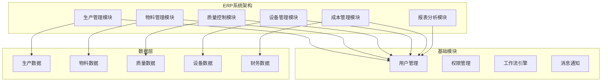

# ERP模块定制案例

## Odoo 17 ERP模块定制开发

本文档详细介绍如何使用Odoo 17进行ERP模块定制开发，包括需求分析、模块设计、开发实现和部署上线。

### 项目概述

#### 项目背景
某制造企业需要定制ERP系统，主要需求包括：
- 生产计划管理
- 物料需求计划(MRP)
- 质量控制管理
- 设备维护管理
- 成本核算管理

#### 项目架构


### 需求分析

#### 1. 生产管理模块需求
```python
# 生产管理需求分析
class ProductionRequirements:
    """生产管理需求"""
    
    def __init__(self):
        self.requirements = {
            'production_planning': {
                'name': '生产计划管理',
                'features': [
                    '生产订单创建',
                    '生产计划排程',
                    '生产进度跟踪',
                    '生产报表生成'
                ],
                'business_rules': [
                    '生产订单必须关联产品',
                    '生产数量不能为负数',
                    '生产日期不能早于当前日期',
                    '生产状态必须按流程流转'
                ]
            },
            'work_order_management': {
                'name': '工单管理',
                'features': [
                    '工单创建和分配',
                    '工单执行跟踪',
                    '工单完成确认',
                    '工单异常处理'
                ],
                'business_rules': [
                    '工单必须分配给操作员',
                    '工单状态必须按流程流转',
                    '工单完成必须确认',
                    '异常工单必须处理'
                ]
            },
            'production_tracking': {
                'name': '生产跟踪',
                'features': [
                    '生产进度实时跟踪',
                    '生产数据采集',
                    '生产异常报警',
                    '生产报表分析'
                ],
                'business_rules': [
                    '生产数据必须实时更新',
                    '异常情况必须及时报警',
                    '生产报表必须准确',
                    '数据必须可追溯'
                ]
            }
        }
```

#### 2. 物料管理模块需求
```python
# 物料管理需求分析
class MaterialRequirements:
    """物料管理需求"""
    
    def __init__(self):
        self.requirements = {
            'material_planning': {
                'name': '物料需求计划',
                'features': [
                    'MRP计算',
                    '物料需求分析',
                    '采购建议生成',
                    '库存预警'
                ],
                'business_rules': [
                    'MRP计算必须准确',
                    '物料需求必须及时',
                    '采购建议必须合理',
                    '库存预警必须及时'
                ]
            },
            'inventory_management': {
                'name': '库存管理',
                'features': [
                    '入库管理',
                    '出库管理',
                    '库存盘点',
                    '库存调拨'
                ],
                'business_rules': [
                    '入库必须确认',
                    '出库必须审批',
                    '盘点必须准确',
                    '调拨必须记录'
                ]
            },
            'supplier_management': {
                'name': '供应商管理',
                'features': [
                    '供应商信息管理',
                    '供应商评估',
                    '采购合同管理',
                    '供应商绩效分析'
                ],
                'business_rules': [
                    '供应商信息必须完整',
                    '供应商评估必须客观',
                    '采购合同必须有效',
                    '绩效分析必须准确'
                ]
            }
        }
```

### 模块设计

#### 1. 生产管理模块设计
```python
# models/production_management.py
from odoo import models, fields, api
from odoo.exceptions import ValidationError, UserError

class ProductionOrder(models.Model):
    _name = 'production.order'
    _description = '生产订单'
    _inherit = ['mail.thread', 'mail.activity.mixin']
    
    # 基本信息
    name = fields.Char('生产订单号', required=True, index=True)
    product_id = fields.Many2one('product.product', '产品', required=True)
    product_qty = fields.Float('生产数量', required=True, digits=(16, 2))
    product_uom_id = fields.Many2one('uom.uom', '单位', required=True)
    
    # 计划信息
    planned_start_date = fields.Datetime('计划开始时间', required=True)
    planned_end_date = fields.Datetime('计划结束时间', required=True)
    actual_start_date = fields.Datetime('实际开始时间')
    actual_end_date = fields.Datetime('实际结束时间')
    
    # 状态信息
    state = fields.Selection([
        ('draft', '草稿'),
        ('confirmed', '已确认'),
        ('in_progress', '进行中'),
        ('done', '已完成'),
        ('cancelled', '已取消')
    ], '状态', default='draft', tracking=True)
    
    # 关联信息
    work_order_ids = fields.One2many('work.order', 'production_order_id', '工单')
    material_line_ids = fields.One2many('production.material.line', 'production_order_id', '物料需求')
    quality_check_ids = fields.One2many('quality.check', 'production_order_id', '质量检查')
    
    # 计算字段
    progress = fields.Float('完成进度', compute='_compute_progress')
    material_availability = fields.Boolean('物料可用性', compute='_compute_material_availability')
    
    @api.depends('work_order_ids.state')
    def _compute_progress(self):
        for order in self:
            if order.work_order_ids:
                completed_orders = order.work_order_ids.filtered(lambda x: x.state == 'done')
                order.progress = (len(completed_orders) / len(order.work_order_ids)) * 100
            else:
                order.progress = 0.0
    
    @api.depends('material_line_ids.available_qty', 'material_line_ids.required_qty')
    def _compute_material_availability(self):
        for order in self:
            order.material_availability = all(
                line.available_qty >= line.required_qty 
                for line in order.material_line_ids
            )
    
    @api.model
    def create(self, vals):
        if not vals.get('name'):
            vals['name'] = self.env['ir.sequence'].next_by_code('production.order')
        return super().create(vals)
    
    def action_confirm(self):
        """确认生产订单"""
        for order in self:
            if order.state != 'draft':
                raise UserError("只能确认草稿状态的订单")
            
            # 检查物料可用性
            if not order.material_availability:
                raise UserError("物料不足，无法开始生产")
            
            # 创建工单
            order._create_work_orders()
            
            # 更新状态
            order.write({
                'state': 'confirmed',
                'actual_start_date': fields.Datetime.now()
            })
    
    def action_start(self):
        """开始生产"""
        for order in self:
            if order.state != 'confirmed':
                raise UserError("只能开始已确认的订单")
            
            order.write({'state': 'in_progress'})
    
    def action_done(self):
        """完成生产"""
        for order in self:
            if order.state != 'in_progress':
                raise UserError("只能完成进行中的订单")
            
            # 检查所有工单是否完成
            if not all(wo.state == 'done' for wo in order.work_order_ids):
                raise UserError("所有工单必须完成才能结束生产")
            
            # 更新状态
            order.write({
                'state': 'done',
                'actual_end_date': fields.Datetime.now()
            })
            
            # 创建库存移动
            order._create_stock_moves()
    
    def _create_work_orders(self):
        """创建工单"""
        for order in self:
            # 根据产品BOM创建工单
            bom = self.env['mrp.bom'].search([
                ('product_id', '=', order.product_id.id)
            ], limit=1)
            
            if bom:
                for line in bom.bom_line_ids:
                    self.env['work.order'].create({
                        'production_order_id': order.id,
                        'product_id': line.product_id.id,
                        'product_qty': line.product_qty * order.product_qty,
                        'work_center_id': line.work_center_id.id,
                        'planned_start_date': order.planned_start_date,
                        'planned_end_date': order.planned_end_date
                    })
    
    def _create_stock_moves(self):
        """创建库存移动"""
        for order in self:
            # 创建成品入库
            self.env['stock.move'].create({
                'name': f'生产入库-{order.name}',
                'product_id': order.product_id.id,
                'product_uom_qty': order.product_qty,
                'product_uom': order.product_uom_id.id,
                'location_id': self.env.ref('stock.stock_location_production').id,
                'location_dest_id': self.env.ref('stock.stock_location_stock').id,
                'origin': order.name,
                'state': 'done'
            })

class WorkOrder(models.Model):
    _name = 'work.order'
    _description = '工单'
    
    # 基本信息
    name = fields.Char('工单号', required=True)
    production_order_id = fields.Many2one('production.order', '生产订单', required=True)
    product_id = fields.Many2one('product.product', '产品', required=True)
    product_qty = fields.Float('数量', required=True, digits=(16, 2))
    
    # 工作中心
    work_center_id = fields.Many2one('mrp.workcenter', '工作中心', required=True)
    operator_id = fields.Many2one('res.users', '操作员')
    
    # 时间信息
    planned_start_date = fields.Datetime('计划开始时间')
    planned_end_date = fields.Datetime('计划结束时间')
    actual_start_date = fields.Datetime('实际开始时间')
    actual_end_date = fields.Datetime('实际结束时间')
    
    # 状态信息
    state = fields.Selection([
        ('draft', '草稿'),
        ('assigned', '已分配'),
        'in_progress', '进行中'),
        ('done', '已完成'),
        ('cancelled', '已取消')
    ], '状态', default='draft')
    
    # 质量信息
    quality_check_ids = fields.One2many('quality.check', 'work_order_id', '质量检查')
    quality_status = fields.Selection([
        ('pending', '待检查'),
        ('passed', '合格'),
        ('failed', '不合格')
    ], '质量状态', default='pending')
    
    @api.model
    def create(self, vals):
        if not vals.get('name'):
            vals['name'] = self.env['ir.sequence'].next_by_code('work.order')
        return super().create(vals)
    
    def action_assign(self):
        """分配工单"""
        for order in self:
            if order.state != 'draft':
                raise UserError("只能分配草稿状态的工单")
            
            order.write({'state': 'assigned'})
    
    def action_start(self):
        """开始工单"""
        for order in self:
            if order.state != 'assigned':
                raise UserError("只能开始已分配的工单")
            
            order.write({
                'state': 'in_progress',
                'actual_start_date': fields.Datetime.now()
            })
    
    def action_done(self):
        """完成工单"""
        for order in self:
            if order.state != 'in_progress':
                raise UserError("只能完成进行中的工单")
            
            # 检查质量状态
            if order.quality_status == 'failed':
                raise UserError("质量不合格的工单不能完成")
            
            order.write({
                'state': 'done',
                'actual_end_date': fields.Datetime.now()
            })
```

#### 2. 物料管理模块设计
```python
# models/material_management.py
from odoo import models, fields, api
from odoo.exceptions import ValidationError, UserError

class MaterialRequirement(models.Model):
    _name = 'material.requirement'
    _description = '物料需求'
    
    # 基本信息
    name = fields.Char('需求编号', required=True)
    product_id = fields.Many2one('product.product', '物料', required=True)
    required_qty = fields.Float('需求数量', required=True, digits=(16, 2))
    available_qty = fields.Float('可用数量', compute='_compute_available_qty')
    shortage_qty = fields.Float('短缺数量', compute='_compute_shortage_qty')
    
    # 时间信息
    required_date = fields.Date('需求日期', required=True)
    create_date = fields.Datetime('创建时间', readonly=True)
    
    # 状态信息
    state = fields.Selection([
        ('draft', '草稿'),
        ('confirmed', '已确认'),
        ('purchased', '已采购'),
        ('received', '已收货'),
        ('cancelled', '已取消')
    ], '状态', default='draft')
    
    # 关联信息
    production_order_id = fields.Many2one('production.order', '生产订单')
    purchase_order_id = fields.Many2one('purchase.order', '采购订单')
    
    @api.depends('product_id')
    def _compute_available_qty(self):
        for req in self:
            if req.product_id:
                req.available_qty = req.product_id.qty_available
            else:
                req.available_qty = 0.0
    
    @api.depends('required_qty', 'available_qty')
    def _compute_shortage_qty(self):
        for req in self:
            req.shortage_qty = max(0, req.required_qty - req.available_qty)
    
    @api.model
    def create(self, vals):
        if not vals.get('name'):
            vals['name'] = self.env['ir.sequence'].next_by_code('material.requirement')
        return super().create(vals)
    
    def action_confirm(self):
        """确认需求"""
        for req in self:
            if req.state != 'draft':
                raise UserError("只能确认草稿状态的需求")
            
            req.write({'state': 'confirmed'})
    
    def action_create_purchase(self):
        """创建采购订单"""
        for req in self:
            if req.state != 'confirmed':
                raise UserError("只能为已确认的需求创建采购订单")
            
            # 查找供应商
            supplier = req.product_id.seller_ids[0] if req.product_id.seller_ids else False
            if not supplier:
                raise UserError(f"产品 {req.product_id.name} 没有供应商")
            
            # 创建采购订单
            purchase_order = self.env['purchase.order'].create({
                'partner_id': supplier.partner_id.id,
                'order_line': [(0, 0, {
                    'product_id': req.product_id.id,
                    'product_qty': req.shortage_qty,
                    'price_unit': supplier.price,
                    'date_planned': req.required_date
                })]
            })
            
            req.write({
                'state': 'purchased',
                'purchase_order_id': purchase_order.id
            })

class ProductionMaterialLine(models.Model):
    _name = 'production.material.line'
    _description = '生产物料需求行'
    
    # 基本信息
    production_order_id = fields.Many2one('production.order', '生产订单', required=True)
    product_id = fields.Many2one('product.product', '物料', required=True)
    required_qty = fields.Float('需求数量', required=True, digits=(16, 2))
    available_qty = fields.Float('可用数量', compute='_compute_available_qty')
    unit_cost = fields.Float('单位成本', related='product_id.standard_price')
    total_cost = fields.Float('总成本', compute='_compute_total_cost')
    
    @api.depends('product_id')
    def _compute_available_qty(self):
        for line in self:
            if line.product_id:
                line.available_qty = line.product_id.qty_available
            else:
                line.available_qty = 0.0
    
    @api.depends('required_qty', 'unit_cost')
    def _compute_total_cost(self):
        for line in self:
            line.total_cost = line.required_qty * line.unit_cost
```

#### 3. 质量控制模块设计
```python
# models/quality_control.py
from odoo import models, fields, api
from odoo.exceptions import ValidationError, UserError

class QualityCheck(models.Model):
    _name = 'quality.check'
    _description = '质量检查'
    
    # 基本信息
    name = fields.Char('检查编号', required=True)
    product_id = fields.Many2one('product.product', '产品', required=True)
    check_type = fields.Selection([
        ('incoming', '来料检验'),
        ('in_process', '过程检验'),
        ('final', '最终检验'),
        ('outgoing', '出货检验')
    ], '检查类型', required=True)
    
    # 关联信息
    production_order_id = fields.Many2one('production.order', '生产订单')
    work_order_id = fields.Many2one('work.order', '工单')
    purchase_order_id = fields.Many2one('purchase.order', '采购订单')
    
    # 检查信息
    check_date = fields.Datetime('检查日期', default=fields.Datetime.now)
    inspector_id = fields.Many2one('res.users', '检验员', default=lambda self: self.env.user)
    sample_qty = fields.Float('抽样数量', required=True, digits=(16, 2))
    defect_qty = fields.Float('缺陷数量', digits=(16, 2))
    
    # 结果信息
    result = fields.Selection([
        ('pending', '待检验'),
        ('passed', '合格'),
        ('failed', '不合格'),
        ('conditional', '条件合格')
    ], '检验结果', default='pending')
    
    # 检查项目
    check_line_ids = fields.One2many('quality.check.line', 'check_id', '检查项目')
    
    # 计算字段
    pass_rate = fields.Float('合格率', compute='_compute_pass_rate')
    
    @api.depends('sample_qty', 'defect_qty')
    def _compute_pass_rate(self):
        for check in self:
            if check.sample_qty > 0:
                check.pass_rate = ((check.sample_qty - check.defect_qty) / check.sample_qty) * 100
            else:
                check.pass_rate = 0.0
    
    @api.model
    def create(self, vals):
        if not vals.get('name'):
            vals['name'] = self.env['ir.sequence'].next_by_code('quality.check')
        return super().create(vals)
    
    def action_pass(self):
        """检验合格"""
        for check in self:
            if check.result != 'pending':
                raise UserError("只能对待检验的项目进行合格判定")
            
            check.write({'result': 'passed'})
            
            # 更新关联对象状态
            if check.production_order_id:
                check.production_order_id.quality_status = 'passed'
            if check.work_order_id:
                check.work_order_id.quality_status = 'passed'
    
    def action_fail(self):
        """检验不合格"""
        for check in self:
            if check.result != 'pending':
                raise UserError("只能对待检验的项目进行不合格判定")
            
            check.write({'result': 'failed'})
            
            # 更新关联对象状态
            if check.production_order_id:
                check.production_order_id.quality_status = 'failed'
            if check.work_order_id:
                check.work_order_id.quality_status = 'failed'

class QualityCheckLine(models.Model):
    _name = 'quality.check.line'
    _description = '质量检查项目'
    
    # 基本信息
    check_id = fields.Many2one('quality.check', '质量检查', required=True, ondelete='cascade')
    check_item_id = fields.Many2one('quality.check.item', '检查项目', required=True)
    
    # 标准值
    standard_value = fields.Float('标准值', related='check_item_id.standard_value')
    tolerance_min = fields.Float('最小公差', related='check_item_id.tolerance_min')
    tolerance_max = fields.Float('最大公差', related='check_item_id.tolerance_max')
    
    # 实际值
    actual_value = fields.Float('实际值')
    
    # 结果
    result = fields.Selection([
        ('pending', '待检验'),
        ('passed', '合格'),
        ('failed', '不合格')
    ], '结果', default='pending')
    
    @api.depends('actual_value', 'standard_value', 'tolerance_min', 'tolerance_max')
    def _compute_result(self):
        for line in self:
            if line.actual_value and line.standard_value:
                min_value = line.standard_value + line.tolerance_min
                max_value = line.standard_value + line.tolerance_max
                if min_value <= line.actual_value <= max_value:
                    line.result = 'passed'
                else:
                    line.result = 'failed'

class QualityCheckItem(models.Model):
    _name = 'quality.check.item'
    _description = '质量检查项目'
    
    # 基本信息
    name = fields.Char('检查项目名称', required=True)
    product_id = fields.Many2one('product.product', '产品')
    check_type = fields.Selection([
        ('dimension', '尺寸'),
        ('weight', '重量'),
        ('color', '颜色'),
        ('appearance', '外观'),
        ('function', '功能'),
        ('other', '其他')
    ], '检查类型', required=True)
    
    # 标准值
    standard_value = fields.Float('标准值', digits=(16, 4))
    tolerance_min = fields.Float('最小公差', digits=(16, 4))
    tolerance_max = fields.Float('最大公差', digits=(16, 4))
    unit = fields.Char('单位')
    
    # 检查方法
    check_method = fields.Text('检查方法')
    check_tools = fields.Char('检查工具')
    
    # 状态
    active = fields.Boolean('激活', default=True)
```

### 视图设计

#### 1. 生产订单视图
```xml
<!-- views/production_views.xml -->
<odoo>
    <!-- 生产订单表单视图 -->
    <record id="view_production_order_form" model="ir.ui.view">
        <field name="name">production.order.form</field>
        <field name="model">production.order</field>
        <field name="arch" type="xml">
            <form>
                <header>
                    <button name="action_confirm" type="object" 
                            string="确认" class="btn-primary"
                            attrs="{'invisible': [('state', '!=', 'draft')]}"/>
                    <button name="action_start" type="object" 
                            string="开始" class="btn-primary"
                            attrs="{'invisible': [('state', '!=', 'confirmed')]}"/>
                    <button name="action_done" type="object" 
                            string="完成" class="btn-primary"
                            attrs="{'invisible': [('state', '!=', 'in_progress')]}"/>
                    <field name="state" widget="statusbar" 
                           statusbar_visible="draft,confirmed,in_progress,done"/>
                </header>
                <sheet>
                    <div class="oe_title">
                        <h1>
                            <field name="name" readonly="1"/>
                        </h1>
                    </div>
                    <group>
                        <group>
                            <field name="product_id"/>
                            <field name="product_qty"/>
                            <field name="product_uom_id"/>
                        </group>
                        <group>
                            <field name="planned_start_date"/>
                            <field name="planned_end_date"/>
                            <field name="progress" widget="progressbar"/>
                        </group>
                    </group>
                    <notebook>
                        <page string="工单">
                            <field name="work_order_ids">
                                <tree editable="bottom">
                                    <field name="name"/>
                                    <field name="product_id"/>
                                    <field name="product_qty"/>
                                    <field name="work_center_id"/>
                                    <field name="operator_id"/>
                                    <field name="state"/>
                                </tree>
                            </field>
                        </page>
                        <page string="物料需求">
                            <field name="material_line_ids">
                                <tree>
                                    <field name="product_id"/>
                                    <field name="required_qty"/>
                                    <field name="available_qty"/>
                                    <field name="total_cost"/>
                                </tree>
                            </field>
                        </page>
                        <page string="质量检查">
                            <field name="quality_check_ids">
                                <tree>
                                    <field name="name"/>
                                    <field name="check_type"/>
                                    <field name="inspector_id"/>
                                    <field name="result"/>
                                    <field name="pass_rate"/>
                                </tree>
                            </field>
                        </page>
                    </notebook>
                </sheet>
            </form>
        </field>
    </record>
    
    <!-- 生产订单列表视图 -->
    <record id="view_production_order_tree" model="ir.ui.view">
        <field name="name">production.order.tree</field>
        <field name="model">production.order</field>
        <field name="arch" type="xml">
            <tree>
                <field name="name"/>
                <field name="product_id"/>
                <field name="product_qty"/>
                <field name="planned_start_date"/>
                <field name="planned_end_date"/>
                <field name="state"/>
                <field name="progress" widget="progressbar"/>
            </tree>
        </field>
    </record>
    
    <!-- 生产订单看板视图 -->
    <record id="view_production_order_kanban" model="ir.ui.view">
        <field name="name">production.order.kanban</field>
        <field name="model">production.order</field>
        <field name="arch" type="xml">
            <kanban default_group_by="state">
                <field name="name"/>
                <field name="product_id"/>
                <field name="product_qty"/>
                <field name="planned_start_date"/>
                <field name="state"/>
                <templates>
                    <t t-name="kanban-box">
                        <div class="oe_kanban_card oe_kanban_global_click">
                            <div class="oe_kanban_content">
                                <div class="o_kanban_record_top">
                                    <div class="o_kanban_record_headings">
                                        <strong class="o_kanban_record_title">
                                            <field name="name"/>
                                        </strong>
                                    </div>
                                </div>
                                <div class="o_kanban_record_body">
                                    <field name="product_id"/>
                                    <field name="product_qty"/>
                                    <field name="planned_start_date"/>
                                </div>
                            </div>
                        </div>
                    </t>
                </templates>
            </kanban>
        </field>
    </record>
</odoo>
```

### 报表设计

#### 1. 生产报表
```xml
<!-- reports/production_reports.xml -->
<odoo>
    <!-- 生产进度报表 -->
    <record id="action_production_progress_report" model="ir.actions.report">
        <field name="name">生产进度报表</field>
        <field name="model">production.order</field>
        <field name="report_type">qweb-pdf</field>
        <field name="report_name">erp_custom.production_progress_report</field>
        <field name="report_file">erp_custom.production_progress_report</field>
        <field name="binding_model_id" ref="model_production_order"/>
        <field name="binding_type">report</field>
    </record>
    
    <!-- 物料需求报表 -->
    <record id="action_material_requirement_report" model="ir.actions.report">
        <field name="name">物料需求报表</field>
        <field name="model">material.requirement</field>
        <field name="report_type">qweb-pdf</field>
        <field name="report_name">erp_custom.material_requirement_report</field>
        <field name="report_file">erp_custom.material_requirement_report</field>
        <field name="binding_model_id" ref="model_material_requirement"/>
        <field name="binding_type">report</field>
    </record>
</odoo>
```

#### 2. 报表模板
```xml
<!-- reports/production_progress_report.xml -->
<odoo>
    <template id="production_progress_report">
        <t t-call="web.html_container">
            <t t-foreach="docs" t-as="doc">
                <t t-call="web.external_layout">
                    <div class="page">
                        <div class="oe_structure"/>
                        
                        <div class="row">
                            <div class="col-12">
                                <h2>生产进度报表</h2>
                            </div>
                        </div>
                        
                        <div class="row">
                            <div class="col-6">
                                <strong>生产订单号:</strong> <span t-field="doc.name"/>
                            </div>
                            <div class="col-6">
                                <strong>产品:</strong> <span t-field="doc.product_id.name"/>
                            </div>
                        </div>
                        
                        <div class="row">
                            <div class="col-6">
                                <strong>生产数量:</strong> <span t-field="doc.product_qty"/>
                            </div>
                            <div class="col-6">
                                <strong>完成进度:</strong> <span t-field="doc.progress"/>%
                            </div>
                        </div>
                        
                        <div class="row">
                            <div class="col-12">
                                <h3>工单明细</h3>
                                <table class="table table-bordered">
                                    <thead>
                                        <tr>
                                            <th>工单号</th>
                                            <th>产品</th>
                                            <th>数量</th>
                                            <th>工作中心</th>
                                            <th>状态</th>
                                        </tr>
                                    </thead>
                                    <tbody>
                                        <t t-foreach="doc.work_order_ids" t-as="work_order">
                                            <tr>
                                                <td><span t-field="work_order.name"/></td>
                                                <td><span t-field="work_order.product_id.name"/></td>
                                                <td><span t-field="work_order.product_qty"/></td>
                                                <td><span t-field="work_order.work_center_id.name"/></td>
                                                <td><span t-field="work_order.state"/></td>
                                            </tr>
                                        </t>
                                    </tbody>
                                </table>
                            </div>
                        </div>
                        
                        <div class="oe_structure"/>
                    </div>
                </t>
            </t>
        </t>
    </template>
</odoo>
```

### 部署实施

#### 1. 模块安装
```python
# __manifest__.py
{
    'name': 'ERP Custom Module',
    'version': '17.0.1.0.0',
    'category': 'Manufacturing',
    'summary': '定制ERP模块',
    'description': '''
        定制ERP模块包含：
        - 生产管理
        - 物料管理
        - 质量控制
        - 设备管理
        - 成本核算
    ''',
    'author': 'Your Company',
    'website': 'https://www.yourcompany.com',
    'depends': [
        'base',
        'mrp',
        'stock',
        'purchase',
        'quality',
        'maintenance'
    ],
    'data': [
        'security/ir.model.access.csv',
        'security/security.xml',
        'data/sequence_data.xml',
        'views/production_views.xml',
        'views/material_views.xml',
        'views/quality_views.xml',
        'views/menu.xml',
        'reports/production_reports.xml',
        'reports/production_progress_report.xml',
    ],
    'demo': [
        'demo/demo_data.xml',
    ],
    'installable': True,
    'auto_install': False,
    'application': True,
    'license': 'LGPL-3',
}
```

#### 2. 权限配置
```csv
# security/ir.model.access.csv
id,name,model_id:id,group_id:id,perm_read,perm_write,perm_create,perm_unlink
access_production_order_user,access_production_order_user,model_production_order,base.group_user,1,1,1,0
access_production_order_manager,access_production_order_manager,model_production_order,base.group_system,1,1,1,1
access_work_order_user,access_work_order_user,model_work_order,base.group_user,1,1,1,0
access_material_requirement_user,access_material_requirement_user,model_material_requirement,base.group_user,1,1,1,0
access_quality_check_user,access_quality_check_user,model_quality_check,base.group_user,1,1,1,0
```

#### 3. 菜单配置
```xml
<!-- views/menu.xml -->
<odoo>
    <!-- 主菜单 -->
    <menuitem id="menu_erp_custom"
              name="定制ERP"
              sequence="10"/>
    
    <!-- 生产管理 -->
    <menuitem id="menu_production_management"
              name="生产管理"
              parent="menu_erp_custom"
              sequence="10"/>
    
    <menuitem id="menu_production_order"
              name="生产订单"
              parent="menu_production_management"
              action="action_production_order"
              sequence="10"/>
    
    <menuitem id="menu_work_order"
              name="工单"
              parent="menu_production_management"
              action="action_work_order"
              sequence="20"/>
    
    <!-- 物料管理 -->
    <menuitem id="menu_material_management"
              name="物料管理"
              parent="menu_erp_custom"
              sequence="20"/>
    
    <menuitem id="menu_material_requirement"
              name="物料需求"
              parent="menu_material_management"
              action="action_material_requirement"
              sequence="10"/>
    
    <!-- 质量管理 -->
    <menuitem id="menu_quality_management"
              name="质量管理"
              parent="menu_erp_custom"
              sequence="30"/>
    
    <menuitem id="menu_quality_check"
              name="质量检查"
              parent="menu_quality_management"
              action="action_quality_check"
              sequence="10"/>
</odoo>
```

## 相关链接
- [[电商平台集成案例]] - 电商平台开发
- [[人力资源系统案例]] - 人力资源系统
- [[财务系统案例]] - 财务系统
- [[项目管理系统案例]] - 项目管理系统
