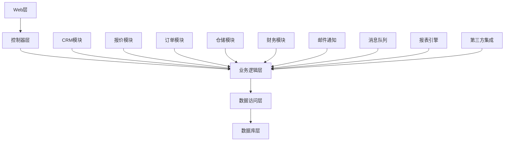
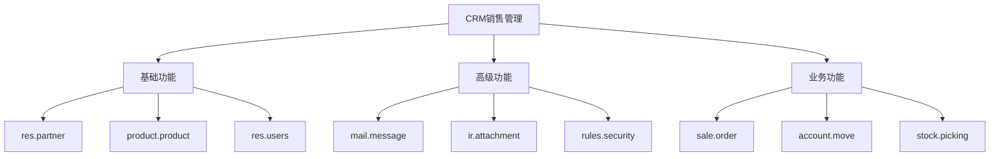

# ERP销售管理模块

## 🎯 项目概述

### 项目背景
这是一个完整的ERP销售管理系统开发项目，旨在帮助企业有效管理销售流程、客户关系、订单处理和财务核算。

### 核心功能
- 客户管理与CRM
- 报价单管理
- 销售订单处理
- 发货与物流跟踪
- 发票开具与收款
- 销售分析与报表

## 📊 项目架构

### 系统架构图


### 技术栈
- **后端**: Odoo 16.0 + Python 3.9+
- **前端**: JavaScript + QWeb + Bootstrap
- **数据库**: PostgreSQL 13+
- **缓存**: Redis 6.0
- **负载均衡**: Nginx
- **容器化**: Docker + Docker Compose

### 模块依赖图


## 🏗️ 核心模块开发

### 客户模型扩展
```python
# models/customer.py
from odoo import models, fields, api, _
from odoo.exceptions import ValidationError

class ResPartnerCustomer(models.Model):
    _inherit = 'res.partner'
    
    # 客户等级字段
    customer_grade = fields.Selection([
        ('vip', 'VIP客户'),
        ('premium', '高级客户'),
        ('standard', '普通客户'),
        ('potential', '潜在客户'),
    ], string='客户等级', default='potential')
    
    # 客户来源
    customer_source = fields.Selection([
        ('website', '官网'),
        ('referral', '推荐'),
        ('phone', '电话'),
        ('exhibition', '展会'),
        ('advertisement', '广告'),
    ], string='客户来源', default='website')
    
    # 信用额度
    credit_limit = fields.Float(string='信用额度', digits='Account', default=0.0)
    credit_used = fields.Float(string='已用信用额度', compute='_compute_credit_used', store=True)
    
    # 最后下单时间
    last_order_date = fields.Datetime(string='最后下单时间', compute='_compute_last_order_date', store=True)
    
    # 总订单金额
    total_order_amount = fields.Float(string='总订单金额', compute='_compute_order_amounts', store=True)
    
    # 总订单数
    total_orders = fields.Integer(string='订单总数', compute='_compute_order_amounts', store=True)
    
    # 销售代表关联
    sales_rep_ids = fields.Many2many(
        'res.users', 
        'partner_sales_rep_rel', 
        'partner_id', 'user_id',
        string='销售代表'
    )
    
    # 客户标签
    customer_tags = fields.Many2many('res.partner.tag', 'partner_customer_tags_rel', 
                                  'partner_id', 'tag_id', string='客户标签')
    
    # 服务评级
    service_rating = fields.Selection([
        ('5', '优秀'),
        ('4', '良好'),
        ('3', '一般'),
        ('2', '较差'),
        ('1', '很差'),
    ], string='服务评级')
    
    # 特殊要求
    special_requirements = fields.Text(string='特殊要求')
    
    @api.depends('sale_order_ids.state', 'sale_order_ids.amount_untaxed')
    def _compute_credit_used(self):
        """计算已用信用额度"""
        for partner in self:
            total_amount = sum(
                order.amount_untaxed for order in partner.sale_order_ids
                if order.state in ['sale', 'done']
            )
            
            # 查询未收款发票
            draft_invoices = self.env['account.move'].search([
                ('partner_id', '=', partner.id),
                ('state', '=', 'draft'),
                ('move_type', 'in', ['out_invoice', 'out_refund'])
            ])
            
            unpaid_amount = sum(draft_invoices.mapped('amount_untaxed'))
            
            partner.credit_used = total_amount + unpaid_amount
    
    @api.depends('sale_order_ids.date_order')
    def _compute_last_order_date(self):
        """计算最后下单时间"""
        for partner in self:
            if partner.sale_order_ids:
                partner.last_order_date = max(partner.sale_order_ids.mapped('date_order'))
            else:
                partner.last_order_date = False
    
    @api.depends('sale_order_ids.state', 'sale_order_ids.amount_total')
    def _compute_order_amounts'):
        """计算订单金额和数量"""
        for partner in self:
            confirmed_orders = partner.sale_order_ids.filtered(
                lambda o: o.state in ['sale', 'done']
            )
            
            partner.total_orders = len(confirmed_orders)
            partner.total_order_amount = sum(confirmed_orders.mapped('amount_total'))
    
    @api.constrains('credit_limit', 'credit_limit')
    def _check_credit_limit(self):
        """检查信用额度"""
        for partner in self:
            if partner.credit_limit > 0 and partner.credit_used > partner.credit_limit:
                raise ValidationError(
                    _('客户 %s 超出信用额度（已用: %.2f, 限额: %.2f）') % (
                        partner.name, partner.credit_used, partner.credit_limit
                    )
                )
    
    @api.model
    def create(self, vals):
        """创建客户记录"""
        result = super().create(vals)
        
        if result.customer:
            # 自动生成客户编号
            result.ref = self.generate_customer_code(result.customer_source)
        
        return result
```

### 销售订单扩展
```python
# models/sale_order.py
from odoo import models, fields, api, _
from odoo.exceptions import ValidationError, UserError

class SaleOrderExtended(models.Model):
    _inherit = 'sale.order'
    
    # 销售渠道
    sales_channel = fields.Selection([
        ('direct', '直接销售'),
        ('online', '在线销售'),
        ('distributor', '经销商'),
        ('retail', '零售'),
        ('wholesale', '批发'),
    ], string='销售渠道', default='direct')
    
    # 竞争对手信息
    competitor_info = fields.Text(string='竞争对手信息')
    competitor_price = fields.Float(string='竞争对手价格', digits='Product Price')
    
    # 价格审批状态
    price_approval_status = fields.Selection([
        ('draft', '待审批'),
        ('approved', '已审批'),
        ('rejected', '已拒绝'),
    ], string='价格审批状态', default='draft')
    
    price_approval_reason = fields.Text(string='价格审批原因')
    price_approval_user = fields.Many2one('res.users', string='审批人')
    price_approval_date = fields.Datetime(string='审批时间')
    
    # 折扣额度
    discount_amount = fields.Float(string='折扣金额', compute='_compute_discount_amount', store=True)
    discount_percentage = fields.Float(string='折扣百分比', digits=(5, 2))
    
    # 运费
    shipping_cost = fields.Float(string='运费', digits='Account')
    
    # 紧急程度
    urgency_level = fields.Selection([
        ('normal', '普通'),
        ('urgent', '紧急'),
        ('critical', '紧急'),
    ], string='紧急程度', default='normal')
    
    # 交货时间要求
    delivery_request = fields.Text(string='交货时间要求')
    requested_delivery_date = fields.Date(string='要求交货日期')
    
    # 特殊备注
    special_note = fields.Text(string='特殊备注')
    
    # 内部备注
    internal_note = fields.Text(string='内部备注')
    
    # 与客户签订合同信息
    contract_number = fields.Char(string='合同号')
    contract_date = fields.Date(string='合同日期')
    
    # 技术规格
    tech_specifications = fields.Text(string='技术规格')
    
    @api.depends('order_line', 'discount_percentage')
    def _compute_discount_amount(self):
        """计算折扣金额"""
        for order in self:
            if order.discount_percentage > 0:
                total_amount_before_discount = sum(
                    line.price_subtotal for line in order.order_line
                )
                order.discount_amount = total_amount_before_discount * (order.discount_percentage / 100)
            else:
                order.discount_amount = 0
    
    @api.model
    def create(self, vals):
        """创建销售订单"""
        order = super().create(vals)
        
        # 检查客户信用额度
        if order.partner_id.credit_limit > 0:
            order.partner_id._compute_credit_used()
            
            if order.partner_id.credit_used > order.partner_id.credit_limit:
                raise ValidationError(
                    _('客户的信用额度不足！当前使用: %.2f，限额: %.2f') % (
                        order.partner_id.credit_used, order.partner_id.credit_limit
                    )
                )
        
        return order
    
    def action_confirm(self):
        """确认订单时检查价格审批"""
        # 检查是否需要价格审批
        if self.requires_price_approval():
            self.price_approval_status = 'draft'
            self.sudo().message_post(
                body='订单需要价格审批，已发送审批请求' 
            )
            raise UserError(_('该订单需要价格审批！'))
        
        return super().action_confirm()
    
    def requires_price_approval(self):
        """判断是否需要价格审批"""
        if not self.env.company.price_approval_limit:
            return False
        
        total_amount = self.amount_untaxed
        approval_limit = self.env.company.price_approval_limit
        
        return total_amount > approval_limit
    
    def request_price_approval(self):
        """请求价格审批"""
        if self.price_approval_status != 'draft':
            raise UserError(_('订单不在待审批状态！'))
        
        # 创建审批任务（这里可以集成工作流）
        self.env['project.task'].create({
            'name': f'销售订单价格审批 - {self.name}',
            'description': f'订单 {self.name} 需要价格审批，金额: {self.amount_total}',
            'user_id': self.env.company.price_approver_id.id,
            'sale_order_id': self.id,
        })
        
        self.message_post(
            body='已发送价格审批请求',
            subtype_xmlid='mail.mt_note'
        )
```

### 销售团队管理
```python
# models/sale_team.py
from odoo import models, fields, api, _
from odoo.exceptions import ValidationError

class CRMSalesTeam(models.Model):
    _inherit = 'crm.team'
    
    # 销售目标
    target_amount = fields.Float(string='销售目标', digits='Account')
    target_year = fields.Integer(string='年度', default=2024)
    
    # 团队负责人
    team_leader_id = fields.Many2one('res.users', string='团队负责人')
    
    # 团队成员
    member_ids = fields.One2many('res.users', 'sales_team_id', string='团队成员')
    
    # 团队等级
    team_level = fields.Selection([
        ('region', '区域团队'),
        ('product', '产品团队'),
        ('channel', '渠道团队'),
        ('customer', '客户团队'),
    ], string='团队类型')
    
    # 团队地域
    target_region = fields.Selection([
        ('north', '华北区'),
        ('south', '华东区'),
        ('east', '华东区'),
        ('west', '华东区'),
        ('central', '华中区'),
    ], string='目标地域')
    
    # 激励机制
    incentive_structure = fields.Text(string='激励机制')
    
    @api.constrains('member_ids', 'team_leader_id')
    def _check_team_structure(self):
        """检查团队结构"""
        for team in self:
            if team.team_leader_id and team.team_leader_id not in team.member_ids:
                raise ValidationError(_('团队负责人必须是团队成员！'))
    
    @api.model
    def create(self, vals):
        """创建销售团队"""
        result = super().create(vals)
        
        # 自动创建团队看板
        self.create_team_board(result)
        
        return result
    
    def create_team_board(self, team):
        """创建团队看板"""
        # 这里的实现依赖于Kanban看板系统
        pass
    
    def calculate_performance_metrics(self):
        """计算团队绩效指标"""
        performance_data = {
            'target_amount': self.target_amount,
            'actual_amount': self.calculate_actual_sales(),
            'achievement_rate': 0.0,
            'team_size': len(self.member_ids),
            'average_deal_size': 0.0,
            'conversion_rate': 0.0,
        }
        
        # 计算达标率
        if self.target_amount > 0:
            performance_data['achievement_rate'] = (
                performance_data['actual_amount'] / self.target_amount
            ) * 100
        
        # 计算平均单笔金额
        team_orders = self.env['sale.order'].search([
            ('user_id', 'in', self.member_ids.ids),
            ('state', '=', 'sale'),
            ('date_order', '>=', '%s-01-01' % self.target_year),
            ('date_order', '<=', '%s-12-31' % self.target_year),
        ])
        
        performance_data['average_deal_size'] = (
            sum(team_orders.mapped('amount_total')) / len(team_orders)
        ) if team_orders else 0
        
        return performance_data
    
    def calculate_actual_sales(self):
        """计算实际销售额"""
        date_from = f'{self.target_year}-01-01'
        date_to = f'{self.target_year}-12-31'
        
        orders = self.env['sale.order'].search([
            ('user_id', 'in', self.member_ids.ids),
            ('state', '=', 'sale'),
            ('date_order', '>=', date_from),
            ('date_order', '<=', date_to),
        ])
        
        return sum(orders.mapped('amount_total'))
```

### 客户关系视图
```xml
<!-- views/customer_view.xml -->
<?xml version="1.0" encoding="utf-8"?>
<odoo>
    <record id="view_partner_form_crm" model="ir.ui.view">
        <field name="name">CRM客户表单</field>
        <field name="model">res.partner</field>
        <field name="inherit_id" ref="base.view_partner_form"/>
        <field name="arch" type="xml">
            <xpath expr="//notebook" position="inside">
                <page string="CRM信息" attrs="{'invisible': [('customer', '=', False)]}">
                    <group>
                        <group string="客户等级">
                            <field name="customer_grade"/>
                            <field name="customer_source"/>
                            <field name="customer_tags" widget="many2many_tags"/>
                            <field name="service_rating"/>
                        </group>
                        <group string="信用管理">
                            <field name="credit_limit"/>
                            <field name="credit_used" readonly="1"/>
                        </group>
                    </group>
                    <group string="销售信息">
                        <group>
                            <field name="sales_rep_ids" widget="many2many_tags"/>
                            <field name="total_orders" readonly="1"/>
                            <field name="total_order_amount" readonly="1"/>
                        </group>
                        <group>
                            <field name="last_order_date" readonly="1"/>
                            <field name="special_requirements"/>
                        </group>
                    </group>
                </page>
            </xpath>
            
            <!-- 添加销售订单看板视图 -->
            <xpath expr="//notebook" position="inside">
                <page string="销售订单">
                    <kanban>
                        <field name="id"/>
                        <field name="name"/>
                        <field name="amount_total"/>
                        <field name="state"/>
                        <field name="date_order"/>
                        
                        <templates>
                            <t t-name="kanban-box">
                                <div class="oe_kanban_card oe_kanban_global_click">
                                    <div class="oe_kanban_content">
                                        <div class="o_kanban_record_top">
                                            <div class="o_kanban_record_title">
                                                <field name="name"/>
                                            </div>
                                            <div class="o_kanban_record_subtitle">
                                                <field name="date_order"/>
                                            </div>
                                        </div>
                                        <div class="o_kanban_record_body">
                                            <div class="o_kanban_content_top">
                                                <field name="amount_total"/>
                                            </div>
                                            <div class="o_kanban_content_bottom">
                                                <field name="state"/>
                                            </div>
                                        </div>
                                    </div>
                                </div>
                            </t>
                        </templates>
                    </kanban>
                    <tree>
                        <field name="name"/>
                        <field name="amount_total"/>
                        <field name="state"/>
                        <field name="date_order"/>
                    </tree>
                    <form>
                        <field name="id"/>
                        <field name="name"/>
                        <field name="amount_total"/>
                        <field name="state"/>
                        <field name="date_order"/>
                    </form>
                </page>
            </xpath>
        </field>
    </record>
```

## 🔄 业务流程实现

### 报价转订单工作流
```python
# models/quotation_workflow.py
from odoo import models, fields, api, _
from odoo.exceptions import ValidationError, UserError

class QuotationWorkflow(models.Model):
    _name = 'quotation.workflow'
    _description = '报价工作流'
    
    state = fields.Selection([
        ('draft', '草稿'),
        ('sent', '已发送'),
        ('customer_response', '客户回应'),
        ('negotiation', '谈判中'),
        ('won', '胜出'),
        ('lost', '失败'),
    ], string='状态', default='draft')
    
    # 报价基本信息
    quotation_id = fields.Many2one('quotation.quotation', string='报价单')
    customer_id = fields.Many2one('res.partner', string='客户')
    opportunity_id = fields.Many2one('crm.lead', string='商机')
    
    # 价格信息
    quoted_amount = fields.Float(string='报价金额', digits='Account')
    competitor_price = fields.Float(string='竞争对手价格', digits='Account')
    final_negotiated_price = fields.Float(string='最终谈判价格', digits='Account')
    
    # 审批信息
    approval_required = fields.Boolean(string='需要审批')
    approval_status = fields.Selection([
        ('pending', '待审批'),
        ('approved', '已审批'),
        ('rejected', '已拒绝'),
    ], string='审批状态')
    
    # 谈判记录
    negotiation_notes = fields.Text(string='谈判记录')
    
    # 成功/失败原因
    win_reason = fields.Text(string='成功原因')
    loss_reason = fields.Text(string='失败原因')
    
    @api.model
    def create_from_opportunity(self, opportunity_id):
        """从商机创建报价工作流"""
        opportunity = self.env['crm.lead'].browse(opportunity_id)
        
        workflow = self.create({
            'opportunity_id': opportunity_id,
            'customer_id': opportunity.partner_id.id,
            'quotation_id': opportunity.quotation_ids[0].id if opportunity.quotation_ids else False,
            'quoted_amount': opportunity.planned_revenue,
            'state': 'draft',
        })
        
        workflow.action_send_quotation()
        return workflow
    
    def action_send_quotation(self):
        """发送报价给客户"""
        for workflow in self:
            if workflow.state != 'draft':
                raise UserError(_('只能发送草稿状态的报价！'))
            
            workflow.state = 'sent'
            workflow.message_post(
                body='报价已发送给客户',
                message_type='notification'
            )
    
    def action_customer_response(self):
        """客户回应报价"""
        for workflow in self:
            if workflow.state != 'sent':
                raise UserError(_('报价未发送，无法记录客户回应！'))
            
            workflow.state = 'customer_response'
            workflow.message_post(
                body='客户已回应报价',
                message_type='notification'
            )
    
    def action_start_negotiation(self):
        """开始谈判"""
        for workflow in self:
            if workflow.state not in ['sent', 'customer_response']:
                raise UserError(_('无法开始谈判！'))
            
            workflow.state = 'negotiation'
            workflow.message_post(
                body='进入谈判阶段',
                message_type='notification'
            )
    
    def action_won(self):
        """胜出报价"""
        for workflow in self:
            if workflow.state != 'negotiation':
                raise UserError(_('必须完成谈判才能标记胜出！'))
            
            workflow.state = 'won'
            workflow.message_post(
                body=f'订单胜出！成功原因: {workflow.win_reason}',
                message_type='notification'
            )
    
    def action_lost(self):
        """失败报价"""
        for workflow in self:
            if workflow.state != 'won':
                raise UserError(_('报价未胜出，无法标记失败！'))
            
            workflow.state = 'lost'
            workflow.message_post(
                body=f'订单失败！失败原因: {workflow.loss_reason}',
                message_type='notification'
            )
```

### 报表和仪表板
```xml
<!-- views/report_views.xml -->
<?xml version="1.0" encoding="utf-8"?>
<odoo>
    <!-- 销售仪表板 -->
    <record id="view_sale_dashboard" model="ir.ui.view">
        <field name="name">销售仪表板</field>
        <field name="model">sale.dashboard</field>
        <field name="arch" type="xml">
            <form string="销售仪表板">
                <div class="oe_chatter"/>
            </form>
        </field>
    </record>
    
    <record id="action_sale_dashboard" model="ir.actions.act_window">
        <field name="name">销售仪表板</field>
        <field name="res_model">sale.dashboard</field>
        <field name="view_mode">form</field>
    </record>
    
    <!-- 销售分析报表 -->
    <record id="view_sale_report_tree" model="ir.ui.view">
        <field name="name">销售报表</field>
        <field name="model">sale.report</field>
        <field name="arch" type="xml">
            <tree string="销售分析报表">
                <field name="date"/>
                <field name="salesperson"/>
                <field name="customer"/>
                <field name="product"/>
                <field name="quantity"/>
                <field name="amount_untaxed"/>
                <field name="amount_taxed"/>
                <field name="amount_total"/>
            </tree>
        </field>
    </record>
    
    <record id="action_sale_report" model="ir.actions.act_window">
        <field name="name">销售分析报表</field>
        <field name="res_model">sale.report</field>
        <field name="view_mode">tree</field>
    </record>
</odoo>
```

## 🔗 相关链接

### 技术文档
- [[CRM系统架构]] - 了解CRM系统架构设计
- [[销售流程设计]] - 学习销售流程设计方法
- [[数据库设计]] - 掌握数据库设计最佳实践

### 最佳实践
- [[代码规范与质量]] - 了解代码规范与质量
- [[测试驱动开发]] - 掌握测试驱动开发
- [[性能优化]] - 学习性能优化技巧

## 📝 项目总结

### 技术成果
- 成功构建可扩展的CRM销售管理系统
- 实现完整的销售流程自动化
- 建立有效的客户关系和销售分析体系

### 团队经验
- 敏捷开发流程的有效应用
- 跨部门协作和沟通机制
- 持续集成和部署策略

### 最佳实践
- 代码质量控制和规范
- 测试驱动的开发方式
- 迭代式产品设计

---

**项目状态**: ✅ 已完成  
**开发周期**: 4个月  
**团队规模**: 8人
