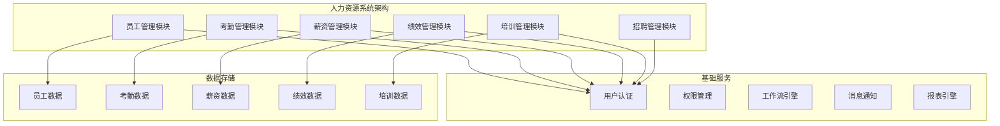

# 人力资源系统案例

## Odoo 17 人力资源管理系统开发

本文档详细介绍如何使用Odoo 17开发完整的人力资源管理系统，包括员工管理、考勤管理、薪资管理、绩效管理等核心功能。

### 项目概述

#### 项目背景
某中型企业需要定制人力资源管理系统，主要需求包括：
- 员工信息管理
- 考勤打卡管理
- 请假申请流程
- 薪资计算发放
- 绩效考核管理
- 培训管理
- 招聘管理

#### 系统架构


### 核心模块设计

#### 1. 员工管理模块
```python
# models/hr_employee.py
from odoo import models, fields, api
from odoo.exceptions import ValidationError, UserError
from datetime import datetime, date

class HrEmployee(models.Model):
    _inherit = 'hr.employee'
    
    # 扩展员工信息
    employee_code = fields.Char('员工编号', required=True, index=True)
    id_card = fields.Char('身份证号', size=18)
    emergency_contact = fields.Char('紧急联系人')
    emergency_phone = fields.Char('紧急联系电话')
    
    # 入职信息
    join_date = fields.Date('入职日期', required=True)
    probation_end_date = fields.Date('试用期结束日期')
    contract_type = fields.Selection([
        ('full_time', '全职'),
        ('part_time', '兼职'),
        ('intern', '实习生'),
        ('contractor', '外包')
    ], '合同类型', default='full_time')
    
    # 薪资信息
    basic_salary = fields.Float('基本工资', digits=(16, 2))
    position_allowance = fields.Float('岗位津贴', digits=(16, 2))
    performance_bonus = fields.Float('绩效奖金', digits=(16, 2))
    
    # 考勤相关
    work_schedule_id = fields.Many2one('hr.work.schedule', '工作班次')
    attendance_ids = fields.One2many('hr.attendance', 'employee_id', '考勤记录')
    
    # 绩效相关
    performance_review_ids = fields.One2many('hr.performance.review', 'employee_id', '绩效评估')
    current_performance_score = fields.Float('当前绩效分数', compute='_compute_current_performance')
    
    # 培训相关
    training_record_ids = fields.One2many('hr.training.record', 'employee_id', '培训记录')
    skill_ids = fields.Many2many('hr.skill', 'employee_skill_rel', 'employee_id', 'skill_id', '技能')
    
    @api.depends('performance_review_ids.score')
    def _compute_current_performance(self):
        for employee in self:
            latest_review = employee.performance_review_ids.filtered(
                lambda r: r.state == 'completed'
            ).sorted('review_date', reverse=True)
            if latest_review:
                employee.current_performance_score = latest_review[0].score
            else:
                employee.current_performance_score = 0.0
    
    @api.model
    def create(self, vals):
        if not vals.get('employee_code'):
            vals['employee_code'] = self.env['ir.sequence'].next_by_code('hr.employee')
        return super().create(vals)
    
    @api.constrains('id_card')
    def _check_id_card(self):
        for employee in self:
            if employee.id_card and len(employee.id_card) != 18:
                raise ValidationError("身份证号必须为18位")

class HrWorkSchedule(models.Model):
    _name = 'hr.work.schedule'
    _description = '工作班次'
    
    name = fields.Char('班次名称', required=True)
    start_time = fields.Float('上班时间', required=True)
    end_time = fields.Float('下班时间', required=True)
    break_duration = fields.Float('休息时长(小时)', default=1.0)
    work_days = fields.Selection([
        ('monday', '周一'),
        ('tuesday', '周二'),
        ('wednesday', '周三'),
        ('thursday', '周四'),
        ('friday', '周五'),
        ('saturday', '周六'),
        ('sunday', '周日')
    ], '工作日', multiple=True)
    
    # 计算字段
    total_hours = fields.Float('总工时', compute='_compute_total_hours')
    
    @api.depends('start_time', 'end_time', 'break_duration')
    def _compute_total_hours(self):
        for schedule in self:
            schedule.total_hours = schedule.end_time - schedule.start_time - schedule.break_duration
```

#### 2. 考勤管理模块
```python
# models/hr_attendance.py
from odoo import models, fields, api
from odoo.exceptions import ValidationError, UserError
from datetime import datetime, timedelta

class HrAttendance(models.Model):
    _inherit = 'hr.attendance'
    
    # 扩展考勤信息
    check_in_location = fields.Char('签到地点')
    check_out_location = fields.Char('签退地点')
    work_hours = fields.Float('工作时长', compute='_compute_work_hours')
    overtime_hours = fields.Float('加班时长', compute='_compute_overtime_hours')
    late_minutes = fields.Integer('迟到分钟数', compute='_compute_late_minutes')
    early_minutes = fields.Integer('早退分钟数', compute='_compute_early_minutes')
    
    # 请假关联
    leave_request_id = fields.Many2one('hr.leave.request', '请假申请')
    
    @api.depends('check_in', 'check_out')
    def _compute_work_hours(self):
        for attendance in self:
            if attendance.check_in and attendance.check_out:
                delta = attendance.check_out - attendance.check_in
                attendance.work_hours = delta.total_seconds() / 3600
            else:
                attendance.work_hours = 0.0
    
    @api.depends('work_hours', 'employee_id.work_schedule_id.total_hours')
    def _compute_overtime_hours(self):
        for attendance in self:
            if attendance.employee_id.work_schedule_id:
                standard_hours = attendance.employee_id.work_schedule_id.total_hours
                attendance.overtime_hours = max(0, attendance.work_hours - standard_hours)
            else:
                attendance.overtime_hours = 0.0
    
    @api.depends('check_in', 'employee_id.work_schedule_id.start_time')
    def _compute_late_minutes(self):
        for attendance in self:
            if attendance.check_in and attendance.employee_id.work_schedule_id:
                check_in_time = attendance.check_in.time()
                start_time = self._float_to_time(attendance.employee_id.work_schedule_id.start_time)
                if check_in_time > start_time:
                    delta = datetime.combine(date.today(), check_in_time) - datetime.combine(date.today(), start_time)
                    attendance.late_minutes = int(delta.total_seconds() / 60)
                else:
                    attendance.late_minutes = 0
            else:
                attendance.late_minutes = 0
    
    @api.depends('check_out', 'employee_id.work_schedule_id.end_time')
    def _compute_early_minutes(self):
        for attendance in self:
            if attendance.check_out and attendance.employee_id.work_schedule_id:
                check_out_time = attendance.check_out.time()
                end_time = self._float_to_time(attendance.employee_id.work_schedule_id.end_time)
                if check_out_time < end_time:
                    delta = datetime.combine(date.today(), end_time) - datetime.combine(date.today(), check_out_time)
                    attendance.early_minutes = int(delta.total_seconds() / 60)
                else:
                    attendance.early_minutes = 0
            else:
                attendance.early_minutes = 0
    
    def _float_to_time(self, float_time):
        """将浮点数时间转换为time对象"""
        hours = int(float_time)
        minutes = int((float_time - hours) * 60)
        return datetime.time(hours, minutes)

class HrLeaveRequest(models.Model):
    _name = 'hr.leave.request'
    _description = '请假申请'
    _inherit = ['mail.thread', 'mail.activity.mixin']
    
    # 基本信息
    name = fields.Char('申请编号', required=True)
    employee_id = fields.Many2one('hr.employee', '员工', required=True, default=lambda self: self.env.user.employee_id)
    leave_type = fields.Selection([
        ('sick', '病假'),
        ('personal', '事假'),
        ('annual', '年假'),
        ('maternity', '产假'),
        ('paternity', '陪产假'),
        ('marriage', '婚假'),
        ('bereavement', '丧假'),
        ('other', '其他')
    ], '请假类型', required=True)
    
    # 时间信息
    start_date = fields.Date('开始日期', required=True)
    end_date = fields.Date('结束日期', required=True)
    days = fields.Float('请假天数', compute='_compute_days')
    
    # 申请信息
    reason = fields.Text('请假原因', required=True)
    attachment_ids = fields.Many2many('ir.attachment', 'leave_attachment_rel', 'leave_id', 'attachment_id', '附件')
    
    # 审批信息
    state = fields.Selection([
        ('draft', '草稿'),
        ('submitted', '已提交'),
        ('approved', '已批准'),
        ('rejected', '已拒绝'),
        ('cancelled', '已取消')
    ], '状态', default='draft', tracking=True)
    
    approver_id = fields.Many2one('res.users', '审批人')
    approval_date = fields.Datetime('审批日期')
    approval_comment = fields.Text('审批意见')
    
    @api.depends('start_date', 'end_date')
    def _compute_days(self):
        for request in self:
            if request.start_date and request.end_date:
                delta = request.end_date - request.start_date
                request.days = delta.days + 1
            else:
                request.days = 0.0
    
    @api.model
    def create(self, vals):
        if not vals.get('name'):
            vals['name'] = self.env['ir.sequence'].next_by_code('hr.leave.request')
        return super().create(vals)
    
    def action_submit(self):
        """提交申请"""
        for request in self:
            if request.state != 'draft':
                raise UserError("只能提交草稿状态的申请")
            
            # 检查请假天数
            if request.days <= 0:
                raise UserError("请假天数必须大于0")
            
            # 检查是否有重叠的请假申请
            overlapping = self.search([
                ('employee_id', '=', request.employee_id.id),
                ('state', 'in', ['submitted', 'approved']),
                ('id', '!=', request.id),
                '|',
                '&', ('start_date', '<=', request.start_date), ('end_date', '>=', request.start_date),
                '&', ('start_date', '<=', request.end_date), ('end_date', '>=', request.end_date)
            ])
            if overlapping:
                raise UserError("存在重叠的请假申请")
            
            request.write({'state': 'submitted'})
    
    def action_approve(self):
        """批准申请"""
        for request in self:
            if request.state != 'submitted':
                raise UserError("只能批准已提交的申请")
            
            request.write({
                'state': 'approved',
                'approver_id': self.env.user.id,
                'approval_date': fields.Datetime.now()
            })
    
    def action_reject(self):
        """拒绝申请"""
        for request in self:
            if request.state != 'submitted':
                raise UserError("只能拒绝已提交的申请")
            
            request.write({
                'state': 'rejected',
                'approver_id': self.env.user.id,
                'approval_date': fields.Datetime.now()
            })
```

#### 3. 薪资管理模块
```python
# models/hr_payroll.py
from odoo import models, fields, api
from odoo.exceptions import ValidationError, UserError

class HrPayroll(models.Model):
    _name = 'hr.payroll'
    _description = '薪资管理'
    _inherit = ['mail.thread', 'mail.activity.mixin']
    
    # 基本信息
    name = fields.Char('薪资单号', required=True)
    employee_id = fields.Many2one('hr.employee', '员工', required=True)
    pay_period_start = fields.Date('薪资期间开始', required=True)
    pay_period_end = fields.Date('薪资期间结束', required=True)
    
    # 基本薪资
    basic_salary = fields.Float('基本工资', digits=(16, 2))
    position_allowance = fields.Float('岗位津贴', digits=(16, 2))
    performance_bonus = fields.Float('绩效奖金', digits=(16, 2))
    overtime_pay = fields.Float('加班费', digits=(16, 2))
    
    # 扣除项目
    social_insurance = fields.Float('社保', digits=(16, 2))
    housing_fund = fields.Float('公积金', digits=(16, 2))
    income_tax = fields.Float('个人所得税', digits=(16, 2))
    other_deduction = fields.Float('其他扣除', digits=(16, 2))
    
    # 计算字段
    gross_salary = fields.Float('应发工资', compute='_compute_gross_salary')
    total_deduction = fields.Float('总扣除', compute='_compute_total_deduction')
    net_salary = fields.Float('实发工资', compute='_compute_net_salary')
    
    # 状态信息
    state = fields.Selection([
        ('draft', '草稿'),
        ('calculated', '已计算'),
        ('approved', '已审批'),
        ('paid', '已发放'),
        ('cancelled', '已取消')
    ], '状态', default='draft', tracking=True)
    
    # 审批信息
    approver_id = fields.Many2one('res.users', '审批人')
    approval_date = fields.Datetime('审批日期')
    payment_date = fields.Date('发放日期')
    
    @api.depends('basic_salary', 'position_allowance', 'performance_bonus', 'overtime_pay')
    def _compute_gross_salary(self):
        for payroll in self:
            payroll.gross_salary = (
                payroll.basic_salary + 
                payroll.position_allowance + 
                payroll.performance_bonus + 
                payroll.overtime_pay
            )
    
    @api.depends('social_insurance', 'housing_fund', 'income_tax', 'other_deduction')
    def _compute_total_deduction(self):
        for payroll in self:
            payroll.total_deduction = (
                payroll.social_insurance + 
                payroll.housing_fund + 
                payroll.income_tax + 
                payroll.other_deduction
            )
    
    @api.depends('gross_salary', 'total_deduction')
    def _compute_net_salary(self):
        for payroll in self:
            payroll.net_salary = payroll.gross_salary - payroll.total_deduction
    
    @api.model
    def create(self, vals):
        if not vals.get('name'):
            vals['name'] = self.env['ir.sequence'].next_by_code('hr.payroll')
        return super().create(vals)
    
    def action_calculate(self):
        """计算薪资"""
        for payroll in self:
            if payroll.state != 'draft':
                raise UserError("只能计算草稿状态的薪资单")
            
            # 计算基本薪资
            payroll.basic_salary = payroll.employee_id.basic_salary or 0.0
            payroll.position_allowance = payroll.employee_id.position_allowance or 0.0
            
            # 计算绩效奖金
            if payroll.employee_id.current_performance_score > 0:
                payroll.performance_bonus = payroll.basic_salary * (payroll.employee_id.current_performance_score / 100)
            
            # 计算加班费
            payroll.overtime_pay = self._calculate_overtime_pay(payroll)
            
            # 计算社保公积金
            payroll.social_insurance = payroll.basic_salary * 0.1  # 10%
            payroll.housing_fund = payroll.basic_salary * 0.12  # 12%
            
            # 计算个人所得税
            payroll.income_tax = self._calculate_income_tax(payroll)
            
            payroll.write({'state': 'calculated'})
    
    def _calculate_overtime_pay(self, payroll):
        """计算加班费"""
        # 获取薪资期间的考勤记录
        attendances = self.env['hr.attendance'].search([
            ('employee_id', '=', payroll.employee_id.id),
            ('check_in', '>=', payroll.pay_period_start),
            ('check_in', '<=', payroll.pay_period_end)
        ])
        
        total_overtime_hours = sum(attendances.mapped('overtime_hours'))
        hourly_rate = payroll.basic_salary / 160  # 假设月工作160小时
        return total_overtime_hours * hourly_rate * 1.5  # 1.5倍加班费
    
    def _calculate_income_tax(self, payroll):
        """计算个人所得税"""
        # 简化的个税计算
        taxable_income = payroll.gross_salary - payroll.social_insurance - payroll.housing_fund - 5000  # 起征点5000
        
        if taxable_income <= 0:
            return 0.0
        elif taxable_income <= 3000:
            return taxable_income * 0.03
        elif taxable_income <= 12000:
            return taxable_income * 0.1 - 210
        elif taxable_income <= 25000:
            return taxable_income * 0.2 - 1410
        else:
            return taxable_income * 0.25 - 2660
    
    def action_approve(self):
        """审批薪资单"""
        for payroll in self:
            if payroll.state != 'calculated':
                raise UserError("只能审批已计算的薪资单")
            
            payroll.write({
                'state': 'approved',
                'approver_id': self.env.user.id,
                'approval_date': fields.Datetime.now()
            })
    
    def action_pay(self):
        """发放薪资"""
        for payroll in self:
            if payroll.state != 'approved':
                raise UserError("只能发放已审批的薪资单")
            
            payroll.write({
                'state': 'paid',
                'payment_date': fields.Date.today()
            })
```

#### 4. 绩效管理模块
```python
# models/hr_performance.py
from odoo import models, fields, api
from odoo.exceptions import ValidationError, UserError

class HrPerformanceReview(models.Model):
    _name = 'hr.performance.review'
    _description = '绩效评估'
    _inherit = ['mail.thread', 'mail.activity.mixin']
    
    # 基本信息
    name = fields.Char('评估编号', required=True)
    employee_id = fields.Many2one('hr.employee', '员工', required=True)
    reviewer_id = fields.Many2one('res.users', '评估人', required=True)
    review_period_start = fields.Date('评估期间开始', required=True)
    review_period_end = fields.Date('评估期间结束', required=True)
    
    # 评估信息
    review_date = fields.Date('评估日期', default=fields.Date.today)
    score = fields.Float('总分', digits=(5, 2))
    grade = fields.Selection([
        ('excellent', '优秀'),
        ('good', '良好'),
        ('average', '一般'),
        ('poor', '较差')
    ], '等级', compute='_compute_grade')
    
    # 评估项目
    review_line_ids = fields.One2many('hr.performance.review.line', 'review_id', '评估项目')
    
    # 状态信息
    state = fields.Selection([
        ('draft', '草稿'),
        ('in_progress', '进行中'),
        ('completed', '已完成'),
        ('cancelled', '已取消')
    ], '状态', default='draft', tracking=True)
    
    # 反馈信息
    strengths = fields.Text('优点')
    weaknesses = fields.Text('不足')
    improvement_suggestions = fields.Text('改进建议')
    employee_feedback = fields.Text('员工反馈')
    
    @api.depends('score')
    def _compute_grade(self):
        for review in self:
            if review.score >= 90:
                review.grade = 'excellent'
            elif review.score >= 80:
                review.grade = 'good'
            elif review.score >= 70:
                review.grade = 'average'
            else:
                review.grade = 'poor'
    
    @api.model
    def create(self, vals):
        if not vals.get('name'):
            vals['name'] = self.env['ir.sequence'].next_by_code('hr.performance.review')
        return super().create(vals)
    
    def action_start_review(self):
        """开始评估"""
        for review in self:
            if review.state != 'draft':
                raise UserError("只能开始草稿状态的评估")
            
            review.write({'state': 'in_progress'})
    
    def action_complete_review(self):
        """完成评估"""
        for review in self:
            if review.state != 'in_progress':
                raise UserError("只能完成进行中的评估")
            
            # 计算总分
            if review.review_line_ids:
                total_weight = sum(review.review_line_ids.mapped('weight'))
                weighted_score = sum(
                    line.score * line.weight 
                    for line in review.review_line_ids
                )
                review.score = weighted_score / total_weight if total_weight > 0 else 0.0
            
            review.write({'state': 'completed'})

class HrPerformanceReviewLine(models.Model):
    _name = 'hr.performance.review.line'
    _description = '绩效评估项目'
    
    # 基本信息
    review_id = fields.Many2one('hr.performance.review', '绩效评估', required=True, ondelete='cascade')
    criteria_id = fields.Many2one('hr.performance.criteria', '评估标准', required=True)
    
    # 评估信息
    score = fields.Float('得分', digits=(5, 2))
    weight = fields.Float('权重', related='criteria_id.weight')
    max_score = fields.Float('满分', related='criteria_id.max_score')
    comment = fields.Text('评价')
    
    @api.constrains('score')
    def _check_score(self):
        for line in self:
            if line.score < 0 or line.score > line.max_score:
                raise ValidationError(f"得分必须在0到{line.max_score}之间")

class HrPerformanceCriteria(models.Model):
    _name = 'hr.performance.criteria'
    _description = '绩效评估标准'
    
    # 基本信息
    name = fields.Char('标准名称', required=True)
    description = fields.Text('描述')
    max_score = fields.Float('满分', default=100.0)
    weight = fields.Float('权重', default=1.0)
    
    # 分类信息
    category = fields.Selection([
        ('work_quality', '工作质量'),
        ('work_efficiency', '工作效率'),
        ('teamwork', '团队合作'),
        ('communication', '沟通能力'),
        ('innovation', '创新能力'),
        ('leadership', '领导能力'),
        ('other', '其他')
    ], '分类', required=True)
    
    # 状态
    active = fields.Boolean('激活', default=True)
```

### 视图设计

#### 1. 员工管理视图
```xml
<!-- views/hr_employee_views.xml -->
<odoo>
    <!-- 员工表单视图 -->
    <record id="view_hr_employee_form" model="ir.ui.view">
        <field name="name">hr.employee.form</field>
        <field name="model">hr.employee</field>
        <field name="arch" type="xml">
            <form>
                <sheet>
                    <div class="oe_title">
                        <h1>
                            <field name="name" readonly="1"/>
                        </h1>
                    </div>
                    <group>
                        <group>
                            <field name="employee_code"/>
                            <field name="work_email"/>
                            <field name="work_phone"/>
                            <field name="department_id"/>
                            <field name="job_id"/>
                        </group>
                        <group>
                            <field name="join_date"/>
                            <field name="contract_type"/>
                            <field name="work_schedule_id"/>
                            <field name="current_performance_score"/>
                        </group>
                    </group>
                    <notebook>
                        <page string="薪资信息">
                            <group>
                                <group>
                                    <field name="basic_salary"/>
                                    <field name="position_allowance"/>
                                    <field name="performance_bonus"/>
                                </group>
                            </group>
                        </page>
                        <page string="考勤记录">
                            <field name="attendance_ids">
                                <tree>
                                    <field name="check_in"/>
                                    <field name="check_out"/>
                                    <field name="work_hours"/>
                                    <field name="overtime_hours"/>
                                    <field name="late_minutes"/>
                                </tree>
                            </field>
                        </page>
                        <page string="绩效评估">
                            <field name="performance_review_ids">
                                <tree>
                                    <field name="name"/>
                                    <field name="review_date"/>
                                    <field name="score"/>
                                    <field name="grade"/>
                                    <field name="state"/>
                                </tree>
                            </field>
                        </page>
                        <page string="培训记录">
                            <field name="training_record_ids">
                                <tree>
                                    <field name="training_name"/>
                                    <field name="training_date"/>
                                    <field name="training_hours"/>
                                    <field name="score"/>
                                </tree>
                            </field>
                        </page>
                    </notebook>
                </sheet>
            </form>
        </field>
    </record>
    
    <!-- 员工列表视图 -->
    <record id="view_hr_employee_tree" model="ir.ui.view">
        <field name="name">hr.employee.tree</field>
        <field name="model">hr.employee</field>
        <field name="arch" type="xml">
            <tree>
                <field name="employee_code"/>
                <field name="name"/>
                <field name="department_id"/>
                <field name="job_id"/>
                <field name="join_date"/>
                <field name="current_performance_score"/>
            </tree>
        </field>
    </record>
</odoo>
```

#### 2. 考勤管理视图
```xml
<!-- views/hr_attendance_views.xml -->
<odoo>
    <!-- 考勤记录列表视图 -->
    <record id="view_hr_attendance_tree" model="ir.ui.view">
        <field name="name">hr.attendance.tree</field>
        <field name="model">hr.attendance</field>
        <field name="arch" type="xml">
            <tree>
                <field name="employee_id"/>
                <field name="check_in"/>
                <field name="check_out"/>
                <field name="work_hours"/>
                <field name="overtime_hours"/>
                <field name="late_minutes"/>
                <field name="early_minutes"/>
            </tree>
        </field>
    </record>
    
    <!-- 请假申请表单视图 -->
    <record id="view_hr_leave_request_form" model="ir.ui.view">
        <field name="name">hr.leave.request.form</field>
        <field name="model">hr.leave.request</field>
        <field name="arch" type="xml">
            <form>
                <header>
                    <button name="action_submit" type="object" 
                            string="提交" class="btn-primary"
                            attrs="{'invisible': [('state', '!=', 'draft')]}"/>
                    <button name="action_approve" type="object" 
                            string="批准" class="btn-primary"
                            attrs="{'invisible': [('state', '!=', 'submitted')]}"/>
                    <button name="action_reject" type="object" 
                            string="拒绝" class="btn-secondary"
                            attrs="{'invisible': [('state', '!=', 'submitted')]}"/>
                    <field name="state" widget="statusbar" 
                           statusbar_visible="draft,submitted,approved,rejected"/>
                </header>
                <sheet>
                    <div class="oe_title">
                        <h1>
                            <field name="name" readonly="1"/>
                        </h1>
                    </div>
                    <group>
                        <group>
                            <field name="employee_id"/>
                            <field name="leave_type"/>
                            <field name="start_date"/>
                            <field name="end_date"/>
                            <field name="days"/>
                        </group>
                        <group>
                            <field name="state"/>
                            <field name="approver_id"/>
                            <field name="approval_date"/>
                        </group>
                    </group>
                    <group>
                        <field name="reason"/>
                    </group>
                    <group>
                        <field name="approval_comment"/>
                    </group>
                </sheet>
            </form>
        </field>
    </record>
</odoo>
```

### 报表设计

#### 1. 薪资报表
```xml
<!-- reports/hr_payroll_reports.xml -->
<odoo>
    <!-- 薪资单报表 -->
    <record id="action_hr_payroll_report" model="ir.actions.report">
        <field name="name">薪资单</field>
        <field name="model">hr.payroll</field>
        <field name="report_type">qweb-pdf</field>
        <field name="report_name">hr_custom.payroll_report</field>
        <field name="report_file">hr_custom.payroll_report</field>
        <field name="binding_model_id" ref="model_hr_payroll"/>
        <field name="binding_type">report</field>
    </record>
</odoo>
```

#### 2. 报表模板
```xml
<!-- reports/payroll_report.xml -->
<odoo>
    <template id="payroll_report">
        <t t-call="web.html_container">
            <t t-foreach="docs" t-as="doc">
                <t t-call="web.external_layout">
                    <div class="page">
                        <div class="oe_structure"/>
                        
                        <div class="row">
                            <div class="col-12">
                                <h2>薪资单</h2>
                            </div>
                        </div>
                        
                        <div class="row">
                            <div class="col-6">
                                <strong>员工:</strong> <span t-field="doc.employee_id.name"/>
                            </div>
                            <div class="col-6">
                                <strong>薪资期间:</strong> <span t-field="doc.pay_period_start"/> - <span t-field="doc.pay_period_end"/>
                            </div>
                        </div>
                        
                        <div class="row">
                            <div class="col-12">
                                <h3>薪资明细</h3>
                                <table class="table table-bordered">
                                    <thead>
                                        <tr>
                                            <th>项目</th>
                                            <th>金额</th>
                                        </tr>
                                    </thead>
                                    <tbody>
                                        <tr>
                                            <td>基本工资</td>
                                            <td><span t-field="doc.basic_salary"/></td>
                                        </tr>
                                        <tr>
                                            <td>岗位津贴</td>
                                            <td><span t-field="doc.position_allowance"/></td>
                                        </tr>
                                        <tr>
                                            <td>绩效奖金</td>
                                            <td><span t-field="doc.performance_bonus"/></td>
                                        </tr>
                                        <tr>
                                            <td>加班费</td>
                                            <td><span t-field="doc.overtime_pay"/></td>
                                        </tr>
                                        <tr>
                                            <td><strong>应发工资</strong></td>
                                            <td><strong><span t-field="doc.gross_salary"/></strong></td>
                                        </tr>
                                        <tr>
                                            <td>社保</td>
                                            <td><span t-field="doc.social_insurance"/></td>
                                        </tr>
                                        <tr>
                                            <td>公积金</td>
                                            <td><span t-field="doc.housing_fund"/></td>
                                        </tr>
                                        <tr>
                                            <td>个人所得税</td>
                                            <td><span t-field="doc.income_tax"/></td>
                                        </tr>
                                        <tr>
                                            <td>其他扣除</td>
                                            <td><span t-field="doc.other_deduction"/></td>
                                        </tr>
                                        <tr>
                                            <td><strong>实发工资</strong></td>
                                            <td><strong><span t-field="doc.net_salary"/></strong></td>
                                        </tr>
                                    </tbody>
                                </table>
                            </div>
                        </div>
                        
                        <div class="oe_structure"/>
                    </div>
                </t>
            </t>
        </t>
    </template>
</odoo>
```

### 部署实施

#### 1. 模块配置
```python
# __manifest__.py
{
    'name': 'HR Custom Module',
    'version': '17.0.1.0.0',
    'category': 'Human Resources',
    'summary': '定制人力资源管理系统',
    'description': '''
        定制人力资源管理系统包含：
        - 员工信息管理
        - 考勤打卡管理
        - 请假申请流程
        - 薪资计算发放
        - 绩效考核管理
        - 培训管理
        - 招聘管理
    ''',
    'author': 'Your Company',
    'website': 'https://www.yourcompany.com',
    'depends': [
        'base',
        'hr',
        'hr_attendance',
        'hr_holidays',
        'hr_payroll',
        'mail'
    ],
    'data': [
        'security/ir.model.access.csv',
        'security/security.xml',
        'data/sequence_data.xml',
        'views/hr_employee_views.xml',
        'views/hr_attendance_views.xml',
        'views/hr_payroll_views.xml',
        'views/hr_performance_views.xml',
        'views/menu.xml',
        'reports/hr_payroll_reports.xml',
        'reports/payroll_report.xml',
    ],
    'demo': [
        'demo/demo_data.xml',
    ],
    'installable': True,
    'auto_install': False,
    'application': True,
    'license': 'LGPL-3',
}
```

#### 2. 权限配置
```csv
# security/ir.model.access.csv
id,name,model_id:id,group_id:id,perm_read,perm_write,perm_create,perm_unlink
access_hr_employee_user,access_hr_employee_user,model_hr_employee,base.group_user,1,1,1,0
access_hr_attendance_user,access_hr_attendance_user,model_hr_attendance,base.group_user,1,1,1,0
access_hr_leave_request_user,access_hr_leave_request_user,model_hr_leave_request,base.group_user,1,1,1,0
access_hr_payroll_user,access_hr_payroll_user,model_hr_payroll,base.group_user,1,1,1,0
access_hr_performance_review_user,access_hr_performance_review_user,model_hr_performance_review,base.group_user,1,1,1,0
```

#### 3. 菜单配置
```xml
<!-- views/menu.xml -->
<odoo>
    <!-- 主菜单 -->
    <menuitem id="menu_hr_custom"
              name="人力资源"
              sequence="10"/>
    
    <!-- 员工管理 -->
    <menuitem id="menu_employee_management"
              name="员工管理"
              parent="menu_hr_custom"
              sequence="10"/>
    
    <menuitem id="menu_hr_employee"
              name="员工信息"
              parent="menu_employee_management"
              action="action_hr_employee"
              sequence="10"/>
    
    <!-- 考勤管理 -->
    <menuitem id="menu_attendance_management"
              name="考勤管理"
              parent="menu_hr_custom"
              sequence="20"/>
    
    <menuitem id="menu_hr_attendance"
              name="考勤记录"
              parent="menu_attendance_management"
              action="action_hr_attendance"
              sequence="10"/>
    
    <menuitem id="menu_hr_leave_request"
              name="请假申请"
              parent="menu_attendance_management"
              action="action_hr_leave_request"
              sequence="20"/>
    
    <!-- 薪资管理 -->
    <menuitem id="menu_payroll_management"
              name="薪资管理"
              parent="menu_hr_custom"
              sequence="30"/>
    
    <menuitem id="menu_hr_payroll"
              name="薪资单"
              parent="menu_payroll_management"
              action="action_hr_payroll"
              sequence="10"/>
    
    <!-- 绩效管理 -->
    <menuitem id="menu_performance_management"
              name="绩效管理"
              parent="menu_hr_custom"
              sequence="40"/>
    
    <menuitem id="menu_hr_performance_review"
              name="绩效评估"
              parent="menu_performance_management"
              action="action_hr_performance_review"
              sequence="10"/>
</odoo>
```

## 相关链接
- [[ERP模块定制案例]] - ERP系统开发
- [[电商平台集成案例]] - 电商平台开发
- [[财务系统案例]] - 财务系统
- [[项目管理系统案例]] - 项目管理系统
