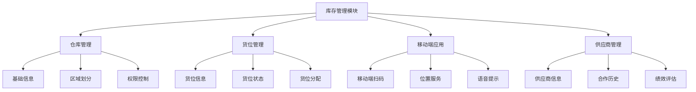
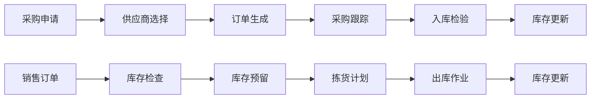

# 库存仓储管理系统

## 🎯 项目概述

### 项目背景
库存仓储管理系统是一个全面的企业资源规划(ERP)模块，专注于优化库存控制、仓储管理和供应链协调流程。

### 核心功能
- 库存监控与预警
- 仓库管理与货位控制
- 采购与入库管理
- 销售与出库管理
- 盘点与调整
- 供应商管理
- 移动端支持

## 📊 系统架构

### 整体架构图


### 数据流程图


## 🏭 仓库管理

### 仓库模型设计
```python
# models/warehouse.py
from odoo import models, fields, api, _
from odoo.exceptions import ValidationError

class CMWarehouse(models.Model):
    _name = 'custom.warehouse'
    _description = '自定义仓库模型'
    
    name = fields.Char(string='仓库名称', required=True)
    code = fields.Char(string='仓库编码', required=True)
    company_id = fields.Many2one('res.company', string='所属公司', default=lambda self: self.env.company)
    
    # 仓库类型
    warehouse_type = fields.Selection([
        ('main', '主仓库'),
        ('branch', '分仓库'),
        ('bonded', '保税区'),
        ('cold_chain', '冷链'),
        ('hazardous', '危险品'),
    ], string='仓库类型', default='main')
    
    # 仓库层级
    parent_id = fields.Many2one('custom.warehouse', string='上级仓库')
    child_ids = fields.One2many('custom.warehouse', 'parent_id', string='下级仓库')
    warehouse_level = fields.Integer(string='仓库层级', compute='_compute_level')
    
    # 地址信息
    zip = fields.Char(string='邮编')
    street = fields.Char(string='街道')
    street2 = fields.Char(string='街道2')
    city = fields.Char(string='城市')
    state_id = fields.Many2one('res.country.state', string='省份')
    country_id = fields.Many2one('res.country', string='国家')
    
    # 仓库配置
    contact_person = fields.Char(string='负责人')
    phone = fields.Char(string='电话')
    email = fields.Char(string='邮箱')
    
    # 容量信息
    storage_capacity = fields.Float(string='存储容量(立方米)')
    current_usage = fields.Float(string='当前使用率', compute='_compute_usage')
    
    # 营运时间
    operational_hours_start = fields.Float(string='营业开始时间')
    operational_hours_end = fields.Float(string='营业结束时间')
    
    # 费用设置
    storage_fee_per_month = fields.Float(string='月度存储费用(元/立方米)')
    handling_fee_per_order = fields.Float(string='每单处理费(元)')
    
    # 货架区域
    shelf_area_ids = fields.One2many('stock.location', 'custom_warehouse_id', string='货架区域')
    
    @api.depends('parent_id', 'parent_id.warehouse_level')
    def _compute_level(self):
        """计算仓库层级"""
        for warehouse in self:
            level = 0
            parent = warehouse.parent_id
            while parent:
                level += 1
                parent = parent.parent_id
            warehouse.warehouse_level = level
    
    @api.depends('storage_capacity', 'shelf_area_ids')
    def _compute_usage(self):
        """计算仓库使用率"""
        for warehouse in self:
            if warehouse.storage_capacity > 0:
                # 计算已使用的存储空间
                used_space = sum(
                    area.volume_used for area in warehouse.shelf_area_ids
                )
                warehouse.current_usage = min(100, (used_space / warehouse.storage_capacity) * 100)
            else:
                warehouse.current_usage = 0

    def compute_total_inventory_value(self):
        """计算仓库总库存价值"""
        for warehouse in self:
            total_value = 0
            locations = warehouse.shelf_area_ids
            quants = self.env['stock.quant'].search([
                ('location_id', 'in', locations.ids),
                ('quantity', '>', 0)
            ])
            
            for quant in quants:
                total_value += quant.inventory_value
            
            warehouse.total_inventory_value = total_value
    
    @api.constrains('parent_id')
    def _check_parent_warehouse(self):
        """检查父子仓库层级"""
        for warehouse in self:
            parent = warehouse.parent_id
            while parent:
                if parent == warehouse:
                    raise ValidationError(_('仓库层级设置错误，不能将自己设为上级仓库！'))
                parent = parent.parent_id

    @api.model
    def create(self, vals):
        """创建仓库时自动生成编码"""
        if not vals.get('code'):
            vals['code'] = self.env['ir.sequence'].next_by_code('custom.warehouse')
        return super().create(vals)

class StockLocationExtended(models.Model):
    _inherit = 'stock.location'
    
    # 扩展字段
    custom_warehouse_id = fields.Many2one('custom.warehouse', string='关联仓库')
    location_type = fields.Selection([
        ('shelf', '货架'),
        ('area', '区域'),
        ('zone', '区域'),
        ('bin', '储位'),
    ], string='位置类型')
    
    # 容量信息
    max_capacity = fields.Float(string='最大容量')
    current_capacity = fields.Float(string='当前容量')
    volume_used = fields.Float(string='已使用体积', compute='_compute_volume_used')
    
    # 货架信息
    shelf_number = fields.Char(string='货架号')
    shelf_level = fields.Integer(string='货架层数')
    shelf_position = fields.Integer(string='位置编号')
    
    # 温度控制
    temperature_range = fields.Char(string='温度范围')
    humidity_range = fields.Char(string='湿度范围')
    
    # 危险品标识
    is_hazardous = fields.Boolean(string='是否为危险品存储')
    hazardous_permit_no = fields.Char(string='危险品许可证号')
    
    # 拣货路径
    picking_route = fields.Char(string='拣货路径')
    picking_group = fields.Char(string='拣货组')
    
    @api.depends('stock_quant_ids.quantity', 'stock_quant_ids.product_id.volume')
    def _compute_volume_used(self):
        """计算位置使用体积"""
        for location in self:
            total_volume = 0
            quants = location.stock_quant_ids
            
            for quant in quants:
                if quant.quantity > 0:
                    total_volume += quant.product_id.volume * quant.quantity
                
            location.volume_used = total_volume
```

### 库存监控和预警
```python
# models/inventory_monitor.py
from odoo import models, fields, api, _
from odoo.exceptions import ValidationError
from datetime import datetime, timedelta

class InventoryMonitor(models.Model):
    _name = 'inventory.monitor'
    _description = '库存监控模型'
    
    product_id = fields.Many2one('product.product', string='产品')
    warehouse_id = fields.Many2one('custom.warehouse', string='仓库')
    location_id = fields.Many2one('stock.location', string='位置')
    
    # 库存阈值
    min_stock_threshold = fields.Float(string='最低库存阈值')
    max_stock_threshold = fields.Float(string='最高库存阈值')
    
    # 当前库存
    current_stock = fields.Float(string='当前库存', compute='_compute_current_stock')
    
    # 消耗速度
    daily_consumption_rate = fields.Float(string='日消耗率')
    weekly_consumption_rate = fields.Float(string='周消耗率')
    
    # 补充时间
    replenishment_time = fields.Float(string='补充时间(天)')
    safety_stock_days = fields.Integer(string='安全库存天数')
    
    # 监控状态
    status = fields.Selection([
        ('normal', '正常'),
        ('low_stock', '库存不足'),
        ('overstock', '库存过量'),
        ('no_stock', '缺货'),
        ('slow_moving', '滞销'),
    ], string='状态', compute='_compute_status')
    
    # 预警设置
    enable_email_alert = fields.Boolean(string='启用邮箱预警', default=True)
    enable_sms_alert = fields.Boolean(string='启用短信预警', default=False)
    alert_recipients = fields.Many2many('res.users', string='预警接收人')
    
    # 历史记录
    last_alert_time = fields.Datetime(string='上次预警时间')
    alert_count = fields.Integer(string='预警次数')
    
    @api.depends('product_id', 'location_id')
    def _compute_current_stock(self):
        """计算当前库存"""
        for monitor in self:
            if monitor.product_id and monitor.location_id:
                quantity = monitor.location_id._get_product_quantity(monitor.product_id)
                monitor.current_stock = quantity
            else:
                monitor.current_stock = 0
    
    @api.depends('current_stock', 'min_stock_threshold', 'max_stock_threshold')
    def _compute_status(self):
        """计算库存状态"""
        for monitor in self:
            if monitor.current_stock <= 0:
                monitor.status = 'no_stock'
            elif monitor.current_stock < monitor.min_stock_threshold:
                monitor.status = 'low_stock'
            elif monitor.current_stock > monitor.max_stock_threshold:
                monitor.status = 'overstock'
            else:
                monitor.status = 'normal'
    
    def monitor_stock_levels(self):
        """监控库存水平"""
        alerts = []
        
        monitors = self.search([
            ('status', 'in', ['low_stock', 'overstock', 'no_stock'])
        ])
        
        for monitor in monitors:
            alert_data = {
                'product_name': monitor.product_id.name,
                'warehouse_name': monitor.warehouse_id.name,
                'current_stock': monitor.current_stock,
                'status': monitor.status,
                'threshold': monitor.min_stock_threshold,
                'timestamp': datetime.now()
            }
            
            if monitor.status == 'low_stock':
                alert_data['message'] = f"产品 {monitor.product_id.name} 在仓库 {monitor.warehouse_id.name} 库存不足！"
            elif monitor.status == 'overstock':
                alert_data['message'] = f"产品 {monitor.product_id.name} 在仓库 {monitor.warehouse_id.name} 库存过量！"
            elif monitor.status == 'no_stock':
                alert_data['message'] = f"产品 {monitor.product_id.name} 在仓库 {monitor.warehouse_id.name} 已缺货！"
            
            # 发送预警
            self.send_inventory_alert(alert_data)
            
            alerts.append(alert_data)
        
        return alerts
    
    def send_inventory_alert(self, alert_data):
        """发送库存预警"""
        # 邮箱预警
        if self.enable_email_alert:
            self._send_email_alert(alert_data)
        
        # 短信预警
        if self.enable_sms_alert:
            self._send_sms_alert(alert_data)
        
        # 更新预警记录
        self.last_alert_time = datetime.now()
        self.alert_count += 1
    
    def _send_email_alert(self, alert_data):
        """发送邮箱预警"""
        template = self.env.ref('custom_inventory.email_template_stock_alert')
        
        if template and self.alert_recipients:
            for recipient in self.alert_recipients:
                template.with_context(
                    alert_data=alert_data,
                    recipient=recipient
                ).send_mail(recipient.id)
    
    def _send_sms_alert(self, alert_data):
        """发送短信预警"""
        # 短信服务集成（这里简化为日志示例）
        self.env['ir.logging'].info(
            log_level='info',
            message=f"SMS预警：{alert_data['message']}"
        )
    
    def generate_purchase_proposal(self):
        """生成采购建议"""
        proposals = []
        
        low_stock_monitors = self.search([
            ('status', '=', 'low_stock'),
            ('daily_consumption_rate', '>', 0)
        ])
        
        for monitor in low_stock_monitors:
            # 计算建议采购量
            safety_stock = monitor.daily_consumption_rate * monitor.safety_stock_days
            suggested_qty = max(0, safety_stock - monitor.current_stock)
            
            if suggested_qty > 0:
                proposal = {
                    'product_id': monitor.product_id.id,
                    'warehouse_id': monitor.warehouse_id.id,
                    'suggested_quantity': suggested_qty,
                    'minimum_order_qty': monitor.product_id.minimum_order_quantity or 1,
                    'supplier_id': monitor.product_id.seller_ids[0].name.id if monitor.product_id.seller_ids else None,
                    'reason': f"库存预警: {monitor.status}"
                }
                proposals.append(proposal)
        
        return proposals
    
    @api.model
    def run_scheduled_monitoring(self):
        """定时运行库存监控"""
