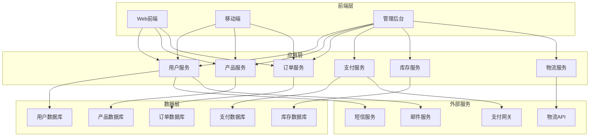

# 电商平台集成案例

## Odoo 17 电商平台集成开发

本文档详细介绍如何使用Odoo 17构建完整的电商平台，包括产品管理、订单处理、支付集成、库存管理等核心功能。

### 项目概述

#### 电商平台架构


#### 核心功能模块
```python
# 电商平台核心模块
class EcommerceModules:
    """电商平台核心模块"""
    
    def __init__(self):
        self.modules = {
            'user_management': {
                'name': '用户管理',
                'features': ['用户注册', '用户登录', '用户资料', '地址管理'],
                'models': ['res.users', 'res.partner', 'res.partner.address']
            },
            'product_management': {
                'name': '产品管理',
                'features': ['产品目录', '产品分类', '产品属性', '产品图片'],
                'models': ['product.template', 'product.product', 'product.category']
            },
            'order_management': {
                'name': '订单管理',
                'features': ['购物车', '订单创建', '订单状态', '订单历史'],
                'models': ['sale.order', 'sale.order.line', 'sale.cart']
            },
            'payment_processing': {
                'name': '支付处理',
                'features': ['支付方式', '支付流程', '支付状态', '退款处理'],
                'models': ['payment.transaction', 'payment.method', 'payment.refund']
            },
            'inventory_management': {
                'name': '库存管理',
                'features': ['库存跟踪', '库存预警', '库存调整', '库存报表'],
                'models': ['stock.quant', 'stock.move', 'stock.picking']
            },
            'logistics_management': {
                'name': '物流管理',
                'features': ['物流跟踪', '配送管理', '运费计算', '物流状态'],
                'models': ['delivery.carrier', 'stock.picking', 'delivery.tracking']
            }
        }
```

### 用户管理模块

#### 用户模型扩展
```python
# models/user_management.py
from odoo import models, fields, api
from odoo.exceptions import ValidationError

class ResUsers(models.Model):
    _inherit = 'res.users'
    
    # 用户扩展字段
    user_type = fields.Selection([
        ('customer', '客户'),
        ('vendor', '供应商'),
        ('admin', '管理员')
    ], '用户类型', default='customer')
    
    birth_date = fields.Date('出生日期')
    gender = fields.Selection([
        ('male', '男'),
        ('female', '女'),
        ('other', '其他')
    ], '性别')
    
    # 电商相关字段
    total_orders = fields.Integer('总订单数', compute='_compute_total_orders')
    total_spent = fields.Float('总消费金额', compute='_compute_total_spent')
    loyalty_points = fields.Integer('积分', default=0)
    membership_level = fields.Selection([
        ('bronze', '青铜'),
        ('silver', '白银'),
        ('gold', '黄金'),
        ('platinum', '白金')
    ], '会员等级', default='bronze')
    
    @api.depends('sale_order_ids')
    def _compute_total_orders(self):
        for user in self:
            user.total_orders = len(user.sale_order_ids.filtered(
                lambda x: x.state in ['sale', 'done']
            ))
    
    @api.depends('sale_order_ids')
    def _compute_total_spent(self):
        for user in self:
            orders = user.sale_order_ids.filtered(
                lambda x: x.state in ['sale', 'done']
            )
            user.total_spent = sum(orders.mapped('amount_total'))
    
    def update_membership_level(self):
        """更新会员等级"""
        for user in self:
            if user.total_spent >= 10000:
                user.membership_level = 'platinum'
            elif user.total_spent >= 5000:
                user.membership_level = 'gold'
            elif user.total_spent >= 2000:
                user.membership_level = 'silver'
            else:
                user.membership_level = 'bronze'

class ResPartner(models.Model):
    _inherit = 'res.partner'
    
    # 地址扩展
    is_default_shipping = fields.Boolean('默认收货地址')
    is_default_billing = fields.Boolean('默认账单地址')
    address_type = fields.Selection([
        ('home', '家庭'),
        ('office', '办公室'),
        ('other', '其他')
    ], '地址类型', default='home')
    
    # 地址验证
    @api.constrains('is_default_shipping')
    def _check_default_shipping(self):
        for partner in self:
            if partner.is_default_shipping and partner.parent_id:
                # 确保每个用户只有一个默认收货地址
                existing = self.search([
                    ('parent_id', '=', partner.parent_id.id),
                    ('is_default_shipping', '=', True),
                    ('id', '!=', partner.id)
                ])
                if existing:
                    existing.write({'is_default_shipping': False})
    
    @api.constrains('is_default_billing')
    def _check_default_billing(self):
        for partner in self:
            if partner.is_default_billing and partner.parent_id:
                # 确保每个用户只有一个默认账单地址
                existing = self.search([
                    ('parent_id', '=', partner.parent_id.id),
                    ('is_default_billing', '=', True),
                    ('id', '!=', partner.id)
                ])
                if existing:
                    existing.write({'is_default_billing': False})
```

#### 用户注册流程
```python
# models/user_registration.py
from odoo import models, fields, api
from odoo.exceptions import ValidationError
import re

class UserRegistration(models.Model):
    _name = 'user.registration'
    _description = '用户注册'
    
    name = fields.Char('姓名', required=True)
    email = fields.Char('邮箱', required=True)
    phone = fields.Char('手机号', required=True)
    password = fields.Char('密码', required=True)
    confirm_password = fields.Char('确认密码', required=True)
    birth_date = fields.Date('出生日期')
    gender = fields.Selection([
        ('male', '男'),
        ('female', '女'),
        ('other', '其他')
    ], '性别')
    
    # 地址信息
    country_id = fields.Many2one('res.country', '国家', required=True)
    state_id = fields.Many2one('res.country.state', '省份')
    city = fields.Char('城市', required=True)
    street = fields.Char('街道地址', required=True)
    zip = fields.Char('邮编')
    
    # 验证码
    verification_code = fields.Char('验证码')
    is_verified = fields.Boolean('已验证', default=False)
    
    @api.constrains('email')
    def _check_email(self):
        for record in self:
            if record.email:
                # 检查邮箱格式
                email_pattern = r'^[a-zA-Z0-9._%+-]+@[a-zA-Z0-9.-]+\.[a-zA-Z]{2,}$'
                if not re.match(email_pattern, record.email):
                    raise ValidationError("邮箱格式不正确")
                
                # 检查邮箱是否已存在
                existing_user = self.env['res.users'].search([
                    ('login', '=', record.email)
                ])
                if existing_user:
                    raise ValidationError("该邮箱已被注册")
    
    @api.constrains('phone')
    def _check_phone(self):
        for record in self:
            if record.phone:
                # 检查手机号格式
                phone_pattern = r'^1[3-9]\d{9}$'
                if not re.match(phone_pattern, record.phone):
                    raise ValidationError("手机号格式不正确")
                
                # 检查手机号是否已存在
                existing_partner = self.env['res.partner'].search([
                    ('phone', '=', record.phone)
                ])
                if existing_partner:
                    raise ValidationError("该手机号已被注册")
    
    @api.constrains('password', 'confirm_password')
    def _check_password(self):
        for record in self:
            if record.password and record.confirm_password:
                if record.password != record.confirm_password:
                    raise ValidationError("两次输入的密码不一致")
                
                # 密码强度检查
                if len(record.password) < 8:
                    raise ValidationError("密码长度不能少于8位")
                
                if not re.search(r'[A-Z]', record.password):
                    raise ValidationError("密码必须包含大写字母")
                
                if not re.search(r'[a-z]', record.password):
                    raise ValidationError("密码必须包含小写字母")
                
                if not re.search(r'\d', record.password):
                    raise ValidationError("密码必须包含数字")
    
    def send_verification_code(self):
        """发送验证码"""
        for record in self:
            if not record.email:
                raise ValidationError("请先填写邮箱")
            
            # 生成验证码
            import random
            code = str(random.randint(100000, 999999))
            record.verification_code = code
            
            # 发送邮件
            template = self.env.ref('ecommerce.email_verification_template')
            template.send_mail(record.id, force_send=True)
    
    def verify_code(self):
        """验证验证码"""
        for record in self:
            if not record.verification_code:
                raise ValidationError("请先获取验证码")
            
            # 这里应该从用户输入获取验证码
            # 简化处理，直接设置为已验证
            record.is_verified = True
    
    def create_user(self):
        """创建用户"""
        for record in self:
            if not record.is_verified:
                raise ValidationError("请先验证邮箱")
            
            # 创建用户
            user = self.env['res.users'].create({
                'name': record.name,
                'login': record.email,
                'password': record.password,
                'user_type': 'customer',
                'birth_date': record.birth_date,
                'gender': record.gender,
            })
            
            # 创建合作伙伴
            partner = self.env['res.partner'].create({
                'name': record.name,
                'email': record.email,
                'phone': record.phone,
                'is_company': False,
                'user_ids': [(6, 0, [user.id])],
                'country_id': record.country_id.id,
                'state_id': record.state_id.id,
                'city': record.city,
                'street': record.street,
                'zip': record.zip,
                'is_default_shipping': True,
                'is_default_billing': True,
            })
            
            return {
                'type': 'ir.actions.act_window',
                'res_model': 'res.users',
                'res_id': user.id,
                'view_mode': 'form',
                'target': 'current',
            }
```

### 产品管理模块

#### 产品模型扩展
```python
# models/product_management.py
from odoo import models, fields, api
from odoo.exceptions import ValidationError

class ProductTemplate(models.Model):
    _inherit = 'product.template'
    
    # 电商扩展字段
    is_featured = fields.Boolean('推荐产品', default=False)
    is_new = fields.Boolean('新品', default=False)
    is_bestseller = fields.Boolean('热销', default=False)
    is_on_sale = fields.Boolean('促销', default=False)
    
    # 产品属性
    brand_id = fields.Many2one('product.brand', '品牌')
    material = fields.Char('材质')
    color = fields.Char('颜色')
    size = fields.Char('尺寸')
    weight = fields.Float('重量(kg)')
    dimensions = fields.Char('尺寸(cm)')
    
    # 营销信息
    seo_title = fields.Char('SEO标题')
    seo_description = fields.Text('SEO描述')
    meta_keywords = fields.Char('关键词')
    
    # 销售统计
    view_count = fields.Integer('浏览次数', default=0)
    sale_count = fields.Integer('销售数量', compute='_compute_sale_count')
    rating_avg = fields.Float('平均评分', compute='_compute_rating_avg')
    review_count = fields.Integer('评价数量', compute='_compute_review_count')
    
    @api.depends('product_variant_ids')
    def _compute_sale_count(self):
        for product in self:
            # 计算总销售数量
            moves = self.env['stock.move'].search([
                ('product_id', 'in', product.product_variant_ids.ids),
                ('state', '=', 'done'),
                ('location_dest_id.usage', '=', 'customer')
            ])
            product.sale_count = sum(moves.mapped('product_uom_qty'))
    
    @api.depends('product_review_ids')
    def _compute_rating_avg(self):
        for product in self:
            reviews = product.product_review_ids.filtered('rating')
            if reviews:
                product.rating_avg = sum(reviews.mapped('rating')) / len(reviews)
            else:
                product.rating_avg = 0.0
    
    @api.depends('product_review_ids')
    def _compute_review_count(self):
        for product in self:
            product.review_count = len(product.product_review_ids)
    
    def increment_view_count(self):
        """增加浏览次数"""
        self.view_count += 1

class ProductBrand(models.Model):
    _name = 'product.brand'
    _description = '产品品牌'
    
    name = fields.Char('品牌名称', required=True)
    logo = fields.Binary('品牌Logo')
    description = fields.Text('品牌描述')
    website = fields.Char('官网')
    country_id = fields.Many2one('res.country', '国家')
    active = fields.Boolean('激活', default=True)
    
    product_count = fields.Integer('产品数量', compute='_compute_product_count')
    
    @api.depends('product_template_ids')
    def _compute_product_count(self):
        for brand in self:
            brand.product_count = len(brand.product_template_ids)

class ProductReview(models.Model):
    _name = 'product.review'
    _description = '产品评价'
    
    product_id = fields.Many2one('product.template', '产品', required=True)
    user_id = fields.Many2one('res.users', '用户', required=True)
    order_id = fields.Many2one('sale.order', '订单')
    
    rating = fields.Selection([
        (1, '1星'),
        (2, '2星'),
        (3, '3星'),
        (4, '4星'),
        (5, '5星')
    ], '评分', required=True)
    
    title = fields.Char('评价标题')
    content = fields.Text('评价内容')
    images = fields.Many2many('ir.attachment', 'product_review_images_rel', 
                             'review_id', 'attachment_id', '评价图片')
    
    is_verified = fields.Boolean('已验证购买', default=False)
    helpful_count = fields.Integer('有用数', default=0)
    reply = fields.Text('商家回复')
    reply_date = fields.Datetime('回复时间')
    
    @api.model
    def create(self, vals):
        # 检查是否已评价
        existing = self.search([
            ('product_id', '=', vals.get('product_id')),
            ('user_id', '=', vals.get('user_id'))
        ])
        if existing:
            raise ValidationError("您已经评价过该产品")
        
        return super().create(vals)
    
    def mark_helpful(self):
        """标记为有用"""
        self.helpful_count += 1
```

#### 产品分类管理
```python
# models/product_category.py
from odoo import models, fields, api

class ProductCategory(models.Model):
    _inherit = 'product.category'
    
    # 电商扩展字段
    image = fields.Binary('分类图片')
    description = fields.Text('分类描述')
    seo_title = fields.Char('SEO标题')
    seo_description = fields.Text('SEO描述')
    meta_keywords = fields.Char('关键词')
    
    # 分类属性
    is_featured = fields.Boolean('推荐分类', default=False)
    sort_order = fields.Integer('排序', default=0)
    
    # 统计信息
    product_count = fields.Integer('产品数量', compute='_compute_product_count')
    
    @api.depends('product_template_ids')
    def _compute_product_count(self):
        for category in self:
            category.product_count = len(category.product_template_ids)
    
    def get_products(self, limit=20, offset=0):
        """获取分类下的产品"""
        return self.product_template_ids.filtered('active')[offset:offset+limit]
```

### 订单管理模块

#### 购物车功能
```python
# models/shopping_cart.py
from odoo import models, fields, api
from odoo.exceptions import ValidationError

class ShoppingCart(models.Model):
    _name = 'shopping.cart'
    _description = '购物车'
    
    user_id = fields.Many2one('res.users', '用户', required=True)
    session_id = fields.Char('会话ID')
    
    # 购物车项目
    cart_line_ids = fields.One2many('shopping.cart.line', 'cart_id', '购物车项目')
    
    # 计算字段
    total_items = fields.Integer('商品总数', compute='_compute_totals')
    total_amount = fields.Float('总金额', compute='_compute_totals')
    total_weight = fields.Float('总重量', compute='_compute_totals')
    
    @api.depends('cart_line_ids')
    def _compute_totals(self):
        for cart in self:
            cart.total_items = sum(cart.cart_line_ids.mapped('quantity'))
            cart.total_amount = sum(cart.cart_line_ids.mapped('subtotal'))
            cart.total_weight = sum(cart.cart_line_ids.mapped('weight'))
    
    def add_product(self, product_id, quantity=1, **kwargs):
        """添加产品到购物车"""
        for cart in self:
            # 检查产品是否已存在
            existing_line = cart.cart_line_ids.filtered(
                lambda x: x.product_id.id == product_id
            )
            
            if existing_line:
                # 更新数量
                existing_line.quantity += quantity
            else:
                # 创建新行
                self.env['shopping.cart.line'].create({
                    'cart_id': cart.id,
                    'product_id': product_id,
                    'quantity': quantity,
                    **kwargs
                })
    
    def remove_product(self, product_id):
        """从购物车移除产品"""
        for cart in self:
            line = cart.cart_line_ids.filtered(
                lambda x: x.product_id.id == product_id
            )
            if line:
                line.unlink()
    
    def clear_cart(self):
        """清空购物车"""
        for cart in self:
            cart.cart_line_ids.unlink()
    
    def convert_to_order(self):
        """转换为订单"""
        for cart in self:
            if not cart.cart_line_ids:
                raise ValidationError("购物车为空")
            
            # 创建销售订单
            order = self.env['sale.order'].create({
                'partner_id': cart.user_id.partner_id.id,
                'user_id': cart.user_id.id,
            })
            
            # 创建订单行
            for line in cart.cart_line_ids:
                self.env['sale.order.line'].create({
                    'order_id': order.id,
                    'product_id': line.product_id.id,
                    'product_uom_qty': line.quantity,
                    'price_unit': line.price_unit,
                })
            
            # 清空购物车
            cart.clear_cart()
            
            return order

class ShoppingCartLine(models.Model):
    _name = 'shopping.cart.line'
    _description = '购物车项目'
    
    cart_id = fields.Many2one('shopping.cart', '购物车', required=True, ondelete='cascade')
    product_id = fields.Many2one('product.product', '产品', required=True)
    quantity = fields.Float('数量', default=1.0)
    price_unit = fields.Float('单价', related='product_id.list_price')
    subtotal = fields.Float('小计', compute='_compute_subtotal')
    weight = fields.Float('重量', compute='_compute_weight')
    
    @api.depends('quantity', 'price_unit')
    def _compute_subtotal(self):
        for line in self:
            line.subtotal = line.quantity * line.price_unit
    
    @api.depends('quantity', 'product_id.weight')
    def _compute_weight(self):
        for line in self:
            line.weight = line.quantity * (line.product_id.weight or 0)
    
    @api.constrains('quantity')
    def _check_quantity(self):
        for line in self:
            if line.quantity <= 0:
                raise ValidationError("数量必须大于0")
```

#### 订单处理流程
```python
# models/order_processing.py
from odoo import models, fields, api
from odoo.exceptions import ValidationError

class SaleOrder(models.Model):
    _inherit = 'sale.order'
    
    # 电商扩展字段
    order_source = fields.Selection([
        ('website', '网站'),
        ('mobile', '移动端'),
        ('admin', '后台'),
        ('api', 'API')
    ], '订单来源', default='website')
    
    # 支付信息
    payment_method_id = fields.Many2one('payment.method', '支付方式')
    payment_status = fields.Selection([
        ('pending', '待支付'),
        ('paid', '已支付'),
        ('failed', '支付失败'),
        ('refunded', '已退款')
    ], '支付状态', default='pending')
    
    # 物流信息
    shipping_method_id = fields.Many2one('delivery.carrier', '配送方式')
    shipping_cost = fields.Float('运费')
    tracking_number = fields.Char('物流单号')
    estimated_delivery = fields.Date('预计送达')
    
    # 地址信息
    shipping_address_id = fields.Many2one('res.partner', '收货地址')
    billing_address_id = fields.Many2one('res.partner', '账单地址')
    
    # 优惠信息
    coupon_id = fields.Many2one('sale.coupon', '优惠券')
    discount_amount = fields.Float('优惠金额')
    
    # 订单状态
    order_status = fields.Selection([
        ('draft', '草稿'),
        ('confirmed', '已确认'),
        ('paid', '已支付'),
        ('shipped', '已发货'),
        ('delivered', '已送达'),
        ('cancelled', '已取消'),
        ('returned', '已退货')
    ], '订单状态', default='draft')
    
    def action_confirm_order(self):
        """确认订单"""
        for order in self:
            if order.state != 'draft':
                raise ValidationError("只能确认草稿状态的订单")
            
            # 检查库存
            for line in order.order_line:
                if line.product_id.type == 'product':
                    available_qty = line.product_id.qty_available
                    if available_qty < line.product_uom_qty:
                        raise ValidationError(
                            f"产品 {line.product_id.name} 库存不足，"
                            f"可用库存：{available_qty}，需要：{line.product_uom_qty}"
                        )
            
            # 更新状态
            order.write({
                'state': 'sale',
                'order_status': 'confirmed'
            })
            
            # 发送确认邮件
            order._send_order_confirmation_email()
    
    def action_process_payment(self):
        """处理支付"""
        for order in self:
            if order.payment_status != 'pending':
                raise ValidationError("订单状态不允许支付")
            
            # 调用支付接口
            payment_result = order._process_payment()
            
            if payment_result['success']:
                order.write({
                    'payment_status': 'paid',
                    'order_status': 'paid'
                })
                
                # 创建拣货单
                order._create_picking()
                
                # 发送支付确认邮件
                order._send_payment_confirmation_email()
            else:
                order.write({'payment_status': 'failed'})
                raise ValidationError(f"支付失败：{payment_result['message']}")
    
    def action_ship_order(self):
        """发货"""
        for order in self:
            if order.order_status != 'paid':
                raise ValidationError("只能发货已支付的订单")
            
            # 更新状态
            order.write({'order_status': 'shipped'})
            
            # 发送发货通知
            order._send_shipping_notification()
    
    def action_deliver_order(self):
        """确认送达"""
        for order in self:
            if order.order_status != 'shipped':
                raise ValidationError("只能确认已发货的订单")
            
            # 更新状态
            order.write({'order_status': 'delivered'})
            
            # 发送送达确认
            order._send_delivery_confirmation()
    
    def _process_payment(self):
        """处理支付"""
        # 这里应该调用实际的支付接口
        # 简化处理，直接返回成功
        return {
            'success': True,
            'transaction_id': f"TXN_{self.id}_{fields.Datetime.now()}",
            'message': '支付成功'
        }
    
    def _send_order_confirmation_email(self):
        """发送订单确认邮件"""
        template = self.env.ref('ecommerce.email_order_confirmation_template')
        template.send_mail(self.id, force_send=True)
    
    def _send_payment_confirmation_email(self):
        """发送支付确认邮件"""
        template = self.env.ref('ecommerce.email_payment_confirmation_template')
        template.send_mail(self.id, force_send=True)
    
    def _send_shipping_notification(self):
        """发送发货通知"""
        template = self.env.ref('ecommerce.email_shipping_notification_template')
        template.send_mail(self.id, force_send=True)
    
    def _send_delivery_confirmation(self):
        """发送送达确认"""
        template = self.env.ref('ecommerce.email_delivery_confirmation_template')
        template.send_mail(self.id, force_send=True)
```

### 支付集成模块

#### 支付方式管理
```python
# models/payment_method.py
from odoo import models, fields, api

class PaymentMethod(models.Model):
    _name = 'payment.method'
    _description = '支付方式'
    
    name = fields.Char('支付方式名称', required=True)
    code = fields.Char('支付代码', required=True)
    provider = fields.Selection([
        ('alipay', '支付宝'),
        ('wechat', '微信支付'),
        ('unionpay', '银联'),
        ('paypal', 'PayPal'),
        ('stripe', 'Stripe'),
        ('manual', '手动支付')
    ], '支付提供商', required=True)
    
    # 配置信息
    is_active = fields.Boolean('激活', default=True)
    is_default = fields.Boolean('默认支付方式', default=False)
    min_amount = fields.Float('最小金额', default=0.0)
    max_amount = fields.Float('最大金额', default=0.0)
    
    # 费率信息
    fee_type = fields.Selection([
        ('fixed', '固定费用'),
        ('percentage', '百分比'),
        ('mixed', '混合')
    ], '费率类型', default='fixed')
    fee_amount = fields.Float('固定费用')
    fee_percentage = fields.Float('百分比费率')
    
    # 配置参数
    config_params = fields.Text('配置参数', help='JSON格式的配置参数')
    
    # 统计信息
    transaction_count = fields.Integer('交易次数', compute='_compute_stats')
    total_amount = fields.Float('总交易金额', compute='_compute_stats')
    
    @api.depends('payment_transaction_ids')
    def _compute_stats(self):
        for method in self:
            transactions = method.payment_transaction_ids.filtered(
                lambda x: x.state == 'done'
            )
            method.transaction_count = len(transactions)
            method.total_amount = sum(transactions.mapped('amount'))
    
    def calculate_fee(self, amount):
        """计算手续费"""
        if self.fee_type == 'fixed':
            return self.fee_amount
        elif self.fee_type == 'percentage':
            return amount * (self.fee_percentage / 100)
        elif self.fee_type == 'mixed':
            return self.fee_amount + (amount * (self.fee_percentage / 100))
        return 0.0

class PaymentTransaction(models.Model):
    _name = 'payment.transaction'
    _description = '支付交易'
    
    # 基本信息
    name = fields.Char('交易号', required=True)
    order_id = fields.Many2one('sale.order', '订单', required=True)
    payment_method_id = fields.Many2one('payment.method', '支付方式', required=True)
    
    # 金额信息
    amount = fields.Float('交易金额', required=True)
    currency_id = fields.Many2one('res.currency', '货币', required=True)
    fee_amount = fields.Float('手续费')
    
    # 状态信息
    state = fields.Selection([
        ('draft', '草稿'),
        ('pending', '待支付'),
        ('processing', '处理中'),
        ('done', '已完成'),
        ('failed', '失败'),
        ('cancelled', '已取消'),
        ('refunded', '已退款')
    ], '状态', default='draft')
    
    # 时间信息
    create_date = fields.Datetime('创建时间', readonly=True)
    payment_date = fields.Datetime('支付时间')
    expire_date = fields.Datetime('过期时间')
    
    # 第三方信息
    provider_transaction_id = fields.Char('第三方交易号')
    provider_response = fields.Text('第三方响应')
    
    # 退款信息
    refund_amount = fields.Float('退款金额', default=0.0)
    refund_reason = fields.Text('退款原因')
    
    def process_payment(self):
        """处理支付"""
        for transaction in self:
            if transaction.state != 'pending':
                raise ValidationError("只能处理待支付状态的交易")
            
            # 调用支付接口
            result = transaction._call_payment_api()
            
            if result['success']:
                transaction.write({
                    'state': 'done',
                    'payment_date': fields.Datetime.now(),
                    'provider_transaction_id': result.get('transaction_id'),
                    'provider_response': str(result)
                })
                
                # 更新订单状态
                transaction.order_id.write({
                    'payment_status': 'paid',
                    'order_status': 'paid'
                })
            else:
                transaction.write({
                    'state': 'failed',
                    'provider_response': result.get('message', '支付失败')
                })
    
    def process_refund(self, amount=None, reason=None):
        """处理退款"""
        for transaction in self:
            if transaction.state != 'done':
                raise ValidationError("只能退款已完成的交易")
            
            refund_amount = amount or transaction.amount
            if refund_amount > transaction.amount:
                raise ValidationError("退款金额不能超过交易金额")
            
            # 调用退款接口
            result = transaction._call_refund_api(refund_amount)
            
            if result['success']:
                transaction.write({
                    'refund_amount': refund_amount,
                    'refund_reason': reason,
                    'state': 'refunded'
                })
                
                # 更新订单状态
                transaction.order_id.write({'payment_status': 'refunded'})
            else:
                raise ValidationError(f"退款失败：{result.get('message')}")
    
    def _call_payment_api(self):
        """调用支付API"""
        # 这里应该调用实际的支付接口
        # 简化处理，直接返回成功
        return {
            'success': True,
            'transaction_id': f"TXN_{self.id}_{fields.Datetime.now()}",
            'message': '支付成功'
        }
    
    def _call_refund_api(self, amount):
        """调用退款API"""
        # 这里应该调用实际的退款接口
        # 简化处理，直接返回成功
        return {
            'success': True,
            'refund_id': f"REF_{self.id}_{fields.Datetime.now()}",
            'message': '退款成功'
        }
```

### 库存管理模块

#### 库存预警系统
```python
# models/inventory_management.py
from odoo import models, fields, api
from odoo.exceptions import ValidationError

class StockQuant(models.Model):
    _inherit = 'stock.quant'
    
    # 库存预警
    min_qty = fields.Float('最小库存', related='product_id.min_qty')
    max_qty = fields.Float('最大库存', related='product_id.max_qty')
    is_low_stock = fields.Boolean('库存不足', compute='_compute_is_low_stock')
    is_overstock = fields.Boolean('库存过多', compute='_compute_is_overstock')
    
    @api.depends('quantity', 'min_qty', 'max_qty')
    def _compute_is_low_stock(self):
        for quant in self:
            quant.is_low_stock = quant.quantity <= quant.min_qty
    
    @api.depends('quantity', 'max_qty')
    def _compute_is_overstock(self):
        for quant in self:
            quant.is_overstock = quant.quantity > quant.max_qty
    
    def check_stock_alerts(self):
        """检查库存预警"""
        low_stock_quants = self.search([
            ('is_low_stock', '=', True),
            ('location_id.usage', '=', 'internal')
        ])
        
        overstock_quants = self.search([
            ('is_overstock', '=', True),
            ('location_id.usage', '=', 'internal')
        ])
        
        # 发送预警通知
        if low_stock_quants:
            self._send_low_stock_alert(low_stock_quants)
        
        if overstock_quants:
            self._send_overstock_alert(overstock_quants)
    
    def _send_low_stock_alert(self, quants):
        """发送库存不足预警"""
        for quant in quants:
            # 创建预警记录
            self.env['stock.alert'].create({
                'type': 'low_stock',
                'product_id': quant.product_id.id,
                'location_id': quant.location_id.id,
                'current_qty': quant.quantity,
                'min_qty': quant.min_qty,
                'message': f"产品 {quant.product_id.name} 库存不足，当前库存：{quant.quantity}，最小库存：{quant.min_qty}"
            })
    
    def _send_overstock_alert(self, quants):
        """发送库存过多预警"""
        for quant in quants:
            # 创建预警记录
            self.env['stock.alert'].create({
                'type': 'overstock',
                'product_id': quant.product_id.id,
                'location_id': quant.location_id.id,
                'current_qty': quant.quantity,
                'max_qty': quant.max_qty,
                'message': f"产品 {quant.product_id.name} 库存过多，当前库存：{quant.quantity}，最大库存：{quant.max_qty}"
            })

class StockAlert(models.Model):
    _name = 'stock.alert'
    _description = '库存预警'
    
    type = fields.Selection([
        ('low_stock', '库存不足'),
        ('overstock', '库存过多'),
        ('expired', '即将过期'),
        ('damaged', '损坏')
    ], '预警类型', required=True)
    
    product_id = fields.Many2one('product.product', '产品', required=True)
    location_id = fields.Many2one('stock.location', '库位', required=True)
    
    current_qty = fields.Float('当前库存')
    min_qty = fields.Float('最小库存')
    max_qty = fields.Float('最大库存')
    
    message = fields.Text('预警消息')
    is_resolved = fields.Boolean('已解决', default=False)
    resolved_date = fields.Datetime('解决时间')
    resolved_by = fields.Many2one('res.users', '解决人')
    
    create_date = fields.Datetime('创建时间', readonly=True)
    
    def resolve_alert(self):
        """解决预警"""
        for alert in self:
            alert.write({
                'is_resolved': True,
                'resolved_date': fields.Datetime.now(),
                'resolved_by': self.env.user.id
            })
```

### 物流管理模块

#### 物流跟踪系统
```python
# models/logistics_management.py
from odoo import models, fields, api

class DeliveryCarrier(models.Model):
    _inherit = 'delivery.carrier'
    
    # 物流扩展字段
    tracking_url = fields.Char('跟踪URL模板')
    api_endpoint = fields.Char('API接口')
    api_key = fields.Char('API密钥')
    
    # 服务类型
    service_types = fields.Selection([
        ('standard', '标准配送'),
        ('express', '快递'),
        ('overnight', '隔夜达'),
        ('same_day', '当日达')
    ], '服务类型', default='standard')
    
    # 配送范围
    supported_countries = fields.Many2many('res.country', 'carrier_country_rel', 
                                         'carrier_id', 'country_id', '支持国家')
    supported_states = fields.Many2many('res.country.state', 'carrier_state_rel',
                                       'carrier_id', 'state_id', '支持省份')
    
    def get_tracking_url(self, tracking_number):
        """获取跟踪URL"""
        if self.tracking_url and tracking_number:
            return self.tracking_url.format(tracking_number=tracking_number)
        return False
    
    def get_tracking_info(self, tracking_number):
        """获取跟踪信息"""
        if not self.api_endpoint or not self.api_key:
            return False
        
        # 调用物流API
        import requests
        try:
            response = requests.get(
                self.api_endpoint,
                params={
                    'tracking_number': tracking_number,
                    'api_key': self.api_key
                },
                timeout=30
            )
            response.raise_for_status()
            return response.json()
        except Exception as e:
            return {'error': str(e)}

class DeliveryTracking(models.Model):
    _name = 'delivery.tracking'
    _description = '物流跟踪'
    
    # 基本信息
    name = fields.Char('跟踪号', required=True)
    order_id = fields.Many2one('sale.order', '订单', required=True)
    carrier_id = fields.Many2one('delivery.carrier', '物流公司', required=True)
    
    # 状态信息
    status = fields.Selection([
        ('pending', '待发货'),
        ('picked_up', '已取件'),
        ('in_transit', '运输中'),
        ('out_for_delivery', '派送中'),
        ('delivered', '已送达'),
        ('exception', '异常'),
        ('returned', '已退回')
    ], '状态', default='pending')
    
    # 时间信息
    create_date = fields.Datetime('创建时间', readonly=True)
    pickup_date = fields.Datetime('取件时间')
    delivery_date = fields.Datetime('送达时间')
    
    # 位置信息
    current_location = fields.Char('当前位置')
    destination = fields.Char('目的地')
    
    # 跟踪记录
    tracking_line_ids = fields.One2many('delivery.tracking.line', 'tracking_id', '跟踪记录')
    
    # 计算字段
    tracking_url = fields.Char('跟踪链接', compute='_compute_tracking_url')
    
    @api.depends('carrier_id', 'name')
    def _compute_tracking_url(self):
        for tracking in self:
            tracking.tracking_url = tracking.carrier_id.get_tracking_url(tracking.name)
    
    def update_tracking_info(self):
        """更新跟踪信息"""
        for tracking in self:
            # 调用物流API获取最新信息
            info = tracking.carrier_id.get_tracking_info(tracking.name)
            
            if info and not info.get('error'):
                # 更新状态
                tracking.write({
                    'status': info.get('status', tracking.status),
                    'current_location': info.get('current_location'),
                    'delivery_date': info.get('delivery_date')
                })
                
                # 添加跟踪记录
                if info.get('events'):
                    for event in info['events']:
                        self.env['delivery.tracking.line'].create({
                            'tracking_id': tracking.id,
                            'status': event.get('status'),
                            'location': event.get('location'),
                            'description': event.get('description'),
                            'date': event.get('date')
                        })

class DeliveryTrackingLine(models.Model):
    _name = 'delivery.tracking.line'
    _description = '物流跟踪记录'
    
    tracking_id = fields.Many2one('delivery.tracking', '跟踪', required=True, ondelete='cascade')
    
    status = fields.Selection([
        ('pending', '待发货'),
        ('picked_up', '已取件'),
        ('in_transit', '运输中'),
        ('out_for_delivery', '派送中'),
        ('delivered', '已送达'),
        ('exception', '异常'),
        ('returned', '已退回')
    ], '状态')
    
    location = fields.Char('位置')
    description = fields.Text('描述')
    date = fields.Datetime('时间')
    
    sequence = fields.Integer('序号', default=10)
```

## 相关链接
- [[ERP模块定制案例]] - ERP模块定制
- [[人力资源系统案例]] - 人力资源系统
- [[财务系统案例]] - 财务系统
- [[项目管理系统案例]] - 项目管理系统
