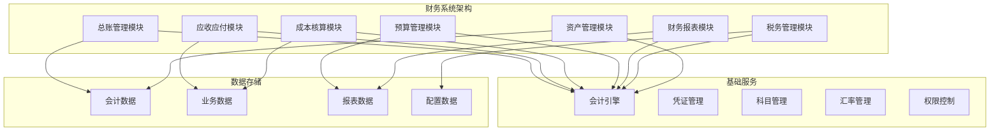

# 财务系统案例

## Odoo 17 财务管理系统开发

本文档详细介绍如何使用Odoo 17开发完整的财务管理系统，包括总账管理、应收应付管理、成本核算、预算管理等核心功能。

### 项目概述

#### 项目背景
某制造企业需要定制财务管理系统，主要需求包括：
- 总账管理
- 应收应付管理
- 成本核算
- 预算管理
- 财务报表
- 税务管理
- 资产管理

#### 系统架构


### 核心模块设计

#### 1. 总账管理模块
```python
# models/account_management.py
from odoo import models, fields, api
from odoo.exceptions import ValidationError, UserError
from datetime import datetime, date

class AccountMove(models.Model):
    _inherit = 'account.move'
    
    # 扩展凭证信息
    voucher_number = fields.Char('凭证号', required=True, index=True)
    voucher_type = fields.Selection([
        ('receipt', '收款凭证'),
        ('payment', '付款凭证'),
        ('transfer', '转账凭证'),
        ('adjustment', '调整凭证'),
        ('closing', '结账凭证')
    ], '凭证类型', required=True)
    
    # 业务信息
    business_date = fields.Date('业务日期', required=True)
    reference = fields.Char('业务参考')
    description = fields.Text('摘要')
    
    # 审批信息
    approver_id = fields.Many2one('res.users', '审批人')
    approval_date = fields.Datetime('审批日期')
    approval_comment = fields.Text('审批意见')
    
    # 状态扩展
    state = fields.Selection([
        ('draft', '草稿'),
        ('posted', '已过账'),
        ('approved', '已审批'),
        ('cancelled', '已取消')
    ], '状态', default='draft', tracking=True)
    
    @api.model
    def create(self, vals):
        if not vals.get('voucher_number'):
            vals['voucher_number'] = self.env['ir.sequence'].next_by_code('account.move')
        if not vals.get('business_date'):
            vals['business_date'] = fields.Date.today()
        return super().create(vals)
    
    def action_approve(self):
        """审批凭证"""
        for move in self:
            if move.state != 'posted':
                raise UserError("只能审批已过账的凭证")
            
            move.write({
                'state': 'approved',
                'approver_id': self.env.user.id,
                'approval_date': fields.Datetime.now()
            })
    
    def action_cancel(self):
        """取消凭证"""
        for move in self:
            if move.state == 'cancelled':
                raise UserError("凭证已经取消")
            
            move.write({'state': 'cancelled'})

class AccountMoveLine(models.Model):
    _inherit = 'account.move.line'
    
    # 扩展明细信息
    line_description = fields.Text('行摘要')
    cost_center_id = fields.Many2one('account.cost.center', '成本中心')
    project_id = fields.Many2one('project.project', '项目')
    
    # 业务信息
    business_reference = fields.Char('业务参考')
    contract_id = fields.Many2one('contract.contract', '合同')
    
    # 税务信息
    tax_amount = fields.Float('税额', digits=(16, 2))
    tax_rate = fields.Float('税率', digits=(5, 4))
    
    @api.depends('debit', 'credit', 'tax_amount')
    def _compute_balance(self):
        for line in self:
            line.balance = line.debit - line.credit + line.tax_amount

class AccountCostCenter(models.Model):
    _name = 'account.cost.center'
    _description = '成本中心'
    
    # 基本信息
    name = fields.Char('成本中心名称', required=True)
    code = fields.Char('成本中心编码', required=True, index=True)
    description = fields.Text('描述')
    
    # 分类信息
    category = fields.Selection([
        ('production', '生产'),
        ('sales', '销售'),
        ('administration', '管理'),
        ('finance', '财务'),
        ('hr', '人力资源'),
        ('other', '其他')
    ], '分类', required=True)
    
    # 负责人
    manager_id = fields.Many2one('res.users', '负责人')
    
    # 预算信息
    budget_amount = fields.Float('预算金额', digits=(16, 2))
    actual_amount = fields.Float('实际金额', digits=(16, 2), compute='_compute_actual_amount')
    variance_amount = fields.Float('差异金额', digits=(16, 2), compute='_compute_variance_amount')
    
    # 状态
    active = fields.Boolean('激活', default=True)
    
    @api.depends('move_line_ids.balance')
    def _compute_actual_amount(self):
        for center in self:
            lines = self.env['account.move.line'].search([
                ('cost_center_id', '=', center.id),
                ('move_id.state', '=', 'posted')
            ])
            center.actual_amount = sum(lines.mapped('balance'))
    
    @api.depends('budget_amount', 'actual_amount')
    def _compute_variance_amount(self):
        for center in self:
            center.variance_amount = center.actual_amount - center.budget_amount
```

#### 2. 应收应付管理模块
```python
# models/account_receivable_payable.py
from odoo import models, fields, api
from odoo.exceptions import ValidationError, UserError

class AccountReceivable(models.Model):
    _name = 'account.receivable'
    _description = '应收账款'
    _inherit = ['mail.thread', 'mail.activity.mixin']
    
    # 基本信息
    name = fields.Char('应收单号', required=True)
    partner_id = fields.Many2one('res.partner', '客户', required=True)
    invoice_id = fields.Many2one('account.move', '发票')
    
    # 金额信息
    original_amount = fields.Float('原始金额', digits=(16, 2), required=True)
    paid_amount = fields.Float('已收金额', digits=(16, 2), default=0.0)
    balance_amount = fields.Float('余额', digits=(16, 2), compute='_compute_balance_amount')
    
    # 时间信息
    invoice_date = fields.Date('发票日期', required=True)
    due_date = fields.Date('到期日期', required=True)
    payment_date = fields.Date('收款日期')
    
    # 状态信息
    state = fields.Selection([
        ('draft', '草稿'),
        ('confirmed', '已确认'),
        ('partially_paid', '部分收款'),
        ('paid', '已收款'),
        ('overdue', '逾期'),
        ('cancelled', '已取消')
    ], '状态', default='draft', tracking=True)
    
    # 收款记录
    payment_line_ids = fields.One2many('account.receivable.payment', 'receivable_id', '收款记录')
    
    @api.depends('original_amount', 'paid_amount')
    def _compute_balance_amount(self):
        for receivable in self:
            receivable.balance_amount = receivable.original_amount - receivable.paid_amount
    
    @api.model
    def create(self, vals):
        if not vals.get('name'):
            vals['name'] = self.env['ir.sequence'].next_by_code('account.receivable')
        return super().create(vals)
    
    def action_confirm(self):
        """确认应收"""
        for receivable in self:
            if receivable.state != 'draft':
                raise UserError("只能确认草稿状态的应收")
            
            receivable.write({'state': 'confirmed'})
    
    def action_pay(self):
        """收款"""
        for receivable in self:
            if receivable.state not in ['confirmed', 'partially_paid']:
                raise UserError("只能对已确认或部分收款的应收进行收款")
            
            # 创建收款记录
            payment = self.env['account.receivable.payment'].create({
                'receivable_id': receivable.id,
                'payment_amount': receivable.balance_amount,
                'payment_date': fields.Date.today(),
                'payment_method': 'bank_transfer'
            })
            
            # 更新状态
            if receivable.balance_amount <= 0:
                receivable.write({
                    'state': 'paid',
                    'payment_date': fields.Date.today()
                })
            else:
                receivable.write({'state': 'partially_paid'})

class AccountReceivablePayment(models.Model):
    _name = 'account.receivable.payment'
    _description = '应收账款收款记录'
    
    # 基本信息
    receivable_id = fields.Many2one('account.receivable', '应收账款', required=True, ondelete='cascade')
    payment_amount = fields.Float('收款金额', digits=(16, 2), required=True)
    payment_date = fields.Date('收款日期', required=True)
    payment_method = fields.Selection([
        ('cash', '现金'),
        ('bank_transfer', '银行转账'),
        ('check', '支票'),
        ('credit_card', '信用卡'),
        ('other', '其他')
    ], '收款方式', required=True)
    
    # 银行信息
    bank_account_id = fields.Many2one('res.partner.bank', '收款账户')
    reference = fields.Char('参考号')
    
    # 备注
    note = fields.Text('备注')

class AccountPayable(models.Model):
    _name = 'account.payable'
    _description = '应付账款'
    _inherit = ['mail.thread', 'mail.activity.mixin']
    
    # 基本信息
    name = fields.Char('应付单号', required=True)
    partner_id = fields.Many2one('res.partner', '供应商', required=True)
    invoice_id = fields.Many2one('account.move', '发票')
    
    # 金额信息
    original_amount = fields.Float('原始金额', digits=(16, 2), required=True)
    paid_amount = fields.Float('已付金额', digits=(16, 2), default=0.0)
    balance_amount = fields.Float('余额', digits=(16, 2), compute='_compute_balance_amount')
    
    # 时间信息
    invoice_date = fields.Date('发票日期', required=True)
    due_date = fields.Date('到期日期', required=True)
    payment_date = fields.Date('付款日期')
    
    # 状态信息
    state = fields.Selection([
        ('draft', '草稿'),
        ('confirmed', '已确认'),
        ('partially_paid', '部分付款'),
        ('paid', '已付款'),
        ('overdue', '逾期'),
        ('cancelled', '已取消')
    ], '状态', default='draft', tracking=True)
    
    # 付款记录
    payment_line_ids = fields.One2many('account.payable.payment', 'payable_id', '付款记录')
    
    @api.depends('original_amount', 'paid_amount')
    def _compute_balance_amount(self):
        for payable in self:
            payable.balance_amount = payable.original_amount - payable.paid_amount
    
    @api.model
    def create(self, vals):
        if not vals.get('name'):
            vals['name'] = self.env['ir.sequence'].next_by_code('account.payable')
        return super().create(vals)
    
    def action_confirm(self):
        """确认应付"""
        for payable in self:
            if payable.state != 'draft':
                raise UserError("只能确认草稿状态的应付")
            
            payable.write({'state': 'confirmed'})
    
    def action_pay(self):
        """付款"""
        for payable in self:
            if payable.state not in ['confirmed', 'partially_paid']:
                raise UserError("只能对已确认或部分付款的应付进行付款")
            
            # 创建付款记录
            payment = self.env['account.payable.payment'].create({
                'payable_id': payable.id,
                'payment_amount': payable.balance_amount,
                'payment_date': fields.Date.today(),
                'payment_method': 'bank_transfer'
            })
            
            # 更新状态
            if payable.balance_amount <= 0:
                payable.write({
                    'state': 'paid',
                    'payment_date': fields.Date.today()
                })
            else:
                payable.write({'state': 'partially_paid'})

class AccountPayablePayment(models.Model):
    _name = 'account.payable.payment'
    _description = '应付账款付款记录'
    
    # 基本信息
    payable_id = fields.Many2one('account.payable', '应付账款', required=True, ondelete='cascade')
    payment_amount = fields.Float('付款金额', digits=(16, 2), required=True)
    payment_date = fields.Date('付款日期', required=True)
    payment_method = fields.Selection([
        ('cash', '现金'),
        ('bank_transfer', '银行转账'),
        ('check', '支票'),
        ('credit_card', '信用卡'),
        ('other', '其他')
    ], '付款方式', required=True)
    
    # 银行信息
    bank_account_id = fields.Many2one('res.partner.bank', '付款账户')
    reference = fields.Char('参考号')
    
    # 备注
    note = fields.Text('备注')
```

#### 3. 成本核算模块
```python
# models/account_cost.py
from odoo import models, fields, api
from odoo.exceptions import ValidationError, UserError

class AccountCostCenter(models.Model):
    _name = 'account.cost.center'
    _description = '成本中心'
    
    # 基本信息
    name = fields.Char('成本中心名称', required=True)
    code = fields.Char('成本中心编码', required=True, index=True)
    description = fields.Text('描述')
    
    # 分类信息
    category = fields.Selection([
        ('production', '生产'),
        ('sales', '销售'),
        ('administration', '管理'),
        ('finance', '财务'),
        ('hr', '人力资源'),
        ('other', '其他')
    ], '分类', required=True)
    
    # 负责人
    manager_id = fields.Many2one('res.users', '负责人')
    
    # 预算信息
    budget_amount = fields.Float('预算金额', digits=(16, 2))
    actual_amount = fields.Float('实际金额', digits=(16, 2), compute='_compute_actual_amount')
    variance_amount = fields.Float('差异金额', digits=(16, 2), compute='_compute_variance_amount')
    
    # 状态
    active = fields.Boolean('激活', default=True)
    
    @api.depends('move_line_ids.balance')
    def _compute_actual_amount(self):
        for center in self:
            lines = self.env['account.move.line'].search([
                ('cost_center_id', '=', center.id),
                ('move_id.state', '=', 'posted')
            ])
            center.actual_amount = sum(lines.mapped('balance'))
    
    @api.depends('budget_amount', 'actual_amount')
    def _compute_variance_amount(self):
        for center in self:
            center.variance_amount = center.actual_amount - center.budget_amount

class AccountCostAllocation(models.Model):
    _name = 'account.cost.allocation'
    _description = '成本分摊'
    
    # 基本信息
    name = fields.Char('分摊单号', required=True)
    allocation_date = fields.Date('分摊日期', required=True)
    period_start = fields.Date('期间开始', required=True)
    period_end = fields.Date('期间结束', required=True)
    
    # 状态信息
    state = fields.Selection([
        ('draft', '草稿'),
        ('calculated', '已计算'),
        ('posted', '已过账'),
        ('cancelled', '已取消')
    ], '状态', default='draft', tracking=True)
    
    # 分摊明细
    allocation_line_ids = fields.One2many('account.cost.allocation.line', 'allocation_id', '分摊明细')
    
    @api.model
    def create(self, vals):
        if not vals.get('name'):
            vals['name'] = self.env['ir.sequence'].next_by_code('account.cost.allocation')
        return super().create(vals)
    
    def action_calculate(self):
        """计算分摊"""
        for allocation in self:
            if allocation.state != 'draft':
                raise UserError("只能计算草稿状态的分摊")
            
            # 清除现有明细
            allocation.allocation_line_ids.unlink()
            
            # 获取期间内的费用
            expense_lines = self.env['account.move.line'].search([
                ('account_id.user_type_id.type', '=', 'expense'),
                ('move_id.date', '>=', allocation.period_start),
                ('move_id.date', '<=', allocation.period_end),
                ('move_id.state', '=', 'posted')
            ])
            
            # 按成本中心分摊
            for line in expense_lines:
                if line.cost_center_id:
                    self.env['account.cost.allocation.line'].create({
                        'allocation_id': allocation.id,
                        'cost_center_id': line.cost_center_id.id,
                        'account_id': line.account_id.id,
                        'amount': line.balance,
                        'allocation_method': 'direct'
                    })
            
            allocation.write({'state': 'calculated'})
    
    def action_post(self):
        """过账分摊"""
        for allocation in self:
            if allocation.state != 'calculated':
                raise UserError("只能过账已计算的分摊")
            
            # 创建分摊凭证
            move_vals = {
                'voucher_type': 'transfer',
                'business_date': allocation.allocation_date,
                'description': f'成本分摊-{allocation.name}',
                'line_ids': []
            }
            
            for line in allocation.allocation_line_ids:
                # 借方
                move_vals['line_ids'].append((0, 0, {
                    'account_id': line.account_id.id,
                    'debit': line.amount,
                    'credit': 0.0,
                    'cost_center_id': line.cost_center_id.id,
                    'line_description': f'分摊到{line.cost_center_id.name}'
                }))
                
                # 贷方
                move_vals['line_ids'].append((0, 0, {
                    'account_id': line.account_id.id,
                    'debit': 0.0,
                    'credit': line.amount,
                    'line_description': f'从{line.cost_center_id.name}分摊'
                }))
            
            move = self.env['account.move'].create(move_vals)
            move.action_post()
            
            allocation.write({'state': 'posted'})

class AccountCostAllocationLine(models.Model):
    _name = 'account.cost.allocation.line'
    _description = '成本分摊明细'
    
    # 基本信息
    allocation_id = fields.Many2one('account.cost.allocation', '成本分摊', required=True, ondelete='cascade')
    cost_center_id = fields.Many2one('account.cost.center', '成本中心', required=True)
    account_id = fields.Many2one('account.account', '科目', required=True)
    
    # 金额信息
    amount = fields.Float('分摊金额', digits=(16, 2), required=True)
    allocation_method = fields.Selection([
        ('direct', '直接分摊'),
        ('proportion', '按比例分摊'),
        ('fixed', '固定分摊')
    ], '分摊方法', required=True)
    
    # 备注
    note = fields.Text('备注')
```

#### 4. 预算管理模块
```python
# models/account_budget.py
from odoo import models, fields, api
from odoo.exceptions import ValidationError, UserError

class AccountBudget(models.Model):
    _name = 'account.budget'
    _description = '预算管理'
    _inherit = ['mail.thread', 'mail.activity.mixin']
    
    # 基本信息
    name = fields.Char('预算名称', required=True)
    budget_year = fields.Integer('预算年度', required=True)
    budget_period = fields.Selection([
        ('monthly', '月度'),
        ('quarterly', '季度'),
        ('yearly', '年度')
    ], '预算期间', required=True, default='monthly')
    
    # 状态信息
    state = fields.Selection([
        ('draft', '草稿'),
        ('approved', '已审批'),
        ('active', '生效'),
        ('closed', '已关闭')
    ], '状态', default='draft', tracking=True)
    
    # 预算明细
    budget_line_ids = fields.One2many('account.budget.line', 'budget_id', '预算明细')
    
    # 审批信息
    approver_id = fields.Many2one('res.users', '审批人')
    approval_date = fields.Datetime('审批日期')
    
    @api.model
    def create(self, vals):
        if not vals.get('name'):
            vals['name'] = f"预算-{vals.get('budget_year', fields.Date.today().year)}"
        return super().create(vals)
    
    def action_approve(self):
        """审批预算"""
        for budget in self:
            if budget.state != 'draft':
                raise UserError("只能审批草稿状态的预算")
            
            budget.write({
                'state': 'approved',
                'approver_id': self.env.user.id,
                'approval_date': fields.Datetime.now()
            })
    
    def action_activate(self):
        """激活预算"""
        for budget in self:
            if budget.state != 'approved':
                raise UserError("只能激活已审批的预算")
            
            budget.write({'state': 'active'})
    
    def action_close(self):
        """关闭预算"""
        for budget in self:
            if budget.state != 'active':
                raise UserError("只能关闭生效的预算")
            
            budget.write({'state': 'closed'})

class AccountBudgetLine(models.Model):
    _name = 'account.budget.line'
    _description = '预算明细'
    
    # 基本信息
    budget_id = fields.Many2one('account.budget', '预算', required=True, ondelete='cascade')
    account_id = fields.Many2one('account.account', '科目', required=True)
    cost_center_id = fields.Many2one('account.cost.center', '成本中心')
    
    # 预算金额
    budget_amount = fields.Float('预算金额', digits=(16, 2), required=True)
    actual_amount = fields.Float('实际金额', digits=(16, 2), compute='_compute_actual_amount')
    variance_amount = fields.Float('差异金额', digits=(16, 2), compute='_compute_variance_amount')
    variance_percentage = fields.Float('差异率', digits=(5, 2), compute='_compute_variance_percentage')
    
    # 期间预算
    jan_budget = fields.Float('1月预算', digits=(16, 2))
    feb_budget = fields.Float('2月预算', digits=(16, 2))
    mar_budget = fields.Float('3月预算', digits=(16, 2))
    apr_budget = fields.Float('4月预算', digits=(16, 2))
    may_budget = fields.Float('5月预算', digits=(16, 2))
    jun_budget = fields.Float('6月预算', digits=(16, 2))
    jul_budget = fields.Float('7月预算', digits=(16, 2))
    aug_budget = fields.Float('8月预算', digits=(16, 2))
    sep_budget = fields.Float('9月预算', digits=(16, 2))
    oct_budget = fields.Float('10月预算', digits=(16, 2))
    nov_budget = fields.Float('11月预算', digits=(16, 2))
    dec_budget = fields.Float('12月预算', digits=(16, 2))
    
    @api.depends('account_id', 'cost_center_id', 'budget_id.budget_year')
    def _compute_actual_amount(self):
        for line in self:
            domain = [
                ('account_id', '=', line.account_id.id),
                ('move_id.date', '>=', f"{line.budget_id.budget_year}-01-01"),
                ('move_id.date', '<=', f"{line.budget_id.budget_year}-12-31"),
                ('move_id.state', '=', 'posted')
            ]
            
            if line.cost_center_id:
                domain.append(('cost_center_id', '=', line.cost_center_id.id))
            
            lines = self.env['account.move.line'].search(domain)
            line.actual_amount = sum(lines.mapped('balance'))
    
    @api.depends('budget_amount', 'actual_amount')
    def _compute_variance_amount(self):
        for line in self:
            line.variance_amount = line.actual_amount - line.budget_amount
    
    @api.depends('budget_amount', 'variance_amount')
    def _compute_variance_percentage(self):
        for line in self:
            if line.budget_amount > 0:
                line.variance_percentage = (line.variance_amount / line.budget_amount) * 100
            else:
                line.variance_percentage = 0.0
```

### 视图设计

#### 1. 总账管理视图
```xml
<!-- views/account_management_views.xml -->
<odoo>
    <!-- 凭证表单视图 -->
    <record id="view_account_move_form" model="ir.ui.view">
        <field name="name">account.move.form</field>
        <field name="model">account.move</field>
        <field name="arch" type="xml">
            <form>
                <header>
                    <button name="action_post" type="object" 
                            string="过账" class="btn-primary"
                            attrs="{'invisible': [('state', '!=', 'draft')]}"/>
                    <button name="action_approve" type="object" 
                            string="审批" class="btn-primary"
                            attrs="{'invisible': [('state', '!=', 'posted')]}"/>
                    <field name="state" widget="statusbar" 
                           statusbar_visible="draft,posted,approved"/>
                </header>
                <sheet>
                    <div class="oe_title">
                        <h1>
                            <field name="voucher_number" readonly="1"/>
                        </h1>
                    </div>
                    <group>
                        <group>
                            <field name="voucher_type"/>
                            <field name="business_date"/>
                            <field name="reference"/>
                        </group>
                        <group>
                            <field name="state"/>
                            <field name="approver_id"/>
                            <field name="approval_date"/>
                        </group>
                    </group>
                    <group>
                        <field name="description"/>
                    </group>
                    <notebook>
                        <page string="凭证明细">
                            <field name="line_ids">
                                <tree editable="bottom">
                                    <field name="account_id"/>
                                    <field name="line_description"/>
                                    <field name="debit"/>
                                    <field name="credit"/>
                                    <field name="cost_center_id"/>
                                    <field name="project_id"/>
                                </tree>
                            </field>
                        </page>
                    </notebook>
                </sheet>
            </form>
        </field>
    </record>
    
    <!-- 凭证列表视图 -->
    <record id="view_account_move_tree" model="ir.ui.view">
        <field name="name">account.move.tree</field>
        <field name="model">account.move</field>
        <field name="arch" type="xml">
            <tree>
                <field name="voucher_number"/>
                <field name="voucher_type"/>
                <field name="business_date"/>
                <field name="reference"/>
                <field name="state"/>
                <field name="amount_total"/>
            </tree>
        </field>
    </record>
</odoo>
```

#### 2. 应收应付管理视图
```xml
<!-- views/account_receivable_payable_views.xml -->
<odoo>
    <!-- 应收账款表单视图 -->
    <record id="view_account_receivable_form" model="ir.ui.view">
        <field name="name">account.receivable.form</field>
        <field name="model">account.receivable</field>
        <field name="arch" type="xml">
            <form>
                <header>
                    <button name="action_confirm" type="object" 
                            string="确认" class="btn-primary"
                            attrs="{'invisible': [('state', '!=', 'draft')]}"/>
                    <button name="action_pay" type="object" 
                            string="收款" class="btn-primary"
                            attrs="{'invisible': [('state', 'not in', ['confirmed', 'partially_paid'])]}"/>
                    <field name="state" widget="statusbar" 
                           statusbar_visible="draft,confirmed,partially_paid,paid"/>
                </header>
                <sheet>
                    <div class="oe_title">
                        <h1>
                            <field name="name" readonly="1"/>
                        </h1>
                    </div>
                    <group>
                        <group>
                            <field name="partner_id"/>
                            <field name="invoice_id"/>
                            <field name="original_amount"/>
                            <field name="paid_amount"/>
                            <field name="balance_amount"/>
                        </group>
                        <group>
                            <field name="invoice_date"/>
                            <field name="due_date"/>
                            <field name="payment_date"/>
                            <field name="state"/>
                        </group>
                    </group>
                    <notebook>
                        <page string="收款记录">
                            <field name="payment_line_ids">
                                <tree>
                                    <field name="payment_amount"/>
                                    <field name="payment_date"/>
                                    <field name="payment_method"/>
                                    <field name="bank_account_id"/>
                                    <field name="reference"/>
                                </tree>
                            </field>
                        </page>
                    </notebook>
                </sheet>
            </form>
        </field>
    </record>
    
    <!-- 应收账款列表视图 -->
    <record id="view_account_receivable_tree" model="ir.ui.view">
        <field name="name">account.receivable.tree</field>
        <field name="model">account.receivable</field>
        <field name="arch" type="xml">
            <tree>
                <field name="name"/>
                <field name="partner_id"/>
                <field name="original_amount"/>
                <field name="paid_amount"/>
                <field name="balance_amount"/>
                <field name="due_date"/>
                <field name="state"/>
            </tree>
        </field>
    </record>
</odoo>
```

### 报表设计

#### 1. 财务报表
```xml
<!-- reports/account_reports.xml -->
<odoo>
    <!-- 资产负债表 -->
    <record id="action_balance_sheet_report" model="ir.actions.report">
        <field name="name">资产负债表</field>
        <field name="model">account.move</field>
        <field name="report_type">qweb-pdf</field>
        <field name="report_name">account_custom.balance_sheet_report</field>
        <field name="report_file">account_custom.balance_sheet_report</field>
        <field name="binding_model_id" ref="model_account_move"/>
        <field name="binding_type">report</field>
    </record>
    
    <!-- 利润表 -->
    <record id="action_profit_loss_report" model="ir.actions.report">
        <field name="name">利润表</field>
        <field name="model">account.move</field>
        <field name="report_type">qweb-pdf</field>
        <field name="report_name">account_custom.profit_loss_report</field>
        <field name="report_file">account_custom.profit_loss_report</field>
        <field name="binding_model_id" ref="model_account_move"/>
        <field name="binding_type">report</field>
    </record>
</odoo>
```

#### 2. 报表模板
```xml
<!-- reports/balance_sheet_report.xml -->
<odoo>
    <template id="balance_sheet_report">
        <t t-call="web.html_container">
            <div class="page">
                <div class="oe_structure"/>
                
                <div class="row">
                    <div class="col-12">
                        <h2>资产负债表</h2>
                    </div>
                </div>
                
                <div class="row">
                    <div class="col-6">
                        <h3>资产</h3>
                        <table class="table table-bordered">
                            <thead>
                                <tr>
                                    <th>科目</th>
                                    <th>期末余额</th>
                                </tr>
                            </thead>
                            <tbody>
                                <tr>
                                    <td>流动资产</td>
                                    <td></td>
                                </tr>
                                <tr>
                                    <td>&nbsp;&nbsp;货币资金</td>
                                    <td><span t-esc="0"/></td>
                                </tr>
                                <tr>
                                    <td>&nbsp;&nbsp;应收账款</td>
                                    <td><span t-esc="0"/></td>
                                </tr>
                                <tr>
                                    <td>非流动资产</td>
                                    <td></td>
                                </tr>
                                <tr>
                                    <td>&nbsp;&nbsp;固定资产</td>
                                    <td><span t-esc="0"/></td>
                                </tr>
                            </tbody>
                        </table>
                    </div>
                    <div class="col-6">
                        <h3>负债及所有者权益</h3>
                        <table class="table table-bordered">
                            <thead>
                                <tr>
                                    <th>科目</th>
                                    <th>期末余额</th>
                                </tr>
                            </thead>
                            <tbody>
                                <tr>
                                    <td>流动负债</td>
                                    <td></td>
                                </tr>
                                <tr>
                                    <td>&nbsp;&nbsp;应付账款</td>
                                    <td><span t-esc="0"/></td>
                                </tr>
                                <tr>
                                    <td>所有者权益</td>
                                    <td></td>
                                </tr>
                                <tr>
                                    <td>&nbsp;&nbsp;实收资本</td>
                                    <td><span t-esc="0"/></td>
                                </tr>
                            </tbody>
                        </table>
                    </div>
                </div>
                
                <div class="oe_structure"/>
            </div>
        </t>
    </template>
</odoo>
```

### 部署实施

#### 1. 模块配置
```python
# __manifest__.py
{
    'name': 'Account Custom Module',
    'version': '17.0.1.0.0',
    'category': 'Accounting',
    'summary': '定制财务管理系统',
    'description': '''
        定制财务管理系统包含：
        - 总账管理
        - 应收应付管理
        - 成本核算
        - 预算管理
        - 财务报表
        - 税务管理
        - 资产管理
    ''',
    'author': 'Your Company',
    'website': 'https://www.yourcompany.com',
    'depends': [
        'base',
        'account',
        'account_reports',
        'mail'
    ],
    'data': [
        'security/ir.model.access.csv',
        'security/security.xml',
        'data/sequence_data.xml',
        'views/account_management_views.xml',
        'views/account_receivable_payable_views.xml',
        'views/account_cost_views.xml',
        'views/account_budget_views.xml',
        'views/menu.xml',
        'reports/account_reports.xml',
        'reports/balance_sheet_report.xml',
    ],
    'demo': [
        'demo/demo_data.xml',
    ],
    'installable': True,
    'auto_install': False,
    'application': True,
    'license': 'LGPL-3',
}
```

#### 2. 权限配置
```csv
# security/ir.model.access.csv
id,name,model_id:id,group_id:id,perm_read,perm_write,perm_create,perm_unlink
access_account_move_user,access_account_move_user,model_account_move,base.group_user,1,1,1,0
access_account_receivable_user,access_account_receivable_user,model_account_receivable,base.group_user,1,1,1,0
access_account_payable_user,access_account_payable_user,model_account_payable,base.group_user,1,1,1,0
access_account_cost_center_user,access_account_cost_center_user,model_account_cost_center,base.group_user,1,1,1,0
access_account_budget_user,access_account_budget_user,model_account_budget,base.group_user,1,1,1,0
```

#### 3. 菜单配置
```xml
<!-- views/menu.xml -->
<odoo>
    <!-- 主菜单 -->
    <menuitem id="menu_account_custom"
              name="财务管理"
              sequence="10"/>
    
    <!-- 总账管理 -->
    <menuitem id="menu_general_ledger"
              name="总账管理"
              parent="menu_account_custom"
              sequence="10"/>
    
    <menuitem id="menu_account_move"
              name="凭证管理"
              parent="menu_general_ledger"
              action="action_account_move"
              sequence="10"/>
    
    <!-- 应收应付 -->
    <menuitem id="menu_receivable_payable"
              name="应收应付"
              parent="menu_account_custom"
              sequence="20"/>
    
    <menuitem id="menu_account_receivable"
              name="应收账款"
              parent="menu_receivable_payable"
              action="action_account_receivable"
              sequence="10"/>
    
    <menuitem id="menu_account_payable"
              name="应付账款"
              parent="menu_receivable_payable"
              action="action_account_payable"
              sequence="20"/>
    
    <!-- 成本核算 -->
    <menuitem id="menu_cost_accounting"
              name="成本核算"
              parent="menu_account_custom"
              sequence="30"/>
    
    <menuitem id="menu_account_cost_center"
              name="成本中心"
              parent="menu_cost_accounting"
              action="action_account_cost_center"
              sequence="10"/>
    
    <!-- 预算管理 -->
    <menuitem id="menu_budget_management"
              name="预算管理"
              parent="menu_account_custom"
              sequence="40"/>
    
    <menuitem id="menu_account_budget"
              name="预算编制"
              parent="menu_budget_management"
              action="action_account_budget"
              sequence="10"/>
    
    <!-- 财务报表 -->
    <menuitem id="menu_financial_reports"
              name="财务报表"
              parent="menu_account_custom"
              sequence="50"/>
    
    <menuitem id="menu_balance_sheet"
              name="资产负债表"
              parent="menu_financial_reports"
              action="action_balance_sheet_report"
              sequence="10"/>
    
    <menuitem id="menu_profit_loss"
              name="利润表"
              parent="menu_financial_reports"
              action="action_profit_loss_report"
              sequence="20"/>
</odoo>
```

## 相关链接
- [[ERP模块定制案例]] - ERP系统开发
- [[人力资源系统案例]] - 人力资源系统
- [[电商平台集成案例]] - 电商平台开发
- [[项目管理系统案例]] - 项目管理系统
