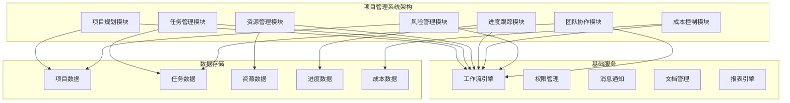

# 项目管理系统案例

## Odoo 17 项目管理系统开发

本文档详细介绍如何使用Odoo 17开发完整的项目管理系统，包括项目规划、任务管理、资源管理、进度跟踪、成本控制等核心功能。

### 项目概述

#### 项目背景
某软件公司需要定制项目管理系统，主要需求包括：
- 项目规划管理
- 任务分解与分配
- 资源管理与调度
- 进度跟踪与监控
- 成本预算与控制
- 风险管理
- 团队协作

#### 系统架构


### 核心模块设计

#### 1. 项目规划模块
```python
# models/project_planning.py
from odoo import models, fields, api
from odoo.exceptions import ValidationError, UserError
from datetime import datetime, date, timedelta

class ProjectProject(models.Model):
    _inherit = 'project.project'
    
    # 扩展项目信息
    project_code = fields.Char('项目编码', required=True, index=True)
    project_type = fields.Selection([
        ('software', '软件开发'),
        ('hardware', '硬件开发'),
        ('consulting', '咨询服务'),
        ('training', '培训项目'),
        ('research', '研发项目'),
        ('other', '其他')
    ], '项目类型', required=True)
    
    # 项目阶段
    project_phase = fields.Selection([
        ('initiation', '启动阶段'),
        ('planning', '规划阶段'),
        ('execution', '执行阶段'),
        ('monitoring', '监控阶段'),
        ('closing', '收尾阶段')
    ], '项目阶段', default='initiation')
    
    # 时间管理
    planned_start_date = fields.Date('计划开始日期', required=True)
    planned_end_date = fields.Date('计划结束日期', required=True)
    actual_start_date = fields.Date('实际开始日期')
    actual_end_date = fields.Date('实际结束日期')
    
    # 预算管理
    total_budget = fields.Float('总预算', digits=(16, 2))
    spent_budget = fields.Float('已花费预算', digits=(16, 2), compute='_compute_spent_budget')
    remaining_budget = fields.Float('剩余预算', digits=(16, 2), compute='_compute_remaining_budget')
    
    # 进度管理
    progress_percentage = fields.Float('完成进度', compute='_compute_progress_percentage')
    milestone_ids = fields.One2many('project.milestone', 'project_id', '里程碑')
    
    # 风险管理
    risk_ids = fields.One2many('project.risk', 'project_id', '风险')
    risk_level = fields.Selection([
        ('low', '低风险'),
        ('medium', '中风险'),
        ('high', '高风险'),
        ('critical', '极高风险')
    ], '风险等级', compute='_compute_risk_level')
    
    # 团队管理
    team_member_ids = fields.Many2many('res.users', 'project_team_rel', 'project_id', 'user_id', '团队成员')
    project_manager_id = fields.Many2one('res.users', '项目经理', required=True)
    
    @api.depends('task_ids.progress')
    def _compute_progress_percentage(self):
        for project in self:
            if project.task_ids:
                total_progress = sum(task.progress for task in project.task_ids)
                project.progress_percentage = total_progress / len(project.task_ids)
            else:
                project.progress_percentage = 0.0
    
    @api.depends('total_budget', 'spent_budget')
    def _compute_remaining_budget(self):
        for project in self:
            project.remaining_budget = project.total_budget - project.spent_budget
    
    @api.depends('risk_ids.risk_level')
    def _compute_risk_level(self):
        for project in self:
            if project.risk_ids:
                high_risks = project.risk_ids.filtered(lambda r: r.risk_level in ['high', 'critical'])
                if high_risks:
                    project.risk_level = 'high'
                else:
                    project.risk_level = 'medium'
            else:
                project.risk_level = 'low'
    
    def _compute_spent_budget(self):
        for project in self:
            # 计算已花费的预算
            timesheets = self.env['account.analytic.line'].search([
                ('project_id', '=', project.id)
            ])
            project.spent_budget = sum(timesheets.mapped('amount'))
    
    @api.model
    def create(self, vals):
        if not vals.get('project_code'):
            vals['project_code'] = self.env['ir.sequence'].next_by_code('project.project')
        return super().create(vals)
    
    def action_start_project(self):
        """启动项目"""
        for project in self:
            if project.project_phase != 'initiation':
                raise UserError("只能启动处于启动阶段的项目")
            
            project.write({
                'project_phase': 'planning',
                'actual_start_date': fields.Date.today()
            })
    
    def action_complete_project(self):
        """完成项目"""
        for project in self:
            if project.project_phase != 'monitoring':
                raise UserError("只能完成处于监控阶段的项目")
            
            # 检查所有任务是否完成
            incomplete_tasks = project.task_ids.filtered(lambda t: t.stage_id.name != 'Done')
            if incomplete_tasks:
                raise UserError("存在未完成的任务，无法完成项目")
            
            project.write({
                'project_phase': 'closing',
                'actual_end_date': fields.Date.today()
            })

class ProjectMilestone(models.Model):
    _name = 'project.milestone'
    _description = '项目里程碑'
    
    # 基本信息
    name = fields.Char('里程碑名称', required=True)
    project_id = fields.Many2one('project.project', '项目', required=True)
    description = fields.Text('描述')
    
    # 时间管理
    planned_date = fields.Date('计划日期', required=True)
    actual_date = fields.Date('实际日期')
    
    # 状态管理
    state = fields.Selection([
        ('planned', '计划中'),
        ('in_progress', '进行中'),
        ('completed', '已完成'),
        ('delayed', '延期')
    ], '状态', default='planned')
    
    # 关联任务
    task_ids = fields.Many2many('project.task', 'milestone_task_rel', 'milestone_id', 'task_id', '关联任务')
    
    @api.depends('planned_date', 'actual_date', 'state')
    def _compute_status(self):
        for milestone in self:
            if milestone.state == 'completed':
                if milestone.actual_date and milestone.actual_date > milestone.planned_date:
                    milestone.state = 'delayed'
                else:
                    milestone.state = 'completed'
            elif milestone.state == 'in_progress':
                if fields.Date.today() > milestone.planned_date:
                    milestone.state = 'delayed'
    
    def action_complete(self):
        """完成里程碑"""
        for milestone in self:
            if milestone.state not in ['planned', 'in_progress']:
                raise UserError("只能完成计划中或进行中的里程碑")
            
            milestone.write({
                'state': 'completed',
                'actual_date': fields.Date.today()
            })
```

#### 2. 任务管理模块
```python
# models/project_task.py
from odoo import models, fields, api
from odoo.exceptions import ValidationError, UserError

class ProjectTask(models.Model):
    _inherit = 'project.task'
    
    # 扩展任务信息
    task_code = fields.Char('任务编码', required=True, index=True)
    task_type = fields.Selection([
        ('development', '开发任务'),
        ('testing', '测试任务'),
        ('documentation', '文档任务'),
        ('review', '评审任务'),
        ('meeting', '会议任务'),
        ('other', '其他')
    ], '任务类型', required=True)
    
    # 优先级管理
    priority = fields.Selection([
        ('0', '低'),
        ('1', '中'),
        ('2', '高'),
        ('3', '紧急')
    ], '优先级', default='1')
    
    # 时间管理
    estimated_hours = fields.Float('预估工时', digits=(16, 2))
    actual_hours = fields.Float('实际工时', digits=(16, 2), compute='_compute_actual_hours')
    remaining_hours = fields.Float('剩余工时', digits=(16, 2), compute='_compute_remaining_hours')
    
    # 依赖关系
    dependency_ids = fields.Many2many('project.task', 'task_dependency_rel', 'task_id', 'dependency_id', '前置任务')
    dependent_ids = fields.Many2many('project.task', 'task_dependency_rel', 'dependency_id', 'task_id', '后续任务')
    
    # 资源分配
    assigned_user_ids = fields.Many2many('res.users', 'task_user_rel', 'task_id', 'user_id', '分配人员')
    required_skills = fields.Many2many('hr.skill', 'task_skill_rel', 'task_id', 'skill_id', '所需技能')
    
    # 成本管理
    estimated_cost = fields.Float('预估成本', digits=(16, 2))
    actual_cost = fields.Float('实际成本', digits=(16, 2), compute='_compute_actual_cost')
    
    # 质量控制
    quality_check_ids = fields.One2many('project.quality.check', 'task_id', '质量检查')
    quality_score = fields.Float('质量评分', digits=(5, 2))
    
    @api.depends('timesheet_ids.unit_amount')
    def _compute_actual_hours(self):
        for task in self:
            task.actual_hours = sum(task.timesheet_ids.mapped('unit_amount'))
    
    @api.depends('estimated_hours', 'actual_hours')
    def _compute_remaining_hours(self):
        for task in self:
            task.remaining_hours = task.estimated_hours - task.actual_hours
    
    @api.depends('timesheet_ids.amount')
    def _compute_actual_cost(self):
        for task in self:
            task.actual_cost = sum(task.timesheet_ids.mapped('amount'))
    
    @api.model
    def create(self, vals):
        if not vals.get('task_code'):
            vals['task_code'] = self.env['ir.sequence'].next_by_code('project.task')
        return super().create(vals)
    
    def action_start_task(self):
        """开始任务"""
        for task in self:
            if task.stage_id.name == 'Done':
                raise UserError("已完成的任务不能重新开始")
            
            # 检查前置任务是否完成
            incomplete_dependencies = task.dependency_ids.filtered(
                lambda t: t.stage_id.name != 'Done'
            )
            if incomplete_dependencies:
                raise UserError(f"前置任务 {', '.join(incomplete_dependencies.mapped('name'))} 未完成")
            
            # 更新状态
            task.write({'date_start': fields.Datetime.now()})
    
    def action_complete_task(self):
        """完成任务"""
        for task in self:
            if task.stage_id.name == 'Done':
                raise UserError("任务已经完成")
            
            # 检查质量要求
            if task.quality_check_ids:
                failed_checks = task.quality_check_ids.filtered(
                    lambda q: q.state == 'failed'
                )
                if failed_checks:
                    raise UserError("存在未通过的质量检查，无法完成任务")
            
            # 更新状态
            task.write({
                'date_end': fields.Datetime.now(),
                'stage_id': self.env.ref('project.project_stage_4').id
            })

class ProjectQualityCheck(models.Model):
    _name = 'project.quality.check'
    _description = '项目质量检查'
    
    # 基本信息
    name = fields.Char('检查名称', required=True)
    task_id = fields.Many2one('project.task', '任务', required=True)
    check_type = fields.Selection([
        ('code_review', '代码评审'),
        ('unit_test', '单元测试'),
        ('integration_test', '集成测试'),
        ('performance_test', '性能测试'),
        ('security_test', '安全测试'),
        ('user_acceptance', '用户验收')
    ], '检查类型', required=True)
    
    # 检查信息
    checker_id = fields.Many2one('res.users', '检查人', required=True)
    check_date = fields.Datetime('检查日期', default=fields.Datetime.now)
    check_result = fields.Text('检查结果')
    
    # 状态管理
    state = fields.Selection([
        ('pending', '待检查'),
        ('passed', '通过'),
        ('failed', '未通过'),
        ('retest', '重新测试')
    ], '状态', default='pending')
    
    # 评分
    score = fields.Float('评分', digits=(5, 2))
    max_score = fields.Float('满分', digits=(5, 2), default=100.0)
    
    def action_pass(self):
        """通过检查"""
        for check in self:
            if check.state != 'pending':
                raise UserError("只能对待检查的项目进行通过操作")
            
            check.write({'state': 'passed'})
    
    def action_fail(self):
        """未通过检查"""
        for check in self:
            if check.state != 'pending':
                raise UserError("只能对待检查的项目进行未通过操作")
            
            check.write({'state': 'failed'})
```

#### 3. 资源管理模块
```python
# models/project_resource.py
from odoo import models, fields, api
from odoo.exceptions import ValidationError, UserError

class ProjectResource(models.Model):
    _name = 'project.resource'
    _description = '项目资源'
    
    # 基本信息
    name = fields.Char('资源名称', required=True)
    resource_type = fields.Selection([
        ('human', '人力资源'),
        ('equipment', '设备资源'),
        ('material', '物料资源'),
        ('software', '软件资源'),
        ('facility', '设施资源')
    ], '资源类型', required=True)
    
    # 资源属性
    capacity = fields.Float('容量/数量', digits=(16, 2))
    unit = fields.Char('单位')
    cost_per_unit = fields.Float('单位成本', digits=(16, 2))
    
    # 可用性
    available_from = fields.Date('可用开始日期')
    available_to = fields.Date('可用结束日期')
    is_available = fields.Boolean('是否可用', default=True)
    
    # 关联信息
    project_id = fields.Many2one('project.project', '项目')
    task_id = fields.Many2one('project.task', '任务')
    
    # 使用记录
    usage_ids = fields.One2many('project.resource.usage', 'resource_id', '使用记录')
    
    def action_allocate(self):
        """分配资源"""
        for resource in self:
            if not resource.is_available:
                raise UserError("资源不可用，无法分配")
            
            # 创建使用记录
            self.env['project.resource.usage'].create({
                'resource_id': resource.id,
                'project_id': resource.project_id.id,
                'task_id': resource.task_id.id,
                'start_date': fields.Date.today(),
                'status': 'allocated'
            })

class ProjectResourceUsage(models.Model):
    _name = 'project.resource.usage'
    _description = '资源使用记录'
    
    # 基本信息
    resource_id = fields.Many2one('project.resource', '资源', required=True)
    project_id = fields.Many2one('project.project', '项目', required=True)
    task_id = fields.Many2one('project.task', '任务')
    
    # 使用信息
    start_date = fields.Date('开始日期', required=True)
    end_date = fields.Date('结束日期')
    quantity_used = fields.Float('使用数量', digits=(16, 2), required=True)
    
    # 状态管理
    status = fields.Selection([
        ('allocated', '已分配'),
        ('in_use', '使用中'),
        ('completed', '已完成'),
        ('cancelled', '已取消')
    ], '状态', default='allocated')
    
    # 成本计算
    total_cost = fields.Float('总成本', digits=(16, 2), compute='_compute_total_cost')
    
    @api.depends('quantity_used', 'resource_id.cost_per_unit')
    def _compute_total_cost(self):
        for usage in self:
            usage.total_cost = usage.quantity_used * usage.resource_id.cost_per_unit
    
    def action_start_usage(self):
        """开始使用"""
        for usage in self:
            if usage.status != 'allocated':
                raise UserError("只能开始已分配的资源")
            
            usage.write({'status': 'in_use'})
    
    def action_complete_usage(self):
        """完成使用"""
        for usage in self:
            if usage.status != 'in_use':
                raise UserError("只能完成使用中的资源")
            
            usage.write({
                'status': 'completed',
                'end_date': fields.Date.today()
            })

class ProjectTeam(models.Model):
    _name = 'project.team'
    _description = '项目团队'
    
    # 基本信息
    name = fields.Char('团队名称', required=True)
    project_id = fields.Many2one('project.project', '项目', required=True)
    team_lead_id = fields.Many2one('res.users', '团队负责人', required=True)
    
    # 团队成员
    member_ids = fields.Many2many('res.users', 'team_member_rel', 'team_id', 'user_id', '团队成员')
    
    # 团队信息
    team_size = fields.Integer('团队规模', compute='_compute_team_size')
    team_skills = fields.Many2many('hr.skill', 'team_skill_rel', 'team_id', 'skill_id', '团队技能')
    
    # 绩效指标
    productivity_score = fields.Float('生产力评分', digits=(5, 2))
    quality_score = fields.Float('质量评分', digits=(5, 2))
    collaboration_score = fields.Float('协作评分', digits=(5, 2))
    
    @api.depends('member_ids')
    def _compute_team_size(self):
        for team in self:
            team.team_size = len(team.member_ids)
    
    def action_add_member(self):
        """添加团队成员"""
        for team in self:
            # 这里可以添加选择用户的逻辑
            pass
    
    def action_remove_member(self):
        """移除团队成员"""
        for team in self:
            # 这里可以添加移除用户的逻辑
            pass
```

#### 4. 进度跟踪模块
```python
# models/project_progress.py
from odoo import models, fields, api
from odoo.exceptions import ValidationError, UserError

class ProjectProgress(models.Model):
    _name = 'project.progress'
    _description = '项目进度跟踪'
    
    # 基本信息
    name = fields.Char('进度报告名称', required=True)
    project_id = fields.Many2one('project.project', '项目', required=True)
    report_date = fields.Date('报告日期', required=True, default=fields.Date.today)
    
    # 进度信息
    overall_progress = fields.Float('总体进度', digits=(5, 2))
    planned_progress = fields.Float('计划进度', digits=(5, 2))
    progress_variance = fields.Float('进度偏差', digits=(5, 2), compute='_compute_progress_variance')
    
    # 任务进度
    total_tasks = fields.Integer('总任务数', compute='_compute_task_stats')
    completed_tasks = fields.Integer('已完成任务数', compute='_compute_task_stats')
    in_progress_tasks = fields.Integer('进行中任务数', compute='_compute_task_stats')
    delayed_tasks = fields.Integer('延期任务数', compute='_compute_task_stats')
    
    # 成本进度
    planned_cost = fields.Float('计划成本', digits=(16, 2))
    actual_cost = fields.Float('实际成本', digits=(16, 2))
    cost_variance = fields.Float('成本偏差', digits=(16, 2), compute='_compute_cost_variance')
    
    # 风险状态
    new_risks = fields.Integer('新增风险数')
    resolved_risks = fields.Integer('已解决风险数')
    active_risks = fields.Integer('活跃风险数')
    
    # 报告内容
    achievements = fields.Text('主要成就')
    challenges = fields.Text('主要挑战')
    next_steps = fields.Text('下一步计划')
    recommendations = fields.Text('建议')
    
    @api.depends('overall_progress', 'planned_progress')
    def _compute_progress_variance(self):
        for progress in self:
            progress.progress_variance = progress.overall_progress - progress.planned_progress
    
    @api.depends('project_id.task_ids')
    def _compute_task_stats(self):
        for progress in self:
            tasks = progress.project_id.task_ids
            progress.total_tasks = len(tasks)
            progress.completed_tasks = len(tasks.filtered(lambda t: t.stage_id.name == 'Done'))
            progress.in_progress_tasks = len(tasks.filtered(lambda t: t.stage_id.name == 'In Progress'))
            progress.delayed_tasks = len(tasks.filtered(lambda t: t.date_deadline and t.date_deadline < fields.Date.today() and t.stage_id.name != 'Done'))
    
    @api.depends('planned_cost', 'actual_cost')
    def _compute_cost_variance(self):
        for progress in self:
            progress.cost_variance = progress.actual_cost - progress.planned_cost
    
    @api.model
    def create(self, vals):
        if not vals.get('name'):
            vals['name'] = f"进度报告-{vals.get('report_date', fields.Date.today())}"
        return super().create(vals)

class ProjectDashboard(models.Model):
    _name = 'project.dashboard'
    _description = '项目仪表板'
    
    # 基本信息
    name = fields.Char('仪表板名称', required=True)
    project_id = fields.Many2one('project.project', '项目', required=True)
    
    # 关键指标
    total_budget = fields.Float('总预算', related='project_id.total_budget')
    spent_budget = fields.Float('已花费', related='project_id.spent_budget')
    remaining_budget = fields.Float('剩余预算', related='project_id.remaining_budget')
    
    # 进度指标
    overall_progress = fields.Float('总体进度', related='project_id.progress_percentage')
    completed_tasks = fields.Integer('已完成任务', compute='_compute_task_stats')
    total_tasks = fields.Integer('总任务数', compute='_compute_task_stats')
    
    # 团队指标
    team_size = fields.Integer('团队规模', compute='_compute_team_stats')
    active_members = fields.Integer('活跃成员', compute='_compute_team_stats')
    
    # 风险指标
    high_risks = fields.Integer('高风险数', compute='_compute_risk_stats')
    medium_risks = fields.Integer('中风险数', compute='_compute_risk_stats')
    low_risks = fields.Integer('低风险数', compute='_compute_risk_stats')
    
    @api.depends('project_id.task_ids')
    def _compute_task_stats(self):
        for dashboard in self:
            tasks = dashboard.project_id.task_ids
            dashboard.total_tasks = len(tasks)
            dashboard.completed_tasks = len(tasks.filtered(lambda t: t.stage_id.name == 'Done'))
    
    @api.depends('project_id.team_member_ids')
    def _compute_team_stats(self):
        for dashboard in self:
            dashboard.team_size = len(dashboard.project_id.team_member_ids)
            # 这里可以添加活跃成员的计算逻辑
            dashboard.active_members = dashboard.team_size
    
    @api.depends('project_id.risk_ids')
    def _compute_risk_stats(self):
        for dashboard in self:
            risks = dashboard.project_id.risk_ids
            dashboard.high_risks = len(risks.filtered(lambda r: r.risk_level in ['high', 'critical']))
            dashboard.medium_risks = len(risks.filtered(lambda r: r.risk_level == 'medium'))
            dashboard.low_risks = len(risks.filtered(lambda r: r.risk_level == 'low'))
```

### 视图设计

#### 1. 项目规划视图
```xml
<!-- views/project_planning_views.xml -->
<odoo>
    <!-- 项目表单视图 -->
    <record id="view_project_project_form" model="ir.ui.view">
        <field name="name">project.project.form</field>
        <field name="model">project.project</field>
        <field name="arch" type="xml">
            <form>
                <header>
                    <button name="action_start_project" type="object" 
                            string="启动项目" class="btn-primary"
                            attrs="{'invisible': [('project_phase', '!=', 'initiation')]}"/>
                    <button name="action_complete_project" type="object" 
                            string="完成项目" class="btn-primary"
                            attrs="{'invisible': [('project_phase', '!=', 'monitoring')]}"/>
                    <field name="project_phase" widget="statusbar" 
                           statusbar_visible="initiation,planning,execution,monitoring,closing"/>
                </header>
                <sheet>
                    <div class="oe_title">
                        <h1>
                            <field name="name" readonly="1"/>
                        </h1>
                    </div>
                    <group>
                        <group>
                            <field name="project_code"/>
                            <field name="project_type"/>
                            <field name="project_manager_id"/>
                            <field name="total_budget"/>
                            <field name="spent_budget"/>
                            <field name="remaining_budget"/>
                        </group>
                        <group>
                            <field name="planned_start_date"/>
                            <field name="planned_end_date"/>
                            <field name="actual_start_date"/>
                            <field name="actual_end_date"/>
                            <field name="progress_percentage" widget="progressbar"/>
                            <field name="risk_level"/>
                        </group>
                    </group>
                    <notebook>
                        <page string="团队管理">
                            <field name="team_member_ids" widget="many2many_tags"/>
                        </page>
                        <page string="里程碑">
                            <field name="milestone_ids">
                                <tree>
                                    <field name="name"/>
                                    <field name="planned_date"/>
                                    <field name="actual_date"/>
                                    <field name="state"/>
                                </tree>
                            </field>
                        </page>
                        <page string="风险管理">
                            <field name="risk_ids">
                                <tree>
                                    <field name="name"/>
                                    <field name="risk_level"/>
                                    <field name="probability"/>
                                    <field name="impact"/>
                                    <field name="status"/>
                                </tree>
                            </field>
                        </page>
                        <page string="任务">
                            <field name="task_ids">
                                <tree>
                                    <field name="task_code"/>
                                    <field name="name"/>
                                    <field name="assigned_user_ids" widget="many2many_tags"/>
                                    <field name="stage_id"/>
                                    <field name="progress" widget="progressbar"/>
                                </tree>
                            </field>
                        </page>
                    </notebook>
                </sheet>
            </form>
        </field>
    </record>
    
    <!-- 项目列表视图 -->
    <record id="view_project_project_tree" model="ir.ui.view">
        <field name="name">project.project.tree</field>
        <field name="model">project.project</field>
        <field name="arch" type="xml">
            <tree>
                <field name="project_code"/>
                <field name="name"/>
                <field name="project_type"/>
                <field name="project_manager_id"/>
                <field name="project_phase"/>
                <field name="progress_percentage" widget="progressbar"/>
                <field name="total_budget"/>
                <field name="spent_budget"/>
            </tree>
        </field>
    </record>
</odoo>
```

#### 2. 任务管理视图
```xml
<!-- views/project_task_views.xml -->
<odoo>
    <!-- 任务表单视图 -->
    <record id="view_project_task_form" model="ir.ui.view">
        <field name="name">project.task.form</field>
        <field name="model">project.task</field>
        <field name="arch" type="xml">
            <form>
                <header>
                    <button name="action_start_task" type="object" 
                            string="开始任务" class="btn-primary"
                            attrs="{'invisible': [('stage_id.name', '=', 'Done')]}"/>
                    <button name="action_complete_task" type="object" 
                            string="完成任务" class="btn-primary"
                            attrs="{'invisible': [('stage_id.name', '=', 'Done')]}"/>
                    <field name="stage_id" widget="statusbar" 
                           statusbar_visible="New,In Progress,Testing,Done"/>
                </header>
                <sheet>
                    <div class="oe_title">
                        <h1>
                            <field name="name" readonly="1"/>
                        </h1>
                    </div>
                    <group>
                        <group>
                            <field name="task_code"/>
                            <field name="task_type"/>
                            <field name="priority"/>
                            <field name="project_id"/>
                            <field name="assigned_user_ids" widget="many2many_tags"/>
                        </group>
                        <group>
                            <field name="estimated_hours"/>
                            <field name="actual_hours"/>
                            <field name="remaining_hours"/>
                            <field name="estimated_cost"/>
                            <field name="actual_cost"/>
                            <field name="date_deadline"/>
                        </group>
                    </group>
                    <notebook>
                        <page string="依赖关系">
                            <field name="dependency_ids" widget="many2many_tags"/>
                            <field name="dependent_ids" widget="many2many_tags"/>
                        </page>
                        <page string="所需技能">
                            <field name="required_skills" widget="many2many_tags"/>
                        </page>
                        <page string="质量检查">
                            <field name="quality_check_ids">
                                <tree>
                                    <field name="name"/>
                                    <field name="check_type"/>
                                    <field name="checker_id"/>
                                    <field name="check_date"/>
                                    <field name="state"/>
                                    <field name="score"/>
                                </tree>
                            </field>
                        </page>
                        <page string="工时记录">
                            <field name="timesheet_ids">
                                <tree>
                                    <field name="user_id"/>
                                    <field name="date"/>
                                    <field name="unit_amount"/>
                                    <field name="amount"/>
                                    <field name="description"/>
                                </tree>
                            </field>
                        </page>
                    </notebook>
                </sheet>
            </form>
        </field>
    </record>
    
    <!-- 任务列表视图 -->
    <record id="view_project_task_tree" model="ir.ui.view">
        <field name="name">project.task.tree</field>
        <field name="model">project.task</field>
        <field name="arch" type="xml">
            <tree>
                <field name="task_code"/>
                <field name="name"/>
                <field name="project_id"/>
                <field name="assigned_user_ids" widget="many2many_tags"/>
                <field name="stage_id"/>
                <field name="priority"/>
                <field name="progress" widget="progressbar"/>
                <field name="date_deadline"/>
            </tree>
        </field>
    </record>
</odoo>
```

### 报表设计

#### 1. 项目报表
```xml
<!-- reports/project_reports.xml -->
<odoo>
    <!-- 项目进度报表 -->
    <record id="action_project_progress_report" model="ir.actions.report">
        <field name="name">项目进度报表</field>
        <field name="model">project.project</field>
        <field name="report_type">qweb-pdf</field>
        <field name="report_name">project_custom.progress_report</field>
        <field name="report_file">project_custom.progress_report</field>
        <field name="binding_model_id" ref="model_project_project"/>
        <field name="binding_type">report</field>
    </record>
    
    <!-- 项目成本报表 -->
    <record id="action_project_cost_report" model="ir.actions.report">
        <field name="name">项目成本报表</field>
        <field name="model">project.project</field>
        <field name="report_type">qweb-pdf</field>
        <field name="report_name">project_custom.cost_report</field>
        <field name="report_file">project_custom.cost_report</field>
        <field name="binding_model_id" ref="model_project_project"/>
        <field name="binding_type">report</field>
    </record>
</odoo>
```

#### 2. 报表模板
```xml
<!-- reports/progress_report.xml -->
<odoo>
    <template id="progress_report">
        <t t-call="web.html_container">
            <t t-foreach="docs" t-as="doc">
                <t t-call="web.external_layout">
                    <div class="page">
                        <div class="oe_structure"/>
                        
                        <div class="row">
                            <div class="col-12">
                                <h2>项目进度报表</h2>
                            </div>
                        </div>
                        
                        <div class="row">
                            <div class="col-6">
                                <strong>项目名称:</strong> <span t-field="doc.name"/>
                            </div>
                            <div class="col-6">
                                <strong>项目编码:</strong> <span t-field="doc.project_code"/>
                            </div>
                        </div>
                        
                        <div class="row">
                            <div class="col-6">
                                <strong>项目经理:</strong> <span t-field="doc.project_manager_id.name"/>
                            </div>
                            <div class="col-6">
                                <strong>项目阶段:</strong> <span t-field="doc.project_phase"/>
                            </div>
                        </div>
                        
                        <div class="row">
                            <div class="col-12">
                                <h3>进度概览</h3>
                                <table class="table table-bordered">
                                    <thead>
                                        <tr>
                                            <th>指标</th>
                                            <th>计划值</th>
                                            <th>实际值</th>
                                            <th>偏差</th>
                                        </tr>
                                    </thead>
                                    <tbody>
                                        <tr>
                                            <td>完成进度</td>
                                            <td>100%</td>
                                            <td><span t-field="doc.progress_percentage"/>%</td>
                                            <td><span t-esc="doc.progress_percentage - 100"/>%</td>
                                        </tr>
                                        <tr>
                                            <td>预算使用</td>
                                            <td><span t-field="doc.total_budget"/></td>
                                            <td><span t-field="doc.spent_budget"/></td>
                                            <td><span t-field="doc.remaining_budget"/></td>
                                        </tr>
                                    </tbody>
                                </table>
                            </div>
                        </div>
                        
                        <div class="row">
                            <div class="col-12">
                                <h3>任务统计</h3>
                                <table class="table table-bordered">
                                    <thead>
                                        <tr>
                                            <th>任务状态</th>
                                            <th>数量</th>
                                            <th>百分比</th>
                                        </tr>
                                    </thead>
                                    <tbody>
                                        <tr>
                                            <td>已完成</td>
                                            <td><span t-esc="len(doc.task_ids.filtered(lambda t: t.stage_id.name == 'Done'))"/></td>
                                            <td><span t-esc="len(doc.task_ids.filtered(lambda t: t.stage_id.name == 'Done')) / len(doc.task_ids) * 100 if doc.task_ids else 0"/>%</td>
                                        </tr>
                                        <tr>
                                            <td>进行中</td>
                                            <td><span t-esc="len(doc.task_ids.filtered(lambda t: t.stage_id.name == 'In Progress'))"/></td>
                                            <td><span t-esc="len(doc.task_ids.filtered(lambda t: t.stage_id.name == 'In Progress')) / len(doc.task_ids) * 100 if doc.task_ids else 0"/>%</td>
                                        </tr>
                                        <tr>
                                            <td>未开始</td>
                                            <td><span t-esc="len(doc.task_ids.filtered(lambda t: t.stage_id.name == 'New'))"/></td>
                                            <td><span t-esc="len(doc.task_ids.filtered(lambda t: t.stage_id.name == 'New')) / len(doc.task_ids) * 100 if doc.task_ids else 0"/>%</td>
                                        </tr>
                                    </tbody>
                                </table>
                            </div>
                        </div>
                        
                        <div class="oe_structure"/>
                    </div>
                </t>
            </t>
        </t>
    </template>
</odoo>
```

### 部署实施

#### 1. 模块配置
```python
# __manifest__.py
{
    'name': 'Project Custom Module',
    'version': '17.0.1.0.0',
    'category': 'Project Management',
    'summary': '定制项目管理系统',
    'description': '''
        定制项目管理系统包含：
        - 项目规划管理
        - 任务分解与分配
        - 资源管理与调度
        - 进度跟踪与监控
        - 成本预算与控制
        - 风险管理
        - 团队协作
    ''',
    'author': 'Your Company',
    'website': 'https://www.yourcompany.com',
    'depends': [
        'base',
        'project',
        'hr',
        'account',
        'mail'
    ],
    'data': [
        'security/ir.model.access.csv',
        'security/security.xml',
        'data/sequence_data.xml',
        'views/project_planning_views.xml',
        'views/project_task_views.xml',
        'views/project_resource_views.xml',
        'views/project_progress_views.xml',
        'views/menu.xml',
        'reports/project_reports.xml',
        'reports/progress_report.xml',
    ],
    'demo': [
        'demo/demo_data.xml',
    ],
    'installable': True,
    'auto_install': False,
    'application': True,
    'license': 'LGPL-3',
}
```

#### 2. 权限配置
```csv
# security/ir.model.access.csv
id,name,model_id:id,group_id:id,perm_read,perm_write,perm_create,perm_unlink
access_project_project_user,access_project_project_user,model_project_project,base.group_user,1,1,1,0
access_project_task_user,access_project_task_user,model_project_task,base.group_user,1,1,1,0
access_project_resource_user,access_project_resource_user,model_project_resource,base.group_user,1,1,1,0
access_project_progress_user,access_project_progress_user,model_project_progress,base.group_user,1,1,1,0
access_project_quality_check_user,access_project_quality_check_user,model_project_quality_check,base.group_user,1,1,1,0
```

#### 3. 菜单配置
```xml
<!-- views/menu.xml -->
<odoo>
    <!-- 主菜单 -->
    <menuitem id="menu_project_custom"
              name="项目管理"
              sequence="10"/>
    
    <!-- 项目规划 -->
    <menuitem id="menu_project_planning"
              name="项目规划"
              parent="menu_project_custom"
              sequence="10"/>
    
    <menuitem id="menu_project_project"
              name="项目列表"
              parent="menu_project_planning"
              action="action_project_project"
              sequence="10"/>
    
    <!-- 任务管理 -->
    <menuitem id="menu_task_management"
              name="任务管理"
              parent="menu_project_custom"
              sequence="20"/>
    
    <menuitem id="menu_project_task"
              name="任务列表"
              parent="menu_task_management"
              action="action_project_task"
              sequence="10"/>
    
    <!-- 资源管理 -->
    <menuitem id="menu_resource_management"
              name="资源管理"
              parent="menu_project_custom"
              sequence="30"/>
    
    <menuitem id="menu_project_resource"
              name="资源列表"
              parent="menu_resource_management"
              action="action_project_resource"
              sequence="10"/>
    
    <!-- 进度跟踪 -->
    <menuitem id="menu_progress_tracking"
              name="进度跟踪"
              parent="menu_project_custom"
              sequence="40"/>
    
    <menuitem id="menu_project_progress"
              name="进度报告"
              parent="menu_progress_tracking"
              action="action_project_progress"
              sequence="10"/>
    
    <!-- 报表 -->
    <menuitem id="menu_project_reports"
              name="项目报表"
              parent="menu_project_custom"
              sequence="50"/>
    
    <menuitem id="menu_progress_report"
              name="进度报表"
              parent="menu_project_reports"
              action="action_project_progress_report"
              sequence="10"/>
    
    <menuitem id="menu_cost_report"
              name="成本报表"
              parent="menu_project_reports"
              action="action_project_cost_report"
              sequence="20"/>
</odoo>
```

## 相关链接
- [[ERP模块定制案例]] - ERP系统开发
- [[人力资源系统案例]] - 人力资源系统
- [[财务系统案例]] - 财务系统
- [[电商平台集成案例]] - 电商平台开发
