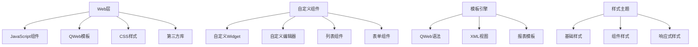
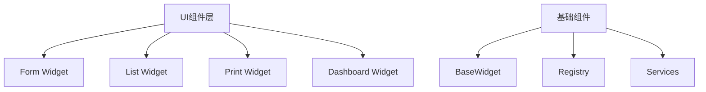

# UI组件开发

## 🎯 概述

UI组件开发聚焦于前端界面开发，包括自定义Widget实现、QWeb模板编写、JavaScript交互和响应式设计等关键技术的设计和应用。

## 📊 UI组件架构

### 前端架构图


### JavaScript组件结构


## 🧩 自定义Widget开发

### 核心Widget类
```python
# static/src/js/components/custom_widget.js
odoo.define('custom_components.custom_widget', function(require){
    "use strict";
    
    var AbstractField = require('web.AbstractField');
    var core = require('web.core');
    var Dialog = require('web.Dialog');
    var rpc = require('web.rpc');
    
    var _t = core._t;
    
    var CustomWidget = AbstractField.extend({
        className: 'o_field_custom_widget',
        
        init: function (parent, name, record, options) {
            this._super.apply(this, arguments);
            this.nodeOptions = _.omit(options || {}, 'data', 'dataPointID', 'record', 'resModel');
            
            // 初始化数据
            this.data = {};
            this.options = {
                mode: 'edit',
                readonly: false,
                ...this.nodeOptions
            };
        },
        
        /**
         * 渲染组件
         */
        _render: function () {
            var self = this;
            
            // 清空现有内容
            this.$el.empty();
            
            // 检查是否为只读模式
            if (this.nodeOptions.readonly) {
                this._renderReadonly();
                return;
            }
            
            // 渲染可编辑组件
            this._renderEdit();
            
            // 绑定事件
            this._bindEvents();
        },
        
        /**
         * 渲染只读视图
         */
        _renderReadonly: function () {
            var value = this.value;
            var self = this;
            
            this.$el.html(
                $('<div class="custom_widget_readonly">')
                    .text(value || _t('无数据'))
            );
        },
        
        /**
         * 渲染编辑视图
         */
        _renderEdit: function () {
            var self = this;
            var value = this.value;
            
            this.$el.html(
                $('<div class="custom_widget_edit">')
                    .append(
                        // 输入框
                        $('<input>', {
                            type: 'text',
                            class: 'form-control',
                            value: value || '',
                            placeholder: _t('请输入内容...')
                        }).attr({
                            'data-field-name': self.name
                        })
                    )
                    .append(
                        // 按钮区域
                        $('<div class="btn-group">')
                            .append(
                                $('<button>', {
                                    type: 'button',
                                    class: 'btn btn-secondary btn-sm',
                                    text: _t('选择')
                                })
                            )
                            .append(
                                $('<button>', {
                                    type: 'button',
                                    class: 'btn btn-secondary btn-sm',
                                    text: _t('清除')
                                })
                            )
                    )
            );
        },
        
        /**
         * 绑定事件处理器
         */
        _bindEvents: function () {
            var self = this;
            
            if (this.options.readonly) {
                return;
            }
            
            // 输入框变化事件
            this.$el.find('input').on('change', function (e) {
                var newValue = $(this).val();
                self._onValueChange(newValue);
            });
            
            // 选择按钮点击事件
            this.$el.find('.btn-group').on('click', '.btn:nth-child(1)', function (e) {
                self._onSelectClick(e);
            });
            
            // 清除按钮点击事件
            this.$el.find('.btn-group').on('click', '.btn:nth-child(2)', function (e) {
                self._onClearClick(e);
            });
            
            // 输入框聚焦事件
            this.$el.find('input').on('focus', function (e) {
                self._onFocus(e);
            });
            
            // 输入框失焦事件
            this.$el.find('input').on('blur', function (e) {
                self._onBlur(e);
            });
        },
        
        /**
         * 处理值变化
         */
        _onValueChange: function (newValue) {
            var self = this;
            
            // 验证值
            var validationResult = self._validateValue(newValue);
            
            if (!validationResult.isValid) {
                self._showError(validationResult.errorMessage);
                return;
            }
            
            // 更新值
            this.setValue(newValue, {silent: false});
            
            // 触发自定义事件
            this.trigger('value_changed', {
                newValue: newValue,
                field: self.name
            });
            
            self._hideError();
        },
        
        /**
         * 处理选择按钮点击
         */
        _onSelectClick: function (e) {
            var self = this;
            
            // 打开选择对话框
            self._openDialog({
                title: _t('请选择值'),
                buttons: [
                    {
                        text: _t('确定'),
                        click: function () {
                            var selectedValue = self._getDialogValue();
                            if (selectedValue) {
                                self.setValue(selectedValue);
                            }
                        }
                    },
                    {
                        text: _t('取消'),
                        click: function () { /* 关闭对话框 */ }
                    }
                ]
            });
        },
        
        /**
         * 处理清除按钮点击
         */
        _onClearClick: function (e) {
            var self = this;
            
            if (confirm(_t('确认要清除当前值？'))) {
                self.reset();
                self.setValue('');
            }
        },
        
        /**
         * 处理输入框聚焦
         */
        _onFocus: function (e) {
            var self = this;
            
            // 高亮显示组件
            self.$el.addClass('focused');
            
            // 触发自定义事件
            this.trigger('focus_changed', {
                field: this.name,
                focused: true
            });
        },
        
        /**
         * 处理输入框失焦
         */
        _onBlur: function (e) {
            var self = this;
            
            // 取消高亮显示
            this.$el.removeClass('focused');
            
            // 触发自定义事件
            this.trigger('focus_changed', {
                field: this.name,
                focused: false
            });
            
            // 字段失焦时自动保存
            if (this.previousValue !== this.value) {
                this._commitChanges();
            }
        },
        
        /**
         * 打开选择对话框
         */
        _openDialog: function (dialogConfig) {
            var self = this;
            var defaultConfig = {
                title: _t('选择'),
                size: 'medium',
                technical: false
            };
            
            var config = Object.assign({}, defaultConfig, dialogConfig);
            
            dialog = new Dialog(self, config);
            dialog.open();
            
            // 渲染对话框内容
            this._renderDialogContent(dialog);
            
            return dialog;
        },
        
        /**
         * 渲染对话框内容
         */
        _renderDialogContent: function (dialog) {
            // 基于具体需求实现...
        },
        
        /**
         * 验证值
         */
        _validateValue: function (value) {
            var self = this;
            
            // 基础验证
            if (!value && this.attrs && this.attrs.required) {
                return {
                    isValid: false,
                    errorMessage: _t('此字段为必填项')
                };
            }
            
            // 自定义验证逻辑
            if (typeof self._customValidation === 'function') {
                return self._customValidation(value);
            }
            
            return { isValid: true };
        },
        
        /**
         * 显示错误信息
         */
        _showError: function (message) {
            var self = this;
            
            var errorElement = this.$el.find('.error_message');
            if (errorElement.length === 0) {
                errorElement = $('<div class="error_message alert alert-danger">');
                this.$el.append(errorElement);
            }
            
            errorElement.text(message).show();
            
            // 标记组件为有错误状态
            this.$el.addClass('error');
        },
        
        /**
         * 隐藏错误信息
         */
        _hideError: function (message) {
            var self = this;
            
            this.$el.find('.error_message').hide();
            this.$el.removeClass('error');
        },
        
        /**
         * 提交更改
         */
        _commitChanges: function () {
            var self = this;
            
            if (this.isDestroyed()) {
                return;
            }
            
            // 验证值
            var validationResult = self._validateValue(this.value);
            
            if (!validationResult.isValid) {
                return;
            }
            
            // 触发记录更新事件
            this.trigger('changed');
            
            // 保存数据到服务器
            if (this.viewType !== 'readonly') {
                self._commitValue(this.value);
            }
        },
        
        /**
         * 重置组件状态
         */
        reset: function () {
            var self = this;
            
            self.setValue('');
            self._hideError();
            self.$el.removeClass('focused');
        },
        
        /**
         * 设置值
         */
        setValue: function (value, options) {
            options = options || {};
            
            if (!options.symbol) {
                this.previousValue = this.value;
            }
            
            this.value = value;
            
            if (!options.silent) {
                this._render();
            }
            
            return this.value;
        },
        
        /**
         * 销毁组件
         */
        destroy: function () {
            var self = this;
            
            // 清理事件绑定
            this.$el.off();
            
            // 清理对话框
            if (this.dialog) {
                this.dialog.destroy();
            }
            
            this._super.apply(this, arguments);
        }
    });
    
    // 注册组件
    core.field_registry.add('custom_widget', CustomWidget);
    
    return CustomWidget;
});
```

### 自定义编辑器组件
```python
# static/src/js/components/custom_editor.js
odoo.define('custom_components.custom_editor', function(require){
    "use strict";
    
    var AbstractField = require('web.AbstractField');
    var Dialog = require('web.Dialog');
    
    /**
     * 自定义编辑器组件
     */
    var CustomEditorWidget = AbstractField.extend({
        className: 'o_field_custom_editor_widget',
        
        init: function (parent, name, record, options) {
            this._super.apply(this, arguments);
            
            // 编辑器配置
            this.editorConfig = this.nodeOptions.editor_config || {
                theme: 'monokai',
                mode: 'html',
                fontSize: '12px',
                showLineNumbers: true,
                wrapMode: true,
                autoComplete: true,
                indentSize: 2
            };
            
            this.editorInstance = null;
        },
        
        /**
         * 渲染组件
         */
        _render: function () {
            var self = this;
            
            this.$el.empty();
            
            if (this.nodeOptions.readonly) {
                this._renderReadonly();
                return;
            }
            
            this._renderEditor();
            this._initEditor();
        },
        
        /**
         * 渲染编辑器
         */
        _renderEditor: function () {
            this.$el.html(
                $('<div class="custom_editor_container">')
                    .append(
                        $('<div class="editor_toolbar">')
                            .append(
                                $('<button type="button" class="btn btn-sm btn-secondary editor-toolbar-btn">').text('格式')
                            )
                            .append(
                                $('<button type="button" class="btn btn-sm btn-secondary editor-toolbar-btn">').text('插入')
                            )
                            .append(
                                $('<button type="button" class="btn btn-sm btn-secondary editor-toolbar-btn">').text('预览')
                            )
                    )
                    .append(
                        $('<textarea id="' + this.getFieldID() + '">').val(this.value || '')
                    )
            );
        },
        
        /**
         * 初始化编辑器
         */
        _initEditor: function () {
            var self = this;
            
            setTimeout(function () {
                if (typeof CodeMirror !== 'undefined') {
                    self.editorInstance = CodeMirror.fromTextArea(
                        document.getElementById(self.getFieldID()),
                        self.editorConfig
                    );
                    
                    // 绑定编辑器事件
                    self.editorInstance.on('change', function () {
                        var value = self.editorInstance.getValue();
                        self.setValue(value, {silent: false});
                        self.trigger('changed');
                    });
                    
                } else if (typeof tinyMCE !== 'undefined') {
                    // TinyMCE初始化
                    tinyMCE.init({
                        selector: '#' + self.getFieldID(),
                        init_instance_callback: function (editor) {
                            self.editorInstance = editor;
                            
                            editor.on('change', function () {
                                var value = editor.getContent();
                                self.setValue(value, {silent: false});
                                self.trigger('changed');
                            });
                        }
                    });
                }
            }, 100);
        },
        
        /**
         * 渲染只读视图
         */
        _renderReadonly: function () {
            var self = this;
            
            this.$el.html(
                $('<div class="custom_editor_readonly">')
                    .html(self.value || '（无内容）')
            );
        },
        
        /**
         * 设置值
         */
        setValue: function (value, options) {
            options = options || {};
            
            if (!options.symbol) {
                this.previousValue = this.value;
            }
            
            this.value = value || '';
            
            // 更新编辑器内容（如果编辑器已初始化）
            if (this.editorInstance) {
                this._updateEditorContent(value);
            }
            
            if (!options.silent && !options.noRender) {
                this._render();
            }
            
            return this.value;
        },
        
        /**
         * 更新编辑器内容
         */
        _updateEditorContent: function (value) {
            if (typeof this.editorInstance.getValue === 'function') {
                // CodeMirror
                this.editorInstance.setValue(value || '');
            } else if (typeof this.editorInstance.setContent === 'function') {
                // TinyMCE
                this.editorInstance.setContent(value || '');
            }
        },
        
        /**
         * 获取字段ID
         */
        getFieldID: function () {
            return 'custom_editor_field_' + Math.random().toString(36).substr(2, 9);
        },
        
        /**
         * 销毁组件
         */
        destroy: function () {
            var self = this;
            
            // 销毁编辑器实例
            if (this.editorInstance) {
                if (typeof this.editorInstance.destroy === 'function') {
                    this.editorInstance.destroy();
                }
            }
            
            this._super.apply(this, arguments);
        }
    });
    
    core.field_registry.add('custom_editor', CustomEditorWidget);
    
    return CustomEditorWidget;
});
```

## 🎨 QWeb模板开发

### 复杂QWeb模板
```xml
<!-- views/custom_templates.xml -->
<?xml version="1.0" encoding="utf-8"?>
<odoo>
    <!-- 自定义表单视图模板 -->
    <record id="view_custom_form_template" model="ir.ui.view">
        <field name="name">自定义表单模板</field>
        <field name="model">ir.ui.view.custom</field>
        <field name="arch" type="xml">
            <form string="自定义表单">
                <header>
                    <field name="state" widget="statusbar"/>
                    <button name="custom_button_action" type="object" 
                            string="自定义按钮" class="oe_highlight"/>
                </header>
                
                <group>
                    <group>
                        <field name="name"/>
                        <field name="code"/>
                        <field name="description"/>
                    </group>
                    
                    <group>
                        <field name="partner_id"/>
                        <field name="user_id"/>
                        <field name="date_field"/>
                    </group>
                </group>
                
                <group string="自定义字段组">
                    <field name="custom_field1" widget="custom_widget"/>
                    <field name="custom_field2" widget="custom_editor"/>
                    
                    <!-- 条件显示字段 -->
                    <field name="conditional_field" 
                           attrs="{'invisible': [('state', '=', 'draft')]}"/>
                </group>
                
                <group string="附件">
                    <field name="attachment_ids"/>
                </group>
                
                <!-- 自定义页面 -->
                <page string="详细信息">
                    <field name="template_content" widget="custom_editor"/>
                </page>
                
                <!-- 自定义页面 -->
                <page string="预览">
                    <div class="template_preview_container">
                        <!-- 预览内容将在这里动态渲染 -->
                    </div>
                </page>
                
                <footer>
                    <button string="保存" name="save_action" type="object" 
                            special="save" class="btn-primary"/>
                    <button string="取消" string="取消" special="cancel" 
                            class="btn-secondary"/>
                </footer>
            </form>
        </field>
    </record>
    
    <!-- 自定义列表视图模板 -->
    <record id="view_custom_tree_template" model="ir.ui.view">
        <field name="name">自定义列表模板</field>
        <field name="model">ir.ui.view.custom</field>
        <field name="arch" type="xml">
            <tree string="自定义列表" 
                  class="custom_tree_view"
                  decoration-success="state == 'done'"
                  decoration-danger="state == 'cancelled'"
                  decoration-info="state == 'pending'"
                  decoration-muted="state == 'draft'">
                
                <!-- 分栏 -->
                <field name="sequence" widget="handle"/>
                <field name="name"/>
                <field name="state" widget="badge"/>
                <field name="partner_id"/>
                <field name="amount_total" sum="总额汇总"/>
                <field name="date_field"/>
                
                <!-- 自定义字段 -->
                <field name="custom_field1" optional="hide"/>
                <field name="custom_field2" optional="show"/>
                
                <field name="user_id"/>
                <field name="create_date"/>
                <field name="write_date"/>
                
                <!-- 操作按钮 -->
                <button name="action_duplicate" type="object" 
                        string="复制" class="btn btn-sm btn-outline-secondary"/>
            </tree>
        </field>
    </record>
    
    <!-- 自定义看板视图模板 -->
    <record id="view_custom_kanban_template" model="ir.ui.view">
        <field name="name">自定义看板模板</field>
        <field name="model">ir.ui.view.custom</field>
        <field name="arch" type="xml">
            <kanban string="自定义看板" 
                    class="custom_kanban_view"
                    create="true"
                    quick_create="false"
                    group_create="false">
                
                <field name="id"/>
                <field name="state"/>
                <field name="partner_id"/>
                <field name="user_id"/>
                <field name="amount_total"/>
                <field name="date_field"/>
                
                <templates>
                    <t t-name="kanban-box">
                        <div class="oe_kanban_card oe_kanban_global_click">
                            
                            <!-- 标题 -->
                            <div t-attf-class="kanban_head-#{record.state.value}">
                                <span class="kanban_head_label">
                                    <field name="name"/>
                                </span>
                                <span class="kanban_head_icon">
                                    <i class="fa fa-star" t-if="record.state.value == 'favorite'"/>
                                    <i class="fa fa-hourglass-half" t-if="record.state.value == 'pending'"/>
                                    <i class="fa fa-check" t-if="record.state.value == 'done'"/>
                                </span>
                            </div>
                            
                            <!-- 内容区 -->
                            <div class="kanban_content">
                                
                                <!-- 第一行 -->
                                <div class="kanban_content_row">
                                    <span class="kanban_content_label">客户:</span>
                                    <field name="partner_id"/>
                                </div>
                                
                                <!-- 第二行 -->
                                <div class="kanban_content_row">
                                    <span class="kanban_content_label">金额:</span>
                                    <field name="amount_total" widget="monetary"/>
                                </div>
                                
                                <!-- 第三行 -->
                                <div class="kanban_content_row">
                                    <span class="kanban_content_label">负责:</span>
                                    <field name="user_id"/>
                                </div>
                                
                                <!-- 第四行 -->
                                <div class="kanban_content_row">
                                    <span class="kanban_content_label">日期:</span>
                                    <field name="date_field"/>
                                </div>
                            </div>
                            
                            <!-- 操作按钮区 -->
                            <div class="kanban_content_buttons">
                                <button name="action_view" type="object" 
                                        string="查看" class="btn btn-sm btn-primary"/>
                                <button name="action_edit" type="object" 
                                        string="编辑" class="btn btn-sm btn-outline-secondary"/>
                            </div>
                            
                            <!-- 标签区 -->
                            <div class="kanban_content_tags">
                                <field name="tag_ids" widget="many2many_tags"/>
                            </div>
                        </div>
                    </t>
                    
                    <!-- 快速创建模板 -->
                    <t t-name="kanban-box-create">
                        <div class="oe_kanban_card oe_kanban_card_new">
                            <div class="oe_kanban_card_content">
                                <div class="o_field_kanban_setup">点击创建新记录</div>
                            </div>
                        </div>
                    </t>
                </templates>
            </kanban>
        </field>
    </record>
    
    <!-- 自定义日历视图模板 -->
    <record id="view_custom_calendar_template" model="ir.ui.view">
        <field name="name">自定义日历模板</field>
        <field name="model">ir.ui.view.custom</field>
        <field name="arch" type="xml">
            <calendar string="自定义日历" 
                      class="custom_calendar_view"
                      create="true"
                      color="partner_id"
                      event_open_popup="true"
                      quick_create="false">
                
                <field name="name"/>
                <field name="start_date" name="date_field"/>
                <field name="end_date"/>
                <field name="partner_id"/>
                <field name="state"/>
                <field name="amount_total"/>
            </calendar>
        </field>
    </record>
    
</odoo>
```

### JavaScript交互
```python
# static/src/js/components/qweb_custom_interaction.js
odoo.define('custom_components.qweb_custom_interaction', function(require){
    "use strict";
    
    var AbstractDialog = require('web.AbstractDialog');
    var core = require('web.core');
    var rpc = require('web.rpc');
    var Dialog = require('web.Dialog');
    
    var _t = core._t;
    
    /**
     * QWeb自定义交互组件
     */
    var QWebCustomInteraction = AbstractDialog.extend({
        template: 'custom_components.qweb_custom_interaction_dialog',
        
        init: function (parent, options) {
            this._super.apply(this, arguments);
            this.options = options || {};
        },
        
        start: function () {
            var self = this;
            
            return $.when(this._super.apply(this, arguments), this.fetchData()).then(
                function () {
                    self._renderChart();
                    self._bindEvents();
                }
            );
        },
        
        /**
         * 获取数据
         */
        fetchData: function () {
            var self = this;
            
            return rpc.query({
                model: self.options.model || 'ir.ui.view.custom',
                method: 'get_chart_data',
                args: [self.options.domain || []],
                kwargs: {
                    context: self.options.context || {}
                }
            }).then(function (result) {
                self.data = result;
            });
        },
        
        /**
         * 渲染图表
         */
        _renderChart: function () {
            var self = this;
            var chartContainer = this.$el.find('.chart_container');
            
            // 使用Chart.js绘制图表（示例）
            if (typeof Chart !== 'undefined') {
                var ctx = chartContainer.find('canvas')[0].getContext('2d');
                
                self.chartInstance = new Chart(ctx, {
                    type: 'bar',
                    data: {
                        labels: self.data.labels || [],
                        datasets: [{
                            label: self.data.label || _t('数据'),
                            data: self.data.values || [],
                            backgroundColor: 'rgba(54, 162, 235, 0.2)',
                            borderColor: 'rgba(54, 162, 235, 1)',
                            borderWidth: 1
                        }]
                    },
                    options: {
                        responsive: true,
                        scales: {
                            yAxes: [{
                                ticks: {
                                    beginAtZero: true
                                }
                            }]
                        }
                    }
                });
            }
        },
        
        /**
         * 绑定事件处理器
         */
        _bindEvents: function () {
            var self = this;
            
            // 导出按钮点击事件
            this.$el.find('.export-button').on('click', function () {
                self._exportChart();
            });
            
            // 刷新按钮点击事件
            this.$el.find('.refresh-button').on('click', function () {
                self.fetchData().then(function () {
                    self._updateChart();
                });
            });
            
            // 图表绘制元素点击事件
            this.$el.find('.chart_container').on('click', function (e) {
                // 处理图表元素点击
                self._handleChartClick(e);
            });
            
            // 筛选器值改变事件
            this.$el.find('.filter-select').on('change', function () {
                var filterValue = $(this).val();
                self._applyFilter(filterValue);
            });
            
            // 标签页切换事件
            this.$el.find('.nav-tabs').on('click', 'a[data-toggle="tab"]', function (e) {
                var targetTabId = $(this).attr('href');
                self._switchTab(targetTabId);
            });
        },
        
        /**
         * 导出图表
         */
        _exportChart: function () {
            var self = this;
            
            if (self.chartInstance) {
                // 导出为图片数据
                var imageData = self.chartInstance.toBase64Image();
                
                // 创建下载链接
                var link = document.createElement('a');
                link.href = imageData;
                link.download = 'chart_export.png';
                
                // 触发下载
                document.body.appendChild(link);
                link.click();
                document.body.removeChild(link);
                
                self._showNotify({
                    title: _t('导出成功'),
                    message: _t('图表已导出为图片'),
                    type: 'success'
                });
            }
        },
        
        /**
         * 刷新数据
         */
        _updateChart: function () {
            var self = this;
            
            if (self.chartInstance) {
                self.chartData = self.data;
                self.chartInstance.update();
            }
        },
        
        /**
         * 处理图表点击
         */
        _handleChartClick: function (e) {
            var self = this;
            
            // 获取点击位置最近的元素
            var chartElement = self.chartInstance.getElementAtEvent(e.originalEvent);
            
            if (chartElement.length > 0) {
                // 获取数据索引
                var dataIndex = chartElement[0]._index || chartElement[0].index;
                var dataValue = self.data.values ? self.data.values[dataIndex] : null;
                
                // 高亮选择
                self._highlightData(dataIndex);
                
                // 触发自定义事件
                this.trigger('chart_element_clicked', {
                    index: dataIndex,
                    value: dataValue
                });
            }
        },
        
        /**
         * 应用筛选
         */
        _applyFilter: function (filterValue) {
            var self = this;
            
            var domain = self.options.domain || [];
            var newDomain = domain.concat([[self.options.filterField, '=', filterValue]]) if filterValue;
            
            // 重新获取数据
            return rpc.query({
                model: self.options.model,
                method: 'get_chart_data',
                args: [newDomain]
            }).then(function (result) {
                self.data = result;
                self._updateChart();
            });
        },
        
        /**
         * 切换标签页
         */
        _switchTab: function (tabId) {
            var self = this;
            
            // 移除其他标签页的激活状态
            this.$el.find('.tab-content .tab-pane').removeClass('active');
            this.$el.find('.nav-tabs .nav-link').removeClass('active');
            
            // 激活目标标签页
            $(tabId).addClass('active');
            this.$el.find(`a[href="${tabId}"]`).addClass('active');
            
            // 根据标签页内容渲染不同视图
            if (tabId === '#chart-tab') {
                self._renderChart();
            } else if (tabId === '#table-tab') {
                self._renderTable();
            }
        },
        
        /**
         * 渲染表格视图
         */
        _renderTable: function () {
            var self = this;
            var tableContainer = this.$el.find('.table_container');
            
            tableContainer.html(
                $('<table class="table table-striped table-hover">')
                    .append(
                        $('<thead>')
                            .append(
                                $('<tr>')
                                    .append($('<th>').text(_t('名称')))
                                    .append($('<th>').text(_t('值')))
                                    .append($('<th>').text(_t('百分比')))
                                    .append($('<th>').text(_t('操作')))
                            )
                    )
                    .append(
                        $('<tbody>')
                            .html(function () {
                                var tbody = $('<tbody>');
                                
                                // 添加数据行
                                (self.data.values || []).forEach(function(value, index) {
                                    var label = self.data.labels ? self.data.labels[index] : index;
                                    var percentage = self.data.total > 0 ? 
                                        (value / self.data.total * 100).toFixed(2) + '%' : '0%';
                                    
                                    tbody.append(
                                        $('<tr>')
                                            .append($('<td>').text(label))
                                            .append($('<td>').text(value))
                                            .append($('<td>').text(percentage))
                                            .append(
                                                $('<td>')
                                                    .append(
                                                        $('<button class="btn btn-sm btn-outline-primary"')
                                                            .text(_t('查看详情'))
                                                    )
                                            )
                                    );
                                });
                                
                                return tbody;
                            })
                    )
            );
        },
        
        /**
         * 销毁组件
         */
        destroy: function () {
            var self = this;
            
            // 销毁图表实例
            if (self.chartInstance) {
                self.chartInstance.destroy();
            }
            
            this._super.apply(this, arguments);
        }
    });
    
    return QWebCustomInteraction;
});
```

## 🔗 相关链接

### 技术文档
- [[通用工具类]] - 通用工具类详解
- [[自定义模板引擎]] - QWeb模板引擎开发
- [[前端组件库]] - 前端组件库设计

### 参考资源
- [[第三方UI库]] - 第三方UI库集成
- [[响应式设计]] - 响应式设计指南
- [[测试与调试]] - UI测试和调试技巧

## 📝 UI开发最佳实践

### 前端开发建议
- **组件化**: 增强组件复用能力
- **样式封装**: 避免样式冲突和影响
- **性能优化**: 采用按需加载和懒加载
- **交互一致**: 保持用户交互体验一致

### 代码质量保障
- **单元测试**: 为关键组件编写单元测试
- **代码规范**: 遵循前端编码规范
- **文档维护**: 保持API文档更新
- **版本控制**: 谨慎处理组件版本变更

---

**组件版本**: v1.0.0  
**最后更新**: 2024年  
**维护状态**: 活跃维护
