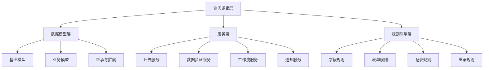
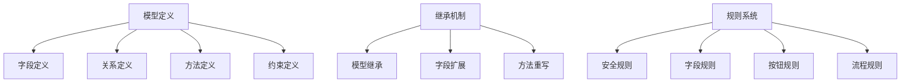

# 业务逻辑实现

## 🎯 概述

业务逻辑实现是Odoo开发中的核心模块，包含数据模型定义、业务流程控制、业务规则校验、计算字段实现等关键组件的设计和使用。

## 📊 业务逻辑架构

### 业务逻辑组件图


### Odoo模型设计


## 🏗️ 数据模型设计

### 核心业务模型
```python
# models/task.py
from odoo import models, fields, api, _
from odoo.exceptions import ValidationError, UserError

class ProjectTaskCustom(models.Model):
    """自定义项目任务模型"""
    _name = 'project.task.custom'
    _description = '自定义项目任务模型'
    
    _rec_name = 'name'
    _order = 'priority desc, date_deadline asc'
    
    # 基本信息
    name = fields.Char(string='任务名称', required=True)
    task_code = fields.Char(string='任务编号', required=True)
    description = fields.Html(string='任务描述')
    
    # 优先级和状态
    priority = fields.Selection([
        ('low', '低'),
        ('normal', '普通'),
        ('high', '高'),
        ('urgent', '紧急'),
        ('critical', '重要'),
    ], string='优先级', default='normal')
    
    stage_id = fields.Many2one('task.stage', string='阶段')
    state = fields.Selection([
        ('draft', '草稿'),
        ('in_progress', '进行中'),
        ('on_hold', '暂停'),
        ('completed', '已完成'),
        ('cancelled', '已取消'),
    ], string='状态', default='draft')
    
    # 时间相关
    planned_start_date = fields.Date(string='计划开始日期')
    planned_end_date = fields.Date(string='计划结束日期')
    actual_start_date = fields.Date(string='实际开始日期')
    actual_end_date = fields.Date(string='实际结束日期')
    
    # 工作量估算
    planned_hours = fields.Float(string='计划工时')
    effective_hours = fields.Float(string='有效工时')
    remaining_hours = fields.Float(string='剩余工时', compute='_compute_remaining_hours')
    
    # 关联关系
    child_ids = fields.One2many('project.task.custom)', 'parent_id', string='子任务')
    parent_id = fields.Many2one('project.task.custom', string='父任务')
    project_id = fields.Many2one('project.project', string='所属项目')
    
    # 人员分配
    user_ids = fields.Many2many('res.users', 'task_user_rel', 
                                'task_id', 'user_id', string='参与人员')
    assigned_to = fields.Many2one('res.users', string='负责人')
    
    # 依赖关系
    dependency_ids = fields.Many2many('project.task.custom',
                                     'task_dependency_rel',
                                     'task_id', 'dependent_id',
                                     string='依赖任务')
    
    # 标签和分类
    tag_ids = fields.Many2many('task.tag', 'task_tag_rel',
                               'task_id', 'tag_id', string='标签')
    category_id = fields.Many2one('task.category', string='任务分类')
    
    # 成本信息
    cost_per_hour = fields.Float(string='每小时成本')
    actual_cost = fields.Float(string='实际成本', compute='_compute_actual_cost')
    materials_cost = fields.Float(string='物料成本')
    
    # 质量检查
    quality_checklist_ids = fields.One2many('task.quality.check', 'task_id', string='质量检查')
    acceptance_criteria = fields.Html(string='验收标准')
    
    # 文档和附件
    document_ids = fields.One2many('ir.attachment', 'res_id', string='相关文档')
    
    @api.depends('planned_hours', 'effective_hours')
    def _compute_remaining_hours(self):
        """计算剩余工时"""
        for task in self:
            task.remaining_hours = task.planned_hours - task.effective_hours
    
    @api.depends('effective_hours', 'cost_per_hour', 'materials_cost')
    def _compute_actual_cost(self):
        """计算实际成本"""
        for task in self:
            task.actual_cost = (task.effective_hours * task.cost_per_hour) + task.materials_cost
    
    @api.depends('child_ids', 'child_ids.hours_spent', 'child_ids.state')
    def _compute_total_hours_spent(self):
        """计算子任务的总工时"""
        for task in self:
            if task.child_ids:
                task.total_hours_spent = sum(task.child_ids.mapped('effective_hours'))
            else:
                task.total_hours_spent = task.effective_hours
    
    @api.depends('planned_end_date', 'actual_end_date', 'state')
    def _compute_schedule_variance(self):
        """计算进度偏差"""
        for task in self:
            if task.planned_end_date:
                if task.state == 'completed' and task.actual_end_date:
                    delta = task.actual_end_date - task.planned_end_date
                    task.schedule_variance = delta.days
                else:
                    today = fields.Date.today()
                    if today > task.planned_end_date:
                        task.schedule_variance = (today - task.planned_end_date).days
    
    @api.constrains('planned_hours', 'effective_hours', 'remaining_hours')
    def _check_hours(self):
        """检查工时合法性"""
        for task in self:
            if task.planned_hours < 0:
                raise ValidationError(_('计划工时不能为负数'))
            
            if task.remaining_hours < 0:
                # 提醒而非阻止
                self.message_post(
                    body=_('警告：任务已超过计划工时'),
                    subtype_xmlid='mail.mt_note'
                )
    
    @api.constrains('planned_start_date', 'planned_end_date')
    def _check_date_range(self):
        """检查日期有效性"""
        for task in self:
            if (task.planned_start_date and task.planned_end_date and
                task.planned_start_date >= task.planned_end_date):
                raise ValidationError(_('计划开始日期不能晚于结束日期'))
    
    def action_start_task(self):
        """开始任务"""
        for task in self:
            if task.state == 'draft':
                task.state = 'in_progress'
                task.actual_start_date = fields.Date.context_today(task)
                
                task.message_post(
                    body=_('任务已开始执行'),
                    subtype_xmlid='mail.mt_note'
                )
        
        return {'type': 'ir.actions.act_window_close'}
    
    def action_complete_task(self):
        """完成任务"""
        for task in self:
            if task.state == 'in_progress':
                # 检查前提条件
                if not self._can_complete_task(task):
                    raise UserError(_('无法完成任务：请检查前置条件'))
                
                task.state = 'completed'
                task.actual_end_date = fields.Date.context_today(task)
                
                # 检查子任务是否完成
                incomplete_subtasks = task.child_ids.filtered(
                    lambda t: t.state != 'completed'
                )
                
                if incomplete_subtasks.exists():
                    task.message_post(
                        body=_('警告：存在未完成的子任务'),
                        subtype_xmlid='mail.mt_note'
                    )
                
                # 触发完成后的处理
                self._on_task_completed(task)
                
                task.message_post(
                    body=_('任务已完成'),
                    subtype_xmlid='mail.mt_note'
                )
        
        return {'type': 'ir.actions.act_window_close'}
    
    def _can_complete_task(self, task):
        """检查任务完成前提条件"""
        # 质量检查
        check_list = task.quality_checklist_ids
        if check_list.exists():
            failed_checks = check_list.filtered(lambda c: not c.passed)
            if failed_checks.exists():
                raise UserError(_('存在质量检查项未通过'))
        
        # 文档上传检查
        if not task.document_ids.exists():
            raise UserError(_('任务完成需要上传相关文档'))
        
        return True
    
    def _on_task_completed(self, task):
        """任务完成后的处理"""
        # 释放分配的资源
        for user in task.user_ids:
            user.release_task_resource(task.id)
        
        # 更新项目进度
        if task.project_id:
            task.project_id._compute_project_progress()
        
        # 触发父任务进度更新
        if task.parent_id:
            task.parent_id._compute_parent_task_progress()
    
    @api.model
    def create_task_from_template(self, template_id: int, project_id: int) -> 'ProjectTaskCustom':
        """从模板创建任务"""
        template = self.env['task.template'].browse(template_id)
        
        values = {
            'name': template.name,
            'description': template.description,
            'planned_hours': template.planned_hours,
            'project_id': project_id,
            'tag_ids': [(6, 0, template.tag_ids.ids)]
        }
        
        task = self.create(values)
        
        return task
    
    def duplicate_task(self):
        """复制任务"""
        for task in self:
            copy_values = task.copy_data()[0]
            copy_values['name'] = f"{task.name} (副本)"
            copy_values['task_code'] = self._generate_task_code()
            copy_values['state'] = 'draft'
            copy_values['planned_start_date'] = fields.Date.context_today(task)
            
            duplicated_task = self.create(copy_values)
            duplicated_task.message_post(
                body=_('任务已复制'),
                subtype_xmlid='mail.mt_note'
            )
    
    def _generate_task_code(self) -> str:
        """生成任务编号"""
        sequence = self.env['ir.sequence']
        return sequence.next_by_code('task.code')
```

### 扩展字段与管理
```python
# models/extended_manager.py
from odoo import models, fields, api, _
from odoo.exceptions import ValidationError, UserError

class ExtendedFieldsManager(models.AbstractModel):
    """扩展字段管理器"""
    _name = 'extended.fields.manager'
    _description = '扩展字段管理器'
    
    def add_calculated_field(self, field_name: str, field_type: str, 
                            compute_method: str, depends: list = None) -> dict:
        """动态添加计算字段"""
        try:
            field_definition = self._create_field_definition(
                field_name, field_type, compute_method, depends
            )
            
            # 应用到模型
            class_name = self._name
            self.env[class_name]._add_field(field_name, field_definition)
            
            return {
                'success': True,
                'message': f'字段 {field_name} 添加成功',
                'field_type': field_type
            }
            
        except Exception as e:
            raise UserError(f"添加字段失败: {str(e)}")
    
    def _create_field_definition(self, field_name: str, field_type: str,
                                compute_method: str, depends: list = None) -> dict:
        """创建字段定义"""
        field_def = {
            'type': field_type,
            'string': self._generate_field_label(field_name),
            'compute': compute_method,
            'store': False  # 默认不存储
        }
        
        if depends:
            field_def['depends'] = depends
        
        return field_def
    
    def add_behavior_field(self, field_name: str, field_type: str,
                          behavior_type: str = None, config: dict = None) -> dict:
        """添加行为字段"""
        behaviors = {
            'required': self._make_field_required(config),
            'readonly': self._make_field_readonly(config),
            'invisible': self._make_field_invisible(config),
            'invisible_on_state': self._make_field_invisible_on_state(config),
        }
        
        if behavior_type and behavior_type in behaviors:
            behavior_func = behaviors[behavior_type]
            return behavior_func(field_name, config)
        
        return {'success': False, 'message': '未知的行为类型'}
    
    def _make_field_required(self, config: dict) -> fielddefinition:
        """使字段必需"""
        return lambda field_name: {
            field_name: {
                'attrs': {'required': [(True)]}
            }
        }
    
    def _make_field_readonly(self, config: dict) -> fielddefinition:
        """使字段只读"""
        return lambda field_name: {
            field_name: {
                'attrs': {'readonly': [(True)]}
            }
        }
    
    def _make_field_invisible(self, config: dict) -> fielddefinition:
        """使字段不可见"""
        condition = config.get('condition', True)
        return lambda field_name: {
            field_name: {
                'attrs': {'invisible': [(condition)]}
            }
        }
    
    def _make_field_invisible_on_state(self, config: dict) -> fielddefinition:
        """根据状态控制字段可见性"""
        states_list = config.get('states', [])
        
        if not states_list:
            raise ValidationError(_('状态列表不能为空'))
        
        return lambda field_name: {
            field_name: {
                'attrs': {'invisible': [('state', 'in', states_list)]}
            }
        }
    
    def validate_field_dependencies(self, field_name: str, dependencies: list) -> bool:
        """验证字段依赖"""
        existing_fields = self._get_existing_fields()
        
        for dep_field in dependencies:
            if dep_field not in existing_fields:
                raise ValidationError(_(f'依赖字段 {dep_field} 不存在'))
        
        return True
    
    def _get_existing_fields(self) -> list:
        """获取模型中现有字段"""
        class_name = self._name
        model_class = self.env[class_name]
        return list(model_class._fields.keys())
    
    def add_formula_field(self, field_name: str, formula: str,
                         result_type: str = 'float') -> dict:
        """添加公式字段"""
        try:
            # 解析公式并验证
            parsed_formula = self._parse_formula(formula)
            
            field_def = {
                'type': result_type,
                'compute': lambda self: parsed_formula(self),
                'store': False
            }
            
            self.env[self._name]._add_field(field_name, field_def)
            
            return {
                'success': True,
                'formula': parsed_formula,
                'field_name': field_name
            }
            
        except Exception as e:
            raise ValidationError(_(f'公式字段添加失败: {str(e)}'))
    
    def _parse_formula(self, formula: str):
        """解析公式"""
        # 简单的公式解析器实现
        import ast
        
        try:
            parsed = ast.parse(formula)
            return lambda self: self._evaluate_ast(parsed)
        except SyntaxError:
            raise ValidationError(_('公式语法错误'))
    
    def _evaluate_ast(self, ast_node):
        """计算AST"""
        if isinstance(ast_node, ast.Num):
            return ast_node.n
        elif isinstance(ast_node, ast.Attribute):
            obj = getattr(self, ast_node.value.id)
            return getattr(obj, ast_node.attr)
        # 更多AST节点类型处理...
        # 这是一个简化版本，实际需要更完整的AST处理
```

### 业务规则引擎
```python
# models/business_rule_engine.py
from odoo import models, fields, api, _
from odoo.exceptions import ValidationError

class BusinessRuleEngine(models.AbstractModel):
    """业务规则引擎"""
    _name = 'business.rule.engine'
    _description = '业务规则引擎'
    
    def execute_rule(self, rule_id: int, model_name: str, 
                     record_id: int, context: dict = None) -> dict:
        """执行业务规则"""
        rule = self.env['business.rule'].browse(rule_id)
        
        if not rule.exists():
            raise ValidationError(_('规则不存在'))
        
        record = self.env[model_name].browse(record_id)
        
        context = context or {}
        
        try:
            if rule.rule_type == 'validation':
                result = self._execute_validation_rule(rule, record, context)
            elif rule.rule_type == 'calculation':
                result = self._execute_calculation_rule(rule, record, context)
            elif rule.rule_type == 'workflow':
                result = self._execute_workflow_rule(rule, record, context)
            else:
                raise ValidationError(_(f'未知的规则类型: {rule.rule_type}'))
            
            return {
                'success': True,
                'rule_name': rule.name,
                'action': result
            }
            
        except Exception as e:
            return {
                'success': False,
                'rule_name': rule.name,
                'error': str(e)
            }
    
    def _execute_validation_rule(self, rule, record, context):
        """执行验证规则"""
        # 执行条件检查
        if not self._check_conditions(rule.conditions, record):
            return True
        
        # 执行验证逻辑
        validation_code = compile(rule.validation_code, '<string>', 'exec')
        validation_locals = {'record': record, 'context': context}
        
        exec(validation_code, globals(), validation_locals)
        
        # 获取验证结果
        validation_result = validation_locals.get('result', True)
        
        if not validation_result:
            raise ValidationError(_(f"验证失败: {rule.failure_message}"))
        
        return validation_result
    
    def _execute_calculation_rule(self, rule, record, context):
        """执行计算规则"""
        # 检查计算条件
        if not self._check_conditions(rule.conditions, record):
            return record
        
        # 执行计算逻辑
        calculation_code = compile(rule.calculation_code, '<string>', 'exec')
        calculation_locals = {'record': record, 'context': context}
        
        exec(calculation_code, globals(), calculation_locals)
        
        # 获取计算结果
        calculated_values = calculation_locals.get('values', {})
        
        # 更新记录
        for field_name, field_value in calculated_values.items():
            if hasattr(record, field_name):
                type(record).write({field_name: field_value})
        
        return calculated_values
    
    def _execute_workflow_rule(self, rule, record, context):
        """执行工作流规则"""
        # 执行工作流条件
        if not self._check_conditions(rule.conditions, record):
            return None
        
        # 执行工作流动作
        workflow_code = compile(rule.workflow_code, '<string>', 'exec')
        workflow_locals = {'record': record, 'context': context, 'rule': rule}
        
        exec(workflow_code, globals(), workflow_locals)
        
        # 获取工作流结果
        workflow_result = workflow_locals.get('actions', [])
        
        return workflow_result
    
    def _check_conditions(self, conditions: str, record) -> bool:
        """检查条件表达式"""
        try:
            condition_code = compile(conditions, '<string>', 'eval')
            condition_locals = {'record': record}
            
            return eval(condition_code, globals(), condition_locals)
            
        except Exception:
            raise ValidationError(_('条件表达式语法错误'))
    
    def create_virtual_fields(self, model_name: str, field_definitions: list) -> bool:
        """创建虚拟字段"""
        try:
            model_class = self.env[model_name]
            
            # 添加字段
            for field_def in field_definitions:
                field_name = field_def.get('name')
                field_type = field_def.get('type')
                field_compute = field_def.get('compute')
                field_depends = field_def.get('depends', [])
                
                field_dict = {
                    'type': field_type,
                    'compute': field_compute,
                    'depends': field_depends
                }
                
                model_class._add_field(field_name, field_dict)
            
            return True
            
        except Exception as e:
            raise ValidationError(_(f'创建虚拟字段失败: {str(e)}'))
    
    def evaluate_formula_fields(self, model_name: str, record_vals: dict) -> dict:
        """计算公式字段"""
        model_class = self.env[model_name]
        formula_fields = model_class._get_formula_fields()
        
        computed_vals = record_vals.copy()
        
        for field_name in formula_fields:
            formula_func = model_class._fields.get(field_name).compute
            computed_vals[field_name] = None  # 公式会计算
        
        # 再次计算以确保公式字段值正确
        model_class._compute_formula_fields(computed_vals)
        
        return computed_vals
    
    def enable_advanced_filtering(self, filters: list) -> list:
        """高级过滤"""
        filtered_domain = []
        
        for filter_item in filters:
            if filter_item.get('type') == 'date_range':
                filtered_domain.append(('date_field', '>=', filter_item.get('start_date')))
                filtered_domain.append(('date_field', '<=', filter_item.get('end_date')))
            
            elif filter_item.get('type') == 'numeric_range':
                field_name = filter_item.get('field')
                filtered_domain.append((field_name, '>=', filter_item.get('min_value')))
                filtered_domain.append((field_name, '<=', filter_item.get('max_value')))
            
            elif filter_item.get('type') == 'tags':
                filtered_domain.append((('tags', 'in', filter_item.get('selected_tags'))))
        
        return filtered_domain
    
    def add_behavior_based_fields(self, model_name: str, behavior_configs: list) -> bool:
        """添加基于行为的字段"""
        try:
            model_class = self.env[model_name]
            
            for behavior_config in behavior_configs:
                field_name = behavior_config.get('field_name')
                behavior_type = behavior_config.get('behavior_type')
                config = behavior_config.get('config', {})
                
                if behavior_type == 'conditional_readonly':
                    self._add_conditional_readonly_field(model_class, field_name, config)
                
                elif behavior_type == 'conditional_required':
                    self._add_conditional_required_field(model_class, field_name, config)
                
                elif behavior_type == 'conditional_invisible':
                    self._add_conditional_invisible_field(model_class, field_name, config)
            
            return True
            
        except Exception as e:
            raise ValidationError(_(f'添加行为字段失败: {str(e)}'))
    
    def _add_conditional_readonly_field(self, model_class, field_name: str, config: dict):
        """添加条件只读字段"""
        condition_field = config.get('condition_field')
        condition_value = config.get('condition_value')
        
        field_def = {
            'attrs': {
                'readonly': [(condition_field, '=', condition_value)]
            }
        }
        
        model_class._add_field(field_name, field_def)
    
    def _add_conditional_required_field(self, model_class, field_name: str, config: dict):
        """添加条件必需字段"""
        condition_field = config.get('condition_field')
        condition_value = config.get('condition_value')
        
        field_def = {
            'attrs': {
                'required': [(condition_field, '=', condition_value)]
            }
        }
        
        model_class._add_field(field_name, field_def)
    
    def _add_conditional_invisible_field(self, model_class, field_name: str, config: dict):
        """添加条件隐藏字段"""
        condition_field = config.get('condition_field')
        condition_value = config.get('condition_value')
        
        field_def = {
            'attrs': {
                'invisible': [(condition_field, '=', condition_value)]
            }
        }
        
        model_class._add_field(field_name, field_def)
```

## 🔗 相关链接

### 技术文档
- [[通用工具类]] - 了解通用工具类
- [[ORM模型机制]] - ORM模型机制详解
- [[复杂业务流程]] - 复杂业务流程设计

### 示例代码
- [[实现指南]] - 实现指南和最佳实践
- [[调试技巧]] - 调试和故障处理
- [[性能优化]] - 性能优化建议

## 📝 最佳实践总结

### 业务逻辑设计
- **模型简化**: 保持模型结构清晰简洁
- **分层架构**: 严格区分数据、业务和表现层
- **规则驱动**: 灵活运用业务规则引擎
- **扩展友好**: 预留适当的扩展点

### 代码质量
- **测试覆盖**: 确保关键业务逻辑测试
- **文档完善**: 提供充分的API文档
- **错误处理**: 优雅处理和恢复错误
- **日志记录**: 记录关键操作轨迹

### 性能考虑
- **内存使用**: 合理使用计算字段缓存
- **查询优化**: 避免N+1查询问题
- **批量优化**: 采用批量操作减少数据库负载
- **索引选择**: 为常用查询创建适当索引

---

**版本**: v1.0.0  
**最后更新**: 2024年  
**维护状态**: 活跃维护
