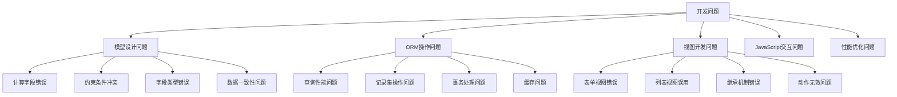

# 常见开发问题

## 🎯 概述

Odoo开发中常见的开发问题和错误模式分析，覆盖模型设计、ORM操作、视图开发、JavaScript交互和性能调优等方面。

## 📊 问题分类

### 开发问题分类图


## 📝 模型设计问题

### 计算字段问题
```python
# models/field_problems.py
from odoo import models, fields, api, _
from odoo.exceptions import ValidationError

class ComputedFieldProblems(models.Model):
    """计算字段常见问题示例"""
    _name = 'field.problems.example'
    _description = '计算字段常见问题示例'
    
    # 问题1: 未设置depends，导致计算字段不正确
    wrong_compute_field = fields.Float(
        string='错误计算字段',
        compute='_compute_wrong_field',  # 缺少depends
        store=False,
    )
    
    # 问题2: 循环依赖
    field_a = fields.Float(string='字段A')
    field_b = fields.Float(string='字段B')
    circular_field = fields.Float(
        string='循环字段',
        compute='_compute_circular_field',
        depends=['field_a', 'field_b'],
        store=False,
    )
    
    # 问题3: 动态计算无法缓存
    dynamic_field = fields.Float(
        string='动态计算字段',
        compute='_compute_dynamic_field',
        store=False,  # 不存储，每次都重新计算
    )
    
    # 问题4: 存储字段但计算不正确
    wrong_stored_field = fields.Float(
        string='错误存储字段',
        compute='_compute_wrong_stored_field',
        store=True,  # 存储但计算逻辑有问题
    )
    
    @api.depends('field_a', 'field_b')  # 正确示例
    def _compute_correct_field(self):
        """正确的计算字段示例"""
        for record in self:
            record.correct_field = record.field_a + record.field_b
    
    def _compute_wrong_field(self):
        """错误示例：未设置depends"""
        # 这里计算字段可能没有在依赖字段变化时重新计算
        pass
    
    def _compute_circular_field(self):
        """错误示例：循环依赖"""
        # 避免在计算字段中访问另一个依赖它的计算字段
        for record in self:
            # 这会导致循环依赖
            record.circular_field = something_that_triggers_recompute()
    
    def _compute_dynamic_field(self):
        """正确示例：动态计算字段"""
        for record in self:
            record.dynamic_field = (
                record.field_a * record.field_b / 100
            )
    
    def _compute_wrong_stored_field(self):
        """错误示例：存储字段计算错误"""
        # 不要使用记录集中的循环或集合操作作为存储字段的计算依据
        records = self.search([])
        for record in self:
            record.wrong_stored_field = len(records)  # 这是错误的
    
    # 正确示例：子记录计算
    child_ids = fields.One2many('field.child', 'parent_id', string='子记录')
    total_child_field = fields.Float(
        string='子记录总计',
        compute='_compute_total_child_field',
        depends=['child_ids', 'child_ids.field_value'],
        store=True,
    )
    
    @api.depends('child_ids.field_value')
    def _compute_total_child_field(self):
        """子记录计算的正确示例"""
        for record in self:
            record.total_child_field = sum([
                child.field_value for child in record.child_ids
            ])
```

### 字段类型错误
```python
# models/field_type_problems.py
from odoo import models, fields, api, _

class FieldTypeProblems(models.Model):
    """字段类型问题示例"""
    _name = 'field.type.problems'
    _description = '字段类型问题示例'
    
    # 问题1: Many2one字段没有默认值且必填
    wrong_required_m2o = fields.Many2one(
        'other.model',
        string='错误的必填Many2one',
        required=True,  # 可能导致创建记录失败
        default=False,  # 没有默认值
    )
    
    # 问题2: Char字段长度限制过小
    wrong_char_field = fields.Char(
        string='错误Char字段',
        size=10,  # 长度限制过小
        default='Default Value Longer Than Ten',  # 默认值超出长度
    )
    
    # 问题3: Float字段精度设置错误
    wrong_float_field = fields.Float(
        string='错误Float字段',
        digits=None,  # 没有精度设置
    )
    
    # 问题4: Boolean字段的默认值问题
    wrong_boolean_field = fields.Boolean(
        string='错误Boolean字段',
        default=None,  # 应该使用False
    )
    
    # 问题5: Date字段的时间解析问题
    wrong_date_field = fields.Date(
        string='错误Date字段',
        default=lambda self: "invalid_date",  # 错误的默认值格式
    )
    
    # 正确示例
    correct_required_m2o = fields.Many2one(
        'other.model',
        string='正确的必填Many2one',
        required=True,
        default=lambda self: self._default_partner_value(),  # 正确的默认值实现
    )
    
    correct_char_field = fields.Char(
        string='正确Char字段',
        size=256,  # 合理的长度
        default='Correct Default',
    )
    
    correct_float_field = fields.Float(
        string='正确Float字段',
        digits='Product Price',  # 从数据库精度配置中获取
    )
    
    correct_boolean_field = fields.Boolean(
        string='正确Boolean字段',
        default=False,
    )
    
    correct_date_field = fields.Date(
        string='正确Date字段',
        default=fields.Date.context_today,
    )
    
    @api.model
    def _default_partner_value(self):
        """正确的默认值方法"""
        default_partner = self.env['res.partner'].search([
            ('is_default', '=', True)
        ], limit=1)
        
        return default_partner.id if default_partner else None
    
    @api.constrains('wrong_char_field')
    def _check_char_length(self):
        """约束：检查Char字段长度"""
        for record in self:
            if record.wrong_char_field and len(record.wrong_char_field) > 10:
                raise ValidationError(_('字段长度不能超过10个字符'))
    
    @api.constrains('wrong_float_field')
    def _check_float_precision(self):
        """约束：检查Float字段精度"""
        for record in self:
            if hasattr(self._fields['wrong_float_field'], 'digits'):
                precision = self._fields['wrong_float_field'].digits
                if precision and len(precision) != 2:
                    raise ValidationError(_('浮点数精度设置错误'))
```

### 约束和验证问题
```python
# models/constraint_problems.py
from odoo import models, fields, api, _
from odoo.exceptions import ValidationError

class ConstraintProblems(models.Model):
    """约束和验证问题示例"""
    _name = 'constraint.problems'
    _description = '约束和验证问题示例'
    
    name = fields.Char(string='名称', required=True)
    amount = fields.Float(string='金额')
    start_date = fields.Date(string='开始日期')
    end_date = fields.Date(string='结束日期')
    
    # 问题1: 约束方法没有检查所有记录
    wrong_amount_check = fields.Float(string='错误金额检查')
    
    @api.constrains('start_date', 'end_date')
    def _check_invalid_constraint(self):
        """错误示例：约束方法处理不当"""
        for record in self:
            if record.start_date and record.end_date and \
               record.start_date >= record.end_date:
                raise ValidationError(
                    _('开始日期不能晚于结束日期')
                )
    
    @api.constrains('amount')
    def _check_wrong_amount(self):
        """错误示例：约束方法逻辑错误"""
        # 错误：使用了错误的模型字段
        self.write({'wrong_amount_check': self.amount * 2})
        
        # 这是错误的，因为约束方法不应该修改记录
    
    @api.constrains('name')
    def _check_name_unique_in_batch(self):
        """错误示例：批约束处理不当"""
        for record in self:
            duplicates = self.search([
                ('name', '=', record.name),
                ('id', '!=', record.id)
            ])
            if duplicates:
                raise ValidationError(_('名称必须唯一'))
    
    # 正确示例
    @api.constrains('start_date', 'end_date')
    def _check_valid_constraint(self):
        """正确示例：约束验证"""
        for record in self:
            if record.start_date and record.end_date and \
               record.start_date >= record.end_date:
                raise ValidationError(
                    _('开始日期不能晚于结束日期')
                )
    
    @api.constrains('amount')
    def _check_positive_amount(self):
        """正确示例：简单的正向约束"""
        for record in self:
            if record.amount and record.amount < 0:
                raise ValidationError(_('金额不能为负数'))
    
    @api.constrains('name')
    def _check_name_unique(self):
        """正确示例：唯一性约束"""
        domain = [
            ('name', 'in', self.filtered('name').mapped('name')),
            ('id', 'not in', self.ids)
        ]
        duplicates = self.search(domain)
        if duplicates:
            raise ValidationError(_('名称必须唯一'))
```

## 🔄 ORM操作问题

### 查询和记录集操作问题
```python
# models/orm_problems.py
from odoo import models, fields, api, _
from odoo.exceptions import UserError

class ORMProblems(models.Model):
    """ORM操作问题示例"""
    _name = 'orm.problems'
    _description = 'ORM操作问题示例'
    
    name = fields.Char(string='名称')
    value = fields.Float(string='值')
    partner_id = fields.Many2one('res.partner', string='客户')
    child_ids = fields.One2many('orm.child', 'parent_id', string='子记录')
    
    # 问题1: N+1查询问题
    @api.multi
    def wrong_get_child_total(self):
        """错误示例：N+1查询"""
        records = self.search([])  # 获取父记录
        
        for record in records:
            # 错误：每次循环都执行数据库查询
            children = self.env['orm.child'].search([
                ('parent_id', '=', record.id)
            ])
            record.total_value = sum(child.value for child in children)
    
    # 问题2: 记录集长度操作问题
    @api.multi
    def wrong_check_single_record(self):
        """错误示例：错误的单记录检查"""
        record = self.search([('id', '=', self.id)])
        
        # 错误：这样检查不安全
        if len(record) == 1:
            return record.name
        
        # 更好的检查方式：使用ensure_one()或exists()
        record.ensure_one()  # 或者 record.exists()
        return record.name
    
    # 问题3: 记录集状态变化问题
    @api.multi
    def wrong_change_recordset_state(self):
        """错误示例：记录集状态变化"""
        records = self.search([])
        
        # 错误：在循环中修改会导致状态变化
        for record in records:
            if record.value > 1000:
                records = records - record  # 这不会工作
        
        return records
    
    # 问题4: 批量操作错误
    @api.multi
    def wrong_batch_update(self):
        """错误示例：批量更新错误"""
        records = self.search([])
        
        # 错误：在循环中进行数据库操作
        for record in records:
            record.write({'value': record.value * 1.1})
    
    # 问题5: 缓存问题
    def wrong_cache_access(self):
        """错误示例：缓存访问问题"""
        record = self.search([('id', '=', 1)])
        record.update({'value': 999})  # 修改记录
        
        # 错误：重复访问可能不会得到最新值
        another_record = self.search([('id', '=', 1)])
        return another_record.value  # 可能不是最新的999
```

### 正确示例
```python
# models/orm_correct_examples.py
from odoo import models, fields, api, _
from odoo.exceptions import UserError

class ORMCorrectExamples(models.Model):
    """ORM操作正确示例"""
    _name = 'orm.correct.examples'
    _description = 'ORM操作正确示例'
    
    name = fields.Char(string='名称')
    value = fields.Float(string='值')
    partner_id = fields.Many2one('res.partner', string='客户')
    child_ids = fields.One2many('orm.child', 'parent_id', string='子记录')
    
    # 正确示例1: 避免N+1查询
    @api.multi
    def correct_get_child_total(self):
        """正确示例：避免N+1查询"""
        records = self.search([])
        
        # 一次性获取所有需要的子记录
        child_ids = records.mapped('child_ids.id')
        children_records = self.env['orm.child'].browse(child_ids)
        
        # 按父记录分组
        grouped_children = {}
        for child in children_records:
            parent_id = child.parent_id.id
            if parent_id not in grouped_children:
                grouped_children[parent_id] = []
            grouped_children[parent_id].append(child)
        
        # 计算总价值
        for record in records:
            record_children = grouped_children.get(record.id, [])
            record.total_value = sum(child.value for child in record_children)
    
    # 正确示例2: 安全的单记录访问
    @api.multi
    def correct_get_record_name(self):
        """正确示例：安全的单记录访问"""
        record = self.search([('id', '=', self.id)])
        
        if not record.exists():
            raise UserError(_('记录不存在'))
        
        if len(record) > 1:
            raise UserError(_('存在多个匹配记录'))
        
        return record.name
    
    # 正确示例3: 批量计算字段更新
    @api.model
    def correct_batch_update(self):
        """正确示例：批量更新"""
        records = self.search([])
        
        values_list = []
        for record in records:
            values_list.append((record.id, {'value': record.value * 1.1}))
        
        # 使用write方法批量更新
        for value_tuple in values_list:
            self.browse(value_tuple[0]).write(value_tuple[1])
    
    # 正确示例4: 复杂查询
    @api.model
    def correct_complex_search(self):
        """正确示例：复杂查询"""
        domain = [
            ('partner_id', '!=', False),
            ('value', '>', 0),
        ]
        
        # 使用切片避免查询所有记录
        records = self.search(domain, limit=1000)
        
        # 如果需要更多记录，使用offset
        if len(records) == 1000:
            next_batch = self.search(domain, offset=1000, limit=1000)
            records |= next_batch
        
        return records
    
    # 正确示例5: 读取效率优化
    @api.multi
    def correct_read_efficiency(self):
        """正确示例：读取效率优化"""
        records = self.search([])
        
        # 使用search_read获取必要字段
        data = self.search_read([], fields=['name', 'value'])
        
        # 只在需要时访问关系字段
        partner_data = {}
        for data_item in data:
            if data_item.get('partner_id'):
                partner_id = data_item['partner_id'][0]
                if partner_id not in partner_data:
                    partner_data[partner_id] = data_item['partner_id'][1]
                data_item['partner_name'] = partner_data[partner_id]
        
        return data
```

## 📱 JavaScript交互问题

### JavaScript常见错误
```python
# static/src/js/common_errors.js
odoo.define('custom_components.common_js_errors', function(require){
    "use strict";
    
    var AbstractField = require('web.AbstractField');
    var core = require('web.core');
    var _t = core._t;
    
    // 错误1: 事件处理器导致的内存泄漏
    var LeakyEventHandlerWidget = AbstractField.extend({
        
        init: function (parent, name, record, options) {
            this._super.apply(this, arguments);
            
            // 错误：全局事件监听器
            $(document).on('custom_event', function(event) {
                this._handleGlobalEvent(event);
            });
            
            // 错误：重复绑定事件
            this.$el.on('click', function() {
                this._handleClick();
            });
            
            this.$el.on('click', function() {  // 这会绑定第二个处理器
                this._handleClick();
            });
        },
        
        _handleGlobalEvent: function(event) {
            // 全局事件处理逻辑
        },
        
        _handleClick: function() {
            // 点击处理逻辑
        },
        
        destroy: function () {
            // 错误：没有清理事件绑定
            this._super.apply(this, arguments);
        }
    });
    
    // 错误2: AJAX请求处理不当
    var BadAjaxWidget = AbstractField.extend({
        
        init: function (parent, name, record, options) {
            this._super.apply(this, arguments);
        },
        
        _render: function () {
            var self = this;
            
            // 错误：同步AJAX请求
            var data = $.ajax({
                url: '/my/endpoint',
                method: 'GET',
                async: false  // 这会导致浏览器阻塞
            }).responseJSON;
            
            // 错误：没有处理AJAX错误
            $.ajax({
                url: '/my/problematic/endpoint',
                method: 'POST',
                data: {'param': 'value'},
                success: function(response) {
                    self._handleSuccess(response);
                }
                // 缺少error处理器
            });
        },
        
        _handleSuccess: function(response) {
            // 处理成功响应的逻辑
        },
        
        destroy: function () {
            // 错误：没有中止正在进行的AJAX请求
            this._super.apply(this, arguments);
        }
    });
    
    // 错误3: 不正确的字段值处理和更新
    var BadFieldHandlerWidget = AbstractField.extend({
        
        init: function (parent, name, record, options) {
            this._super.apply(this, arguments);
            
            // 错误：直接在init中修改值
            this.value = "Changed in init";
            this.handle_onchange(parent, name, record);
        },
        
        handle_onchange: function (parent, name, record) {
            var self = this;
            
            // 错误：没有触发change事件
            this.value = "Changed in onchange";
            
            // 错误：直接修改后端值
            this.set_value("Forced value", {silent: true});
            
            // 错误：没有更新UI
            return;
        },
        
        _commitChanges: function () {
            // 错误：错误的值提交
            if (this.value != this.previous_value) {
                this.trigger('changed');
                return;
            }
        }
    });
    
    // 错误4: 异步操作处理不当
    var BadAsyncWidget = AbstractField.extend({
        
        init: function (parent, name, record, options) {
            this._super.apply(this, arguments);
        },
        
        _refreshFromServer: function () {
            var self = this;
            
            // 错误：Promise链式调用错误
            return this.rpc({
                model: 'my.model',
                method: 'get_data',
                args: []
            }).then(function(response) {
                self.serverData = response;
                return response;
            }).then(function(response) {
                // 错误：忘记传递response
                return self.rpc({
                    model: 'my.model',
                    method: 'get_other_data',
                    args: []
                });
            }).then(function(response) {
                // 错误：闭包问题，this指向可能不正确
                self.additionalData = response;
                return self.serverData;
            });
        },
        
        destroy: function () {
            // 错误：没有处理pending的Promise
            this._super.apply(this, arguments);
        }
    });
    
    core.field_registry.add('leaky_event_handler', LeakyEventHandlerWidget);
    core.field_registry.add('bad_ajax', BadAjaxWidget);
    core.field_registry.add('bad_field_handler', BadFieldHandlerWidget);
    core.field_registry.add('bad_async', BadAsyncWidget);
});
```

### 正确示例
```python
# static/src/js/correct_examples.js
odoo.define('custom_components.correct_examples', function(require){
    "use strict";
    
    var AbstractField = require('web.AbstractField');
    var core = require('web.core');
    var Dialog = require('web.Dialog');
    var rpc = require('web.rpc');
    
    // 正确示例1: 事件处理器的正确清理
    var CorrectEventHandlerWidget = AbstractField.extend({
        
        init: function (parent, name, record, options) {
            this._super.apply(this, arguments);
            
            // 正确：使用off清理事件
            this.$el.off('click.widget_' + this.getFieldID());
            
            // 正确：绑定事件处理器，给出命名空间
            this.$el.on('click.widget_' + this.getFieldID(), function() {
                this._handleClick();
            });
        },
        
        _handleClick: function() {
            // 点击处理逻辑
        },
        
        destroy: function () {
            // 正确：清理事件绑定
            this.$el.off('.widget_' + this.getFieldID());
            this._super.apply(this, arguments);
        },
        
        getFieldID: function () {
            return this.generateID();
        },
        
        generateID: function () {
            return 'widget_' + Math.random().toString(36).substr(2, 9);
        }
    });
    
    // 正确示例2: AJAX请求处理
    var CorrectAjaxWidget = AbstractField.extend({
        
        init: function (parent, name, record, options) {
            this._super.apply(this, arguments);
            this.pendingRequest = null;
        },
        
        _makeServerRequest: function () {
            var self = this;
            
            // 取消上一个请求
            if (this.pendingRequest) {
                this.pendingRequest.abort();
            }
            
            // 正确：异步AJAX请求
            this.pendingRequest = rpc.route({
                route: '/my/endpoint',
                params: {
                    param: 'value',
                    model: self.modelName,
                    res_id: self.res_id
                }
            }).then(function(result) {
                self.serverData = result;
                self._updateFromServerData();
                return result;
            }).fail(function(error) {
                console.error('Server request failed:', error);
                self._handleRequestError(error);
            });
            
            return this.pendingRequest;
        },
        
        _handleRequestError: function(error) {
            if (error.status !== 0) {  // 不是请求中止
                Dialog.alert(null, {
                    title: _t('请求失败'),
                    message: _t('服务器请求失败，请稍后重试。'),
                    confirm_callback: function() {
                        // 可以重试请求
                    }
                });
            }
        },
        
        _updateFromServerData: function () {
            // 使用服务器数据更新界面
            this._render();
        },
        
        destroy: function () {
            if (this.pendingRequest) {
                this.pendingRequest.abort();
            }
            this._super.apply(this, arguments);
        }
    });
    
    // 正确示例3: 字段值处理和更新
    var CorrectFieldHandlerWidget = AbstractField.extend({
        
        init: function (parent, name, record, options) {
            this._super.apply(this, arguments);
            
            // 正确：使用trigger change处理onchange
            this.trigger_up('field_changed', {
                dataPointID: this.handle,
                changes: {[name]: {oldValue: undefined, newValue: this.value}},
                node: this.node,
                record: record,
                setValue: _.bind(this.setValue, this),
                view: this.view
            });
        },
        
        handle_onchange: function (parent, name, record) {
            var self = this;
            
            // 正确：触发change事件
            this.trigger('field_changed', {
                field: name,
                value: this.value
            });
            
            // 正确：返回新的字段值对象
            return {
                'related_field': {
                    values: {
                        'related_field': self._computeRelatedValue(self.value)
                    }
                }
            };
        },
        
        _computeRelatedValue: function (value) {
            // 计算结果
            return value / 100;
        },
        
        _commitChanges: function () {
            // 正确：只有值真正改变时才提交
            if (this.value !== this.previous_value && this.value !== false) {
                this.trigger('field_changed', {
                    field: this.name,
                    value: this.value
                });
            }
        }
    });
    
    // 正确示例4: 异步操作处理
    var CorrectAsyncWidget = AbstractField.extend({
        
        init: function (parent, name, record, options) {
            this._super.apply(this, arguments);
            
            // 正确：使用Promise链处理异步操作
            this.asyncOperations = [];
        },
        
        _refreshFromServer: function () {
            var self = this;
            
            return rpc.route({
                route: '/refresh_data',
                params: self._getRefreshParams()
            }).then(function(response) {
                return self._handleRefreshedData(response);
            }).then(function(handledData) {
                // 传递正确的响应数据
                return self._postProcessData(handledData);
            }).then(function(postProcessedData) {
                // 正确使用闭包变量
                // 确保在错误回调中能够访问this
                self.finalData = postProcessedData;
                return self._renderFromData(self.finalData);
            }).catch(function(error) {
                // 统一错误处理
                self._handleAsyncError(error);
            });
        },
        
        _handleRefreshedData: function (data) {
            // 处理数据逻辑
            return data.processed;
        },
        
        _postProcessData: function (data) {
            // 后处理数据逻辑
            return data;
        },
        
        _renderFromData: function (data) {
            // 更新界面
            this.render(data);
        },
        
        _handleAsyncError: function (error) {
            // 错误处理
            console.error('Async operation failed:', error);
        },
        
        destroy: function () {
            // 正确：清理异步操作
            if (this.asyncOperations && this.asyncOperations.length > 0) {
                this.asyncOperations.forEach(function(operation) {
                    if (operation.abort && typeof operation.abort === 'function') {
                        operation.abort();
                    }
                });
            }
            this._super.apply(this, arguments);
        }
    });
    
    core.field_registry.add('correct_event_handler', CorrectEventHandlerWidget);
    core.field_registry.add('correct_ajax', CorrectAjaxWidget);
    core.field_registry.add('correct_field_handler', CorrectFieldHandlerWidget);
    core.field_registry.add('correct_async', CorrectAsyncWidget);
});
```

## 🔗 相关链接

### 技术文档
- [[Odoo调试技巧]] - Odoo调试技巧和有效调试方法
- [[性能问题排查]] - 性能问题深度排查和分析
- [[常见错误日志]] - 常见错误日志分析和解决方案

### 参考资源
- [[开发最佳实践]] - Odoo开发最佳实践和规范
- [[代码质量保证]] - 代码质量保证方法和工具
- [[测试与集成]] - 测试与集成策略

## 📝 总结

### 问题预防
- **编码规范**: 遵循严格的编码规范，减少人为错误
- **测试覆盖**: 确保关键逻辑有充分的测试覆盖
- **文档维护**: 保持代码和API文档更新及时
- **错误处理**: 完善错误处理和恢复机制

### 调试技巧
- **分层调试**: 从数据层、业务层到表现层逐步排查
- **日志记录**: 添加适当的日志记录，帮助问题定位
- **代码分析**: 通过静态分析发现潜在问题
- **性能监控**: 定期监控和分析系统性能

### 学习建议
- **持续学习**: 关注Odoo最新版本和开发技术
- **实践总结**: 从实际项目中总结经验和教训
- **团队协作**: 与团队成员分享经验和最佳实践
- **社区参与**: 积极参与社区问题讨论和经验分享

---

**文档版本**: v1.0.0  
**最后更新**: 2024年  
**维护状态**: 活跃维护
