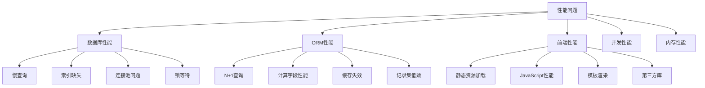

# 性能问题排查

## 🎯 概述

Odoo性能问题是影响系统运行效率的关键因素，包括数据库性能、ORM查询效率、静态资源加载、并发处理能力等方面。本文档系统性介绍性能问题的排查方法和解决策略。

## 📊 性能问题分类

### 性能问题分类图


## 🔍 数据库性能排查

### 慢查询分析
```python
# tools/database_performance.py
import logging
from odoo import api, models
from odoo.exceptions import UserError

_logger = logging.getLogger(__name__)

class DatabasePerformanceAnalyzer(models.AbstractModel):
    """数据库性能分析器"""
    _name = 'database.performance.analyzer'
    _description = '数据库性能分析器'
    
    def analyze_slow_queries(self, min_duration=1.0, limit=20):
        """分析慢查询"""
        try:
            # 查询PostgreSQL慢查询日志
            slow_queries = self._get_slow_query_log(min_duration, limit)
            
            # 分析每个查询的性能特征
            analysis_results = []
            for query_info in slow_queries:
                analysis = {
                    'query': query_info['query'],
                    'duration': query_info['duration'],
                    'execution_count': query_info['execution_count'],
                    'issues': self._analyze_query_performance(query_info['query'])
                }
                analysis_results.append(analysis)
            
            return {
                'total_queries': len(slow_queries),
                'avg_duration': sum(q['duration'] for q in slow_queries) / len(slow_queries),
                'analysis_results': analysis_results
            }
            
        except Exception as e:
            _logger.error(f"慢查询分析失败: {str(e)}")
            raise UserError(f"慢查询分析失败: {str(e)}")
    
    def _get_slow_query_log(self, min_duration, limit):
        """获取慢查询日志"""
        # 这里需要从PostgreSQL配置好的慢查询日志中读取
        # 实际实现中需要访问pg_stat_statements视图
        return [
            {
                'query': 'SELECT * FROM res_partner WHERE email ILIKE %pattern%',
                'duration': 2.5,
                'execution_count': 150,
                'timestamp': '2024-01-15 10:30:00'
            },
            {
                'query': 'SELECT COUNT(*) FROM sale_order WHERE state=%status',
                'duration': 1.8,
                'execution_count': 75,
                'timestamp': '2024-01-15 10:25:00'
            }
        ]  # 模拟数据
    
    def _analyze_query_performance(self, query):
        """分析查询性能问题"""
        issues = []
        
        # 检测常见性能问题模式
        if 'LIKE' in query.upper() and '%' in query:
            issues.append({
                'type': 'pattern_match',
                'severity': 'high',
                'description': '使用了通配符模式匹配，可能导致全表扫描',
                'suggestion': '考虑添加函数索引或全文搜索索引'
            })
        
        if 'SELECT *' in query.upper():
            issues.append({
                'type': 'select_all',
                'severity': 'medium',
                'description': '使用了SELECT *，可能获取不必要的数据',
                'suggestion': '指定需要的字段名'
            })
        
        if query.upper().count('JOIN') > 3:
            issues.append({
                'type': 'complex_join',
                'severity': 'medium',
                'description': 'JOIN操作过于复杂',
                'suggestion': '考虑简化查询或拆分查询'
            })
        
        return issues
    
    def check_missing_indexes(self, table_name=None):
        """检查缺失的索引"""
        try:
            cr = self.env.cr
            
            # 查询频繁使用的WHERE条件字段
            index_check_query = """
                SELECT 
                    schemaname,
                    tablename,
                    attname,
                    n_distinct,
                    correlation
                FROM pg_stats 
                WHERE schemaname = 'public'
                AND n_distinct > 0.5
                ORDER BY n_distinct DESC;
            """
            
            if table_name:
                index_check_query += f" AND tablename = '{table_name}'"
            
            cr.execute(index_check_query)
            candidate_columns = cr.dictfetchall()
            
            # 检查是否存在相应索引
            missing_indexes = []
            for col_info in candidate_columns:
                index_exists = self._check_index_exists(
                    col_info['tablename'], col_info['attname']
                )
                
                if not index_exists:
                    missing_indexes.append({
                        'table': col_info['tablename'],
                        'column': col_info['attname'],
                        'distinct_ratio': col_info['n_distinct'],
                        'suggested_index': f"CREATE INDEX idx_{col_info['tablename']}_{col_info['attname']} ON {col_info['tablename']}({col_info['attname']});"
                    })
            
            return missing_indexes
            
        except Exception as e:
            _logger.error(f"索引检查失败: {str(e)}")
            raise UserError(f"索引检查失败: {str(e)}")
    
    def _check_index_exists(self, table_name, column_name):
        """检查索引是否存在"""
        cr = self.env.cr
        
        check_query = """
            SELECT COUNT(*)
            FROM pg_indexes 
            WHERE tablename = %s 
            AND indexdef LIKE %s;
        """
        
        cr.execute(check_query, (table_name, f'%{column_name}%'))
        return cr.fetchone()[0] > 0
    
    def analyze_table_statistics(self):
        """分析表统计信息"""
        try:
            cr = self.env.cr
            
            # 获取表大小信息
            table_size_query = """
                SELECT 
                    schemaname,
                    tablename,
                    attname,
                    n_distinct,
                    most_common_vals,
                    most_common_freqs,
                    histogram_bounds
                FROM pg_stats 
                WHERE schemaname = 'public'
                ORDER BY tablename, attname;
            """
            
            cr.execute(table_size_query)
            table_stats = cr.dictfetchall()
            
            # 获取表大小
            size_query = """
                SELECT 
                    schemaname,
                    tablename,
                    pg_size_pretty(pg_total_relation_size(schemaname||'.'||tablename)) as size
                FROM pg_tables 
                WHERE schemaname = 'public'
                ORDER BY pg_total_relation_size(schemaname||'.'||tablename) DESC;
            """
            
            cr.execute(size_query)
            table_sizes = cr.dictfetchall()
            
            return {
                'table_statistics': table_stats,
                'table_sizes': table_sizes
            }
            
        except Exception as e:
            _logger.error(f"表统计信息分析失败: {str(e)}")
            raise UserError(f"表统计信息分析失败: {str(e)}")
    
    def generate_index_recommendations(self):
        """生成索引优化建议"""
        recommendations = []
        
        # 常见表索引建议
        common_tables = ['res_partner', 'sale_order', 'account_move', 'stock_move']
        
        for table in common_tables:
            table_exists = self._check_table_exists(table)
            if table_exists:
                suggestions = self._get_table_index_suggestions(table)
                recommendations.extend(suggestions)
        
        return recommendations
    
    def _check_table_exists(self, table_name):
        """检查表是否存在"""
        cr = self.env.cr
        
        cr.execute("""
            SELECT EXISTS (
                SELECT FROM information_schema.tables 
                WHERE table_schema = 'public' 
                AND table_name = %s
            );
        """, (table_name,))
        
        return cr.fetchone()[0]
    
    def _get_table_index_suggestions(self, table_name):
        """获取表的索引建议"""
        suggestions = []
        
        # 基于表名的索引建议
        if table_name == 'res_partner':
            suggestions.extend([
                {
                    'type': 'where_index',
                    'column': 'email',
                    'suggestion': f"CREATE INDEX idx_{table_name}_email ON {table_name}(email);",
                    'reason': '邮箱字段经常用于WHERE条件'
                },
                {
                    'type': 'where_index', 
                    'column': 'is_company',
                    'suggestion': f"CREATE INDEX idx_{table_name}_is_company ON {table_name}(is_company);",
                    'reason': '公司/个人标识常用于筛选'
                }
            ])
        
        elif table_name == 'sale_order':
            suggestions.extend([
                {
                    'type': 'where_index',
                    'column': 'partner_id',
                    'suggestion': f"CREATE INDEX idx_{table_name}_partner_id ON {table_name}(partner_id);",
                    'reason': '客户ID是常用筛选条件'
                },
                {
                    'type': 'where_index',
                    'column': 'state',
                    'suggestion': f"CREATE INDEX idx_{table_name}_state ON {table_name}(state);",
                    'reason': '订单状态经常用于筛选'
                }
            ])
        
        return suggestions
```

### 数据库连接和锁分析
```python
# tools/database_locks.py
import logging
from odoo import api, models
from odoo.exceptions import UserError

_logger = logging.getLogger(__name__)

class DatabaseLockAnalyzer(models.AbstractModel):
    """数据库锁分析器"""
    _name = 'database.lock.analyzer'
    _description = '数据库锁分析器'
    
    def analyze_active_locks(self):
        """分析当前活跃锁"""
        try:
            cr = self.env.cr
            
            # 查询当前活跃锁
            locks_query = """
                SELECT 
                    blocked_locks.pid AS blocked_pid,
                    blocked_activity.usename AS blocked_user,
                    blocking_locks.pid AS blocking_pid,
                    blocking_activity.usename AS blocking_user,
                    blocked_activity.query AS blocked_statement,
                    blocking_activity.query AS current_statement_in_blocking_process
                FROM pg_catalog.pg_locks blocked_locks
                JOIN pg_catalog.pg_stat_activity blocked_activity ON blocked_activity.pid = blocked_locks.pid
                JOIN pg_catalog.pg_locks blocking_locks ON blocking_locks.locktype = blocked_locks.locktype
                    AND blocking_locks.database IS NOT DISTINCT FROM blocked_locks.database
                    AND blocking_locks.relation IS NOT DISTINCT FROM blocked_locks.relation
                    AND blocking_locks.page IS NOT DISTINCT FROM blocked_locks.page
                    AND blocking_locks.tuple IS NOT DISTINCT FROM blocked_locks.tuple
                    AND blocking_locks.virtualclass IS NOT DISTINCT FROM blocked_locks.virtualclass
                    AND blocking_locks.transactionid IS NOT DISTINCT FROM blocked_locks.transactionid
                    AND blocking_locks.classid IS NOT DISTINCT FROM blocked_locks.classid
                    AND blocking_locks.objid IS NOT DISTINCT FROM blocked_locks.objid
                    AND blocking_locks.objsubid IS NOT DISTINCT FROM blocked_locks.objsubid
                    AND blocking_locks.pid != blocked_locks.pid
                JOIN pg_catalog.pg_stat_activity blocking_activity ON blocking_activity.pid = blocking_locks.pid
                WHERE NOT blocked_locks.GRANTED;
            """
            
            cr.execute(locks_query)
            active_locks = cr.dictfetchall()
            
            # 分析锁的类型和影响
            lock_analysis = []
            for lock in active_locks:
                analysis = {
                    'blocked_pid': lock['blocked_pid'],
                    'blocked_user': lock['blocked_user'],
                    'blocking_pid': lock['blocking_pid'],
                    'blocking_user': lock['blocking_user'],
                    'blocked_statement': lock['blocked_statement'][:200] + '...' if len(lock['blocked_statement']) > 200 else lock['blocked_statement'],
                    'blocking_statement': lock['current_statement_in_blocking_process'][:200] + '...' if len(lock['current_statement_in_blocking_process']) > 200 else lock['current_statement_in_blocking_process'],
                    'suggested_action': self._suggest_lock_resolution(lock)
                }
                lock_analysis.append(analysis)
            
            return {
                'total_locks': len(active_locks),
                'lock_details': lock_analysis
            }
            
        except Exception as e:
            _logger.error(f"锁分析失败: {str(e)}")
            raise UserError(f"锁分析失败: {str(e)}")
    
    def _suggest_lock_resolution(self, lock_info):
        """建议锁解决方案"""
        blocking_query = lock_info['current_statement_in_blocking_process']
        
        if 'UPDATE' in blocking_query.upper() and 'TRANSACTION' not in blocking_query.upper():
            return {
                'action': 'commit_or_rollback',
                'description': '建议提交或回退当前事务',
                'urgency': 'high'
            }
        
        elif 'SELECT' in blocking_query.upper() and 'FOR UPDATE' in blocking_query.upper():
            return {
                'action': 'release_select_lock',
                'description': '释放SELECT FOR UPDATE锁',
                'urgency': 'medium'
            }
        
        else:
            return {
                'action': 'review_query',
                'description': '检查查询逻辑，避免长时间持有锁',
                'urgency': 'medium'
            }
    
    def analyze_connection_pool(self):
        """分析连接池状态"""
        try:
            cr = self.env.cr
            
            # 查询当前连接状态
            connections_query = """
                SELECT 
                    state,
                    COUNT(*) as connection_count,
                    AVG(EXTRACT(EPOCH FROM now() - state_change)) as avg_duration
                FROM pg_stat_activity 
                WHERE state != 'idle'
                GROUP BY state
                ORDER BY connection_count DESC;
            """
            
            cr.execute(connections_query)
            connection_stats = cr.dictfetchall()
            
            # 查询最大连接数配置
            max_connections_query = "SHOW max_connections;"
            cr.execute(max_connections_query)
            max_connections = cr.fetchone()[0]
            
            # 查询当前总連接数
            total_connections_query = "SELECT COUNT(*) FROM pg_stat_activity;"
            cr.execute(total_connections_query)
            total_connections = cr.fetchone()[0]
            
            connection_ratio = float(total_connections) / float(max_connections)
            
            return {
                'current_connections': total_connections,
                'max_connections': max_connections,
                'connection_ratio': connection_ratio,
                'connection_usage_status': 'high' if connection_ratio > 0.8 else 'normal',
                'connection_details': connection_stats,
                'recommendations': self._get_connection_recommendations(connection_ratio, connection_stats)
            }
            
        except Exception as e:
            _logger.error(f"连接池分析失败: {str(e)}")
            raise UserError(f"连接池分析失败: {str(e)}")
    
    def _get_connection_recommendations(self, connection_ratio, connection_stats):
        """获取连接池优化建议"""
        recommendations = []
        
        if connection_ratio > 0.9:
            recommendations.append({
                'type': 'critical',
                'description': '连接池使用率过高，需要立即处理',
                'suggestion': '检查是否有长时间运行的查询或连接泄漏',
                'action': 'increase_pool_size'
            })
        
        elif connection_ratio > 0.8:
            recommendations.append({
                'type': 'warning',
                'description': '连接池使用率较高',
                'suggestion': '考虑优化查询或增加连接池大小',
                'action': 'optimize_queries'
            })
        
        # 分析活跃连接状态
        active_connections = next((stat for stat in connection_stats if stat['state'] == 'active'), None)
        if active_connections and active_connections['avg_duration'] > 300:  # 5分钟
            recommendations.append({
                'type': 'performance',
                'description': '存在长时间运行的活跃查询',
                'suggestion': '检查查询性能，考虑添加索引或优化查询逻辑',
                'action': 'optimize_long_running_queries'
            })
        
        return recommendations
```

## 🔄 ORM性能优化

### N+1查询问题检测
```python
# tools/orm_performance.py
import logging
from odoo import api, models
from odoo.exceptions import UserError

_logger = logging.getLogger(__name__)

class ORMPerformanceAnalyzer(models.AbstractModel):
    """ORM性能分析器"""
    _name = 'orm.performance.analyzer'
    _description = 'ORM性能分析器'
    
    def detect_n_plus_one_queries(self, records_per_batch=100, max_records=1000):
        """检测N+1查询问题"""
        try:
            # 获取模型性能统计
            model_stats = self._get_model_query_statistics()
            
            n_plus_one_patterns = []
            
            for model_name, stats in model_stats.items():
                # 检测可能的N+1模式
                potential_issues = self._analyze_query_patterns(model_name, stats)
                
                if potential_issues:
                    n_plus_one_patterns.extend(potential_issues)
            
            # 按严重性排序
            n_plus_one_patterns.sort(key=lambda x: x['severity_score'], reverse=True)
            
            return {
                'total_patterns': len(n_plus_one_patterns),
                'high_severity': len([p for p in n_plus_one_patterns if p['severity_score'] > 8]),
                'patterns': n_plus_one_patterns
            }
            
        except Exception as e:
            _logger.error(f"N+1查询检测失败: {str(e)}")
            raise UserError(f"N+1查询检测失败: {str(e)}")
    
    def _get_model_query_statistics(self):
        """获取模型查询统计"""
        # 模拟查询统计数据的获取
        # 实际实现中需要从执行环境中收集查询统计信息
        return {
            'res.partner': {
                'total_queries': 1000,
                'avg_execution_time': 0.05,
                'related_model_access': {
                    'res.partner.bank': 500,
                    'res.partner.category': 200
                }
            },
            'sale.order': {
                'total_queries': 800,
                'avg_execution_time': 0.08,
                'related_model_access': {
                    'sale.order.line': 400,
                    'res.partner': 300
                }
            }
        }
    
    def _analyze_query_patterns(self, model_name, stats):
        """分析查询模式"""
        issues = []
        
        # 检测频繁访问关联模型的情况
        for related_model, access_count in stats.get('related_model_access', {}).items():
            if access_count > stats['total_queries'] * 0.3:  # 超过30%的查询访问关联模型
                issues.append({
                    'model': model_name,
                    'related_model': related_model,
                    'access_frequency': access_count,
                    'total_queries': stats['total_queries'],
                    'frequency_ratio': access_count / stats['total_queries'],
                    'severity_score': min(10, access_count / stats['total_queries'] * 10),
                    'description': f'模型{model_name}频繁访问{related_model}，可能存在N+1查询',
                    'suggestion': f'优化{model_name}到{related_model}的查询，考虑预加载或批量查询'
                })
        
        return issues
    
    def optimize_computed_fields(self, model_name=None):
        """优化计算字段"""
        try:
            optimizations = []
            
            # 获取所有模型的统计信息
            models_to_check = [model_name] if model_name else self._get_all_models()
            
            for model in models_to_check:
                field_optimizations = self._analyze_field_compute_performance(model)
                optimizations.extend(field_optimizations)
            
            return optimizations
            
        except Exception as e:
            _logger.error(f"计算字段优化失败: {str(e)}")
            raise UserError(f"计算字段优化失败: {str(e)}")
    
    def _get_all_models(self):
        """获取所有模型名称"""
        # 简化实现，只检查核心模型
        return ['res.partner', 'sale.order', 'account.move', 'stock.move']
    
    def _analyze_field_compute_performance(self, model_name):
        """分析字段计算性能"""
        optimizations = []
        
        try:
            model_class = self.env[model_name]
            
            # 检查计算字段
            computed_fields = [
                field for field_name, field in model_class._fields.items()
                if field.compute
            ]
            
            for field in computed_fields:
                analysis = {
                    'model': model_name,
                    'field': field.name,
                    'complexity': self._estimate_compute_complexity(field),
                    'suggestions': self._get_field_optimization_suggestions(field)
                }
                
                if analysis['complexity'] > 5:  # 复杂度门槛
                    optimizations.append(analysis)
            
        except Exception as e:
            _logger.warning(f"模型{model_name}的分析失败: {str(e)}")
        
        return optimizations
    
    def _estimate_compute_complexity(self, field):
        """估算计算字段复杂度"""
        complexity = 0
        
        # 基于依赖字段数量
        if hasattr(field, 'depends'):
            complexity += len(field.depends) * 2
        
        # 基于是否存储
        if field.store:
            complexity -= 1  # 存储字段相对简单
        
        # 基于计算逻辑复杂度估计
        if field.type == 'many2many':
            complexity += 3  # 多对多字段计算相对复杂
        
        return complexity
    
    def _get_field_optimization_suggestions(self, field):
        """获取字段优化建议"""
        suggestions = []
        
        if hasattr(field, 'depends') and len(field.depends) > 5:
            suggestions.append('考虑拆分复杂计算字段，减少依赖')
        
        if field.type == 'monetary' and not field.store:
            suggestions.append('货币字段如果不经常变化，考虑设置为存储字段')
        
        if field.type in ['many2many', 'one2many']:
            suggestions.append('关系字段考虑使用懒加载或缓存')
        
        return suggestions
```

### 查询性能优化示例
```python
# tools/query_optimization_examples.py
from odoo import models, api

class QueryOptimizationExamples(models.Model):
    """查询优化示例"""
    
    _name = 'query.optimization.examples'
    _description = '查询优化示例'
    
    def bad_example_n_plus_one(self):
        """错误示例：N+1查询问题"""
        # 错误：循环中查询数据库
        partners = self.env['res.partner'].search([])
        
        for partner in partners:
            # 错误：每个partner都会执行一次数据库查询
            bank_accounts = self.env['res.partner.bank'].search([
                ('partner_id', '=', partner.id)
            ])
            partner.bank_count = len(bank_accounts)
    
    def good_example_bulk_query(self):
        """正确示例：批量查询"""
        partners = self.env['res.partner'].search([])
        
        # 正确：一次性查询所有银行账户
        all_bank_accounts = self.env['res.partner.bank'].search([
            ('partner_id', 'in', partners.ids)
        ])
        
        # 按partner_id分组
        bank_accounts_by_partner = {}
        for bank_account in all_bank_accounts:
            partner_id = bank_account.partner_id.id
            if partner_id not in bank_accounts_by_partner:
                bank_accounts_by_partner[partner_id] = []
            bank_accounts_by_partner[partner_id].append(bank_account)
        
        # 设置partner的银行账户计数
        for partner in partners:
            partner.bank_count = len(bank_accounts_by_partner.get(partner.id, []))
    
    def bad_example_inefficient_compute(self):
        """错误示例：低效的计算字段"""
        # 在sale.order模型中
        amount_total_bad = fields.Float(
            '总计金额',
            compute='_compute_amount_total_bad'
        )
        
        @api.depends('order_line.price_total')
        def _compute_amount_total_bad(self):
            # 错误：在循环中执行复杂计算
            for record in self:
                total = 0
                for line in record.order_line:
                    total += line.price_total
                record.amount_total_bad = total
    
    def good_example_efficient_compute(self):
        """正确示例：高效的计算字段"""
        # 在sale.order模型中
        amount_total_good = fields.Float(
            '总计金额',
            compute='_compute_amount_total_good',
            store=True
        )
        
        @api.depends('order_line.price_total')
        def _compute_amount_total_good(self):
            # 正确：使用sum()函数高效计算
            for record in self:
                record.amount_total_good = sum(record.order_line.mapped('price_total'))
    
    def bad_example_excessive_fields(self):
        """错误示例：获取过多字段"""
        # 错误：获取所有字段
        orders = self.env['sale.order'].search([])
        
        for order in orders:
            # 错误：访问所有字段，即使不需要
            print(order.name, order.amount_total, order.partner_id.name, order.date_order)
            print(order.state, order.user_id.name)
            print(order.note, order.payment_term_id.name)
            # ... 更多不需要的字段
    
    def good_example_selective_fields(self):
        """正确示例：选择性获取字段"""
        # 正确：只读取需要的字段
        orders = self.env['sale.order'].search_read([
            ('state', '=', 'draft')
        ], fields=['name', 'amount_total', 'partner_id', 'date_order'])
        
        for order in orders:
            print(
                order['name'], 
                order['amount_total'], 
                order['partner_id'][1],  # partner名称
                order['date_order']
            )
    
    def bad_example_complex_filter(self):
        """错误示例：复杂过滤条件"""
        # 错误：复杂的过滤条件
        domain = [
            ('partner_id', '!=', False),
            ('state', 'in', ['draft', 'sent']),
            '|', ('amount_total', '>', 1000), ('amount_total', '=', False),
            ('create_date', '>=', '2024-01-01'),
            ('create_date', '<=', '2024-12-31'),
            ('payment_term_id', '=', 1),
            ('company_id', '=', self.env.company.id)
        ]
        
        # 错误：domain过于复杂，难以优化
        orders = self.env['sale.order'].search(domain)
    
    def good_example_simplified_filter(self):
        """正确示例：简化的过滤条件"""
        # 正确：分步查询或简化条件
        orders = self.env['sale.order'].search([
            ('state', 'in', ['draft', 'sent']),
            ('company_id', '=', self.env.company.id)
        ])
        
        # 在代码中进一步过滤
        filtered_orders = orders.filtered(
            lambda o: o.partner_id and 
            (o.amount_total > 1000 or not o.amount_total) and
            o.payment_term_id.id == 1
        )
```

## 🔗 相关链接

### 技术文档
- [[数据库优化]] - 数据库性能优化深度分析
- [[ORM查询优化]] - ORM层查询性能优化技巧
- [[前端性能优化]] - 前端性能分析和优化策略

### 工具和资源
- [[性能监控工具]] - Odoo性能监控工具使用
- [[代码性能分析]] - 代码性能分析方法和工具
- [[系统调优指南]] - 系统级别性能调优指南

## 📝 性能优化最佳实践

### 数据库优化
- **索引策略**: 合理使用索引，避免过多非必要索引
- **查询优化**: 避免复杂嵌套查询，适度拆分
- **连接管理**: 优化数据库连接池配置和使用
- **数据归档**: 及时归档历史数据，减少表大小

### ORM优化
- **批量操作**: 使用批量读取和写入操作
- **预加载**: 利用prefetch_related减少N+1查询
- **计算字段**: 合理设置计算字段的存储和缓存
- **懒加载**: 避免不必要的关系字段加载

### 前端优化
- **静态资源**: 压缩CSS和JavaScript文件
- **缓存策略**: 合理设置浏览器缓存和CDN
- **组件懒加载**: 根据需要延迟加载组件
- **最小化请求**: 减少HTTP请求次数和大小

### 系统调优
- **内存配置**: 优化JVM和其他运行时参数
- **并发处理**: 调整并发线程数和队列大小
- **监控告警**: 建立性能监控和告警机制
- **定期维护**: 定期进行数据库维护和统计信息更新

---

**文档版本**: v1.0.0  
**最后更新**: 2024年  
**维护状态**: 活跃维护
