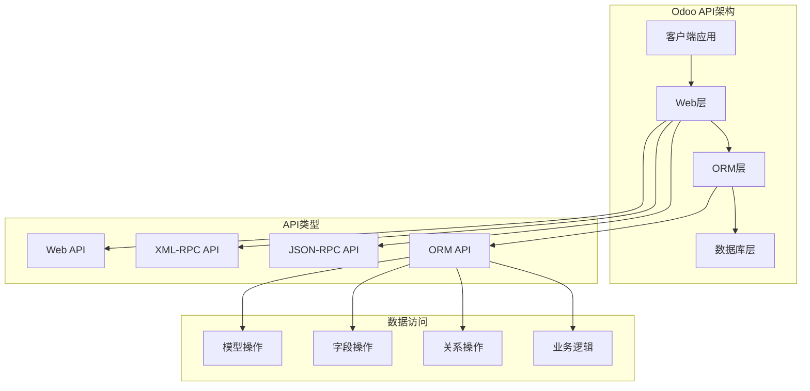

# API参考手册

## Odoo 17 API概览

Odoo 17提供了丰富的API接口，包括ORM API、Web API、XML-RPC API等。本文档详细介绍了各种API的使用方法和最佳实践。

### API架构图


## ORM API

### 模型操作

#### 基础CRUD操作
```python
# 创建记录
partner = self.env['res.partner'].create({
    'name': 'Test Partner',
    'email': 'test@example.com',
    'phone': '+1234567890'
})

# 读取记录
partner = self.env['res.partner'].browse(1)
name = partner.name
email = partner.email

# 更新记录
partner.write({
    'name': 'Updated Name',
    'email': 'updated@example.com'
})

# 删除记录
partner.unlink()
```

#### 搜索和过滤
```python
# 基础搜索
partners = self.env['res.partner'].search([
    ('is_company', '=', True),
    ('country_id', '=', 1)
])

# 搜索限制
partners = self.env['res.partner'].search([
    ('is_company', '=', True)
], limit=10, offset=0)

# 搜索计数
count = self.env['res.partner'].search_count([
    ('is_company', '=', True)
])

# 搜索读取
partners_data = self.env['res.partner'].search_read([
    ('is_company', '=', True)
], ['name', 'email', 'phone'])
```

#### 批量操作
```python
# 批量创建
partners_data = [
    {'name': 'Partner 1', 'email': 'p1@example.com'},
    {'name': 'Partner 2', 'email': 'p2@example.com'},
    {'name': 'Partner 3', 'email': 'p3@example.com'}
]
partners = self.env['res.partner'].create(partners_data)

# 批量更新
partners = self.env['res.partner'].search([('is_company', '=', True)])
partners.write({'is_company': False})

# 批量删除
partners = self.env['res.partner'].search([('active', '=', False)])
partners.unlink()
```

### 字段操作

#### 字段类型
```python
from odoo import models, fields

class MyModel(models.Model):
    _name = 'my.model'
    
    # 基础字段
    name = fields.Char('Name', required=True, size=100)
    description = fields.Text('Description')
    active = fields.Boolean('Active', default=True)
    sequence = fields.Integer('Sequence', default=10)
    price = fields.Float('Price', digits=(16, 2))
    date = fields.Date('Date')
    datetime = fields.Datetime('DateTime')
    
    # 选择字段
    state = fields.Selection([
        ('draft', 'Draft'),
        ('confirmed', 'Confirmed'),
        ('done', 'Done')
    ], 'State', default='draft')
    
    # 关系字段
    partner_id = fields.Many2one('res.partner', 'Partner')
    line_ids = fields.One2many('my.model.line', 'model_id', 'Lines')
    tag_ids = fields.Many2many('my.model.tag', 'model_tag_rel', 
                              'model_id', 'tag_id', 'Tags')
    
    # 计算字段
    total_amount = fields.Float('Total Amount', compute='_compute_total')
    
    @api.depends('line_ids.amount')
    def _compute_total(self):
        for record in self:
            record.total_amount = sum(record.line_ids.mapped('amount'))
```

#### 字段属性
```python
# 字段属性示例
name = fields.Char(
    string='Name',           # 显示标签
    required=True,           # 必填
    readonly=True,           # 只读
    invisible=True,          # 隐藏
    default='Default Value', # 默认值
    help='Field help text',  # 帮助文本
    index=True,              # 创建索引
    store=True,              # 存储到数据库
    copy=True,               # 复制时包含
    translate=True,          # 可翻译
    size=100,                # 字段大小
    trim=True,               # 去除空格
)
```

### 关系操作

#### Many2one关系
```python
# 设置关系
partner = self.env['res.partner'].browse(1)
order = self.env['sale.order'].create({
    'partner_id': partner.id,  # 使用ID
    'name': 'SO001'
})

# 访问关系字段
order = self.env['sale.order'].browse(1)
partner_name = order.partner_id.name
partner_email = order.partner_id.email

# 更新关系
order.partner_id = self.env['res.partner'].browse(2)
```

#### One2many关系
```python
# 创建子记录
order = self.env['sale.order'].browse(1)
line = self.env['sale.order.line'].create({
    'order_id': order.id,
    'product_id': 1,
    'product_uom_qty': 5,
    'price_unit': 100.0
})

# 访问子记录
order = self.env['sale.order'].browse(1)
lines = order.order_line
total_amount = sum(lines.mapped('price_subtotal'))

# 批量操作子记录
order.order_line.write({'price_unit': 120.0})
order.order_line.unlink()
```

#### Many2many关系
```python
# 添加关系
partner = self.env['res.partner'].browse(1)
tags = self.env['res.partner.tag'].search([('name', '=', 'VIP')])
partner.category_id = [(6, 0, tags.ids)]

# 添加单个关系
partner.category_id = [(4, tag.id)]

# 移除关系
partner.category_id = [(3, tag.id)]

# 替换所有关系
partner.category_id = [(6, 0, new_tags.ids)]
```

## Web API

### JSON-RPC API

#### 认证
```python
import requests
import json

# 认证URL
auth_url = 'http://localhost:8069/web/session/authenticate'

# 认证数据
auth_data = {
    'jsonrpc': '2.0',
    'method': 'call',
    'params': {
        'db': 'odoo17',
        'login': 'admin',
        'password': 'admin'
    },
    'id': 1
}

# 发送认证请求
response = requests.post(auth_url, json=auth_data)
result = response.json()

if result.get('result'):
    session_id = result['result']['session_id']
    print(f"认证成功，Session ID: {session_id}")
else:
    print("认证失败")
```

#### 模型操作
```python
# 创建记录
create_url = 'http://localhost:8069/web/dataset/call_kw'
create_data = {
    'jsonrpc': '2.0',
    'method': 'call',
    'params': {
        'model': 'res.partner',
        'method': 'create',
        'args': [{
            'name': 'API Partner',
            'email': 'api@example.com'
        }],
        'kwargs': {}
    },
    'id': 1
}

headers = {'Content-Type': 'application/json'}
cookies = {'session_id': session_id}

response = requests.post(create_url, json=create_data, headers=headers, cookies=cookies)
result = response.json()
partner_id = result['result']

# 搜索记录
search_data = {
    'jsonrpc': '2.0',
    'method': 'call',
    'params': {
        'model': 'res.partner',
        'method': 'search_read',
        'args': [[('is_company', '=', True)]],
        'kwargs': {'fields': ['name', 'email', 'phone']}
    },
    'id': 2
}

response = requests.post(create_url, json=search_data, headers=headers, cookies=cookies)
partners = response.json()['result']
```

### REST API

#### 基础操作
```python
import requests

# 基础URL
base_url = 'http://localhost:8069'
db = 'odoo17'
username = 'admin'
password = 'admin'

# 获取访问令牌
token_url = f'{base_url}/web/session/authenticate'
token_data = {
    'jsonrpc': '2.0',
    'method': 'call',
    'params': {
        'db': db,
        'login': username,
        'password': password
    }
}

response = requests.post(token_url, json=token_data)
session_id = response.json()['result']['session_id']

# 设置会话
session = requests.Session()
session.cookies.set('session_id', session_id)

# 创建记录
create_url = f'{base_url}/web/dataset/call_kw'
create_data = {
    'jsonrpc': '2.0',
    'method': 'call',
    'params': {
        'model': 'res.partner',
        'method': 'create',
        'args': [{'name': 'REST Partner', 'email': 'rest@example.com'}]
    }
}

response = session.post(create_url, json=create_data)
partner_id = response.json()['result']
```

## XML-RPC API

### 连接设置
```python
import xmlrpc.client

# 服务器配置
url = 'http://localhost:8069'
db = 'odoo17'
username = 'admin'
password = 'admin'

# 创建连接
common = xmlrpc.client.ServerProxy(f'{url}/xmlrpc/2/common')
models = xmlrpc.client.ServerProxy(f'{url}/xmlrpc/2/object')

# 认证
uid = common.authenticate(db, username, password, {})
print(f"用户ID: {uid}")
```

### 模型操作
```python
# 创建记录
partner_id = models.execute_kw(db, uid, password, 'res.partner', 'create', [{
    'name': 'XML-RPC Partner',
    'email': 'xmlrpc@example.com',
    'phone': '+1234567890'
}])
print(f"创建的合作伙伴ID: {partner_id}")

# 搜索记录
partner_ids = models.execute_kw(db, uid, password, 'res.partner', 'search', [[
    ('is_company', '=', True)
]])
print(f"找到的公司: {partner_ids}")

# 读取记录
partners = models.execute_kw(db, uid, password, 'res.partner', 'read', [partner_ids], {
    'fields': ['name', 'email', 'phone']
})
print(f"合作伙伴数据: {partners}")

# 更新记录
models.execute_kw(db, uid, password, 'res.partner', 'write', [partner_ids, {
    'phone': '+9876543210'
}])

# 删除记录
models.execute_kw(db, uid, password, 'res.partner', 'unlink', [partner_ids])
```

### 批量操作
```python
# 批量创建
partners_data = [
    {'name': 'Partner 1', 'email': 'p1@example.com'},
    {'name': 'Partner 2', 'email': 'p2@example.com'},
    {'name': 'Partner 3', 'email': 'p3@example.com'}
]

partner_ids = models.execute_kw(db, uid, password, 'res.partner', 'create', [partners_data])
print(f"批量创建的ID: {partner_ids}")

# 批量更新
models.execute_kw(db, uid, password, 'res.partner', 'write', [partner_ids, {
    'is_company': True
}])

# 批量删除
models.execute_kw(db, uid, password, 'res.partner', 'unlink', [partner_ids])
```

## 高级API功能

### 工作流操作
```python
# 触发工作流
order = self.env['sale.order'].browse(1)
order.action_confirm()  # 确认订单
order.action_invoice_create()  # 创建发票

# 检查工作流状态
if order.state == 'sale':
    print("订单已确认")
elif order.state == 'done':
    print("订单已完成")
```

### 报表生成
```python
# 生成PDF报表
report = self.env['ir.actions.report']._get_report_from_name('sale.report_saleorder')
pdf_data = report._render_qweb_pdf(order.ids)

# 保存PDF文件
with open('sale_order.pdf', 'wb') as f:
    f.write(pdf_data[0])
```

### 邮件发送
```python
# 发送邮件
template = self.env.ref('sale.email_template_edi_sale')
template.send_mail(order.id, force_send=True)

# 自定义邮件
mail_values = {
    'subject': 'Custom Subject',
    'body_html': '<p>Custom email body</p>',
    'email_to': 'customer@example.com',
    'email_from': 'sales@company.com'
}
mail = self.env['mail.mail'].create(mail_values)
mail.send()
```

### 文件操作
```python
# 上传文件
attachment = self.env['ir.attachment'].create({
    'name': 'document.pdf',
    'datas': base64.b64encode(file_content),
    'res_model': 'sale.order',
    'res_id': order.id
})

# 下载文件
file_content = base64.b64decode(attachment.datas)
with open('downloaded_file.pdf', 'wb') as f:
    f.write(file_content)
```

## API最佳实践

### 性能优化
```python
# 使用search_read替代search+read
# 不推荐
partner_ids = self.env['res.partner'].search([('is_company', '=', True)])
partners = partner_ids.read(['name', 'email'])

# 推荐
partners = self.env['res.partner'].search_read([
    ('is_company', '=', True)
], ['name', 'email'])

# 使用with_context优化
partners = self.env['res.partner'].with_context(active_test=False).search([
    ('is_company', '=', True)
])

# 批量操作
# 不推荐
for partner in partners:
    partner.write({'phone': '+1234567890'})

# 推荐
partners.write({'phone': '+1234567890'})
```

### 错误处理
```python
try:
    # API操作
    partner = self.env['res.partner'].create({
        'name': 'Test Partner',
        'email': 'invalid-email'  # 无效邮箱
    })
except ValidationError as e:
    print(f"验证错误: {e}")
except UserError as e:
    print(f"用户错误: {e}")
except Exception as e:
    print(f"未知错误: {e}")
```

### 事务管理
```python
# 使用事务
with self.env.cr.savepoint():
    try:
        # 操作1
        partner = self.env['res.partner'].create({'name': 'Partner 1'})
        
        # 操作2
        order = self.env['sale.order'].create({
            'partner_id': partner.id,
            'name': 'SO001'
        })
        
        # 提交事务
        self.env.cr.commit()
    except Exception as e:
        # 回滚事务
        self.env.cr.rollback()
        raise e
```

## API安全

### 权限控制
```python
# 检查权限
if not self.env.user.has_group('base.group_user'):
    raise AccessError("权限不足")

# 使用sudo提升权限
admin_partner = self.env['res.partner'].sudo().create({
    'name': 'Admin Partner'
})

# 检查记录权限
if not self.env['res.partner'].check_access_rights('read', raise_exception=False):
    raise AccessError("无读取权限")
```

### 数据验证
```python
# 输入验证
@api.model
def create(self, vals):
    # 验证邮箱格式
    if vals.get('email') and '@' not in vals['email']:
        raise ValidationError("邮箱格式不正确")
    
    # 验证必填字段
    if not vals.get('name'):
        raise ValidationError("名称不能为空")
    
    return super().create(vals)
```

## 相关链接
- [[官方文档导航]] - 官方文档导航
- [[开发者指南]] - 开发指南
- [[ORM参考]] - ORM详细参考
- [[Web API指南]] - Web API指南
- [[XML-RPC指南]] - XML-RPC指南
