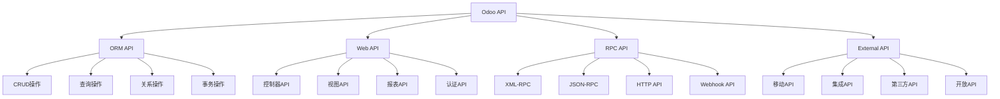

# API参考手册

## 🎯 概述

Odoo API参考手册提供完整的API接口说明，包括ORM API、Web API、RPC API等核心接口的详细使用方法、参数说明和示例代码。

## 📊 API分类

### API分类结构图


## 🔧 ORM API详细参考

### 基础CRUD操作
```python
# ORM API参考示例

class ORMAPIRef(models.Model):
    """ORM API参考示例"""
    _name = 'orm.api.reference'
    _description = 'ORM API参考示例'
    
    name = fields.Char(string='名称')
    amount = fields.Float(string='金额')
    partner_id = fields.Many2one('res.partner', string='客户')
    
    # CREATE操作示例
    def api_create_examples(self):
        """CREATE API示例"""
        # 单记录创建
        record = self.env['orm.api.reference'].create({
            'name': '测试记录',
            'amount': 100.0,
            'partner_id': 1
        })
        
        # 批量创建（支持）
        records = self.env['orm.api.reference'].create([
            {'name': '记录1', 'amount': 100.0},
            {'name': '记录2', 'amount': 200.0},
            {'name': '记录3', 'amount': 300.0},
        ])
        
        # 带返回ID的创建
        record_id = (self.env['orm.api.reference'].create({
            'name': '新记录'
        })).id
        
        return records
    
    # READ操作示例
    def api_read_examples(self):
        """READ API示例"""
        # 搜索记录
        records = self.env['orm.api.reference'].search([
            ('amount', '>', 100)
        ])
        
        # 搜索并限制数量
        limited_records = self.env['orm.api.reference'].search([
            ('active', '=', True)
        ], limit=10, offset=0)
        
        # 读取特定字段
        field_data = records.read(['name', 'amount'])
        
        # 搜索并读取（高效方法）
        search_read_data = self.env['orm.api.reference'].search_read([
            ('partner_id', '!=', False)
        ], fields=['name', 'partner_id'])
        
        # 获取记录数
        count = self.env['orm.api.reference'].search_count([
            ('amount', '>', 0)
        ])
        
        return {
            'records': records,
            'field_data': field_data,
            'count': count
        }
    
    # UPDATE操作示例
    def api_write_examples(self):
        """UPDATE API示例"""
        # 单记录更新
        record = self.env['orm.api.reference'].browse(1)
        record.write({
            'name': '更新名称',
            'amount': 500.0
        })
        
        # 批量更新
        records = self.env['orm.api.reference'].search([
            ('amount', '<', 100)
        ])
        records.write({
            'amount': 0.0
        })
        
        # 一次性更新多个字段
        self.env['orm.api.reference'].search([]).write({
            'active': False
        })
    
    # DELETE操作示例
    def api_delete_examples(self):
        """DELETE API示例"""
        # 单记录删除
        record = self.env['orm.api.reference'].browse(1)
        record.unlink()
        
        # 批量删除
        records = self.env['orm.api.reference'].search([
            ('active', '=', False)
        ])
        records.unlink()
        
        # 安全检查删除
        if records.exists():
            records.unlink()
```

### 高级查询操作
```python
class AdvancedQueryExamples(models.Model):
    """高级查询示例"""
    _name = 'advanced.query.examples'
    _description = '高级查询示例'
    
    def query_methods_examples(self):
        """查询方法示例"""
        
        # 1. filtered() - 过滤记录集
        all_records = self.env['res.partner'].search([])
        
        # 过滤激活的客户
        active_customers = all_records.filtered(
            lambda r: r.active and r.customer_rank > 0
        )
        
        # 过滤有邮箱的客户
        email_partners = all_records.filtered('email')
        
        # 2. mapped() - 提取字段值
        customer_names = active_customers.mapped('name')
        customer_ids = active_customers.mapped('id')
        
        # 映射到计算值
        customer_totals = active_customers.mapped(
            lambda r: r.total_amount if r.total_amount else 0
        )
        
        # 3. sorted() - 排序记录集
        sorted_by_name = all_records.sorted('name')
        sorted_by_amount = all_records.sorted(lambda r: r.total_amount, reverse=True)
        
        # 4. sudo() - 切换用户权限
        admin_records = self.env['res.partner'].sudo().search([
            ('active', '=', False)
        ])
        
        # 5. with_context() - 添加上下文
        context_records = self.env['res.partner'].with_context(
            lang='en_US'
        ).search([])
        
        # 6. browse() - 通过ID获取记录
        specific_record = self.env['res.partner'].browse([1, 2, 3])
        
        return {
            'active_customers': active_customers,
            'names': customer_names,
            'sorted_records': sorted_by_name
        }
    
    def domain_construction_examples(self):
        """Domain构建示例"""
        
        # 基础domain
        base_domain = [('active', '=', True)]
        
        # 动态domain构建
        def build_search_domain(name=None, email=None, amount_min=None):
            domain = []
            
            if name:
                domain.append(('name', 'ilike', name))
            
            if email:
                domain.append(('email', 'ilike', email))
            
            if amount_min is not None:
                domain.append(('total_amount', '>=', amount_min))
            
            return domain or [('id', '=', False)]
        
        # 复杂domain示例
        complex_domain = [
            '&',  # AND操作符
            ('active', '=', True),
            '|',  # OR操作符
            ('customer_rank', '>', 0),
            ('supplier_rank', '>', 0),
            ('create_date', '>=', '2024-01-01'),
            ('company_id', '=', self.env.company.id)
        ]
        
        # 使用动态domain
        search_domain = build_search_domain(
            name='Acme',
            email='@company.com',
            amount_min=1000
        )
        
        results = self.env['res.partner'].search(search_domain)
        
        return results
```

## 🌐 Web API详细参考

### 控制器API
```python
# controllers/controller_api_examples.py
from odoo import http, fields
from odoo.http import request
import json

class ControllerAPIExamples(http.Controller):
    """控制器API示例"""
    
    @http.route('/api/partners', type='http', auth='public', methods=['GET'], csrf=False)
    def get_partners_api(self, limit=20, offset=0, **kwargs):
        """获取合作伙伴列表API"""
        try:
            # 权限检查
            if not request.env.user.has_group('base.group_user'):
                return self._error_response(403, 'Access denied')
            
            # 构建domain
            domain = []
            if kwargs.get('name'):
                domain.append(('name', 'ilike', kwargs['name']))
            if kwargs.get('active'):
                domain.append(('active', '=', kwargs['active'] == 'true'))
            
            # 搜索记录
            partners = request.env['res.partner'].search(
                domain, limit=int(limit), offset=int(offset)
            )
            
            # 构建响应数据
            data = []
            for partner in partners:
                data.append({
                    'id': partner.id,
                    'name': partner.name,
                    'email': partner.email,
                    'phone': partner.phone,
                    'city': partner.city,
                    'active': partner.active,
                    'create_date': partner.create_date.isoformat() if partner.create_date else None
                })
            
            # 获取总数
            total_count = request.env['res.partner'].search_count(domain)
            
            return self._success_response({
                'partners': data,
                'total': total_count,
                'limit': int(limit),
                'offset': int(offset)
            })
            
        except Exception as e:
            return self._error_response(500, str(e))
    
    @http.route('/api/partners/<int:partner_id>', type='http', auth='public', methods=['GET'], csrf=False)
    def get_partner_detail(self, partner_id):
        """获取单个合作伙伴详情API"""
        try:
            partner = request.env['res.partner'].sudo().browse(partner_id)
            
            if not partner.exists():
                return self._error_response(404, 'Partner not found')
            
            data = {
                'id': partner.id,
                'name': partner.name,
                'email': partner.email,
                'phone': partner.phone,
                'street': partner.street,
                'street2': partner.street2,
                'city': partner.city,
                'zip': partner.zip,
                'country': partner.country_id.name if partner.country_id else None,
                'customer_rank': partner.customer_rank,
                'supplier_rank': partner.supplier_rank,
                'website': partner.website,
                'create_date': partner.create_date.isoformat() if partner.create_date else None
            }
            
            return self._success_response(data)
            
        except Exception as e:
            return self._error_response(500, str(e))
    
    @http.route('/api/partners', type='http', auth='public', methods=['POST'], csrf=False)
    def create_partner_api(self, **kwargs):
        """创建合作伙伴API"""
        try:
            if not request.env.user.has_group('base.group_group_manager'):
                return self._error_response(403, 'Insufficient permissions')
            
            # 解析请求数据
            data = json.loads(request.httprequest.data.decode('utf-8'))
            
            # 验证必需字段
            required_fields = ['name']
            for field in required_fields:
                if not data.get(field):
                    return self._error_response(400, f'Missing required field: {field}')
            
            # 创建合作伙伴
            partner_vals = {
                'name': data['name'],
                'email': data.get('email'),
                'phone': data.get('phone'),
                'street': data.get('street'),
                'city': data.get('city'),
                'zip': data.get('zip'),
                'website': data.get('website'),
                'customer_rank': 1 if data.get('is_customer') else 0,
                'supplier_rank': 1 if data.get('is_supplier') else 0,
            }
            
            partner = request.env['res.partner'].create(partner_vals)
            
            return self._success_response({
                'id': partner.id,
                'message': 'Partner created successfully'
            })
            
        except json.JSONDecodeError:
            return self._error_response(400, 'Invalid JSON data')
        except Exception as e:
            return self._error_response(500, str(e))
    
    @http.route('/api/partners/<int:partner_id>', type='http', auth='public', methods=['PUT'], csrf=False)
    def update_partner_api(self, partner_id, **kwargs):
        """更新合作伙伴API"""
        try:
            partner = request.env['res.partner'].sudo().browse(partner_id)
            
            if not partner.exists():
                return self._error_response(404, 'Partner not found')
            
            # 权限检查 - 只能更新自己的客户
            if not partner.user_id == request.env.user and \
               not request.env.user.has_group('base.group_system'):
                return self._error_response(403, 'Access denied')
            
            # 解析更新数据
            data = json.loads(request.httprequest.data.decode('utf-8'))
            
            # 构建更新值
            update_vals = {}
            for field in ['name', 'email', 'phone', 'street', 'city', 'zip', 'website']:
                if field in data:
                    update_vals[field] = data[field]
            
            # 执行更新
            partner.write(update_vals)
            
            return self._success_response({
                'message': 'Partner updated successfully'
            })
            
        except Exception as e:
            return self._error_response(500, str(e))
    
    @http.route('/api/partners/<int:partner_id>', type='http', auth='public', methods=['DELETE'], csrf=False)
    def delete_partner_api(self, partner_id):
        """删除合作伙伴API"""
        try:
            partner = request.env['res.partner'].sudo().browse(partner_id)
            
            if not partner.exists():
                return self._error_response(404, 'Partner not found')
            
            # 权限检查
            if not request.env.user.has_group('base.group_system'):
                return self._error_response(403, 'Insufficient permissions')
            
            # 检查是否有相关的销售订单
            sale_orders = request.env['sale.order'].search([
                ('partner_id', '=', partner_id),
                ('state', '!=', 'cancel')
            ])
            
            if sale_orders:
                return self._error_response(400, 'Cannot delete partner with active orders')
            
            # 执行删除
            partner.unlink()
            
            return self._success_response({
                'message': 'Partner deleted successfully'
            })
            
        except Exception as e:
            return self._error_response(500, str(e))
    
    def _success_response(self, data, status_code=200):
        """成功响应格式"""
        response_data = {
            'status': 'success',
            'data': data,
            'timestamp': fields.Datetime.now().isoformat()
        }
        
        return request.make_json_response(response_data, status_code)
    
    def _error_response(self, status_code, message):
        """错误响应格式"""
        response_data = {
            'status': 'ERROR',
            'message': message,
            'timestamp': fields.Datetime.now().isoformat()
        }
        
        return request.make_json_response(response_data, status_code)
```

### JSON-RPC API示例
```python
# jsonrpc_api.py
class JSONRPCAPIExamples:
    """JSON-RPC API示例"""
    
    def authenticate_example(self):
        """认证示例"""
        import requests
        import json
        
        url = 'http://localhost:8069/jsonrpc'
        
        headers = {
            'Content-Type': 'application/json',
        }
        
        # 认证
        auth_payload = {
            'jsonrpc': '2.0',
            'method': 'call',
            'params': {
                'service': 'common',
                'method': 'authenticate',
                'args': [
                    'my_database',  # 数据库名
                    'admin',        # 用户名
                    'password',     # 密码
                    {}             # User agent环境
                ]
            },
            'id': 1
        }
        
        response = requests.post(url, headers=headers, data=json.dumps(auth_payload))
        uid = response.json()['result']
        
        return uid
    
    def search_example(self, uid):
        """搜索示例"""
        import requests
        import json
        
        url = 'http://localhost:8069/jsonrpc'
        headers = {'Content-Type': 'application/json'}
        
        # 搜索记录
        search_payload = {
            'jsonrpc': '2.0',
            'method': 'call',
            'params': {
                'service': 'object',
                'method': 'execute_kw',
                'args': [
                    'my_database',       # 数据库名
                    uid,                 # 用户ID
                    'password',          # 密码
                    'res.partner',       # 模型名
                    'search',            # 方法名
                    [[['customer_rank', '>', 0]]], # 搜索条件
                ],
                'kwargs': {'limit': 5}
            },
            'id': 2
        }
        
        response = requests.post(url, headers=headers, data=json.dumps(search_payload))
        partner_ids = response.json()['result']
        
        return partner_ids
    
    def read_example(self, uid, record_ids):
        """读取示例"""
        import requests
        import json
        
        url = 'http://localhost:8069/jsonrpc'
        headers = {'Content-Type': 'application/json'}
        
        # 读取记录
        read_payload = {
            'jsonrpc': '2.0',
            'method': 'call',
            'params': {
                'service': 'object',
                'method': 'execute_kw',
                'args': [
                    'my_database',       # 数据库名
                    uid,                 # 用户ID
                    'password',          # 密码
                    'res.partner',       # 模型名
                    'read',              # 方法名
                    [record_ids],        # 记录ID列表
                ],
                'kwargs': {
                    'fields': ['name', 'email', 'phone']
                }
            },
            'id': 3
        }
        
        response = requests.post(url, headers=headers, data=json.dumps(read_payload))
        partner_data = response.json()['result']
        
        return partner_data
    
    def create_example(self, uid):
        """创建示例"""
        import requests
        import json
        
        url = 'http://localhost:8069/jsonrpc'
        headers = {'Content-Type': 'application/json'}
        
        # 创建记录
        create_payload = {
            'jsonrpc': '2.0',
            'method': 'call',
            'params': {
                'service': 'object',
                'method': 'execute_kw',
                'args': [
                    'my_database',       # 数据库名
                    uid,                 # 用户ID
                    'password',          # 密码
                    'res.partner',       # 模型名
                    'create',            # 方法名
                    [{'name': 'New Customer', 'customer_rank': 1}], # 记录数据
                ]
            },
            'id': 4
        }
        
        response = requests.post(url, headers=headers, data=json.dumps(create_payload))
        partner_id = response.json()['result']
        
        return partner_id
    
    def complete_workflow_example(self):
        """完整工作流示例"""
        uid = self.authenticate_example()
        partner_ids = self.search_example(uid)
        partner_data = self.read_example(uid, partner_ids)
        new_partner_id = self.create_example(uid)
        
        return {
            'user_id': uid,
            'existing_partners': partner_data,
            'new_partner_id': new_partner_id
        }
```

## 📊 Webhook API参考

### Webhook实现示例
```python
# models/webhook_handlers.py
from odoo import models, fields, api, http
from odoo.http import request
import json
import hmac
import hashlib

class WebhookHandlers(models.Model):
    """Webhook处理器"""
    _name = 'webhook.handlers'
    _description = 'Webhook处理器'
    
    name = fields.Char(string='处理器名称', required=True)
    url = fields.Char(string='Webhook URL', required=True)
    secret_key = fields.Char(string='密钥')
    active = fields.Boolean(string='激活', default=True)
    events = fields.Selection([
        ('partner_created', '客户创建'),
        ('partner_updated', '客户更新'),
        ('order_created', '订单创建'),
        ('order_confirmed', '订单确认'),
        ('payment_received', '收到付款'),
    ], string='事件类型')
    
    @api.model
    def trigger_webhook(self, event_type, data, model_name=None, record_id=None):
        """触发Webhook"""
        webhooks = self.search([
            ('active', '=', True),
            ('events', '=', event_type)
        ])
        
        for webhook in webhooks:
            webhook._send_webhook(event_type, data, model_name, record_id)
    
    def _send_webhook(self, event_type, data, model_name=None, record_id=None):
        """发送Webhook"""
        import requests
        
        # 构建载荷
        payload = {
            'event': event_type,
            'timestamp': fields.Datetime.now().isoformat(),
            'data': data
        }
        
        if model_name and record_id:
            payload.update({
                'model': model_name,
                'record_id': record_id
            })
        
        # 签名（如果有密钥）
        headers = {'Content-Type': 'application/json'}
        if self.secret_key:
            signature = self._generate_signature(payload, self.secret_key)
            headers['X-Signature'] = signature
        
        try:
            response = requests.post(
                self.url,
                json=payload,
                headers=headers,
                timeout=30
            )
            
            if response.status_code == 200:
                _logger.info(f"Webhook {self.name} 发送成功")
            else:
                _logger.warning(f"Webhook {self.name} 发送失败: {response.status_code}")
                
        except Exception as e:
            _logger.error(f"Webhook {self.name} 发送异常: {str(e)}")
    
    def _generate_signature(self, payload, secret):
        """生成签名"""
        payload_str = json.dumps(payload, sort_keys=True)
        signature = hmac.new(
            secret.encode('utf-8'),
            payload_str.encode('utf-8'),
            hashlib.sha256
        ).hexdigest()
        
        return f"sha256={signature}"
```

## 🔗 相关链接

### API文档
- [[ORM API详解]] - ORM API完整文档
- [[Web API详解]] - Web API完整文档
- [[RPC API详解]] - RPC API完整文档

### 开发指南
- [[API开发最佳实践]] - API开发最佳实践
- [[安全性指南]] - API安全性指南
- [[性能优化]] - API性能优化

## 📝 API使用总结

### API选择指南
- **内部开发**: 优先使用ORM API，简单高效
- **外部集成**: 使用RPC API或HTTP API
- **移动应用**: 使用JSON-RPC REST API
- **批量操作**: 使用RPC API的批量方法

### 最佳实践
- **参数验证**: 严格验证输入参数
- **错误处理**: 完善的错误处理机制
- **权限控制**: 合理设置API访问权限
- **性能监控**: 监控API调用性能
- **版本管理**: 合理管理API版本

### 安全考虑
- **认证机制**: 实现安全的认证方式
- **数据验证**: 验证所有输入数据
- **权限控制**: 限制API访问权限
- **日志记录**: 记录API调用日志
- **防攻击**: 防范SQL注入、XSS等攻击

---

**文档版本**: v1.0.0  
**对应Odoo版本**: 16.0  
**最后更新**: 2024年
